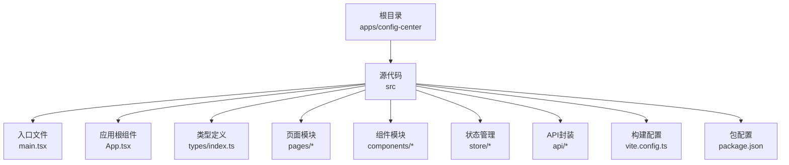
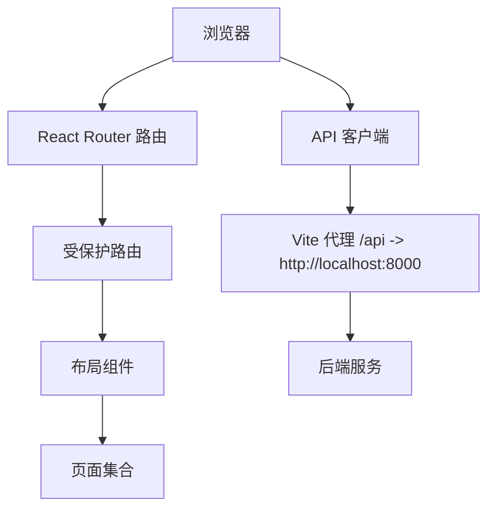
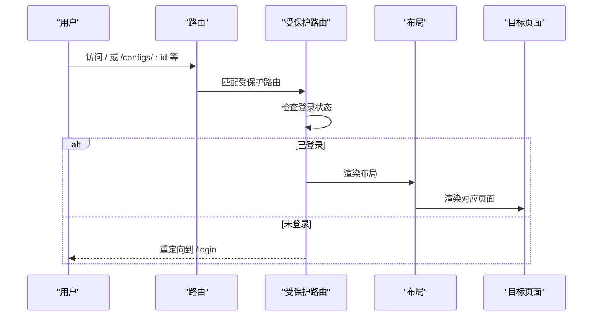
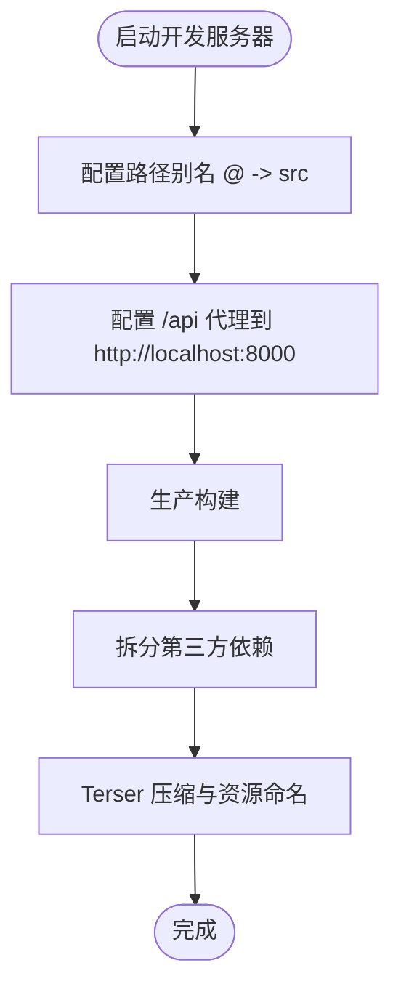
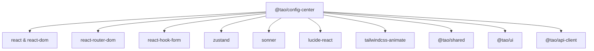

# 配置管理中心

<cite>
**本文引用的文件**
- [apps/config-center/src/App.tsx](file://apps/config-center/src/App.tsx)
- [apps/config-center/src/main.tsx](file://apps/config-center/src/main.tsx)
- [apps/config-center/src/types/index.ts](file://apps/config-center/src/types/index.ts)
- [apps/config-center/vite.config.ts](file://apps/config-center/vite.config.ts)
- [apps/config-center/package.json](file://apps/config-center/package.json)
</cite>

## 目录
1. [简介](#简介)
2. [项目结构](#项目结构)
3. [核心组件](#核心组件)
4. [架构总览](#架构总览)
5. [详细组件分析](#详细组件分析)
6. [依赖分析](#依赖分析)
7. [性能考虑](#性能考虑)
8. [故障排查指南](#故障排查指南)
9. [结论](#结论)
10. [附录](#附录)

## 简介
本项目是“配置管理中心”，一个基于 React 的前端应用，提供配置管理、用户与角色权限管理、版本控制与差异对比、审计日志查看以及仪表板等能力。应用通过受保护路由进行访问控制，使用状态管理与表单库提升开发效率，并通过代理将前端请求转发至后端服务。

## 项目结构
配置管理中心采用按功能分层的组织方式：入口与路由在顶层，页面按功能模块划分，组件以布局与业务组件分离，类型定义集中于统一的类型文件，构建配置通过 Vite 完成。

图表来源
- [apps/config-center/src/main.tsx:1-11](file://apps/config-center/src/main.tsx#L1-L11)
- [apps/config-center/src/App.tsx:1-39](file://apps/config-center/src/App.tsx#L1-L39)
- [apps/config-center/src/types/index.ts:1-163](file://apps/config-center/src/types/index.ts#L1-L163)
- [apps/config-center/vite.config.ts:1-41](file://apps/config-center/vite.config.ts#L1-L41)
- [apps/config-center/package.json:1-41](file://apps/config-center/package.json#L1-L41)

章节来源
- [apps/config-center/src/main.tsx:1-11](file://apps/config-center/src/main.tsx#L1-L11)
- [apps/config-center/src/App.tsx:1-39](file://apps/config-center/src/App.tsx#L1-L39)
- [apps/config-center/src/types/index.ts:1-163](file://apps/config-center/src/types/index.ts#L1-L163)
- [apps/config-center/vite.config.ts:1-41](file://apps/config-center/vite.config.ts#L1-L41)
- [apps/config-center/package.json:1-41](file://apps/config-center/package.json#L1-L41)

## 核心组件
- 应用根组件负责路由注册与全局提示器挂载，确保受保护路由包裹所有需要鉴权的页面。
- 页面模块提供仪表板、配置列表、配置详情、版本管理、审计日志、用户与角色管理等页面。
- 类型定义集中了环境、配置值类型、状态、变更类型、审计动作、用户与角色权限模型等，保证前后端契约一致。
- 构建配置启用路径别名、代理后端接口、拆分第三方依赖并优化产物体积。

章节来源
- [apps/config-center/src/App.tsx:14-38](file://apps/config-center/src/App.tsx#L14-L38)
- [apps/config-center/src/types/index.ts:1-163](file://apps/config-center/src/types/index.ts#L1-L163)
- [apps/config-center/vite.config.ts:5-40](file://apps/config-center/vite.config.ts#L5-L40)

## 架构总览
应用采用前端单页应用（SPA）架构，通过 React Router 进行客户端路由；受保护路由确保只有登录态用户可访问后台页面；全局提示器用于反馈操作结果；Vite 提供开发服务器与打包能力，并通过代理将 /api 请求转发到后端服务。

图表来源
- [apps/config-center/src/App.tsx:1-39](file://apps/config-center/src/App.tsx#L1-L39)
- [apps/config-center/vite.config.ts:12-16](file://apps/config-center/vite.config.ts#L12-L16)

章节来源
- [apps/config-center/src/App.tsx:1-39](file://apps/config-center/src/App.tsx#L1-L39)
- [apps/config-center/vite.config.ts:12-16](file://apps/config-center/vite.config.ts#L12-L16)

## 详细组件分析

### 路由与页面映射
- 登录页：独立路由，无需鉴权。
- 受保护路由：包裹仪表板、配置列表、配置详情、版本、审计、用户、角色等页面。
- 全局提示器：使用通知组件在右上角显示操作反馈。

图表来源
- [apps/config-center/src/App.tsx:17-33](file://apps/config-center/src/App.tsx#L17-L33)

章节来源
- [apps/config-center/src/App.tsx:14-38](file://apps/config-center/src/App.tsx#L14-L38)

### 数据模型与类型体系
类型定义覆盖配置、版本、审计、用户与角色权限等核心领域，包括：
- 环境枚举、配置值类型、状态枚举、变更类型、审计动作与状态
- 配置创建/更新/响应模型
- 版本响应与差异对比结果
- 审计日志响应模型
- 用户创建/更新/响应模型
- 角色权限模型与系统角色标识
- 登录响应模型

```mermaid
classDiagram
class ConfigCreate {
+string key
+Environment environment
+string service
+unknown value
+ConfigValueType value_type
+string[] tags
+ConfigStatus status
}
class ConfigUpdate {
+unknown value
+ConfigValueType value_type
+string description
+string[] tags
+ConfigStatus status
}
class ConfigResponse {
+string id
+string key
+Environment environment
+string service
+unknown value
+ConfigValueType value_type
+string description
+string schema_id
+string[] tags
+ConfigStatus status
+number version
+string created_by
+string updated_by
+string created_at
+string updated_at
}
class ConfigVersionResponse {
+string id
+string config_id
+string config_key
+number version
+unknown value
+string changed_by
+string change_reason
+ChangeType change_type
+Record diff_summary
+boolean is_rollback_target
+string created_at
}
class AuditLogResponse {
+string id
+AuditAction action
+string resource_type
+string resource_id
+string resource_key
+string actor_id
+string actor_name
+string actor_ip
+unknown old_value
+unknown new_value
+AuditStatus status
+Record metadata
+string timestamp
}
class UserCreate {
+string username
+string password
+string email
+string display_name
+string[] role_ids
}
class UserUpdate {
+string email
+string display_name
+boolean is_active
+string[] role_ids
}
class UserResponse {
+string id
+string username
+string email
+string display_name
+boolean is_active
+string[] role_ids
+string last_login
+string created_at
+string updated_at
}
class RoleCreate {
+string name
+Permission[] permissions
+string[] environment_scope
+string[] service_scope
}
class RoleUpdate {
+string description
+Permission[] permissions
+string[] environment_scope
+string[] service_scope
}
class RoleResponse {
+string id
+string name
+string description
+Permission[] permissions
+string[] environment_scope
+string[] service_scope
+boolean is_system
+string created_at
+string updated_at
}
class LoginResponse {
+string access_token
+string refresh_token
+string token_type
}
```

图表来源
- [apps/config-center/src/types/index.ts:15-162](file://apps/config-center/src/types/index.ts#L15-L162)

章节来源
- [apps/config-center/src/types/index.ts:1-163](file://apps/config-center/src/types/index.ts#L1-L163)

### 构建与开发配置
- 路径别名：通过 @ 指向 src 目录，简化导入路径。
- 开发服务器代理：将 /api 前缀请求转发到本地后端服务地址。
- 第三方依赖拆分：将 react、react-router-dom、UI 组件库分别打包，提升缓存命中率。
- 生产构建优化：启用 Terser 压缩、去除 console 与 debugger、输出带哈希的资源文件名。

图表来源
- [apps/config-center/vite.config.ts:7-39](file://apps/config-center/vite.config.ts#L7-L39)

章节来源
- [apps/config-center/vite.config.ts:1-41](file://apps/config-center/vite.config.ts#L1-L41)
- [apps/config-center/package.json:6-25](file://apps/config-center/package.json#L6-L25)

## 依赖分析
- 运行时依赖：React 生态、路由、表单库、状态管理、通知组件、图标库、样式工具等。
- 构建依赖：Vite、React 插件、TailwindCSS、TypeScript、测试框架等。
- 项目内依赖：共享库与 UI 组件库通过工作区链接，减少重复打包。

图表来源
- [apps/config-center/package.json:14-26](file://apps/config-center/package.json#L14-L26)

章节来源
- [apps/config-center/package.json:1-41](file://apps/config-center/package.json#L1-L41)

## 性能考虑
- 代码分割：通过手动分包策略将核心第三方库拆分为独立 chunk，提升缓存复用。
- 构建优化：生产环境移除调试语句与日志，减小包体体积。
- 资源命名：输出文件带哈希，便于长期缓存与灰度发布。
- 开发体验：代理配置避免跨域问题，提升联调效率。

## 故障排查指南
- 登录后无法进入后台页面
  - 检查受保护路由是否正确包裹布局与页面。
  - 确认登录状态与令牌有效性。
- 接口 404 或跨域
  - 检查 Vite 代理配置是否指向正确的后端地址。
  - 确认请求路径是否以 /api 前缀。
- 打包体积过大或缓存命中率低
  - 检查第三方依赖拆分策略与资源命名规则。
  - 关注是否引入了不必要的 polyfill 或调试代码。

章节来源
- [apps/config-center/src/App.tsx:19-33](file://apps/config-center/src/App.tsx#L19-L33)
- [apps/config-center/vite.config.ts:12-16](file://apps/config-center/vite.config.ts#L12-L16)

## 结论
配置管理中心以清晰的类型体系、受保护路由与代理配置为基础，提供了完整的前端骨架。通过模块化页面与组件设计，能够快速扩展配置管理、用户与角色权限、版本控制与审计等功能。建议后续完善页面与组件的具体实现细节，并补充 API 集成与安全策略文档。

## 附录
- 快速开始
  - 安装依赖：使用包管理器安装工作区依赖。
  - 启动开发：运行开发服务器，访问本地地址。
  - 联调后端：确认 /api 代理已生效，后端服务正常运行。
- 安全建议
  - 在受保护路由中增加权限校验逻辑。
  - 对敏感字段（如密钥）在前端进行最小化暴露与渲染控制。
  - 使用 HTTPS 与安全的 Cookie 属性部署生产环境。
- 扩展方向
  - 补充配置表单验证与提交流程。
  - 实现版本差异对比与回滚操作。
  - 增加审计日志筛选与导出功能。
  - 优化布局组件的响应式与无障碍体验。