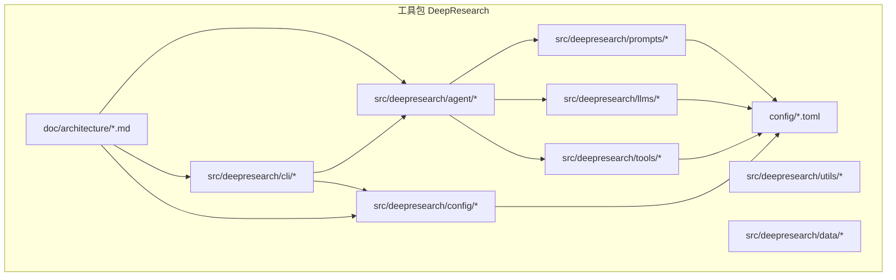
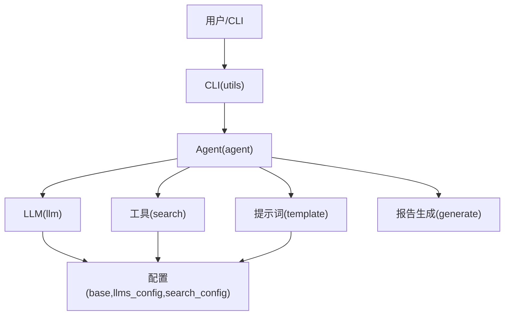
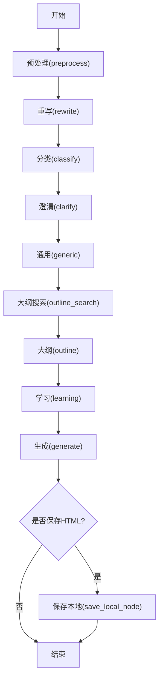
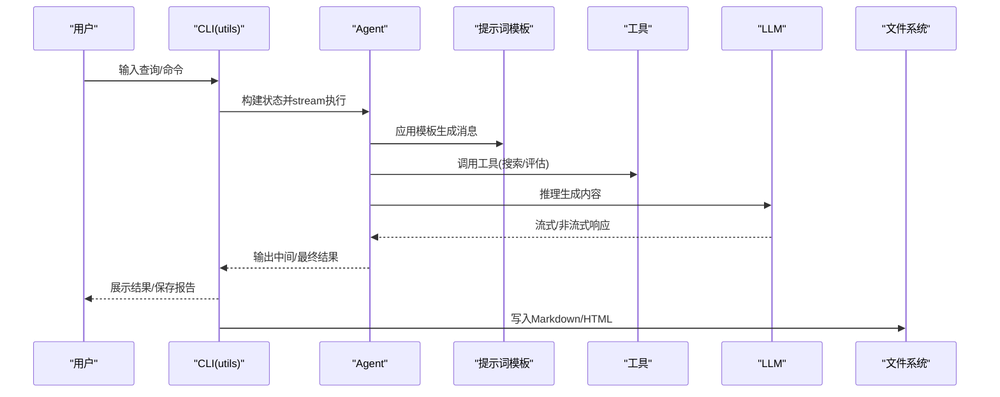
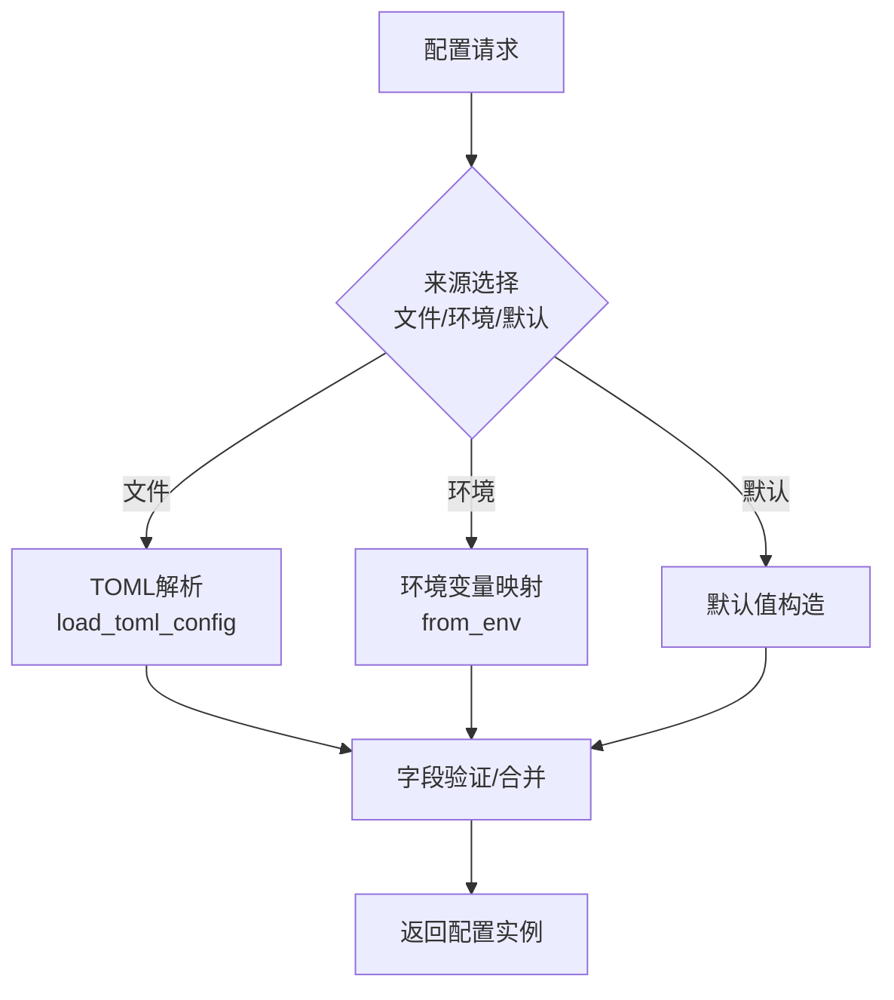
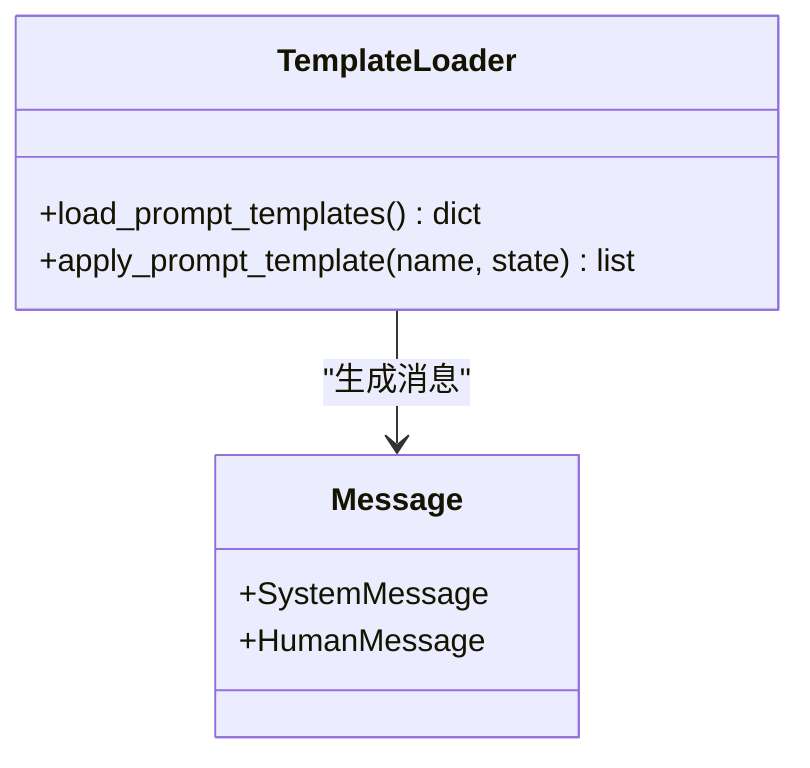
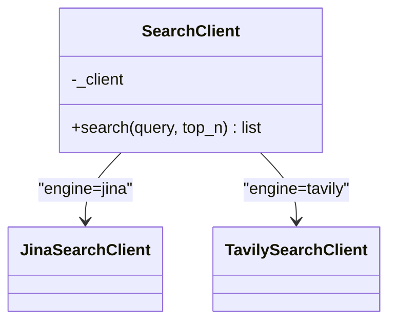
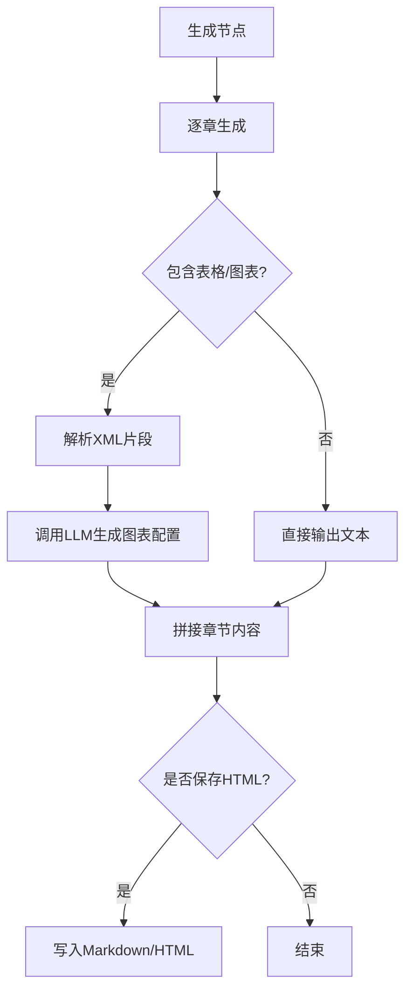
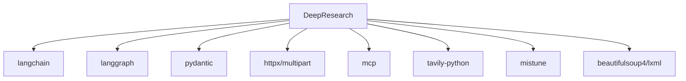

# DeepResearch深度研究框架

<cite>
**本文引用的文件**
- [README.md](file://tools/DeepResearch/README.md)
- [pyproject.toml](file://tools/DeepResearch/pyproject.toml)
- [__init__.py](file://tools/DeepResearch/src/deepresearch/__init__.py)
- [_version.py](file://tools/DeepResearch/src/deepresearch/_version.py)
- [agent.py](file://tools/DeepResearch/src/deepresearch/agent/agent.py)
- [utils.py](file://tools/DeepResearch/src/deepresearch/cli/utils.py)
- [base.py](file://tools/DeepResearch/src/deepresearch/config/base.py)
- [llms_config.py](file://tools/DeepResearch/src/deepresearch/config/llms_config.py)
- [search_config.py](file://tools/DeepResearch/src/deepresearch/config/search_config.py)
- [workflow.toml](file://tools/DeepResearch/config/workflow.toml)
- [generate.py](file://tools/DeepResearch/src/deepresearch/agent/generate.py)
- [template.py](file://tools/DeepResearch/src/deepresearch/prompts/template.py)
- [search.py](file://tools/DeepResearch/src/deepresearch/tools/search.py)
- [message.py](file://tools/DeepResearch/src/deepresearch/agent/message.py)
- [errors.py](file://tools/DeepResearch/src/deepresearch/errors.py)
- [architecture.md](file://tools/DeepResearch/doc/architecture/architecture.md)
</cite>

## 目录
1. [简介](#简介)
2. [项目结构](#项目结构)
3. [核心组件](#核心组件)
4. [架构总览](#架构总览)
5. [详细组件分析](#详细组件分析)
6. [依赖分析](#依赖分析)
7. [性能考虑](#性能考虑)
8. [故障排除指南](#故障排除指南)
9. [结论](#结论)
10. [附录](#附录)

## 简介
DeepResearch 是一个基于渐进式搜索与交叉评估的轻量级研究框架，支持多LLM协作、智能工作流与可视化报告生成。其核心工作流遵循“任务规划 → 工具调用 → 评估与迭代”，通过LangGraph状态图驱动Agent执行，结合提示词模板与多种工具（如搜索、图表生成）完成高质量研究输出。

## 项目结构
仓库采用多包与多应用并存的组织方式，本框架位于 tools/DeepResearch 子目录下，核心源码位于 src/deepresearch，配置位于 config，文档位于 doc。

**图表来源**
- [agent.py:1-45](file://tools/DeepResearch/src/deepresearch/agent/agent.py#L1-L45)
- [utils.py:1-575](file://tools/DeepResearch/src/deepresearch/cli/utils.py#L1-L575)
- [base.py:1-590](file://tools/DeepResearch/src/deepresearch/config/base.py#L1-L590)
- [template.py:1-166](file://tools/DeepResearch/src/deepresearch/prompts/template.py#L1-L166)
- [search.py:1-46](file://tools/DeepResearch/src/deepresearch/tools/search.py#L1-L46)
- [llms_config.py:1-115](file://tools/DeepResearch/src/deepresearch/config/llms_config.py#L1-L115)
- [search_config.py:1-82](file://tools/DeepResearch/src/deepresearch/config/search_config.py#L1-L82)
- [architecture.md:1-163](file://tools/DeepResearch/doc/architecture/architecture.md#L1-L163)

**章节来源**
- [README.md:1-69](file://tools/DeepResearch/README.md#L1-L69)
- [pyproject.toml:1-93](file://tools/DeepResearch/pyproject.toml#L1-L93)

## 核心组件
- Agent与工作流：基于LangGraph构建状态图，节点涵盖预处理、重写、分类、澄清、通用处理、大纲搜索与生成、学习与报告保存。
- CLI与交互：提供命令行入口、交互式对话、单次查询、历史记录与信号处理。
- 配置系统：统一的TOML配置加载、环境变量覆盖、敏感信息脱敏与缓存。
- 提示词模板：动态加载与懒加载，支持系统与用户消息模板组合。
- 工具集成：搜索客户端工厂，支持Jina与Tavily；报告生成与HTML导出。
- 错误与日志：统一异常体系与日志配置。

**章节来源**
- [agent.py:1-45](file://tools/DeepResearch/src/deepresearch/agent/agent.py#L1-L45)
- [utils.py:1-575](file://tools/DeepResearch/src/deepresearch/cli/utils.py#L1-L575)
- [base.py:1-590](file://tools/DeepResearch/src/deepresearch/config/base.py#L1-L590)
- [template.py:1-166](file://tools/DeepResearch/src/deepresearch/prompts/template.py#L1-L166)
- [search.py:1-46](file://tools/DeepResearch/src/deepresearch/tools/search.py#L1-L46)
- [llms_config.py:1-115](file://tools/DeepResearch/src/deepresearch/config/llms_config.py#L1-L115)
- [search_config.py:1-82](file://tools/DeepResearch/src/deepresearch/config/search_config.py#L1-L82)
- [errors.py:1-26](file://tools/DeepResearch/src/deepresearch/errors.py#L1-L26)

## 架构总览
系统采用模块化分层：CLI层负责用户交互与配置解析；Agent层编排工作流；LLM层负责推理；Prompt层负责模板；Tools层提供外部能力；Config层统一配置。

**图表来源**
- [utils.py:1-575](file://tools/DeepResearch/src/deepresearch/cli/utils.py#L1-L575)
- [agent.py:1-45](file://tools/DeepResearch/src/deepresearch/agent/agent.py#L1-L45)
- [template.py:1-166](file://tools/DeepResearch/src/deepresearch/prompts/template.py#L1-L166)
- [search.py:1-46](file://tools/DeepResearch/src/deepresearch/tools/search.py#L1-L46)
- [llms_config.py:1-115](file://tools/DeepResearch/src/deepresearch/config/llms_config.py#L1-L115)
- [search_config.py:1-82](file://tools/DeepResearch/src/deepresearch/config/search_config.py#L1-L82)
- [generate.py:1-343](file://tools/DeepResearch/src/deepresearch/agent/generate.py#L1-L343)

## 详细组件分析

### Agent与工作流
- 状态图节点：preprocess → rewrite → classify → clarify → generic → outline_search → outline → learning → generate → save_local_node。
- 条件边：generate节点根据配置决定是否保存本地并结束。
- 状态结构：继承MessagesState，包含主题、领域、逻辑、细节、知识、大纲、最终报告等字段。

**图表来源**
- [agent.py:1-45](file://tools/DeepResearch/src/deepresearch/agent/agent.py#L1-L45)
- [message.py:1-112](file://tools/DeepResearch/src/deepresearch/agent/message.py#L1-L112)

**章节来源**
- [agent.py:1-45](file://tools/DeepResearch/src/deepresearch/agent/agent.py#L1-L45)
- [message.py:1-112](file://tools/DeepResearch/src/deepresearch/agent/message.py#L1-L112)

### CLI与交互
- 命令行参数：支持查询模式、深度、禁用HTML、输出路径、日志级别、主题、配置目录、版本等。
- 交互模式：支持help/history/search/clear/quit等命令；带信号处理与中断保护。
- 单次查询：封装消息并调用Agent，返回最终回复。
- 历史记录：支持最近条目与关键词检索。

**图表来源**
- [utils.py:1-575](file://tools/DeepResearch/src/deepresearch/cli/utils.py#L1-L575)
- [agent.py:1-45](file://tools/DeepResearch/src/deepresearch/agent/agent.py#L1-L45)
- [template.py:1-166](file://tools/DeepResearch/src/deepresearch/prompts/template.py#L1-L166)
- [search.py:1-46](file://tools/DeepResearch/src/deepresearch/tools/search.py#L1-L46)
- [generate.py:1-343](file://tools/DeepResearch/src/deepresearch/agent/generate.py#L1-L343)

**章节来源**
- [utils.py:1-575](file://tools/DeepResearch/src/deepresearch/cli/utils.py#L1-L575)

### 配置系统
- 配置基类：支持从字典、文件(TOML)、环境变量加载，字段级验证器、敏感信息脱敏、合并覆盖。
- LLM配置：从llms.toml加载多实例配置，按类型获取。
- 搜索配置：从search.toml加载引擎与密钥，含超时校验。
- 工作流配置：从workflow.toml加载搜索topN等参数。
- 配置管理器：统一目录解析、缓存与重载。

**图表来源**
- [base.py:1-590](file://tools/DeepResearch/src/deepresearch/config/base.py#L1-L590)
- [llms_config.py:1-115](file://tools/DeepResearch/src/deepresearch/config/llms_config.py#L1-L115)
- [search_config.py:1-82](file://tools/DeepResearch/src/deepresearch/config/search_config.py#L1-L82)
- [workflow.toml:1-3](file://tools/DeepResearch/config/workflow.toml#L1-L3)

**章节来源**
- [base.py:1-590](file://tools/DeepResearch/src/deepresearch/config/base.py#L1-L590)
- [llms_config.py:1-115](file://tools/DeepResearch/src/deepresearch/config/llms_config.py#L1-L115)
- [search_config.py:1-82](file://tools/DeepResearch/src/deepresearch/config/search_config.py#L1-L82)
- [workflow.toml:1-3](file://tools/DeepResearch/config/workflow.toml#L1-L3)

### 提示词模板与消息
- 动态加载：扫描generate/learning/outline/prep子目录，导入模块提取PROMPT与SYSTEM_PROMPT。
- 懒加载：首次使用时加载，避免启动开销。
- 消息格式：SystemMessage与HumanMessage组合，支持追加历史消息。

**图表来源**
- [template.py:1-166](file://tools/DeepResearch/src/deepresearch/prompts/template.py#L1-L166)

**章节来源**
- [template.py:1-166](file://tools/DeepResearch/src/deepresearch/prompts/template.py#L1-L166)

### 工具与搜索
- 搜索客户端工厂：根据配置选择Jina或Tavily，统一接口返回SearchResult。
- 搜索结果结构：包含标题、URL、摘要等字段。

**图表来源**
- [search.py:1-46](file://tools/DeepResearch/src/deepresearch/tools/search.py#L1-L46)

**章节来源**
- [search.py:1-46](file://tools/DeepResearch/src/deepresearch/tools/search.py#L1-L46)

### 报告生成与可视化
- 生成节点：逐章生成内容，支持参考ID替换、表格与图表工具解析。
- 内容处理器：识别并解析表格与图表XML片段，调用LLM生成图表配置。
- 保存策略：按配置决定是否保存HTML；Markdown与HTML分别落盘。

**图表来源**
- [generate.py:1-343](file://tools/DeepResearch/src/deepresearch/agent/generate.py#L1-L343)

**章节来源**
- [generate.py:1-343](file://tools/DeepResearch/src/deepresearch/agent/generate.py#L1-L343)

### 异常与日志
- 异常体系：DeepResearchError为基类，细分ConfigError、SearchError、LLMError、ReportError。
- 日志：CLI入口集中配置日志级别与文件。

**章节来源**
- [errors.py:1-26](file://tools/DeepResearch/src/deepresearch/errors.py#L1-L26)
- [utils.py:1-575](file://tools/DeepResearch/src/deepresearch/cli/utils.py#L1-L575)

## 依赖分析
- 运行时依赖：httpx、mcp、pydantic、langchain、langgraph、tavily-python、mistune、beautifulsoup4、lxml、json-repair等。
- 可选依赖：文档构建与测试工具链。
- 入口脚本：console_scripts将deepresearch指向utils.main。

**图表来源**
- [pyproject.toml:1-93](file://tools/DeepResearch/pyproject.toml#L1-L93)

**章节来源**
- [pyproject.toml:1-93](file://tools/DeepResearch/pyproject.toml#L1-L93)

## 性能考虑
- LLM实例与响应缓存：减少重复初始化与调用开销。
- Prompt模板懒加载：仅在首次使用时加载，降低启动时间。
- 并行处理：在工具调用与LLM推理阶段尽可能并行化。
- IO优化：批量写入报告、合理缓冲与流式输出。
- 配置缓存：TOML读取带LRU缓存，动态更新时可清理缓存。

## 故障排除指南
- 配置加载失败：检查配置目录与权限，确认TOML语法正确，必要时清理缓存后重载。
- LLM调用异常：核对API密钥与模型参数，检查网络连通性与超时设置。
- 搜索失败：确认搜索引擎API密钥与引擎配置，调整topN与超时。
- 报告生成异常：检查提示词模板变量是否齐全，关注参考ID与工具片段匹配。
- CLI中断：支持SIGINT/SIGTERM优雅退出，查看日志定位具体阶段。

**章节来源**
- [base.py:1-590](file://tools/DeepResearch/src/deepresearch/config/base.py#L1-L590)
- [errors.py:1-26](file://tools/DeepResearch/src/deepresearch/errors.py#L1-L26)
- [utils.py:1-575](file://tools/DeepResearch/src/deepresearch/cli/utils.py#L1-L575)

## 结论
DeepResearch通过模块化设计与清晰的工作流分层，实现了多LLM协作、渐进式搜索与交叉评估的轻量级研究框架。其配置系统、提示词模板与工具集成机制保证了灵活性与可扩展性；CLI与报告生成功能便于落地使用。建议在生产环境中结合缓存、并行与可观测性策略进一步提升稳定性与性能。

## 附录

### 使用示例与CLI命令
- 启动交互式模式：deepresearch
- 单次查询：deepresearch -q "你的问题"
- 设置搜索深度：deepresearch --depth N
- 禁用HTML保存：deepresearch --no-html
- 指定配置目录：deepresearch --config-dir /path/to/config
- 设置主题与日志：deepresearch --theme default --log-level INFO

**章节来源**
- [utils.py:386-482](file://tools/DeepResearch/src/deepresearch/cli/utils.py#L386-L482)

### API与内部接口
- 构建Agent：build_agent() 返回编译后的LangGraph。
- 应用提示词：apply_prompt_template(name, state) 返回消息列表。
- 搜索工具：SearchClient.search(query, top_n) 返回结果列表。
- 获取LLM配置：get_*_llm() 按类型获取配置实例。
- 获取搜索配置：search_config全局实例。

**章节来源**
- [agent.py:1-45](file://tools/DeepResearch/src/deepresearch/agent/agent.py#L1-L45)
- [template.py:90-129](file://tools/DeepResearch/src/deepresearch/prompts/template.py#L90-L129)
- [search.py:25-36](file://tools/DeepResearch/src/deepresearch/tools/search.py#L25-L36)
- [llms_config.py:88-115](file://tools/DeepResearch/src/deepresearch/config/llms_config.py#L88-L115)
- [search_config.py:81-82](file://tools/DeepResearch/src/deepresearch/config/search_config.py#L81-L82)

### 部署与集成建议
- 本地部署：安装依赖后通过pip安装可编辑模式，使用console script启动。
- 前端集成：CLI可作为后端服务的命令行入口，或通过SDK封装调用Agent与工具。
- 配置管理：将敏感信息置于环境变量或安全存储，启用脱敏输出与缓存清理。
- 监控与日志：集中化日志与指标采集，结合错误分类进行告警。

**章节来源**
- [README.md:39-56](file://tools/DeepResearch/README.md#L39-L56)
- [pyproject.toml:79-80](file://tools/DeepResearch/pyproject.toml#L79-L80)
- [base.py:487-510](file://tools/DeepResearch/src/deepresearch/config/base.py#L487-L510)