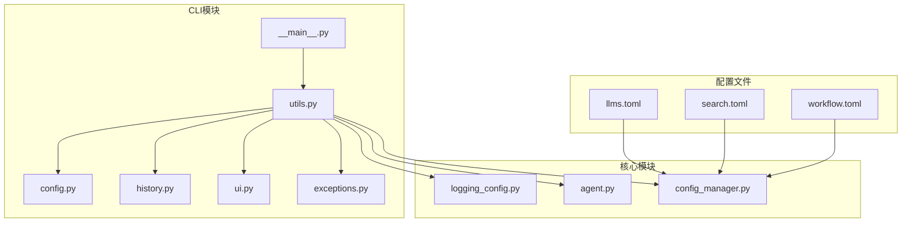
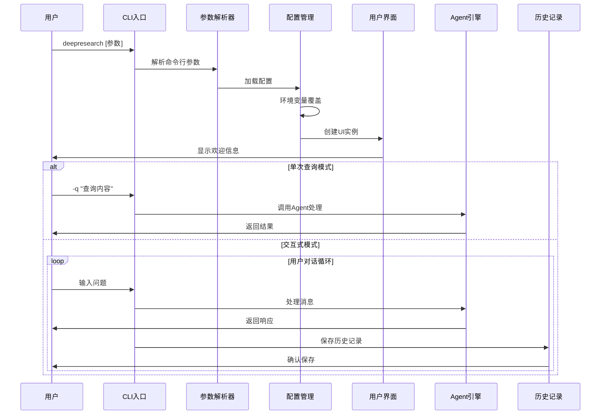
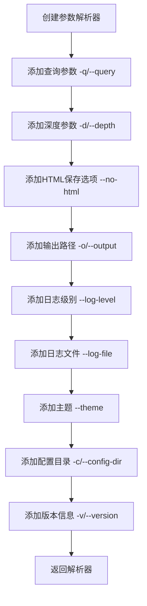
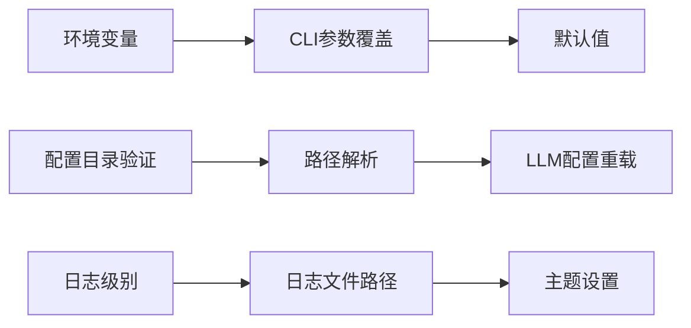
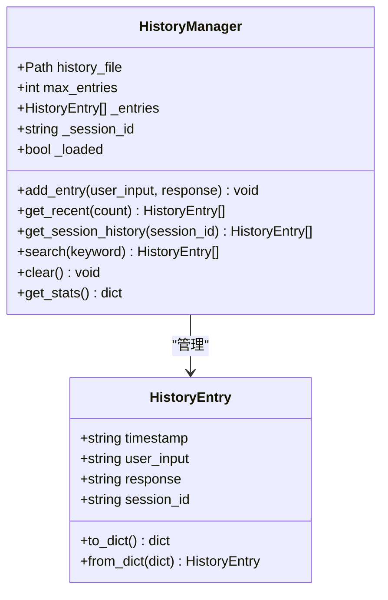
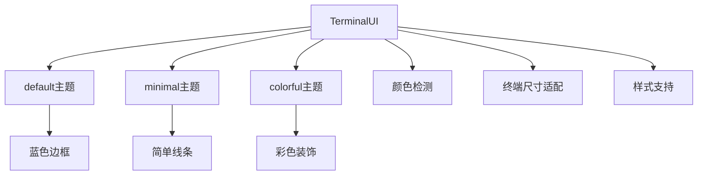
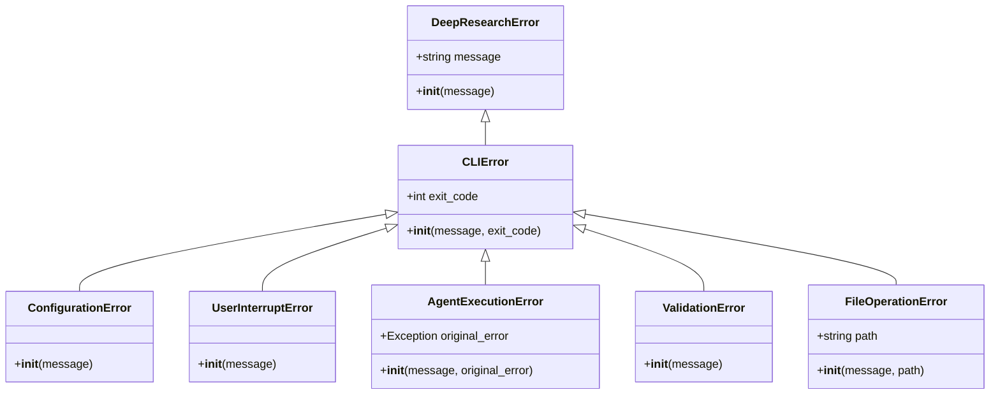
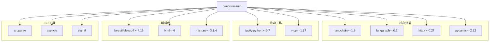
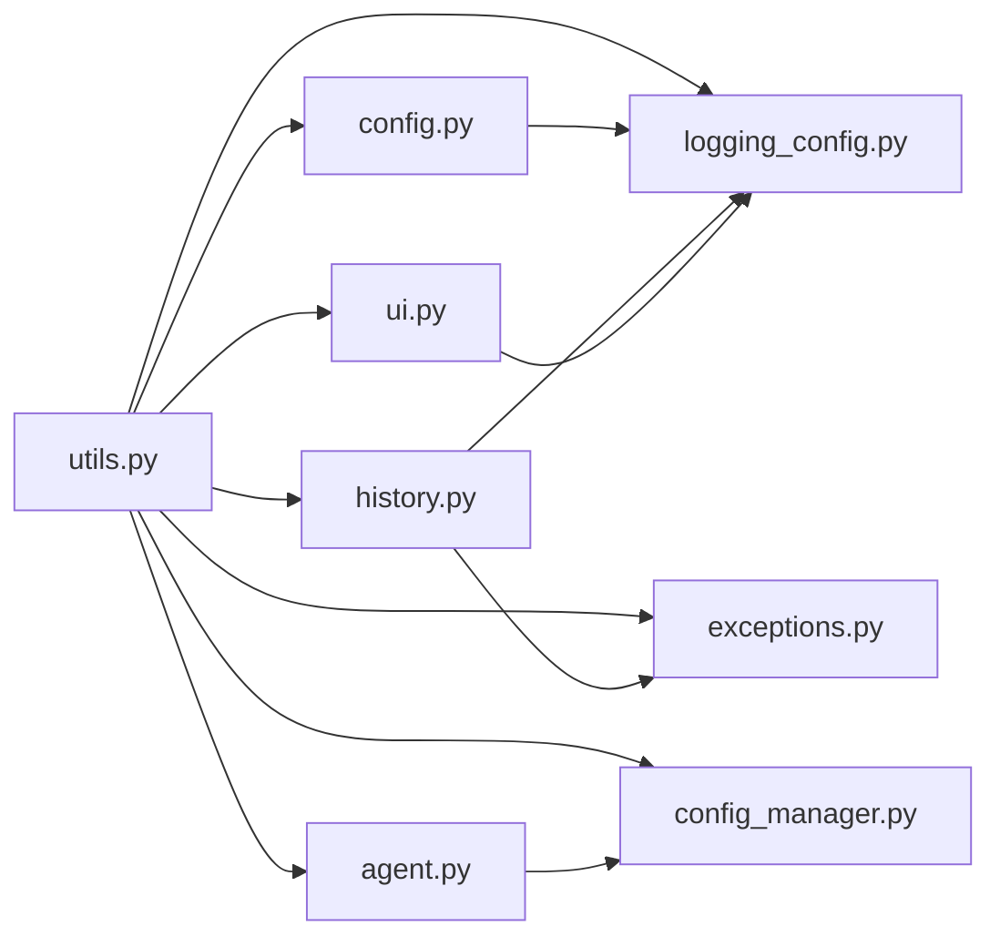

# 命令行工具系统

<cite>
**本文档引用的文件**
- [__main__.py](file://tools/DeepResearch/src/deepresearch/cli/__main__.py)
- [utils.py](file://tools/DeepResearch/src/deepresearch/cli/utils.py)
- [config.py](file://tools/DeepResearch/src/deepresearch/cli/config.py)
- [history.py](file://tools/DeepResearch/src/deepresearch/cli/history.py)
- [ui.py](file://tools/DeepResearch/src/deepresearch/cli/ui.py)
- [exceptions.py](file://tools/DeepResearch/src/deepresearch/cli/exceptions.py)
- [logging_config.py](file://tools/DeepResearch/src/deepresearch/logging_config.py)
- [pyproject.toml](file://tools/DeepResearch/pyproject.toml)
- [README.md](file://tools/DeepResearch/README.md)
- [llms.toml](file://tools/DeepResearch/config/llms.toml)
- [search.toml](file://tools/DeepResearch/config/search.toml)
- [workflow.toml](file://tools/DeepResearch/config/workflow.toml)
- [test_main.py](file://tools/DeepResearch/tests/unit/cli/test_main.py)
- [test_config.py](file://tools/DeepResearch/tests/unit/cli/test_config.py)
- [test_history.py](file://tools/DeepResearch/tests/unit/cli/test_history.py)
</cite>

## 目录
1. [简介](#简介)
2. [项目结构](#项目结构)
3. [核心组件](#核心组件)
4. [架构概览](#架构概览)
5. [详细组件分析](#详细组件分析)
6. [依赖关系分析](#依赖关系分析)
7. [性能考虑](#性能考虑)
8. [故障排除指南](#故障排除指南)
9. [结论](#结论)
10. [附录](#附录)

## 简介

DeepResearch命令行工具系统是一个基于多大模型协作的智能深度研究框架。该系统允许多个语言模型协同工作，整合搜索工具进行全面研究，并最终生成可视化研究报告。

该命令行工具提供了两种主要使用模式：
- **交互式对话模式**：支持持续的多轮对话，具有历史记录管理功能
- **单次查询模式**：一次性查询并返回结果

系统集成了完整的配置管理、历史记录持久化、用户界面交互和错误处理机制。

## 项目结构

DeepResearch命令行工具位于`tools/DeepResearch`目录下，采用清晰的模块化组织结构：



**图表来源**
- [__main__.py:1-7](file://tools/DeepResearch/src/deepresearch/cli/__main__.py#L1-L7)
- [utils.py:1-50](file://tools/DeepResearch/src/deepresearch/cli/utils.py#L1-L50)

**章节来源**
- [pyproject.toml:79-80](file://tools/DeepResearch/pyproject.toml#L79-L80)
- [README.md:39-51](file://tools/DeepResearch/README.md#L39-L51)

## 核心组件

### 命令行入口点

命令行工具通过标准的Python入口点配置，使用`deepresearch`作为可执行命令名。

### 配置管理系统

CLIConfig类提供了完整的配置管理功能，支持：
- 环境变量配置加载
- 参数覆盖机制
- 数据验证和范围限制
- 路径解析和标准化

### 历史记录管理

HistoryManager类实现了完整的会话历史记录功能：
- JSON格式持久化存储
- 会话ID自动管理
- 关键词搜索功能
- 最大条目数量限制
- 统计信息收集

### 用户界面系统

TerminalUI类提供了丰富的终端交互功能：
- 多种主题样式（default、minimal、colorful）
- ANSI颜色和样式支持
- 进度条和旋转指示器
- 终端尺寸自适应

**章节来源**
- [config.py:15-101](file://tools/DeepResearch/src/deepresearch/cli/config.py#L15-L101)
- [history.py:38-166](file://tools/DeepResearch/src/deepresearch/cli/history.py#L38-L166)
- [ui.py:66-382](file://tools/DeepResearch/src/deepresearch/cli/ui.py#L66-L382)

## 架构概览



**图表来源**
- [utils.py:485-575](file://tools/DeepResearch/src/deepresearch/cli/utils.py#L485-L575)
- [utils.py:195-304](file://tools/DeepResearch/src/deepresearch/cli/utils.py#L195-L304)

## 详细组件分析

### CLI主入口模块

utils.py是整个CLI系统的中枢，负责：
- 命令行参数解析和验证
- 配置加载和初始化
- 模式切换逻辑（交互式 vs 单次查询）
- 错误处理和信号管理

#### 参数解析器设计



**图表来源**
- [utils.py:386-482](file://tools/DeepResearch/src/deepresearch/cli/utils.py#L386-L482)

#### 配置优先级机制

配置系统采用多层优先级设计：



**图表来源**
- [utils.py:511-544](file://tools/DeepResearch/src/deepresearch/cli/utils.py#L511-L544)
- [config.py:34-101](file://tools/DeepResearch/src/deepresearch/cli/config.py#L34-L101)

**章节来源**
- [utils.py:485-575](file://tools/DeepResearch/src/deepresearch/cli/utils.py#L485-L575)
- [config.py:66-101](file://tools/DeepResearch/src/deepresearch/cli/config.py#L66-L101)

### 历史记录管理系统

HistoryManager类实现了完整的会话历史管理：

#### 数据结构设计



**图表来源**
- [history.py:18-166](file://tools/DeepResearch/src/deepresearch/cli/history.py#L18-L166)

#### 文件持久化策略

历史记录采用JSON格式进行持久化存储，支持：
- 自动创建目录结构
- UTF-8编码保证
- 异常安全的文件操作
- 最大条目数量限制

**章节来源**
- [history.py:53-136](file://tools/DeepResearch/src/deepresearch/cli/history.py#L53-L136)
- [history.py:155-166](file://tools/DeepResearch/src/deepresearch/cli/history.py#L155-L166)

### 用户界面交互系统

TerminalUI类提供了丰富的终端交互功能：

#### 主题系统设计



**图表来源**
- [ui.py:66-382](file://tools/DeepResearch/src/deepresearch/cli/ui.py#L66-L382)

#### 进度显示机制

系统提供了多种进度显示方式：
- 进度条显示（带百分比）
- 旋转指示器（Spinner）
- 终端自适应布局

**章节来源**
- [ui.py:118-300](file://tools/DeepResearch/src/deepresearch/cli/ui.py#L118-L300)
- [ui.py:302-382](file://tools/DeepResearch/src/deepresearch/cli/ui.py#L302-L382)

### 错误处理和异常管理

系统建立了完整的异常层次结构：



**图表来源**
- [exceptions.py:13-58](file://tools/DeepResearch/src/deepresearch/cli/exceptions.py#L13-L58)

**章节来源**
- [exceptions.py:10-58](file://tools/DeepResearch/src/deepresearch/cli/exceptions.py#L10-L58)

## 依赖关系分析

### 外部依赖关系



**图表来源**
- [pyproject.toml:12-26](file://tools/DeepResearch/pyproject.toml#L12-L26)

### 内部模块依赖



**图表来源**
- [utils.py:10-35](file://tools/DeepResearch/src/deepresearch/cli/utils.py#L10-L35)

**章节来源**
- [pyproject.toml:12-26](file://tools/DeepResearch/pyproject.toml#L12-L26)

## 性能考虑

### 异步处理优化

系统采用异步编程模式处理Agent调用，避免阻塞用户界面：
- 使用`asyncio.run()`管理事件循环
- 流式输出支持实时显示
- 信号处理确保优雅退出

### 内存管理策略

- 历史记录采用滑动窗口限制
- 消息列表及时清理无效条目
- 文件操作使用上下文管理器

### 并发控制

- 信号处理器支持Ctrl+C中断
- 异常隔离防止系统崩溃
- 资源清理确保内存释放

## 故障排除指南

### 常见配置问题

**配置目录无效**
- 检查路径是否存在且可读
- 验证路径权限设置
- 确认使用正确的路径分隔符

**环境变量冲突**
- 确认环境变量命名正确
- 检查变量值的数据类型
- 验证配置优先级顺序

### 历史记录问题

**历史文件损坏**
- 检查JSON格式有效性
- 验证文件编码格式
- 确认文件权限设置

**磁盘空间不足**
- 检查目标目录可用空间
- 调整最大历史条目限制
- 清理旧的历史记录文件

### 用户界面问题

**颜色显示异常**
- 检查终端兼容性
- 验证ANSI转义序列支持
- 尝试切换到minimal主题

**进度显示错乱**
- 检查终端宽度设置
- 验证输出缓冲区状态
- 重启命令行会话

**章节来源**
- [test_main.py:272-333](file://tools/DeepResearch/tests/unit/cli/test_main.py#L272-L333)
- [test_history.py:250-286](file://tools/DeepResearch/tests/unit/cli/test_history.py#L250-L286)

## 结论

DeepResearch命令行工具系统展现了现代Python CLI应用的最佳实践：

### 设计优势

- **模块化架构**：清晰的职责分离和依赖管理
- **配置灵活性**：多层次配置系统支持各种部署场景
- **用户体验**：丰富的终端交互和友好的错误提示
- **可靠性**：完善的异常处理和恢复机制

### 技术特色

- **异步编程**：提升响应性和资源利用率
- **主题系统**：适应不同用户的视觉偏好
- **历史管理**：完整的会话持久化解决方案
- **测试覆盖**：全面的单元测试确保代码质量

### 扩展建议

系统为未来的功能扩展预留了良好的接口：
- 插件化配置管理
- 多种输出格式支持
- 分布式历史存储
- 增强的搜索能力

## 附录

### 命令行使用示例

**基础交互式会话**
```bash
deepresearch
```

**单次查询模式**
```bash
deepresearch -q "人工智能的发展趋势"
```

**自定义配置**
```bash
deepresearch --depth 5 --no-html --output ./reports
```

### 配置文件格式

**LLM配置 (llms.toml)**
```toml
[basic]
api_base = "https://maas-api.cn-huabei-1.xf-yun.com/v1"
model = "xdeepseekv31"
api_key = "sk-xxxxxxx16E165Bd"

[clarify]
# ... 其他模块配置
```

**搜索配置 (search.toml)**
```toml
[search]
engine = "tavily"  # 支持 "jina" 或 "tavily"
timeout = 30
jina_api_key = "jina_xxxxxxxxx-RLKa8AVEHppbFJ"
tavily_api_key = "tvly-xxxxxxxxx-l2N15UuLUq104H8X"
```

**工作流配置 (workflow.toml)**
```toml
[search]
topN = 5
```

### 环境变量参考

- `DEEPRESEARCH_MAX_DEPTH`：默认搜索深度 (1-10)
- `DEEPRESEARCH_SAVE_AS_HTML`：是否保存HTML报告 (true/false)
- `DEEPRESEARCH_SAVE_PATH`：报告保存路径
- `DEEPRESEARCH_LOG_LEVEL`：日志级别 (DEBUG/INFO/WARNING/ERROR/CRITICAL)
- `DEEPRESEARCH_THEME`：界面主题 (default/minimal/colorful)
- `DEEPRESEARCH_CONFIG_DIR`：配置文件夹路径