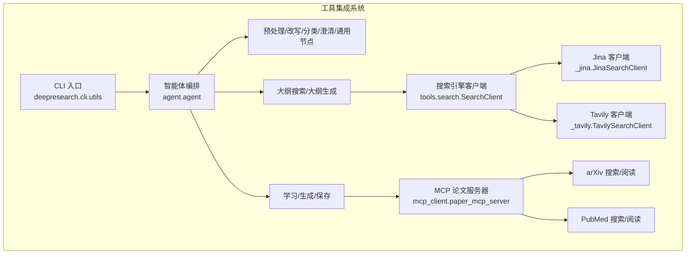
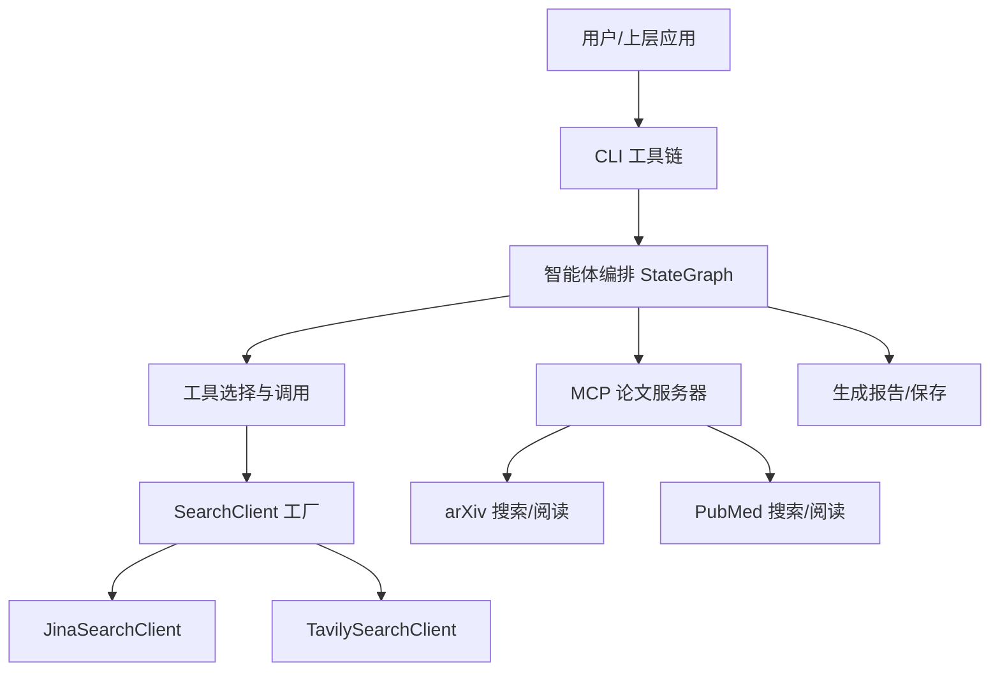
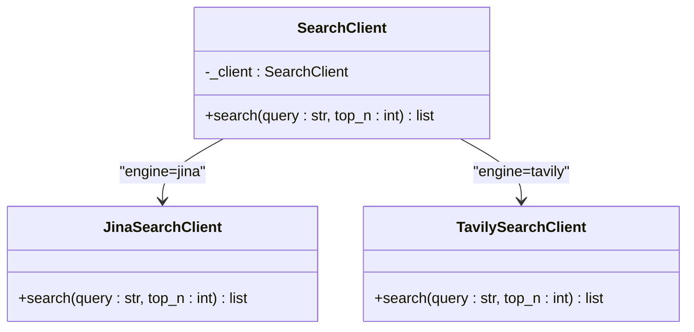
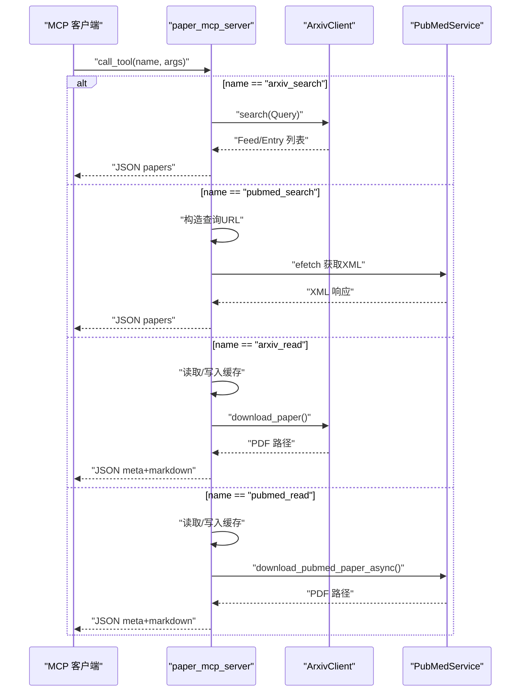
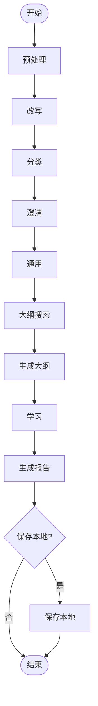
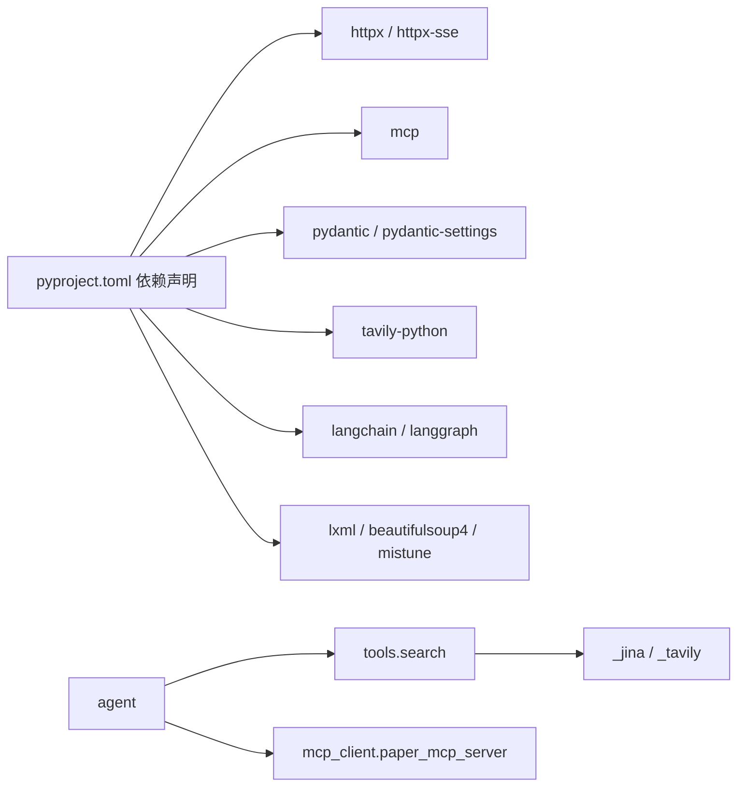

# 工具集成系统

<cite>
**本文引用的文件**
- [README.md](file://tools/DeepResearch/README.md)
- [__init__.py](file://tools/DeepResearch/src/deepresearch/__init__.py)
- [pyproject.toml](file://tools/DeepResearch/pyproject.toml)
- [agent.py](file://tools/DeepResearch/src/deepresearch/agent/agent.py)
- [search.py](file://tools/DeepResearch/src/deepresearch/tools/search.py)
- [_jina.py](file://tools/DeepResearch/src/deepresearch/tools/_jina.py)
- [_tavily.py](file://tools/DeepResearch/src/deepresearch/tools/_tavily.py)
- [paper_mcp_server.py](file://tools/DeepResearch/src/deepresearch/mcp_client/paper_mcp_server.py)
- [base.py](file://tools/DeepResearch/src/deepresearch/config/base.py)
- [errors.py](file://tools/DeepResearch/src/deepresearch/errors.py)
</cite>

## 目录
1. [简介](#简介)
2. [项目结构](#项目结构)
3. [核心组件](#核心组件)
4. [架构总览](#架构总览)
5. [详细组件分析](#详细组件分析)
6. [依赖分析](#依赖分析)
7. [性能考虑](#性能考虑)
8. [故障排查指南](#故障排查指南)
9. [结论](#结论)
10. [附录](#附录)

## 简介
本技术文档面向DeepResearch工具集成系统，聚焦于搜索引擎工具、内容提取工具与MCP客户端的集成架构与实现机制。文档将系统性阐述：
- 搜索引擎工具（Jina、Tavily）的API接口、参数配置与调用方式
- 第三方服务集成策略与错误处理机制
- MCP协议实现细节、服务器端点与客户端通信协议
- 工具选择策略、负载均衡与容错机制
- 工具链组装、数据转换与结果整合流程
- 性能监控、资源管理与成本控制方案

## 项目结构
DeepResearch采用模块化分层组织，核心目录与职责如下：
- src/deepresearch/agent：智能体状态图与节点编排
- src/deepresearch/tools：搜索引擎适配层与内容提取工具
- src/deepresearch/mcp_client：MCP论文检索与阅读服务
- src/deepresearch/config：统一配置管理与校验
- src/deepresearch/cli：命令行入口与工具链编排
- tests：单元、集成与性能测试

图表来源
- [agent.py:1-45](file://tools/DeepResearch/src/deepresearch/agent/agent.py#L1-L45)
- [search.py:1-46](file://tools/DeepResearch/src/deepresearch/tools/search.py#L1-L46)
- [_jina.py](file://tools/DeepResearch/src/deepresearch/tools/_jina.py)
- [_tavily.py](file://tools/DeepResearch/src/deepresearch/tools/_tavily.py)
- [paper_mcp_server.py:1-463](file://tools/DeepResearch/src/deepresearch/mcp_client/paper_mcp_server.py#L1-L463)

章节来源
- [README.md:1-69](file://tools/DeepResearch/README.md#L1-L69)
- [pyproject.toml:1-93](file://tools/DeepResearch/pyproject.toml#L1-L93)

## 核心组件
- 智能体状态图与节点编排：通过状态图串联“预处理→改写→分类→澄清→通用→大纲搜索→大纲→学习→生成→保存”，形成可迭代的研究工作流。
- 搜索引擎客户端：根据配置选择Jina或Tavily，统一封装搜索接口，屏蔽第三方差异。
- MCP论文服务器：提供arXiv与PubMed的搜索与阅读能力，支持本地缓存与PDF转Markdown。
- 统一配置管理：基于TOML的配置加载、环境变量覆盖与字段校验，支持敏感信息脱敏。

章节来源
- [agent.py:1-45](file://tools/DeepResearch/src/deepresearch/agent/agent.py#L1-L45)
- [search.py:1-46](file://tools/DeepResearch/src/deepresearch/tools/search.py#L1-L46)
- [paper_mcp_server.py:1-463](file://tools/DeepResearch/src/deepresearch/mcp_client/paper_mcp_server.py#L1-L463)
- [base.py:1-590](file://tools/DeepResearch/src/deepresearch/config/base.py#L1-L590)

## 架构总览
系统以“任务规划→工具调用→评估与迭代”为核心闭环，结合MCP协议实现外部工具的标准化接入，确保跨服务的一致性与可扩展性。

图表来源
- [agent.py:19-44](file://tools/DeepResearch/src/deepresearch/agent/agent.py#L19-L44)
- [search.py:12-36](file://tools/DeepResearch/src/deepresearch/tools/search.py#L12-L36)
- [paper_mcp_server.py:361-431](file://tools/DeepResearch/src/deepresearch/mcp_client/paper_mcp_server.py#L361-L431)

## 详细组件分析

### 搜索引擎工具集成
- 组件职责
  - SearchClient工厂：依据配置选择具体搜索引擎客户端，屏蔽差异。
  - JinaSearchClient：封装Jina搜索与内容提取接口。
  - TavilySearchClient：封装Tavily搜索与摘要抽取接口。
- 接口与参数
  - search(query: str, top_n: int)：统一搜索入口，返回结构化结果列表。
- 调用方式
  - 通过配置切换引擎；在智能体节点中调用SearchClient执行检索。
- 错误处理
  - 对未知引擎抛出异常；对第三方服务异常进行捕获并返回可识别的错误文本。

图表来源
- [search.py:12-36](file://tools/DeepResearch/src/deepresearch/tools/search.py#L12-L36)
- [_jina.py](file://tools/DeepResearch/src/deepresearch/tools/_jina.py)
- [_tavily.py](file://tools/DeepResearch/src/deepresearch/tools/_tavily.py)

章节来源
- [search.py:1-46](file://tools/DeepResearch/src/deepresearch/tools/search.py#L1-L46)

### MCP协议与论文检索服务
- 服务器端点
  - 列出工具：arxiv_search、arxiv_read、pubmed_search、pubmed_read
  - 调用工具：按名称路由至对应异步实现
- 输入Schema
  - arxiv_search：query、max_results、date_from、date_to
  - arxiv_read：paper_id
  - pubmed_search：query、max_results、date_from、date_to
  - pubmed_read：paper_id
- 数据流转
  - 搜索结果写入本地JSON缓存；PDF下载与Markdown转换按需执行；返回JSON包含meta与markdown
- 错误处理
  - 捕获网络/解析/依赖缺失等异常，返回可诊断的错误文本

图表来源
- [paper_mcp_server.py:420-431](file://tools/DeepResearch/src/deepresearch/mcp_client/paper_mcp_server.py#L420-L431)
- [paper_mcp_server.py:45-104](file://tools/DeepResearch/src/deepresearch/mcp_client/paper_mcp_server.py#L45-L104)
- [paper_mcp_server.py:178-249](file://tools/DeepResearch/src/deepresearch/mcp_client/paper_mcp_server.py#L178-L249)
- [paper_mcp_server.py:107-175](file://tools/DeepResearch/src/deepresearch/mcp_client/paper_mcp_server.py#L107-L175)
- [paper_mcp_server.py:252-337](file://tools/DeepResearch/src/deepresearch/mcp_client/paper_mcp_server.py#L252-L337)

章节来源
- [paper_mcp_server.py:1-463](file://tools/DeepResearch/src/deepresearch/mcp_client/paper_mcp_server.py#L1-L463)

### 工具链组装、数据转换与结果整合
- 组装方式
  - 通过StateGraph定义节点与边，将预处理、改写、分类、澄清、通用、大纲搜索/大纲、学习、生成、保存串联
- 数据转换
  - 搜索结果统一为结构化对象；MCP返回JSON，包含meta与markdown
- 结果整合
  - 生成阶段汇总各来源信息，保存本地或输出报告

图表来源
- [agent.py:19-44](file://tools/DeepResearch/src/deepresearch/agent/agent.py#L19-L44)

章节来源
- [agent.py:1-45](file://tools/DeepResearch/src/deepresearch/agent/agent.py#L1-L45)

### 配置管理与工具选择策略
- 配置来源与优先级
  - 默认值 → 配置文件(TOML) → 环境变量 → 代码传参
- 字段校验与敏感信息
  - 支持范围/枚举/类型校验；敏感键自动脱敏
- 工具选择策略
  - 通过配置选择搜索引擎（如jina/tavily），便于灰度与成本控制

章节来源
- [base.py:536-590](file://tools/DeepResearch/src/deepresearch/config/base.py#L536-L590)
- [search.py:17-23](file://tools/DeepResearch/src/deepresearch/tools/search.py#L17-L23)

## 依赖分析
- 外部库
  - httpx/httpx-sse：HTTP与SSE通信
  - mcp：MCP协议实现
  - pydantic/pydantic-settings：配置模型与设置
  - tavily-python：Tavily SDK
  - langchain/langchain-deepseek：大模型与链路
  - langgraph：状态图编排
  - json-repair/beautifulsoup4/lxml/mistune：数据清洗与解析
- 内部模块耦合
  - agent依赖tools与mcp_client；tools依赖config；mcp_server内部自洽

图表来源
- [pyproject.toml:12-26](file://tools/DeepResearch/pyproject.toml#L12-L26)
- [agent.py:4-16](file://tools/DeepResearch/src/deepresearch/agent/agent.py#L4-L16)
- [search.py:4-7](file://tools/DeepResearch/src/deepresearch/tools/search.py#L4-L7)
- [paper_mcp_server.py:19-27](file://tools/DeepResearch/src/deepresearch/mcp_client/paper_mcp_server.py#L19-L27)

章节来源
- [pyproject.toml:1-93](file://tools/DeepResearch/pyproject.toml#L1-L93)

## 性能考虑
- 并发与超时
  - MCP服务器使用异步HTTP客户端并设置超时，避免阻塞
- 缓存与重用
  - MCP服务器将搜索结果与PDF/Markdown落地缓存，减少重复请求与转换开销
- 资源管理
  - 事件循环与线程池配合执行PDF转Markdown，避免阻塞异步主流程
- 成本控制
  - 通过配置切换搜索引擎与限制top_n，实现成本与质量平衡
- 监控与可观测性
  - 建议在CLI与agent节点中埋点计时与错误统计，结合日志系统输出

## 故障排查指南
- 配置问题
  - 确认配置文件路径与环境变量前缀；检查敏感字段是否被正确脱敏
- 搜索引擎错误
  - 检查引擎名称与密钥；关注第三方返回的错误文本
- MCP服务错误
  - 确认依赖安装（如pymupdf4llm）；检查缓存目录权限与磁盘空间
- 异常类型
  - 使用统一异常基类定位问题来源（配置/搜索/LLM/报告）

章节来源
- [errors.py:1-26](file://tools/DeepResearch/src/deepresearch/errors.py#L1-L26)
- [base.py:15-25](file://tools/DeepResearch/src/deepresearch/config/base.py#L15-L25)
- [paper_mcp_server.py:149-153](file://tools/DeepResearch/src/deepresearch/mcp_client/paper_mcp_server.py#L149-L153)

## 结论
DeepResearch通过统一的工具工厂、MCP协议与配置管理，实现了搜索引擎与论文检索工具的标准化集成。其状态图驱动的工作流支持跨工具的组合与迭代，具备良好的可扩展性与可控的成本结构。建议在生产环境中完善监控埋点、缓存策略与容错降级，以进一步提升稳定性与性能。

## 附录
- 快速开始与入口
  - CLI入口指向工具链主函数，便于命令行直接运行
- 版本与发布
  - 使用setuptools_scm与scikit-build-core管理版本与打包

章节来源
- [pyproject.toml:79-93](file://tools/DeepResearch/pyproject.toml#L79-L93)
- [__init__.py:1-30](file://tools/DeepResearch/src/deepresearch/__init__.py#L1-L30)