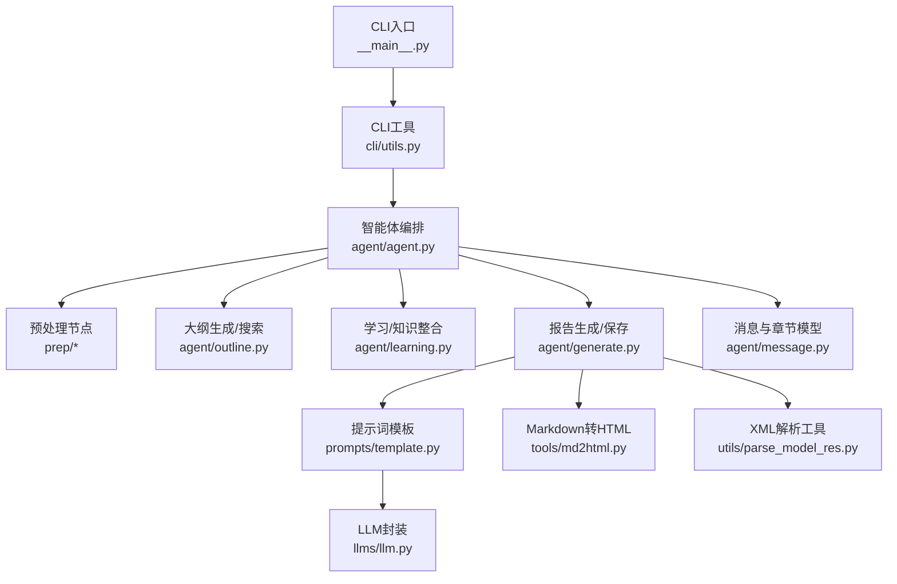
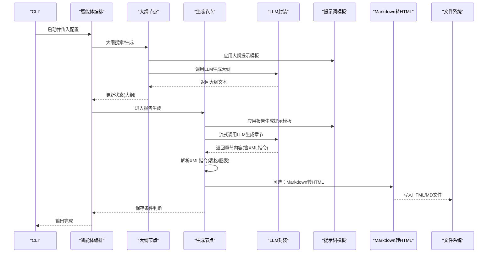
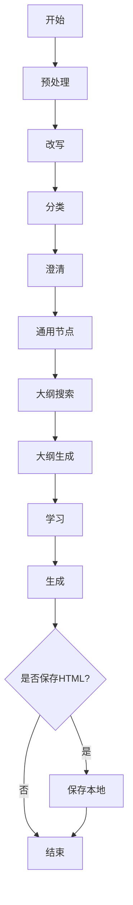
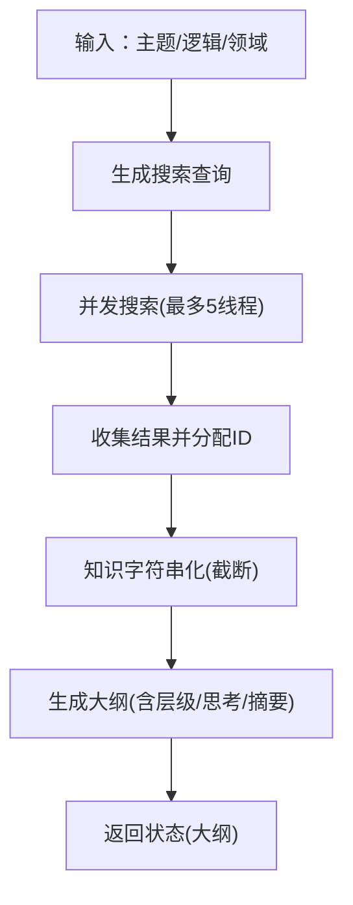
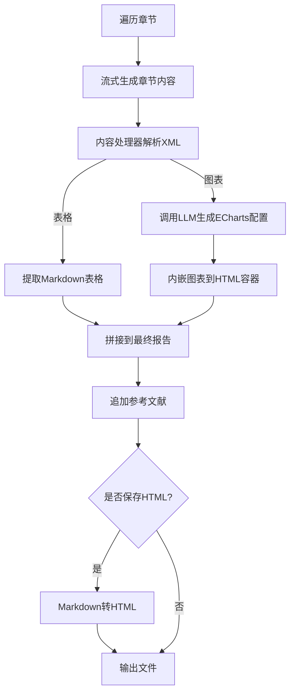
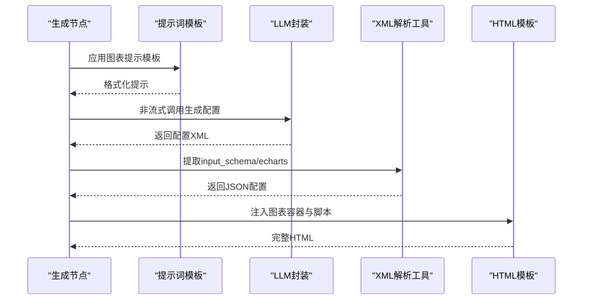
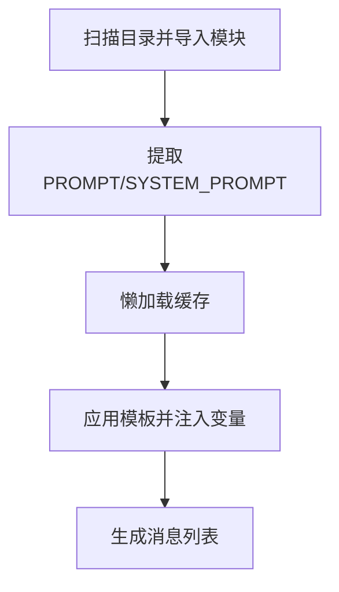
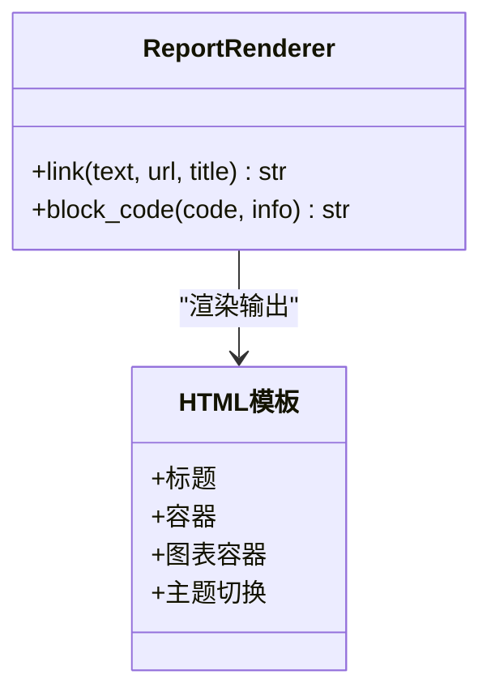
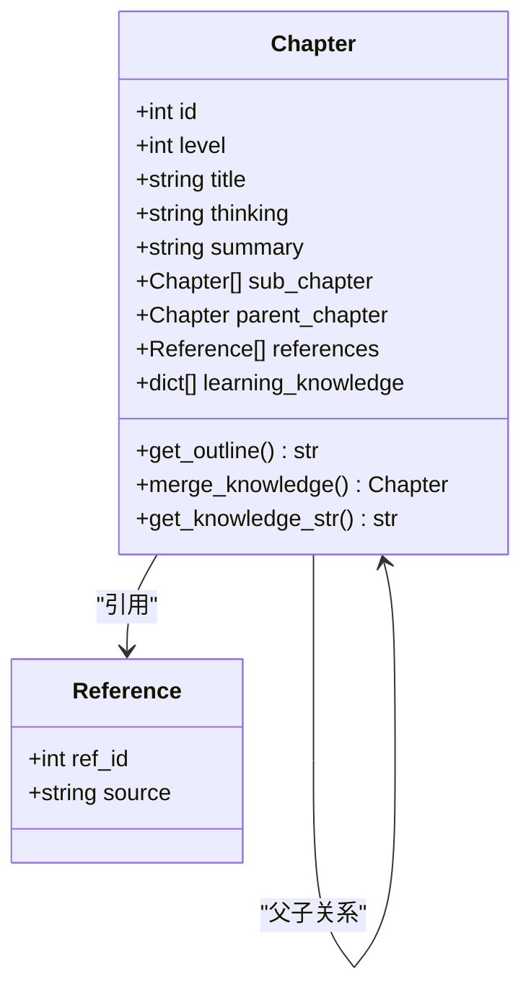
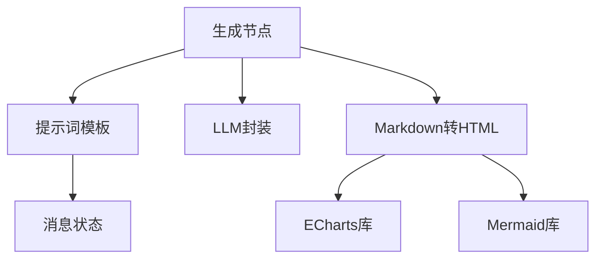

# 报告生成系统

<cite>
**本文档引用的文件**
- [README.md](file://tools/DeepResearch/README.md)
- [__init__.py](file://tools/DeepResearch/src/deepresearch/__init__.py)
- [agent.py](file://tools/DeepResearch/src/deepresearch/agent/agent.py)
- [generate.py](file://tools/DeepResearch/src/deepresearch/agent/generate.py)
- [outline.py](file://tools/DeepResearch/src/deepresearch/agent/outline.py)
- [message.py](file://tools/DeepResearch/src/deepresearch/agent/message.py)
- [template.py](file://tools/DeepResearch/src/deepresearch/prompts/template.py)
- [generate.py（图表）](file://tools/DeepResearch/src/deepresearch/prompts/generate/chart.py)
- [generate.py（报告）](file://tools/DeepResearch/src/deepresearch/prompts/generate/generate.py)
- [md2html.py](file://tools/DeepResearch/src/deepresearch/tools/md2html.py)
- [parse_model_res.py](file://tools/DeepResearch/src/deepresearch/utils/parse_model_res.py)
- [llm.py](file://tools/DeepResearch/src/deepresearch/llms/llm.py)
- [pyproject.toml](file://tools/DeepResearch/pyproject.toml)
</cite>

## 目录
1. [引言](#引言)
2. [项目结构](#项目结构)
3. [核心组件](#核心组件)
4. [架构总览](#架构总览)
5. [详细组件分析](#详细组件分析)
6. [依赖分析](#依赖分析)
7. [性能考虑](#性能考虑)
8. [故障排查指南](#故障排查指南)
9. [结论](#结论)
10. [附录](#附录)

## 引言
本文件面向DeepResearch报告生成系统，聚焦于可视化报告的生成流程、图表绘制与内容组织机制，系统性阐述报告模板设计原理、动态内容填充与布局优化策略，解释图表生成算法、数据可视化与交互式元素实现方式，并提供报告质量评估、格式标准化与输出优化的技术方案；同时覆盖多格式导出、样式定制与品牌集成的实现细节，以及性能优化、缓存策略与并发处理机制，最后给出报告模板扩展、自定义与维护的最佳实践。

## 项目结构
DeepResearch采用模块化分层设计：CLI入口负责参数解析与主流程调度；智能体（Agent）以状态图驱动各阶段节点；提示词模板（Prompts）提供可插拔的提示工程；LLM封装统一调用与缓存；工具模块负责Markdown到HTML转换与图表渲染；消息与章节模型支撑报告结构化存储与知识合并。

**图示来源**
- [agent.py:19-44](file://tools/DeepResearch/src/deepresearch/agent/agent.py#L19-L44)
- [outline.py:22-118](file://tools/DeepResearch/src/deepresearch/agent/outline.py#L22-L118)
- [generate.py:26-111](file://tools/DeepResearch/src/deepresearch/agent/generate.py#L26-L111)
- [template.py:25-87](file://tools/DeepResearch/src/deepresearch/prompts/template.py#L25-L87)
- [llm.py:146-184](file://tools/DeepResearch/src/deepresearch/llms/llm.py#L146-L184)
- [md2html.py:34-700](file://tools/DeepResearch/src/deepresearch/tools/md2html.py#L34-L700)
- [parse_model_res.py:13-27](file://tools/DeepResearch/src/deepresearch/utils/parse_model_res.py#L13-L27)
- [message.py:18-112](file://tools/DeepResearch/src/deepresearch/agent/message.py#L18-L112)

**章节来源**
- [README.md:1-69](file://tools/DeepResearch/README.md#L1-L69)
- [pyproject.toml:1-93](file://tools/DeepResearch/pyproject.toml#L1-L93)

## 核心组件
- 智能体编排（State Graph）
  - 预处理、改写、分类、澄清、通用节点、大纲搜索、大纲生成、学习、生成、本地保存等节点构成闭环工作流。
- 提示词模板系统
  - 动态加载generate、learning、outline、prep四类模板，支持系统提示与用户提示变量注入。
- LLM封装与缓存
  - 支持流式与非流式响应，内置线程安全LRU缓存与实例池，降低重复调用成本。
- 内容处理器与图表生成
  - 流式解析XML标记，识别表格与图表指令，调用LLM生成ECharts配置并内嵌到HTML。
- Markdown到HTML转换
  - 自定义渲染器与HTML模板，支持主题切换、图表容器、脚注样式与交互弹窗。
- 章节与参考模型
  - 结构化章节树、引用管理与知识合并，保障报告层次清晰与引用准确。

**章节来源**
- [agent.py:19-44](file://tools/DeepResearch/src/deepresearch/agent/agent.py#L19-L44)
- [template.py:25-130](file://tools/DeepResearch/src/deepresearch/prompts/template.py#L25-L130)
- [llm.py:71-123](file://tools/DeepResearch/src/deepresearch/llms/llm.py#L71-L123)
- [generate.py:169-295](file://tools/DeepResearch/src/deepresearch/agent/generate.py#L169-L295)
- [md2html.py:19-700](file://tools/DeepResearch/src/deepresearch/tools/md2html.py#L19-L700)
- [message.py:18-99](file://tools/DeepResearch/src/deepresearch/agent/message.py#L18-L99)

## 架构总览
下图展示从CLI到报告输出的关键路径：CLI解析参数后进入主流程，通过智能体状态图依次执行预处理、大纲搜索与生成、学习整合、报告生成与保存，并在需要时将Markdown转换为HTML并内嵌图表。

**图示来源**
- [agent.py:19-44](file://tools/DeepResearch/src/deepresearch/agent/agent.py#L19-L44)
- [outline.py:22-118](file://tools/DeepResearch/src/deepresearch/agent/outline.py#L22-L118)
- [generate.py:26-160](file://tools/DeepResearch/src/deepresearch/agent/generate.py#L26-L160)
- [template.py:90-129](file://tools/DeepResearch/src/deepresearch/prompts/template.py#L90-L129)
- [llm.py:146-184](file://tools/DeepResearch/src/deepresearch/llms/llm.py#L146-L184)
- [md2html.py:34-700](file://tools/DeepResearch/src/deepresearch/tools/md2html.py#L34-L700)

## 详细组件分析

### 智能体编排与状态图
- 节点职责
  - 预处理：清洗与规范化输入。
  - 大纲搜索：基于查询生成多条搜索指令并行检索，汇总知识。
  - 大纲生成：将检索结果与领域知识结合，生成结构化大纲。
  - 学习：对每个章节进行深度学习与知识整合。
  - 生成：按章节顺序生成正文，动态插入表格与图表。
  - 保存：根据配置决定是否保存为HTML或仅Markdown。
- 控制流
  - 条件边：生成完成后根据保存开关分流至本地保存或结束。
  - 终止：通用节点可直接结束流程。

**图示来源**
- [agent.py:19-44](file://tools/DeepResearch/src/deepresearch/agent/agent.py#L19-L44)

**章节来源**
- [agent.py:19-44](file://tools/DeepResearch/src/deepresearch/agent/agent.py#L19-L44)

### 大纲生成与知识检索
- 搜索策略
  - 从提示词中抽取多条搜索指令，使用线程池并发执行，最大并发受控（默认不超过5），保证有序回填与确定性ID分配。
- 大纲解析
  - 从LLM输出中提取Markdown代码块，按标题层级构建章节树，支持为每级章节补充思考与摘要信息。
- 知识截断
  - 将检索到的知识按最大长度限制进行拼接，避免超长上下文导致性能问题。

**图示来源**
- [outline.py:22-85](file://tools/DeepResearch/src/deepresearch/agent/outline.py#L22-L85)
- [outline.py:88-118](file://tools/DeepResearch/src/deepresearch/agent/outline.py#L88-L118)
- [outline.py:121-151](file://tools/DeepResearch/src/deepresearch/agent/outline.py#L121-L151)
- [outline.py:158-220](file://tools/DeepResearch/src/deepresearch/agent/outline.py#L158-L220)

**章节来源**
- [outline.py:22-85](file://tools/DeepResearch/src/deepresearch/agent/outline.py#L22-L85)
- [outline.py:88-118](file://tools/DeepResearch/src/deepresearch/agent/outline.py#L88-L118)
- [outline.py:121-151](file://tools/DeepResearch/src/deepresearch/agent/outline.py#L121-L151)
- [outline.py:158-220](file://tools/DeepResearch/src/deepresearch/agent/outline.py#L158-L220)

### 报告生成与动态内容填充
- 流式生成
  - 对每个章节调用LLM进行流式生成，实时打印思考与内容片段，提升可观测性。
- 内容处理器
  - 识别XML指令：<table>与<chart>，分别解析为Markdown表格或触发图表生成。
- 引用替换
  - 将占位引用[^id]映射为实际引用序号，确保报告引用一致性。
- 最终保存
  - 生成完成后追加参考文献列表，按配置选择保存为Markdown或HTML；若保存HTML，调用Markdown转HTML工具生成完整页面。

**图示来源**
- [generate.py:26-111](file://tools/DeepResearch/src/deepresearch/agent/generate.py#L26-L111)
- [generate.py:169-295](file://tools/DeepResearch/src/deepresearch/agent/generate.py#L169-L295)
- [generate.py:114-160](file://tools/DeepResearch/src/deepresearch/agent/generate.py#L114-L160)
- [md2html.py:34-700](file://tools/DeepResearch/src/deepresearch/tools/md2html.py#L34-L700)

**章节来源**
- [generate.py:26-111](file://tools/DeepResearch/src/deepresearch/agent/generate.py#L26-L111)
- [generate.py:169-295](file://tools/DeepResearch/src/deepresearch/agent/generate.py#L169-L295)
- [generate.py:114-160](file://tools/DeepResearch/src/deepresearch/agent/generate.py#L114-L160)

### 图表生成算法与可视化
- 图表描述
  - 由提示词提供图表定位与作用说明，结合上下文与参考知识生成ECharts配置。
- 配置生成
  - LLM返回包含input_schema或echarts标签的XML，解析后作为ECharts配置对象。
- 渲染与交互
  - HTML模板内嵌ECharts与Mermaid库，提供主题切换与图表主题适配；图表容器具备固定宽高比，确保响应式显示。

**图示来源**
- [generate.py（图表）:29-36](file://tools/DeepResearch/src/deepresearch/prompts/generate/chart.py#L29-L36)
- [generate.py:242-294](file://tools/DeepResearch/src/deepresearch/agent/generate.py#L242-L294)
- [parse_model_res.py:13-27](file://tools/DeepResearch/src/deepresearch/utils/parse_model_res.py#L13-L27)
- [md2html.py:34-700](file://tools/DeepResearch/src/deepresearch/tools/md2html.py#L34-L700)

**章节来源**
- [generate.py（图表）:1-37](file://tools/DeepResearch/src/deepresearch/prompts/generate/chart.py#L1-L37)
- [generate.py:242-294](file://tools/DeepResearch/src/deepresearch/agent/generate.py#L242-L294)
- [parse_model_res.py:13-27](file://tools/DeepResearch/src/deepresearch/utils/parse_model_res.py#L13-L27)
- [md2html.py:34-700](file://tools/DeepResearch/src/deepresearch/tools/md2html.py#L34-L700)

### 提示词模板系统与动态填充
- 加载机制
  - 动态扫描generate、learning、outline、prep四类目录，导入Python模块并提取PROMPT与SYSTEM_PROMPT变量，支持懒加载与重复利用。
- 注入变量
  - 在应用模板时，将state中的变量注入到模板字符串，支持缺失变量的错误提示。
- 可扩展性
  - 新增模板无需修改核心逻辑，只需在对应目录新增Python文件并导出PROMPT/ SYSTEM_PROMPT。

**图示来源**
- [template.py:25-87](file://tools/DeepResearch/src/deepresearch/prompts/template.py#L25-L87)
- [template.py:78-130](file://tools/DeepResearch/src/deepresearch/prompts/template.py#L78-L130)

**章节来源**
- [template.py:25-130](file://tools/DeepResearch/src/deepresearch/prompts/template.py#L25-L130)

### Markdown到HTML转换与样式定制
- 渲染器
  - 自定义ReportRenderer，特殊处理脚注链接与自定义代码块（custom_html）。
- 模板与主题
  - 内置现代与粗野主义两种主题，支持主题切换按钮；图表容器与表格样式统一，提供响应式布局。
- 交互增强
  - 引用弹窗、主题UI适配、ECharts主题联动，提升阅读体验。

**图示来源**
- [md2html.py:19-700](file://tools/DeepResearch/src/deepresearch/tools/md2html.py#L19-L700)

**章节来源**
- [md2html.py:19-700](file://tools/DeepResearch/src/deepresearch/tools/md2html.py#L19-L700)

### 章节与参考模型
- 章节树
  - 支持层级、标题、思考、摘要、子章节、引用与学习知识集合；提供大纲序列化与知识合并能力。
- 知识合并
  - 按引用组聚合相同来源的洞察，去重并合并为更完整的知识单元，减少冗余引用。

**图示来源**
- [message.py:18-99](file://tools/DeepResearch/src/deepresearch/agent/message.py#L18-L99)

**章节来源**
- [message.py:18-99](file://tools/DeepResearch/src/deepresearch/agent/message.py#L18-L99)

## 依赖分析
- 外部依赖
  - LLM：langchain-deepseek，提供DeepSeek模型接入。
  - 图形框架：langgraph，用于状态图编排。
  - 文本处理：mistune（Markdown渲染）、BeautifulSoup/lxml（网页解析）。
  - 工具库：httpx、json-repair、pydantic等。
- 内部模块耦合
  - 生成节点依赖提示词模板与LLM封装；提示词模板依赖消息状态；Markdown转HTML独立于生成流程但可被调用。

**图示来源**
- [generate.py:12-16](file://tools/DeepResearch/src/deepresearch/agent/generate.py#L12-L16)
- [template.py:9-17](file://tools/DeepResearch/src/deepresearch/prompts/template.py#L9-L17)
- [md2html.py:41-46](file://tools/DeepResearch/src/deepresearch/tools/md2html.py#L41-L46)

**章节来源**
- [pyproject.toml:12-26](file://tools/DeepResearch/pyproject.toml#L12-L26)

## 性能考虑
- 缓存策略
  - LLM实例缓存：限制最大实例数，避免频繁初始化。
  - 响应缓存：线程安全LRU缓存，命中率统计，支持清空与监控。
- 并发与限流
  - 大纲搜索使用有界线程池，控制最大并发，保证结果有序回填。
- 上下文截断
  - 大纲知识字符串化时按最大长度截断，避免超长上下文影响性能。
- 流式输出
  - 生成阶段采用流式LLM调用，边生成边渲染，降低首屏等待时间。

**章节来源**
- [llm.py:24-66](file://tools/DeepResearch/src/deepresearch/llms/llm.py#L24-L66)
- [llm.py:71-123](file://tools/DeepResearch/src/deepresearch/llms/llm.py#L71-L123)
- [outline.py:42-68](file://tools/DeepResearch/src/deepresearch/agent/outline.py#L42-L68)
- [outline.py:121-151](file://tools/DeepResearch/src/deepresearch/agent/outline.py#L121-L151)
- [generate.py:86-100](file://tools/DeepResearch/src/deepresearch/agent/generate.py#L86-L100)

## 故障排查指南
- 提示词缺失变量
  - 当模板变量未在state中提供时会抛出异常，需检查调用侧state键值。
- LLM调用异常
  - 非流式调用捕获异常并记录日志；流式调用在迭代过程中异常会被记录，不影响整体流程。
- 缓存问题
  - 可通过获取缓存统计信息定位命中率低的原因；必要时清空缓存后重试。
- 图表生成失败
  - 若XML解析不到配置，将跳过图表生成；检查提示词模板与LLM输出格式。
- 文件保存失败
  - 保存目录创建失败或写入异常会记录错误日志，确认权限与路径。

**章节来源**
- [template.py:114-129](file://tools/DeepResearch/src/deepresearch/prompts/template.py#L114-L129)
- [llm.py:215-217](file://tools/DeepResearch/src/deepresearch/llms/llm.py#L215-L217)
- [llm.py:236-244](file://tools/DeepResearch/src/deepresearch/llms/llm.py#L236-L244)
- [generate.py:273-294](file://tools/DeepResearch/src/deepresearch/agent/generate.py#L273-L294)
- [generate.py:131-158](file://tools/DeepResearch/src/deepresearch/agent/generate.py#L131-L158)

## 结论
DeepResearch通过“提示词模板 + LLM封装 + 状态图编排”的组合，实现了从主题到报告的自动化流水线；借助内容处理器与XML指令，系统能够动态插入表格与图表，并通过Markdown到HTML转换实现高质量可视化输出。缓存、并发与上下文截断等策略有效提升了性能与稳定性；主题与交互增强进一步改善了用户体验。该架构既便于扩展新的提示模板与图表类型，也支持企业级的品牌集成与样式定制。

## 附录
- 多格式导出
  - 默认输出Markdown与HTML；可通过配置开关控制是否生成HTML。
- 样式定制
  - HTML模板提供主题切换与CSS变量体系，可按品牌色系调整；图表主题随页面主题联动。
- 品牌集成
  - 公司Logo占位与容器背景可替换；字体与色彩变量集中管理，便于统一风格。
- 扩展与维护最佳实践
  - 新增提示模板：在对应目录添加Python文件并导出PROMPT/ SYSTEM_PROMPT；避免硬编码，尽量通过state注入变量。
  - 图表类型扩展：在生成提示中增加新的XML指令与解析分支，确保输出格式稳定。
  - 模板版本管理：通过提示词目录结构与懒加载机制，避免全局改动引发连锁反应。
  - 性能监控：定期查看LLM缓存命中率与实例数量，根据负载调整缓存大小与并发上限。