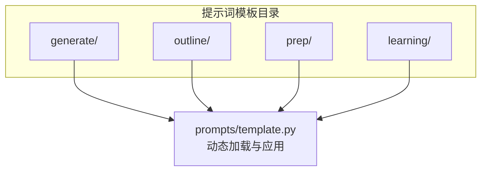
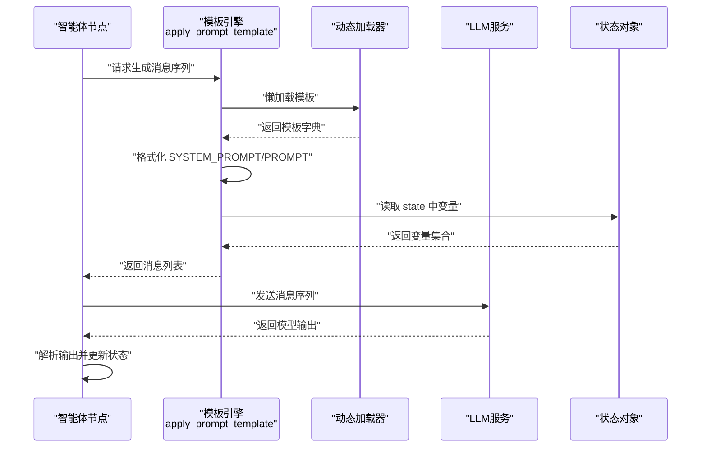
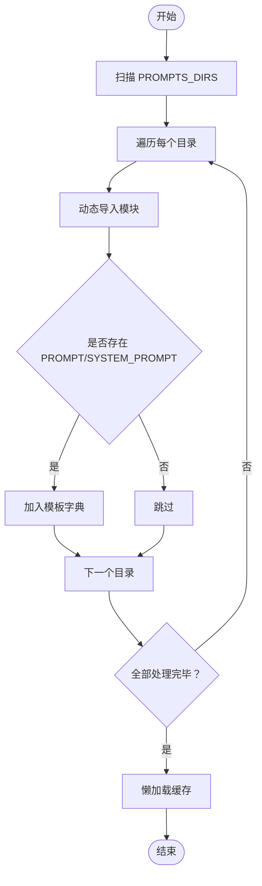
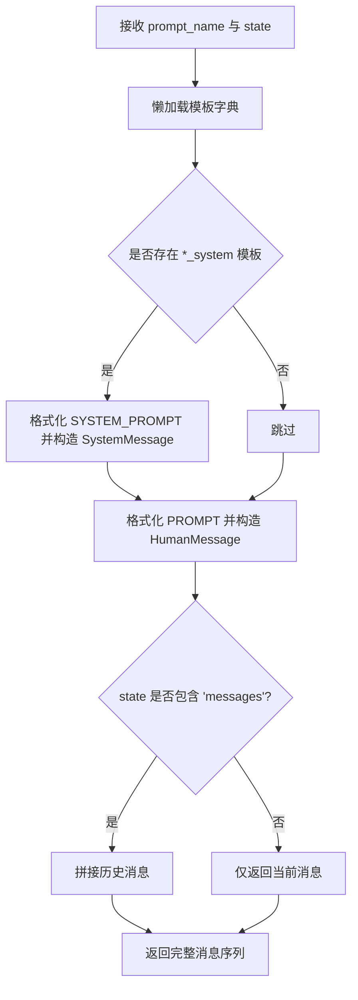
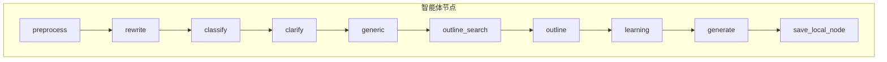
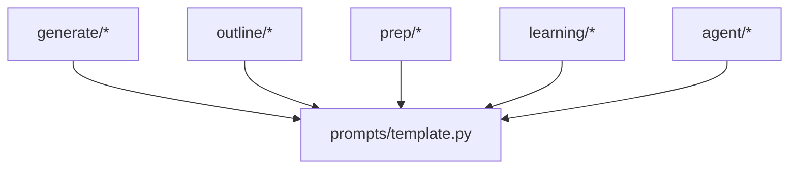

# 提示词系统

<cite>
**本文引用的文件**
- [prompts/template.py](file://tools/DeepResearch/src/deepresearch/prompts/template.py)
- [prompts/__init__.py](file://tools/DeepResearch/src/deepresearch/prompts/__init__.py)
- [prompts/generate/generate.py](file://tools/DeepResearch/src/deepresearch/prompts/generate/generate.py)
- [prompts/outline/outline.py](file://tools/DeepResearch/src/deepresearch/prompts/outline/outline.py)
- [prompts/prep/classify.py](file://tools/DeepResearch/src/deepresearch/prompts/prep/classify.py)
- [prompts/prep/clarify.py](file://tools/DeepResearch/src/deepresearch/prompts/prep/clarify.py)
- [prompts/learning/draft.py](file://tools/DeepResearch/src/deepresearch/prompts/learning/draft.py)
- [prompts/learning/extract_knowledge.py](file://tools/DeepResearch/src/deepresearch/prompts/learning/extract_knowledge.py)
- [prompts/learning/research_query.py](file://tools/DeepResearch/src/deepresearch/prompts/learning/research_query.py)
- [prompts/learning/evaluate_completeness.py](file://tools/DeepResearch/src/deepresearch/prompts/learning/evaluate_completeness.py)
- [prompts/learning/evaluate_freshness.py](file://tools/DeepResearch/src/deepresearch/prompts/learning/evaluate_freshness.py)
- [agent/agent.py](file://tools/DeepResearch/src/deepresearch/agent/agent.py)
- [agent/outline.py](file://tools/DeepResearch/src/deepresearch/agent/outline.py)
- [agent/deepsearch.py](file://tools/DeepResearch/src/deepresearch/agent/deepsearch.py)
</cite>

## 目录
1. [简介](#简介)
2. [项目结构](#项目结构)
3. [核心组件](#核心组件)
4. [架构总览](#架构总览)
5. [详细组件分析](#详细组件分析)
6. [依赖分析](#依赖分析)
7. [性能考虑](#性能考虑)
8. [故障排查指南](#故障排查指南)
9. [结论](#结论)
10. [附录](#附录)

## 简介
本技术文档围绕 DeepResearch 的提示词系统展开，系统通过“模板化 + 动态加载 + 上下文注入”的方式，为不同研究阶段（准备、大纲、学习、生成）提供可复用、可扩展、可演进的提示词能力。文档重点覆盖：
- 模板设计与参数注入机制
- 多场景适配策略（生成类、大纲构建、准备阶段、学习阶段）
- 上下文管理与消息序列组织
- 提示词优化策略、效果评估与自适应调整
- 多语言支持、个性化定制与版本管理
- 与 LLM 的交互最佳实践与性能优化

## 项目结构
提示词系统位于 tools/DeepResearch/src/deepresearch/prompts 下，按功能域划分为 four 子包：generate（生成）、outline（大纲）、prep（准备）、learning（学习）。每个子包内以模块形式定义若干提示词模板，统一由模板引擎进行动态加载与应用。

图表来源
- [prompts/template.py:11-17](file://tools/DeepResearch/src/deepresearch/prompts/template.py#L11-L17)
- [prompts/template.py:37-70](file://tools/DeepResearch/src/deepresearch/prompts/template.py#L37-L70)

章节来源
- [prompts/__init__.py:4-8](file://tools/DeepResearch/src/deepresearch/prompts/__init__.py#L4-L8)
- [prompts/template.py:11-17](file://tools/DeepResearch/src/deepresearch/prompts/template.py#L11-L17)

## 核心组件
- 模板引擎与动态加载
  - 自动扫描 generate、outline、prep、learning 四个目录，导入各模块并提取 PROMPT 与 SYSTEM_PROMPT 变量，形成键值映射。
  - 支持懒加载，首次使用时才完成扫描与缓存。
- 消息构造与上下文注入
  - 将 SYSTEM_PROMPT 与 PROMPT 分别格式化后封装为 SystemMessage 与 HumanMessage，拼接历史 messages（若存在）返回给调用方。
  - 使用 format_map 安全注入 state 字典中的变量，缺失变量会抛出明确错误。
- 调用入口
  - 对外暴露 apply_prompt_template(prompt_name, state)，供各阶段节点调用。

章节来源
- [prompts/template.py:25-70](file://tools/DeepResearch/src/deepresearch/prompts/template.py#L25-L70)
- [prompts/template.py:78-87](file://tools/DeepResearch/src/deepresearch/prompts/template.py#L78-L87)
- [prompts/template.py:90-129](file://tools/DeepResearch/src/deepresearch/prompts/template.py#L90-L129)

## 架构总览
提示词系统与智能体工作流的集成路径如下：智能体节点在执行前调用模板引擎，基于当前状态生成系统消息与用户消息，再交由 LLM 执行；LLM 返回内容后，智能体节点解析并更新状态，驱动流程向下一步推进。

图表来源
- [prompts/template.py:90-129](file://tools/DeepResearch/src/deepresearch/prompts/template.py#L90-L129)
- [agent/outline.py:88-118](file://tools/DeepResearch/src/deepresearch/agent/outline.py#L88-L118)
- [agent/deepsearch.py:162-201](file://tools/DeepResearch/src/deepresearch/agent/deepsearch.py#L162-L201)

## 详细组件分析

### 模板引擎与动态加载机制
- 扫描策略
  - 遍历 PROMPTS_DIRS 列表，逐个目录扫描 .py 文件（排除 __init__.py），动态导入模块并提取 PROMPT/ SYSTEM_PROMPT。
  - 模块命名基于相对路径，模板键名采用“子目录/模块名”的形式，便于调用侧定位。
- 懒加载与缓存
  - 首次调用 load_prompt_templates_lazy 后，将结果缓存至全局字典，后续直接复用。
- 错误处理
  - 导入失败或缺少变量时记录警告；格式化阶段缺失变量抛出带模板名与缺失键的异常信息，便于定位。

图表来源
- [prompts/template.py:25-70](file://tools/DeepResearch/src/deepresearch/prompts/template.py#L25-L70)
- [prompts/template.py:78-87](file://tools/DeepResearch/src/deepresearch/prompts/template.py#L78-L87)

章节来源
- [prompts/template.py:11-17](file://tools/DeepResearch/src/deepresearch/prompts/template.py#L11-L17)
- [prompts/template.py:25-70](file://tools/DeepResearch/src/deepresearch/prompts/template.py#L25-L70)
- [prompts/template.py:78-87](file://tools/DeepResearch/src/deepresearch/prompts/template.py#L78-L87)

### 消息构造与上下文管理
- 消息类型
  - 若存在 *_system 模板键，则先构造 SystemMessage；再构造 HumanMessage。
  - 若 state 中包含 "messages"，则将其拼接到最终消息列表末尾，实现上下文延续。
- 参数注入
  - 使用 format_map 安全注入 state 中的键值，避免硬编码与字符串拼接风险。
  - 缺失变量将触发异常，便于在开发期及时发现配置问题。

图表来源
- [prompts/template.py:90-129](file://tools/DeepResearch/src/deepresearch/prompts/template.py#L90-L129)

章节来源
- [prompts/template.py:90-129](file://tools/DeepResearch/src/deepresearch/prompts/template.py#L90-L129)

### 生成类提示词（generate）
- 角色与约束
  - 明确领域专家角色，强调事实性、逻辑性、一致性与洞察力。
  - 强制要求多处精确引用，实体匹配严格，聚焦用户核心主题。
- 写作标准
  - 逻辑严谨、深度与洞察、表达规范；支持图表与表格工具调用。
- 输入变量
  - now、query、chapter_outline、above、outline、reference、domain。
- 典型用法
  - 在生成阶段根据参考知识与大纲继续撰写章节正文，确保与上文连贯。

章节来源
- [prompts/generate/generate.py:15-65](file://tools/DeepResearch/src/deepresearch/prompts/generate/generate.py#L15-L65)
- [prompts/generate/generate.py:68-103](file://tools/DeepResearch/src/deepresearch/prompts/generate/generate.py#L68-L103)

### 大纲构建提示词（outline）
- 角色与规则
  - 领域写作专家，基于用户意图与参考知识，生成清晰、分层、可执行的大纲。
  - 输出严格为 Markdown 格式，包含 summary 与 thinking 标签。
- 输入变量
  - domain、now、query、reasoning、thinking、reference。
- 典型用法
  - 智能体 outline 节点调用该模板，结合推理框架与写作框架生成章节规划。

章节来源
- [prompts/outline/outline.py:14-32](file://tools/DeepResearch/src/deepresearch/prompts/outline/outline.py#L14-L32)
- [prompts/outline/outline.py:34-67](file://tools/DeepResearch/src/deepresearch/prompts/outline/outline.py#L34-L67)

### 准备阶段提示词（prep）
- 分类（classify）
  - 识别用户查询的核心目的与分析主体，归类到业务/通用类别之一。
  - 输入变量：query。
- 明确意图（clarify）
  - 当查询模糊时，输出不超过三条关键问题，引导用户提供时间、区域、受众、偏好等维度。
  - 支持 SYSTEM_PROMPT 用于规范化澄清流程。
  - 输入变量：query、now。

章节来源
- [prompts/prep/classify.py:9-47](file://tools/DeepResearch/src/deepresearch/prompts/prep/classify.py#L9-L47)
- [prompts/prep/clarify.py:10-50](file://tools/DeepResearch/src/deepresearch/prompts/prep/clarify.py#L10-L50)
- [prompts/prep/clarify.py:52-56](file://tools/DeepResearch/src/deepresearch/prompts/prep/clarify.py#L52-L56)

### 学习阶段提示词（learning）
- 草稿生成（draft）
  - 基于知识片段合成准确、结构化、可溯源的中间答案。
  - 输入变量：knowledge、chapter_outline。
- 知识抽取（extract_knowledge）
  - 从检索结果中抽取严格限定的事实，形成结构化洞察。
  - 输入变量：search、chapter_outline。
- 搜索查询生成（research_query）
  - 基于当前回答与评估结果，生成补充且优化的搜索查询，控制数量与聚焦维度。
  - 输入变量：now、search_query、chapter_outline、draft、evaluation。
- 完整性评估（evaluate_completeness）
  - 从覆盖面、证据充分性、准确性、逻辑一致性、时间相关性等维度评估草稿。
  - 输入变量：draft、chapter_outline。
- 新鲜度评估（evaluate_freshness）
  - 基于主题性质与隐含时间要求，判断材料是否过时。
  - 输入变量：now、draft、chapter_outline。

章节来源
- [prompts/learning/draft.py:10-39](file://tools/DeepResearch/src/deepresearch/prompts/learning/draft.py#L10-L39)
- [prompts/learning/extract_knowledge.py:10-50](file://tools/DeepResearch/src/deepresearch/prompts/learning/extract_knowledge.py#L10-L50)
- [prompts/learning/research_query.py:13-56](file://tools/DeepResearch/src/deepresearch/prompts/learning/research_query.py#L13-L56)
- [prompts/learning/evaluate_completeness.py:10-81](file://tools/DeepResearch/src/deepresearch/prompts/learning/evaluate_completeness.py#L10-L81)
- [prompts/learning/evaluate_freshness.py:11-60](file://tools/DeepResearch/src/deepresearch/prompts/learning/evaluate_freshness.py#L11-L60)

### 与智能体工作流的集成
- 工作流编排
  - 智能体通过 StateGraph 组织节点：preprocess → rewrite/classify/clarify/generic → outline_search → outline → learning → generate → save。
- 关键调用点
  - 大纲节点：调用 outline/outline 模板，注入 domain、now、query、reasoning、thinking、reference。
  - 深度搜索辅助：调用 learning/search_query 与 learning/judge 模板，生成与评估搜索查询。
  - 生成节点：调用 generate/generate 模板，注入 now、query、chapter_outline、above、outline、reference、domain。

图表来源
- [agent/agent.py:19-44](file://tools/DeepResearch/src/deepresearch/agent/agent.py#L19-L44)

章节来源
- [agent/agent.py:19-44](file://tools/DeepResearch/src/deepresearch/agent/agent.py#L19-L44)
- [agent/outline.py:88-118](file://tools/DeepResearch/src/deepresearch/agent/outline.py#L88-L118)
- [agent/deepsearch.py:162-201](file://tools/DeepResearch/src/deepresearch/agent/deepsearch.py#L162-L201)

## 依赖分析
- 模块耦合
  - 模板引擎与具体模板解耦：通过约定的变量名与目录结构实现松耦合。
  - 智能体节点与模板引擎弱耦合：仅通过 apply_prompt_template 与 state 交互。
- 外部依赖
  - 使用 langchain_core 的消息类型进行标准化输出。
  - 通过动态导入实现模板热更新与扩展。

图表来源
- [prompts/template.py:11-17](file://tools/DeepResearch/src/deepresearch/prompts/template.py#L11-L17)
- [prompts/template.py:37-70](file://tools/DeepResearch/src/deepresearch/prompts/template.py#L37-L70)

章节来源
- [prompts/template.py:11-17](file://tools/DeepResearch/src/deepresearch/prompts/template.py#L11-L17)
- [prompts/template.py:37-70](file://tools/DeepResearch/src/deepresearch/prompts/template.py#L37-L70)

## 性能考虑
- 懒加载与缓存
  - 首次扫描后缓存模板字典，避免重复 IO 与导入开销。
- 消息构造
  - 仅在需要时构造 SystemMessage，减少不必要的消息层级。
- 变量注入
  - 使用 format_map 进行安全注入，避免频繁字符串拼接带来的内存压力。
- 流式输出
  - 智能体节点对 LLM 调用支持流式输出，提升用户体验与响应速度。

## 故障排查指南
- 模板未找到
  - 确认 prompt_name 与实际模板键一致（子目录/模块名），例如 "generate/generate"。
- 缺少变量
  - 检查 state 中是否包含模板所需的键（如 now、query、chapter_outline 等），缺失会抛出明确异常。
- 导入失败
  - 查看控制台警告信息，确认模块语法正确且无循环依赖。
- 多语言与本地化
  - 模板中包含自动检测用户主语言并保持一致的要求，若出现语言不一致，检查调用侧传入的 state 与 LLM 设置。

章节来源
- [prompts/template.py:110-126](file://tools/DeepResearch/src/deepresearch/prompts/template.py#L110-L126)
- [prompts/template.py:67-69](file://tools/DeepResearch/src/deepresearch/prompts/template.py#L67-L69)

## 结论
提示词系统通过“约定式模板 + 动态加载 + 上下文注入”的设计，在保证可维护性的同时实现了高度的可扩展性。配合智能体工作流，系统能够针对不同研究阶段提供精准、可追踪、可评估的提示词能力。建议在实际部署中结合业务场景持续迭代模板、完善评估指标，并建立版本化管理与回滚机制，以支撑长期演进。

## 附录
- 多语言支持
  - 模板中显式声明自动检测用户主语言并保持一致，适用于多语种场景。
- 个性化定制
  - 通过 state 注入领域、时间、范围等变量，实现面向用户的定制化输出。
- 版本管理
  - 建议对模板文件进行版本化管理，结合懒加载机制在运行时平滑切换模板版本。
- 最佳实践
  - 明确变量边界，避免跨阶段污染；在生成阶段严格遵循引用标注与工具调用规范；在学习阶段引入完整性与新鲜度评估闭环。