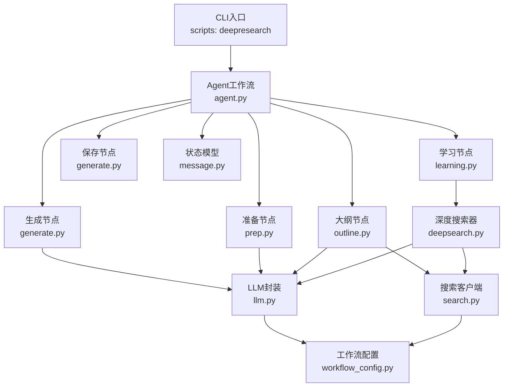
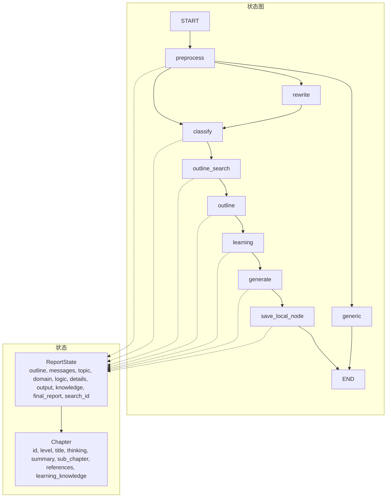
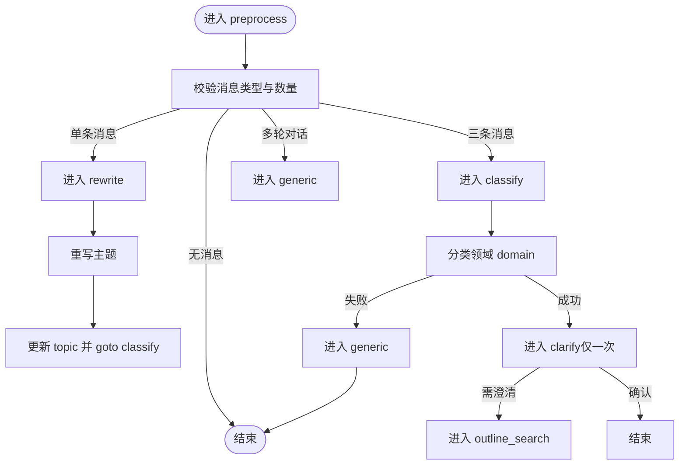
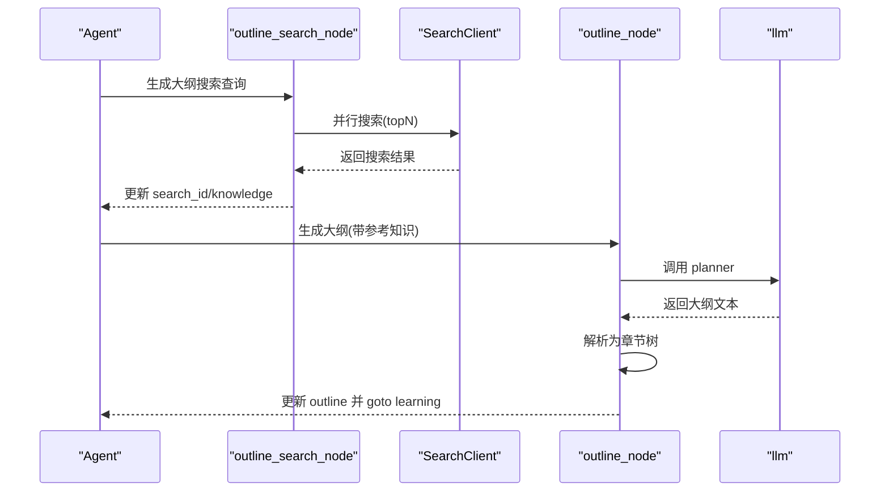
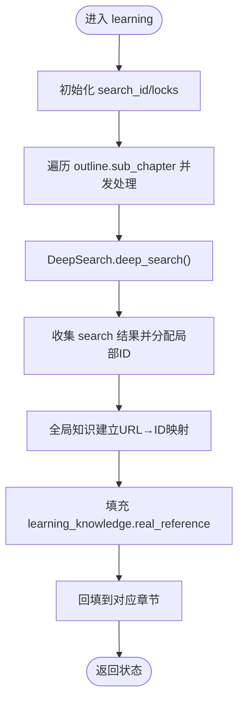
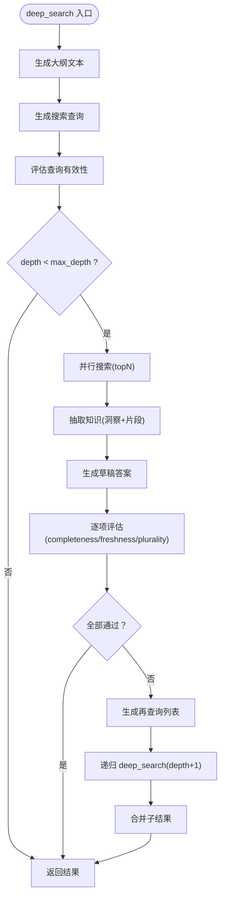
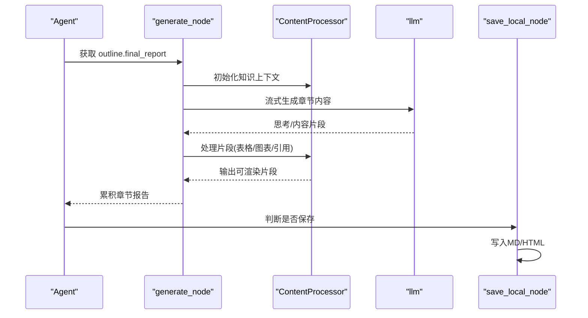
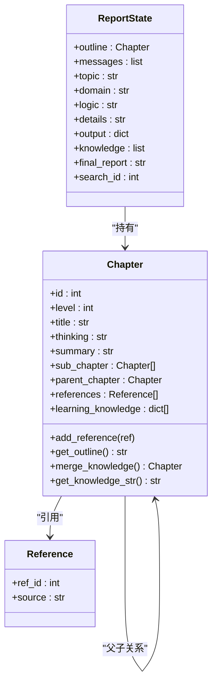
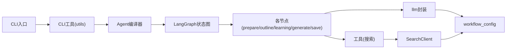

# 智能体系统

<cite>
**本文档引用的文件**
- [README.md](file://tools/DeepResearch/README.md)
- [架构设计文档](file://tools/DeepResearch/doc/architecture/architecture.md)
- [agent.py](file://tools/DeepResearch/src/deepresearch/agent/agent.py)
- [prep.py](file://tools/DeepResearch/src/deepresearch/agent/prep.py)
- [outline.py](file://tools/DeepResearch/src/deepresearch/agent/outline.py)
- [deepsearch.py](file://tools/DeepResearch/src/deepresearch/agent/deepsearch.py)
- [learning.py](file://tools/DeepResearch/src/deepresearch/agent/learning.py)
- [generate.py](file://tools/DeepResearch/src/deepresearch/agent/generate.py)
- [message.py](file://tools/DeepResearch/src/deepresearch/agent/message.py)
- [workflow_config.py](file://tools/DeepResearch/src/deepresearch/config/workflow_config.py)
- [search.py](file://tools/DeepResearch/src/deepresearch/tools/search.py)
- [llm.py](file://tools/DeepResearch/src/deepresearch/llms/llm.py)
- [pyproject.toml](file://tools/DeepResearch/pyproject.toml)
- [__main__.py](file://tools/DeepResearch/src/deepresearch/cli/__main__.py)
</cite>

## 目录
1. [简介](#简介)
2. [项目结构](#项目结构)
3. [核心组件](#核心组件)
4. [架构总览](#架构总览)
5. [详细组件分析](#详细组件分析)
6. [依赖分析](#依赖分析)
7. [性能考虑](#性能考虑)
8. [故障排查指南](#故障排查指南)
9. [结论](#结论)
10. [附录](#附录)

## 简介
本文件面向DeepResearch智能体系统，围绕“多智能体协作机制、角色分工与任务分配策略”展开，系统性梳理智能体核心功能模块、状态管理与决策逻辑，明确深度搜索智能体、生成智能体、学习智能体与准备智能体的职责划分与协作流程；同时给出通信协议、消息传递与协调机制，覆盖初始化、运行时管理与终止处理，并提供性能监控、资源消耗与优化策略，以及扩展、自定义与集成的最佳实践。

## 项目结构
DeepResearch采用模块化分层架构，核心由Agent工作流、LLM交互、Prompt模板、工具集与配置模块组成。CLI入口通过脚本注册提供命令行能力，系统通过LangGraph状态图编排各节点，形成“准备→大纲→学习→生成→保存”的闭环。

**图表来源**
- [pyproject.toml:79-80](file://tools/DeepResearch/pyproject.toml#L79-L80)
- [agent.py:19-44](file://tools/DeepResearch/src/deepresearch/agent/agent.py#L19-L44)
- [prep.py:21-80](file://tools/DeepResearch/src/deepresearch/agent/prep.py#L21-L80)
- [outline.py:22-85](file://tools/DeepResearch/src/deepresearch/agent/outline.py#L22-L85)
- [learning.py:15-93](file://tools/DeepResearch/src/deepresearch/agent/learning.py#L15-L93)
- [generate.py:26-160](file://tools/DeepResearch/src/deepresearch/agent/generate.py#L26-L160)
- [message.py:101-112](file://tools/DeepResearch/src/deepresearch/agent/message.py#L101-L112)
- [deepsearch.py:55-80](file://tools/DeepResearch/src/deepresearch/agent/deepsearch.py#L55-L80)
- [search.py:12-36](file://tools/DeepResearch/src/deepresearch/tools/search.py#L12-L36)
- [llm.py:146-184](file://tools/DeepResearch/src/deepresearch/llms/llm.py#L146-L184)
- [workflow_config.py:7-27](file://tools/DeepResearch/src/deepresearch/config/workflow_config.py#L7-L27)

**章节来源**
- [README.md:15-32](file://tools/DeepResearch/README.md#L15-L32)
- [架构设计文档:7-27](file://tools/DeepResearch/doc/architecture/architecture.md#L7-L27)
- [pyproject.toml:12-26](file://tools/DeepResearch/pyproject.toml#L12-L26)

## 核心组件
- 准备智能体（Prep）：负责消息预处理、重写用户需求、分类领域、澄清问题与通用对话兜底。
- 大纲智能体（Outline）：基于领域逻辑与参考知识生成报告大纲，解析Markdown结构并回填到状态。
- 学习智能体（Learning）：并发驱动深度搜索，抽取知识、评估答案、迭代生成研究查询，汇总引用映射。
- 深度搜索智能体（DeepSearch）：递归式检索-抽取-草稿-评估-再查询，构建知识树与最终答案。
- 生成智能体（Generate）：按章节流式生成报告，内嵌表格/图表工具渲染，引用替换与本地保存。
- 状态管理（ReportState/Chapter）：统一承载消息、主题、领域、大纲、知识、引用ID与最终报告。
- LLM封装（llm）：线程安全响应缓存、实例LRU缓存、流式/非流式统一接口。
- 搜索工具（SearchClient）：工厂模式选择引擎，屏蔽底层差异。
- 工作流配置（workflow_config）：集中读取工作流参数（如搜索topN、深度等）。

**章节来源**
- [agent.py:19-44](file://tools/DeepResearch/src/deepresearch/agent/agent.py#L19-L44)
- [prep.py:21-80](file://tools/DeepResearch/src/deepresearch/agent/prep.py#L21-L80)
- [outline.py:22-118](file://tools/DeepResearch/src/deepresearch/agent/outline.py#L22-L118)
- [learning.py:15-93](file://tools/DeepResearch/src/deepresearch/agent/learning.py#L15-L93)
- [deepsearch.py:55-80](file://tools/DeepResearch/src/deepresearch/agent/deepsearch.py#L55-L80)
- [generate.py:26-160](file://tools/DeepResearch/src/deepresearch/agent/generate.py#L26-L160)
- [message.py:101-112](file://tools/DeepResearch/src/deepresearch/agent/message.py#L101-L112)
- [llm.py:146-184](file://tools/DeepResearch/src/deepresearch/llms/llm.py#L146-L184)
- [search.py:12-36](file://tools/DeepResearch/src/deepresearch/tools/search.py#L12-L36)
- [workflow_config.py:7-27](file://tools/DeepResearch/src/deepresearch/config/workflow_config.py#L7-L27)

## 架构总览
系统采用LangGraph状态图编排，节点间通过条件边与命令控制流转，状态在节点间传递与累积。LLM封装提供统一推理能力，工具模块负责外部能力接入，配置模块集中管理参数。

**图表来源**
- [agent.py:19-44](file://tools/DeepResearch/src/deepresearch/agent/agent.py#L19-L44)
- [message.py:101-112](file://tools/DeepResearch/src/deepresearch/agent/message.py#L101-L112)

**章节来源**
- [架构设计文档:78-98](file://tools/DeepResearch/doc/architecture/architecture.md#L78-L98)

## 详细组件分析

### 准备智能体（Prep）
职责与流程
- 预处理：将多种消息类型统一为标准消息，空消息则结束流程。
- 重写：基于历史对话重写主题，提升后续规划质量。
- 分类：识别领域并加载对应逻辑与细节，若不支持则进入通用节点。
- 澄清：仅一次澄清，确认后直接结束，否则进入大纲搜索。
- 通用：对非研究类对话进行常规回复。

**图表来源**
- [prep.py:21-80](file://tools/DeepResearch/src/deepresearch/agent/prep.py#L21-L80)

**章节来源**
- [prep.py:21-80](file://tools/DeepResearch/src/deepresearch/agent/prep.py#L21-L80)

### 大纲智能体（Outline）
职责与流程
- 生成大纲搜索查询，调用搜索客户端并聚合结果。
- 将参考知识转为字符串传入LLM，生成结构化大纲。
- 解析Markdown大纲为章节树，回填到状态并进入学习节点。

**图表来源**
- [outline.py:22-118](file://tools/DeepResearch/src/deepresearch/agent/outline.py#L22-L118)
- [search.py:12-36](file://tools/DeepResearch/src/deepresearch/tools/search.py#L12-L36)
- [llm.py:146-184](file://tools/DeepResearch/src/deepresearch/llms/llm.py#L146-L184)

**章节来源**
- [outline.py:22-118](file://tools/DeepResearch/src/deepresearch/agent/outline.py#L22-L118)

### 学习智能体（Learning）
职责与流程
- 对每个二级章节并发执行深度搜索，限制最大并发。
- 汇总全局知识并建立URL→ID映射，填充学习知识的真实引用ID。
- 将学习知识回填到对应章节，供生成阶段合并与引用。

**图表来源**
- [learning.py:15-93](file://tools/DeepResearch/src/deepresearch/agent/learning.py#L15-L93)
- [deepsearch.py:55-80](file://tools/DeepResearch/src/deepresearch/agent/deepsearch.py#L55-L80)

**章节来源**
- [learning.py:15-93](file://tools/DeepResearch/src/deepresearch/agent/learning.py#L15-L93)

### 深度搜索智能体（DeepSearch）
职责与流程
- 递归式检索：生成查询→搜索→抽取知识→生成草稿→评估→未达标则生成再查询→继续递归。
- 知识抽取与引用：将多文档内容压缩后交给LLM抽取洞察，记录片段与引用来源。
- 终止条件：当所有评估均通过或达到最大深度。

**图表来源**
- [deepsearch.py:74-149](file://tools/DeepResearch/src/deepresearch/agent/deepsearch.py#L74-L149)

**章节来源**
- [deepsearch.py:55-489](file://tools/DeepResearch/src/deepresearch/agent/deepsearch.py#L55-L489)

### 生成智能体（Generate）
职责与流程
- 流式生成报告：按章节循环，调用LLM生成内容，实时打印与缓冲。
- 内容处理器：识别并渲染表格与图表，替换引用占位符为实际引用ID。
- 保存：根据配置决定是否保存为HTML/MD，并生成带参考文献的报告。

**图表来源**
- [generate.py:26-160](file://tools/DeepResearch/src/deepresearch/agent/generate.py#L26-L160)

**章节来源**
- [generate.py:26-343](file://tools/DeepResearch/src/deepresearch/agent/generate.py#L26-L343)

### 状态管理（ReportState/Chapter）
- ReportState：承载消息、主题、领域、逻辑、细节、输出、知识、最终报告、引用ID等。
- Chapter：章节树结构，支持合并同类知识、序列化为JSON字符串、生成Markdown大纲。

**图表来源**
- [message.py:101-112](file://tools/DeepResearch/src/deepresearch/agent/message.py#L101-L112)
- [message.py:12-29](file://tools/DeepResearch/src/deepresearch/agent/message.py#L12-L29)

**章节来源**
- [message.py:101-112](file://tools/DeepResearch/src/deepresearch/agent/message.py#L101-L112)

## 依赖分析
- CLI入口：通过脚本注册将命令映射到CLI工具主函数。
- LangGraph：状态图定义节点与边，条件边控制保存分支。
- LLM封装：统一LLM实例与响应缓存，支持流式/非流式。
- 搜索工具：工厂模式选择搜索引擎，屏蔽差异。
- 配置模块：集中读取工作流配置，影响搜索topN与深度等。

**图表来源**
- [pyproject.toml:79-80](file://tools/DeepResearch/pyproject.toml#L79-L80)
- [agent.py:19-44](file://tools/DeepResearch/src/deepresearch/agent/agent.py#L19-L44)
- [llm.py:146-184](file://tools/DeepResearch/src/deepresearch/llms/llm.py#L146-L184)
- [search.py:12-36](file://tools/DeepResearch/src/deepresearch/tools/search.py#L12-L36)
- [workflow_config.py:7-27](file://tools/DeepResearch/src/deepresearch/config/workflow_config.py#L7-L27)

**章节来源**
- [pyproject.toml:79-80](file://tools/DeepResearch/pyproject.toml#L79-L80)
- [agent.py:19-44](file://tools/DeepResearch/src/deepresearch/agent/agent.py#L19-L44)

## 性能考虑
- LLM实例缓存：LRU缓存最多24个实例，避免频繁创建。
- LLM响应缓存：基于消息哈希的线程安全LRU缓存，命中率统计可用于监控。
- 并行搜索与学习：大纲搜索与学习节点对查询/章节采用有界并发，避免API限流与资源耗尽。
- 流式生成：生成阶段采用流式输出，降低首屏延迟并实时渲染表格/图表。
- 参考知识截断：大纲参考知识字符串按长度截断，避免LLM上下文超限。

优化建议
- 动态调整并发度：根据API配额与延迟动态调整max_workers。
- 上下文压缩：对长知识进行摘要或分段，减少LLM输入长度。
- 缓存清理：定期清理过期缓存，释放内存压力。
- 监控指标：结合缓存命中率、平均响应时间、并发队列长度进行容量规划。

**章节来源**
- [llm.py:21-44](file://tools/DeepResearch/src/deepresearch/llms/llm.py#L21-L44)
- [llm.py:71-121](file://tools/DeepResearch/src/deepresearch/llms/llm.py#L71-L121)
- [outline.py:42-85](file://tools/DeepResearch/src/deepresearch/agent/outline.py#L42-L85)
- [learning.py:63-65](file://tools/DeepResearch/src/deepresearch/agent/learning.py#L63-L65)
- [outline.py:121-151](file://tools/DeepResearch/src/deepresearch/agent/outline.py#L121-L151)

## 故障排查指南
常见问题与定位
- LLM调用异常：检查消息是否为空、实例创建是否成功、响应是否为空。
- 搜索异常：确认搜索引擎配置正确、网络连通性、API密钥与限额。
- 大纲解析失败：检查LLM输出是否包含合法Markdown大纲，必要时增加提示词鲁棒性。
- 引用ID映射错误：核对URL→ID映射是否建立、去重与排序逻辑是否生效。
- 保存失败：检查保存路径权限、磁盘空间、HTML渲染是否报错。

日志与调试
- 使用彩色打印输出中间结果，便于观察搜索、抽取、评估与生成阶段。
- 在关键节点捕获异常并记录堆栈，辅助定位问题根因。

**章节来源**
- [llm.py:204-217](file://tools/DeepResearch/src/deepresearch/llms/llm.py#L204-L217)
- [search.py:25-36](file://tools/DeepResearch/src/deepresearch/tools/search.py#L25-L36)
- [outline.py:112-118](file://tools/DeepResearch/src/deepresearch/agent/outline.py#L112-L118)
- [generate.py:129-158](file://tools/DeepResearch/src/deepresearch/agent/generate.py#L129-L158)

## 结论
DeepResearch通过LangGraph状态图将准备、大纲、学习、生成与保存串联为可扩展的智能体工作流。准备智能体负责高质量输入，大纲智能体提供结构化骨架，学习智能体以递归检索与交叉评估确保知识质量，生成智能体实现可视化输出与引用闭环。LLM封装与工具模块提供稳定的能力边界，配置模块支撑灵活参数化。该架构具备良好的并发控制、缓存优化与可观测性，适合在多领域研究场景中落地与演进。

## 附录

### 初始化与运行时管理
- CLI入口：命令行通过脚本注册触发，内部调用CLI工具主函数。
- 状态图编译：构建状态图并编译为可执行图，节点间通过条件边与命令控制流转。
- 运行时配置：通过工作流配置读取搜索topN、深度等参数，影响各阶段行为。

**章节来源**
- [pyproject.toml:79-80](file://tools/DeepResearch/pyproject.toml#L79-L80)
- [agent.py:19-44](file://tools/DeepResearch/src/deepresearch/agent/agent.py#L19-L44)
- [workflow_config.py:7-27](file://tools/DeepResearch/src/deepresearch/config/workflow_config.py#L7-L27)

### 终止处理
- 条件保存：生成完成后根据配置决定是否保存本地，随后结束。
- 通用兜底：若准备阶段判定为非研究类对话，直接结束并返回确认消息。

**章节来源**
- [generate.py:114-123](file://tools/DeepResearch/src/deepresearch/agent/generate.py#L114-L123)
- [prep.py:171-181](file://tools/DeepResearch/src/deepresearch/agent/prep.py#L171-L181)

### 扩展、自定义与集成最佳实践
- 新增LLM类型：在配置中新增类型并在LLM封装中注册；注意实例与响应缓存键。
- 新增工具：实现工具接口并接入SearchClient工厂，或在节点中直接调用。
- 新增Prompt模板：在模板系统中新增模板文件并通过apply_prompt_template调用。
- 扩展工作流：在agent图中新增节点与边，确保状态字段完整且节点间数据契约清晰。
- 参数化：通过工作流配置集中管理可调参数，避免硬编码。

**章节来源**
- [架构设计文档:131-139](file://tools/DeepResearch/doc/architecture/architecture.md#L131-L139)
- [llm.py:24-44](file://tools/DeepResearch/src/deepresearch/llms/llm.py#L24-L44)
- [search.py:12-23](file://tools/DeepResearch/src/deepresearch/tools/search.py#L12-L23)
- [agent.py:19-44](file://tools/DeepResearch/src/deepresearch/agent/agent.py#L19-L44)