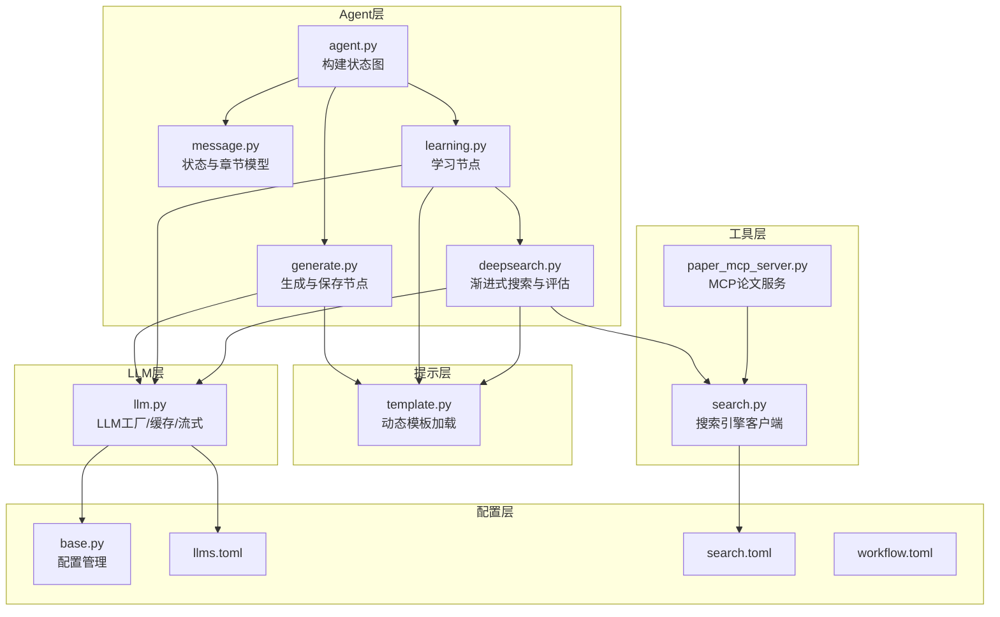
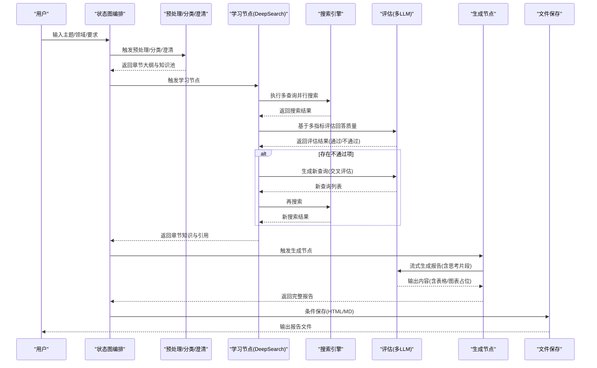
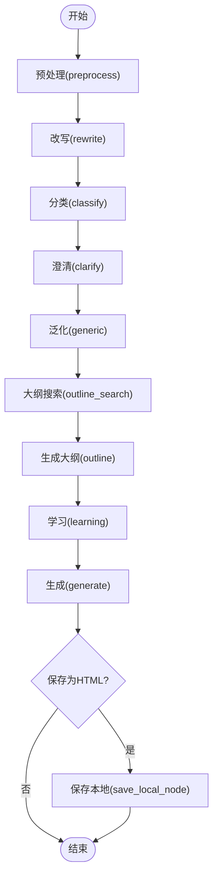
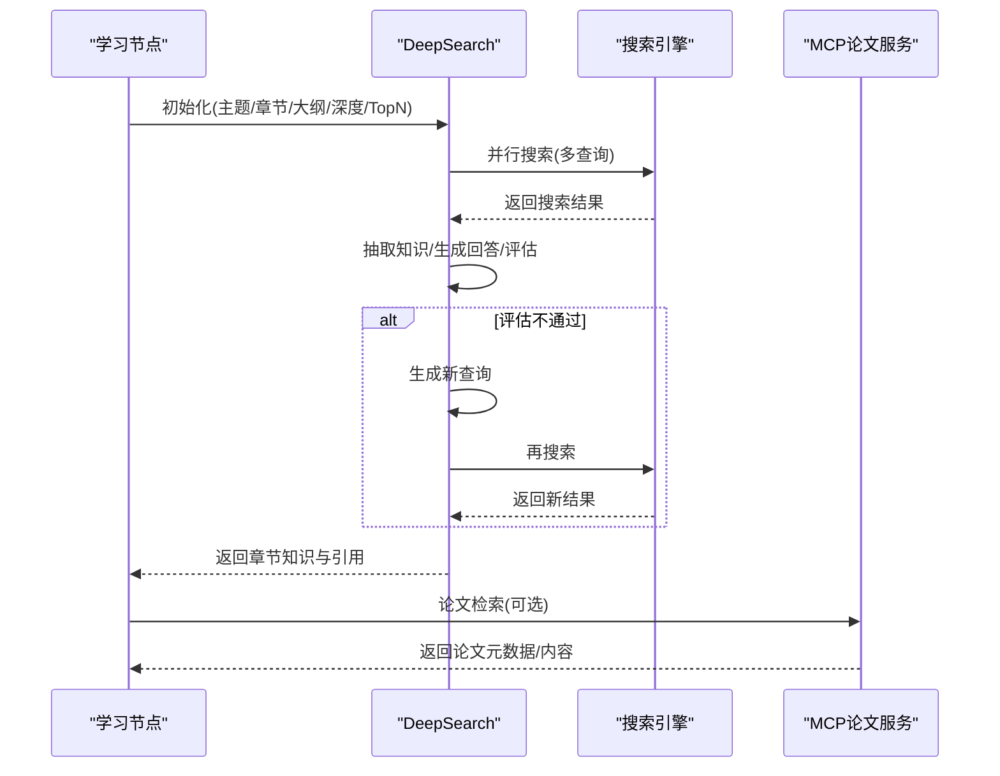
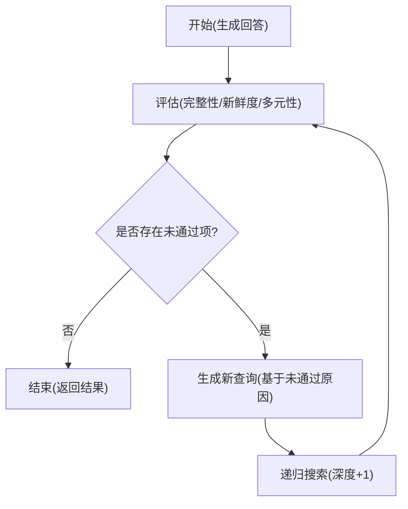
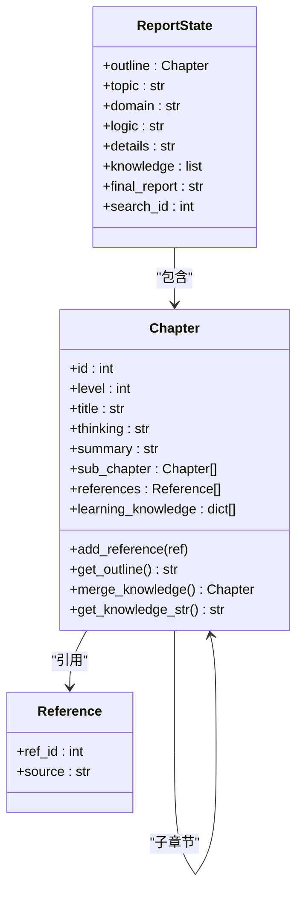
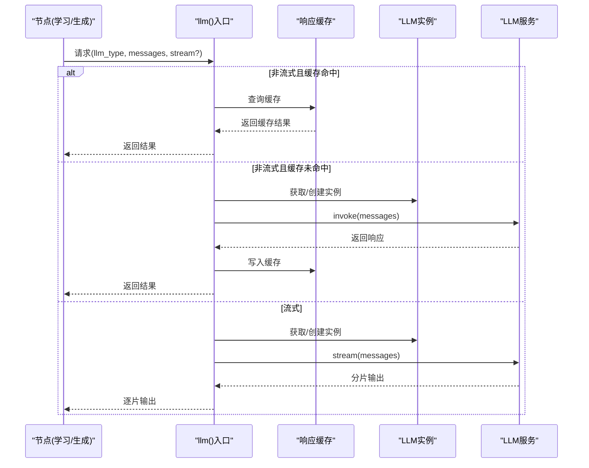
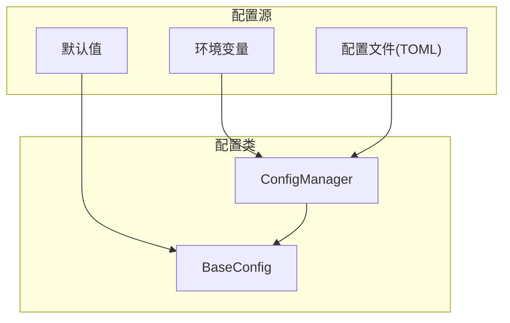
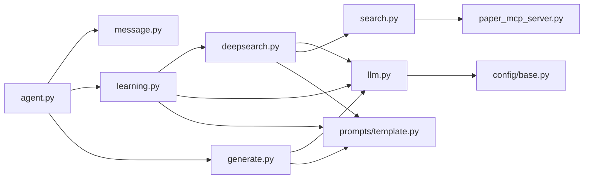

# 框架架构设计

<cite>
**本文档引用的文件**
- [__init__.py](file://tools/DeepResearch/src/deepresearch/__init__.py)
- [agent.py](file://tools/DeepResearch/src/deepresearch/agent/agent.py)
- [deepsearch.py](file://tools/DeepResearch/src/deepresearch/agent/deepsearch.py)
- [learning.py](file://tools/DeepResearch/src/deepresearch/agent/learning.py)
- [generate.py](file://tools/DeepResearch/src/deepresearch/agent/generate.py)
- [message.py](file://tools/DeepResearch/src/deepresearch/agent/message.py)
- [llm.py](file://tools/DeepResearch/src/deepresearch/llms/llm.py)
- [template.py](file://tools/DeepResearch/src/deepresearch/prompts/template.py)
- [search.py](file://tools/DeepResearch/src/deepresearch/tools/search.py)
- [base.py](file://tools/DeepResearch/src/deepresearch/config/base.py)
- [llms.toml](file://tools/DeepResearch/config/llms.toml)
- [search.toml](file://tools/DeepResearch/config/search.toml)
- [workflow.toml](file://tools/DeepResearch/config/workflow.toml)
- [paper_mcp_server.py](file://tools/DeepResearch/src/deepresearch/mcp_client/paper_mcp_server.py)
</cite>

## 目录
1. [引言](#引言)
2. [项目结构](#项目结构)
3. [核心组件](#核心组件)
4. [架构总览](#架构总览)
5. [详细组件分析](#详细组件分析)
6. [依赖关系分析](#依赖关系分析)
7. [性能考虑](#性能考虑)
8. [故障排查指南](#故障排查指南)
9. [结论](#结论)
10. [附录](#附录)

## 引言
本文件面向DeepResearch框架，系统化阐述其“渐进式搜索 + 交叉评估”的轻量级研究与报告生成架构。该框架围绕多LLM协作、智能工作流与模块化组件展开，通过状态图编排Agent节点，结合提示模板、工具调用与评估迭代算法，实现从主题到章节再到全文的深度学习与生成。同时，文档给出架构图解、组件关系图与部署拓扑说明，并总结性能优化、可扩展性与故障恢复策略。

## 项目结构
DeepResearch位于tools/DeepResearch目录下，采用分层与模块化组织：
- agent层：定义状态图与各节点（预处理、分类、澄清、泛化、大纲生成、学习、生成、保存等）
- agent/deepsearch：实现渐进式搜索与评估迭代
- llms：封装LLM调用、缓存与流式输出
- prompts：动态加载提示模板
- tools：搜索引擎客户端与MCP论文检索服务
- config：配置管理与多源覆盖加载
- mcp_client：论文检索MCP服务器

图表来源
- [agent.py:19-45](file://tools/DeepResearch/src/deepresearch/agent/agent.py#L19-L45)
- [message.py:101-112](file://tools/DeepResearch/src/deepresearch/agent/message.py#L101-L112)
- [learning.py:15-94](file://tools/DeepResearch/src/deepresearch/agent/learning.py#L15-L94)
- [generate.py:26-112](file://tools/DeepResearch/src/deepresearch/agent/generate.py#L26-L112)
- [deepsearch.py:55-81](file://tools/DeepResearch/src/deepresearch/agent/deepsearch.py#L55-L81)
- [llm.py:146-185](file://tools/DeepResearch/src/deepresearch/llms/llm.py#L146-L185)
- [template.py:90-129](file://tools/DeepResearch/src/deepresearch/prompts/template.py#L90-L129)
- [search.py:12-37](file://tools/DeepResearch/src/deepresearch/tools/search.py#L12-L37)
- [paper_mcp_server.py:445-463](file://tools/DeepResearch/src/deepresearch/mcp_client/paper_mcp_server.py#L445-L463)
- [base.py:536-590](file://tools/DeepResearch/src/deepresearch/config/base.py#L536-L590)
- [llms.toml:1-29](file://tools/DeepResearch/config/llms.toml#L1-L29)
- [search.toml:1-6](file://tools/DeepResearch/config/search.toml#L1-L6)
- [workflow.toml:1-3](file://tools/DeepResearch/config/workflow.toml#L1-L3)

章节来源
- [__init__.py:4-29](file://tools/DeepResearch/src/deepresearch/__init__.py#L4-L29)
- [agent.py:19-45](file://tools/DeepResearch/src/deepresearch/agent/agent.py#L19-L45)
- [message.py:101-112](file://tools/DeepResearch/src/deepresearch/agent/message.py#L101-L112)

## 核心组件
- 状态图与节点编排：通过LangGraph构建状态图，串联预处理、分类、澄清、泛化、大纲搜索与生成、保存等节点，形成可条件跳转的工作流。
- 渐进式搜索与评估：DeepSearch在多轮搜索-抽取-回答-评估之间迭代，依据评估结果动态生成新查询，直至满足完整性、新鲜度、多元性等指标。
- 多LLM协作：llm模块按类型（query_generation、evaluate、report等）工厂化创建实例，内置响应缓存与线程安全LRU缓存，支持流式与非流式输出。
- 提示模板系统：template模块动态扫描多个子目录，按约定提取PROMPT与SYSTEM_PROMPT，按需注入变量生成消息序列。
- 工具与外部系统：search模块根据配置选择搜索引擎；MCP论文服务提供arXiv/PubMed检索与阅读能力，支持本地缓存与PDF转Markdown。
- 配置管理：base.py提供多源配置加载（默认/文件/环境/代码），支持字段校验、敏感信息脱敏与缓存清理。

章节来源
- [agent.py:19-45](file://tools/DeepResearch/src/deepresearch/agent/agent.py#L19-L45)
- [deepsearch.py:74-150](file://tools/DeepResearch/src/deepresearch/agent/deepsearch.py#L74-L150)
- [llm.py:146-256](file://tools/DeepResearch/src/deepresearch/llms/llm.py#L146-L256)
- [template.py:25-87](file://tools/DeepResearch/src/deepresearch/prompts/template.py#L25-L87)
- [search.py:12-37](file://tools/DeepResearch/src/deepresearch/tools/search.py#L12-L37)
- [paper_mcp_server.py:445-463](file://tools/DeepResearch/src/deepresearch/mcp_client/paper_mcp_server.py#L445-L463)
- [base.py:536-590](file://tools/DeepResearch/src/deepresearch/config/base.py#L536-L590)

## 架构总览
下图展示从用户输入到最终报告产出的端到端流程，以及多LLM协作与工具调用的关键交互点。

图表来源
- [agent.py:19-45](file://tools/DeepResearch/src/deepresearch/agent/agent.py#L19-L45)
- [learning.py:15-94](file://tools/DeepResearch/src/deepresearch/agent/learning.py#L15-L94)
- [deepsearch.py:74-150](file://tools/DeepResearch/src/deepresearch/agent/deepsearch.py#L74-L150)
- [generate.py:26-112](file://tools/DeepResearch/src/deepresearch/agent/generate.py#L26-L112)

## 详细组件分析

### Agent系统与状态图编排
- 状态图由START指向“preprocess”，随后依次经过rewrite/classify/clarify/generic，再进入outline_search与outline，然后进入learning，最后由generate节点根据保存策略决定进入save_local_node或结束。
- ReportState承载章节树、主题、领域、逻辑细节、知识池、最终报告与搜索ID等上下文，确保跨节点状态传递。

图表来源
- [agent.py:19-45](file://tools/DeepResearch/src/deepresearch/agent/agent.py#L19-L45)
- [message.py:101-112](file://tools/DeepResearch/src/deepresearch/agent/message.py#L101-L112)

章节来源
- [agent.py:19-45](file://tools/DeepResearch/src/deepresearch/agent/agent.py#L19-L45)
- [message.py:101-112](file://tools/DeepResearch/src/deepresearch/agent/message.py#L101-L112)

### 任务规划引擎与工具调用机制
- 任务规划：outline_search与outline节点基于章节大纲生成查询与结构化内容，为后续学习与生成提供骨架。
- 工具调用：search模块根据配置选择搜索引擎；MCP论文服务提供arXiv/PubMed检索与阅读能力，支持异步下载与本地缓存。
- 并发控制：学习节点中对章节采用线程池并发处理，避免LLM调用过载；DeepSearch内部对查询执行并行搜索，最大并发受控。

图表来源
- [learning.py:15-94](file://tools/DeepResearch/src/deepresearch/agent/learning.py#L15-L94)
- [deepsearch.py:209-239](file://tools/DeepResearch/src/deepresearch/agent/deepsearch.py#L209-L239)
- [search.py:12-37](file://tools/DeepResearch/src/deepresearch/tools/search.py#L12-L37)
- [paper_mcp_server.py:445-463](file://tools/DeepResearch/src/deepresearch/mcp_client/paper_mcp_server.py#L445-L463)

章节来源
- [learning.py:15-94](file://tools/DeepResearch/src/deepresearch/agent/learning.py#L15-L94)
- [deepsearch.py:209-239](file://tools/DeepResearch/src/deepresearch/agent/deepsearch.py#L209-L239)
- [search.py:12-37](file://tools/DeepResearch/src/deepresearch/tools/search.py#L12-L37)
- [paper_mcp_server.py:445-463](file://tools/DeepResearch/src/deepresearch/mcp_client/paper_mcp_server.py#L445-L463)

### 评估迭代算法
- 指标体系：完整性、新鲜度、多元性三类评估，分别对应不同提示模板与LLM类型。
- 迭代策略：若任一评估未通过，则基于评估理由生成新的搜索查询，递归加深学习，直到全部通过或达到最大深度。
- 引用追踪：维护全局知识池与引用映射，确保报告中的引用与实际来源一致。

图表来源
- [deepsearch.py:351-418](file://tools/DeepResearch/src/deepresearch/agent/deepsearch.py#L351-L418)

章节来源
- [deepsearch.py:351-418](file://tools/DeepResearch/src/deepresearch/agent/deepsearch.py#L351-L418)

### 智能工作流与模块化组件
- 模板化提示：template模块按目录扫描加载提示，支持系统提示与用户提示分离，便于维护与扩展。
- 知识合并：Chapter.merge_knowledge按引用聚合相同洞察，减少冗余；get_knowledge_str序列化为JSON供LLM消费。
- 内容处理器：ContentProcessor在流式生成过程中识别表格/图表标记，动态生成可视化内容并替换引用占位符。

图表来源
- [message.py:12-112](file://tools/DeepResearch/src/deepresearch/agent/message.py#L12-L112)

章节来源
- [message.py:12-112](file://tools/DeepResearch/src/deepresearch/agent/message.py#L12-L112)
- [template.py:25-87](file://tools/DeepResearch/src/deepresearch/prompts/template.py#L25-L87)
- [generate.py:169-295](file://tools/DeepResearch/src/deepresearch/agent/generate.py#L169-L295)

### 多LLM协作机制与缓存策略
- LLM工厂：按类型创建实例，统一温度与最大token；LRU缓存限制实例数量，避免资源膨胀。
- 响应缓存：对非流式请求按消息哈希缓存，命中则直接返回；统计命中率用于监控。
- 流式输出：支持边生成边输出，兼顾用户体验与内存占用。

图表来源
- [llm.py:146-256](file://tools/DeepResearch/src/deepresearch/llms/llm.py#L146-L256)

章节来源
- [llm.py:146-256](file://tools/DeepResearch/src/deepresearch/llms/llm.py#L146-L256)

### 配置管理与部署拓扑
- 配置加载顺序（高到低）：代码默认 → 环境变量 → 配置文件 → 默认值；支持字段校验、敏感信息脱敏与缓存清理。
- LLM配置：llms.toml定义不同用途的LLM类型（basic/clarify/planner/query_generation/evaluate/report）。
- 搜索配置：search.toml定义搜索引擎（jina/tavily）、超时与密钥。
- 工作流配置：workflow.toml定义搜索TopN等参数。

图表来源
- [base.py:536-590](file://tools/DeepResearch/src/deepresearch/config/base.py#L536-L590)
- [llms.toml:1-29](file://tools/DeepResearch/config/llms.toml#L1-L29)
- [search.toml:1-6](file://tools/DeepResearch/config/search.toml#L1-L6)
- [workflow.toml:1-3](file://tools/DeepResearch/config/workflow.toml#L1-L3)

章节来源
- [base.py:536-590](file://tools/DeepResearch/src/deepresearch/config/base.py#L536-L590)
- [llms.toml:1-29](file://tools/DeepResearch/config/llms.toml#L1-L29)
- [search.toml:1-6](file://tools/DeepResearch/config/search.toml#L1-L6)
- [workflow.toml:1-3](file://tools/DeepResearch/config/workflow.toml#L1-L3)

## 依赖关系分析
- 组件耦合：Agent层依赖消息状态与各节点实现；学习节点依赖DeepSearch与搜索引擎；生成节点依赖LLM与提示模板；LLM依赖配置管理与提示模板。
- 外部依赖：LangChain、LangGraph、MCP服务器、搜索引擎SDK与HTTP客户端。
- 潜在循环：当前文件组织未见循环导入；各模块职责清晰，通过函数/类边界隔离。

图表来源
- [agent.py:19-45](file://tools/DeepResearch/src/deepresearch/agent/agent.py#L19-L45)
- [message.py:101-112](file://tools/DeepResearch/src/deepresearch/agent/message.py#L101-L112)
- [learning.py:15-94](file://tools/DeepResearch/src/deepresearch/agent/learning.py#L15-L94)
- [generate.py:26-112](file://tools/DeepResearch/src/deepresearch/agent/generate.py#L26-L112)
- [deepsearch.py:55-81](file://tools/DeepResearch/src/deepresearch/agent/deepsearch.py#L55-L81)
- [llm.py:146-185](file://tools/DeepResearch/src/deepresearch/llms/llm.py#L146-L185)
- [template.py:90-129](file://tools/DeepResearch/src/deepresearch/prompts/template.py#L90-L129)
- [search.py:12-37](file://tools/DeepResearch/src/deepresearch/tools/search.py#L12-L37)
- [paper_mcp_server.py:445-463](file://tools/DeepResearch/src/deepresearch/mcp_client/paper_mcp_server.py#L445-L463)

章节来源
- [agent.py:19-45](file://tools/DeepResearch/src/deepresearch/agent/agent.py#L19-L45)
- [llm.py:146-185](file://tools/DeepResearch/src/deepresearch/llms/llm.py#L146-L185)

## 性能考虑
- 并发与限流
  - 搜索并发：DeepSearch对查询使用线程池并行搜索，最大并发受控，避免搜索引擎限流与LLM调用压力。
  - 学习并发：学习节点对章节采用线程池并发处理，最大并发不超过3，降低API成本与延迟。
- 缓存策略
  - LLM实例LRU缓存：限制最大实例数，避免内存膨胀。
  - 响应缓存：对非流式请求按消息哈希缓存，命中率统计用于性能监控。
- I/O优化
  - MCP论文服务本地缓存元数据与Markdown，避免重复下载与转换。
  - ContentProcessor在流式生成中按字符缓冲，减少频繁输出开销。
- 提示模板懒加载：仅在首次使用时加载，减少启动时间与内存占用。

章节来源
- [deepsearch.py:209-239](file://tools/DeepResearch/src/deepresearch/agent/deepsearch.py#L209-L239)
- [learning.py:63-66](file://tools/DeepResearch/src/deepresearch/agent/learning.py#L63-L66)
- [llm.py:21-44](file://tools/DeepResearch/src/deepresearch/llms/llm.py#L21-L44)
- [llm.py:71-121](file://tools/DeepResearch/src/deepresearch/llms/llm.py#L71-L121)
- [paper_mcp_server.py:29-35](file://tools/DeepResearch/src/deepresearch/mcp_client/paper_mcp_server.py#L29-L35)
- [generate.py:169-201](file://tools/DeepResearch/src/deepresearch/agent/generate.py#L169-L201)
- [template.py:78-87](file://tools/DeepResearch/src/deepresearch/prompts/template.py#L78-L87)

## 故障排查指南
- LLM相关
  - invoke/stream异常：捕获并记录错误，返回空字符串或空生成器，避免中断流程。
  - 缓存命中率低：检查消息哈希一致性与输入稳定性；必要时清理缓存。
- 搜索与MCP
  - 搜索失败：记录查询与异常，回退为空结果；检查搜索引擎密钥与网络。
  - MCP服务异常：确认服务进程运行、存储目录权限与依赖安装（如pymupdf4llm）。
- 配置问题
  - 环境变量/文件加载失败：检查键名大小写、类型与取值范围；使用脱敏打印定位敏感字段。
  - 配置缓存：动态更新配置文件后调用清理缓存函数。

章节来源
- [llm.py:215-240](file://tools/DeepResearch/src/deepresearch/llms/llm.py#L215-L240)
- [paper_mcp_server.py:148-153](file://tools/DeepResearch/src/deepresearch/mcp_client/paper_mcp_server.py#L148-L153)
- [search.py:223-237](file://tools/DeepResearch/src/deepresearch/tools/search.py#L223-L237)
- [base.py:513-516](file://tools/DeepResearch/src/deepresearch/config/base.py#L513-L516)

## 结论
DeepResearch通过“状态图编排 + 渐进式搜索 + 交叉评估”的组合，实现了轻量而高效的智能研究与报告生成系统。其多LLM协作、模块化提示与工具链、严格的配置与缓存策略，共同保证了可扩展性与稳定性。建议在生产环境中结合限流、熔断与可观测性进一步增强鲁棒性。

## 附录
- API与接口设计原则
  - 统一的消息格式：System/Human/AI消息类型，便于LLM理解上下文。
  - 可配置的LLM类型：通过配置文件切换不同模型与参数，适配不同任务。
  - 工具接口标准化：搜索引擎与MCP服务遵循统一的输入/输出规范，便于替换与扩展。
- 部署建议
  - 将配置文件置于受控目录，配合环境变量进行差异化部署。
  - 在容器中限定并发与缓存容量，结合健康检查与日志采集。
  - 对论文缓存目录持久化，提升重复任务效率。