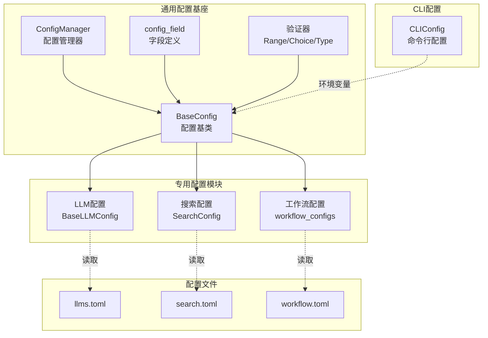
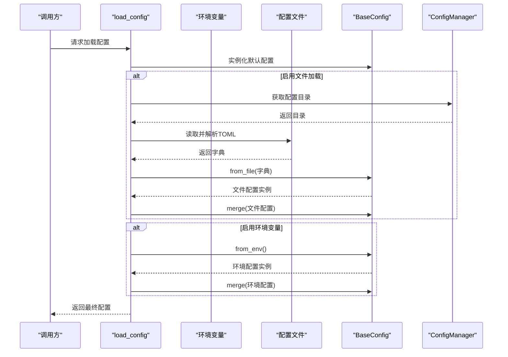
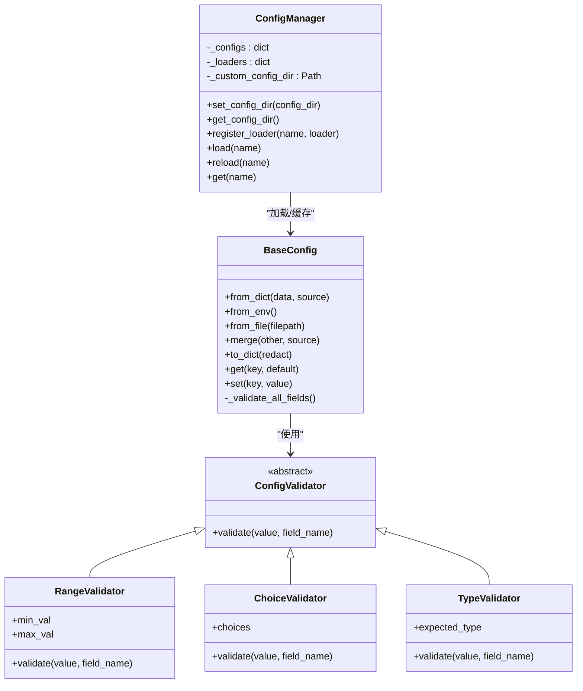
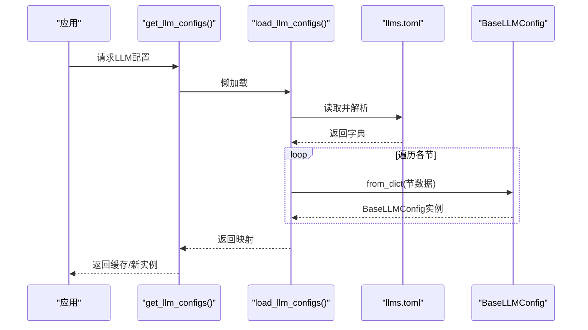
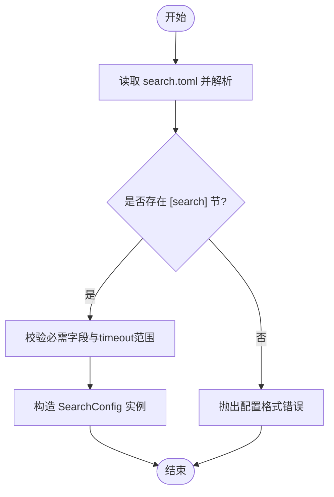
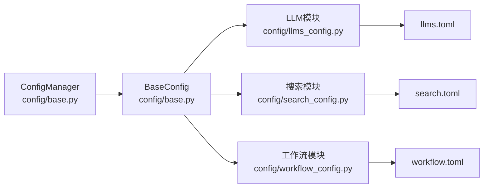

# 配置管理系统

<cite>
**本文引用的文件**
- [config/base.py](file://tools/DeepResearch/src/deepresearch/config/base.py)
- [config/__init__.py](file://tools/DeepResearch/src/deepresearch/config/__init__.py)
- [config/llms_config.py](file://tools/DeepResearch/src/deepresearch/config/llms_config.py)
- [config/search_config.py](file://tools/DeepResearch/src/deepresearch/config/search_config.py)
- [config/workflow_config.py](file://tools/DeepResearch/src/deepresearch/config/workflow_config.py)
- [config/llms.toml](file://tools/DeepResearch/config/llms.toml)
- [config/search.toml](file://tools/DeepResearch/config/search.toml)
- [config/workflow.toml](file://tools/DeepResearch/config/workflow.toml)
- [cli/config.py](file://tools/DeepResearch/src/deepresearch/cli/config.py)
- [errors.py](file://tools/DeepResearch/src/deepresearch/errors.py)
- [tests/unit/config/test_base.py](file://tools/DeepResearch/tests/unit/config/test_base.py)
</cite>

## 目录
1. [简介](#简介)
2. [项目结构](#项目结构)
3. [核心组件](#核心组件)
4. [架构总览](#架构总览)
5. [详细组件分析](#详细组件分析)
6. [依赖分析](#依赖分析)
7. [性能考虑](#性能考虑)
8. [故障排查指南](#故障排查指南)
9. [结论](#结论)
10. [附录](#附录)

## 简介
本文件面向DeepResearch配置管理系统，系统化梳理配置文件结构、参数定义与加载机制，详解LLM配置、搜索配置与工作流配置的管理方式与优先级规则；阐明配置文件格式规范、验证机制与热重载能力；提供配置项分类管理、默认值与环境变量覆盖策略；并结合现有审计日志与权限模型，给出安全存储、访问控制与审计实践建议。最后提供配置优化、性能调优与故障诊断的实用指南。

## 项目结构
DeepResearch配置系统由“通用配置基座 + 专用配置模块 + CLI配置 + TOML配置文件”构成，采用分层设计：
- 通用配置基座：提供统一的配置类、验证器、加载器、目录解析与缓存机制
- 专用配置模块：LLM配置、搜索配置、工作流配置，各自负责解析与暴露强类型配置对象
- CLI配置：命令行工具的运行时配置，支持环境变量覆盖
- TOML配置文件：以键值形式定义各模块参数，按需加载

图表来源
- [config/base.py:190-372](file://tools/DeepResearch/src/deepresearch/config/base.py#L190-L372)
- [config/llms_config.py:12-90](file://tools/DeepResearch/src/deepresearch/config/llms_config.py#L12-L90)
- [config/search_config.py:12-54](file://tools/DeepResearch/src/deepresearch/config/search_config.py#L12-L54)
- [config/workflow_config.py:7-18](file://tools/DeepResearch/src/deepresearch/config/workflow_config.py#L7-L18)
- [cli/config.py:15-64](file://tools/DeepResearch/src/deepresearch/cli/config.py#L15-L64)

章节来源
- [config/base.py:1-590](file://tools/DeepResearch/src/deepresearch/config/base.py#L1-L590)
- [config/llms_config.py:1-115](file://tools/DeepResearch/src/deepresearch/config/llms_config.py#L1-L115)
- [config/search_config.py:1-82](file://tools/DeepResearch/src/deepresearch/config/search_config.py#L1-L82)
- [config/workflow_config.py:1-28](file://tools/DeepResearch/src/deepresearch/config/workflow_config.py#L1-L28)
- [cli/config.py:1-101](file://tools/DeepResearch/src/deepresearch/cli/config.py#L1-L101)

## 核心组件
- BaseConfig：提供从字典、文件、环境变量加载配置的能力，支持字段级验证、合并与脱敏输出
- ConfigManager：集中管理配置目录、注册加载器、缓存与热重载
- 验证器：RangeValidator、ChoiceValidator、TypeValidator，支持范围、选项与类型校验
- 专用配置模块：
  - LLM配置：统一LLM参数，支持批量加载与按角色获取
  - 搜索配置：引擎选择、超时、密钥等
  - 工作流配置：流程参数（如topN）

章节来源
- [config/base.py:190-372](file://tools/DeepResearch/src/deepresearch/config/base.py#L190-L372)
- [config/base.py:65-150](file://tools/DeepResearch/src/deepresearch/config/base.py#L65-L150)
- [config/llms_config.py:12-90](file://tools/DeepResearch/src/deepresearch/config/llms_config.py#L12-L90)
- [config/search_config.py:12-54](file://tools/DeepResearch/src/deepresearch/config/search_config.py#L12-L54)
- [config/workflow_config.py:7-18](file://tools/DeepResearch/src/deepresearch/config/workflow_config.py#L7-L18)

## 架构总览
配置系统遵循“文件/环境变量/默认值”的多源覆盖策略，并通过ConfigManager集中管理目录与缓存，确保加载一致性与可热重载。

图表来源
- [config/base.py:536-590](file://tools/DeepResearch/src/deepresearch/config/base.py#L536-L590)
- [config/base.py:224-291](file://tools/DeepResearch/src/deepresearch/config/base.py#L224-L291)
- [config/base.py:374-456](file://tools/DeepResearch/src/deepresearch/config/base.py#L374-L456)

## 详细组件分析

### 通用配置基座（BaseConfig 与 ConfigManager）
- 配置来源与优先级：代码默认值 → 环境变量 → 配置文件 → 默认值（由上至下覆盖）
- 加载能力：
  - from_dict：从字典创建配置，过滤非法字段
  - from_env：按约定前缀解析布尔/整数/字符串
  - from_file：解析TOML并构造配置
  - merge：以“后者优先”合并配置
- 验证与输出：
  - __post_init__中逐字段执行验证器
  - to_dict支持脱敏输出
- 管理与缓存：
  - ConfigManager集中管理配置目录（优先自定义，其次环境变量，最后默认）
  - 内置LRU缓存加载TOML，支持clear_config_cache手动清缓存

图表来源
- [config/base.py:190-372](file://tools/DeepResearch/src/deepresearch/config/base.py#L190-L372)
- [config/base.py:65-150](file://tools/DeepResearch/src/deepresearch/config/base.py#L65-L150)
- [config/base.py:374-456](file://tools/DeepResearch/src/deepresearch/config/base.py#L374-L456)

章节来源
- [config/base.py:190-372](file://tools/DeepResearch/src/deepresearch/config/base.py#L190-L372)
- [config/base.py:374-456](file://tools/DeepResearch/src/deepresearch/config/base.py#L374-L456)
- [config/base.py:65-150](file://tools/DeepResearch/src/deepresearch/config/base.py#L65-L150)

### LLM配置模块（BaseLLMConfig 与批量加载）
- 结构：统一包含base_url、api_base、model、api_key等关键参数
- 加载流程：读取llms.toml → 遍历各节 → 构造BaseLLMConfig实例 → 提供按角色获取的便捷函数
- 脱敏与热重载：提供脱敏输出与全局缓存清理入口

图表来源
- [config/llms_config.py:46-95](file://tools/DeepResearch/src/deepresearch/config/llms_config.py#L46-L95)
- [config/llms.toml:1-29](file://tools/DeepResearch/config/llms.toml#L1-L29)

章节来源
- [config/llms_config.py:1-115](file://tools/DeepResearch/src/deepresearch/config/llms_config.py#L1-L115)
- [config/llms.toml:1-29](file://tools/DeepResearch/config/llms.toml#L1-L29)

### 搜索配置模块（SearchConfig）
- 关键参数：engine（引擎）、jina_api_key、tavily_api_key、timeout（秒）
- 校验逻辑：必需字段检查、timeout范围校验（1~300）
- 加载入口：load_search_config，要求存在[search]节

图表来源
- [config/search_config.py:56-72](file://tools/DeepResearch/src/deepresearch/config/search_config.py#L56-L72)
- [config/search.toml:1-6](file://tools/DeepResearch/config/search.toml#L1-L6)

章节来源
- [config/search_config.py:1-82](file://tools/DeepResearch/src/deepresearch/config/search_config.py#L1-L82)
- [config/search.toml:1-6](file://tools/DeepResearch/config/search.toml#L1-L6)

### 工作流配置模块（workflow_configs）
- 结构：直接返回workflow.toml根级字典
- 应用：如topN等流程参数

章节来源
- [config/workflow_config.py:1-28](file://tools/DeepResearch/src/deepresearch/config/workflow_config.py#L1-L28)
- [config/workflow.toml:1-3](file://tools/DeepResearch/config/workflow.toml#L1-L3)

### CLI配置（CLIConfig）
- 支持环境变量覆盖：DEEPRESEARCH_* 前缀
- 参数范围约束：如max_depth、max_history、timeout等
- 目录解析：优先使用显式传入，否则回退到用户主目录下的“.deepresearch”

章节来源
- [cli/config.py:15-64](file://tools/DeepResearch/src/deepresearch/cli/config.py#L15-L64)

## 依赖分析
- 组件耦合
  - 专用配置模块依赖通用配置基座的加载与脱敏能力
  - ConfigManager集中管理配置目录与缓存，降低文件IO与解析成本
- 外部依赖
  - TOML解析：标准库tomllib
  - 环境变量：os.getenv
  - 缓存：functools.lru_cache
- 潜在循环依赖
  - 当前模块间为单向依赖（专用模块依赖基座），未见循环

图表来源
- [config/base.py:374-456](file://tools/DeepResearch/src/deepresearch/config/base.py#L374-L456)
- [config/llms_config.py:1-115](file://tools/DeepResearch/src/deepresearch/config/llms_config.py#L1-L115)
- [config/search_config.py:1-82](file://tools/DeepResearch/src/deepresearch/config/search_config.py#L1-L82)
- [config/workflow_config.py:1-28](file://tools/DeepResearch/src/deepresearch/config/workflow_config.py#L1-L28)

章节来源
- [config/base.py:374-456](file://tools/DeepResearch/src/deepresearch/config/base.py#L374-L456)
- [config/llms_config.py:1-115](file://tools/DeepResearch/src/deepresearch/config/llms_config.py#L1-L115)
- [config/search_config.py:1-82](file://tools/DeepResearch/src/deepresearch/config/search_config.py#L1-L82)
- [config/workflow_config.py:1-28](file://tools/DeepResearch/src/deepresearch/config/workflow_config.py#L1-L28)

## 性能考虑
- 缓存策略
  - TOML文件解析使用LRU缓存，避免重复IO与解析开销
  - ConfigManager内部缓存已加载配置实例，减少重复构建
- 优化建议
  - 对频繁访问的配置（如LLM、搜索）可结合进程内缓存与版本号控制
  - 在高并发场景下，建议将ConfigManager的缓存粒度细化到模块级别
  - 对超大配置文件，可考虑分片加载或延迟初始化
- 热重载
  - 通过clear_config_cache与ConfigManager.reload实现可控热重载
  - 建议在变更配置后，先进行一次全链路健康检查

[本节为通用性能指导，无需具体文件引用]

## 故障排查指南
- 常见问题与定位
  - 配置文件解析失败：检查TOML语法与顶层结构（如search.toml需[search]节）
  - 环境变量类型不匹配：确认布尔/整数解析规则（true/false/1/0/yes/no）
  - 验证失败：检查字段范围、选项集合与类型
  - 配置目录不可达：确认DEEPRESEARCH_CONFIG_DIR或默认路径存在
- 排错步骤
  - 使用to_dict(redact=True)输出当前生效配置，核对敏感字段是否被正确脱敏
  - 逐步关闭use_env/use_file，定位来源冲突
  - 使用clear_config_cache后重试，排除缓存干扰
- 单元测试参考
  - 验证器行为、环境变量解析、文件加载、管理器缓存与热重载等均有完备测试覆盖

章节来源
- [tests/unit/config/test_base.py:40-98](file://tools/DeepResearch/tests/unit/config/test_base.py#L40-L98)
- [tests/unit/config/test_base.py:208-251](file://tools/DeepResearch/tests/unit/config/test_base.py#L208-L251)
- [tests/unit/config/test_base.py:253-284](file://tools/DeepResearch/tests/unit/config/test_base.py#L253-L284)
- [tests/unit/config/test_base.py:286-383](file://tools/DeepResearch/tests/unit/config/test_base.py#L286-L383)
- [tests/unit/config/test_base.py:385-440](file://tools/DeepResearch/tests/unit/config/test_base.py#L385-L440)

## 结论
DeepResearch配置系统以BaseConfig为核心，提供统一的多源覆盖、验证与脱敏能力；LLM、搜索与工作流配置模块分别聚焦不同领域参数，配合TOML文件与环境变量实现灵活管理；ConfigManager负责目录解析与缓存，支持热重载。结合现有审计与权限模型，可在生产环境中实现安全可控的配置发布与变更追踪。

[本节为总结性内容，无需具体文件引用]

## 附录

### 配置文件格式规范与示例
- llms.toml：各节对应不同角色LLM，包含base_url、api_base、model、api_key等
- search.toml：[search]节，包含engine、timeout、jina_api_key、tavily_api_key
- workflow.toml：根级键值对，如topN

章节来源
- [config/llms.toml:1-29](file://tools/DeepResearch/config/llms.toml#L1-L29)
- [config/search.toml:1-6](file://tools/DeepResearch/config/search.toml#L1-L6)
- [config/workflow.toml:1-3](file://tools/DeepResearch/config/workflow.toml#L1-L3)

### 验证机制与错误类型
- 验证器：范围、选项、类型三类验证器
- 错误类型：ConfigError（配置错误）、ValidationError（验证错误）、DeepResearchError（项目错误基类）

章节来源
- [config/base.py:15-25](file://tools/DeepResearch/src/deepresearch/config/base.py#L15-L25)
- [config/base.py:65-150](file://tools/DeepResearch/src/deepresearch/config/base.py#L65-L150)
- [errors.py:4-26](file://tools/DeepResearch/src/deepresearch/errors.py#L4-L26)

### 环境变量覆盖策略
- 前缀约定：DEEPRESEARCH_（通用）或各模块自定义前缀
- 类型解析：布尔（true/false/1/0/yes/no）、整数、字符串
- CLI配置：CLIConfig支持DEEPRESEARCH_*前缀环境变量覆盖

章节来源
- [config/base.py:243-276](file://tools/DeepResearch/src/deepresearch/config/base.py#L243-L276)
- [cli/config.py:34-50](file://tools/DeepResearch/src/deepresearch/cli/config.py#L34-L50)

### 脱敏与安全存储
- 默认敏感键：api_key、password、secret、token
- 脱敏策略：to_dict(redact=True)与redact_config函数
- 建议：生产环境将密钥存储于受控密钥管理服务，配置文件仅保留最小必要参数

章节来源
- [config/base.py:487-510](file://tools/DeepResearch/src/deepresearch/config/base.py#L487-L510)
- [config/llms_config.py:64-67](file://tools/DeepResearch/src/deepresearch/config/llms_config.py#L64-L67)
- [config/search_config.py:75-78](file://tools/DeepResearch/src/deepresearch/config/search_config.py#L75-L78)

### 版本管理与兼容性
- 现状：配置文件为静态TOML，未内置版本字段
- 建议：引入版本字段并在加载时做向后兼容映射；对新增字段提供默认值与迁移脚本

[本节为通用建议，无需具体文件引用]

### 审计日志与访问控制（结合flexloop配置中心）
- 审计日志：支持配置创建/更新/删除/发布/回滚等动作记录，含资源键、旧值/新值、元数据与状态
- 权限模型：RBAC角色具备配置读写、版本读取与审计读取等细粒度权限
- 建议：在DeepResearch中集成类似审计模型，对关键配置变更进行记录与审批

章节来源
- [tests/unit/config/test_base.py:442-506](file://tools/DeepResearch/tests/unit/config/test_base.py#L442-L506)
- [tests/testing/test_config_center/test_models_version_audit.py:149-321](file://tools/flexloop/tests/testing/test_config_center/test_models_version_audit.py#L149-L321)