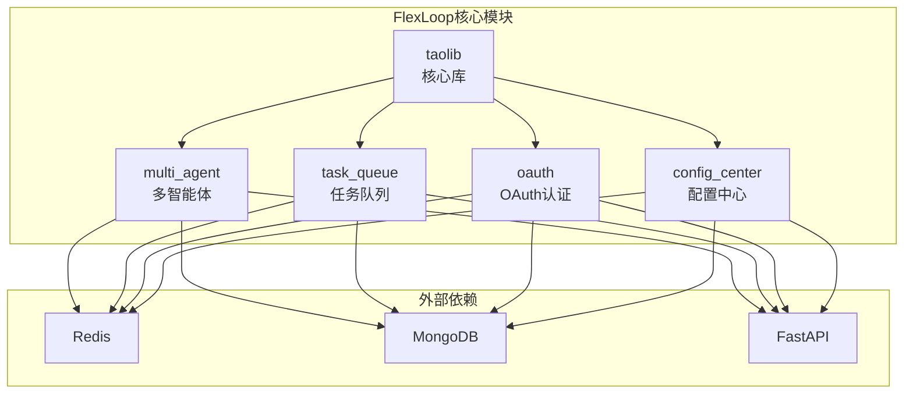
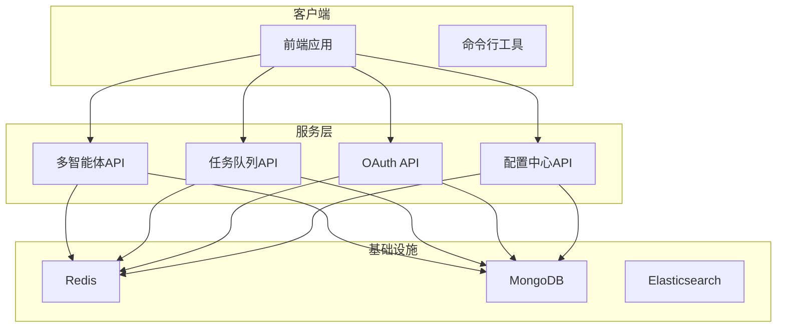
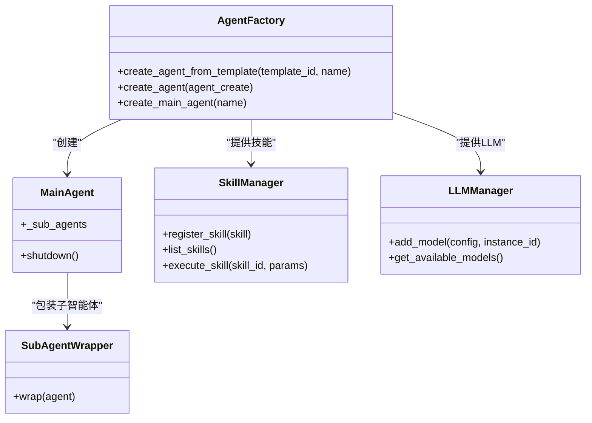
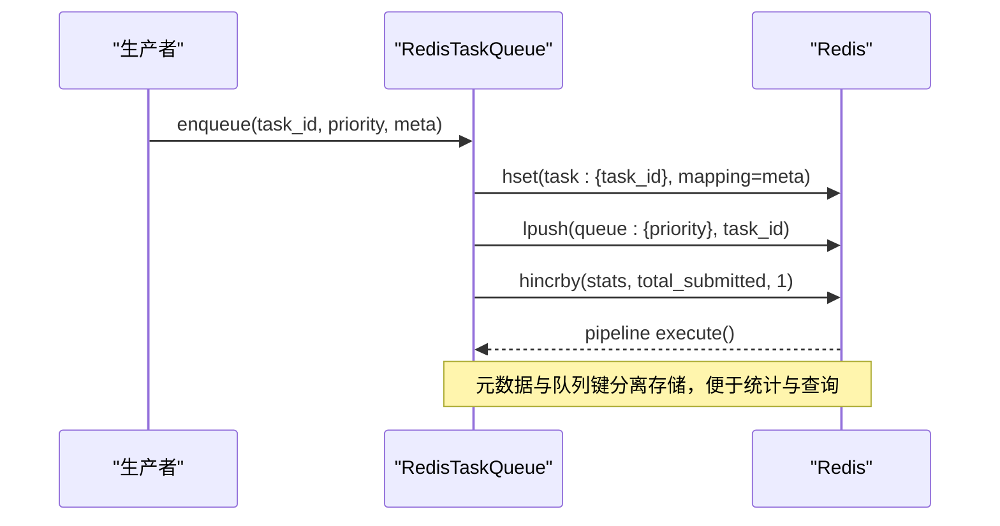
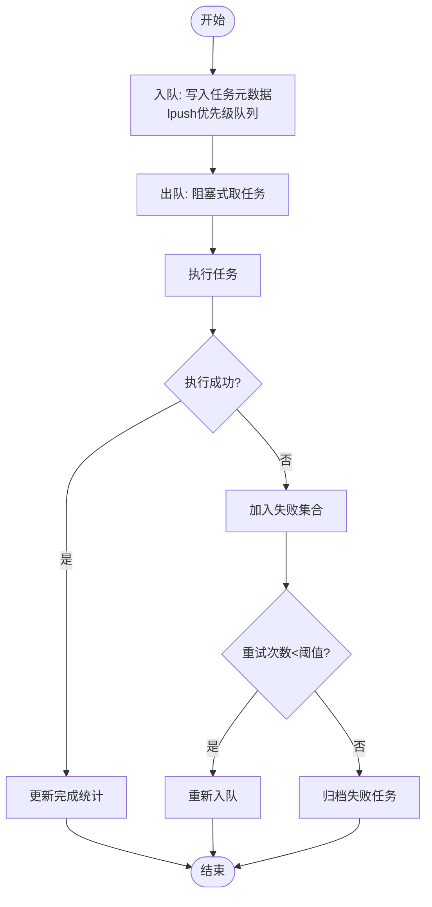
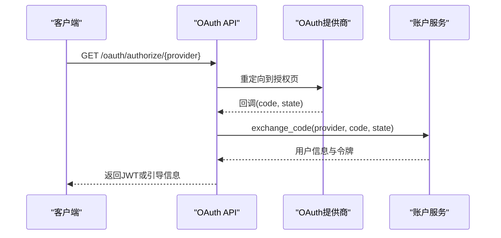
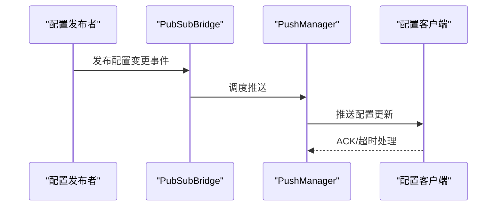
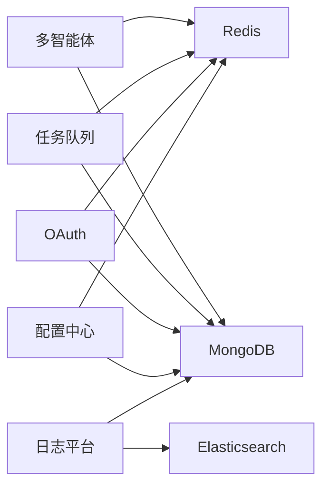

# FlexLoop多代理系统

<cite>
**本文引用的文件**
- [README.md](file://tools/flexloop/README.md)
- [pyproject.toml](file://tools/flexloop/pyproject.toml)
- [multi_agent_example.py](file://tools/flexloop/examples/multi_agent_example.py)
- [__init__.py](file://tools/flexloop/src/taolib/__init__.py)
- [agents/__init__.py](file://tools/flexloop/src/taolib/testing/multi_agent/agents/__init__.py)
- [api/__init__.py](file://tools/flexloop/src/taolib/testing/multi_agent/api/__init__.py)
- [redis_queue.py](file://tools/flexloop/src/taolib/testing/task_queue/queue/redis_queue.py)
- [test_queue.py](file://tools/flexloop/tests/testing/test_task_queue/test_queue.py)
- [flow.py](file://tools/flexloop/src/taolib/testing/oauth/server/api/flow.py)
- [account_service.py](file://tools/flexloop/src/taolib/testing/oauth/services/account_service.py)
- [client.ts](file://apps/config-center/src/api/client.ts)
- [app.py](file://tools/flexloop/src/taolib/testing/config_center/server/app.py)
- [verify_tests.py](file://tools/flexloop/tests/testing/test_config_center/verify_tests.py)
</cite>

## 目录
1. [简介](#简介)
2. [项目结构](#项目结构)
3. [核心组件](#核心组件)
4. [架构总览](#架构总览)
5. [详细组件分析](#详细组件分析)
6. [依赖关系分析](#依赖关系分析)
7. [性能考虑](#性能考虑)
8. [故障排除指南](#故障排除指南)
9. [结论](#结论)
10. [附录](#附录)

## 简介
本文件为FlexLoop多代理系统提供全面技术文档，聚焦于多代理协作架构的设计与实现，涵盖代理生命周期管理、任务调度系统、性能监控机制；深入解析代理工厂模式、LLM负载均衡与技能管理；阐述任务队列（Redis集成）、优先级与失败重试策略；并给出OAuth认证集成、配置中心同步、数据分析服务的实现要点。同时提供系统监控、性能基准测试与故障排除指南，以及微服务架构下的服务发现与通信协议设计思路。

## 项目结构
FlexLoop位于tools/flexloop目录，采用Python包结构组织，核心能力通过多个功能子模块提供，包括多智能体、任务队列、OAuth认证、配置中心等。项目使用FastAPI作为服务框架，结合Redis/MongoDB等外部组件实现分布式能力。

图表来源
- [pyproject.toml:136-235](file://tools/flexloop/pyproject.toml#L136-L235)
- [agents/__init__.py:1-33](file://tools/flexloop/src/taolib/testing/multi_agent/agents/__init__.py#L1-L33)
- [api/__init__.py:1-8](file://tools/flexloop/src/taolib/testing/multi_agent/api/__init__.py#L1-L8)

章节来源
- [README.md:1-100](file://tools/flexloop/README.md#L1-L100)
- [pyproject.toml:1-318](file://tools/flexloop/pyproject.toml#L1-L318)

## 核心组件
- 多智能体系统：提供智能体工厂、主智能体与子智能体、技能管理、LLM负载均衡等能力。
- 任务队列：基于Redis的多优先级队列，支持入队、出队、统计与运行/失败集合管理。
- OAuth认证：实现授权码流程、会话管理、账户关联与令牌刷新。
- 配置中心：提供配置发布/订阅、推送桥接、事件发布与系统角色初始化。
- 分析与监控：通过日志平台、速率限制、审计等模块支撑系统可观测性。

章节来源
- [multi_agent_example.py:14-33](file://tools/flexloop/examples/multi_agent_example.py#L14-L33)
- [pyproject.toml:223-235](file://tools/flexloop/pyproject.toml#L223-L235)

## 架构总览
FlexLoop采用微服务化架构，各模块以独立服务运行并通过FastAPI提供REST接口，内部通过Redis进行消息与状态同步，MongoDB持久化配置与审计数据。多智能体系统负责任务编排与执行，任务队列保障异步处理的可靠性，OAuth提供统一身份认证，配置中心实现动态配置下发与版本管理。

图表来源
- [pyproject.toml:136-235](file://tools/flexloop/pyproject.toml#L136-L235)
- [api/__init__.py:1-8](file://tools/flexloop/src/taolib/testing/multi_agent/api/__init__.py#L1-L8)

## 详细组件分析

### 多智能体协作架构
- 代理生命周期管理：通过工厂模式创建主智能体与子智能体，支持模板化创建与自定义配置，具备启动/关闭与状态管理。
- 技能管理系统：提供技能注册、查询与执行，支持多种预设技能（如文本摘要、代码生成）。
- LLM负载均衡：支持多种负载均衡策略（如轮询），可按权重选择不同模型实例。
- 主智能体编排：主智能体协调多个子智能体，形成多层级协作结构。

图表来源
- [agents/__init__.py:6-33](file://tools/flexloop/src/taolib/testing/multi_agent/agents/__init__.py#L6-L33)
- [multi_agent_example.py:36-172](file://tools/flexloop/examples/multi_agent_example.py#L36-L172)

章节来源
- [agents/__init__.py:1-33](file://tools/flexloop/src/taolib/testing/multi_agent/agents/__init__.py#L1-L33)
- [multi_agent_example.py:36-172](file://tools/flexloop/examples/multi_agent_example.py#L36-L172)

### 任务队列系统（Redis集成）
- 多优先级队列：高、普通、低三类队列，入队时写入哈希存储任务元数据，使用列表存储任务ID。
- 出队策略：支持带超时的阻塞式出队，按优先级顺序取任务。
- 统计与状态：维护提交数、完成数、运行中、失败、重试等统计信息，支持运行/失败集合管理。
- 失败重试：通过失败集合与重试计数控制失败任务的恢复策略。

图表来源
- [redis_queue.py:58-81](file://tools/flexloop/src/taolib/testing/task_queue/queue/redis_queue.py#L58-L81)

图表来源
- [test_queue.py:119-155](file://tools/flexloop/tests/testing/test_task_queue/test_queue.py#L119-L155)
- [test_queue.py:372-398](file://tools/flexloop/tests/testing/test_task_queue/test_queue.py#L372-L398)

章节来源
- [redis_queue.py:40-81](file://tools/flexloop/src/taolib/testing/task_queue/queue/redis_queue.py#L40-L81)
- [test_queue.py:94-155](file://tools/flexloop/tests/testing/test_task_queue/test_queue.py#L94-L155)
- [test_queue.py:372-475](file://tools/flexloop/tests/testing/test_task_queue/test_queue.py#L372-L475)

### OAuth认证集成
- 授权码流程：生成授权URL并重定向用户至提供商授权页，回调时校验state并交换令牌。
- 账户关联：支持已登录用户将新提供商关联到现有账户。
- 会话与令牌：创建会话并返回JWT，支持刷新令牌与本地存储。

图表来源
- [flow.py:51-180](file://tools/flexloop/src/taolib/testing/oauth/server/api/flow.py#L51-L180)
- [flow.py:236-267](file://tools/flexloop/src/taolib/testing/oauth/server/api/flow.py#L236-L267)

章节来源
- [flow.py:1-267](file://tools/flexloop/src/taolib/testing/oauth/server/api/flow.py#L1-L267)
- [account_service.py:106-145](file://tools/flexloop/src/taolib/testing/oauth/services/account_service.py#L106-L145)

### 配置中心同步
- 发布/订阅与推送桥接：通过Redis实现配置变更的实时推送，支持ACK超时与最大重试。
- 事件发布：将配置变更事件发布到消息通道，供客户端订阅。
- 系统角色初始化：启动时自动初始化系统内置角色。

图表来源
- [app.py:74-105](file://tools/flexloop/src/taolib/testing/config_center/server/app.py#L74-L105)

章节来源
- [app.py:74-118](file://tools/flexloop/src/taolib/testing/config_center/server/app.py#L74-L118)
- [verify_tests.py:101-115](file://tools/flexloop/tests/testing/test_config_center/verify_tests.py#L101-L115)

### 数据分析与监控
- 日志平台：提供服务端SDK与客户端SDK，支持Elasticsearch与MongoDB存储。
- 速率限制：基于Redis实现请求限流，支持配置与统计。
- 审计：提供审计服务与API，记录关键操作与变更。

章节来源
- [pyproject.toml:97-121](file://tools/flexloop/pyproject.toml#L97-L121)

## 依赖关系分析
- 模块耦合：多智能体、任务队列、OAuth、配置中心均依赖Redis与MongoDB，API层统一由FastAPI提供。
- 外部依赖：Redis用于队列与缓存，MongoDB用于持久化，Elasticsearch用于日志检索。
- 功能解耦：各模块通过API边界清晰划分，便于独立扩展与替换。

图表来源
- [pyproject.toml:136-235](file://tools/flexloop/pyproject.toml#L136-L235)

章节来源
- [pyproject.toml:136-235](file://tools/flexloop/pyproject.toml#L136-L235)

## 性能考虑
- 任务队列性能：优先级队列与管道事务减少网络往返，适合高并发场景；建议根据业务调整优先级分布与重试策略。
- Redis键设计：任务元数据与队列键分离，提升统计与查询效率。
- OAuth流程：授权码交换与令牌加密存储，降低中间态风险。
- 配置中心：发布/订阅与ACK机制确保配置一致性与可靠性。
- 监控与日志：结合Elasticsearch与数据库统计，建立指标看板与告警。

## 故障排除指南
- 任务队列异常
  - 现象：任务积压或无法出队
  - 排查：检查Redis连接、队列键前缀、管道执行结果
  - 参考
    - [redis_queue.py:58-81](file://tools/flexloop/src/taolib/testing/task_queue/queue/redis_queue.py#L58-L81)
    - [test_queue.py:119-155](file://tools/flexloop/tests/testing/test_task_queue/test_queue.py#L119-L155)
- OAuth认证失败
  - 现象：回调state校验失败或提供商通信错误
  - 排查：核对state参数、提供商配置、网络连通性
  - 参考
    - [flow.py:174-178](file://tools/flexloop/src/taolib/testing/oauth/server/api/flow.py#L174-L178)
    - [flow.py:249-267](file://tools/flexloop/src/taolib/testing/oauth/server/api/flow.py#L249-L267)
- 配置中心不同步
  - 现象：客户端未收到配置更新
  - 排查：检查Redis发布/订阅通道、ACK超时设置、推送重试
  - 参考
    - [app.py:74-105](file://tools/flexloop/src/taolib/testing/config_center/server/app.py#L74-L105)
- 前端鉴权问题
  - 现象：401未授权与令牌刷新循环
  - 排查：确认本地存储的访问/刷新令牌、刷新Promise状态
  - 参考
    - [client.ts:14-104](file://apps/config-center/src/api/client.ts#L14-L104)

章节来源
- [redis_queue.py:58-81](file://tools/flexloop/src/taolib/testing/task_queue/queue/redis_queue.py#L58-L81)
- [test_queue.py:119-155](file://tools/flexloop/tests/testing/test_task_queue/test_queue.py#L119-L155)
- [flow.py:174-178](file://tools/flexloop/src/taolib/testing/oauth/server/api/flow.py#L174-L178)
- [flow.py:249-267](file://tools/flexloop/src/taolib/testing/oauth/server/api/flow.py#L249-L267)
- [app.py:74-105](file://tools/flexloop/src/taolib/testing/config_center/server/app.py#L74-L105)
- [client.ts:14-104](file://apps/config-center/src/api/client.ts#L14-L104)

## 结论
FlexLoop多代理系统通过模块化设计与Redis/MongoDB基础设施，实现了高内聚、低耦合的微服务体系。多智能体协作、任务队列、OAuth认证与配置中心四大能力相互配合，既满足了复杂任务编排需求，也提供了完善的可观测性与运维保障。建议在生产环境中结合容量规划与监控体系，持续优化队列优先级与重试策略，确保系统稳定与高性能。

## 附录
- 快速开始与安装参考
  - [README.md:45-80](file://tools/flexloop/README.md#L45-L80)
- 依赖与可选组件
  - [pyproject.toml:20-79](file://tools/flexloop/pyproject.toml#L20-L79)
- 多智能体示例
  - [multi_agent_example.py:1-196](file://tools/flexloop/examples/multi_agent_example.py#L1-L196)