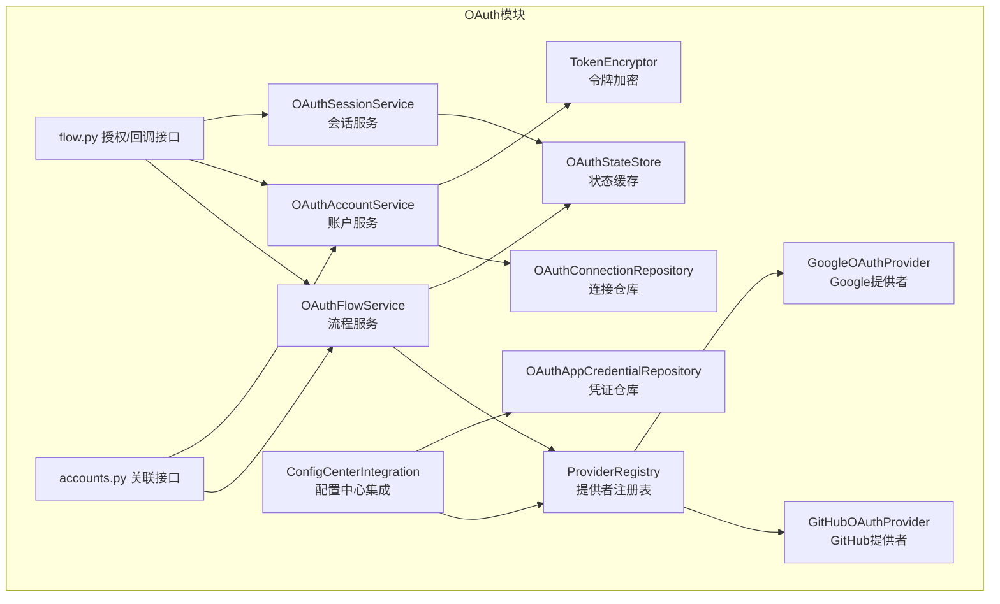
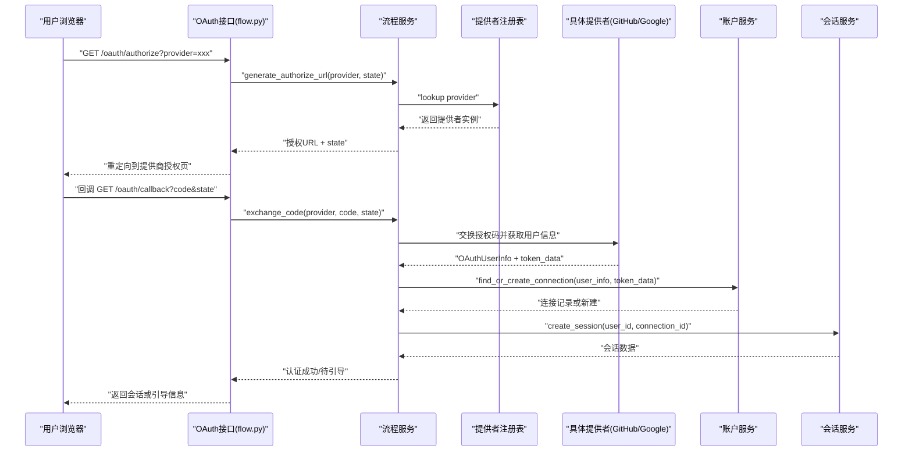
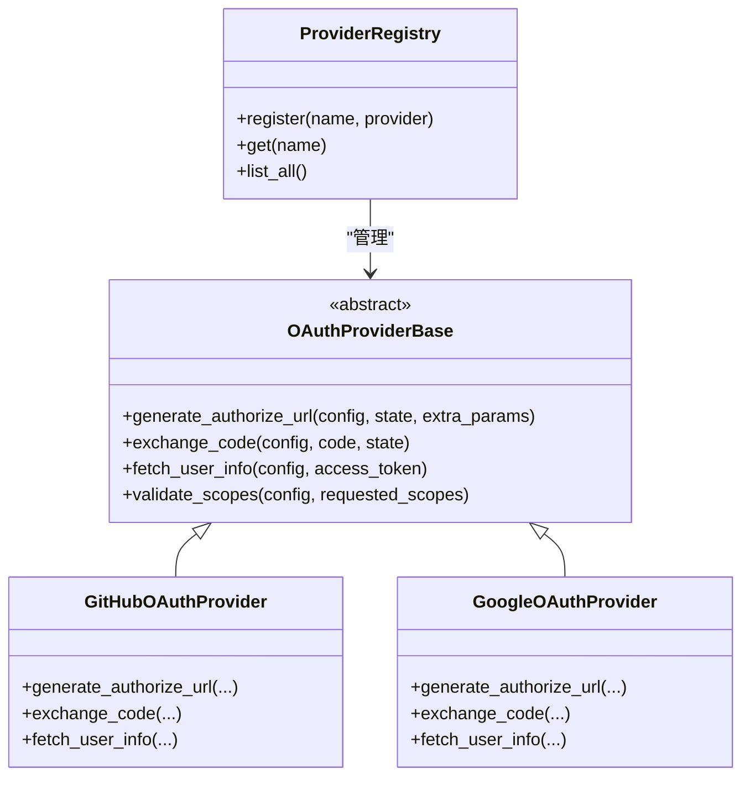
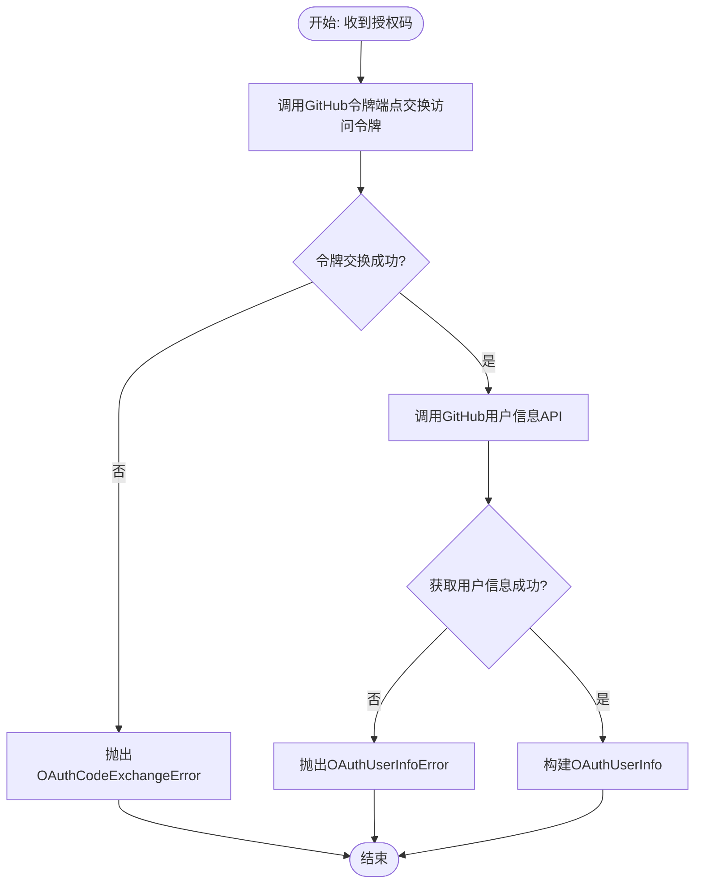
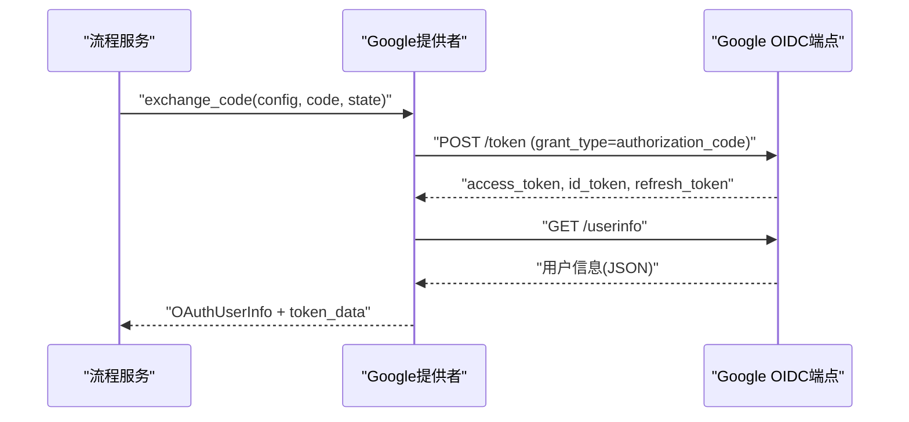
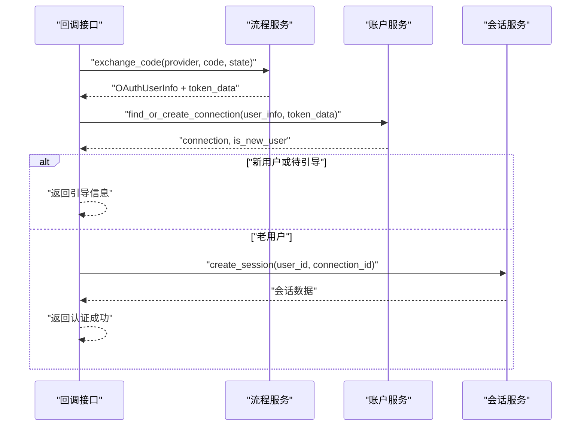
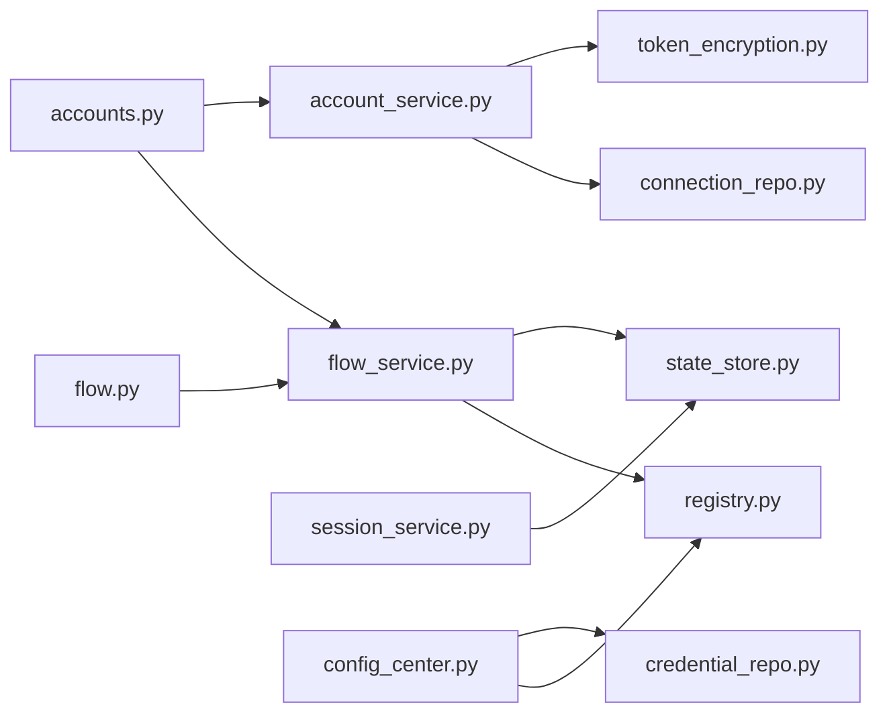

# OAuth提供者

<cite>
**本文引用的文件**
- [taolib/oauth/__init__.py](file://tools/flexloop/src/taolib/testing/oauth/__init__.py)
- [taolib/oauth/errors.py](file://tools/flexloop/src/taolib/testing/oauth/errors.py)
- [taolib/oauth/models/enums.py](file://tools/flexloop/src/taolib/testing/oauth/models/enums.py)
- [taolib/oauth/models/profile.py](file://tools/flexloop/src/taolib/testing/oauth/models/profile.py)
- [taolib/oauth/providers/__init__.py](file://tools/flexloop/src/taolib/testing/oauth/providers/__init__.py)
- [taolib/oauth/providers/github.py](file://tools/flexloop/src/taolib/testing/oauth/providers/github.py)
- [taolib/oauth/providers/google.py](file://tools/flexloop/src/taolib/testing/oauth/providers/google.py)
- [taolib/oauth/providers/registry.py](file://tools/flexloop/src/taolib/testing/oauth/providers/registry.py)
- [taolib/oauth/services/flow_service.py](file://tools/flexloop/src/taolib/testing/oauth/services/flow_service.py)
- [taolib/oauth/services/account_service.py](file://tools/flexloop/src/taolib/testing/oauth/services/account_service.py)
- [taolib/oauth/services/session_service.py](file://tools/flexloop/src/taolib/testing/oauth/services/session_service.py)
- [taolib/oauth/repository/connection_repo.py](file://tools/flexloop/src/taolib/testing/oauth/repository/connection_repo.py)
- [taolib/oauth/repository/credential_repo.py](file://tools/flexloop/src/taolib/testing/oauth/repository/credential_repo.py)
- [taolib/oauth/cache/state_store.py](file://tools/flexloop/src/taolib/testing/oauth/cache/state_store.py)
- [taolib/oauth/crypto/token_encryption.py](file://tools/flexloop/src/taolib/testing/oauth/crypto/token_encryption.py)
- [taolib/oauth/integration/config_center.py](file://tools/flexloop/src/taolib/testing/oauth/integration/config_center.py)
- [taolib/oauth/server/api/flow.py](file://tools/flexloop/src/taolib/testing/oauth/server/api/flow.py)
- [taolib/oauth/server/api/accounts.py](file://tools/flexloop/src/taolib/testing/oauth/server/api/accounts.py)
- [apps/oauth-admin/src/pages/ProvidersPage.tsx](file://apps/oauth-admin/src/pages/ProvidersPage.tsx)
- [apps/oauth-admin/src/pages/ConnectionsPage.tsx](file://apps/oauth-admin/src/pages/ConnectionsPage.tsx)
- [apps/oauth-admin/src/pages/ActivityPage.tsx](file://apps/oauth-admin/src/pages/ActivityPage.tsx)
</cite>

## 目录
1. [简介](#简介)
2. [项目结构](#项目结构)
3. [核心组件](#核心组件)
4. [架构总览](#架构总览)
5. [详细组件分析](#详细组件分析)
6. [依赖关系分析](#依赖关系分析)
7. [性能考量](#性能考量)
8. [故障排查指南](#故障排查指南)
9. [结论](#结论)
10. [附录](#附录)

## 简介
本文件面向OAuth提供者模块，系统性梳理其设计与实现，重点覆盖：
- OAuth提供者基类与抽象：认证流程抽象、配置管理、错误处理
- GitHub提供者实现：客户端注册、授权码交换、用户信息获取
- Google提供者集成：OpenID Connect协议、Scopes管理、令牌验证
- 提供者注册机制：动态配置、连接测试、故障切换
- 实操示例：新增提供者、配置客户端凭据、处理认证回调
- 安全、速率限制与API变更适配最佳实践

## 项目结构
该模块采用分层与按功能域划分的组织方式：
- providers：提供者实现与注册表
- services：业务服务（流程、账户、会话）
- repository：数据访问层（连接、凭证、会话、活动日志）
- cache：状态与会话缓存
- crypto：令牌加密存储
- integration：与配置中心桥接
- server：FastAPI接口（授权、回调、关联等）
- models：数据模型与枚举
- errors：异常体系
- oauth-admin：管理端页面（提供者、连接、活动）

图表来源
- [taolib/oauth/providers/registry.py](file://tools/flexloop/src/taolib/testing/oauth/providers/registry.py)
- [taolib/oauth/providers/github.py](file://tools/flexloop/src/taolib/testing/oauth/providers/github.py)
- [taolib/oauth/providers/google.py](file://tools/flexloop/src/taolib/testing/oauth/providers/google.py)
- [taolib/oauth/services/flow_service.py](file://tools/flexloop/src/taolib/testing/oauth/services/flow_service.py)
- [taolib/oauth/services/account_service.py](file://tools/flexloop/src/taolib/testing/oauth/services/account_service.py)
- [taolib/oauth/services/session_service.py](file://tools/flexloop/src/taolib/testing/oauth/services/session_service.py)
- [taolib/oauth/repository/connection_repo.py](file://tools/flexloop/src/taolib/testing/oauth/repository/connection_repo.py)
- [taolib/oauth/repository/credential_repo.py](file://tools/flexloop/src/taolib/testing/oauth/repository/credential_repo.py)
- [taolib/oauth/cache/state_store.py](file://tools/flexloop/src/taolib/testing/oauth/cache/state_store.py)
- [taolib/oauth/crypto/token_encryption.py](file://tools/flexloop/src/taolib/testing/oauth/crypto/token_encryption.py)
- [taolib/oauth/integration/config_center.py](file://tools/flexloop/src/taolib/testing/oauth/integration/config_center.py)
- [taolib/oauth/server/api/flow.py](file://tools/flexloop/src/taolib/testing/oauth/server/api/flow.py)
- [taolib/oauth/server/api/accounts.py](file://tools/flexloop/src/taolib/testing/oauth/server/api/accounts.py)

章节来源
- [taolib/oauth/__init__.py](file://tools/flexloop/src/taolib/testing/oauth/__init__.py)

## 核心组件
- 提供者注册表：集中管理已注册的OAuth提供者，支持动态查询与扩展
- 流程服务：封装授权码交换、用户信息获取、状态校验等流程
- 账户服务：处理用户连接创建/更新、令牌持久化、关联新提供者
- 会话服务：创建用户会话、记录会话元数据
- 数据仓库：连接、凭证、会话、活动日志的数据持久化
- 缓存：State令牌、会话键值缓存
- 加密：访问令牌、刷新令牌加密存储
- 集成：与配置中心对接，动态读取客户端凭据与开关
- 服务器接口：对外暴露授权、回调、关联等REST接口

章节来源
- [taolib/oauth/__init__.py](file://tools/flexloop/src/taolib/testing/oauth/__init__.py)
- [taolib/oauth/providers/registry.py](file://tools/flexloop/src/taolib/testing/oauth/providers/registry.py)
- [taolib/oauth/services/flow_service.py](file://tools/flexloop/src/taolib/testing/oauth/services/flow_service.py)
- [taolib/oauth/services/account_service.py](file://tools/flexloop/src/taolib/testing/oauth/services/account_service.py)
- [taolib/oauth/services/session_service.py](file://tools/flexloop/src/taolib/testing/oauth/services/session_service.py)
- [taolib/oauth/repository/connection_repo.py](file://tools/flexloop/src/taolib/testing/oauth/repository/connection_repo.py)
- [taolib/oauth/repository/credential_repo.py](file://tools/flexloop/src/taolib/testing/oauth/repository/credential_repo.py)
- [taolib/oauth/cache/state_store.py](file://tools/flexloop/src/taolib/testing/oauth/cache/state_store.py)
- [taolib/oauth/crypto/token_encryption.py](file://tools/flexloop/src/taolib/testing/oauth/crypto/token_encryption.py)
- [taolib/oauth/integration/config_center.py](file://tools/flexloop/src/taolib/testing/oauth/integration/config_center.py)
- [taolib/oauth/server/api/flow.py](file://tools/flexloop/src/taolib/testing/oauth/server/api/flow.py)
- [taolib/oauth/server/api/accounts.py](file://tools/flexloop/src/taolib/testing/oauth/server/api/accounts.py)

## 架构总览
OAuth模块遵循“提供者抽象 + 业务服务 + 数据持久化 + 缓存 + 集成”的分层架构。外部通过FastAPI接口触发授权流程，内部通过流程服务协调提供者实现与数据层。

图表来源
- [taolib/oauth/server/api/flow.py](file://tools/flexloop/src/taolib/testing/oauth/server/api/flow.py)
- [taolib/oauth/services/flow_service.py](file://tools/flexloop/src/taolib/testing/oauth/services/flow_service.py)
- [taolib/oauth/providers/registry.py](file://tools/flexloop/src/taolib/testing/oauth/providers/registry.py)
- [taolib/oauth/providers/github.py](file://tools/flexloop/src/taolib/testing/oauth/providers/github.py)
- [taolib/oauth/providers/google.py](file://tools/flexloop/src/taolib/testing/oauth/providers/google.py)
- [taolib/oauth/services/account_service.py](file://tools/flexloop/src/taolib/testing/oauth/services/account_service.py)
- [taolib/oauth/services/session_service.py](file://tools/flexloop/src/taolib/testing/oauth/services/session_service.py)

## 详细组件分析

### 提供者基类与注册机制
- 抽象职责：定义统一的授权URL生成、授权码交换、用户信息获取、Scopes管理、令牌验证等接口
- 注册表：集中注册与检索提供者，支持动态启用/禁用与故障切换
- 错误处理：提供标准化异常类型，便于上层统一捕获与提示

图表来源
- [taolib/oauth/providers/registry.py](file://tools/flexloop/src/taolib/testing/oauth/providers/registry.py)
- [taolib/oauth/providers/github.py](file://tools/flexloop/src/taolib/testing/oauth/providers/github.py)
- [taolib/oauth/providers/google.py](file://tools/flexloop/src/taolib/testing/oauth/providers/google.py)

章节来源
- [taolib/oauth/providers/registry.py](file://tools/flexloop/src/taolib/testing/oauth/providers/registry.py)
- [taolib/oauth/providers/github.py](file://tools/flexloop/src/taolib/testing/oauth/providers/github.py)
- [taolib/oauth/providers/google.py](file://tools/flexloop/src/taolib/testing/oauth/providers/google.py)

### GitHub提供者实现
- 客户端注册：在配置中心中登记GitHub应用的client_id与client_secret，并设置回调地址
- 授权码交换：向GitHub令牌端点发送授权码换取访问令牌
- 用户信息获取：调用GitHub用户信息API，解析标准OAuthUserInfo字段
- Scopes管理：根据需求声明email、profile等Scope
- 故障切换：当主提供商不可用时，可切换至备用提供者或降级策略

图表来源
- [taolib/oauth/providers/github.py](file://tools/flexloop/src/taolib/testing/oauth/providers/github.py)

章节来源
- [taolib/oauth/providers/github.py](file://tools/flexloop/src/taolib/testing/oauth/providers/github.py)

### Google提供者集成
- OpenID Connect协议：基于标准OIDC流程，支持ID Token与UserInfo端点
- Scopes管理：支持openid、profile、email等标准Scope
- 令牌验证：对ID Token进行签名校验与Audience匹配
- 用户信息获取：从UserInfo端点获取标准化用户信息

图表来源
- [taolib/oauth/providers/google.py](file://tools/flexloop/src/taolib/testing/oauth/providers/google.py)

章节来源
- [taolib/oauth/providers/google.py](file://tools/flexloop/src/taolib/testing/oauth/providers/google.py)

### 认证回调处理流程
- 参数校验：校验state一致性与提供商存在性
- 授权码交换：调用流程服务完成授权码到令牌的转换
- 连接建立：账户服务创建或更新用户连接，保存加密令牌
- 新用户引导：若为新用户或待引导状态，返回引导信息
- 会话创建：否则创建会话并返回会话数据

图表来源
- [taolib/oauth/server/api/flow.py](file://tools/flexloop/src/taolib/testing/oauth/server/api/flow.py)
- [taolib/oauth/services/flow_service.py](file://tools/flexloop/src/taolib/testing/oauth/services/flow_service.py)
- [taolib/oauth/services/account_service.py](file://tools/flexloop/src/taolib/testing/oauth/services/account_service.py)
- [taolib/oauth/services/session_service.py](file://tools/flexloop/src/taolib/testing/oauth/services/session_service.py)

章节来源
- [taolib/oauth/server/api/flow.py](file://tools/flexloop/src/taolib/testing/oauth/server/api/flow.py)

### 提供者注册与动态配置
- 动态配置：通过配置中心读取各提供者的client_id/client_secret、回调地址、Scopes等
- 连接测试：提供测试按钮或接口，验证提供商连通性与凭据有效性
- 故障切换：当某提供者不可用时，自动切换到备用提供者或降级策略

章节来源
- [taolib/oauth/integration/config_center.py](file://tools/flexloop/src/taolib/testing/oauth/integration/config_center.py)
- [apps/oauth-admin/src/pages/ProvidersPage.tsx](file://apps/oauth-admin/src/pages/ProvidersPage.tsx)

### 管理端页面与工作流
- 提供者页面：展示已注册提供者、状态、操作（启用/禁用/测试）
- 连接页面：查看用户连接、令牌状态、解绑操作
- 活动页面：审计登录/登出等OAuth活动日志

章节来源
- [apps/oauth-admin/src/pages/ProvidersPage.tsx](file://apps/oauth-admin/src/pages/ProvidersPage.tsx)
- [apps/oauth-admin/src/pages/ConnectionsPage.tsx](file://apps/oauth-admin/src/pages/ConnectionsPage.tsx)
- [apps/oauth-admin/src/pages/ActivityPage.tsx](file://apps/oauth-admin/src/pages/ActivityPage.tsx)

## 依赖关系分析
- 组件耦合：流程服务依赖注册表与提供者实现；账户服务依赖仓库与加密；会话服务依赖缓存；接口层依赖服务层
- 外部依赖：提供者实现依赖各自平台的HTTP端点；缓存依赖Redis；加密依赖对称密钥
- 可能的循环依赖：模块间通过接口与依赖注入避免直接循环导入

图表来源
- [taolib/oauth/server/api/flow.py](file://tools/flexloop/src/taolib/testing/oauth/server/api/flow.py)
- [taolib/oauth/server/api/accounts.py](file://tools/flexloop/src/taolib/testing/oauth/server/api/accounts.py)
- [taolib/oauth/services/flow_service.py](file://tools/flexloop/src/taolib/testing/oauth/services/flow_service.py)
- [taolib/oauth/services/account_service.py](file://tools/flexloop/src/taolib/testing/oauth/services/account_service.py)
- [taolib/oauth/services/session_service.py](file://tools/flexloop/src/taolib/testing/oauth/services/session_service.py)
- [taolib/oauth/providers/registry.py](file://tools/flexloop/src/taolib/testing/oauth/providers/registry.py)
- [taolib/oauth/cache/state_store.py](file://tools/flexloop/src/taolib/testing/oauth/cache/state_store.py)
- [taolib/oauth/crypto/token_encryption.py](file://tools/flexloop/src/taolib/testing/oauth/crypto/token_encryption.py)
- [taolib/oauth/integration/config_center.py](file://tools/flexloop/src/taolib/testing/oauth/integration/config_center.py)
- [taolib/oauth/repository/connection_repo.py](file://tools/flexloop/src/taolib/testing/oauth/repository/connection_repo.py)
- [taolib/oauth/repository/credential_repo.py](file://tools/flexloop/src/taolib/testing/oauth/repository/credential_repo.py)

## 性能考量
- 缓存优化：State与会话键使用Redis缓存，降低数据库压力
- 批量与异步：令牌刷新与用户信息拉取尽量异步化，避免阻塞请求
- 限流与熔断：对外部提供商调用增加速率限制与熔断策略，防止雪崩
- 连接池：HTTP客户端使用连接池，减少握手开销
- 压缩与超时：合理设置网络超时与压缩策略，提升吞吐

## 故障排查指南
- 常见异常
  - OAuthStateError：state不一致或过期
  - OAuthCredentialNotFoundError：提供商未配置或凭据缺失
  - OAuthCodeExchangeError：授权码无效或已使用
  - OAuthUserInfoError：用户信息获取失败
  - OAuthTokenError/OAuthTokenRefreshError：令牌相关错误
  - OAuthProviderNotRegisteredError：提供者未注册
- 排查步骤
  - 检查回调URL是否与配置一致
  - 校验client_id/client_secret是否正确
  - 查看缓存中state是否存在且未过期
  - 检查提供商端点可达性与返回格式
  - 查看活动日志与会话记录定位问题

章节来源
- [taolib/oauth/errors.py](file://tools/flexloop/src/taolib/testing/oauth/errors.py)
- [taolib/oauth/server/api/flow.py](file://tools/flexloop/src/taolib/testing/oauth/server/api/flow.py)

## 结论
该OAuth提供者模块以清晰的抽象与分层设计实现了多提供商接入，具备良好的扩展性与可运维性。通过注册表、流程服务、账户与会话服务以及配套的管理端，能够快速集成新提供商并稳定运行于生产环境。

## 附录

### 如何添加新的OAuth提供者
- 在providers目录下新增提供者实现，继承抽象基类并实现必要方法
- 在注册表中注册新提供者
- 在配置中心新增客户端凭据与回调地址
- 在管理端页面添加提供者配置入口与测试按钮
- 编写单元测试覆盖授权码交换与用户信息获取流程

章节来源
- [taolib/oauth/providers/registry.py](file://tools/flexloop/src/taolib/testing/oauth/providers/registry.py)
- [taolib/oauth/integration/config_center.py](file://tools/flexloop/src/taolib/testing/oauth/integration/config_center.py)
- [apps/oauth-admin/src/pages/ProvidersPage.tsx](file://apps/oauth-admin/src/pages/ProvidersPage.tsx)

### 配置客户端凭据与回调
- 在配置中心为新提供者填写client_id、client_secret、授权/令牌/用户信息端点、回调地址
- 设置默认Scopes与自定义Scopes映射
- 保存后通过“连接测试”验证可用性

章节来源
- [taolib/oauth/integration/config_center.py](file://tools/flexloop/src/taolib/testing/oauth/integration/config_center.py)

### 处理认证回调
- 回调接口负责参数校验、授权码交换、连接创建/更新、会话创建
- 新用户或待引导状态需返回引导信息，否则返回会话数据

章节来源
- [taolib/oauth/server/api/flow.py](file://tools/flexloop/src/taolib/testing/oauth/server/api/flow.py)

### 安全考虑
- 使用HTTPS与安全的Cookie属性
- 对state进行强随机性与短有效期控制
- 令牌加密存储，定期轮换密钥
- 严格校验回调域名与Scopes
- 限制重定向目标域名，防止开放重定向

### 速率限制与API变更适配
- 为外部提供商调用设置全局与IP级限流
- 为关键端点（令牌、用户信息）设置独立限流策略
- 为用户提供“连接测试”能力，提前发现API变更
- 通过配置中心集中管理端点与Scopes，便于快速调整