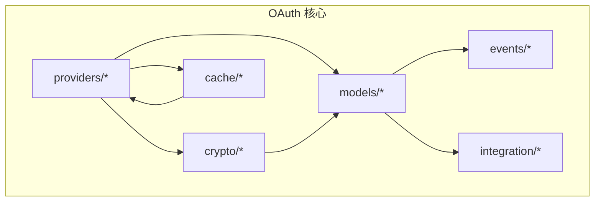
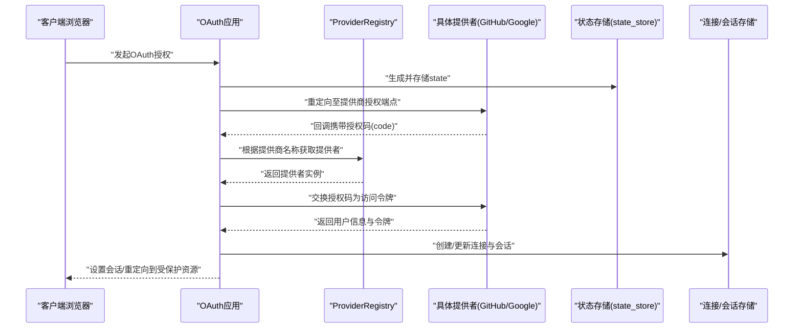
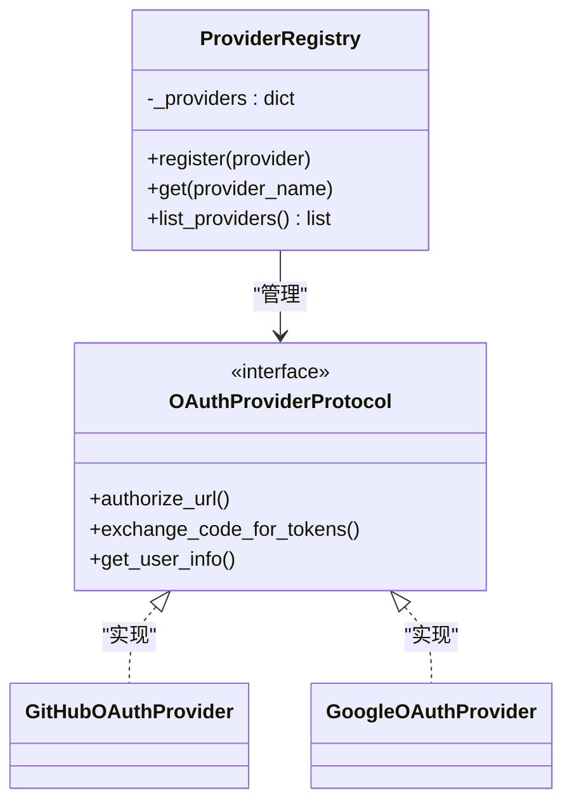
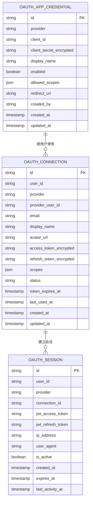
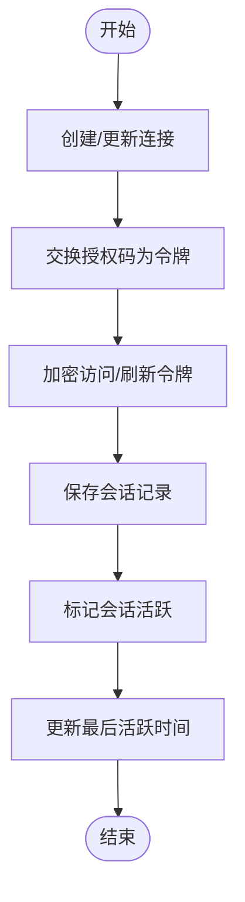
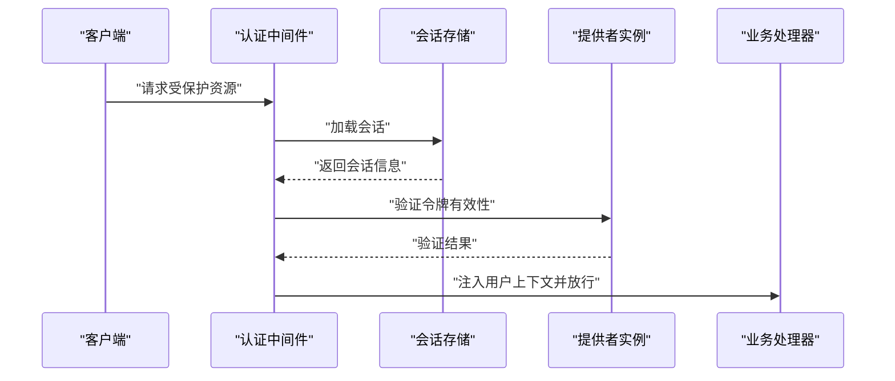
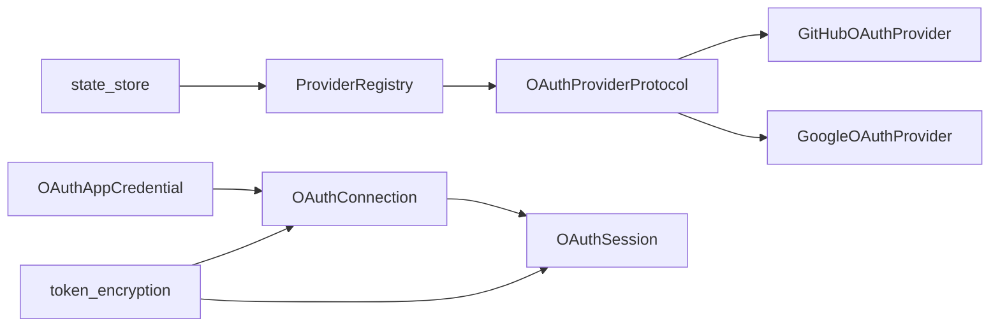

# OAuth认证系统

<cite>
**本文引用的文件**
- [oauth/models/session.py](file://tools/flexloop/src/taolib/testing/oauth/models/session.py)
- [oauth/models/connection.py](file://tools/flexloop/src/taolib/testing/oauth/models/connection.py)
- [oauth/models/credential.py](file://tools/flexloop/src/taolib/testing/oauth/models/credential.py)
- [oauth/models/profile.py](file://tools/flexloop/src/taolib/testing/oauth/models/profile.py)
- [oauth/models/enums.py](file://tools/flexloop/src/taolib/testing/oauth/models/enums.py)
- [oauth/providers/__init__.py](file://tools/flexloop/src/taolib/testing/oauth/providers/__init__.py)
- [oauth/providers/github.py](file://tools/flexloop/src/taolib/testing/oauth/providers/github.py)
- [oauth/providers/google.py](file://tools/flexloop/src/taolib/testing/oauth/providers/google.py)
- [oauth/providers/base.py](file://tools/flexloop/src/taolib/testing/oauth/providers/base.py)
- [oauth/crypto/token_encryption.py](file://tools/flexloop/src/taolib/testing/oauth/crypto/token_encryption.py)
- [oauth/cache/state_store.py](file://tools/flexloop/src/taolib/testing/oauth/cache/state_store.py)
- [oauth/cache/keys.py](file://tools/flexloop/src/taolib/testing/oauth/cache/keys.py)
- [oauth/events/types.py](file://tools/flexloop/src/taolib/testing/oauth/events/types.py)
- [oauth/integration/config_center.py](file://tools/flexloop/src/taolib/testing/oauth/integration/config_center.py)
- [oauth/models/activity.py](file://tools/flexloop/src/taolib/testing/oauth/models/activity.py)
- [oauth/models/credential.py](file://tools/flexloop/src/taolib/testing/oauth/models/credential.py)
- [oauth/models/connection.py](file://tools/flexloop/src/taolib/testing/oauth/models/connection.py)
- [oauth/models/session.py](file://tools/flexloop/src/taolib/testing/oauth/models/session.py)
- [oauth/models/profile.py](file://tools/flexloop/src/taolib/testing/oauth/models/profile.py)
- [oauth/models/enums.py](file://tools/flexloop/src/taolib/testing/oauth/models/enums.py)
- [oauth/providers/__init__.py](file://tools/flexloop/src/taolib/testing/oauth/providers/__init__.py)
- [oauth/providers/github.py](file://tools/flexloop/src/taolib/testing/oauth/providers/github.py)
- [oauth/providers/google.py](file://tools/flexloop/src/taolib/testing/oauth/providers/google.py)
- [oauth/providers/base.py](file://tools/flexloop/src/taolib/testing/oauth/providers/base.py)
- [oauth/crypto/token_encryption.py](file://tools/flexloop/src/taolib/testing/oauth/crypto/token_encryption.py)
- [oauth/cache/state_store.py](file://tools/flexloop/src/taolib/testing/oauth/cache/state_store.py)
- [oauth/cache/keys.py](file://tools/flexloop/src/taolib/testing/oauth/cache/keys.py)
- [oauth/events/types.py](file://tools/flexloop/src/taolib/testing/oauth/events/types.py)
- [oauth/integration/config_center.py](file://tools/flexloop/src/taolib/testing/oauth/integration/config_center.py)
</cite>

## 目录
1. [简介](#简介)
2. [项目结构](#项目结构)
3. [核心组件](#核心组件)
4. [架构总览](#架构总览)
5. [详细组件分析](#详细组件分析)
6. [依赖关系分析](#依赖关系分析)
7. [性能考虑](#性能考虑)
8. [故障排除指南](#故障排除指南)
9. [结论](#结论)
10. [附录](#附录)

## 简介
本文件为DAOApps项目中的OAuth认证系统技术文档，聚焦于OAuth提供者集成（GitHub、Google等）、会话管理、权限控制、认证中间件设计与安全最佳实践。文档基于仓库中现有的OAuth测试实现进行系统化梳理，帮助开发者快速理解并扩展认证能力。

## 项目结构
OAuth相关代码位于工具包flexloop下的testing模块中，采用按功能域划分的组织方式：
- providers：提供者注册与协议定义
- models：认证相关的数据模型与枚举
- crypto：令牌加密与解密工具
- cache：状态存储与键空间管理
- events：活动事件类型定义
- integration：与配置中心的集成
- testing：配套的单元与集成测试

**图表来源**
- [oauth/providers/__init__.py:1-57](file://tools/flexloop/src/taolib/testing/oauth/providers/__init__.py#L1-L57)
- [oauth/models/session.py:1-67](file://tools/flexloop/src/taolib/testing/oauth/models/session.py#L1-L67)
- [oauth/models/connection.py:1-122](file://tools/flexloop/src/taolib/testing/oauth/models/connection.py#L1-L122)
- [oauth/models/credential.py:1-105](file://tools/flexloop/src/taolib/testing/oauth/models/credential.py#L1-L105)
- [oauth/models/profile.py:1-41](file://tools/flexloop/src/taolib/testing/oauth/models/profile.py#L1-L41)
- [oauth/models/enums.py:1-45](file://tools/flexloop/src/taolib/testing/oauth/models/enums.py#L1-L45)
- [oauth/providers/github.py](file://tools/flexloop/src/taolib/testing/oauth/providers/github.py)
- [oauth/providers/google.py](file://tools/flexloop/src/taolib/testing/oauth/providers/google.py)
- [oauth/providers/base.py](file://tools/flexloop/src/taolib/testing/oauth/providers/base.py)
- [oauth/crypto/token_encryption.py](file://tools/flexloop/src/taolib/testing/oauth/crypto/token_encryption.py)
- [oauth/cache/state_store.py](file://tools/flexloop/src/taolib/testing/oauth/cache/state_store.py)
- [oauth/cache/keys.py](file://tools/flexloop/src/taolib/testing/oauth/cache/keys.py)
- [oauth/events/types.py](file://tools/flexloop/src/taolib/testing/oauth/events/types.py)
- [oauth/integration/config_center.py](file://tools/flexloop/src/taolib/testing/oauth/integration/config_center.py)

**章节来源**
- [oauth/providers/__init__.py:1-57](file://tools/flexloop/src/taolib/testing/oauth/providers/__init__.py#L1-L57)
- [oauth/models/session.py:1-67](file://tools/flexloop/src/taolib/testing/oauth/models/session.py#L1-L67)
- [oauth/models/connection.py:1-122](file://tools/flexloop/src/taolib/testing/oauth/models/connection.py#L1-L122)
- [oauth/models/credential.py:1-105](file://tools/flexloop/src/taolib/testing/oauth/models/credential.py#L1-L105)
- [oauth/models/profile.py:1-41](file://tools/flexloop/src/taolib/testing/oauth/models/profile.py#L1-L41)
- [oauth/models/enums.py:1-45](file://tools/flexloop/src/taolib/testing/oauth/models/enums.py#L1-L45)

## 核心组件
- 提供者注册与协议
  - ProviderRegistry：集中管理OAuth提供者实例，支持动态注册与查找
  - OAuthProviderProtocol：提供者协议接口，约束具体提供者的实现
- 数据模型
  - OAuthAppCredential：应用凭证（client_id/client_secret等）
  - OAuthConnection：用户与第三方提供商的连接记录
  - OAuthSession：会话记录（含JWT访问/刷新令牌）
  - OAuthUserInfo/OnboardingData：标准化用户信息与首次登录引导
  - 枚举：OAuthProvider、OAuthConnectionStatus、OAuthActivityAction/Status
- 加密与缓存
  - 令牌加密工具：对敏感令牌进行加密存储
  - 状态存储：用于CSRF state等临时状态的缓存
- 事件与集成
  - 活动事件类型：登录、链接、取消链接、令牌刷新、凭证变更等
  - 配置中心集成：与配置中心的对接逻辑

**章节来源**
- [oauth/providers/__init__.py:15-57](file://tools/flexloop/src/taolib/testing/oauth/providers/__init__.py#L15-L57)
- [oauth/providers/base.py](file://tools/flexloop/src/taolib/testing/oauth/providers/base.py)
- [oauth/models/credential.py:14-105](file://tools/flexloop/src/taolib/testing/oauth/models/credential.py#L14-L105)
- [oauth/models/connection.py:14-122](file://tools/flexloop/src/taolib/testing/oauth/models/connection.py#L14-L122)
- [oauth/models/session.py:14-67](file://tools/flexloop/src/taolib/testing/oauth/models/session.py#L14-L67)
- [oauth/models/profile.py:13-41](file://tools/flexloop/src/taolib/testing/oauth/models/profile.py#L13-L41)
- [oauth/models/enums.py:9-45](file://tools/flexloop/src/taolib/testing/oauth/models/enums.py#L9-L45)
- [oauth/crypto/token_encryption.py](file://tools/flexloop/src/taolib/testing/oauth/crypto/token_encryption.py)
- [oauth/cache/state_store.py](file://tools/flexloop/src/taolib/testing/oauth/cache/state_store.py)
- [oauth/cache/keys.py](file://tools/flexloop/src/taolib/testing/oauth/cache/keys.py)
- [oauth/events/types.py](file://tools/flexloop/src/taolib/testing/oauth/events/types.py)
- [oauth/integration/config_center.py](file://tools/flexloop/src/taolib/testing/oauth/integration/config_center.py)

## 架构总览
下图展示了OAuth认证系统的关键交互：客户端发起OAuth授权，回调到应用后，应用通过ProviderRegistry选择对应提供者，拉取用户信息并建立连接与会话，同时记录活动事件。

**图表来源**
- [oauth/providers/__init__.py:15-57](file://tools/flexloop/src/taolib/testing/oauth/providers/__init__.py#L15-L57)
- [oauth/providers/github.py](file://tools/flexloop/src/taolib/testing/oauth/providers/github.py)
- [oauth/providers/google.py](file://tools/flexloop/src/taolib/testing/oauth/providers/google.py)
- [oauth/cache/state_store.py](file://tools/flexloop/src/taolib/testing/oauth/cache/state_store.py)
- [oauth/models/connection.py:24-55](file://tools/flexloop/src/taolib/testing/oauth/models/connection.py#L24-L55)
- [oauth/models/session.py:30-67](file://tools/flexloop/src/taolib/testing/oauth/models/session.py#L30-L67)

## 详细组件分析

### 提供者注册与协议
- ProviderRegistry
  - 职责：维护提供者字典、注册/查找、列表输出
  - 关键方法：register/get/list_providers
  - 预注册：默认注册Google与GitHub提供者
- OAuthProviderProtocol
  - 约束：要求提供者实现标准方法（如获取授权URL、交换令牌、获取用户信息等）
  - 设计：便于扩展新提供商

**图表来源**
- [oauth/providers/__init__.py:15-57](file://tools/flexloop/src/taolib/testing/oauth/providers/__init__.py#L15-L57)
- [oauth/providers/base.py](file://tools/flexloop/src/taolib/testing/oauth/providers/base.py)
- [oauth/providers/github.py](file://tools/flexloop/src/taolib/testing/oauth/providers/github.py)
- [oauth/providers/google.py](file://tools/flexloop/src/taolib/testing/oauth/providers/google.py)

**章节来源**
- [oauth/providers/__init__.py:15-57](file://tools/flexloop/src/taolib/testing/oauth/providers/__init__.py#L15-L57)
- [oauth/providers/base.py](file://tools/flexloop/src/taolib/testing/oauth/providers/base.py)

### 数据模型与枚举
- OAuthAppCredential
  - 字段：provider、client_id、display_name、enabled、allowed_scopes、redirect_uri、client_secret_encrypted等
  - 用途：存储应用级凭证，支持启用/禁用与范围控制
- OAuthConnection
  - 字段：provider、provider_user_id、email、display_name、avatar_url、access/refresh_token_encrypted、scopes、status、last_used_at等
  - 用途：记录用户与提供商的连接关系及令牌信息
- OAuthSession
  - 字段：id、user_id、provider、connection_id、jwt_access_token、jwt_refresh_token、ip_address、user_agent、is_active、created_at、expires_at、last_activity_at
  - 用途：会话生命周期管理，包含JWT令牌与活动追踪
- OAuthUserInfo/OnboardingData
  - 统一用户信息与首次登录引导所需字段
- 枚举
  - OAuthProvider：GOOGLE/GITHUB
  - OAuthConnectionStatus：ACTIVE/REVOKED/EXPIRED/PENDING_ONBOARDING
  - OAuthActivityAction/Status：登录、链接、取消链接、令牌刷新、凭证变更、成功/失败等

**图表来源**
- [oauth/models/credential.py:66-105](file://tools/flexloop/src/taolib/testing/oauth/models/credential.py#L66-L105)
- [oauth/models/connection.py:77-122](file://tools/flexloop/src/taolib/testing/oauth/models/connection.py#L77-L122)
- [oauth/models/session.py:30-67](file://tools/flexloop/src/taolib/testing/oauth/models/session.py#L30-L67)

**章节来源**
- [oauth/models/credential.py:14-105](file://tools/flexloop/src/taolib/testing/oauth/models/credential.py#L14-L105)
- [oauth/models/connection.py:14-122](file://tools/flexloop/src/taolib/testing/oauth/models/connection.py#L14-L122)
- [oauth/models/session.py:14-67](file://tools/flexloop/src/taolib/testing/oauth/models/session.py#L14-L67)
- [oauth/models/profile.py:13-41](file://tools/flexloop/src/taolib/testing/oauth/models/profile.py#L13-L41)
- [oauth/models/enums.py:9-45](file://tools/flexloop/src/taolib/testing/oauth/models/enums.py#L9-L45)

### 会话管理机制
- 会话创建
  - 在回调成功后，应用根据连接信息创建会话记录，包含JWT访问/刷新令牌、IP/User-Agent、过期时间等
- 状态维护
  - 会话活跃标志与最后活跃时间用于会话监控
- 安全令牌处理
  - 访问/刷新令牌以加密形式存储，避免明文泄露
  - 会话过期时间与定期刷新策略确保安全性

**图表来源**
- [oauth/models/connection.py:24-55](file://tools/flexloop/src/taolib/testing/oauth/models/connection.py#L24-L55)
- [oauth/models/session.py:30-67](file://tools/flexloop/src/taolib/testing/oauth/models/session.py#L30-L67)
- [oauth/crypto/token_encryption.py](file://tools/flexloop/src/taolib/testing/oauth/crypto/token_encryption.py)

**章节来源**
- [oauth/models/session.py:30-67](file://tools/flexloop/src/taolib/testing/oauth/models/session.py#L30-L67)
- [oauth/models/connection.py:77-122](file://tools/flexloop/src/taolib/testing/oauth/models/connection.py#L77-L122)
- [oauth/crypto/token_encryption.py](file://tools/flexloop/src/taolib/testing/oauth/crypto/token_encryption.py)

### 权限控制系统
- RBAC模型
  - 通过连接状态与凭证启用状态实现基础权限控制
  - OAuthConnectionStatus.PENDING_ONBOARDING可用于限制未完成引导用户的访问
- 角色映射与权限验证
  - 可在上层应用中基于OAuthConnection.user_id与allowed_scopes进行角色映射与权限校验
  - OAuthAppCredential.allowed_scopes用于限定授权范围，减少过度授权风险

**章节来源**
- [oauth/models/enums.py:16-23](file://tools/flexloop/src/taolib/testing/oauth/models/enums.py#L16-L23)
- [oauth/models/credential.py:21-24](file://tools/flexloop/src/taolib/testing/oauth/models/credential.py#L21-L24)

### 认证中间件设计
- 请求拦截
  - 中间件在进入受保护路由前检查会话有效性与令牌可用性
- 令牌验证
  - 委托给具体提供者实现的令牌验证逻辑（由ProviderProtocol约束）
- 用户上下文注入
  - 将OAuthSession.user_id与OAuthUserInfo注入到请求上下文中，供业务逻辑使用

**图表来源**
- [oauth/models/session.py:14-27](file://tools/flexloop/src/taolib/testing/oauth/models/session.py#L14-L27)
- [oauth/providers/__init__.py:35-50](file://tools/flexloop/src/taolib/testing/oauth/providers/__init__.py#L35-L50)
- [oauth/providers/base.py](file://tools/flexloop/src/taolib/testing/oauth/providers/base.py)

## 依赖关系分析
- 组件耦合
  - ProviderRegistry与具体提供者松耦合，通过协议接口交互
  - 数据模型之间存在清晰的一对多关系（凭证->连接->会话）
- 外部依赖
  - Pydantic用于数据模型与序列化
  - MongoDB文档模型字段别名与工厂函数用于兼容性与默认值

**图表来源**
- [oauth/providers/__init__.py:15-57](file://tools/flexloop/src/taolib/testing/oauth/providers/__init__.py#L15-L57)
- [oauth/providers/base.py](file://tools/flexloop/src/taolib/testing/oauth/providers/base.py)
- [oauth/providers/github.py](file://tools/flexloop/src/taolib/testing/oauth/providers/github.py)
- [oauth/providers/google.py](file://tools/flexloop/src/taolib/testing/oauth/providers/google.py)
- [oauth/models/credential.py:66-105](file://tools/flexloop/src/taolib/testing/oauth/models/credential.py#L66-L105)
- [oauth/models/connection.py:77-122](file://tools/flexloop/src/taolib/testing/oauth/models/connection.py#L77-L122)
- [oauth/models/session.py:30-67](file://tools/flexloop/src/taolib/testing/oauth/models/session.py#L30-L67)
- [oauth/crypto/token_encryption.py](file://tools/flexloop/src/taolib/testing/oauth/crypto/token_encryption.py)
- [oauth/cache/state_store.py](file://tools/flexloop/src/taolib/testing/oauth/cache/state_store.py)

**章节来源**
- [oauth/providers/__init__.py:15-57](file://tools/flexloop/src/taolib/testing/oauth/providers/__init__.py#L15-L57)
- [oauth/models/credential.py:66-105](file://tools/flexloop/src/taolib/testing/oauth/models/credential.py#L66-L105)
- [oauth/models/connection.py:77-122](file://tools/flexloop/src/taolib/testing/oauth/models/connection.py#L77-L122)
- [oauth/models/session.py:30-67](file://tools/flexloop/src/taolib/testing/oauth/models/session.py#L30-L67)

## 性能考虑
- 令牌加密成本
  - 对访问/刷新令牌进行加解密会增加CPU开销，建议批量处理与缓存热点数据
- 会话查询优化
  - 为user_id、provider、connection_id建立索引，提升会话查询效率
- 状态存储
  - 使用高效键空间管理与TTL策略，避免内存泄漏与过期数据堆积

## 故障排除指南
- 提供商未注册
  - 现象：通过ProviderRegistry.get抛出KeyError
  - 排查：确认提供商名称大小写与注册列表一致
- 令牌无效或过期
  - 现象：中间件拒绝请求或提供者验证失败
  - 排查：检查会话中的JWT令牌是否过期；必要时触发刷新流程
- 连接状态异常
  - 现象：用户无法访问受限资源
  - 排查：检查OAuthConnection.status是否为ACTIVE；若为REVOKED/EXPIRED需重新授权

**章节来源**
- [oauth/providers/__init__.py:47-50](file://tools/flexloop/src/taolib/testing/oauth/providers/__init__.py#L47-L50)
- [oauth/models/enums.py:16-23](file://tools/flexloop/src/taolib/testing/oauth/models/enums.py#L16-L23)

## 结论
该OAuth认证系统以清晰的数据模型与提供者协议为核心，结合加密存储与状态缓存，提供了可扩展的认证与会话管理能力。通过ProviderRegistry实现提供者注册与查找，配合凭证与连接模型实现细粒度的权限控制。建议在生产环境中完善令牌刷新与会话过期处理，并加强日志与审计事件记录。

## 附录

### OAuth提供者集成步骤（示例路径）
- 注册提供者
  - 使用ProviderRegistry.register添加新的OAuthProviderProtocol实现
  - 参考路径：[oauth/providers/__init__.py:27-34](file://tools/flexloop/src/taolib/testing/oauth/providers/__init__.py#L27-L34)
- 实现提供者协议
  - 实现authorize_url/exchange_code_for_tokens/get_user_info等方法
  - 参考路径：[oauth/providers/base.py](file://tools/flexloop/src/taolib/testing/oauth/providers/base.py)
- GitHub集成
  - 参考实现文件：[oauth/providers/github.py](file://tools/flexloop/src/taolib/testing/oauth/providers/github.py)
- Google集成
  - 参考实现文件：[oauth/providers/google.py](file://tools/flexloop/src/taolib/testing/oauth/providers/google.py)

### 会话管理与安全实践（示例路径）
- 创建会话
  - 参考模型：[oauth/models/session.py:30-67](file://tools/flexloop/src/taolib/testing/oauth/models/session.py#L30-L67)
- 令牌加密
  - 参考工具：[oauth/crypto/token_encryption.py](file://tools/flexloop/src/taolib/testing/oauth/crypto/token_encryption.py)
- 状态存储
  - 参考实现：[oauth/cache/state_store.py](file://tools/flexloop/src/taolib/testing/oauth/cache/state_store.py)
  - 键空间管理：[oauth/cache/keys.py](file://tools/flexloop/src/taolib/testing/oauth/cache/keys.py)

### 权限控制与活动事件（示例路径）
- 权限枚举
  - 参考：[oauth/models/enums.py:16-23](file://tools/flexloop/src/taolib/testing/oauth/models/enums.py#L16-L23)
- 活动事件类型
  - 参考：[oauth/events/types.py](file://tools/flexloop/src/taolib/testing/oauth/events/types.py)
- 配置中心集成
  - 参考：[oauth/integration/config_center.py](file://tools/flexloop/src/taolib/testing/oauth/integration/config_center.py)