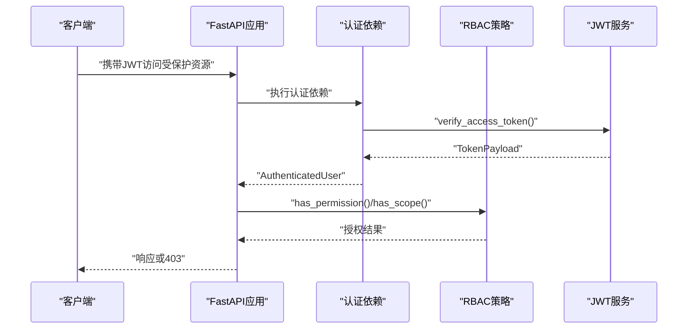
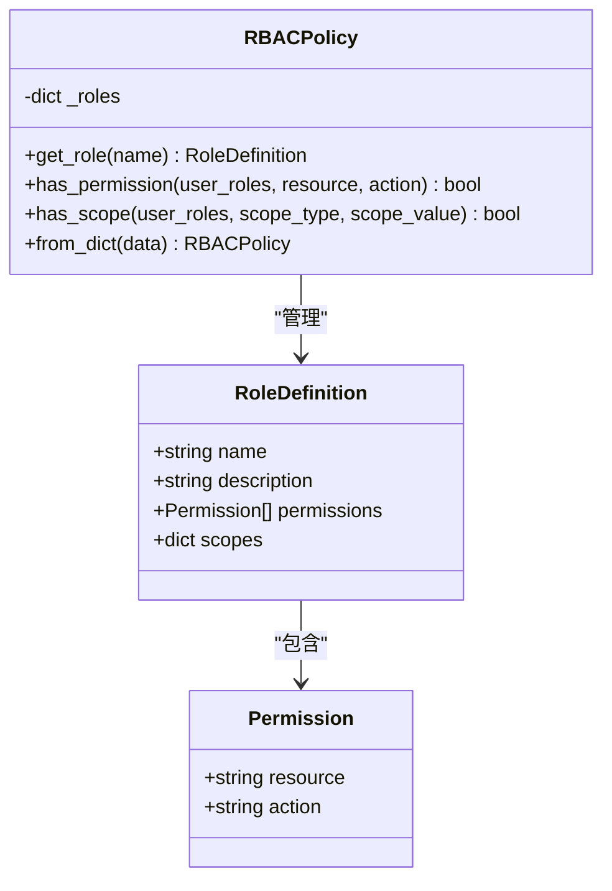
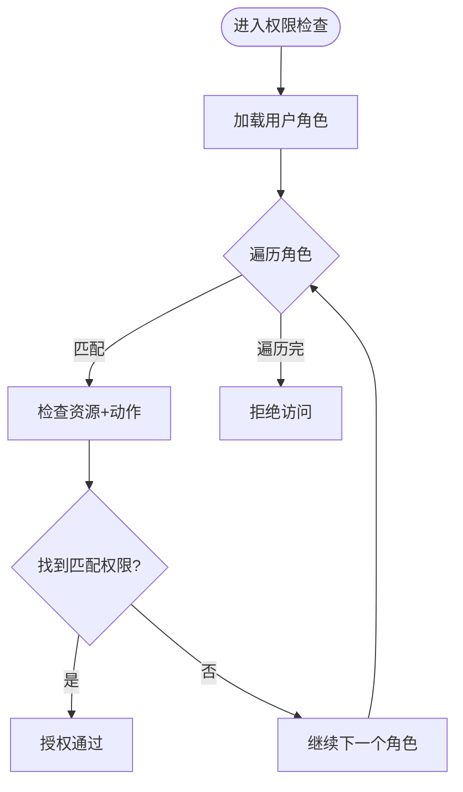
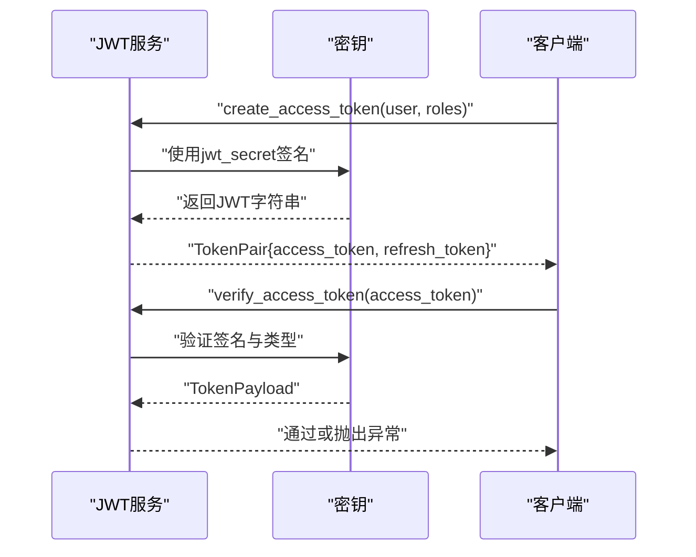
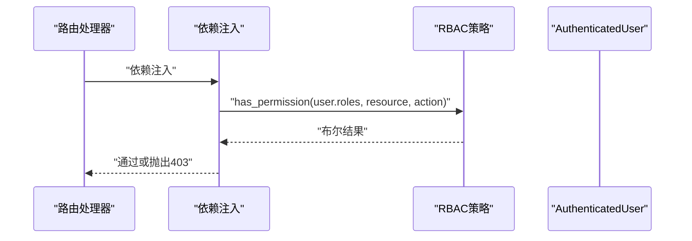
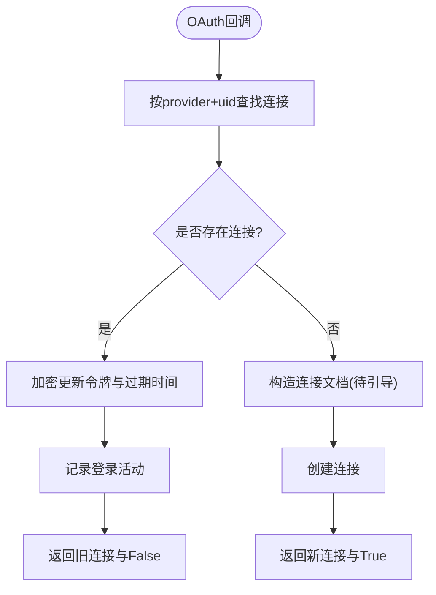
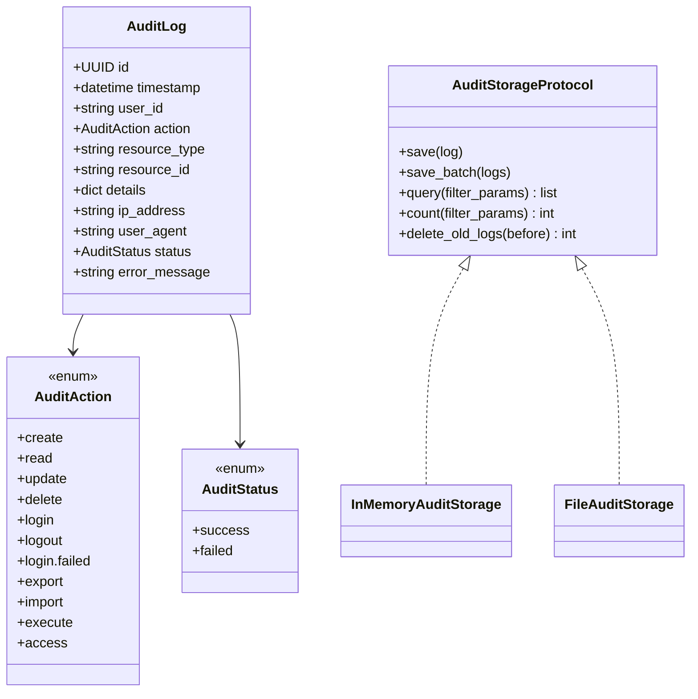
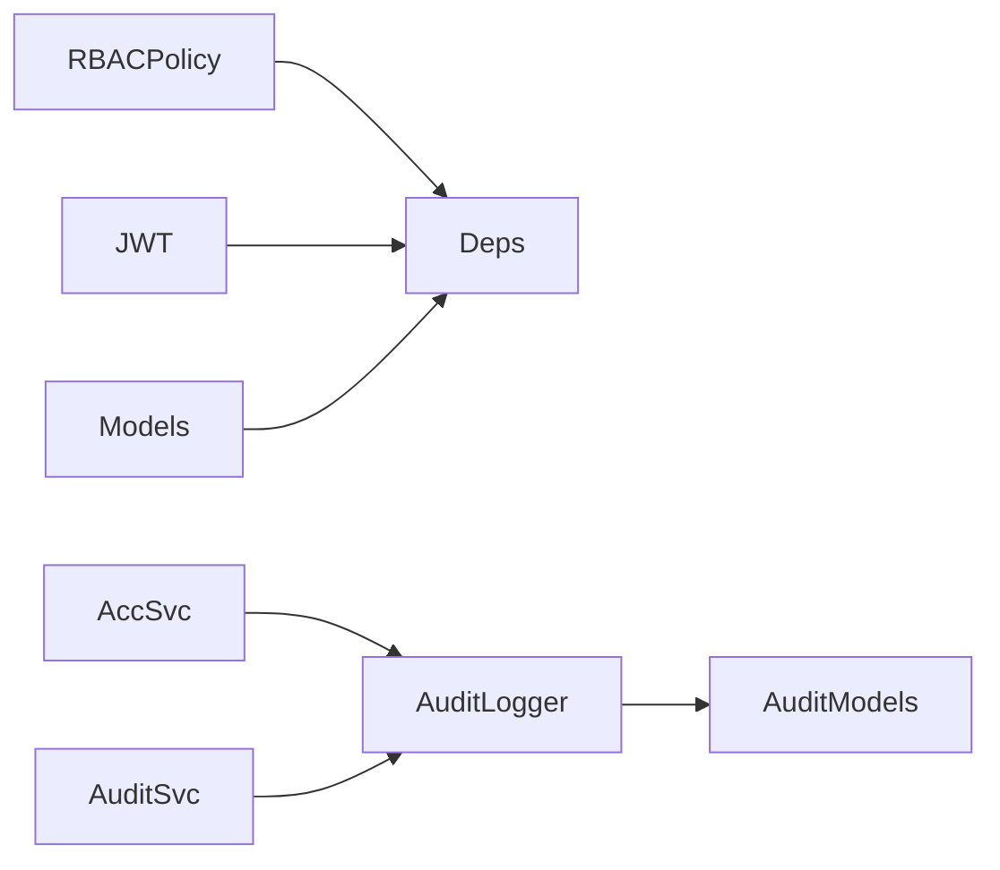

# RBAC权限控制

<cite>
**本文引用的文件**
- [rbac.py](file://tools/flexloop/src/taolib/testing/auth/rbac.py)
- [tokens.py](file://tools/flexloop/src/taolib/testing/auth/tokens.py)
- [models.py](file://tools/flexloop/src/taolib/testing/auth/models.py)
- [dependencies.py](file://tools/flexloop/src/taolib/testing/auth/fastapi/dependencies.py)
- [rbac.py](file://tools/flexloop/src/taolib/testing/config_center/server/auth/rbac.py)
- [account_service.py](file://tools/flexloop/src/taolib/testing/oauth/services/account_service.py)
- [logger.py](file://tools/flexloop/src/taolib/testing/audit/logger.py)
- [models.py](file://tools/flexloop/src/taolib/testing/audit/models.py)
- [audit_service.py](file://tools/flexloop/src/taolib/testing/config_center/services/audit_service.py)
- [test_auth.py](file://tools/flexloop/tests/testing/test_auth/test_fastapi/test_dependencies.py)
- [test_tokens.py](file://tools/flexloop/tests/testing/test_auth/test_tokens.py)
- [test_services.py](file://tools/flexloop/tests/testing/test_oauth/test_services/test_services.py)
</cite>

## 目录
1. [简介](#简介)
2. [项目结构](#项目结构)
3. [核心组件](#核心组件)
4. [架构总览](#架构总览)
5. [详细组件分析](#详细组件分析)
6. [依赖分析](#依赖分析)
7. [性能考虑](#性能考虑)
8. [故障排查指南](#故障排查指南)
9. [结论](#结论)
10. [附录](#附录)

## 简介
本文件面向RBAC权限控制模块，系统化梳理角色基础访问控制模型设计、权限映射与继承关系、连接管理机制、活动跟踪体系、令牌加密与安全传输，以及JWT处理、签名验证与密钥管理。文档提供可操作的配置与使用指南，并结合测试用例定位关键实现位置，帮助开发者快速理解与落地。

## 项目结构
RBAC与权限相关能力分布在以下子模块：
- 认证与授权核心：RBAC策略引擎、JWT令牌服务、认证用户模型与FastAPI依赖注入
- 配置中心RBAC：系统角色定义与环境/服务作用域控制
- OAuth连接管理：用户第三方身份与本地账户的关联、令牌加密存储与活动记录
- 审计与活动跟踪：审计日志模型、存储与查询接口、活动仓库与服务

```mermaid
graph TB
subgraph "认证与授权"
RBACPolicy["RBAC策略引擎<br/>tools/flexloop/src/taolib/testing/auth/rbac.py"]
JWT["JWT服务<br/>tools/flexloop/src/taolib/testing/auth/tokens.py"]
Models["认证模型<br/>tools/flexloop/src/taolib/testing/auth/models.py"]
Deps["FastAPI依赖注入<br/>tools/flexloop/src/taolib/testing/auth/fastapi/dependencies.py"]
end
subgraph "配置中心RBAC"
CC_RBAC["配置中心RBAC服务<br/>tools/flexloop/src/taolib/testing/config_center/server/auth/rbac.py"]
end
subgraph "OAuth连接管理"
AccSvc["OAuth账户服务<br/>tools/flexloop/src/taolib/testing/oauth/services/account_service.py"]
end
subgraph "审计与活动跟踪"
AuditLogger["审计日志记录器<br/>tools/flexloop/src/taolib/testing/audit/logger.py"]
AuditModels["审计模型<br/>tools/flexloop/src/taolib/testing/audit/models.py"]
AuditSvc["审计服务<br/>tools/flexloop/src/taolib/testing/config_center/services/audit_service.py"]
end
RBACPolicy --> Deps
CC_RBAC --> Deps
JWT --> Deps
AccSvc --> AuditLogger
AuditSvc --> AuditLogger
```

**图表来源**
- [rbac.py:41-158](file://tools/flexloop/src/taolib/testing/auth/rbac.py#L41-L158)
- [tokens.py:17-237](file://tools/flexloop/src/taolib/testing/auth/tokens.py#L17-L237)
- [models.py:11-68](file://tools/flexloop/src/taolib/testing/auth/models.py#L11-L68)
- [dependencies.py:186-290](file://tools/flexloop/src/taolib/testing/auth/fastapi/dependencies.py#L186-L290)
- [rbac.py:11-162](file://tools/flexloop/src/taolib/testing/config_center/server/auth/rbac.py#L11-L162)
- [account_service.py:22-200](file://tools/flexloop/src/taolib/testing/oauth/services/account_service.py#L22-L200)
- [logger.py:22-77](file://tools/flexloop/src/taolib/testing/audit/logger.py#L22-L77)
- [models.py:14-199](file://tools/flexloop/src/taolib/testing/audit/models.py#L14-L199)
- [audit_service.py:89-111](file://tools/flexloop/src/taolib/testing/config_center/services/audit_service.py#L89-L111)

**章节来源**
- [rbac.py:1-160](file://tools/flexloop/src/taolib/testing/auth/rbac.py#L1-L160)
- [tokens.py:1-237](file://tools/flexloop/src/taolib/testing/auth/tokens.py#L1-L237)
- [models.py:1-68](file://tools/flexloop/src/taolib/testing/auth/models.py#L1-L68)
- [dependencies.py:186-290](file://tools/flexloop/src/taolib/testing/auth/fastapi/dependencies.py#L186-L290)
- [rbac.py:1-162](file://tools/flexloop/src/taolib/testing/config_center/server/auth/rbac.py#L1-L162)
- [account_service.py:1-270](file://tools/flexloop/src/taolib/testing/oauth/services/account_service.py#L1-L270)
- [logger.py:1-747](file://tools/flexloop/src/taolib/testing/audit/logger.py#L1-L747)
- [models.py:1-199](file://tools/flexloop/src/taolib/testing/audit/models.py#L1-L199)
- [audit_service.py:89-111](file://tools/flexloop/src/taolib/testing/config_center/services/audit_service.py#L89-L111)

## 核心组件
- RBAC策略引擎：提供角色到权限映射、权限检查与作用域校验，支持从字典构建策略
- JWT服务：生成与验证Access/Refresh Token，携带用户ID、角色、jti等声明
- 认证模型：TokenPayload、AuthenticatedUser、TokenPair等核心数据结构
- FastAPI依赖注入：require_roles、require_permissions、require_scope
- 配置中心RBAC服务：内置系统角色与环境/服务作用域控制
- OAuth账户服务：连接查找/创建、令牌加密存储、活动记录
- 审计日志：统一的审计模型、存储协议与查询接口

**章节来源**
- [rbac.py:41-158](file://tools/flexloop/src/taolib/testing/auth/rbac.py#L41-L158)
- [tokens.py:17-237](file://tools/flexloop/src/taolib/testing/auth/tokens.py#L17-L237)
- [models.py:11-68](file://tools/flexloop/src/taolib/testing/auth/models.py#L11-L68)
- [dependencies.py:186-290](file://tools/flexloop/src/taolib/testing/auth/fastapi/dependencies.py#L186-L290)
- [rbac.py:11-162](file://tools/flexloop/src/taolib/testing/config_center/server/auth/rbac.py#L11-L162)
- [account_service.py:22-200](file://tools/flexloop/src/taolib/testing/oauth/services/account_service.py#L22-L200)
- [models.py:14-199](file://tools/flexloop/src/taolib/testing/audit/models.py#L14-L199)

## 架构总览
RBAC权限控制贯穿认证、授权与审计三个层面：
- 认证层：JWT服务负责令牌签发与验证，认证依赖注入将用户上下文注入请求
- 授权层：RBAC策略引擎进行权限与作用域校验，FastAPI依赖实现路由级保护
- 审计层：活动与审计日志统一记录，支持查询、统计与清理

**图表来源**
- [dependencies.py:203-244](file://tools/flexloop/src/taolib/testing/auth/fastapi/dependencies.py#L203-L244)
- [tokens.py:155-199](file://tools/flexloop/src/taolib/testing/auth/tokens.py#L155-L199)
- [rbac.py:64-115](file://tools/flexloop/src/taolib/testing/auth/rbac.py#L64-L115)

## 详细组件分析

### RBAC策略引擎（通用）
- 角色定义：RoleDefinition包含名称、描述、权限集合与作用域映射
- 权限检查：遍历用户角色，匹配资源与动作
- 作用域检查：支持环境/服务等作用域，None表示无限制
- 字典构建：from_dict兼容现有系统角色格式，自动解析作用域字段

**图表来源**
- [rbac.py:10-158](file://tools/flexloop/src/taolib/testing/auth/rbac.py#L10-L158)

**章节来源**
- [rbac.py:41-158](file://tools/flexloop/src/taolib/testing/auth/rbac.py#L41-L158)

### 配置中心RBAC服务
- 内置系统角色：超级管理员、配置管理员、配置编辑、配置查看者、审计员
- 环境作用域：配置编辑/查看者仅限开发/预发布环境
- 权限检查：has_permission按角色权限映射判断
- 环境/服务作用域：can_access_environment/can_access_service

**图表来源**
- [rbac.py:91-137](file://tools/flexloop/src/taolib/testing/config_center/server/auth/rbac.py#L91-L137)

**章节来源**
- [rbac.py:11-162](file://tools/flexloop/src/taolib/testing/config_center/server/auth/rbac.py#L11-L162)

### JWT令牌服务与安全传输
- 令牌类型：Access/Refresh，分别用于短期访问与刷新
- 声明内容：sub、roles、exp、iat、type、jti；可选iss
- 验证流程：decode_token解码并校验签名；verify_access_token/verify_refresh_token校验类型
- 兼容性：支持旧版令牌（无jti/iat），回退填充当前时间

**图表来源**
- [tokens.py:34-127](file://tools/flexloop/src/taolib/testing/auth/tokens.py#L34-L127)
- [tokens.py:129-199](file://tools/flexloop/src/taolib/testing/auth/tokens.py#L129-L199)

**章节来源**
- [tokens.py:17-237](file://tools/flexloop/src/taolib/testing/auth/tokens.py#L17-L237)
- [models.py:11-68](file://tools/flexloop/src/taolib/testing/auth/models.py#L11-L68)

### FastAPI依赖注入与权限检查
- require_roles：基于角色集合的路由保护
- require_permissions：基于RBAC策略的资源动作检查
- require_scope：基于作用域的访问控制
- 与认证依赖组合使用，形成多层保护

**图表来源**
- [dependencies.py:203-244](file://tools/flexloop/src/taolib/testing/auth/fastapi/dependencies.py#L203-L244)
- [dependencies.py:247-288](file://tools/flexloop/src/taolib/testing/auth/fastapi/dependencies.py#L247-L288)

**章节来源**
- [dependencies.py:186-290](file://tools/flexloop/src/taolib/testing/auth/fastapi/dependencies.py#L186-L290)

### OAuth连接管理与活动记录
- 连接查找/创建：按(provider, provider_user_id)查找，存在则更新令牌，否则新建并标记待引导
- 令牌加密：使用TokenEncryptor对access_token/refresh_token加密存储
- 活动记录：登录/取消关联等关键动作写入活动日志
- 关联限制：确保用户至少保留一种认证方式

**图表来源**
- [account_service.py:43-130](file://tools/flexloop/src/taolib/testing/oauth/services/account_service.py#L43-L130)

**章节来源**
- [account_service.py:22-200](file://tools/flexloop/src/taolib/testing/oauth/services/account_service.py#L22-L200)

### 审计与活动跟踪
- 审计模型：统一的AuditAction/AuditStatus/AuditLog等枚举与模型
- 存储协议：定义save/save_batch/query/count/delete_old_logs等接口
- 内存/文件存储实现：InMemoryAuditStorage/FileAuditStorage
- 审计服务：封装查询与分页响应

**图表来源**
- [models.py:14-199](file://tools/flexloop/src/taolib/testing/audit/models.py#L14-L199)
- [logger.py:22-77](file://tools/flexloop/src/taolib/testing/audit/logger.py#L22-L77)

**章节来源**
- [models.py:14-199](file://tools/flexloop/src/taolib/testing/audit/models.py#L14-L199)
- [logger.py:1-200](file://tools/flexloop/src/taolib/testing/audit/logger.py#L1-L200)
- [audit_service.py:89-111](file://tools/flexloop/src/taolib/testing/config_center/services/audit_service.py#L89-L111)

## 依赖分析
- 组件耦合
  - RBAC策略与FastAPI依赖紧密耦合，通过依赖注入实现路由级授权
  - JWT服务与认证模型强关联，TokenPayload作为跨模块传递载体
  - OAuth账户服务依赖连接仓储、活动仓储与令牌加密器
  - 审计日志记录器通过协议抽象支持多种存储后端
- 外部依赖
  - jose库用于JWT编码/解码与签名验证
  - Pydantic模型用于数据校验与序列化

**图表来源**
- [dependencies.py:203-244](file://tools/flexloop/src/taolib/testing/auth/fastapi/dependencies.py#L203-L244)
- [tokens.py:10-14](file://tools/flexloop/src/taolib/testing/auth/tokens.py#L10-L14)
- [account_service.py:9-20](file://tools/flexloop/src/taolib/testing/oauth/services/account_service.py#L9-L20)
- [logger.py:13-14](file://tools/flexloop/src/taolib/testing/audit/logger.py#L13-L14)

**章节来源**
- [dependencies.py:186-290](file://tools/flexloop/src/taolib/testing/auth/fastapi/dependencies.py#L186-L290)
- [tokens.py:10-14](file://tools/flexloop/src/taolib/testing/auth/tokens.py#L10-L14)
- [account_service.py:9-20](file://tools/flexloop/src/taolib/testing/oauth/services/account_service.py#L9-L20)
- [logger.py:13-14](file://tools/flexloop/src/taolib/testing/audit/logger.py#L13-L14)

## 性能考虑
- RBAC检查复杂度：O(R×P)，R为用户角色数，P为角色权限数；建议缓存常用角色与权限映射
- JWT验证：单次签名验证开销极低；建议集中式密钥轮换与批量黑名单检查
- 审计存储：内存/文件存储适合小规模；生产建议使用数据库或云存储，配合索引与分页
- OAuth连接：批量更新令牌时优先使用加密器一次性处理，减少重复加解密

## 故障排查指南
- 令牌验证失败
  - 确认jwt_secret与算法配置一致
  - 检查令牌是否过期或类型不正确
  - 参考测试用例定位问题场景
- 权限不足
  - 核对用户角色是否包含所需资源动作
  - 检查作用域限制（环境/服务）
- OAuth连接异常
  - 确认令牌加密器可用且密钥正确
  - 检查是否违反“至少保留一种认证方式”的约束
- 审计日志缺失
  - 确认存储后端可用与过滤条件合理
  - 检查日志上限与清理策略

**章节来源**
- [test_tokens.py:76-224](file://tools/flexloop/tests/testing/test_auth/test_tokens.py#L76-L224)
- [test_auth.py:86-132](file://tools/flexloop/tests/testing/test_auth/test_fastapi/test_dependencies.py#L86-L132)
- [test_services.py:27-65](file://tools/flexloop/tests/testing/test_oauth/test_services/test_services.py#L27-L65)

## 结论
本RBAC权限控制模块以清晰的角色-权限模型为核心，结合JWT令牌与FastAPI依赖注入实现细粒度的路由级授权，并通过OAuth连接管理与审计日志体系完善了身份关联与行为追踪。建议在生产环境中强化密钥管理、引入缓存与数据库审计存储，并持续完善权限矩阵与异常检测策略。

## 附录

### 配置角色权限与实现权限检查（步骤指引）
- 定义角色与权限
  - 在RBAC策略中添加角色与权限映射
  - 使用from_dict从系统角色字典构建策略
- 在FastAPI中保护路由
  - 使用require_permissions(resource, action, rbac_policy)保护资源动作
  - 使用require_scope(scope_type, scope_value, rbac_policy)保护作用域
- 验证JWT令牌
  - 使用verify_access_token校验访问令牌
  - 使用verify_refresh_token校验刷新令牌
- 管理OAuth连接
  - 使用find_or_create_connection处理登录与令牌更新
  - 使用link_provider为已有用户关联第三方提供商
- 记录审计日志
  - 使用审计记录器保存操作日志
  - 通过审计服务查询与统计

**章节来源**
- [rbac.py:118-158](file://tools/flexloop/src/taolib/testing/auth/rbac.py#L118-L158)
- [dependencies.py:203-288](file://tools/flexloop/src/taolib/testing/auth/fastapi/dependencies.py#L203-L288)
- [tokens.py:155-199](file://tools/flexloop/src/taolib/testing/auth/tokens.py#L155-L199)
- [account_service.py:43-200](file://tools/flexloop/src/taolib/testing/oauth/services/account_service.py#L43-L200)
- [logger.py:251-558](file://tools/flexloop/src/taolib/testing/audit/logger.py#L251-L558)