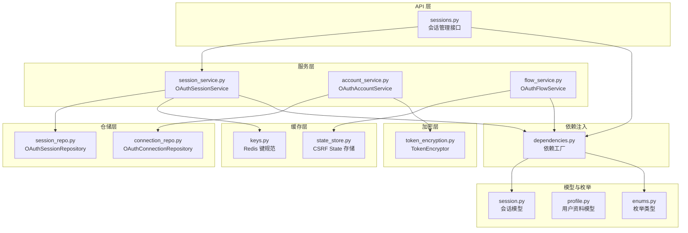
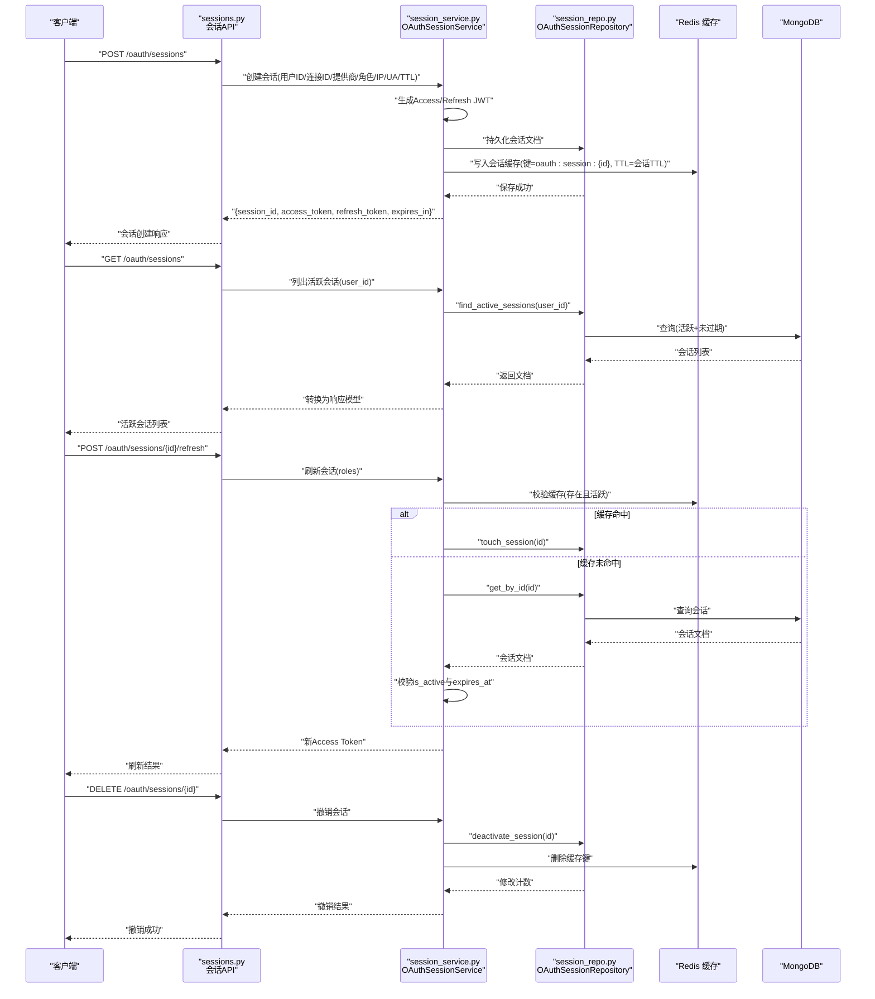
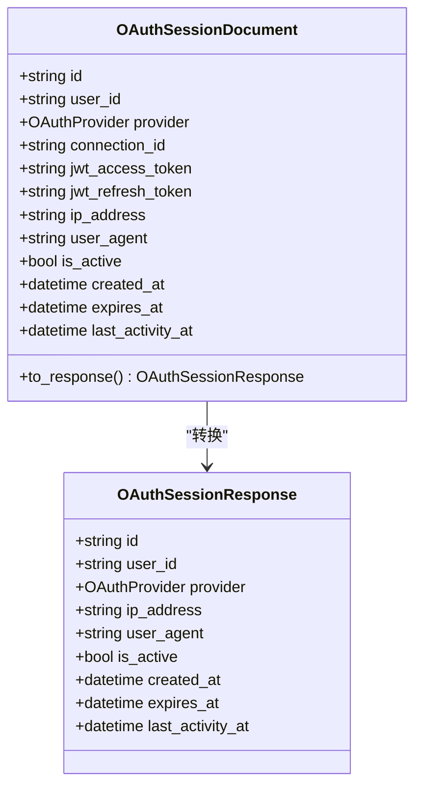
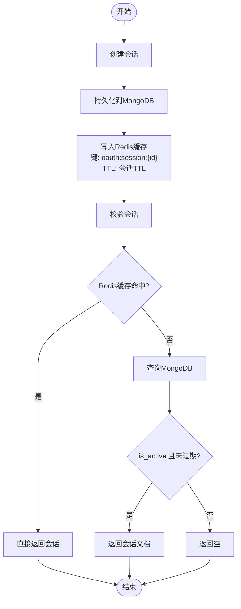
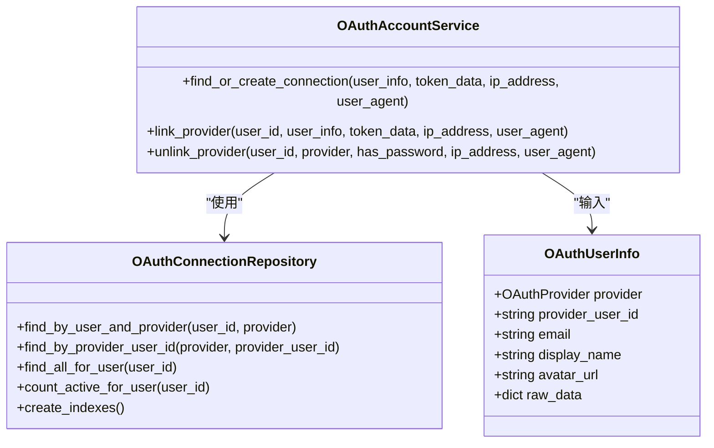
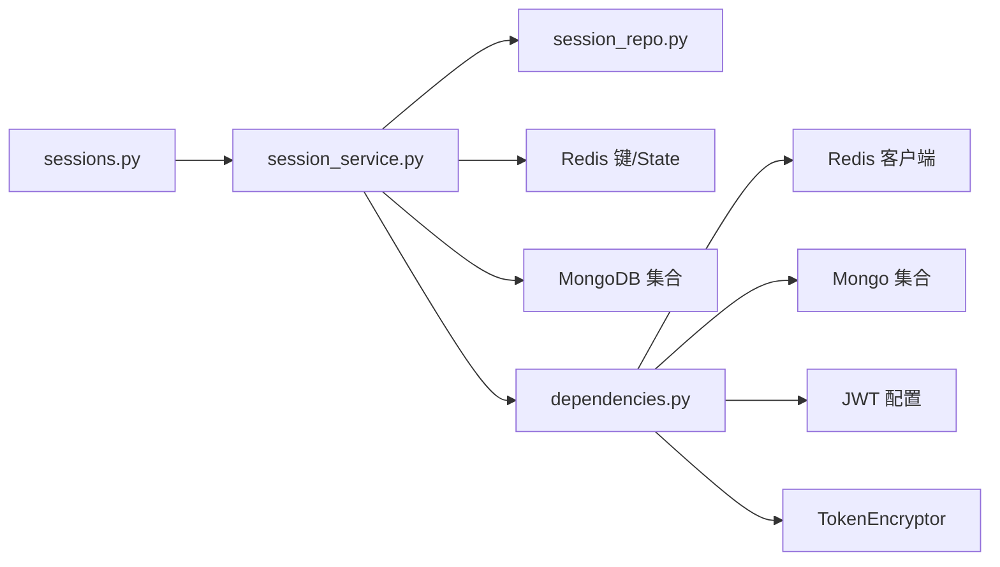

# 会话管理

<cite>
**本文引用的文件**
- [session_service.py](file://tools/flexloop/src/taolib/testing/oauth/services/session_service.py)
- [session_repo.py](file://tools/flexloop/src/taolib/testing/oauth/repository/session_repo.py)
- [session.py](file://tools/flexloop/src/taolib/testing/oauth/models/session.py)
- [sessions.py](file://tools/flexloop/src/taolib/testing/oauth/server/api/sessions.py)
- [dependencies.py](file://tools/flexloop/src/taolib/testing/oauth/server/dependencies.py)
- [keys.py](file://tools/flexloop/src/taolib/testing/oauth/cache/keys.py)
- [state_store.py](file://tools/flexloop/src/taolib/testing/oauth/cache/state_store.py)
- [token_encryption.py](file://tools/flexloop/src/taolib/testing/oauth/crypto/token_encryption.py)
- [account_service.py](file://tools/flexloop/src/taolib/testing/oauth/services/account_service.py)
- [connection_repo.py](file://tools/flexloop/src/taolib/testing/oauth/repository/connection_repo.py)
- [profile.py](file://tools/flexloop/src/taolib/testing/oauth/models/profile.py)
- [enums.py](file://tools/flexloop/src/taolib/testing/oauth/models/enums.py)
- [flow_service.py](file://tools/flexloop/src/taolib/testing/oauth/services/flow_service.py)
- [errors.py](file://tools/flexloop/src/taolib/testing/oauth/errors.py)
- [test_repos.py](file://tools/flexloop/tests/testing/test_oauth/test_repository/test_repos.py)
- [test_crypto.py](file://tools/flexloop/tests/testing/test_oauth/test_crypto.py)
</cite>

## 目录
1. [简介](#简介)
2. [项目结构](#项目结构)
3. [核心组件](#核心组件)
4. [架构总览](#架构总览)
5. [详细组件分析](#详细组件分析)
6. [依赖分析](#依赖分析)
7. [性能考虑](#性能考虑)
8. [故障排查指南](#故障排查指南)
9. [结论](#结论)
10. [附录](#附录)

## 简介
本文件系统化梳理会话管理模块的设计与实现，涵盖会话模型、会话缓存与过期管理、并发控制、用户档案与第三方映射、会话安全策略（令牌加密、防重放、会话固定防护）、以及会话创建、续期与失效处理的实践路径，并提供会话清理、审计日志与安全监控的实用建议。

## 项目结构
会话管理位于工具包 flexloop 的 OAuth 子系统内，采用分层设计：API 层负责路由与鉴权；服务层编排业务流程；仓储层封装数据访问；缓存层提供高性能状态存储；加密层保障敏感令牌安全；模型层定义数据结构与枚举。

图表来源
- [sessions.py:1-100](file://tools/flexloop/src/taolib/testing/oauth/server/api/sessions.py#L1-L100)
- [session_service.py:1-238](file://tools/flexloop/src/taolib/testing/oauth/services/session_service.py#L1-L238)
- [session_repo.py:1-92](file://tools/flexloop/src/taolib/testing/oauth/repository/session_repo.py#L1-L92)
- [connection_repo.py:1-105](file://tools/flexloop/src/taolib/testing/oauth/repository/connection_repo.py#L1-L105)
- [keys.py:1-42](file://tools/flexloop/src/taolib/testing/oauth/cache/keys.py#L1-L42)
- [state_store.py:1-69](file://tools/flexloop/src/taolib/testing/oauth/cache/state_store.py#L1-L69)
- [token_encryption.py:1-54](file://tools/flexloop/src/taolib/testing/oauth/crypto/token_encryption.py#L1-L54)
- [session.py:1-67](file://tools/flexloop/src/taolib/testing/oauth/models/session.py#L1-L67)
- [profile.py:1-41](file://tools/flexloop/src/taolib/testing/oauth/models/profile.py#L1-L41)
- [enums.py:1-45](file://tools/flexloop/src/taolib/testing/oauth/models/enums.py#L1-L45)
- [dependencies.py:1-231](file://tools/flexloop/src/taolib/testing/oauth/server/dependencies.py#L1-L231)

章节来源
- [sessions.py:1-100](file://tools/flexloop/src/taolib/testing/oauth/server/api/sessions.py#L1-L100)
- [dependencies.py:1-231](file://tools/flexloop/src/taolib/testing/oauth/server/dependencies.py#L1-L231)

## 核心组件
- 会话模型：定义会话文档与对外响应模型，包含用户标识、提供商、IP/User-Agent、激活状态、创建/过期/最后活跃时间等字段，并提供文档到响应的转换。
- 会话仓储：提供活跃会话查询、停用单个/全部会话、更新最后活跃时间、以及 MongoDB 索引创建。
- 会话服务：负责会话创建（生成 JWT、持久化、写入缓存）、校验（Redis 优先、回退数据库）、续期、撤销与批量撤销、列出活跃会话。
- 缓存键与状态存储：定义会话与 CSRF state 的 Redis 键命名规范，提供一次性消费与过期控制。
- 用户档案与账户服务：维护第三方用户信息映射、本地账户关联、令牌加密存储、活动日志记录。
- 依赖注入与配置：集中提供 MongoDB、Redis、JWT、加密器、服务实例的依赖工厂，确保一致性与可测试性。

章节来源
- [session.py:14-67](file://tools/flexloop/src/taolib/testing/oauth/models/session.py#L14-L67)
- [session_repo.py:13-92](file://tools/flexloop/src/taolib/testing/oauth/repository/session_repo.py#L13-L92)
- [session_service.py:15-238](file://tools/flexloop/src/taolib/testing/oauth/services/session_service.py#L15-L238)
- [keys.py:7-41](file://tools/flexloop/src/taolib/testing/oauth/cache/keys.py#L7-L41)
- [state_store.py:13-69](file://tools/flexloop/src/taolib/testing/oauth/cache/state_store.py#L13-L69)
- [account_service.py:22-216](file://tools/flexloop/src/taolib/testing/oauth/services/account_service.py#L22-L216)
- [dependencies.py:29-231](file://tools/flexloop/src/taolib/testing/oauth/server/dependencies.py#L29-L231)

## 架构总览
下图展示了从 API 请求到会话创建、校验、续期与撤销的关键交互流程，以及与缓存、数据库、加密层的协作关系。

图表来源
- [sessions.py:15-97](file://tools/flexloop/src/taolib/testing/oauth/server/api/sessions.py#L15-L97)
- [session_service.py:83-164](file://tools/flexloop/src/taolib/testing/oauth/services/session_service.py#L83-L164)
- [session_repo.py:24-83](file://tools/flexloop/src/taolib/testing/oauth/repository/session_repo.py#L24-L83)
- [keys.py:19-28](file://tools/flexloop/src/taolib/testing/oauth/cache/keys.py#L19-L28)

章节来源
- [sessions.py:1-100](file://tools/flexloop/src/taolib/testing/oauth/server/api/sessions.py#L1-L100)
- [session_service.py:140-238](file://tools/flexloop/src/taolib/testing/oauth/services/session_service.py#L140-L238)
- [session_repo.py:24-92](file://tools/flexloop/src/taolib/testing/oauth/repository/session_repo.py#L24-L92)

## 详细组件分析

### 会话模型与数据结构
- 会话文档模型包含用户ID、提供商、连接ID、JWT访问/刷新令牌、IP/UA、激活状态、创建/过期/最后活跃时间等字段，并提供 to_response 方法用于对外输出。
- 会话响应模型用于 API 返回，避免泄露敏感令牌字段。

图表来源
- [session.py:14-67](file://tools/flexloop/src/taolib/testing/oauth/models/session.py#L14-L67)
- [enums.py:9-14](file://tools/flexloop/src/taolib/testing/oauth/models/enums.py#L9-L14)

章节来源
- [session.py:14-67](file://tools/flexloop/src/taolib/testing/oauth/models/session.py#L14-L67)
- [enums.py:9-14](file://tools/flexloop/src/taolib/testing/oauth/models/enums.py#L9-L14)

### 会话缓存机制与过期管理
- 缓存键规范：会话键为 oauth:session:{session_id}，用户会话列表键为 oauth:user_sessions:{user_id}，state 键为 oauth:state:{state}。
- 缓存策略：创建会话后写入 Redis，TTL 与会话 TTL 一致；校验会话优先查缓存，命中即返回；撤销会话同时删除缓存键。
- 过期管理：MongoDB 会话集合建立 expires_at 索引（expireAfterSeconds=0），实现过期自动清理；服务层在查询时仍进行逻辑过期判断以保证一致性。

图表来源
- [session_service.py:140-164](file://tools/flexloop/src/taolib/testing/oauth/services/session_service.py#L140-L164)
- [session_repo.py:85-89](file://tools/flexloop/src/taolib/testing/oauth/repository/session_repo.py#L85-L89)
- [keys.py:19-41](file://tools/flexloop/src/taolib/testing/oauth/cache/keys.py#L19-L41)

章节来源
- [session_service.py:140-164](file://tools/flexloop/src/taolib/testing/oauth/services/session_service.py#L140-L164)
- [session_repo.py:85-89](file://tools/flexloop/src/taolib/testing/oauth/repository/session_repo.py#L85-L89)
- [keys.py:19-41](file://tools/flexloop/src/taolib/testing/oauth/cache/keys.py#L19-L41)

### 并发控制与一致性
- Redis 原子性：CSRF state 采用一次性消费模式（读取并删除），有效防止重放攻击，天然具备并发安全性。
- 会话并发：会话校验先查缓存再查数据库，避免热点竞争；Redis 写入与数据库写入分离，降低锁竞争。
- 会话续期：服务层在刷新时调用 touch_session 更新最后活跃时间，确保后续续期与活跃判定准确。

章节来源
- [state_store.py:48-69](file://tools/flexloop/src/taolib/testing/oauth/cache/state_store.py#L48-L69)
- [session_repo.py:74-83](file://tools/flexloop/src/taolib/testing/oauth/repository/session_repo.py#L74-L83)

### 用户档案管理与第三方映射
- 第三方用户信息标准化：OAuthUserInfo 统一不同提供商的用户信息字段，便于后续本地账户关联与资料同步。
- 连接仓储：支持按用户+提供商、提供商+用户ID查询连接，提供用户所有连接列表与活跃连接计数。
- 账户服务：负责“发现/创建”连接与“关联/解除关联”，在关联时加密存储访问/刷新令牌，记录活动日志，确保至少保留一种认证方式。

图表来源
- [profile.py:13-26](file://tools/flexloop/src/taolib/testing/oauth/models/profile.py#L13-L26)
- [connection_repo.py:23-102](file://tools/flexloop/src/taolib/testing/oauth/repository/connection_repo.py#L23-L102)
- [account_service.py:43-216](file://tools/flexloop/src/taolib/testing/oauth/services/account_service.py#L43-L216)

章节来源
- [profile.py:13-26](file://tools/flexloop/src/taolib/testing/oauth/models/profile.py#L13-L26)
- [connection_repo.py:23-102](file://tools/flexloop/src/taolib/testing/oauth/repository/connection_repo.py#L23-L102)
- [account_service.py:43-216](file://tools/flexloop/src/taolib/testing/oauth/services/account_service.py#L43-L216)

### 会话安全策略
- 令牌加密：使用 Fernet 对称加密存储第三方访问/刷新令牌，支持密钥轮换，避免明文落库。
- 防重放攻击：CSRF state 一次性消费与过期控制，结合授权码交换前的 state 校验，杜绝重放。
- 会话固定防护：会话创建时生成全新 session_id，配合 Redis 缓存键与数据库双写，避免会话固定风险。
- JWT 策略：会话服务独立维护 JWT secret、算法与过期时间，支持 Access/Refresh 双令牌模型，续期仅更新 Access Token 并延长缓存 TTL。

章节来源
- [token_encryption.py:20-54](file://tools/flexloop/src/taolib/testing/oauth/crypto/token_encryption.py#L20-L54)
- [state_store.py:48-69](file://tools/flexloop/src/taolib/testing/oauth/cache/state_store.py#L48-L69)
- [session_service.py:83-138](file://tools/flexloop/src/taolib/testing/oauth/services/session_service.py#L83-L138)

### 会话创建与管理实践
- 创建会话：调用会话服务的创建方法，传入用户ID、连接ID、提供商、角色、IP/UA与会话TTL，返回 session_id、access_token、refresh_token 与过期秒数。
- 列出活跃会话：通过 API 获取当前用户的所有活跃会话。
- 刷新会话：调用刷新接口，服务层生成新 Access Token 并更新最后活跃时间。
- 撤销会话：单个撤销或批量撤销，同时清理 Redis 缓存键。

章节来源
- [sessions.py:15-97](file://tools/flexloop/src/taolib/testing/oauth/server/api/sessions.py#L15-L97)
- [session_service.py:83-138](file://tools/flexloop/src/taolib/testing/oauth/services/session_service.py#L83-L138)
- [session_service.py:166-238](file://tools/flexloop/src/taolib/testing/oauth/services/session_service.py#L166-L238)

### 会话清理、审计与监控
- 会话清理：MongoDB 通过 expires_at 索引实现过期自动清理；服务层在查询时进行逻辑过期判断，确保一致性。
- 审计日志：账户服务在关联/解除关联等关键动作记录活动日志，便于追踪与审计。
- 监控建议：关注 Redis 命中率、MongoDB 查询耗时、JWT 过期分布、CSRF state 失效率与会话撤销频次。

章节来源
- [session_repo.py:85-89](file://tools/flexloop/src/taolib/testing/oauth/repository/session_repo.py#L85-L89)
- [account_service.py:190-200](file://tools/flexloop/src/taolib/testing/oauth/services/account_service.py#L190-L200)

## 依赖分析
- 组件耦合：API 依赖服务层；服务层依赖仓储层与缓存/加密基础设施；仓储层依赖 MongoDB；依赖注入集中管理各组件实例。
- 外部依赖：Redis（缓存与 state）、MongoDB（持久化）、JWT（令牌解析）、Fernet（对称加密）。
- 潜在循环依赖：当前结构清晰，未见循环导入迹象。

图表来源
- [sessions.py:1-100](file://tools/flexloop/src/taolib/testing/oauth/server/api/sessions.py#L1-L100)
- [session_service.py:1-238](file://tools/flexloop/src/taolib/testing/oauth/services/session_service.py#L1-L238)
- [dependencies.py:115-184](file://tools/flexloop/src/taolib/testing/oauth/server/dependencies.py#L115-L184)

章节来源
- [dependencies.py:115-184](file://tools/flexloop/src/taolib/testing/oauth/server/dependencies.py#L115-L184)

## 性能考虑
- 缓存优先：会话校验优先 Redis，减少数据库压力；合理设置会话 TTL 与 Redis 过期策略。
- 索引优化：MongoDB 会话集合的 user_id、expires_at、is_active+user_id 索引有助于快速筛选活跃会话与过期清理。
- 批量操作：批量撤销会话时先清理缓存键，再执行数据库批量更新，降低锁竞争。
- 并发安全：CSRF state 一次性消费天然保证并发安全；会话续期 touch 操作轻量且幂等。

章节来源
- [session_repo.py:85-89](file://tools/flexloop/src/taolib/testing/oauth/repository/session_repo.py#L85-L89)
- [session_service.py:209-223](file://tools/flexloop/src/taolib/testing/oauth/services/session_service.py#L209-L223)

## 故障排查指南
- 会话无效或过期：检查 Redis 缓存是否存在与是否过期；若缓存缺失，确认 MongoDB 中 is_active 与 expires_at 条件是否满足。
- CSRF state 失效：确认 state 是否被一次性消费、是否过期、是否与回调 state 匹配。
- 令牌解密失败：核对加密密钥是否正确、是否发生密钥轮换后未更新；检查加密器初始化。
- 会话撤销无效：确认数据库是否成功更新 is_active，Redis 缓存键是否被删除。
- 会话列表为空：确认用户活跃会话数量与过期情况，检查索引是否生效。

章节来源
- [session_service.py:140-164](file://tools/flexloop/src/taolib/testing/oauth/services/session_service.py#L140-L164)
- [state_store.py:48-69](file://tools/flexloop/src/taolib/testing/oauth/cache/state_store.py#L48-L69)
- [token_encryption.py:48-54](file://tools/flexloop/src/taolib/testing/oauth/crypto/token_encryption.py#L48-L54)
- [errors.py:64-75](file://tools/flexloop/src/taolib/testing/oauth/errors.py#L64-L75)

## 结论
该会话管理模块通过“模型-服务-仓储-缓存-加密”的分层设计，实现了高可用、可扩展且安全的会话生命周期管理。Redis 缓存与 MongoDB 索引协同保证性能与一致性；CSRF state 与 Fernet 加密强化了安全边界；完善的审计与监控能力为运维提供了可靠支撑。建议在生产环境中持续关注缓存命中率、会话过期分布与安全事件告警。

## 附录
- 代码示例路径（不含具体代码内容）：
  - 创建会话：[session_service.py:83-138](file://tools/flexloop/src/taolib/testing/oauth/services/session_service.py#L83-L138)
  - 校验会话：[session_service.py:140-164](file://tools/flexloop/src/taolib/testing/oauth/services/session_service.py#L140-L164)
  - 刷新会话：[session_service.py:166-193](file://tools/flexloop/src/taolib/testing/oauth/services/session_service.py#L166-L193)
  - 撤销会话：[session_service.py:195-207](file://tools/flexloop/src/taolib/testing/oauth/services/session_service.py#L195-L207)
  - 批量撤销会话：[session_service.py:209-223](file://tools/flexloop/src/taolib/testing/oauth/services/session_service.py#L209-L223)
  - 列出活跃会话：[session_service.py:225-235](file://tools/flexloop/src/taolib/testing/oauth/services/session_service.py#L225-L235)
  - 会话仓储查询与索引：[session_repo.py:24-89](file://tools/flexloop/src/taolib/testing/oauth/repository/session_repo.py#L24-L89)
  - CSRF state 存储与校验：[state_store.py:33-69](file://tools/flexloop/src/taolib/testing/oauth/cache/state_store.py#L33-L69)
  - 令牌加密与解密：[token_encryption.py:20-54](file://tools/flexloop/src/taolib/testing/oauth/crypto/token_encryption.py#L20-L54)
  - 用户档案与账户关联：[account_service.py:43-216](file://tools/flexloop/src/taolib/testing/oauth/services/account_service.py#L43-L216)
  - 依赖注入与配置：[dependencies.py:115-184](file://tools/flexloop/src/taolib/testing/oauth/server/dependencies.py#L115-L184)
  - 单元测试参考：
    - 会话仓储与状态测试：[test_repos.py:150-220](file://tools/flexloop/tests/testing/test_oauth/test_repository/test_repos.py#L150-L220)
    - 令牌加密测试：[test_crypto.py:20-72](file://tools/flexloop/tests/testing/test_oauth/test_crypto.py#L20-L72)