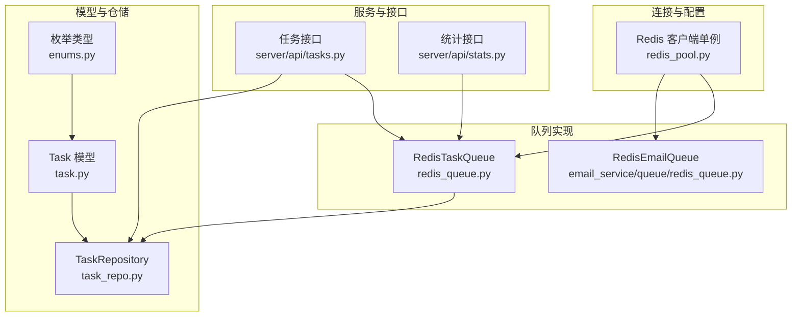
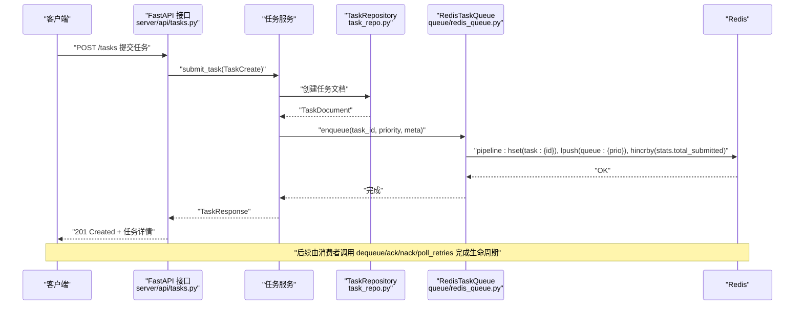
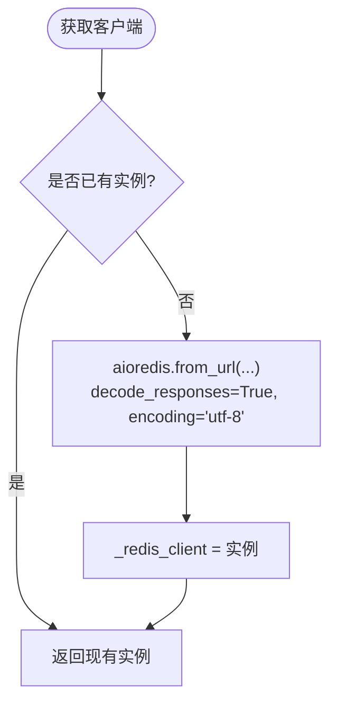
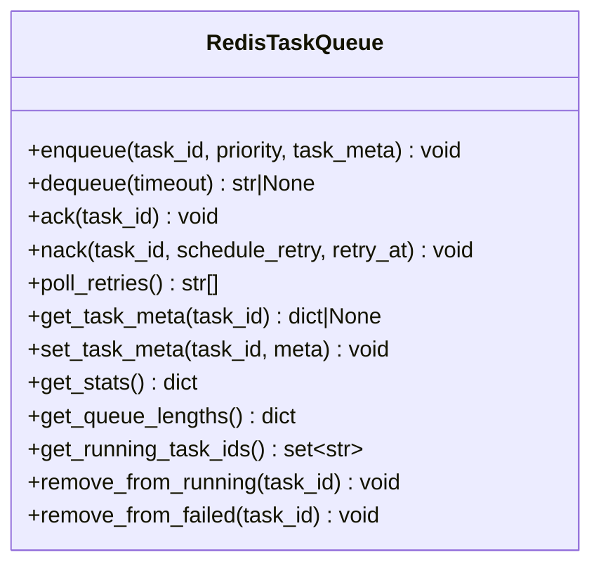
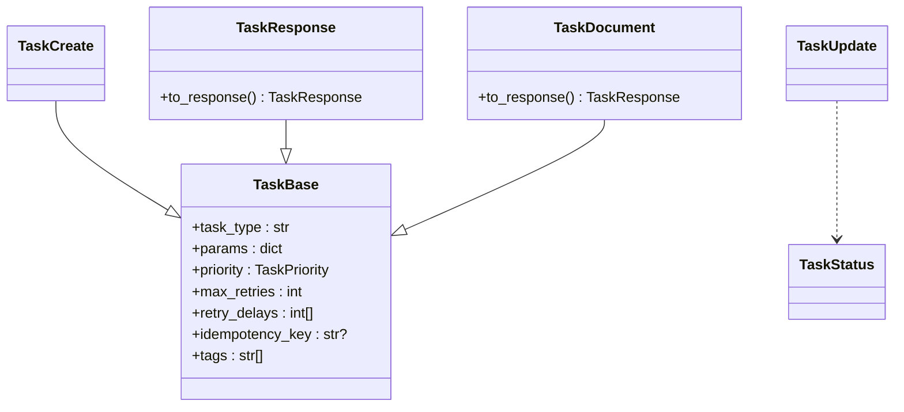
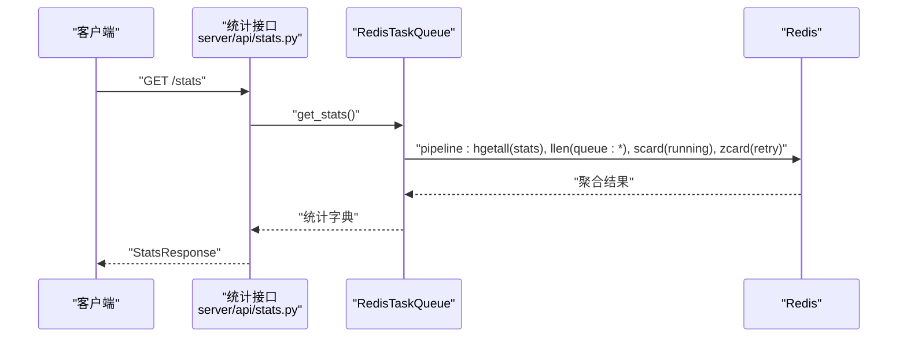
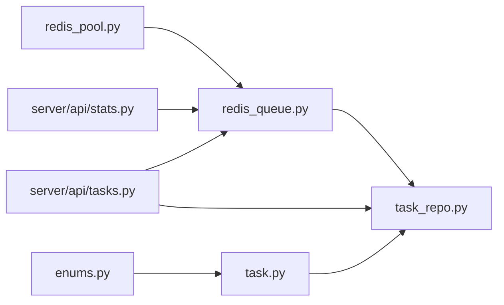

# Redis队列实现

<cite>
**本文引用的文件**
- [redis_pool.py](file://tools/flexloop/src/taolib/testing/_base/redis_pool.py)
- [redis_queue.py](file://tools/flexloop/src/taolib/testing/task_queue/queue/redis_queue.py)
- [task.py](file://tools/flexloop/src/taolib/testing/task_queue/models/task.py)
- [enums.py](file://tools/flexloop/src/taolib/testing/task_queue/models/enums.py)
- [task_repo.py](file://tools/flexloop/src/taolib/testing/task_queue/repository/task_repo.py)
- [tasks.py](file://tools/flexloop/src/taolib/testing/task_queue/server/api/tasks.py)
- [stats.py](file://tools/flexloop/src/taolib/testing/task_queue/server/api/stats.py)
- [redis_queue.py（邮件队列）](file://tools/flexloop/src/taolib/testing/email_service/queue/redis_queue.py)
</cite>

## 目录
1. [简介](#简介)
2. [项目结构](#项目结构)
3. [核心组件](#核心组件)
4. [架构总览](#架构总览)
5. [详细组件分析](#详细组件分析)
6. [依赖关系分析](#依赖关系分析)
7. [性能考量](#性能考量)
8. [故障排查指南](#故障排查指南)
9. [结论](#结论)
10. [附录](#附录)

## 简介
本文件系统性梳理了基于 Redis 的任务队列实现，覆盖连接与配置、任务模型设计、队列操作、监控与统计、以及性能与可靠性最佳实践。内容面向不同技术背景读者，既提供高层概览也给出代码级定位路径，便于快速上手与深入扩展。

## 项目结构
该实现位于工具包 flexloop 的测试样例模块中，围绕“任务队列”形成以下层次：
- 连接与配置层：Redis 客户端单例与连接参数
- 队列实现层：基于 Redis 数据结构的优先级队列与重试调度
- 模型与仓储层：任务数据模型与 MongoDB 持久化
- 服务与接口层：FastAPI 接口封装与统计查询
- 辅助队列示例：邮件队列作为独立的优先级队列参考

**图表来源**
- [redis_pool.py:1-38](file://tools/flexloop/src/taolib/testing/_base/redis_pool.py#L1-L38)
- [redis_queue.py:1-317](file://tools/flexloop/src/taolib/testing/task_queue/queue/redis_queue.py#L1-L317)
- [redis_queue.py（邮件队列）:1-81](file://tools/flexloop/src/taolib/testing/email_service/queue/redis_queue.py#L1-L81)
- [task.py:1-107](file://tools/flexloop/src/taolib/testing/task_queue/models/task.py#L1-L107)
- [enums.py:1-28](file://tools/flexloop/src/taolib/testing/task_queue/models/enums.py#L1-L28)
- [task_repo.py:1-169](file://tools/flexloop/src/taolib/testing/task_queue/repository/task_repo.py#L1-L169)
- [tasks.py:1-205](file://tools/flexloop/src/taolib/testing/task_queue/server/api/tasks.py#L1-L205)
- [stats.py:1-65](file://tools/flexloop/src/taolib/testing/task_queue/server/api/stats.py#L1-L65)

**章节来源**
- [redis_pool.py:1-38](file://tools/flexloop/src/taolib/testing/_base/redis_pool.py#L1-L38)
- [redis_queue.py:1-317](file://tools/flexloop/src/taolib/testing/task_queue/queue/redis_queue.py#L1-L317)
- [redis_queue.py（邮件队列）:1-81](file://tools/flexloop/src/taolib/testing/email_service/queue/redis_queue.py#L1-L81)
- [task.py:1-107](file://tools/flexloop/src/taolib/testing/task_queue/models/task.py#L1-L107)
- [enums.py:1-28](file://tools/flexloop/src/taolib/testing/task_queue/models/enums.py#L1-L28)
- [task_repo.py:1-169](file://tools/flexloop/src/taolib/testing/task_queue/repository/task_repo.py#L1-L169)
- [tasks.py:1-205](file://tools/flexloop/src/taolib/testing/task_queue/server/api/tasks.py#L1-L205)
- [stats.py:1-65](file://tools/flexloop/src/taolib/testing/task_queue/server/api/stats.py#L1-L65)

## 核心组件
- Redis 客户端单例与连接参数：提供统一的 Redis 异步客户端获取与关闭方法，支持自定义连接字符串与解码行为。
- RedisTaskQueue：基于 Redis 的任务队列实现，使用 List 表示优先级队列、Set 维护运行中/失败任务、ZSet 管理重试调度、Hash 存储任务元数据与全局计数器。
- 任务模型与枚举：定义任务类型、参数、优先级、重试策略、幂等键与标签等字段；状态枚举覆盖待执行、运行中、完成、失败、重试中、已取消。
- TaskRepository：MongoDB 侧的任务持久化，提供按状态、类型、优先级等多维查询与索引。
- FastAPI 接口：任务提交、查询、重试、取消、删除与统计接口，串联队列与仓储。
- 邮件队列示例：独立的 Redis List 优先级队列，展示 BRPOP 优先级消费模式。

**章节来源**
- [redis_pool.py:1-38](file://tools/flexloop/src/taolib/testing/_base/redis_pool.py#L1-L38)
- [redis_queue.py:1-317](file://tools/flexloop/src/taolib/testing/task_queue/queue/redis_queue.py#L1-L317)
- [task.py:1-107](file://tools/flexloop/src/taolib/testing/task_queue/models/task.py#L1-L107)
- [enums.py:1-28](file://tools/flexloop/src/taolib/testing/task_queue/models/enums.py#L1-L28)
- [task_repo.py:1-169](file://tools/flexloop/src/taolib/testing/task_queue/repository/task_repo.py#L1-L169)
- [tasks.py:1-205](file://tools/flexloop/src/taolib/testing/task_queue/server/api/tasks.py#L1-L205)
- [stats.py:1-65](file://tools/flexloop/src/taolib/testing/task_queue/server/api/stats.py#L1-L65)
- [redis_queue.py（邮件队列）:1-81](file://tools/flexloop/src/taolib/testing/email_service/queue/redis_queue.py#L1-L81)

## 架构总览
下图展示了从 API 请求到队列入队、运行、重试与统计的整体流程。

**图表来源**
- [tasks.py:117-140](file://tools/flexloop/src/taolib/testing/task_queue/server/api/tasks.py#L117-L140)
- [task_repo.py:1-169](file://tools/flexloop/src/taolib/testing/task_queue/repository/task_repo.py#L1-L169)
- [redis_queue.py:58-79](file://tools/flexloop/src/taolib/testing/task_queue/queue/redis_queue.py#L58-L79)

## 详细组件分析

### Redis 连接与配置
- 单例客户端：通过全局变量维护 Redis 异步客户端，避免重复创建；支持自定义连接字符串，启用 decode_responses 与 UTF-8 编码，简化字符串处理。
- 关闭连接：提供显式关闭方法，便于应用优雅退出或测试清理。

**图表来源**
- [redis_pool.py:11-27](file://tools/flexloop/src/taolib/testing/_base/redis_pool.py#L11-L27)

**章节来源**
- [redis_pool.py:1-38](file://tools/flexloop/src/taolib/testing/_base/redis_pool.py#L1-L38)

### RedisTaskQueue：队列操作与数据结构
- 键空间设计：使用前缀隔离，包含高/普/低优先级队列、运行中集合、完成列表、失败集合、重试有序集合、任务元数据哈希、全局计数器哈希。
- 入队：原子管道写入任务元数据与队列，同时更新提交计数。
- 出队：BRPOP 按优先级顺序阻塞弹出，加入运行中集合。
- 确认完成：从运行中移除、同步失败记录、推入完成列表并裁剪至固定长度、更新完成计数、删除元数据。
- 失败处理：可选择进入重试调度（ZSet score 为 retry_at 时间戳）或直接标记失败集合，同时更新失败计数。
- 重试轮询：按当前时间从 ZSet 取出到期任务，回推原优先级队列。
- 元数据与统计：提供任务元数据读写、队列长度、运行中集合、失败集合、重试集合、全局计数器聚合查询。

**图表来源**
- [redis_queue.py:14-317](file://tools/flexloop/src/taolib/testing/task_queue/queue/redis_queue.py#L14-L317)

**章节来源**
- [redis_queue.py:1-317](file://tools/flexloop/src/taolib/testing/task_queue/queue/redis_queue.py#L1-L317)

### 任务模型与参数传递
- TaskBase：定义任务类型、参数字典、优先级、最大重试次数、重试延迟序列、幂等键、标签等。
- TaskCreate/TaskUpdate/TaskResponse/TaskDocument：分层模型，分别用于创建输入、更新输入、API 响应与 MongoDB 文档映射，并提供转换逻辑。
- 枚举：TaskStatus 与 TaskPriority，确保状态与优先级的取值一致性。

**图表来源**
- [task.py:15-107](file://tools/flexloop/src/taolib/testing/task_queue/models/task.py#L15-L107)
- [enums.py:9-26](file://tools/flexloop/src/taolib/testing/task_queue/models/enums.py#L9-L26)

**章节来源**
- [task.py:1-107](file://tools/flexloop/src/taolib/testing/task_queue/models/task.py#L1-L107)
- [enums.py:1-28](file://tools/flexloop/src/taolib/testing/task_queue/models/enums.py#L1-L28)

### 仓储与持久化
- TaskRepository：继承通用异步仓储，提供按状态、类型、优先级筛选，按幂等键去重查询，以及复合索引创建（含 TTL）。
- 适用场景：任务生命周期状态变更、历史查询、失败任务再调度等。

**章节来源**
- [task_repo.py:1-169](file://tools/flexloop/src/taolib/testing/task_queue/repository/task_repo.py#L1-L169)

### 接口与监控
- 任务接口：提交、查询、重试、取消、删除终态任务，内部组合 Redis 队列与 MongoDB 仓储。
- 统计接口：全局统计与队列深度查询，后者直接调用 Redis 队列的长度查询能力。

**图表来源**
- [stats.py:37-51](file://tools/flexloop/src/taolib/testing/task_queue/server/api/stats.py#L37-L51)
- [redis_queue.py:226-290](file://tools/flexloop/src/taolib/testing/task_queue/queue/redis_queue.py#L226-L290)

**章节来源**
- [tasks.py:1-205](file://tools/flexloop/src/taolib/testing/task_queue/server/api/tasks.py#L1-L205)
- [stats.py:1-65](file://tools/flexloop/src/taolib/testing/task_queue/server/api/stats.py#L1-L65)

### 邮件队列示例（独立实现）
- 使用三个 List 实现高/普/低优先级队列，BRPOP 按序检查，天然保证优先级。
- 支持批量入队与队列长度查询，适合对邮件发送等场景的轻量实现。

**章节来源**
- [redis_queue.py（邮件队列）:1-81](file://tools/flexloop/src/taolib/testing/email_service/queue/redis_queue.py#L1-L81)

## 依赖关系分析
- 组件耦合：RedisTaskQueue 依赖 Redis 客户端；任务接口依赖队列与仓储；统计接口依赖队列；模型与枚举被多处复用。
- 外部依赖：redis.asyncio、pydantic、motor（MongoDB）。
- 循环依赖：未见循环导入；接口层通过延迟导入避免循环引用。

**图表来源**
- [redis_pool.py:1-38](file://tools/flexloop/src/taolib/testing/_base/redis_pool.py#L1-L38)
- [redis_queue.py:1-317](file://tools/flexloop/src/taolib/testing/task_queue/queue/redis_queue.py#L1-L317)
- [task_repo.py:1-169](file://tools/flexloop/src/taolib/testing/task_queue/repository/task_repo.py#L1-L169)
- [task.py:1-107](file://tools/flexloop/src/taolib/testing/task_queue/models/task.py#L1-L107)
- [enums.py:1-28](file://tools/flexloop/src/taolib/testing/task_queue/models/enums.py#L1-L28)
- [tasks.py:1-205](file://tools/flexloop/src/taolib/testing/task_queue/server/api/tasks.py#L1-L205)
- [stats.py:1-65](file://tools/flexloop/src/taolib/testing/task_queue/server/api/stats.py#L1-L65)

**章节来源**
- [tasks.py:34-44](file://tools/flexloop/src/taolib/testing/task_queue/server/api/tasks.py#L34-L44)
- [stats.py:40-48](file://tools/flexloop/src/taolib/testing/task_queue/server/api/stats.py#L40-L48)

## 性能考量
- 连接与池化
  - 使用单例客户端减少连接开销；如需更高吞吐，建议在应用入口集中初始化并注入，避免多进程/多线程重复创建。
  - 对于高并发消费者，可考虑在消费者进程中复用同一客户端实例，减少上下文切换。
- 管道与批处理
  - 入队与完成确认均采用管道执行，降低 RTT；批量入队（邮件队列）同样使用 LPUSH 批量写入。
- 阻塞与超时
  - 出队使用 BRPOP 并设置合理超时，避免长时间阻塞；可根据业务峰值调整超时阈值。
- 内存与数据结构
  - 完成列表采用定长裁剪，控制内存占用；重试集合使用 ZSet，便于按时间排序与批量拉取。
- 序列化与压缩
  - 当前实现以字符串形式存储任务元数据；若任务载荷较大，建议在应用层对参数进行 JSON 编码或二进制序列化，并结合压缩策略（如 gzip）以降低带宽与内存压力。
- 幂等与去重
  - 利用幂等键在提交阶段去重，避免重复任务进入队列；仓储层建立唯一索引保障幂等性。
- 监控与告警
  - 定期查询队列深度与统计指标，设置阈值告警；对重试队列积压与失败率异常进行自动干预。

[本节为通用性能建议，不直接分析具体文件，故无“章节来源”]

## 故障排查指南
- 连接问题
  - 现象：无法获取客户端或连接异常。
  - 排查：确认连接字符串正确；检查网络与认证；确保客户端未被提前关闭。
  - 参考路径：[redis_pool.py:11-27](file://tools/flexloop/src/taolib/testing/_base/redis_pool.py#L11-L27)
- 出队超时
  - 现象：消费者长时间无任务可取。
  - 排查：检查队列深度与优先级分布；适当降低超时或增加任务生产；确认 BRPOP 参数与键空间一致。
  - 参考路径：[redis_queue.py:81-103](file://tools/flexloop/src/taolib/testing/task_queue/queue/redis_queue.py#L81-L103)
- 任务卡死或丢失
  - 现象：任务长期处于运行中或未完成。
  - 排查：检查运行中集合与失败集合；确认 ack/nack 调用链；必要时手动移除运行中任务后重试。
  - 参考路径：[redis_queue.py:291-314](file://tools/flexloop/src/taolib/testing/task_queue/queue/redis_queue.py#L291-L314)
- 重试未生效
  - 现象：任务失败后未重新入队。
  - 排查：确认 schedule_retry 与 retry_at 设置；检查 poll_retries 轮询频率与时间精度；查看重试集合内容。
  - 参考路径：[redis_queue.py:158-194](file://tools/flexloop/src/taolib/testing/task_queue/queue/redis_queue.py#L158-L194)
- 统计不准确
  - 现象：统计数值与预期不符。
  - 排查：核对全局计数器键与更新逻辑；确认管道执行顺序；检查完成列表裁剪与失败集合清理。
  - 参考路径：[redis_queue.py:226-271](file://tools/flexloop/src/taolib/testing/task_queue/queue/redis_queue.py#L226-L271)
- 接口错误
  - 现象：提交/查询/重试/取消/删除接口报错。
  - 排查：检查请求体字段与枚举取值；确认任务存在性与终态约束；查看异常分支与状态码。
  - 参考路径：[tasks.py:117-140](file://tools/flexloop/src/taolib/testing/task_queue/server/api/tasks.py#L117-L140)

**章节来源**
- [redis_pool.py:1-38](file://tools/flexloop/src/taolib/testing/_base/redis_pool.py#L1-L38)
- [redis_queue.py:81-194](file://tools/flexloop/src/taolib/testing/task_queue/queue/redis_queue.py#L81-L194)
- [tasks.py:117-140](file://tools/flexloop/src/taolib/testing/task_queue/server/api/tasks.py#L117-L140)

## 结论
该实现以 Redis 数据结构为核心，构建了具备优先级、重试调度、运行态跟踪与统计监控的完整任务队列方案。通过清晰的模型分层与接口封装，既满足高可用的生产需求，也为扩展与监控提供了良好基础。建议在实际部署中结合业务特征完善连接池、序列化与压缩策略，并建立完善的监控与告警体系。

[本节为总结性内容，不直接分析具体文件，故无“章节来源”]

## 附录

### 配置与使用要点
- 连接配置
  - 使用单例客户端获取 Redis 实例，传入连接字符串；在应用启动时初始化，在关闭时释放。
  - 参考路径：[redis_pool.py:11-27](file://tools/flexloop/src/taolib/testing/_base/redis_pool.py#L11-L27)
- 创建任务
  - 通过接口提交任务，指定任务类型、参数、优先级、最大重试与延迟序列、幂等键与标签。
  - 参考路径：[tasks.py:117-140](file://tools/flexloop/src/taolib/testing/task_queue/server/api/tasks.py#L117-L140)
- 队列监控
  - 查询全局统计与队列深度，评估负载与积压情况。
  - 参考路径：[stats.py:37-62](file://tools/flexloop/src/taolib/testing/task_queue/server/api/stats.py#L37-L62)

### 代码片段路径（不含具体代码内容）
- 连接与关闭
  - [get_redis_client:11-27](file://tools/flexloop/src/taolib/testing/_base/redis_pool.py#L11-L27)
  - [close_redis_client:30-36](file://tools/flexloop/src/taolib/testing/_base/redis_pool.py#L30-L36)
- 入队/出队/确认/失败/重试轮询
  - [enqueue:58-79](file://tools/flexloop/src/taolib/testing/task_queue/queue/redis_queue.py#L58-L79)
  - [dequeue:81-103](file://tools/flexloop/src/taolib/testing/task_queue/queue/redis_queue.py#L81-L103)
  - [ack:105-124](file://tools/flexloop/src/taolib/testing/task_queue/queue/redis_queue.py#L105-L124)
  - [nack:126-156](file://tools/flexloop/src/taolib/testing/task_queue/queue/redis_queue.py#L126-L156)
  - [poll_retries:158-194](file://tools/flexloop/src/taolib/testing/task_queue/queue/redis_queue.py#L158-L194)
- 元数据与统计
  - [get_task_meta/set_task_meta:196-224](file://tools/flexloop/src/taolib/testing/task_queue/queue/redis_queue.py#L196-L224)
  - [get_stats/get_queue_lengths:226-289](file://tools/flexloop/src/taolib/testing/task_queue/queue/redis_queue.py#L226-L289)
- 任务模型与枚举
  - [TaskBase/TaskCreate/TaskUpdate/TaskResponse/TaskDocument:15-107](file://tools/flexloop/src/taolib/testing/task_queue/models/task.py#L15-L107)
  - [TaskStatus/TaskPriority:9-26](file://tools/flexloop/src/taolib/testing/task_queue/models/enums.py#L9-L26)
- 仓储与索引
  - [TaskRepository:15-169](file://tools/flexloop/src/taolib/testing/task_queue/repository/task_repo.py#L15-L169)
- 接口
  - [任务接口:79-205](file://tools/flexloop/src/taolib/testing/task_queue/server/api/tasks.py#L79-L205)
  - [统计接口:37-62](file://tools/flexloop/src/taolib/testing/task_queue/server/api/stats.py#L37-L62)
- 邮件队列示例
  - [RedisEmailQueue:23-81](file://tools/flexloop/src/taolib/testing/email_service/queue/redis_queue.py#L23-L81)