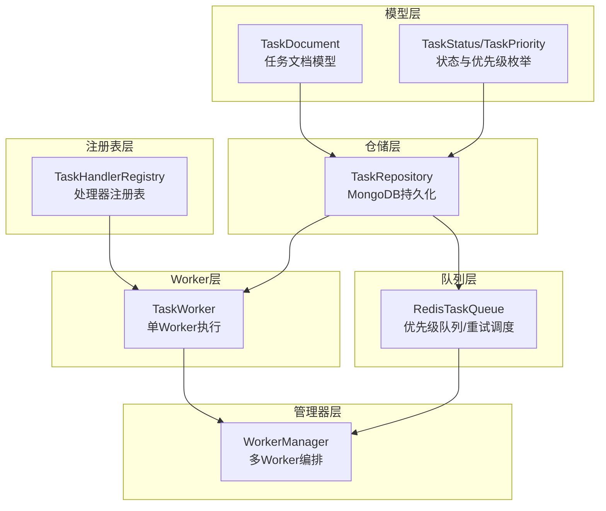
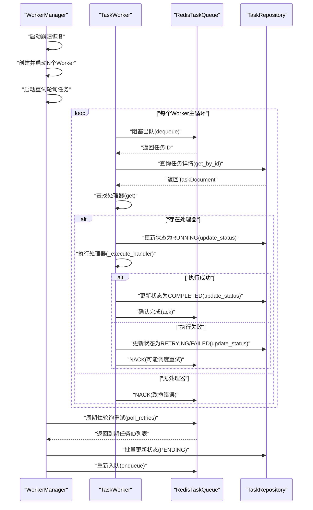
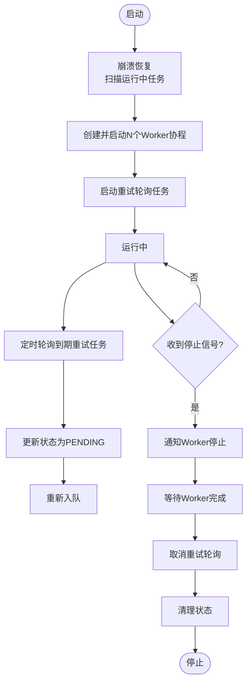
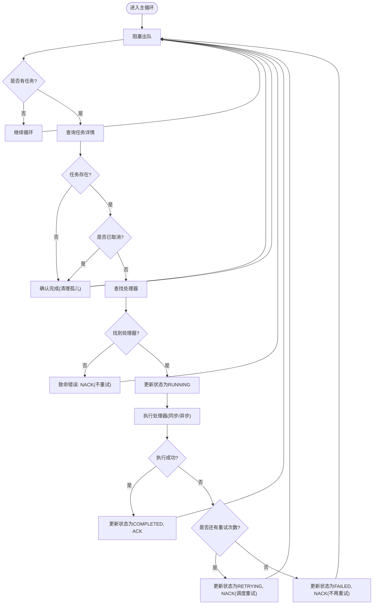
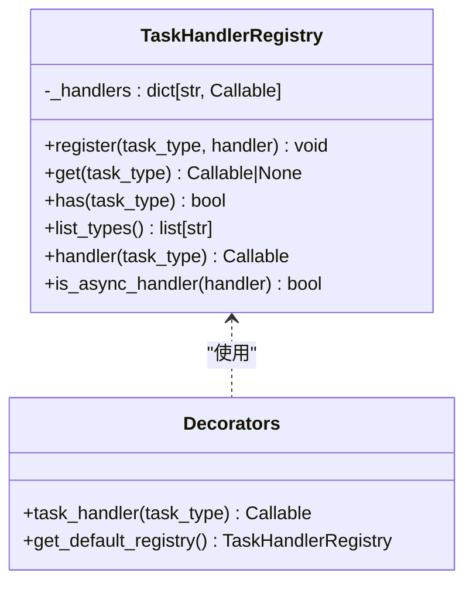
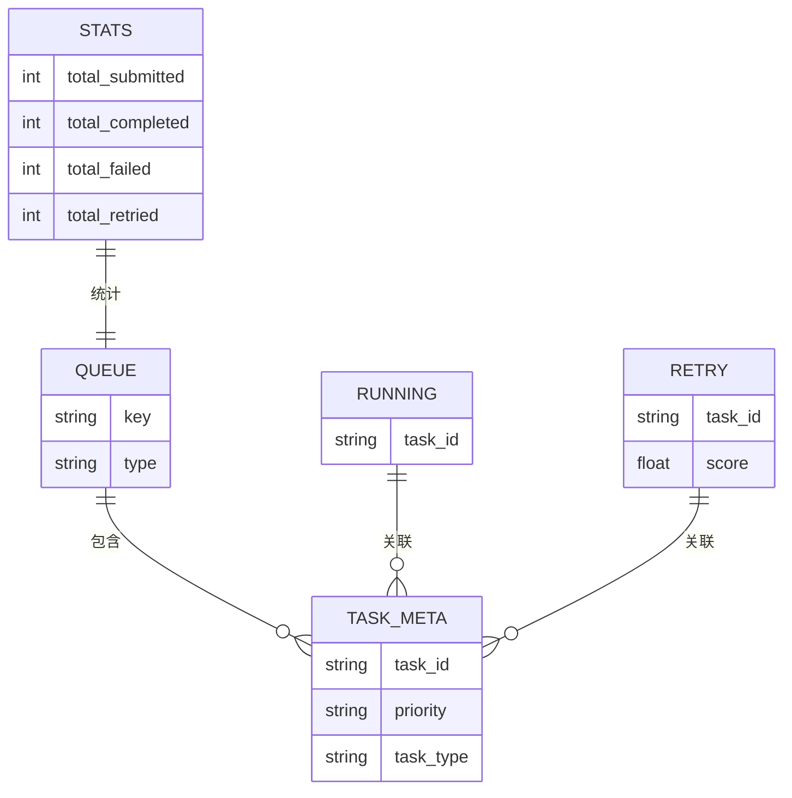
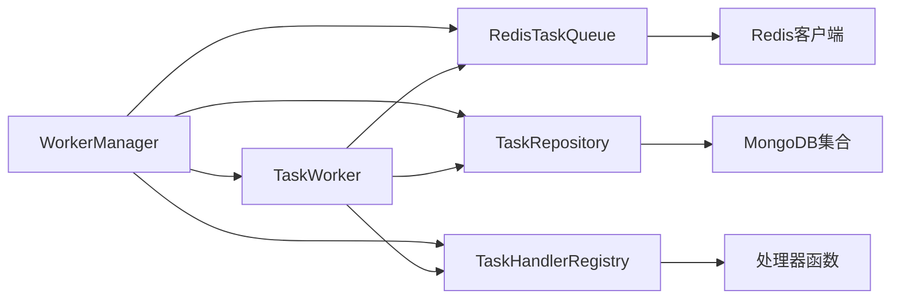

# Worker管理

<cite>
**本文引用的文件**
- [manager.py](file://tools/flexloop/src/taolib/testing/task_queue/worker/manager.py)
- [worker.py](file://tools/flexloop/src/taolib/testing/task_queue/worker/worker.py)
- [registry.py](file://tools/flexloop/src/taolib/testing/task_queue/worker/registry.py)
- [redis_queue.py](file://tools/flexloop/src/taolib/testing/task_queue/queue/redis_queue.py)
- [task_repo.py](file://tools/flexloop/src/taolib/testing/task_queue/repository/task_repo.py)
- [task.py](file://tools/flexloop/src/taolib/testing/task_queue/models/task.py)
- [enums.py](file://tools/flexloop/src/taolib/testing/task_queue/models/enums.py)
- [test_manager.py](file://tools/flexloop/tests/testing/test_task_queue/test_manager.py)
- [test_worker.py](file://tools/flexloop/tests/testing/test_task_queue/test_worker.py)
- [snapshot.ts](file://apps/DaoMind/packages/daoMonitor/src/snapshot.ts)
- [health.py](file://tools/flexloop/src/taolib/testing/email_service/server/api/health.py)
- [backpressure.ts](file://apps/DaoMind/packages/daoQi/src/backpressure.ts)
- [load-balancer.ts](file://apps/DaoMind/packages/daoNexus/src/load-balancer.ts)
</cite>

## 目录
1. [简介](#简介)
2. [项目结构](#项目结构)
3. [核心组件](#核心组件)
4. [架构总览](#架构总览)
5. [详细组件分析](#详细组件分析)
6. [依赖分析](#依赖分析)
7. [性能考虑](#性能考虑)
8. [故障排查指南](#故障排查指南)
9. [结论](#结论)
10. [附录](#附录)

## 简介
本文件面向Worker管理子系统，系统性阐述Worker管理器的设计原理与实现细节，涵盖以下主题：
- 工作进程生命周期：启动、停止、优雅停机与崩溃恢复
- 动态扩缩容与负载均衡策略：多Worker并发、优先级队列与重试轮询
- Worker注册表：任务处理器注册、发现与状态同步
- Worker工作模式：任务拉取、并发控制与资源限制
- 监控与诊断：性能指标、错误统计与健康检查
- 故障恢复、优雅停机与资源优化最佳实践
- 代码示例路径：如何配置Worker参数、实现自定义Worker处理器与管理Worker集群

## 项目结构
Worker管理子系统位于工具包flexloop的测试任务队列模块中，采用分层设计：
- 模型层：任务数据模型与枚举
- 队列层：基于Redis的优先级队列与重试调度
- 仓储层：MongoDB持久化与索引
- 注册表层：任务处理器注册与查找
- Worker层：单个Worker的拉取与执行
- 管理器层：多Worker编排、崩溃恢复与重试轮询

**图表来源**
- [task.py:68-104](file://tools/flexloop/src/taolib/testing/task_queue/models/task.py#L68-L104)
- [enums.py:9-27](file://tools/flexloop/src/taolib/testing/task_queue/models/enums.py#L9-L27)
- [redis_queue.py:14-29](file://tools/flexloop/src/taolib/testing/task_queue/queue/redis_queue.py#L14-L29)
- [task_repo.py:15-24](file://tools/flexloop/src/taolib/testing/task_queue/repository/task_repo.py#L15-L24)
- [registry.py:11-28](file://tools/flexloop/src/taolib/testing/task_queue/worker/registry.py#L11-L28)
- [worker.py:21-49](file://tools/flexloop/src/taolib/testing/task_queue/worker/worker.py#L21-L49)
- [manager.py:25-56](file://tools/flexloop/src/taolib/testing/task_queue/worker/manager.py#L25-L56)

**章节来源**
- [manager.py:1-225](file://tools/flexloop/src/taolib/testing/task_queue/worker/manager.py#L1-L225)
- [worker.py:1-275](file://tools/flexloop/src/taolib/testing/task_queue/worker/worker.py#L1-L275)
- [registry.py:1-136](file://tools/flexloop/src/taolib/testing/task_queue/worker/registry.py#L1-L136)
- [redis_queue.py:1-317](file://tools/flexloop/src/taolib/testing/task_queue/queue/redis_queue.py#L1-L317)
- [task_repo.py:1-169](file://tools/flexloop/src/taolib/testing/task_queue/repository/task_repo.py#L1-L169)
- [task.py:1-107](file://tools/flexloop/src/taolib/testing/task_queue/models/task.py#L1-L107)
- [enums.py:1-28](file://tools/flexloop/src/taolib/testing/task_queue/models/enums.py#L1-L28)

## 核心组件
- WorkerManager：多Worker编排、崩溃恢复与重试轮询
- TaskWorker：单Worker任务拉取、执行与重试
- TaskHandlerRegistry：任务处理器注册与查找
- RedisTaskQueue：优先级队列、重试调度与统计
- TaskRepository：任务状态持久化与索引
- TaskDocument/TaskStatus/TaskPriority：任务数据模型与状态枚举

**章节来源**
- [manager.py:25-136](file://tools/flexloop/src/taolib/testing/task_queue/worker/manager.py#L25-L136)
- [worker.py:21-275](file://tools/flexloop/src/taolib/testing/task_queue/worker/worker.py#L21-L275)
- [registry.py:11-136](file://tools/flexloop/src/taolib/testing/task_queue/worker/registry.py#L11-L136)
- [redis_queue.py:14-317](file://tools/flexloop/src/taolib/testing/task_queue/queue/redis_queue.py#L14-L317)
- [task_repo.py:15-169](file://tools/flexloop/src/taolib/testing/task_queue/repository/task_repo.py#L15-L169)
- [task.py:15-107](file://tools/flexloop/src/taolib/testing/task_queue/models/task.py#L15-L107)
- [enums.py:9-27](file://tools/flexloop/src/taolib/testing/task_queue/models/enums.py#L9-L27)

## 架构总览
Worker管理采用“管理器-多Worker-队列-仓储-注册表”的分层架构，通过Redis实现高吞吐的任务分发与重试调度，通过MongoDB实现任务状态的可靠持久化。

**图表来源**
- [manager.py:73-102](file://tools/flexloop/src/taolib/testing/task_queue/worker/manager.py#L73-L102)
- [manager.py:138-168](file://tools/flexloop/src/taolib/testing/task_queue/worker/manager.py#L138-L168)
- [manager.py:169-222](file://tools/flexloop/src/taolib/testing/task_queue/worker/manager.py#L169-L222)
- [worker.py:65-101](file://tools/flexloop/src/taolib/testing/task_queue/worker/worker.py#L65-L101)
- [worker.py:102-153](file://tools/flexloop/src/taolib/testing/task_queue/worker/worker.py#L102-L153)
- [worker.py:154-177](file://tools/flexloop/src/taolib/testing/task_queue/worker/worker.py#L154-L177)
- [worker.py:179-204](file://tools/flexloop/src/taolib/testing/task_queue/worker/worker.py#L179-L204)
- [worker.py:206-272](file://tools/flexloop/src/taolib/testing/task_queue/worker/worker.py#L206-L272)
- [redis_queue.py:81-103](file://tools/flexloop/src/taolib/testing/task_queue/queue/redis_queue.py#L81-L103)
- [redis_queue.py:158-194](file://tools/flexloop/src/taolib/testing/task_queue/queue/redis_queue.py#L158-L194)
- [task_repo.py:92-109](file://tools/flexloop/src/taolib/testing/task_queue/repository/task_repo.py#L92-L109)

## 详细组件分析

### WorkerManager：多Worker编排与崩溃恢复
- 启动流程：执行崩溃恢复、创建指定数量的Worker协程、启动重试轮询
- 崩溃恢复：扫描Redis运行中任务，识别超时或状态不一致的任务并重新入队
- 重试轮询：定时轮询到期的重试任务，更新状态并重新入队
- 停止流程：通知所有Worker停止、等待协程完成、取消重试轮询、清理状态

**图表来源**
- [manager.py:73-102](file://tools/flexloop/src/taolib/testing/task_queue/worker/manager.py#L73-L102)
- [manager.py:138-168](file://tools/flexloop/src/taolib/testing/task_queue/worker/manager.py#L138-L168)
- [manager.py:169-222](file://tools/flexloop/src/taolib/testing/task_queue/worker/manager.py#L169-L222)

**章节来源**
- [manager.py:73-136](file://tools/flexloop/src/taolib/testing/task_queue/worker/manager.py#L73-L136)
- [manager.py:138-222](file://tools/flexloop/src/taolib/testing/task_queue/worker/manager.py#L138-L222)
- [test_manager.py:98-252](file://tools/flexloop/tests/testing/test_task_queue/test_manager.py#L98-L252)

### TaskWorker：任务拉取、执行与重试
- 主循环：阻塞式出队、处理任务、异常捕获与退避
- 处理流程：查询任务、校验状态、查找处理器、更新状态、执行、成功/失败分支
- 重试策略：指数/线性延迟、最大重试次数、最终失败标记
- 并发控制：单协程逐个处理，避免竞争；可通过多Worker实现水平扩展

**图表来源**
- [worker.py:65-101](file://tools/flexloop/src/taolib/testing/task_queue/worker/worker.py#L65-L101)
- [worker.py:102-153](file://tools/flexloop/src/taolib/testing/task_queue/worker/worker.py#L102-L153)
- [worker.py:154-177](file://tools/flexloop/src/taolib/testing/task_queue/worker/worker.py#L154-L177)
- [worker.py:179-272](file://tools/flexloop/src/taolib/testing/task_queue/worker/worker.py#L179-L272)

**章节来源**
- [worker.py:65-275](file://tools/flexloop/src/taolib/testing/task_queue/worker/worker.py#L65-L275)
- [test_worker.py:82-229](file://tools/flexloop/tests/testing/test_task_queue/test_worker.py#L82-L229)

### TaskHandlerRegistry：任务处理器注册表
- 提供装饰器与显式注册两种方式
- 支持同步与异步处理器自动识别
- 提供默认注册表与模块级便捷装饰器

**图表来源**
- [registry.py:11-136](file://tools/flexloop/src/taolib/testing/task_queue/worker/registry.py#L11-L136)

**章节来源**
- [registry.py:11-136](file://tools/flexloop/src/taolib/testing/task_queue/worker/registry.py#L11-L136)

### RedisTaskQueue：优先级队列与重试调度
- 键空间设计：队列键、运行中集合、重试ZSET、统计哈希、任务元数据缓存
- 出队策略：BRPOP按优先级顺序消费
- 重试机制：ZSET按到期时间排序，轮询到期任务重新入队
- 统计接口：提供提交/完成/失败/重试/队列长度等指标

**图表来源**
- [redis_queue.py:14-29](file://tools/flexloop/src/taolib/testing/task_queue/queue/redis_queue.py#L14-L29)
- [redis_queue.py:158-194](file://tools/flexloop/src/taolib/testing/task_queue/queue/redis_queue.py#L158-L194)
- [redis_queue.py:226-271](file://tools/flexloop/src/taolib/testing/task_queue/queue/redis_queue.py#L226-L271)

**章节来源**
- [redis_queue.py:14-317](file://tools/flexloop/src/taolib/testing/task_queue/queue/redis_queue.py#L14-L317)

### TaskRepository：任务持久化与索引
- 基于AsyncRepository封装，提供常用CRUD与查询方法
- 索引策略：按task_type、(status,priority)复合索引、幂等键唯一索引、TTL过期
- 状态更新：统一update_status接口，支持原子更新

**章节来源**
- [task_repo.py:15-169](file://tools/flexloop/src/taolib/testing/task_queue/repository/task_repo.py#L15-L169)

### 任务模型与状态枚举
- TaskDocument：包含状态、重试计数、结果、错误信息、时间戳等字段
- TaskStatus：pending/running/completed/failed/retrying/cancelled
- TaskPriority：high/normal/low

**章节来源**
- [task.py:68-107](file://tools/flexloop/src/taolib/testing/task_queue/models/task.py#L68-L107)
- [enums.py:9-27](file://tools/flexloop/src/taolib/testing/task_queue/models/enums.py#L9-L27)

## 依赖分析
- 组件耦合：WorkerManager依赖TaskWorker、RedisTaskQueue、TaskRepository、TaskHandlerRegistry；TaskWorker依赖RedisTaskQueue、TaskRepository、TaskHandlerRegistry；RedisTaskQueue与TaskRepository分别依赖外部存储
- 外部依赖：Redis异步客户端、MongoDB Motor集合
- 循环依赖：无直接循环，通过接口解耦

**图表来源**
- [manager.py:34-56](file://tools/flexloop/src/taolib/testing/task_queue/worker/manager.py#L34-L56)
- [worker.py:28-49](file://tools/flexloop/src/taolib/testing/task_queue/worker/worker.py#L28-L49)
- [redis_queue.py:31-44](file://tools/flexloop/src/taolib/testing/task_queue/queue/redis_queue.py#L31-L44)
- [task_repo.py:18-24](file://tools/flexloop/src/taolib/testing/task_queue/repository/task_repo.py#L18-L24)

**章节来源**
- [manager.py:34-56](file://tools/flexloop/src/taolib/testing/task_queue/worker/manager.py#L34-L56)
- [worker.py:28-49](file://tools/flexloop/src/taolib/testing/task_queue/worker/worker.py#L28-L49)
- [redis_queue.py:31-44](file://tools/flexloop/src/taolib/testing/task_queue/queue/redis_queue.py#L31-L44)
- [task_repo.py:18-24](file://tools/flexloop/src/taolib/testing/task_queue/repository/task_repo.py#L18-L24)

## 性能考虑
- 队列与并发
  - 优先级队列：高/普通/低三档，确保关键任务优先处理
  - 多Worker：通过增加Worker数量提升吞吐，注意CPU与IO瓶颈
  - 阻塞出队：减少空转与上下文切换开销
- 重试与退避
  - 指数/线性退避：降低对下游系统的冲击
  - 最大重试次数：避免无限重试导致资源耗尽
- 存储与索引
  - MongoDB复合索引：加速按状态与优先级查询
  - TTL索引：自动清理历史任务，控制集合增长
- 资源限制
  - 单Worker串行处理，避免共享资源竞争
  - 背压与限流：结合上游流量控制，防止雪崩

[本节为通用性能建议，无需特定文件来源]

## 故障排查指南
- 健康检查
  - 数据库与Redis连通性检查，队列长度与状态统计
- 监控与诊断
  - 快照聚合器：采集热力图、向量场、仪表盘、告警与诊断，计算系统健康度
  - 背压控制：节点级速率限制与采样窗口，避免过载
- 常见问题定位
  - Worker无法拉取任务：检查Redis队列键空间与BRPOP阻塞
  - 处理器缺失：确认注册表是否正确注册任务类型
  - 重试堆积：查看重试ZSET与poll_retries轮询频率
  - 崩溃恢复：核对运行中集合与超时阈值，确保孤儿任务清理

**章节来源**
- [health.py:8-56](file://tools/flexloop/src/taolib/testing/email_service/server/api/health.py#L8-L56)
- [snapshot.ts:10-75](file://apps/DaoMind/packages/daoMonitor/src/snapshot.ts#L10-L75)
- [backpressure.ts:24-68](file://apps/DaoMind/packages/daoQi/src/backpressure.ts#L24-L68)

## 结论
Worker管理子系统通过清晰的分层设计与可靠的队列/仓储实现，提供了高可用的任务执行框架。管理器负责编排与恢复，Worker专注任务拉取与执行，注册表提供灵活的处理器扩展，Redis与MongoDB分别承担高吞吐与强一致性的职责。配合健康检查、监控诊断与背压控制，可满足生产环境的稳定性与可观测性需求。

[本节为总结性内容，无需特定文件来源]

## 附录

### 配置与使用示例（代码路径）
- 启动WorkerManager
  - 示例路径：[manager.py:73-102](file://tools/flexloop/src/taolib/testing/task_queue/worker/manager.py#L73-L102)
- 自定义任务处理器
  - 注册装饰器：[registry.py:69-89](file://tools/flexloop/src/taolib/testing/task_queue/worker/registry.py#L69-L89)
  - 模块级便捷装饰器：[registry.py:108-124](file://tools/flexloop/src/taolib/testing/task_queue/worker/registry.py#L108-L124)
- 任务模型与状态
  - 任务文档模型：[task.py:68-107](file://tools/flexloop/src/taolib/testing/task_queue/models/task.py#L68-L107)
  - 状态与优先级枚举：[enums.py:9-27](file://tools/flexloop/src/taolib/testing/task_queue/models/enums.py#L9-L27)
- 队列与仓储接口
  - Redis队列接口：[redis_queue.py:58-103](file://tools/flexloop/src/taolib/testing/task_queue/queue/redis_queue.py#L58-L103)
  - 重试轮询与统计：[redis_queue.py:158-271](file://tools/flexloop/src/taolib/testing/task_queue/queue/redis_queue.py#L158-L271)
  - 任务仓储接口：[task_repo.py:92-109](file://tools/flexloop/src/taolib/testing/task_queue/repository/task_repo.py#L92-L109)
- 监控与健康检查
  - 快照聚合器：[snapshot.ts:22-59](file://apps/DaoMind/packages/daoMonitor/src/snapshot.ts#L22-L59)
  - 健康检查端点：[health.py:8-56](file://tools/flexloop/src/taolib/testing/email_service/server/api/health.py#L8-L56)
- 负载均衡参考
  - 基于最少连接的负载均衡：[load-balancer.ts:42-54](file://apps/DaoMind/packages/daoNexus/src/load-balancer.ts#L42-L54)
  - 背压与限流：[backpressure.ts:24-68](file://apps/DaoMind/packages/daoQi/src/backpressure.ts#L24-L68)

### 最佳实践清单
- 启动与停止
  - 使用WorkerManager统一启动/停止，确保优雅停机
  - 停止前等待所有Worker完成当前任务
- 动态扩缩容
  - 根据队列长度与CPU利用率调整Worker数量
  - 结合负载均衡策略分配任务
- 重试与退避
  - 合理设置最大重试次数与退避间隔
  - 对幂等任务使用幂等键避免重复执行
- 监控与诊断
  - 定期检查队列统计与运行中任务
  - 使用快照聚合器与健康检查端点进行系统健康评估
- 故障恢复
  - 启动时执行崩溃恢复，清理孤儿任务
  - 监控重试堆积，必要时人工干预

[本节为实践建议，无需特定文件来源]