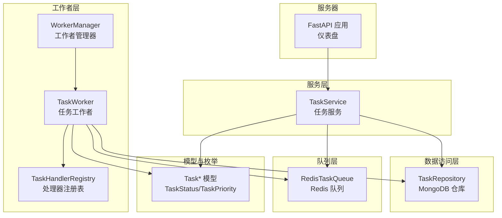
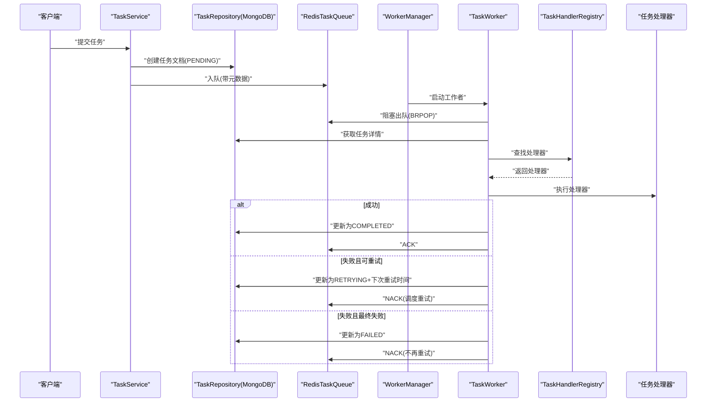
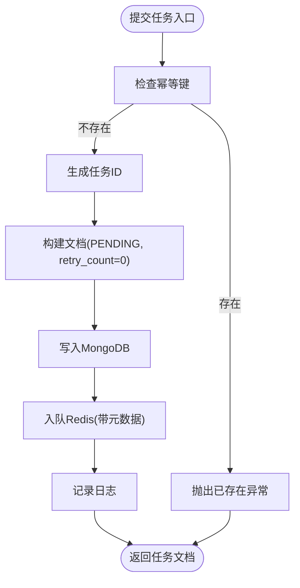
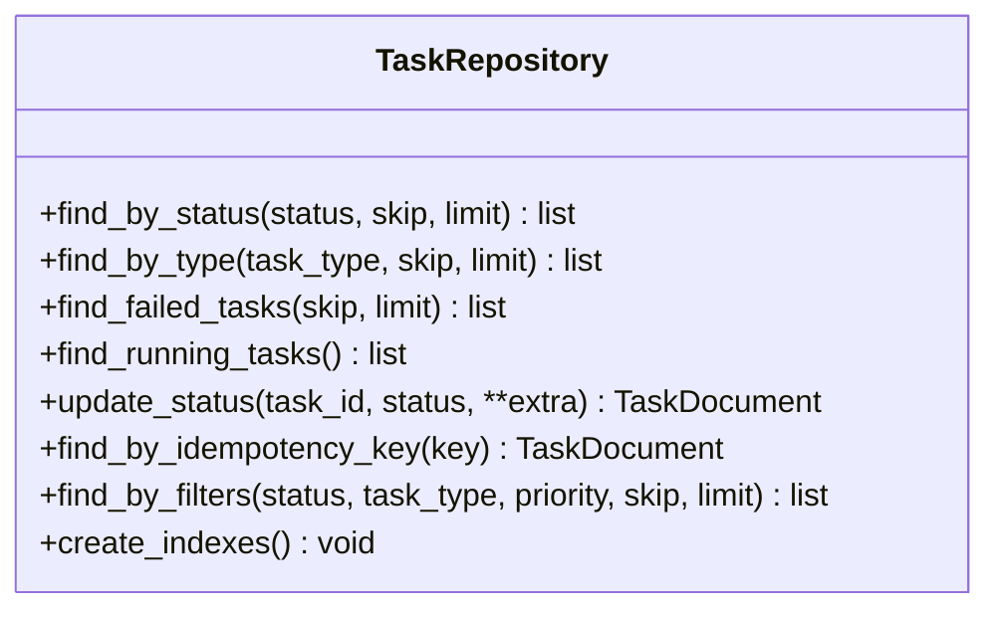
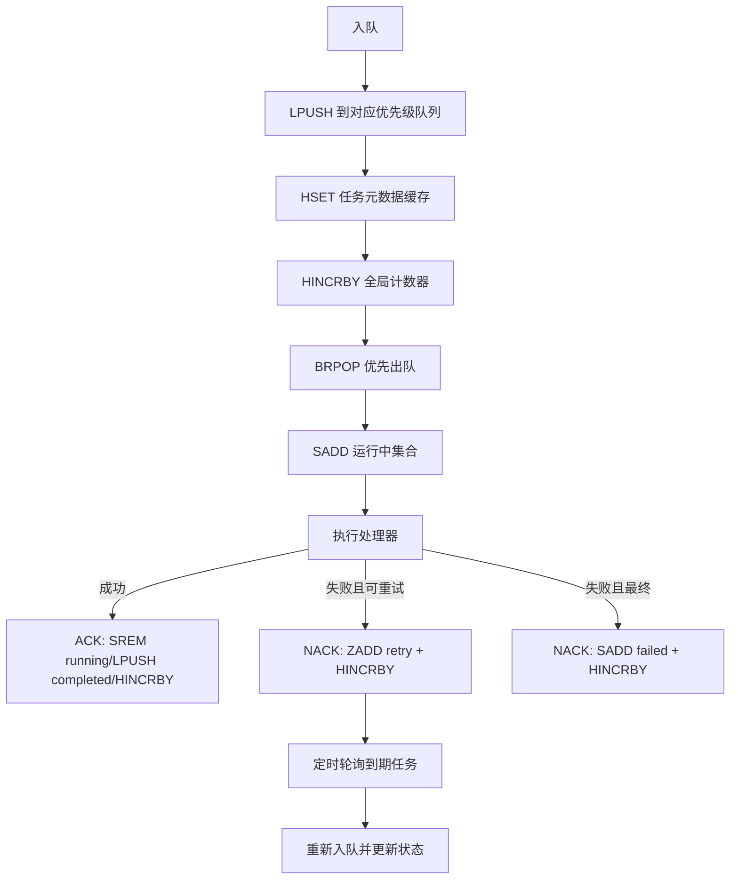
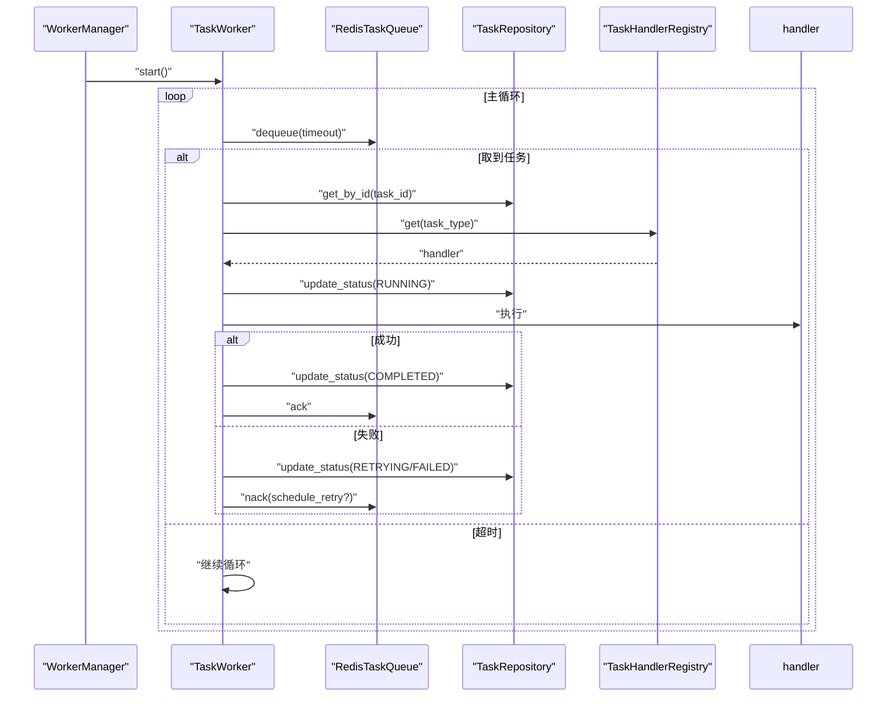
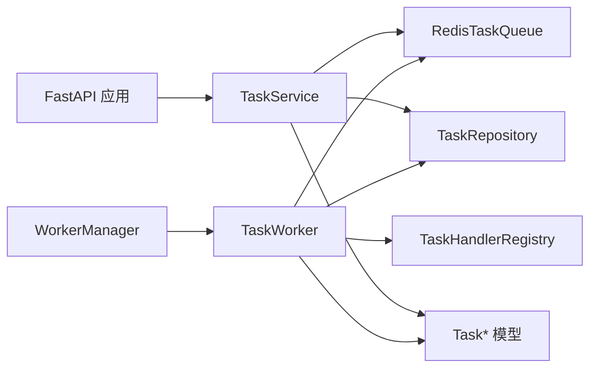

# 任务服务管理

<cite>
**本文引用的文件**
- [task_service.py](file://tools/flexloop/src/taolib/testing/task_queue/services/task_service.py)
- [task_repo.py](file://tools/flexloop/src/taolib/testing/task_queue/repository/task_repo.py)
- [redis_queue.py](file://tools/flexloop/src/taolib/testing/task_queue/queue/redis_queue.py)
- [worker.py](file://tools/flexloop/src/taolib/testing/task_queue/worker/worker.py)
- [manager.py](file://tools/flexloop/src/taolib/testing/task_queue/worker/manager.py)
- [registry.py](file://tools/flexloop/src/taolib/testing/task_queue/worker/registry.py)
- [enums.py](file://tools/flexloop/src/taolib/testing/task_queue/models/enums.py)
- [task.py](file://tools/flexloop/src/taolib/testing/task_queue/models/task.py)
- [errors.py](file://tools/flexloop/src/taolib/testing/task_queue/errors.py)
- [app.py](file://tools/flexloop/src/taolib/testing/task_queue/server/app.py)
- [test_service.py](file://tools/flexloop/tests/testing/test_task_queue/test_service.py)
- [test_worker.py](file://tools/flexloop/tests/testing/test_task_queue/test_worker.py)
</cite>

## 目录
1. [简介](#简介)
2. [项目结构](#项目结构)
3. [核心组件](#核心组件)
4. [架构总览](#架构总览)
5. [详细组件分析](#详细组件分析)
6. [依赖分析](#依赖分析)
7. [性能考虑](#性能考虑)
8. [故障排查指南](#故障排查指南)
9. [结论](#结论)
10. [附录](#附录)

## 简介
本文件面向任务服务管理，系统性阐述任务队列的生命周期管理、数据访问与缓存策略、事件与异步处理、统计与监控、以及错误处理与调试方法。内容覆盖从任务提交、状态流转、重试调度到可视化监控仪表盘的全链路设计，并提供可直接定位到源码路径的参考，便于开发者快速上手与扩展。

## 项目结构
任务服务位于 flexloop 工作区的 taolib/testing/task_queue 子模块，采用分层架构：
- 服务层：封装业务逻辑（提交、查询、重试、取消、统计）
- 数据访问层：MongoDB 持久化与索引
- 队列层：Redis 实现的优先级队列与重试调度
- 工作者层：任务拉取、处理器执行、状态回写
- 注册表：任务类型到处理器的映射
- 模型与枚举：Pydantic 模型与状态/优先级枚举
- 服务器：FastAPI 应用与监控仪表盘

图表来源
- [task_service.py:1-259](file://tools/flexloop/src/taolib/testing/task_queue/services/task_service.py#L1-L259)
- [task_repo.py:1-169](file://tools/flexloop/src/taolib/testing/task_queue/repository/task_repo.py#L1-L169)
- [redis_queue.py:1-317](file://tools/flexloop/src/taolib/testing/task_queue/queue/redis_queue.py#L1-L317)
- [worker.py:1-275](file://tools/flexloop/src/taolib/testing/task_queue/worker/worker.py#L1-L275)
- [manager.py:1-225](file://tools/flexloop/src/taolib/testing/task_queue/worker/manager.py#L1-L225)
- [registry.py:1-136](file://tools/flexloop/src/taolib/testing/task_queue/worker/registry.py#L1-L136)
- [task.py:1-107](file://tools/flexloop/src/taolib/testing/task_queue/models/task.py#L1-L107)
- [enums.py:1-28](file://tools/flexloop/src/taolib/testing/task_queue/models/enums.py#L1-L28)
- [app.py:1-394](file://tools/flexloop/src/taolib/testing/task_queue/server/app.py#L1-L394)

章节来源
- [task_service.py:1-259](file://tools/flexloop/src/taolib/testing/task_queue/services/task_service.py#L1-L259)
- [task_repo.py:1-169](file://tools/flexloop/src/taolib/testing/task_queue/repository/task_repo.py#L1-L169)
- [redis_queue.py:1-317](file://tools/flexloop/src/taolib/testing/task_queue/queue/redis_queue.py#L1-L317)
- [worker.py:1-275](file://tools/flexloop/src/taolib/testing/task_queue/worker/worker.py#L1-L275)
- [manager.py:1-225](file://tools/flexloop/src/taolib/testing/task_queue/worker/manager.py#L1-L225)
- [registry.py:1-136](file://tools/flexloop/src/taolib/testing/task_queue/worker/registry.py#L1-L136)
- [task.py:1-107](file://tools/flexloop/src/taolib/testing/task_queue/models/task.py#L1-L107)
- [enums.py:1-28](file://tools/flexloop/src/taolib/testing/task_queue/models/enums.py#L1-L28)
- [app.py:1-394](file://tools/flexloop/src/taolib/testing/task_queue/server/app.py#L1-L394)

## 核心组件
- 任务服务（TaskService）：负责任务提交、查询、重试、取消、列表筛选与统计聚合
- 任务仓库（TaskRepository）：基于 Motor 的异步 MongoDB 访问，提供多条件查询与索引
- Redis 队列（RedisTaskQueue）：基于 Redis List/Set/ZSet 的优先级队列与重试调度
- 任务工作者（TaskWorker）：从队列拉取任务、查找处理器、执行并回写状态
- 工作者管理器（WorkerManager）：编排多个工作者、重试轮询与崩溃恢复
- 处理器注册表（TaskHandlerRegistry）：装饰器式注册与查找任务处理器
- 模型与枚举：TaskCreate/TaskResponse/TaskDocument 与 TaskStatus/TaskPriority
- 服务器（FastAPI）：提供 REST API 与监控仪表盘

章节来源
- [task_service.py:23-259](file://tools/flexloop/src/taolib/testing/task_queue/services/task_service.py#L23-L259)
- [task_repo.py:15-169](file://tools/flexloop/src/taolib/testing/task_queue/repository/task_repo.py#L15-L169)
- [redis_queue.py:14-317](file://tools/flexloop/src/taolib/testing/task_queue/queue/redis_queue.py#L14-L317)
- [worker.py:21-275](file://tools/flexloop/src/taolib/testing/task_queue/worker/worker.py#L21-L275)
- [manager.py:25-225](file://tools/flexloop/src/taolib/testing/task_queue/worker/manager.py#L25-L225)
- [registry.py:11-136](file://tools/flexloop/src/taolib/testing/task_queue/worker/registry.py#L11-L136)
- [task.py:15-107](file://tools/flexloop/src/taolib/testing/task_queue/models/task.py#L15-L107)
- [enums.py:9-28](file://tools/flexloop/src/taolib/testing/task_queue/models/enums.py#L9-L28)
- [app.py:19-97](file://tools/flexloop/src/taolib/testing/task_queue/server/app.py#L19-L97)

## 架构总览
任务从提交到执行的端到端流程如下：

图表来源
- [task_service.py:43-94](file://tools/flexloop/src/taolib/testing/task_queue/services/task_service.py#L43-L94)
- [redis_queue.py:58-157](file://tools/flexloop/src/taolib/testing/task_queue/queue/redis_queue.py#L58-L157)
- [worker.py:102-273](file://tools/flexloop/src/taolib/testing/task_queue/worker/worker.py#L102-L273)
- [manager.py:138-223](file://tools/flexloop/src/taolib/testing/task_queue/worker/manager.py#L138-L223)

## 详细组件分析

### 任务服务（TaskService）
- 职责：任务提交、查询、重试、取消、列表筛选、统计聚合
- 关键点：
  - 幂等键去重：通过 idempotency_key 避免重复提交
  - 状态初始化：创建时写入 MongoDB 并设置 PENDING
  - 元数据缓存：入队时将 task_type/priority/status 写入 Redis Hash
  - 统计合并：Redis 实时统计 + MongoDB 状态计数
- API 参考路径：
  - 提交任务：[submit_task:43-94](file://tools/flexloop/src/taolib/testing/task_queue/services/task_service.py#L43-L94)
  - 查询任务：[get_task:96-111](file://tools/flexloop/src/taolib/testing/task_queue/services/task_service.py#L96-L111)
  - 手动重试：[retry_task:113-159](file://tools/flexloop/src/taolib/testing/task_queue/services/task_service.py#L113-L159)
  - 取消任务：[cancel_task:161-190](file://tools/flexloop/src/taolib/testing/task_queue/services/task_service.py#L161-L190)
  - 列表筛选：[list_tasks:192-218](file://tools/flexloop/src/taolib/testing/task_queue/services/task_service.py#L192-L218)
  - 统计接口：[get_stats:220-256](file://tools/flexloop/src/taolib/testing/task_queue/services/task_service.py#L220-L256)

图表来源
- [task_service.py:43-94](file://tools/flexloop/src/taolib/testing/task_queue/services/task_service.py#L43-L94)

章节来源
- [task_service.py:23-259](file://tools/flexloop/src/taolib/testing/task_queue/services/task_service.py#L23-L259)

### 任务仓库（TaskRepository）
- 职责：MongoDB 持久化与查询，维护索引
- 关键点：
  - 多条件查询：按状态、类型、优先级组合过滤
  - 索引策略：task_type、(status,priority)复合索引、幂等键唯一稀疏索引、TTL
  - 状态更新：原子更新任务状态与额外字段
- 仓库方法参考路径：
  - 按状态查询：[find_by_status:26-47](file://tools/flexloop/src/taolib/testing/task_queue/repository/task_repo.py#L26-L47)
  - 按类型查询：[find_by_type:49-70](file://tools/flexloop/src/taolib/testing/task_queue/repository/task_repo.py#L49-L70)
  - 更新状态：[update_status:92-109](file://tools/flexloop/src/taolib/testing/task_queue/repository/task_repo.py#L92-L109)
  - 幂等键查询：[find_by_idempotency_key:111-123](file://tools/flexloop/src/taolib/testing/task_queue/repository/task_repo.py#L111-L123)
  - 复合过滤：[find_by_filters:125-157](file://tools/flexloop/src/taolib/testing/task_queue/repository/task_repo.py#L125-L157)
  - 创建索引：[create_indexes:159-166](file://tools/flexloop/src/taolib/testing/task_queue/repository/task_repo.py#L159-L166)

图表来源
- [task_repo.py:15-169](file://tools/flexloop/src/taolib/testing/task_queue/repository/task_repo.py#L15-L169)

章节来源
- [task_repo.py:1-169](file://tools/flexloop/src/taolib/testing/task_queue/repository/task_repo.py#L1-L169)

### Redis 任务队列（RedisTaskQueue）
- 职责：优先级队列、重试调度、运行中跟踪、统计计数
- 关键点：
  - 键空间设计：queue:*、running、failed、retry、task:{id}、stats
  - 入队/出队：使用 LPUSH + BRPOP，按优先级顺序消费
  - ACK/NACK：成功/失败处理，失败时可选择重试或永久失败
  - 重试轮询：ZSET 按时间戳调度，周期性轮询到期任务重新入队
  - 统计聚合：一次性 pipeline 获取多指标
- 队列方法参考路径：
  - 入队：[enqueue:58-80](file://tools/flexloop/src/taolib/testing/task_queue/queue/redis_queue.py#L58-L80)
  - 出队：[dequeue:81-103](file://tools/flexloop/src/taolib/testing/task_queue/queue/redis_queue.py#L81-L103)
  - 确认完成：[ack:105-124](file://tools/flexloop/src/taolib/testing/task_queue/queue/redis_queue.py#L105-L124)
  - 标记失败：[nack:126-156](file://tools/flexloop/src/taolib/testing/task_queue/queue/redis_queue.py#L126-L156)
  - 重试轮询：[poll_retries:158-194](file://tools/flexloop/src/taolib/testing/task_queue/queue/redis_queue.py#L158-L194)
  - 统计接口：[get_stats:226-271](file://tools/flexloop/src/taolib/testing/task_queue/queue/redis_queue.py#L226-L271)

图表来源
- [redis_queue.py:58-194](file://tools/flexloop/src/taolib/testing/task_queue/queue/redis_queue.py#L58-L194)

章节来源
- [redis_queue.py:1-317](file://tools/flexloop/src/taolib/testing/task_queue/queue/redis_queue.py#L1-L317)

### 任务工作者与管理器（TaskWorker/WorkerManager）
- 职责：从队列拉取任务、执行处理器、状态回写、崩溃恢复与重试轮询
- 关键点：
  - 工作者：阻塞出队、查找处理器、异步/同步执行、成功/失败分支
  - 管理器：启动/停止工作者、重试轮询、崩溃恢复（孤儿任务检测）
- 参考路径：
  - 工作者处理流程：[TaskWorker._process_task:102-153](file://tools/flexloop/src/taolib/testing/task_queue/worker/worker.py#L102-L153)
  - 成功/失败处理：[TaskWorker._handle_success/_handle_failure:179-273](file://tools/flexloop/src/taolib/testing/task_queue/worker/worker.py#L179-L273)
  - 管理器启动/停止：[WorkerManager.start/stop:73-136](file://tools/flexloop/src/taolib/testing/task_queue/worker/manager.py#L73-L136)
  - 重试轮询与恢复：[WorkerManager._retry_poll_loop/_recover_running_tasks:138-223](file://tools/flexloop/src/taolib/testing/task_queue/worker/manager.py#L138-L223)

图表来源
- [worker.py:79-153](file://tools/flexloop/src/taolib/testing/task_queue/worker/worker.py#L79-L153)
- [manager.py:138-168](file://tools/flexloop/src/taolib/testing/task_queue/worker/manager.py#L138-L168)

章节来源
- [worker.py:1-275](file://tools/flexloop/src/taolib/testing/task_queue/worker/worker.py#L1-L275)
- [manager.py:1-225](file://tools/flexloop/src/taolib/testing/task_queue/worker/manager.py#L1-L225)

### 处理器注册表（TaskHandlerRegistry）
- 职责：装饰器式注册任务处理器，支持同步/异步处理器识别
- 参考路径：
  - 注册/查找：[register/get:30-48](file://tools/flexloop/src/taolib/testing/task_queue/worker/registry.py#L30-L48)
  - 装饰器注册：[handler:69-89](file://tools/flexloop/src/taolib/testing/task_queue/worker/registry.py#L69-L89)
  - 默认注册表：[get_default_registry:127-133](file://tools/flexloop/src/taolib/testing/task_queue/worker/registry.py#L127-L133)

章节来源
- [registry.py:1-136](file://tools/flexloop/src/taolib/testing/task_queue/worker/registry.py#L1-L136)

### 模型与枚举（Task/Enums）
- 模型层次：Base → Create/Update → Response → Document（Pydantic）
- 关键字段：任务类型、参数、优先级、重试策略、幂等键、标签、状态与时间戳
- 枚举：TaskStatus（PENDING/RUNNING/COMPLETED/FAILED/RETRYING/CANCELLED）、TaskPriority（HIGH/NORMAL/LOW）

章节来源
- [task.py:15-107](file://tools/flexloop/src/taolib/testing/task_queue/models/task.py#L15-L107)
- [enums.py:9-28](file://tools/flexloop/src/taolib/testing/task_queue/models/enums.py#L9-L28)

### 服务器与监控（FastAPI 应用）
- 生命周期：启动时初始化 MongoDB/Redis、创建索引、启动工作者；关闭时优雅停止
- API：提供任务查询、重试、统计等接口
- 仪表盘：前端页面展示队列深度、运行/失败任务、任务详情弹窗与自动刷新

章节来源
- [app.py:19-97](file://tools/flexloop/src/taolib/testing/task_queue/server/app.py#L19-L97)
- [app.py:100-394](file://tools/flexloop/src/taolib/testing/task_queue/server/app.py#L100-L394)

## 依赖分析
- 服务层依赖仓库与队列，不直接依赖工作者
- 工作者依赖队列、仓库与注册表，执行处理器
- 管理器编排工作者、重试轮询与崩溃恢复
- 模型与枚举被服务、仓库、队列、工作者共享

图表来源
- [task_service.py:29-42](file://tools/flexloop/src/taolib/testing/task_queue/services/task_service.py#L29-L42)
- [worker.py:28-47](file://tools/flexloop/src/taolib/testing/task_queue/worker/worker.py#L28-L47)
- [manager.py:34-56](file://tools/flexloop/src/taolib/testing/task_queue/worker/manager.py#L34-L56)
- [task.py:15-107](file://tools/flexloop/src/taolib/testing/task_queue/models/task.py#L15-L107)

章节来源
- [task_service.py:23-42](file://tools/flexloop/src/taolib/testing/task_queue/services/task_service.py#L23-L42)
- [worker.py:21-47](file://tools/flexloop/src/taolib/testing/task_queue/worker/worker.py#L21-L47)
- [manager.py:25-56](file://tools/flexloop/src/taolib/testing/task_queue/worker/manager.py#L25-L56)
- [task.py:15-107](file://tools/flexloop/src/taolib/testing/task_queue/models/task.py#L15-L107)

## 性能考虑
- Redis 事务批处理：入队/出队/ACK/NACK 使用 pipeline transaction，减少网络往返
- 优先级消费：高→普通→低顺序 BRPOP，确保高优任务及时响应
- 元数据缓存：任务元数据存储于 Redis Hash，避免每次从 MongoDB 读取
- 索引优化：针对高频查询字段建立索引，降低 MongoDB 查询成本
- 重试调度：使用 ZSET 按时间戳调度，避免轮询风暴
- 统计聚合：一次性 pipeline 获取多指标，降低统计接口延迟

## 故障排查指南
- 常见异常：
  - 任务不存在：[TaskNotFoundError:13-16](file://tools/flexloop/src/taolib/testing/task_queue/errors.py#L13-L16)
  - 幂等键冲突：[TaskAlreadyExistsError:19-22](file://tools/flexloop/src/taolib/testing/task_queue/errors.py#L19-L22)
  - 处理器未注册：[TaskHandlerNotFoundError:25-28](file://tools/flexloop/src/taolib/testing/task_queue/errors.py#L25-L28)
  - 连接异常：[TaskQueueConnectionError:37-40](file://tools/flexloop/src/taolib/testing/task_queue/errors.py#L37-L40)
- 日志记录：
  - 服务层：提交/重试/取消等关键动作记录 INFO/ERROR
  - 工作者：异常捕获与重试日志，失败堆栈记录
- 调试建议：
  - 使用仪表盘查看队列深度与运行/失败任务
  - 通过 API 查询任务详情与统计
  - 检查 Redis 键空间与统计数据一致性
  - 观察工作者日志定位处理器执行问题

章节来源
- [errors.py:1-49](file://tools/flexloop/src/taolib/testing/task_queue/errors.py#L1-L49)
- [worker.py:96-100](file://tools/flexloop/src/taolib/testing/task_queue/worker/worker.py#L96-L100)
- [app.py:264-394](file://tools/flexloop/src/taolib/testing/task_queue/server/app.py#L264-L394)

## 结论
该任务服务以“服务层 + 仓库 + 队列 + 工作者”的清晰分层实现，结合 Redis 的高性能队列与统计能力，以及 MongoDB 的持久化与索引优化，形成稳定可靠的后台任务处理体系。配套的仪表盘与完善的异常/日志机制，使得运维与开发调试更加高效。

## 附录

### API 使用示例（路径参考）
- 提交任务
  - [submit_task:43-94](file://tools/flexloop/src/taolib/testing/task_queue/services/task_service.py#L43-L94)
- 查询任务
  - [get_task:96-111](file://tools/flexloop/src/taolib/testing/task_queue/services/task_service.py#L96-L111)
- 手动重试
  - [retry_task:113-159](file://tools/flexloop/src/taolib/testing/task_queue/services/task_service.py#L113-L159)
- 取消任务
  - [cancel_task:161-190](file://tools/flexloop/src/taolib/testing/task_queue/services/task_service.py#L161-L190)
- 列表筛选
  - [list_tasks:192-218](file://tools/flexloop/src/taolib/testing/task_queue/services/task_service.py#L192-L218)
- 统计接口
  - [get_stats:220-256](file://tools/flexloop/src/taolib/testing/task_queue/services/task_service.py#L220-L256)

### 自定义任务处理器（路径参考）
- 注册处理器
  - [TaskHandlerRegistry.handler:69-89](file://tools/flexloop/src/taolib/testing/task_queue/worker/registry.py#L69-L89)
  - [默认注册表装饰器:108-124](file://tools/flexloop/src/taolib/testing/task_queue/worker/registry.py#L108-L124)
- 处理器执行
  - [TaskWorker._execute_handler:154-177](file://tools/flexloop/src/taolib/testing/task_queue/worker/worker.py#L154-L177)

### 监控与告警配置（路径参考）
- 仪表盘页面
  - [dashboard HTML:100-394](file://tools/flexloop/src/taolib/testing/task_queue/server/app.py#L100-L394)
- 统计接口
  - [get_stats:220-256](file://tools/flexloop/src/taolib/testing/task_queue/services/task_service.py#L220-L256)
- Redis 统计
  - [get_stats:226-271](file://tools/flexloop/src/taolib/testing/task_queue/queue/redis_queue.py#L226-L271)

### 测试用例（路径参考）
- 服务层测试
  - [test_submit_*:81-136](file://tools/flexloop/tests/testing/test_task_queue/test_service.py#L81-L136)
  - [test_cancel_*:263-294](file://tools/flexloop/tests/testing/test_task_queue/test_service.py#L263-L294)
- 工作者测试
  - [test_worker._run_loop:467-493](file://tools/flexloop/tests/testing/test_task_queue/test_worker.py#L467-L493)