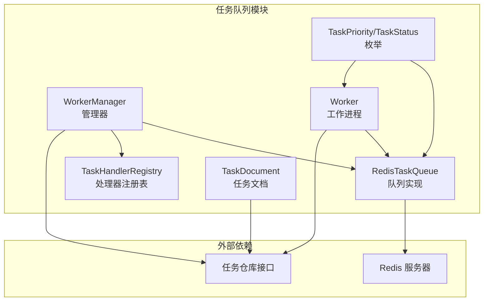
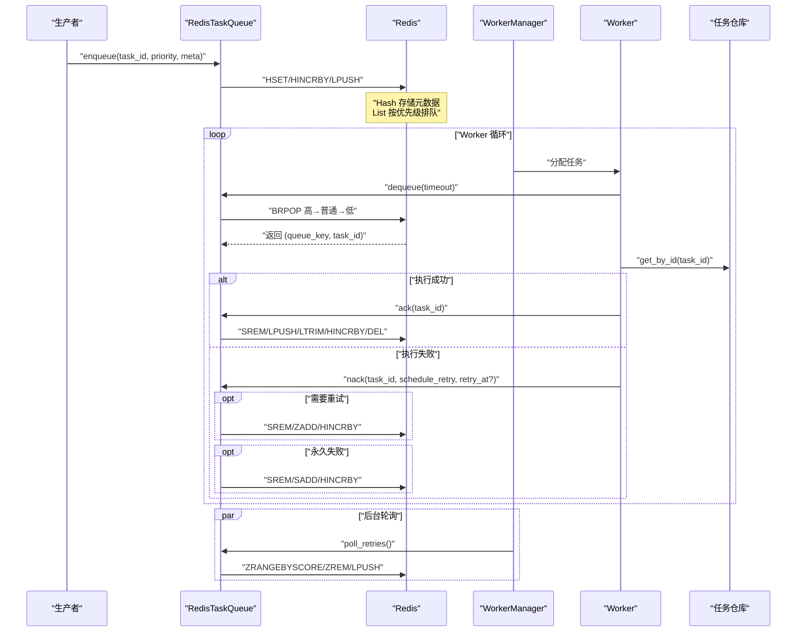
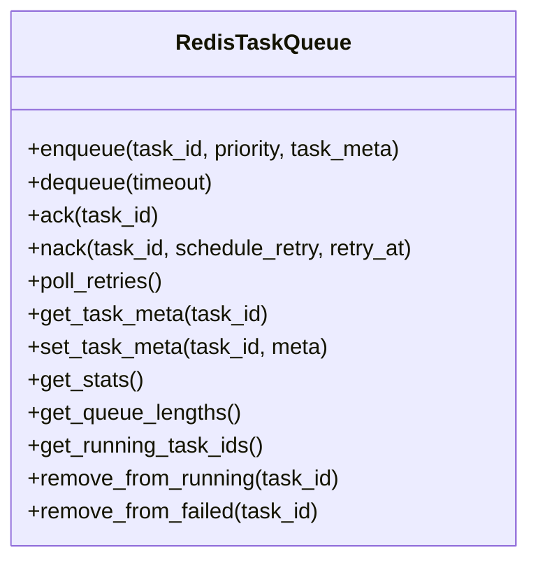
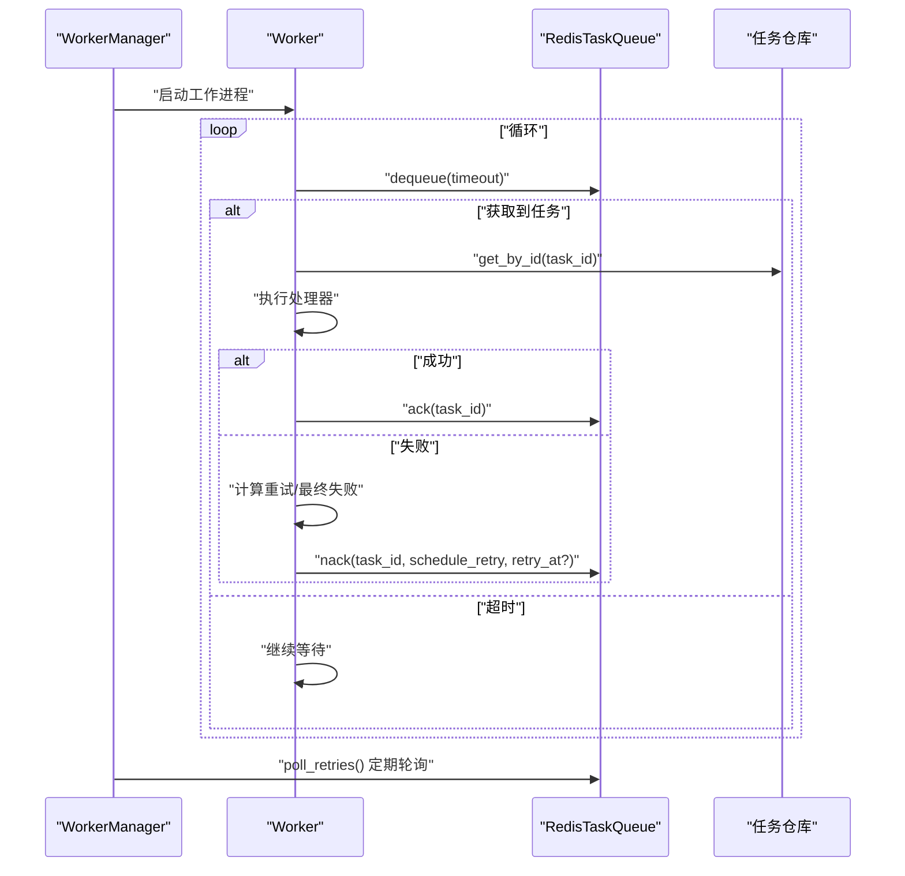
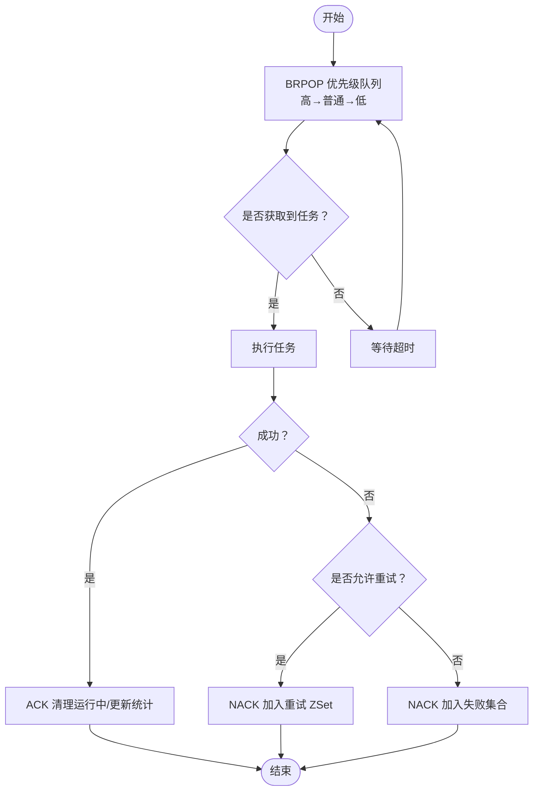
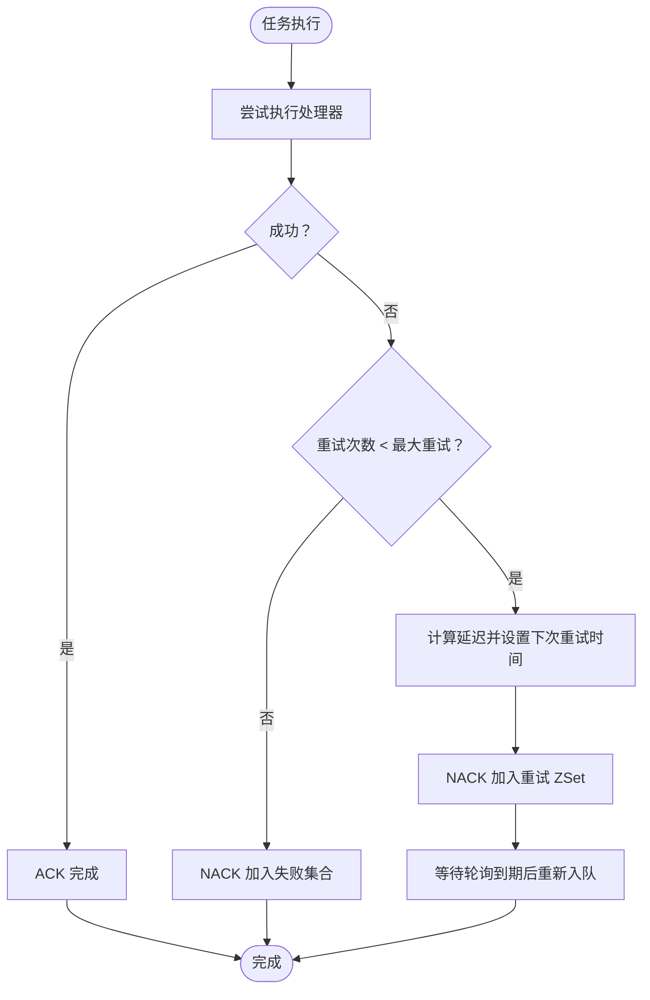
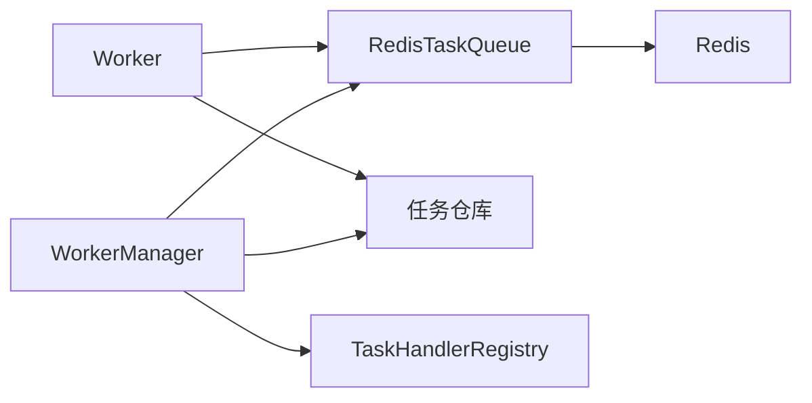

# 任务队列系统

<cite>
**本文引用的文件**
- [redis_queue.py](file://tools/flexloop/src/taolib/testing/task_queue/queue/redis_queue.py)
- [test_queue.py](file://tools/flexloop/tests/testing/test_task_queue/test_queue.py)
- [worker.py](file://tools/flexloop/src/taolib/testing/task_queue/worker/worker.py)
- [test_worker.py](file://tools/flexloop/tests/testing/test_task_queue/test_worker.py)
- [test_manager.py](file://tools/flexloop/tests/testing/test_task_queue/test_manager.py)
- [enums.py](file://tools/flexloop/src/taolib/testing/task_queue/models/enums.py)
- [task.py](file://tools/flexloop/src/taolib/testing/task_queue/models/task.py)
- [registry.py](file://tools/flexloop/src/taolib/testing/task_queue/worker/registry.py)
- [manager.py](file://tools/flexloop/src/taolib/testing/task_queue/worker/manager.py)
- [stability_test.py](file://tools/DeepResearch/tests/performance/stability_test.py)
- [test-monitor-system.test.ts](file://apps/DaoMind/tests/test-monitor-system.test.ts)
</cite>

## 目录
1. [引言](#引言)
2. [项目结构](#项目结构)
3. [核心组件](#核心组件)
4. [架构总览](#架构总览)
5. [详细组件分析](#详细组件分析)
6. [依赖分析](#依赖分析)
7. [性能考虑](#性能考虑)
8. [故障排除指南](#故障排除指南)
9. [结论](#结论)
10. [附录](#附录)

## 引言
本技术文档围绕任务队列系统进行深入解析，重点覆盖以下方面：
- Redis 队列集成：连接池管理、序列化机制与持久化策略
- 任务优先级管理：优先级队列设计、动态调整与公平调度算法
- 失败重试机制：指数退避、最大重试次数与死信队列处理
- 任务服务架构：任务创建、状态跟踪与结果回调
- Worker 管理系统：工作进程管理、负载均衡与优雅停机
- 性能优化、监控告警与故障排除的实践指南

本系统以 Python 为基础，采用 Redis 作为消息存储与调度中枢，结合异步编程模型实现高性能任务队列。

## 项目结构
任务队列系统位于工具包 flexloop 的测试模块中，核心代码集中在以下路径：
- 队列实现：tools/flexloop/src/taolib/testing/task_queue/queue/redis_queue.py
- Worker 实现：tools/flexloop/src/taolib/testing/task_queue/worker/worker.py
- 管理器：tools/flexloop/src/taolib/testing/task_queue/worker/manager.py
- 注册表：tools/flexloop/src/taolib/testing/task_queue/worker/registry.py
- 模型与枚举：tools/flexloop/src/taolib/testing/task_queue/models/
- 测试用例：tools/flexloop/tests/testing/test_task_queue/

图表来源
- [redis_queue.py:14-317](file://tools/flexloop/src/taolib/testing/task_queue/queue/redis_queue.py#L14-L317)
- [worker.py:208-274](file://tools/flexloop/src/taolib/testing/task_queue/worker/worker.py#L208-L274)
- [manager.py](file://tools/flexloop/src/taolib/testing/task_queue/worker/manager.py)
- [registry.py](file://tools/flexloop/src/taolib/testing/task_queue/worker/registry.py)
- [task.py](file://tools/flexloop/src/taolib/testing/task_queue/models/task.py)
- [enums.py](file://tools/flexloop/src/taolib/testing/task_queue/models/enums.py)

章节来源
- [redis_queue.py:14-317](file://tools/flexloop/src/taolib/testing/task_queue/queue/redis_queue.py#L14-L317)
- [worker.py:208-274](file://tools/flexloop/src/taolib/testing/task_queue/worker/worker.py#L208-L274)
- [manager.py](file://tools/flexloop/src/taolib/testing/task_queue/worker/manager.py)
- [registry.py](file://tools/flexloop/src/taolib/testing/task_queue/worker/registry.py)
- [task.py](file://tools/flexloop/src/taolib/testing/task_queue/models/task.py)
- [enums.py](file://tools/flexloop/src/taolib/testing/task_queue/models/enums.py)

## 核心组件
- RedisTaskQueue：基于 Redis 的任务队列，支持优先级队列、重试调度与统计
- Worker：单个工作进程，负责从队列拉取任务、执行处理器、处理成功/失败
- WorkerManager：管理多个 Worker 的生命周期、重试轮询与崩溃恢复
- TaskHandlerRegistry：任务类型到处理器的映射注册表
- TaskDocument：任务实体模型，包含任务类型、优先级、重试策略等
- TaskPriority/TaskStatus：任务优先级与状态枚举

章节来源
- [redis_queue.py:14-317](file://tools/flexloop/src/taolib/testing/task_queue/queue/redis_queue.py#L14-L317)
- [worker.py:208-274](file://tools/flexloop/src/taolib/testing/task_queue/worker/worker.py#L208-L274)
- [manager.py](file://tools/flexloop/src/taolib/testing/task_queue/worker/manager.py)
- [registry.py](file://tools/flexloop/src/taolib/testing/task_queue/worker/registry.py)
- [task.py](file://tools/flexloop/src/taolib/testing/task_queue/models/task.py)
- [enums.py](file://tools/flexloop/src/taolib/testing/task_queue/models/enums.py)

## 架构总览
系统采用“生产者-队列-消费者”的经典架构：
- 生产者将任务元数据写入 Redis Hash，并将任务 ID 推入对应优先级的 List
- WorkerManager/Worker 通过阻塞弹出（BRPOP）获取任务 ID，再从 Hash 读取元数据
- 成功则 ACK，失败则根据重试策略 NACK，或进入失败集合
- 管理器周期性轮询重试 ZSet，到期任务重新入队

图表来源
- [redis_queue.py:58-194](file://tools/flexloop/src/taolib/testing/task_queue/queue/redis_queue.py#L58-L194)
- [worker.py:208-274](file://tools/flexloop/src/taolib/testing/task_queue/worker/worker.py#L208-L274)
- [test_manager.py:26-85](file://tools/flexloop/tests/testing/test_task_queue/test_manager.py#L26-L85)

## 详细组件分析

### Redis 队列实现（RedisTaskQueue）
- 键空间设计
  - 队列键：{prefix}:queue:{priority}（List，高→普通→低）
  - 运行中集合：{prefix}:running（Set）
  - 完成队列：{prefix}:completed（List，限制长度）
  - 失败集合：{prefix}:failed（Set）
  - 重试调度：{prefix}:retry（ZSet，score=下次重试时间戳）
  - 任务元数据：{prefix}:task:{id}（Hash）
  - 全局统计：{prefix}:stats（Hash）
- 入队（enqueue）
  - 将任务元数据写入 Hash，推入对应优先级的 List，并更新统计
- 出队（dequeue）
  - 使用 BRPOP 按优先级顺序阻塞弹出；成功后加入运行中集合
- 确认（ack）
  - 移除运行中、加入完成队列（限制长度）、更新统计、删除元数据
- 失败（nack）
  - 若需重试：加入重试 ZSet 并更新统计；否则加入失败集合
- 重试轮询（poll_retries）
  - 从 ZSet 中取出到期任务，读取其优先级重新入队
- 元数据与统计
  - 提供任务元数据的读写、运行中/失败集合管理、队列长度与全局统计查询

图表来源
- [redis_queue.py:58-317](file://tools/flexloop/src/taolib/testing/task_queue/queue/redis_queue.py#L58-L317)

章节来源
- [redis_queue.py:14-317](file://tools/flexloop/src/taolib/testing/task_queue/queue/redis_queue.py#L14-L317)
- [test_queue.py:119-155](file://tools/flexloop/tests/testing/test_task_queue/test_queue.py#L119-L155)
- [test_queue.py:162-195](file://tools/flexloop/tests/testing/test_task_queue/test_queue.py#L162-L195)
- [test_queue.py:202-218](file://tools/flexloop/tests/testing/test_task_queue/test_queue.py#L202-L218)
- [test_queue.py:225-254](file://tools/flexloop/tests/testing/test_task_queue/test_queue.py#L225-L254)
- [test_queue.py:261-312](file://tools/flexloop/tests/testing/test_task_queue/test_queue.py#L261-L312)
- [test_queue.py:319-365](file://tools/flexloop/tests/testing/test_task_queue/test_queue.py#L319-L365)
- [test_queue.py:372-420](file://tools/flexloop/tests/testing/test_task_queue/test_queue.py#L372-L420)
- [test_queue.py:427-465](file://tools/flexloop/tests/testing/test_task_queue/test_queue.py#L427-L465)

### Worker 与 WorkerManager
- Worker
  - 从队列获取任务 ID，加载任务文档，执行注册的处理器
  - 成功：调用队列 ACK；失败：根据重试策略调用队列 NACK
  - 重试策略：依据任务文档中的重试次数与延迟数组，计算下次重试时间
- WorkerManager
  - 管理多个 Worker 的生命周期
  - 启动/停止、重试轮询任务、崩溃恢复与资源清理
  - 默认工作进程数、重试轮询间隔、陈旧任务超时等参数

图表来源
- [worker.py:208-274](file://tools/flexloop/src/taolib/testing/task_queue/worker/worker.py#L208-L274)
- [test_worker.py:162-202](file://tools/flexloop/tests/testing/test_task_queue/test_worker.py#L162-L202)
- [test_manager.py:26-85](file://tools/flexloop/tests/testing/test_task_queue/test_manager.py#L26-L85)

章节来源
- [worker.py:208-274](file://tools/flexloop/src/taolib/testing/task_queue/worker/worker.py#L208-L274)
- [test_worker.py:162-202](file://tools/flexloop/tests/testing/test_task_queue/test_worker.py#L162-L202)
- [test_manager.py:26-85](file://tools/flexloop/tests/testing/test_task_queue/test_manager.py#L26-L85)

### 任务优先级管理
- 优先级队列设计
  - 高→普通→低的队列键顺序，确保高优先级任务优先被消费
  - 入队时将任务 ID 推入对应优先级的 List
- 动态调整与公平调度
  - 当前实现采用固定优先级顺序的阻塞弹出，保证高优先级优先
  - 可扩展方向：引入动态权重或公平调度算法（例如加权轮询）以避免低优先级饥饿
- 公平调度算法建议
  - 在每次 BRPOP 后记录上次消费的优先级，下一轮跳过该优先级若干次，缓解饥饿
  - 或引入时间片轮转，确保各优先级队列均有机会被消费

图表来源
- [redis_queue.py:81-157](file://tools/flexloop/src/taolib/testing/task_queue/queue/redis_queue.py#L81-L157)
- [worker.py:208-274](file://tools/flexloop/src/taolib/testing/task_queue/worker/worker.py#L208-L274)

章节来源
- [redis_queue.py:49-103](file://tools/flexloop/src/taolib/testing/task_queue/queue/redis_queue.py#L49-L103)
- [test_queue.py:135-154](file://tools/flexloop/tests/testing/test_task_queue/test_queue.py#L135-L154)

### 失败重试机制
- 指数退避与最大重试次数
  - 重试延迟数组由任务文档提供，按当前重试次数取对应延迟
  - 达到最大重试次数后，标记为最终失败
- 死信队列处理
  - 当前实现将最终失败的任务加入失败集合；可扩展为独立死信队列键，便于后续审计与人工干预
- 重试轮询
  - 管理器定期轮询重试 ZSet，到期任务重新入队对应优先级

图表来源
- [worker.py:208-274](file://tools/flexloop/src/taolib/testing/task_queue/worker/worker.py#L208-L274)
- [redis_queue.py:158-194](file://tools/flexloop/src/taolib/testing/task_queue/queue/redis_queue.py#L158-L194)

章节来源
- [worker.py:208-274](file://tools/flexloop/src/taolib/testing/task_queue/worker/worker.py#L208-L274)
- [test_worker.py:162-202](file://tools/flexloop/tests/testing/test_task_queue/test_worker.py#L162-L202)
- [test_queue.py:261-312](file://tools/flexloop/tests/testing/test_task_queue/test_queue.py#L261-L312)

### 任务服务架构
- 任务创建
  - 生产者调用队列入队，写入任务元数据与优先级
- 状态跟踪
  - 运行中集合、完成队列、失败集合、重试 ZSet 与统计键共同维护状态
- 结果回调
  - 可通过任务仓库回调或外部事件通知机制扩展（当前实现聚焦队列与状态）

章节来源
- [redis_queue.py:58-124](file://tools/flexloop/src/taolib/testing/task_queue/queue/redis_queue.py#L58-L124)
- [redis_queue.py:226-289](file://tools/flexloop/src/taolib/testing/task_queue/queue/redis_queue.py#L226-L289)

### Worker 管理系统
- 工作进程管理
  - 管理器启动指定数量的工作进程，统一调度与回收
- 负载均衡
  - 通过共享队列与阻塞弹出实现自然的负载分摊
- 优雅停机
  - 管理器负责停止流程与资源释放，Worker 在循环中安全退出

章节来源
- [test_manager.py:26-85](file://tools/flexloop/tests/testing/test_task_queue/test_manager.py#L26-L85)

## 依赖分析
- 组件耦合
  - Worker 依赖队列与任务仓库；管理器依赖队列、注册表与仓库
  - 队列与 Redis 紧密耦合，键空间设计清晰
- 外部依赖
  - Redis：List/Set/ZSet/Hash/事务管道
  - 异步 Redis 客户端：支持 pipeline 与 BRPOP
- 潜在循环依赖
  - 当前模块间为单向依赖，无明显循环

图表来源
- [redis_queue.py:14-317](file://tools/flexloop/src/taolib/testing/task_queue/queue/redis_queue.py#L14-L317)
- [worker.py:208-274](file://tools/flexloop/src/taolib/testing/task_queue/worker/worker.py#L208-L274)
- [manager.py](file://tools/flexloop/src/taolib/testing/task_queue/worker/manager.py)
- [registry.py](file://tools/flexloop/src/taolib/testing/task_queue/worker/registry.py)

## 性能考虑
- Redis 操作批量化
  - 入队与确认均使用事务管道，减少网络往返
- 阻塞弹出与优先级顺序
  - BRPOP 按优先级顺序消费，降低高优先级任务等待时间
- 队列长度与完成队列裁剪
  - 完成队列限制长度，避免无限增长
- 可扩展优化点
  - 引入连接池与连接复用
  - 重试轮询频率与批量处理
  - 元数据压缩与序列化策略（如 JSON/MsgPack）

## 故障排除指南
- 常见问题定位
  - 出队超时：检查队列键是否存在、BRPOP 超时设置
  - 任务未入队：确认入队操作是否执行、Hash 与 List 是否写入
  - 重试未生效：检查重试 ZSet 的 score 与轮询逻辑
  - 元数据丢失：确认 Hash 写入与删除时机
- 监控与告警
  - 使用系统监控测试脚本捕获 CPU、内存与请求指标，识别异常趋势
  - 结合队列统计键观察提交/完成/失败/重试数量变化
- 代码示例路径
  - 创建任务与入队：[redis_queue.py:58-80](file://tools/flexloop/src/taolib/testing/task_queue/queue/redis_queue.py#L58-L80)
  - 配置队列参数（键前缀、超时）：[redis_queue.py:31-43](file://tools/flexloop/src/taolib/testing/task_queue/queue/redis_queue.py#L31-L43)
  - 实现自定义 Worker 处理器：[test_worker.py:162-173](file://tools/flexloop/tests/testing/test_task_queue/test_worker.py#L162-L173)

章节来源
- [stability_test.py:154-201](file://tools/DeepResearch/tests/performance/stability_test.py#L154-L201)
- [test-monitor-system.test.ts:176-224](file://apps/DaoMind/tests/test-monitor-system.test.ts#L176-L224)

## 结论
本任务队列系统以 Redis 为核心，实现了高可用、可扩展的任务调度与执行框架。通过优先级队列、重试轮询与状态跟踪，满足了多样化的业务需求。建议在生产环境中进一步完善连接池、序列化策略与监控告警体系，并根据业务特点引入更精细的调度与治理能力。

## 附录
- 术语
  - 任务：一次可执行的工作单元
  - 优先级：高/普通/低三档
  - 重试：失败后按策略延时再次执行
  - 死信：超过最大重试次数的任务
- 参考实现路径
  - 队列实现：[redis_queue.py:14-317](file://tools/flexloop/src/taolib/testing/task_queue/queue/redis_queue.py#L14-L317)
  - Worker 处理：[worker.py:208-274](file://tools/flexloop/src/taolib/testing/task_queue/worker/worker.py#L208-L274)
  - 管理器生命周期：[test_manager.py:26-85](file://tools/flexloop/tests/testing/test_task_queue/test_manager.py#L26-L85)
  - 测试用例参考：[test_queue.py](file://tools/flexloop/tests/testing/test_task_queue/test_queue.py)、[test_worker.py](file://tools/flexloop/tests/testing/test_task_queue/test_worker.py)