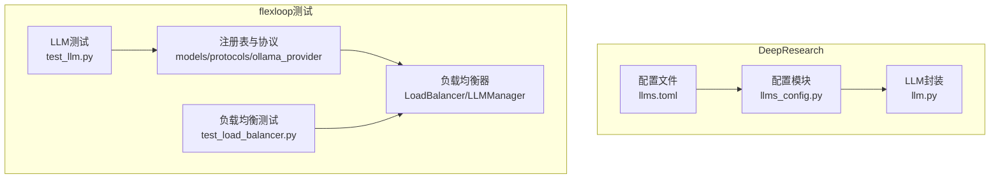
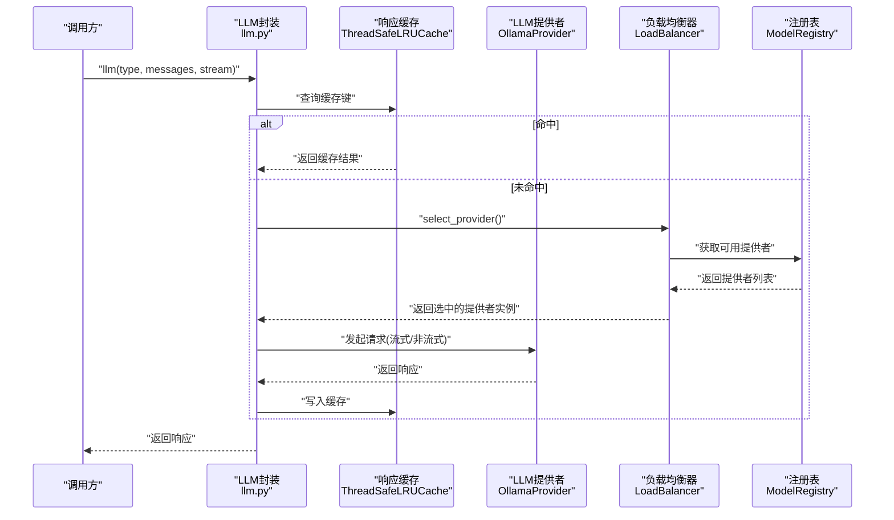
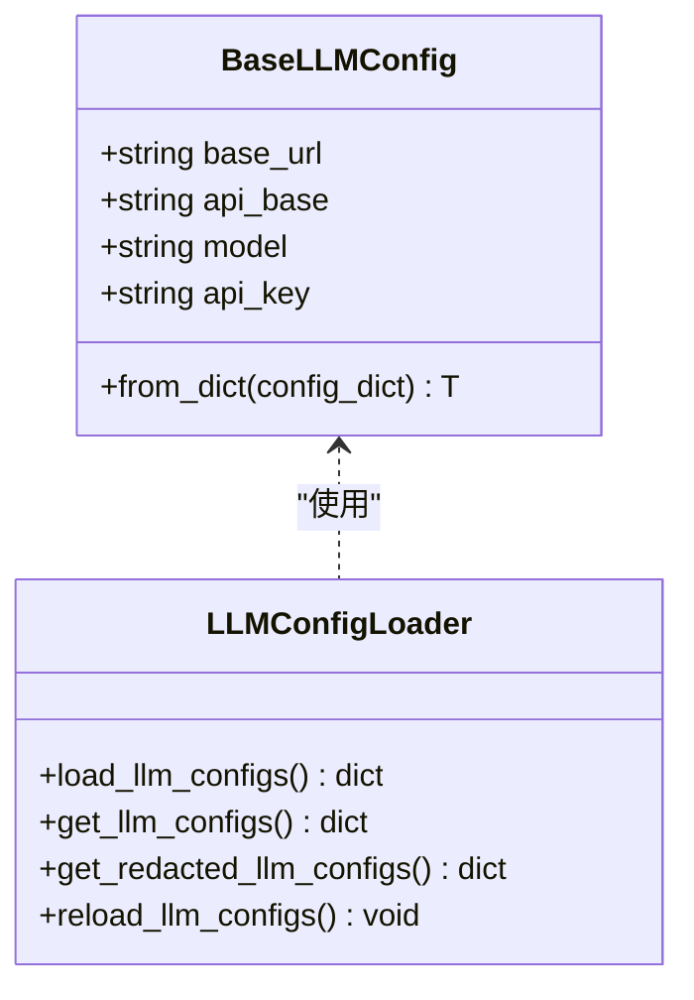
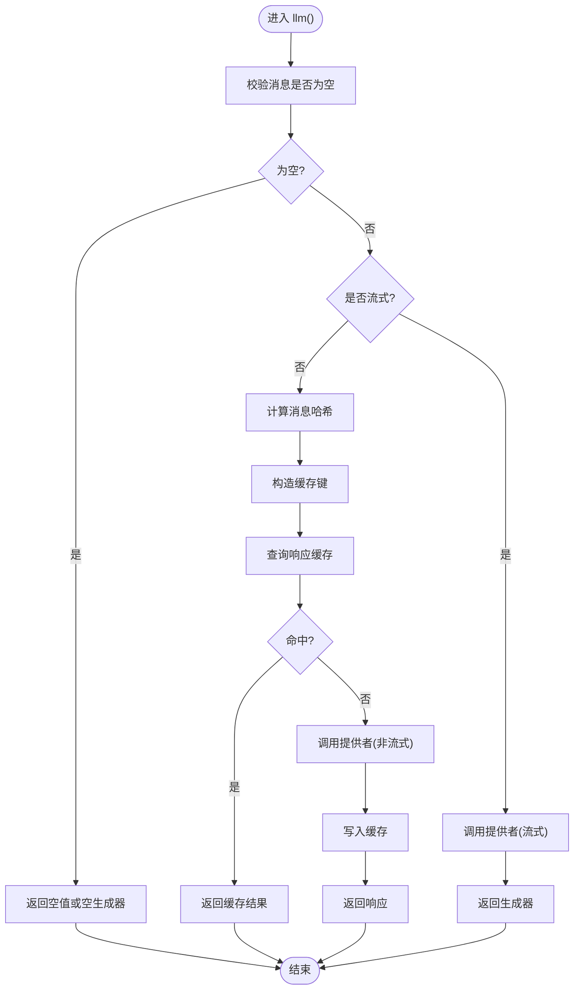
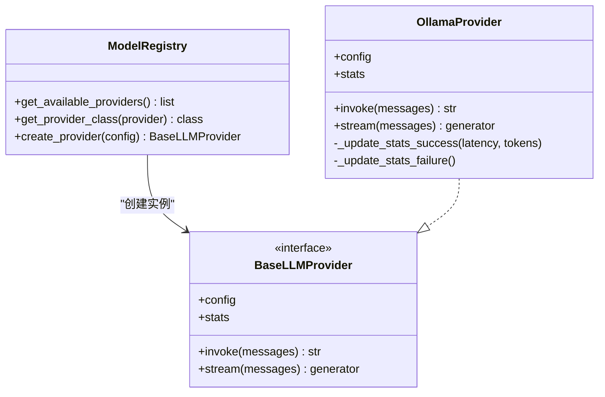
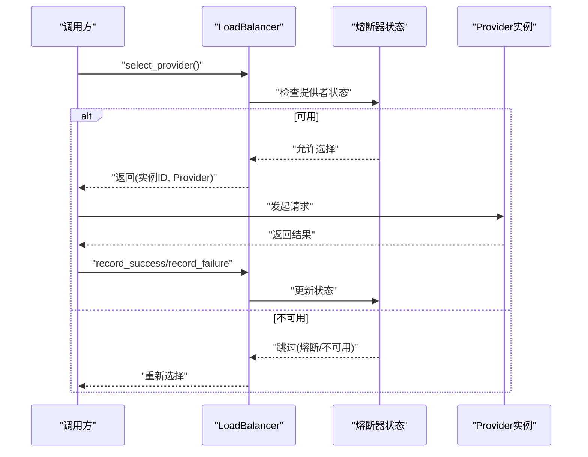
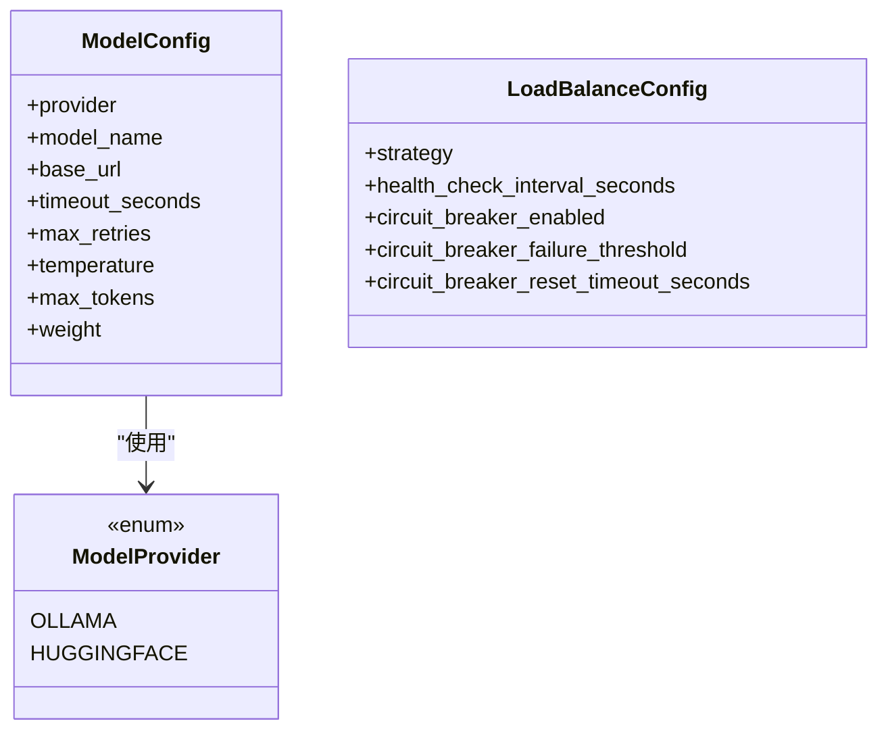
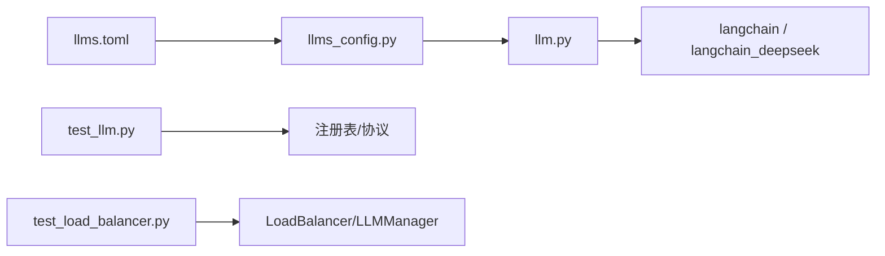

# LLM管理与负载均衡

<cite>
**本文引用的文件**
- [llms_config.py](file://tools/DeepResearch/src/deepresearch/config/llms_config.py)
- [llm.py](file://tools/DeepResearch/src/deepresearch/llms/llm.py)
- [llms.toml](file://tools/DeepResearch/config/llms.toml)
- [test_llm.py](file://tools/flexloop/tests/testing/test_multi_agent/test_llm.py)
- [test_load_balancer.py](file://tools/flexloop/tests/testing/test_multi_agent/test_load_balancer.py)
</cite>

## 目录
1. [引言](#引言)
2. [项目结构](#项目结构)
3. [核心组件](#核心组件)
4. [架构总览](#架构总览)
5. [详细组件分析](#详细组件分析)
6. [依赖分析](#依赖分析)
7. [性能考虑](#性能考虑)
8. [故障排查指南](#故障排查指南)
9. [结论](#结论)
10. [附录](#附录)

## 引言
本文件面向“LLM管理与负载均衡”系统，聚焦以下目标：
- LLM提供者管理架构：模型注册、配置管理与接口抽象
- 负载均衡算法：轮询、权重分配与熔断（健康检查）机制
- Ollama提供者集成：连接管理、请求处理与响应优化
- LLM注册表设计：模型发现、版本管理与兼容性检查
- 性能监控、资源优化与故障恢复最佳实践
- 提供可直接定位到源码路径的示例，帮助快速上手

## 项目结构
本仓库包含两个与LLM管理密切相关的模块：
- DeepResearch：提供统一的LLM配置与调用封装，支持缓存、流式与非流式响应
- flexloop测试：提供多代理场景下的LLM注册表、负载均衡器与Ollama提供者实现及测试

**图表来源**
- [llms_config.py:46-85](file://tools/DeepResearch/src/deepresearch/config/llms_config.py#L46-L85)
- [llm.py:146-185](file://tools/DeepResearch/src/deepresearch/llms/llm.py#L146-L185)
- [llms.toml:1-29](file://tools/DeepResearch/config/llms.toml#L1-L29)
- [test_llm.py:19-45](file://tools/flexloop/tests/testing/test_multi_agent/test_llm.py#L19-L45)
- [test_load_balancer.py:19-50](file://tools/flexloop/tests/testing/test_multi_agent/test_load_balancer.py#L19-L50)

**章节来源**
- [llms_config.py:46-85](file://tools/DeepResearch/src/deepresearch/config/llms_config.py#L46-L85)
- [llm.py:146-185](file://tools/DeepResearch/src/deepresearch/llms/llm.py#L146-L185)
- [llms.toml:1-29](file://tools/DeepResearch/config/llms.toml#L1-L29)
- [test_llm.py:19-45](file://tools/flexloop/tests/testing/test_multi_agent/test_llm.py#L19-L45)
- [test_load_balancer.py:19-50](file://tools/flexloop/tests/testing/test_multi_agent/test_load_balancer.py#L19-L50)

## 核心组件
- 配置层：从llms.toml读取并解析为BaseLLMConfig字典，支持懒加载与脱敏输出
- LLM封装层：基于LangChain的ChatDeepSeek客户端，提供线程安全响应缓存、消息哈希缓存键、流式/非流式响应
- 注册表与协议：定义BaseLLMProvider接口与OllamaProvider实现，支持模型配置、统计与健康度管理
- 负载均衡器：支持轮询、随机、加权与最少连接策略，内置熔断器与健康检查配置
- 测试用例：覆盖注册表、Ollama提供者、负载均衡策略与熔断逻辑

**章节来源**
- [llms_config.py:46-85](file://tools/DeepResearch/src/deepresearch/config/llms_config.py#L46-L85)
- [llm.py:146-185](file://tools/DeepResearch/src/deepresearch/llms/llm.py#L146-L185)
- [test_llm.py:19-45](file://tools/flexloop/tests/testing/test_multi_agent/test_llm.py#L19-L45)
- [test_load_balancer.py:19-50](file://tools/flexloop/tests/testing/test_multi_agent/test_load_balancer.py#L19-L50)

## 架构总览
下图展示了从配置到调用、再到负载均衡与健康检查的整体流程。

**图表来源**
- [llm.py:146-185](file://tools/DeepResearch/src/deepresearch/llms/llm.py#L146-L185)
- [test_load_balancer.py:51-87](file://tools/flexloop/tests/testing/test_multi_agent/test_load_balancer.py#L51-L87)
- [test_llm.py:22-44](file://tools/flexloop/tests/testing/test_multi_agent/test_llm.py#L22-L44)

## 详细组件分析

### 配置管理与接口抽象
- 配置文件：llms.toml以节形式定义不同用途的LLM配置，如basic、clarify、planner等
- 配置加载：llms_config.py提供懒加载、缓存清理与脱敏输出能力
- 接口抽象：BaseLLMConfig定义通用字段；在DeepResearch侧通过LLMType枚举限定可用类型

**图表来源**
- [llms_config.py:12-85](file://tools/DeepResearch/src/deepresearch/config/llms_config.py#L12-L85)
- [llms.toml:1-29](file://tools/DeepResearch/config/llms.toml#L1-L29)

**章节来源**
- [llms_config.py:46-85](file://tools/DeepResearch/src/deepresearch/config/llms_config.py#L46-L85)
- [llms.toml:1-29](file://tools/DeepResearch/config/llms.toml#L1-L29)

### LLM封装与缓存策略
- 实例工厂：_make_llm_instance根据LLMType与参数生成ChatDeepSeek实例，并通过LRU缓存限制最大数量
- 响应缓存：ThreadSafeLRUCache提供线程安全的LRU缓存，支持命中率统计
- 请求处理：llm函数支持流式与非流式两种模式；非流式时使用消息哈希作为缓存键
- 错误处理：捕获invoke/stream异常并记录日志，避免中断

**图表来源**
- [llm.py:146-185](file://tools/DeepResearch/src/deepresearch/llms/llm.py#L146-L185)
- [llm.py:187-256](file://tools/DeepResearch/src/deepresearch/llms/llm.py#L187-L256)

**章节来源**
- [llm.py:146-185](file://tools/DeepResearch/src/deepresearch/llms/llm.py#L146-L185)
- [llm.py:187-256](file://tools/DeepResearch/src/deepresearch/llms/llm.py#L187-L256)

### Ollama提供者集成
- 提供者注册：ModelRegistry维护可用提供者映射，支持按名称获取类与创建实例
- 统计与健康：OllamaProvider维护请求统计（成功/失败/延迟/令牌数），支持错误时间戳
- 配置项：支持超时、重试次数、温度、最大tokens、权重等

**图表来源**
- [test_llm.py:19-45](file://tools/flexloop/tests/testing/test_multi_agent/test_llm.py#L19-L45)
- [test_llm.py:47-87](file://tools/flexloop/tests/testing/test_multi_agent/test_llm.py#L47-L87)

**章节来源**
- [test_llm.py:19-45](file://tools/flexloop/tests/testing/test_multi_agent/test_llm.py#L19-L45)
- [test_llm.py:47-87](file://tools/flexloop/tests/testing/test_multi_agent/test_llm.py#L47-L87)

### 负载均衡算法与健康检查
- 策略支持：轮询、随机、加权、最少连接（测试中验证了前三种）
- 熔断器：记录失败次数与开合状态，超过阈值后暂时移除提供者
- 健康检查：通过配置项控制检查间隔与熔断参数
- 管理器：LLMManager负责模型注册与统计查询

**图表来源**
- [test_load_balancer.py:51-87](file://tools/flexloop/tests/testing/test_multi_agent/test_load_balancer.py#L51-L87)
- [test_load_balancer.py:125-151](file://tools/flexloop/tests/testing/test_multi_agent/test_load_balancer.py#L125-L151)

**章节来源**
- [test_load_balancer.py:19-50](file://tools/flexloop/tests/testing/test_multi_agent/test_load_balancer.py#L19-L50)
- [test_load_balancer.py:71-124](file://tools/flexloop/tests/testing/test_multi_agent/test_load_balancer.py#L71-L124)
- [test_load_balancer.py:125-151](file://tools/flexloop/tests/testing/test_multi_agent/test_load_balancer.py#L125-L151)

### LLM注册表设计
- 模型发现：通过ModelRegistry集中管理提供者类型与创建逻辑
- 版本管理：通过ModelConfig中的provider/model_name/base_url等字段区分不同版本/实例
- 兼容性检查：测试覆盖默认与自定义配置项，确保字段兼容性

**图表来源**
- [test_llm.py:89-125](file://tools/flexloop/tests/testing/test_multi_agent/test_llm.py#L89-L125)
- [test_load_balancer.py:214-229](file://tools/flexloop/tests/testing/test_multi_agent/test_load_balancer.py#L214-L229)

**章节来源**
- [test_llm.py:89-125](file://tools/flexloop/tests/testing/test_multi_agent/test_llm.py#L89-L125)
- [test_load_balancer.py:214-229](file://tools/flexloop/tests/testing/test_multi_agent/test_load_balancer.py#L214-L229)

## 依赖分析
- DeepResearch侧依赖langchain与langchain_deepseek进行模型调用，内部通过LRU缓存与响应缓存降低重复请求成本
- flexloop测试侧依赖pytest与pytest-asyncio进行单元测试，覆盖注册表、提供者与负载均衡逻辑
- 配置文件与Python模块之间通过键名映射（如LLMType与llms.toml节名）耦合

**图表来源**
- [llms_config.py:46-85](file://tools/DeepResearch/src/deepresearch/config/llms_config.py#L46-L85)
- [llm.py:14-19](file://tools/DeepResearch/src/deepresearch/llms/llm.py#L14-L19)
- [test_llm.py:19-45](file://tools/flexloop/tests/testing/test_multi_agent/test_llm.py#L19-L45)
- [test_load_balancer.py:19-50](file://tools/flexloop/tests/testing/test_multi_agent/test_load_balancer.py#L19-L50)

**章节来源**
- [llm.py:14-19](file://tools/DeepResearch/src/deepresearch/llms/llm.py#L14-L19)
- [test_llm.py:19-45](file://tools/flexloop/tests/testing/test_multi_agent/test_llm.py#L19-L45)
- [test_load_balancer.py:19-50](file://tools/flexloop/tests/testing/test_multi_agent/test_load_balancer.py#L19-L50)

## 性能考虑
- 缓存策略
  - LLM实例LRU缓存：限制最大实例数，避免频繁创建带来的资源消耗
  - 响应缓存：基于消息哈希的键值缓存，显著减少重复请求
- 流式处理：在需要实时反馈的场景启用流式，降低首字延迟
- 资源优化
  - 控制max_tokens与temperature，平衡质量与成本
  - 合理设置超时与重试次数，避免资源浪费
- 监控指标
  - 响应缓存命中率、实例缓存命中率、平均延迟、总请求数与失败率

**章节来源**
- [llm.py:21-44](file://tools/DeepResearch/src/deepresearch/llms/llm.py#L21-L44)
- [llm.py:71-121](file://tools/DeepResearch/src/deepresearch/llms/llm.py#L71-L121)
- [llm.py:258-266](file://tools/DeepResearch/src/deepresearch/llms/llm.py#L258-L266)

## 故障排查指南
- 常见问题
  - 配置缺失：LLMType对应的配置不存在会抛出KeyError，需检查llms.toml节名与键名
  - 空消息：传入空消息列表将记录警告并返回空结果
  - invoke/stream异常：捕获异常并记录日志，必要时重试或切换提供者
  - 熔断触发：连续失败达到阈值后提供者被暂时移除，等待重置超时
- 定位方法
  - 查看日志：关注LLM封装层的日志输出
  - 清理缓存：调用clear_cache以排除缓存干扰
  - 校验配置：使用脱敏输出接口确认配置可见性

**章节来源**
- [llm.py:31-41](file://tools/DeepResearch/src/deepresearch/llms/llm.py#L31-L41)
- [llm.py:163-166](file://tools/DeepResearch/src/deepresearch/llms/llm.py#L163-L166)
- [llm.py:215-217](file://tools/DeepResearch/src/deepresearch/llms/llm.py#L215-L217)
- [test_load_balancer.py:125-151](file://tools/flexloop/tests/testing/test_multi_agent/test_load_balancer.py#L125-L151)

## 结论
本系统通过清晰的配置层、封装层与测试层，实现了：
- 易扩展的LLM配置管理与类型约束
- 高效的缓存与流式处理机制
- 多策略负载均衡与熔断健康检查
- 面向Ollama等提供者的抽象与注册表设计

建议在生产环境中结合监控指标持续优化缓存策略与负载均衡参数，并通过测试用例保障新增提供者与策略的稳定性。

## 附录

### 快速上手示例（代码路径）
- 配置LLM提供者
  - 在llms.toml中添加新节，参考现有节名与字段
  - 使用llms_config.py提供的接口读取与脱敏输出
  - 参考路径：[llms.toml:1-29](file://tools/DeepResearch/config/llms.toml#L1-L29)，[llms_config.py:46-85](file://tools/DeepResearch/src/deepresearch/config/llms_config.py#L46-L85)
- 调用LLM（流式/非流式）
  - 通过llm函数传入LLMType与消息列表，参考实现
  - 参考路径：[llm.py:146-185](file://tools/DeepResearch/src/deepresearch/llms/llm.py#L146-L185)
- 自定义负载均衡策略
  - 在LoadBalancer中扩展策略枚举与选择逻辑，参考测试用例
  - 参考路径：[test_load_balancer.py:71-124](file://tools/flexloop/tests/testing/test_multi_agent/test_load_balancer.py#L71-L124)
- 处理模型异常
  - 利用熔断器与错误统计，必要时切换提供者或降级
  - 参考路径：[test_load_balancer.py:125-151](file://tools/flexloop/tests/testing/test_multi_agent/test_load_balancer.py#L125-L151)，[llm.py:215-217](file://tools/DeepResearch/src/deepresearch/llms/llm.py#L215-L217)