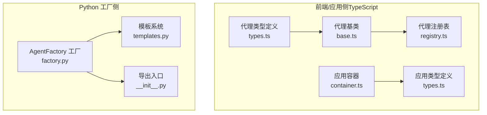
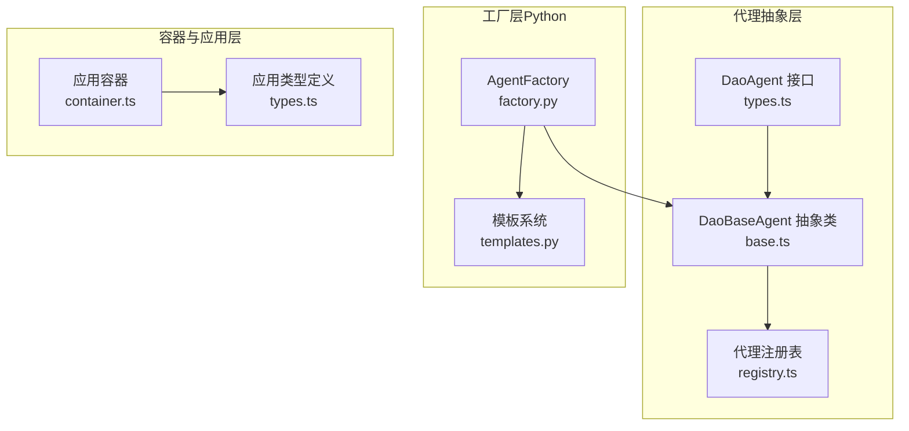
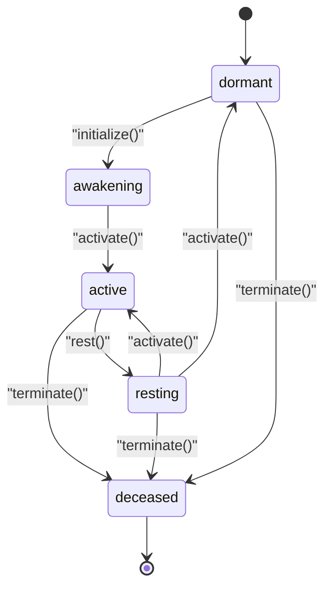
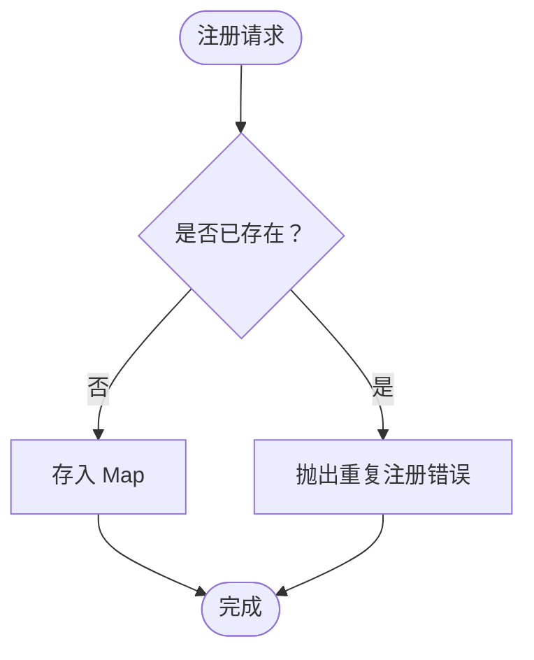
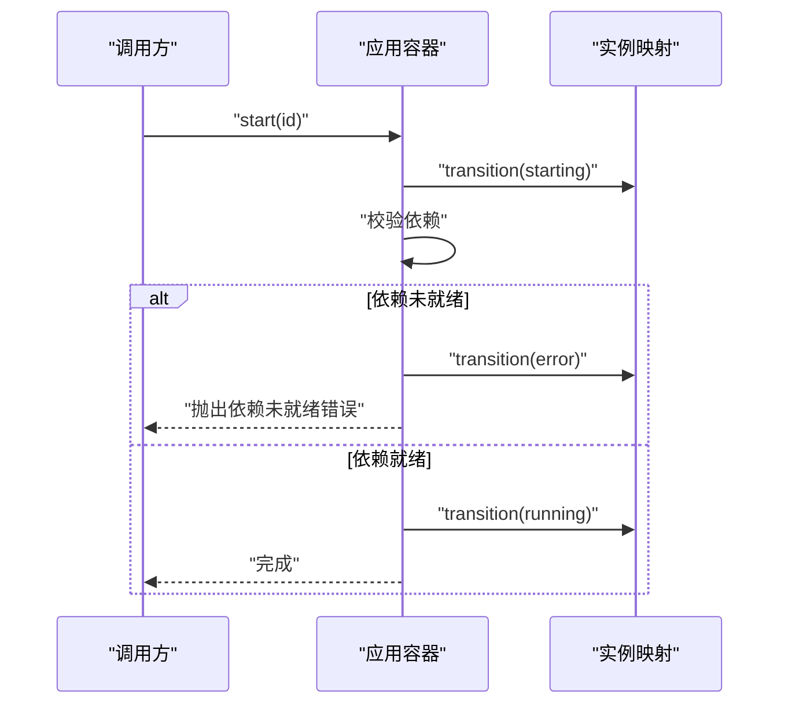
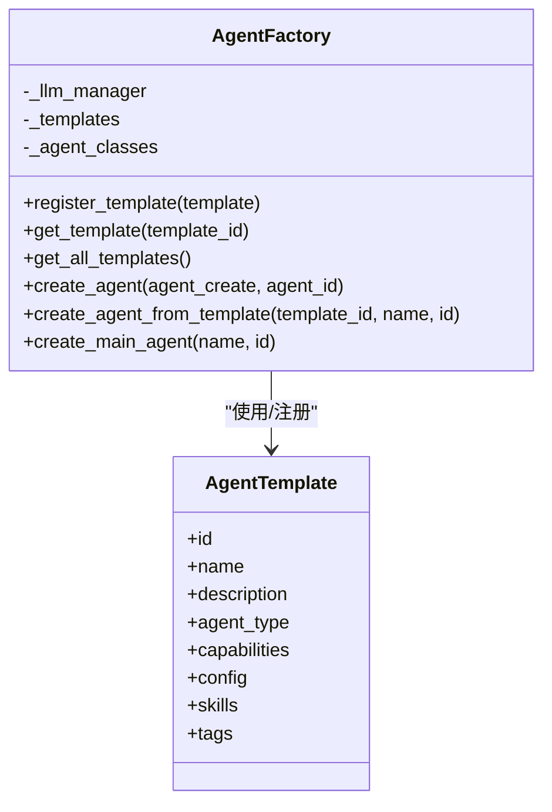
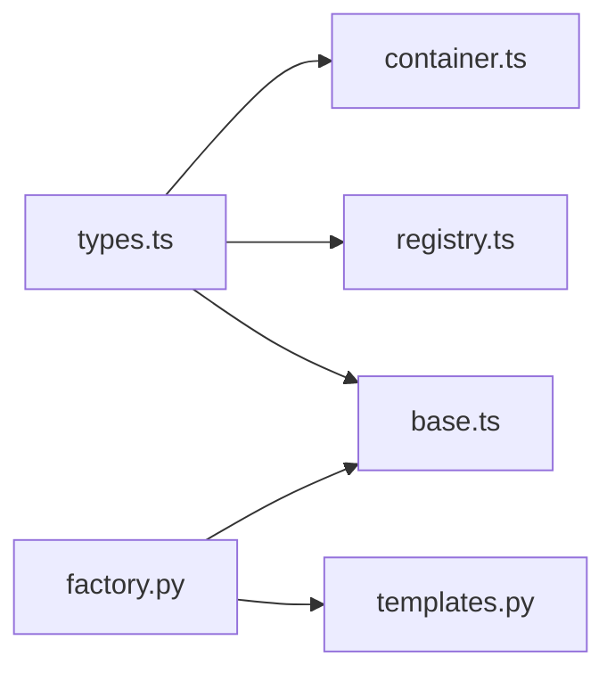

# 代理工厂系统

<cite>
**本文档引用的文件**
- [base.ts](file://apps/DaoMind/packages/daoAgents/src/base.ts)
- [types.ts](file://apps/DaoMind/packages/daoAgents/src/types.ts)
- [registry.ts](file://apps/DaoMind/packages/daoAgents/src/registry.ts)
- [index.ts](file://apps/DaoMind/packages/daoAgents/src/index.ts)
- [container.ts](file://apps/DaoMind/packages/daoApps/src/container.ts)
- [types.ts](file://apps/DaoMind/packages/daoApps/src/types.ts)
- [index.ts](file://apps/DaoMind/packages/daoApps/src/index.ts)
- [agents-apps-integration.test.ts](file://apps/DaoMind/src/__tests__/integration/agents-apps-integration.test.ts)
- [factory.py](file://tools/flexloop/src/taolib/testing/multi_agent/agents/factory.py)
- [templates.py](file://tools/flexloop/src/taolib/testing/multi_agent/agents/templates.py)
- [__init__.py](file://tools/flexloop/src/taolib/testing/multi_agent/agents/__init__.py)
- [container.ts](file://apps/DaoMind/packages/daoAnything/src/container.ts)
</cite>

## 目录
1. [简介](#简介)
2. [项目结构](#项目结构)
3. [核心组件](#核心组件)
4. [架构总览](#架构总览)
5. [详细组件分析](#详细组件分析)
6. [依赖分析](#依赖分析)
7. [性能考虑](#性能考虑)
8. [故障排查指南](#故障排查指南)
9. [结论](#结论)
10. [附录](#附录)

## 简介
本文件面向“代理工厂系统”，系统性阐述代理工厂模式的设计原理与实现细节，涵盖代理创建流程、模板系统与配置管理；深入解析代理基类的抽象设计（通用接口、生命周期钩子、状态机）、代理模板系统的实现（预设配置、参数化模板、动态实例化）；并提供使用示例路径，说明如何通过工厂创建不同类型的代理、配置代理参数以及管理代理实例；同时覆盖代理注册机制、依赖注入与错误处理策略。

## 项目结构
该仓库包含两套代理工厂体系：
- TypeScript/JavaScript 前端/应用侧：代理基类、注册表、应用容器与生命周期管理。
- Python 多智能体测试工具：AgentFactory 工厂、模板系统与 LLM 管理器集成。

图示来源
- [base.ts:1-59](file://apps/DaoMind/packages/daoAgents/src/base.ts#L1-L59)
- [types.ts:1-25](file://apps/DaoMind/packages/daoAgents/src/types.ts#L1-L25)
- [registry.ts:1-56](file://apps/DaoMind/packages/daoAgents/src/registry.ts#L1-L56)
- [container.ts:1-107](file://apps/DaoMind/packages/daoApps/src/container.ts#L1-L107)
- [types.ts:1-24](file://apps/DaoMind/packages/daoApps/src/types.ts#L1-L24)
- [factory.py:1-220](file://tools/flexloop/src/taolib/testing/multi_agent/agents/factory.py#L1-L220)
- [templates.py:1-309](file://tools/flexloop/src/taolib/testing/multi_agent/agents/templates.py#L1-L309)
- [__init__.py:1-33](file://tools/flexloop/src/taolib/testing/multi_agent/agents/__init__.py#L1-L33)

章节来源
- [base.ts:1-59](file://apps/DaoMind/packages/daoAgents/src/base.ts#L1-L59)
- [types.ts:1-25](file://apps/DaoMind/packages/daoAgents/src/types.ts#L1-L25)
- [registry.ts:1-56](file://apps/DaoMind/packages/daoAgents/src/registry.ts#L1-L56)
- [container.ts:1-107](file://apps/DaoMind/packages/daoApps/src/container.ts#L1-L107)
- [types.ts:1-24](file://apps/DaoMind/packages/daoApps/src/types.ts#L1-L24)
- [factory.py:1-220](file://tools/flexloop/src/taolib/testing/multi_agent/agents/factory.py#L1-L220)
- [templates.py:1-309](file://tools/flexloop/src/taolib/testing/multi_agent/agents/templates.py#L1-L309)
- [__init__.py:1-33](file://tools/flexloop/src/taolib/testing/multi_agent/agents/__init__.py#L1-L33)

## 核心组件
- 代理基类与接口：定义统一的代理抽象、能力描述、生命周期方法与状态机。
- 代理注册表：提供代理注册、查询、按能力/类型筛选与状态计数等能力。
- 应用容器：管理应用的注册、启动/停止/重启、依赖检查与状态流转。
- AgentFactory 工厂（Python）：负责从模板或显式配置创建代理实例，支持模板注册与 LLM 注入。
- 模板系统（Python）：内置多种预设模板，支持按 ID 获取与批量列举。

章节来源
- [types.ts:1-25](file://apps/DaoMind/packages/daoAgents/src/types.ts#L1-L25)
- [base.ts:1-59](file://apps/DaoMind/packages/daoAgents/src/base.ts#L1-L59)
- [registry.ts:1-56](file://apps/DaoMind/packages/daoAgents/src/registry.ts#L1-L56)
- [container.ts:1-107](file://apps/DaoMind/packages/daoApps/src/container.ts#L1-L107)
- [factory.py:1-220](file://tools/flexloop/src/taolib/testing/multi_agent/agents/factory.py#L1-L220)
- [templates.py:1-309](file://tools/flexloop/src/taolib/testing/multi_agent/agents/templates.py#L1-L309)

## 架构总览
代理工厂系统由“代理抽象层”“工厂层”“注册与容器层”三部分组成。前端/应用侧通过代理基类与注册表实现代理的统一生命周期管理；应用容器负责应用级生命周期；Python 工厂层提供模板驱动的代理创建与 LLM 注入。

图示来源
- [types.ts:16-25](file://apps/DaoMind/packages/daoAgents/src/types.ts#L16-L25)
- [base.ts:11-56](file://apps/DaoMind/packages/daoAgents/src/base.ts#L11-L56)
- [registry.ts:3-52](file://apps/DaoMind/packages/daoAgents/src/registry.ts#L3-L52)
- [factory.py:27-118](file://tools/flexloop/src/taolib/testing/multi_agent/agents/factory.py#L27-L118)
- [templates.py:14-261](file://tools/flexloop/src/taolib/testing/multi_agent/agents/templates.py#L14-L261)
- [container.ts:12-103](file://apps/DaoMind/packages/daoApps/src/container.ts#L12-L103)
- [types.ts:1-24](file://apps/DaoMind/packages/daoApps/src/types.ts#L1-L24)

## 详细组件分析

### 代理基类与生命周期
- 设计要点
  - 统一接口：代理必须实现 initialize/activate/rest/terminate 与 execute。
  - 能力模型：capabilities 为只读数组，便于注册表按能力筛选。
  - 状态机：严格的状态转换表，非法转换抛出错误。
  - 生命周期钩子：子类通过 setState 实现状态推进，execute 为业务执行入口。
- 关键行为
  - 初始化：dormant → awakening → active。
  - 休眠：active → resting；resting → active 或 dormant。
  - 终止：任意状态 → deceased。
- 错误处理
  - 非法状态转换时抛出带上下文的错误信息，便于定位问题。

图示来源
- [base.ts:3-9](file://apps/DaoMind/packages/daoAgents/src/base.ts#L3-L9)
- [base.ts:39-53](file://apps/DaoMind/packages/daoAgents/src/base.ts#L39-L53)

章节来源
- [types.ts:9-25](file://apps/DaoMind/packages/daoAgents/src/types.ts#L9-L25)
- [base.ts:11-56](file://apps/DaoMind/packages/daoAgents/src/base.ts#L11-L56)

### 代理注册表
- 职责
  - 注册/注销/查询代理实例。
  - 按能力名称过滤（排除已终止代理）。
  - 按 agentType 过滤。
  - 列表化与按状态计数。
- 并发与一致性
  - 使用 Map 存储，提供 O(1) 查找与更新。
  - 查询时忽略 deceased 状态，保证结果有效性。

图示来源
- [registry.ts:6-11](file://apps/DaoMind/packages/daoAgents/src/registry.ts#L6-L11)

章节来源
- [registry.ts:3-52](file://apps/DaoMind/packages/daoAgents/src/registry.ts#L3-L52)

### 应用容器与生命周期
- 状态机
  - registered → starting → running → stopping → stopped → starting 循环。
  - 支持 error 中间态，便于错误恢复。
- 依赖管理
  - 启动前校验依赖是否全部处于 running。
  - 不允许卸载运行中应用。
- 时间戳
  - 启动/停止时记录时间戳，确保单调递增。

图示来源
- [container.ts:38-61](file://apps/DaoMind/packages/daoApps/src/container.ts#L38-L61)
- [container.ts:43-52](file://apps/DaoMind/packages/daoApps/src/container.ts#L43-L52)
- [container.ts:96-103](file://apps/DaoMind/packages/daoApps/src/container.ts#L96-L103)

章节来源
- [container.ts:12-103](file://apps/DaoMind/packages/daoApps/src/container.ts#L12-L103)
- [types.ts:1-24](file://apps/DaoMind/packages/daoApps/src/types.ts#L1-L24)

### AgentFactory 工厂与模板系统（Python）
- 工厂职责
  - 从 AgentCreate 配置直接创建代理。
  - 从模板 ID 创建代理，自动填充能力、配置、技能与标签。
  - 默认模板加载与自定义模板注册。
  - LLM 管理器注入，支持全局/自定义注入。
- 模板系统
  - 内置多种专业模板（代码助手、写作助手、数据分析、研究助手、通用助手）。
  - 每个模板包含能力集合、系统提示、温度、并发限制等配置。
  - 支持按 ID 获取与批量列举。

图示来源
- [factory.py:27-193](file://tools/flexloop/src/taolib/testing/multi_agent/agents/factory.py#L27-L193)
- [templates.py:14-261](file://tools/flexloop/src/taolib/testing/multi_agent/agents/templates.py#L14-L261)

章节来源
- [factory.py:27-193](file://tools/flexloop/src/taolib/testing/multi_agent/agents/factory.py#L27-L193)
- [templates.py:14-261](file://tools/flexloop/src/taolib/testing/multi_agent/agents/templates.py#L14-L261)
- [__init__.py:6-33](file://tools/flexloop/src/taolib/testing/multi_agent/agents/__init__.py#L6-L33)

### 依赖注入与模块解析（可选）
- 模块容器提供模块注册、激活、解析与终止的生命周期管理。
- 支持延迟导入与实例缓存，resolve 在模块非 active 时拒绝解析。
- 与代理工厂形成互补：代理工厂负责“代理实例”的创建与模板化，模块容器负责“模块资源”的生命周期与解析。

章节来源
- [container.ts:36-98](file://apps/DaoMind/packages/daoAnything/src/container.ts#L36-L98)

## 依赖分析
- 组件耦合
  - 代理基类与注册表低耦合：注册表仅依赖 DaoAgent 接口，便于扩展新代理类型。
  - 应用容器与类型定义弱耦合：通过枚举状态与只读定义隔离状态机与业务。
  - Python 工厂与模板系统强内聚：模板集中管理，工厂统一创建流程。
- 外部依赖
  - Python 工厂依赖 LLM 管理器与模型定义，便于替换底层推理服务。
  - 前端代理不直接依赖应用容器，但可通过集成测试验证协同工作。

图示来源
- [types.ts:1-25](file://apps/DaoMind/packages/daoAgents/src/types.ts#L1-L25)
- [base.ts:1-59](file://apps/DaoMind/packages/daoAgents/src/base.ts#L1-L59)
- [registry.ts:1-56](file://apps/DaoMind/packages/daoAgents/src/registry.ts#L1-L56)
- [container.ts:1-107](file://apps/DaoMind/packages/daoApps/src/container.ts#L1-L107)
- [factory.py:1-220](file://tools/flexloop/src/taolib/testing/multi_agent/agents/factory.py#L1-L220)
- [templates.py:1-309](file://tools/flexloop/src/taolib/testing/multi_agent/agents/templates.py#L1-L309)

## 性能考虑
- 注册表查询
  - 使用 Map 存储，查询/插入/删除均为 O(1)，适合高频注册/查询场景。
- 状态机检查
  - 每次状态变更进行合法性检查，开销极小，但能有效防止非法状态传播。
- 模板加载
  - 工厂在初始化时加载默认模板，后续通过内存字典访问，避免重复 IO。
- 并发与线程
  - Python 工厂创建过程为异步，注意避免在高并发下重复创建同一模板导致的资源竞争。

## 故障排查指南
- 代理状态异常
  - 现象：调用 activate 抛出“非法状态转换”。
  - 排查：确认代理已完成 initialize；若状态仍为 dormant，先调用 initialize。
- 注册冲突
  - 现象：注册报错“Agent 已注册”。
  - 排查：检查代理 ID 是否重复；必要时清理旧实例后再注册。
- 应用启动失败
  - 现象：启动时报“依赖未就绪”。
  - 排查：确认依赖应用已注册且状态为 running；检查依赖列表拼写。
- 卸载失败
  - 现象：卸载报错“无法卸载运行中的应用”。
  - 排查：先 stop 对应应用，再执行 unregister。
- 模板不存在
  - 现象：从模板创建代理时报“模板不存在”。
  - 排查：确认模板 ID 正确；如需自定义模板，先调用 register_template。

章节来源
- [base.ts:29-37](file://apps/DaoMind/packages/daoAgents/src/base.ts#L29-L37)
- [registry.ts:7-11](file://apps/DaoMind/packages/daoAgents/src/registry.ts#L7-L11)
- [container.ts:43-52](file://apps/DaoMind/packages/daoApps/src/container.ts#L43-L52)
- [container.ts:30-32](file://apps/DaoMind/packages/daoApps/src/container.ts#L30-L32)
- [factory.py:136-139](file://tools/flexloop/src/taolib/testing/multi_agent/agents/factory.py#L136-L139)

## 结论
代理工厂系统通过“抽象接口 + 状态机 + 注册表 + 容器”的分层设计，实现了代理生命周期的标准化与可扩展性；Python 工厂与模板系统进一步提供了“预设模板 + 参数化配置 + 动态实例化”的工程化能力。结合依赖注入与严格的错误处理，系统在复杂多代理场景下具备良好的可维护性与可演进性。

## 附录

### 使用示例（路径指引）
- 创建 TypeScript 代理并注册
  - 定义代理类型与能力：[types.ts:3-7](file://apps/DaoMind/packages/daoAgents/src/types.ts#L3-L7)
  - 继承基类并实现 execute：[base.ts:11-56](file://apps/DaoMind/packages/daoAgents/src/base.ts#L11-L56)
  - 注册与查询：[registry.ts:6-19](file://apps/DaoMind/packages/daoAgents/src/registry.ts#L6-L19)
- 启动应用与依赖管理
  - 注册应用与启动：[container.ts:16-25](file://apps/DaoMind/packages/daoApps/src/container.ts#L16-L25), [container.ts:38-54](file://apps/DaoMind/packages/daoApps/src/container.ts#L38-L54)
  - 依赖校验与错误处理：[container.ts:43-52](file://apps/DaoMind/packages/daoApps/src/container.ts#L43-L52)
- Python 工厂创建代理
  - 从模板创建：[factory.py:120-150](file://tools/flexloop/src/taolib/testing/multi_agent/agents/factory.py#L120-L150)
  - 从配置创建：[factory.py:74-118](file://tools/flexloop/src/taolib/testing/multi_agent/agents/factory.py#L74-L118)
  - 获取模板与批量列举：[templates.py:264-295](file://tools/flexloop/src/taolib/testing/multi_agent/agents/templates.py#L264-L295)
- 集成测试参考
  - 代理与应用协同：[agents-apps-integration.test.ts:43-113](file://apps/DaoMind/src/__tests__/integration/agents-apps-integration.test.ts#L43-L113)