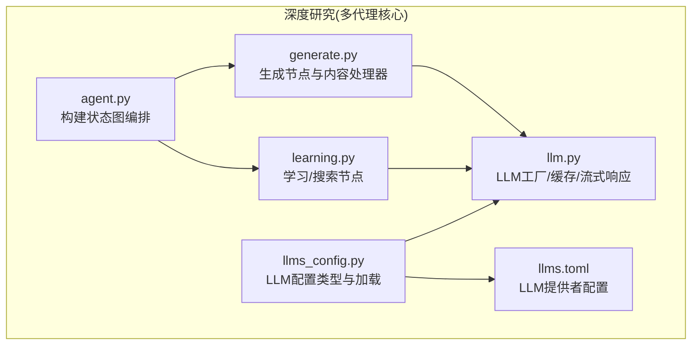
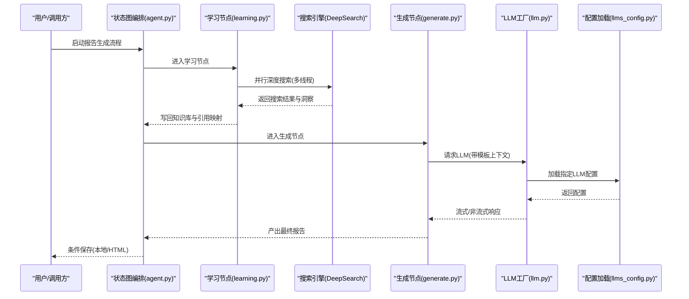
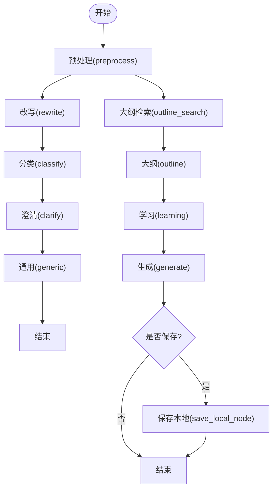
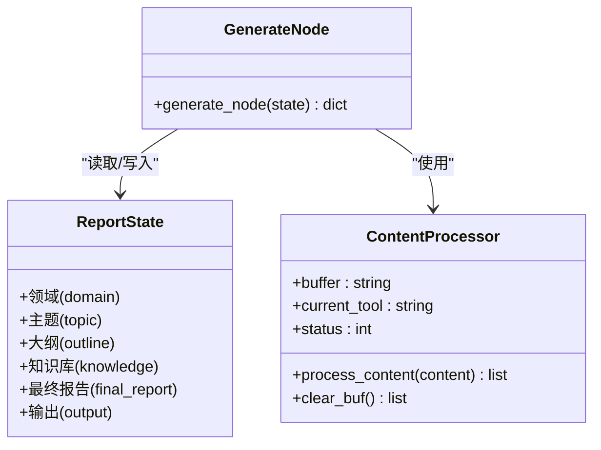
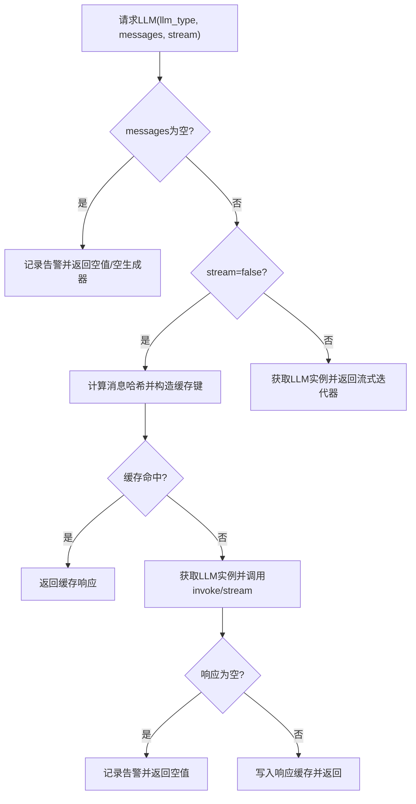
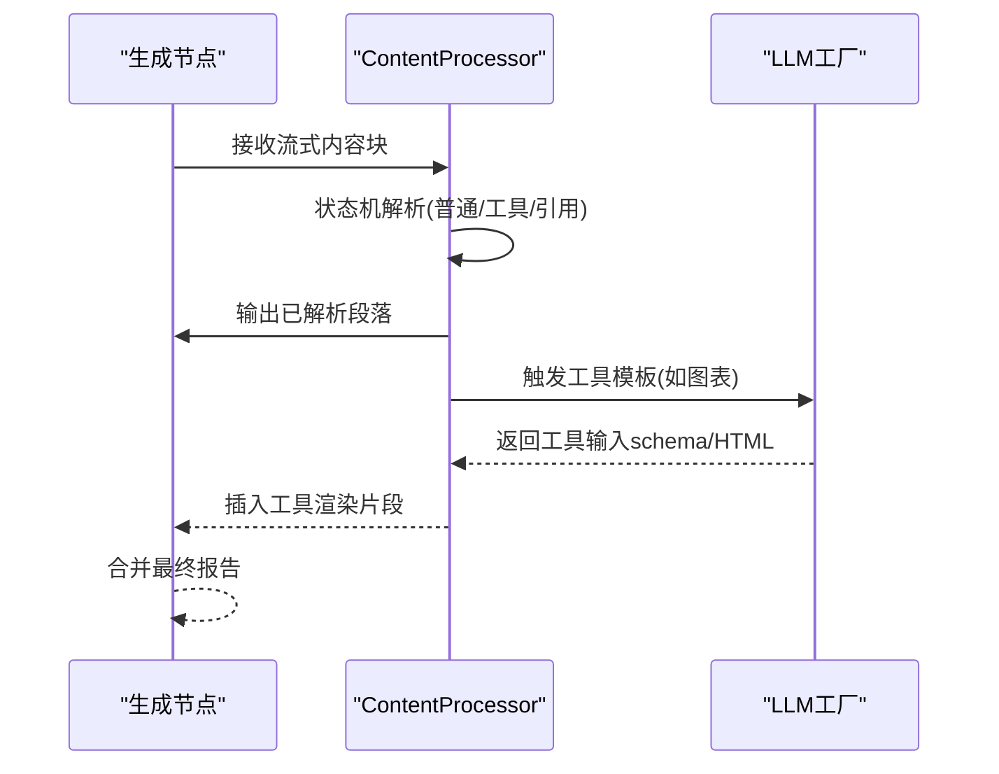
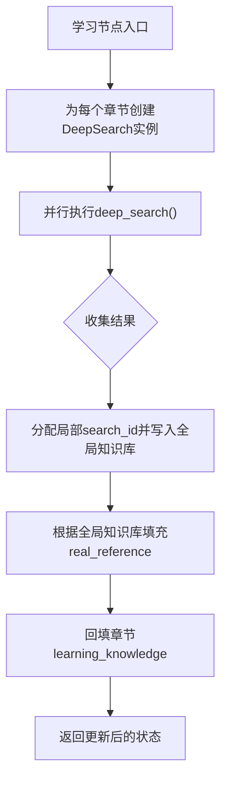
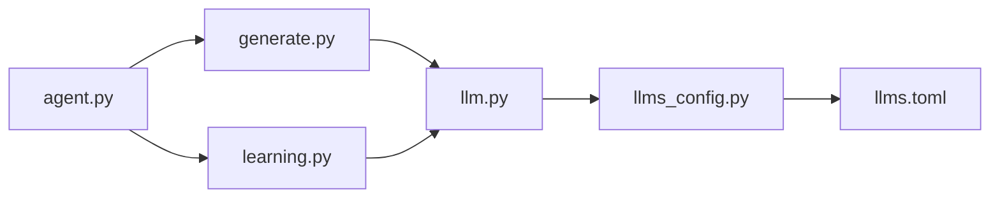

# 多代理核心架构

<cite>
**本文引用的文件**
- [agent.py](file://tools/DeepResearch/src/deepresearch/agent/agent.py)
- [generate.py](file://tools/DeepResearch/src/deepresearch/agent/generate.py)
- [learning.py](file://tools/DeepResearch/src/deepresearch/agent/learning.py)
- [llm.py](file://tools/DeepResearch/src/deepresearch/llms/llm.py)
- [llms_config.py](file://tools/DeepResearch/src/deepresearch/config/llms_config.py)
- [llms.toml](file://tools/DeepResearch/config/llms.toml)
</cite>

## 目录
1. [引言](#引言)
2. [项目结构](#项目结构)
3. [核心组件](#核心组件)
4. [架构总览](#架构总览)
5. [详细组件分析](#详细组件分析)
6. [依赖分析](#依赖分析)
7. [性能考虑](#性能考虑)
8. [故障排查指南](#故障排查指南)
9. [结论](#结论)
10. [附录](#附录)

## 引言
本技术文档聚焦于“多代理核心架构”，围绕以下目标展开：代理工厂模式与图编排、代理基类与模板系统、LLM 负载均衡与缓存、技能（工具）管理与调用链路、以及代理间通信与状态同步的工程化实践。文档以仓库中 Python 深度研究（DeepResearch）子系统为核心案例，结合前端 React 应用与多模块工作区，给出可操作的架构解读、流程图示与最佳实践建议。

## 项目结构
本项目采用多包工作区组织方式，核心的“多代理”能力集中在 tools/DeepResearch 子项目中；前端应用位于 apps/ 下的多个子应用。下图概览了与“多代理核心架构”直接相关的文件与模块：

图表来源
- [agent.py:19-45](file://tools/DeepResearch/src/deepresearch/agent/agent.py#L19-L45)
- [generate.py:26-111](file://tools/DeepResearch/src/deepresearch/agent/generate.py#L26-L111)
- [learning.py:15-93](file://tools/DeepResearch/src/deepresearch/agent/learning.py#L15-L93)
- [llm.py:146-256](file://tools/DeepResearch/src/deepresearch/llms/llm.py#L146-L256)
- [llms_config.py:46-86](file://tools/DeepResearch/src/deepresearch/config/llms_config.py#L46-L86)
- [llms.toml:1-29](file://tools/DeepResearch/config/llms.toml#L1-L29)

章节来源
- [agent.py:19-45](file://tools/DeepResearch/src/deepresearch/agent/agent.py#L19-L45)
- [llm.py:146-256](file://tools/DeepResearch/src/deepresearch/llms/llm.py#L146-L256)
- [llms_config.py:46-86](file://tools/DeepResearch/src/deepresearch/config/llms_config.py#L46-L86)
- [llms.toml:1-29](file://tools/DeepResearch/config/llms.toml#L1-L29)

## 核心组件
- 代理工厂与图编排：通过状态图（StateGraph）定义节点与条件边，形成“预处理-改写-分类-澄清-通用-大纲检索-大纲-学习-生成-保存”的完整流水线。
- 代理基类与模板系统：通过消息状态对象与提示词模板函数组合，将“领域、时间、查询、大纲、参考知识”等上下文注入到各节点。
- LLM 工厂与缓存：统一的 LLM 实例工厂，支持按类型、流式/非流式、最大 token 等参数创建实例；内置响应级 LRU 缓存与实例级 LRU 缓存，配合线程安全统计。
- 技能（工具）管理：在生成节点内对输出进行流式解析，识别表格/图表等工具标记，并调用相应提示模板生成可视化内容。
- 配置中心：集中管理 LLM 提供者配置，支持脱敏读取与热重载。

章节来源
- [agent.py:19-45](file://tools/DeepResearch/src/deepresearch/agent/agent.py#L19-L45)
- [generate.py:26-111](file://tools/DeepResearch/src/deepresearch/agent/generate.py#L26-L111)
- [llm.py:146-256](file://tools/DeepResearch/src/deepresearch/llms/llm.py#L146-L256)
- [llms_config.py:46-86](file://tools/DeepResearch/src/deepresearch/config/llms_config.py#L46-L86)

## 架构总览
下图展示了从“输入查询”到“报告生成与保存”的端到端流程，以及 LLM 工厂与配置加载的关键交互：

图表来源
- [agent.py:19-45](file://tools/DeepResearch/src/deepresearch/agent/agent.py#L19-L45)
- [learning.py:15-93](file://tools/DeepResearch/src/deepresearch/agent/learning.py#L15-L93)
- [generate.py:26-111](file://tools/DeepResearch/src/deepresearch/agent/generate.py#L26-L111)
- [llm.py:146-256](file://tools/DeepResearch/src/deepresearch/llms/llm.py#L146-L256)
- [llms_config.py:46-86](file://tools/DeepResearch/src/deepresearch/config/llms_config.py#L46-L86)

## 详细组件分析

### 代理工厂与状态图编排
- 组件职责
  - 定义节点集合与连接关系，形成“预处理-改写-分类-澄清-通用-大纲检索-大纲-学习-生成-保存”的闭环。
  - 使用条件边控制生成后的保存策略（本地或结束）。
- 关键点
  - 节点命名与顺序体现了“先检索/学习，后生成/保存”的工程化流程。
  - 条件边根据运行时配置决定是否进入保存节点，便于扩展其他导出格式。
- 可扩展性
  - 新增节点只需在图中添加节点与边，保持状态对象不变即可复用模板系统。

图表来源
- [agent.py:19-45](file://tools/DeepResearch/src/deepresearch/agent/agent.py#L19-L45)

章节来源
- [agent.py:19-45](file://tools/DeepResearch/src/deepresearch/agent/agent.py#L19-L45)

### 代理基类与模板系统
- 基类与状态
  - 通过消息状态对象承载“领域、主题、大纲、知识库、引用映射、最终报告”等字段，作为模板渲染的上下文。
- 模板系统
  - 在生成节点中，使用模板函数将上下文注入到提示词，确保不同阶段（如生成、图表）的提示具有一致的结构。
- 输出处理
  - 生成节点对流式响应进行增量拼接，并对“引用占位符”进行替换，保证引用编号与实际知识库一致。

图表来源
- [generate.py:26-111](file://tools/DeepResearch/src/deepresearch/agent/generate.py#L26-L111)
- [generate.py:169-295](file://tools/DeepResearch/src/deepresearch/agent/generate.py#L169-L295)

章节来源
- [generate.py:26-111](file://tools/DeepResearch/src/deepresearch/agent/generate.py#L26-L111)
- [generate.py:169-295](file://tools/DeepResearch/src/deepresearch/agent/generate.py#L169-L295)

### LLM 工厂、缓存与负载均衡
- 工厂模式
  - 通过工厂函数按类型创建 LLM 实例，统一注入温度、最大 token 等参数，并启用实例级 LRU 缓存，限制最大实例数避免内存膨胀。
- 响应缓存
  - 对消息哈希生成稳定缓存键，非流式响应命中缓存直接返回，显著降低重复请求成本。
- 流式与非流式
  - 支持两种模式：流式用于实时渲染思考与内容片段，非流式用于一次性生成并附加“思维内容”包装。
- 性能监控
  - 提供缓存命中率统计接口，便于运行期观测与调优。

图表来源
- [llm.py:146-256](file://tools/DeepResearch/src/deepresearch/llms/llm.py#L146-L256)

章节来源
- [llm.py:24-66](file://tools/DeepResearch/src/deepresearch/llms/llm.py#L24-L66)
- [llm.py:71-121](file://tools/DeepResearch/src/deepresearch/llms/llm.py#L71-L121)
- [llm.py:126-185](file://tools/DeepResearch/src/deepresearch/llms/llm.py#L126-L185)
- [llm.py:187-256](file://tools/DeepResearch/src/deepresearch/llms/llm.py#L187-L256)

### 技能管理与调用链路
- 技能注册
  - 在生成节点中定义可识别的工具标记（如表格、图表），通过模板函数生成工具所需的输入。
- 调用链路
  - ContentProcessor 对流式输出进行状态机解析，识别工具起止标签后触发对应提示模板，生成可视化内容并插入报告。
- 错误处理
  - 对空响应、异常流式迭代、模板解析失败等情况进行日志记录与降级处理，保证主流程不中断。

图表来源
- [generate.py:26-111](file://tools/DeepResearch/src/deepresearch/agent/generate.py#L26-L111)
- [generate.py:169-295](file://tools/DeepResearch/src/deepresearch/agent/generate.py#L169-L295)

章节来源
- [generate.py:26-111](file://tools/DeepResearch/src/deepresearch/agent/generate.py#L26-L111)
- [generate.py:169-295](file://tools/DeepResearch/src/deepresearch/agent/generate.py#L169-L295)

### 学习与搜索节点（并行化）
- 并行策略
  - 使用线程池对每个二级章节独立执行深度搜索，限制并发度避免 LLM API 抖动。
- 知识合并
  - 将全局知识库与章节内部学习到的知识进行引用 ID 映射，保证报告引用编号连续且唯一。
- 线程安全
  - 使用锁保护全局搜索 ID 分配与知识库追加，确保多线程写入一致性。

图表来源
- [learning.py:15-93](file://tools/DeepResearch/src/deepresearch/agent/learning.py#L15-L93)

章节来源
- [learning.py:15-93](file://tools/DeepResearch/src/deepresearch/agent/learning.py#L15-L93)

### 预设技能配置与LLM提供者管理
- 配置文件
  - 通过 TOML 文件集中管理不同角色（基础、澄清、规划、查询生成、评估、报告）的 LLM 提供者参数。
- 类型与加载
  - 使用数据类封装公共字段，提供从字典构造、懒加载与热重载能力，支持脱敏输出。
- 使用方式
  - 在各节点中按需选择 LLM 类型，LLM 工厂负责实例化与缓存。

章节来源
- [llms.toml:1-29](file://tools/DeepResearch/config/llms.toml#L1-L29)
- [llms_config.py:12-44](file://tools/DeepResearch/src/deepresearch/config/llms_config.py#L12-L44)
- [llms_config.py:46-86](file://tools/DeepResearch/src/deepresearch/config/llms_config.py#L46-L86)

## 依赖分析
- 组件耦合
  - 生成节点与学习节点均依赖 LLM 工厂；学习节点还依赖搜索引擎与工作流配置。
  - LLM 工厂依赖配置加载模块与具体 LLM SDK。
- 外部依赖
  - LangChain 消息类型与运行时配置；LangGraph 状态图；第三方 LLM SDK。
- 循环依赖
  - 当前模块间无循环导入；状态对象在节点间传递，避免了强耦合。

图表来源
- [agent.py:19-45](file://tools/DeepResearch/src/deepresearch/agent/agent.py#L19-L45)
- [generate.py:26-111](file://tools/DeepResearch/src/deepresearch/agent/generate.py#L26-L111)
- [learning.py:15-93](file://tools/DeepResearch/src/deepresearch/agent/learning.py#L15-L93)
- [llm.py:146-256](file://tools/DeepResearch/src/deepresearch/llms/llm.py#L146-L256)
- [llms_config.py:46-86](file://tools/DeepResearch/src/deepresearch/config/llms_config.py#L46-L86)

章节来源
- [agent.py:19-45](file://tools/DeepResearch/src/deepresearch/agent/agent.py#L19-L45)
- [generate.py:26-111](file://tools/DeepResearch/src/deepresearch/agent/generate.py#L26-L111)
- [learning.py:15-93](file://tools/DeepResearch/src/deepresearch/agent/learning.py#L15-L93)
- [llm.py:146-256](file://tools/DeepResearch/src/deepresearch/llms/llm.py#L146-L256)
- [llms_config.py:46-86](file://tools/DeepResearch/src/deepresearch/config/llms_config.py#L46-L86)

## 性能考虑
- LLM 实例与响应缓存
  - 控制实例数量上限与响应缓存容量，结合线程安全统计，平衡吞吐与内存占用。
- 并发与限流
  - 学习节点限制并发度，避免 API 限流与抖动；可根据下游服务 QPS 动态调整。
- 流式渲染
  - 利用流式响应提升用户体验，同时减少首屏等待时间。
- 日志与可观测性
  - 记录空响应、异常与缓存命中率，辅助定位瓶颈与优化参数。

## 故障排查指南
- 常见问题
  - LLM 配置缺失：检查配置文件是否存在与键名是否正确。
  - 空消息或空响应：确认模板上下文是否完整，查看日志告警。
  - 缓存未命中：确认消息哈希是否稳定，检查缓存键构造逻辑。
  - 并发异常：核对线程锁使用与全局状态访问路径。
- 排查步骤
  - 打开缓存统计接口，观察命中率与容量。
  - 在学习节点打印搜索结果与引用映射，验证 ID 分配。
  - 在生成节点开启调试输出，逐段比对工具解析与模板渲染。

章节来源
- [llm.py:146-256](file://tools/DeepResearch/src/deepresearch/llms/llm.py#L146-L256)
- [learning.py:15-93](file://tools/DeepResearch/src/deepresearch/agent/learning.py#L15-L93)
- [generate.py:26-111](file://tools/DeepResearch/src/deepresearch/agent/generate.py#L26-L111)

## 结论
该多代理核心架构以“状态图编排+LLM 工厂+模板系统+技能解析”为主线，实现了从“检索-学习-生成-保存”的闭环流程。通过实例与响应两级缓存、线程安全统计与并行搜索，兼顾性能与稳定性。建议在生产环境中结合可观测性指标持续优化缓存策略与并发参数，并完善错误恢复与重试机制。

## 附录

### 如何创建自定义代理
- 步骤
  - 在状态图中新增节点与边，遵循“先检索/学习，后生成/保存”的顺序。
  - 定义节点函数，读取/写入状态对象中的上下文字段。
  - 在模板系统中补充对应提示词，确保上下文完整。
- 示例路径
  - [agent.py:19-45](file://tools/DeepResearch/src/deepresearch/agent/agent.py#L19-L45)
  - [generate.py:26-111](file://tools/DeepResearch/src/deepresearch/agent/generate.py#L26-L111)

章节来源
- [agent.py:19-45](file://tools/DeepResearch/src/deepresearch/agent/agent.py#L19-L45)
- [generate.py:26-111](file://tools/DeepResearch/src/deepresearch/agent/generate.py#L26-L111)

### 如何配置LLM提供者
- 步骤
  - 在配置文件中新增提供者条目，填写基础 URL、API Base、模型与密钥。
  - 在配置加载模块中注册类型别名，以便在节点中按名称选择。
- 示例路径
  - [llms.toml:1-29](file://tools/DeepResearch/config/llms.toml#L1-L29)
  - [llms_config.py:88-115](file://tools/DeepResearch/src/deepresearch/config/llms_config.py#L88-L115)

章节来源
- [llms.toml:1-29](file://tools/DeepResearch/config/llms.toml#L1-L29)
- [llms_config.py:88-115](file://tools/DeepResearch/src/deepresearch/config/llms_config.py#L88-L115)

### 如何实现自定义技能
- 步骤
  - 在生成节点中扩展工具识别逻辑，增加新的 XML 标记与模板。
  - 在内容处理器中添加状态机分支，解析新工具的输入并生成输出。
- 示例路径
  - [generate.py:169-295](file://tools/DeepResearch/src/deepresearch/agent/generate.py#L169-L295)

章节来源
- [generate.py:169-295](file://tools/DeepResearch/src/deepresearch/agent/generate.py#L169-L295)

### 代理间通信协议与状态同步
- 协议建议
  - 以“状态对象”作为跨节点通信载体，避免直接共享可变状态。
  - 使用“条件边”表达分支逻辑，确保流程可控与可观测。
- 资源管理
  - 对全局计数器（如搜索 ID）使用锁保护；对全局知识库采用原子追加与延迟填充引用映射。
- 最佳实践
  - 将“配置加载”与“实例工厂”解耦，便于热重载与灰度发布。
  - 对外部调用（LLM、搜索）设置超时与重试，增强鲁棒性。

章节来源
- [learning.py:15-93](file://tools/DeepResearch/src/deepresearch/agent/learning.py#L15-L93)
- [llm.py:146-256](file://tools/DeepResearch/src/deepresearch/llms/llm.py#L146-L256)