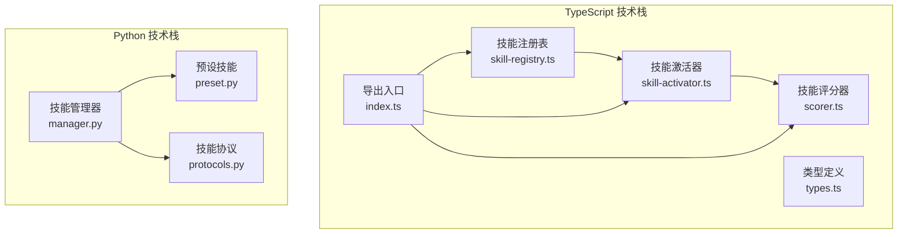
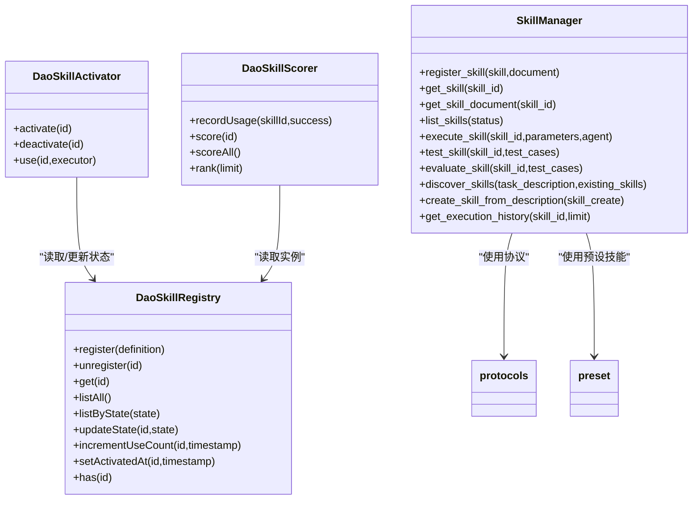
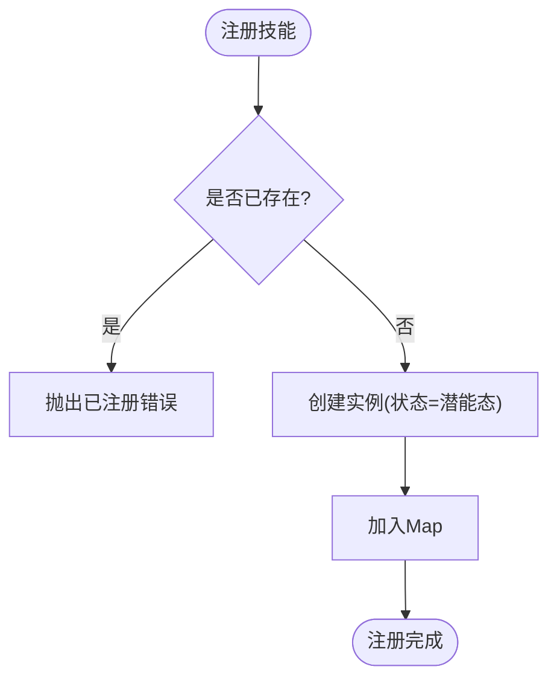
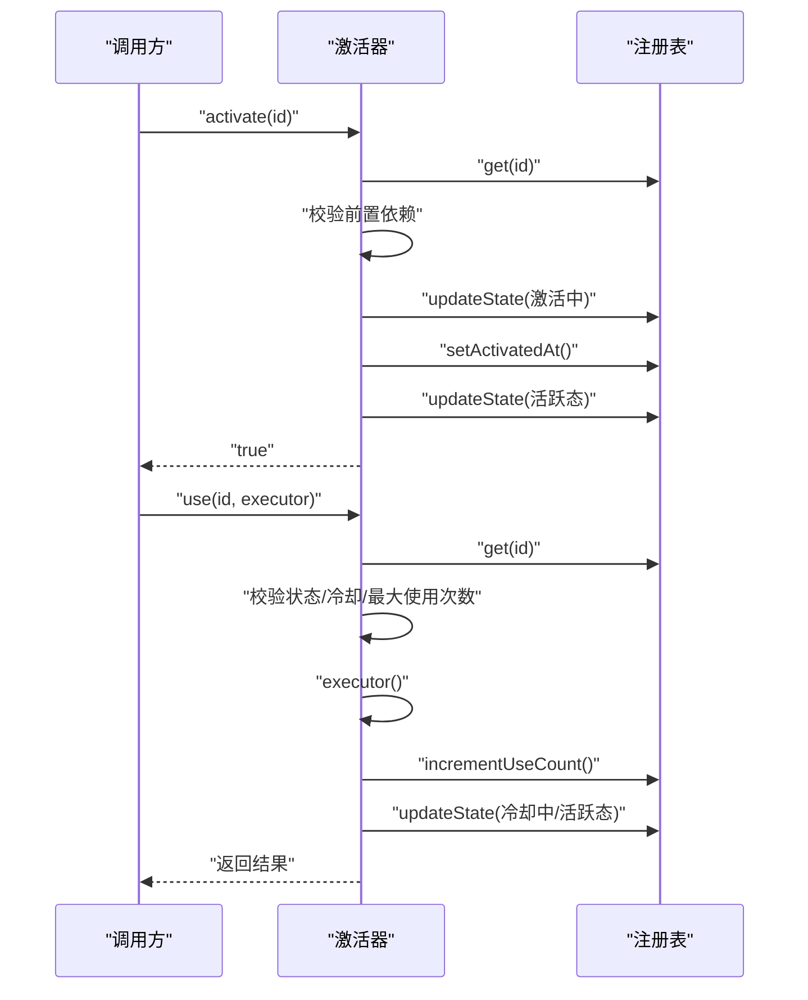
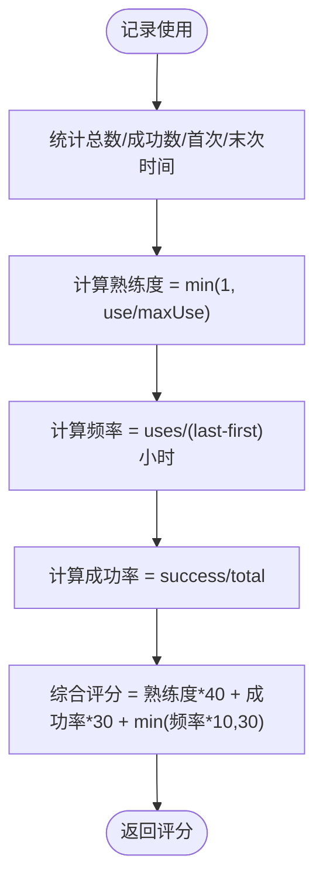
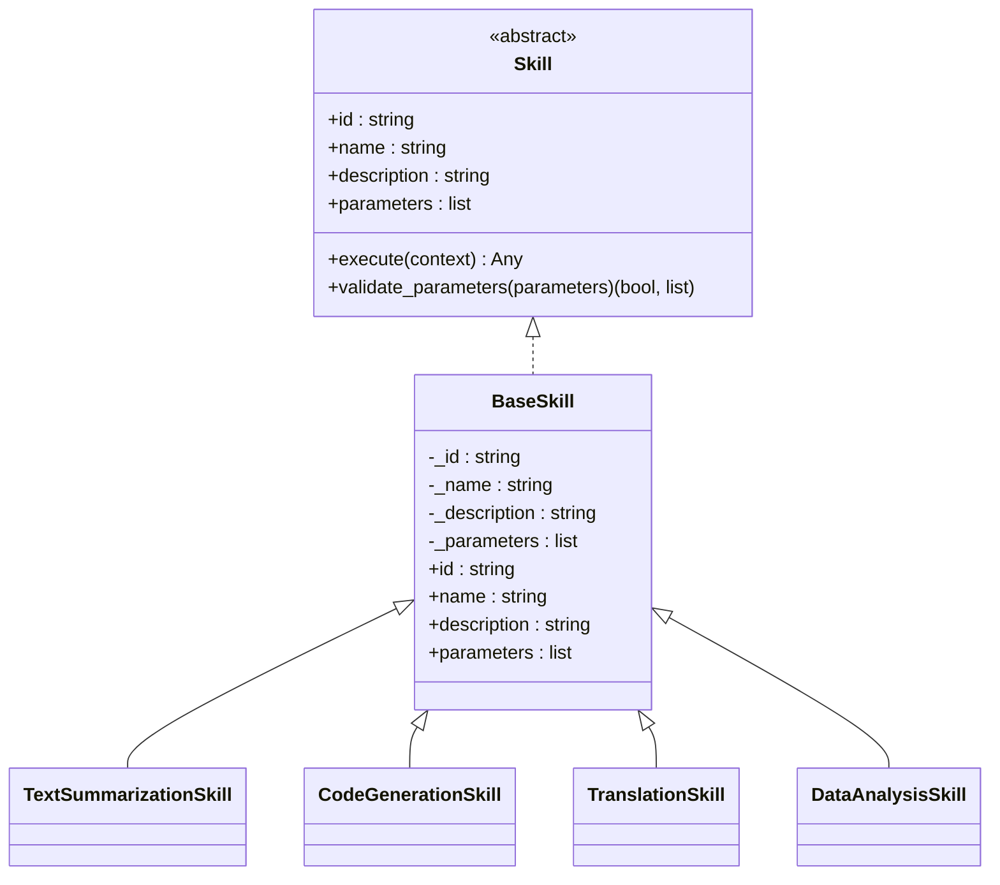
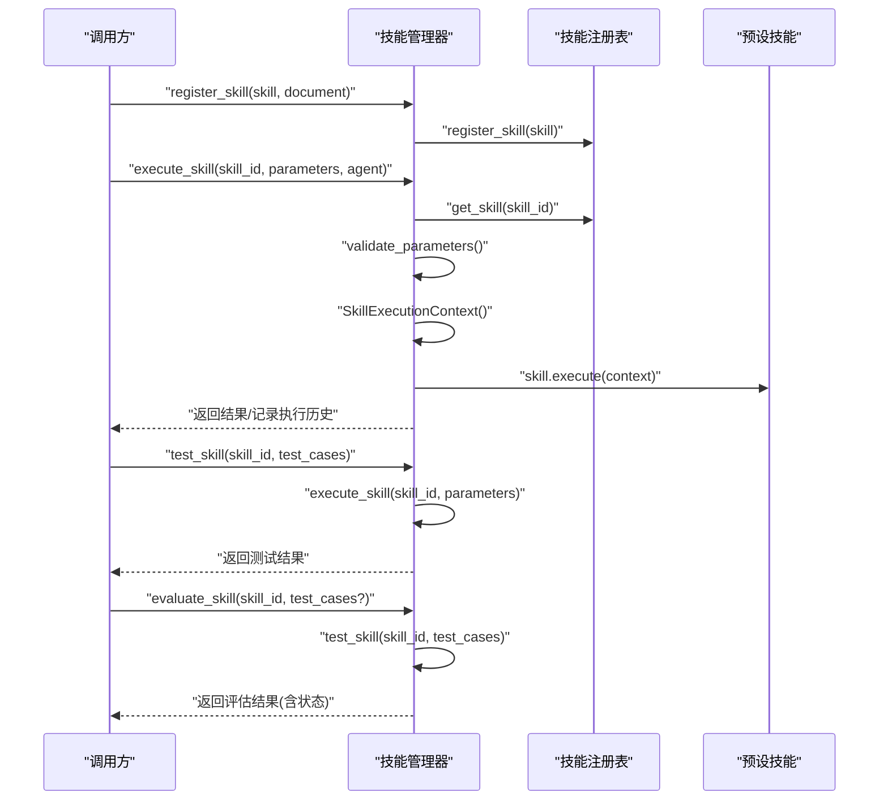
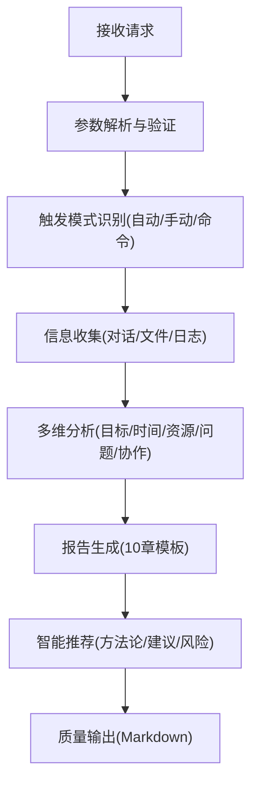
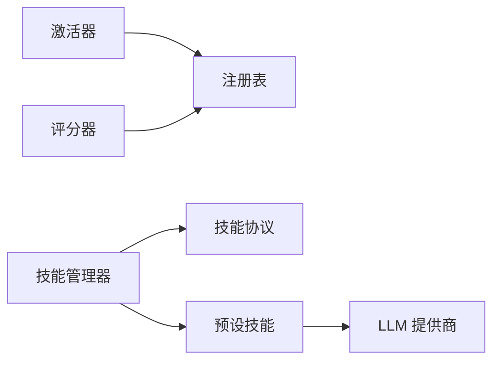

# 技能管理系统

<cite>
**本文引用的文件**
- [skill-registry.ts](file://apps/DaoMind/packages/daoSkilLs/src/skill-registry.ts)
- [skill-activator.ts](file://apps/DaoMind/packages/daoSkilLs/src/skill-activator.ts)
- [types.ts](file://apps/DaoMind/packages/daoSkilLs/src/types.ts)
- [index.ts](file://apps/DaoMind/packages/daoSkilLs/src/index.ts)
- [scorer.ts](file://apps/DaoMind/packages/daoSkilLs/src/scorer.ts)
- [skill-registry.test.ts](file://apps/DaoMind/packages/daoSkilLs/src/__tests__/skill-registry.test.ts)
- [SKILL.md](file://skills/daoSkilLs/skills/task-execution-summary/SKILL.md)
- [execution-flow.md](file://skills/daoSkilLs/skills/task-execution-summary/references/execution-flow.md)
- [templates.md](file://skills/daoSkilLs/skills/task-execution-summary/references/templates.md)
- [manager.py](file://tools/flexloop/src/taolib/testing/multi_agent/skills/manager.py)
- [preset.py](file://tools/flexloop/src/taolib/testing/multi_agent/skills/preset.py)
- [protocols.py](file://tools/flexloop/src/taolib/testing/multi_agent/skills/protocols.py)
</cite>

## 目录
1. [简介](#简介)
2. [项目结构](#项目结构)
3. [核心组件](#核心组件)
4. [架构总览](#架构总览)
5. [详细组件分析](#详细组件分析)
6. [依赖分析](#依赖分析)
7. [性能考虑](#性能考虑)
8. [故障排查指南](#故障排查指南)
9. [结论](#结论)
10. [附录](#附录)

## 简介
本文件系统性阐述“技能管理系统”的设计与实现，覆盖技能注册表、技能生命周期与调用链路、技能评分与组合、预设技能系统、技能协议与错误处理、性能监控与版本管理等主题。文档同时提供可操作的实践指引，帮助读者创建自定义技能、注册到系统、实现技能组合，并在真实场景中落地。

## 项目结构
技能管理系统由 TypeScript 技术栈的“daoSkilLs”包与 Python 技术栈的“flexloop”工具共同构成，分别提供前端/应用侧的技能注册与生命周期管理，以及多智能体场景下的技能管理器、预设技能与协议定义。

- TypeScript 技术栈（应用侧）
  - 注册表：维护技能的注册、查询、状态与使用计数
  - 激活器：负责技能激活、冷却与使用控制
  - 评分器：基于使用频度、成功率与熟练度计算综合评分
  - 类型定义：统一技能 ID、状态、定义与评分结构
  - 导出入口：聚合导出注册表、激活器、评分器与组合器

- Python 技术栈（多智能体侧）
  - 技能管理器：统一管理技能的注册、执行、测试、评估与发现
  - 预设技能：内置文本摘要、代码生成、翻译、数据分析等常用技能
  - 技能协议：定义技能接口、参数校验与执行上下文

**图表来源**
- [skill-registry.ts:1-73](file://apps/DaoMind/packages/daoSkilLs/src/skill-registry.ts#L1-L73)
- [skill-activator.ts:1-83](file://apps/DaoMind/packages/daoSkilLs/src/skill-activator.ts#L1-L83)
- [scorer.ts:1-80](file://apps/DaoMind/packages/daoSkilLs/src/scorer.ts#L1-L80)
- [types.ts:1-43](file://apps/DaoMind/packages/daoSkilLs/src/types.ts#L1-L43)
- [index.ts:1-14](file://apps/DaoMind/packages/daoSkilLs/src/index.ts#L1-L14)
- [manager.py:1-404](file://tools/flexloop/src/taolib/testing/multi_agent/skills/manager.py#L1-L404)
- [preset.py:1-217](file://tools/flexloop/src/taolib/testing/multi_agent/skills/preset.py#L1-L217)
- [protocols.py:1-143](file://tools/flexloop/src/taolib/testing/multi_agent/skills/protocols.py#L1-L143)

**章节来源**
- [skill-registry.ts:1-73](file://apps/DaoMind/packages/daoSkilLs/src/skill-registry.ts#L1-L73)
- [skill-activator.ts:1-83](file://apps/DaoMind/packages/daoSkilLs/src/skill-activator.ts#L1-L83)
- [scorer.ts:1-80](file://apps/DaoMind/packages/daoSkilLs/src/scorer.ts#L1-L80)
- [types.ts:1-43](file://apps/DaoMind/packages/daoSkilLs/src/types.ts#L1-L43)
- [index.ts:1-14](file://apps/DaoMind/packages/daoSkilLs/src/index.ts#L1-L14)
- [manager.py:1-404](file://tools/flexloop/src/taolib/testing/multi_agent/skills/manager.py#L1-L404)
- [preset.py:1-217](file://tools/flexloop/src/taolib/testing/multi_agent/skills/preset.py#L1-L217)
- [protocols.py:1-143](file://tools/flexloop/src/taolib/testing/multi_agent/skills/protocols.py#L1-L143)

## 核心组件
- 技能注册表（DaoSkillRegistry）
  - 职责：技能注册、注销、查询、状态枚举、使用计数与激活时间记录
  - 关键能力：按状态筛选、存在性检查、批量列举
- 技能激活器（DaoSkillActivator）
  - 职责：激活/停用技能、使用前校验（依赖、冷却、最大使用次数）、冷却定时器
  - 关键能力：依赖前置条件校验、冷却与耗尽状态管理
- 技能评分器（DaoSkillScorer）
  - 职责：记录使用统计、计算熟练度、使用频率、成功率与综合评分
  - 关键能力：按技能排名、综合评分聚合
- 技能协议（Skill/Protocols）
  - 职责：定义技能接口、参数校验、执行上下文
  - 关键能力：抽象技能行为、统一参数契约
- 预设技能（Preset Skills）
  - 职责：提供常用技能模板（摘要、代码生成、翻译、数据分析）
  - 关键能力：参数化、可扩展、可回退

**章节来源**
- [skill-registry.ts:7-69](file://apps/DaoMind/packages/daoSkilLs/src/skill-registry.ts#L7-L69)
- [skill-activator.ts:8-79](file://apps/DaoMind/packages/daoSkilLs/src/skill-activator.ts#L8-L79)
- [scorer.ts:15-77](file://apps/DaoMind/packages/daoSkilLs/src/scorer.ts#L15-L77)
- [protocols.py:34-143](file://tools/flexloop/src/taolib/testing/multi_agent/skills/protocols.py#L34-L143)
- [preset.py:12-217](file://tools/flexloop/src/taolib/testing/multi_agent/skills/preset.py#L12-L217)

## 架构总览
技能系统采用“注册表 + 激活器 + 评分器”的基础架构，并通过导出入口统一对外暴露。在多智能体场景下，技能管理器承担更高层的职责，包括技能注册、执行、测试、评估与发现。

**图表来源**
- [skill-registry.ts:7-69](file://apps/DaoMind/packages/daoSkilLs/src/skill-registry.ts#L7-L69)
- [skill-activator.ts:8-79](file://apps/DaoMind/packages/daoSkilLs/src/skill-activator.ts#L8-L79)
- [scorer.ts:15-77](file://apps/DaoMind/packages/daoSkilLs/src/scorer.ts#L15-L77)
- [manager.py:29-404](file://tools/flexloop/src/taolib/testing/multi_agent/skills/manager.py#L29-L404)
- [protocols.py:34-143](file://tools/flexloop/src/taolib/testing/multi_agent/skills/protocols.py#L34-L143)
- [preset.py:12-217](file://tools/flexloop/src/taolib/testing/multi_agent/skills/preset.py#L12-L217)

## 详细组件分析

### 技能注册表（DaoSkillRegistry）
- 设计原则
  - 技能注册即进入“潜能态”，待机而动
  - 通过 Map 维护技能实例，提供高效查询与状态管理
- 关键数据结构
  - 技能实例包含：定义、状态、使用计数、最近使用时间、激活时间
- 关键方法
  - 注册/注销/查询/列举/状态更新/使用计数/激活时间设置/存在性检查

**图表来源**
- [skill-registry.ts:10-20](file://apps/DaoMind/packages/daoSkilLs/src/skill-registry.ts#L10-L20)

**章节来源**
- [skill-registry.ts:7-69](file://apps/DaoMind/packages/daoSkilLs/src/skill-registry.ts#L7-L69)
- [skill-registry.test.ts:14-27](file://apps/DaoMind/packages/daoSkilLs/src/__tests__/skill-registry.test.ts#L14-L27)

### 技能激活器（DaoSkillActivator）
- 生命周期控制
  - 激活：前置依赖全部为“活跃态”方可进入“激活中”并转为“活跃态”
  - 停用：从“活跃态”回到“潜能态”
  - 使用：校验状态、冷却时间、最大使用次数；执行后更新计数与状态
- 冷却机制
  - 使用后进入“冷却中”，到期自动回到“活跃态”

**图表来源**
- [skill-activator.ts:10-78](file://apps/DaoMind/packages/daoSkilLs/src/skill-activator.ts#L10-L78)
- [skill-registry.ts:44-64](file://apps/DaoMind/packages/daoSkilLs/src/skill-registry.ts#L44-L64)

**章节来源**
- [skill-activator.ts:8-79](file://apps/DaoMind/packages/daoSkilLs/src/skill-activator.ts#L8-L79)

### 技能评分器（DaoSkillScorer）
- 评分维度
  - 熟练度：基于使用次数与最大使用次数的比例
  - 使用频率：单位时间内使用次数
  - 成功率：成功使用次数占比
  - 综合评分：加权聚合
- 排名
  - 支持按综合评分排序与限制数量

**图表来源**
- [scorer.ts:18-76](file://apps/DaoMind/packages/daoSkilLs/src/scorer.ts#L18-L76)

**章节来源**
- [scorer.ts:15-77](file://apps/DaoMind/packages/daoSkilLs/src/scorer.ts#L15-L77)

### 技能协议与预设技能（Python）
- 技能协议（Skill/Protocol）
  - 抽象技能接口：id/name/description/parameters/execute
  - 参数校验：类型与必填项检查
  - 执行上下文：封装参数、LLM 提供商与代理
- 预设技能（Preset Skills）
  - 文本摘要、代码生成、翻译、数据分析
  - 参数化与可回退（无 LLM 时的降级）

**图表来源**
- [protocols.py:34-143](file://tools/flexloop/src/taolib/testing/multi_agent/skills/protocols.py#L34-L143)
- [preset.py:12-217](file://tools/flexloop/src/taolib/testing/multi_agent/skills/preset.py#L12-L217)

**章节来源**
- [protocols.py:12-143](file://tools/flexloop/src/taolib/testing/multi_agent/skills/protocols.py#L12-L143)
- [preset.py:12-217](file://tools/flexloop/src/taolib/testing/multi_agent/skills/preset.py#L12-L217)

### 技能管理器（Python）
- 职责
  - 注册/获取/列举技能
  - 执行技能（参数校验、上下文构建、异常记录）
  - 测试与评估（成功率、状态判定）
  - 发现技能（关键词匹配）
  - 创建技能（描述驱动）
  - 执行历史记录
- 与协议/预设技能的关系
  - 通过协议统一技能行为
  - 通过预设技能提供开箱即用能力

**图表来源**
- [manager.py:48-284](file://tools/flexloop/src/taolib/testing/multi_agent/skills/manager.py#L48-L284)
- [protocols.py:34-143](file://tools/flexloop/src/taolib/testing/multi_agent/skills/protocols.py#L34-L143)
- [preset.py:12-217](file://tools/flexloop/src/taolib/testing/multi_agent/skills/preset.py#L12-L217)

**章节来源**
- [manager.py:29-404](file://tools/flexloop/src/taolib/testing/multi_agent/skills/manager.py#L29-L404)

### 预设技能系统与模板（内置模板）
- 内置技能
  - 文本摘要、代码生成、翻译、数据分析
  - 参数化与默认值，支持 LLM 回退
- 报告模板（任务执行总结）
  - 摘要版、标准版、详细版
  - 10 章结构、章节选择、语言风格、输出格式
  - 触发条件、执行流程、错误处理与质量输出

**图表来源**
- [SKILL.md:135-191](file://skills/daoSkilLs/skills/task-execution-summary/SKILL.md#L135-L191)
- [execution-flow.md:173-474](file://skills/daoSkilLs/skills/task-execution-summary/references/execution-flow.md#L173-L474)
- [templates.md:17-742](file://skills/daoSkilLs/skills/task-execution-summary/references/templates.md#L17-L742)

**章节来源**
- [SKILL.md:1-364](file://skills/daoSkilLs/skills/task-execution-summary/SKILL.md#L1-L364)
- [execution-flow.md:1-1783](file://skills/daoSkilLs/skills/task-execution-summary/references/execution-flow.md#L1-L1783)
- [templates.md:1-2000](file://skills/daoSkilLs/skills/task-execution-summary/references/templates.md#L1-L2000)

## 依赖分析
- 组件耦合
  - 激活器依赖注册表进行状态读写
  - 评分器依赖注册表读取实例与使用计数
  - 技能管理器依赖协议与预设技能，统一执行与评估
- 外部依赖
  - LLM 提供商（Python 预设技能在无 LLM 时提供回退）
  - 文件系统（任务执行总结报告的保存与转换）

**图表来源**
- [skill-activator.ts:5-6](file://apps/DaoMind/packages/daoSkilLs/src/skill-activator.ts#L5-L6)
- [scorer.ts:5-6](file://apps/DaoMind/packages/daoSkilLs/src/scorer.ts#L5-L6)
- [manager.py:18-26](file://tools/flexloop/src/taolib/testing/multi_agent/skills/manager.py#L18-L26)
- [preset.py:50-102](file://tools/flexloop/src/taolib/testing/multi_agent/skills/preset.py#L50-L102)

**章节来源**
- [skill-activator.ts:1-83](file://apps/DaoMind/packages/daoSkilLs/src/skill-activator.ts#L1-L83)
- [scorer.ts:1-80](file://apps/DaoMind/packages/daoSkilLs/src/scorer.ts#L1-L80)
- [manager.py:1-404](file://tools/flexloop/src/taolib/testing/multi_agent/skills/manager.py#L1-L404)
- [preset.py:1-217](file://tools/flexloop/src/taolib/testing/multi_agent/skills/preset.py#L1-L217)

## 性能考虑
- 注册表与激活器
  - Map 查询与状态更新为 O(1)，适合高并发场景
  - 冷却使用 setTimeout，注意内存与定时器清理
- 评分器
  - 使用频率计算基于时间跨度，注意长时间运行的统计精度
- 报告生成
  - 信息收集与分析阶段为性能瓶颈，建议缓存中间结果与分批处理
- 多智能体场景
  - 执行历史记录与测试评估可能产生大量数据，建议限流与落盘

[本节为通用指导，无需特定文件引用]

## 故障排查指南
- 技能不存在/不可用
  - 激活器会在技能不存在或状态非“活跃态”时抛出错误
- 冷却中/已耗尽
  - 使用前检查冷却时间与最大使用次数，避免重复触发
- 参数校验失败
  - Python 预设技能提供参数类型与必填项校验，按错误提示修正
- 执行失败
  - 技能管理器记录失败原因与时间，结合执行历史定位问题
- 报告质量
  - 参考错误码与质量检查清单，必要时降级继续或补充信息

**章节来源**
- [skill-activator.ts:38-78](file://apps/DaoMind/packages/daoSkilLs/src/skill-activator.ts#L38-L78)
- [protocols.py:73-98](file://tools/flexloop/src/taolib/testing/multi_agent/skills/protocols.py#L73-L98)
- [manager.py:134-170](file://tools/flexloop/src/taolib/testing/multi_agent/skills/manager.py#L134-L170)
- [SKILL.md:244-284](file://skills/daoSkilLs/skills/task-execution-summary/SKILL.md#L244-L284)

## 结论
技能管理系统通过“注册表 + 激活器 + 评分器”的基础能力，结合“协议 + 预设技能 + 管理器”的扩展能力，提供了从技能定义、生命周期管理到执行评估与发现的完整闭环。在多智能体场景下，技能管理器进一步增强了自动化与可维护性。建议在生产环境中结合性能监控、版本管理与兼容性检查，持续优化技能的稳定性与可复用性。

[本节为总结性内容，无需特定文件引用]

## 附录

### 代码示例路径（不展示具体代码，仅提供路径）
- 创建自定义技能（TypeScript）
  - [types.ts:16-34](file://apps/DaoMind/packages/daoSkilLs/src/types.ts#L16-L34) 技能定义结构
  - [index.ts:5-9](file://apps/DaoMind/packages/daoSkilLs/src/index.ts#L5-L9) 导出注册表/激活器/评分器
- 注册技能到系统（TypeScript）
  - [skill-registry.ts:10-20](file://apps/DaoMind/packages/daoSkilLs/src/skill-registry.ts#L10-L20) 注册方法
  - [skill-activator.ts:10-30](file://apps/DaoMind/packages/daoSkilLs/src/skill-activator.ts#L10-L30) 激活方法
- 实现技能组合（Python）
  - [manager.py:286-323](file://tools/flexloop/src/taolib/testing/multi_agent/skills/manager.py#L286-L323) 发现技能
  - [protocols.py:34-72](file://tools/flexloop/src/taolib/testing/multi_agent/skills/protocols.py#L34-L72) 抽象执行接口
- 报告模板与触发条件
  - [SKILL.md:82-191](file://skills/daoSkilLs/skills/task-execution-summary/SKILL.md#L82-L191) 触发条件与执行流程
  - [templates.md:168-742](file://skills/daoSkilLs/skills/task-execution-summary/references/templates.md#L168-L742) 模板结构与变体

**章节来源**
- [types.ts:16-43](file://apps/DaoMind/packages/daoSkilLs/src/types.ts#L16-L43)
- [index.ts:5-9](file://apps/DaoMind/packages/daoSkilLs/src/index.ts#L5-L9)
- [skill-registry.ts:10-20](file://apps/DaoMind/packages/daoSkilLs/src/skill-registry.ts#L10-L20)
- [skill-activator.ts:10-30](file://apps/DaoMind/packages/daoSkilLs/src/skill-activator.ts#L10-L30)
- [manager.py:286-323](file://tools/flexloop/src/taolib/testing/multi_agent/skills/manager.py#L286-L323)
- [protocols.py:34-72](file://tools/flexloop/src/taolib/testing/multi_agent/skills/protocols.py#L34-L72)
- [SKILL.md:82-191](file://skills/daoSkilLs/skills/task-execution-summary/SKILL.md#L82-L191)
- [templates.md:168-742](file://skills/daoSkilLs/skills/task-execution-summary/references/templates.md#L168-L742)