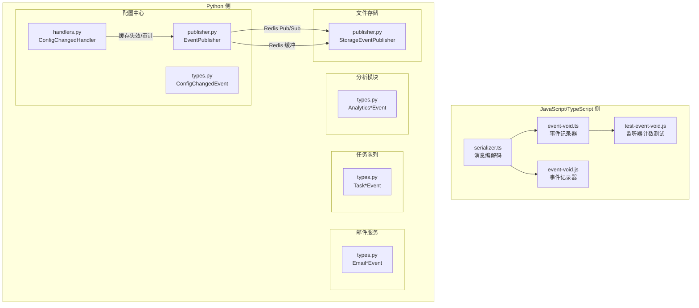
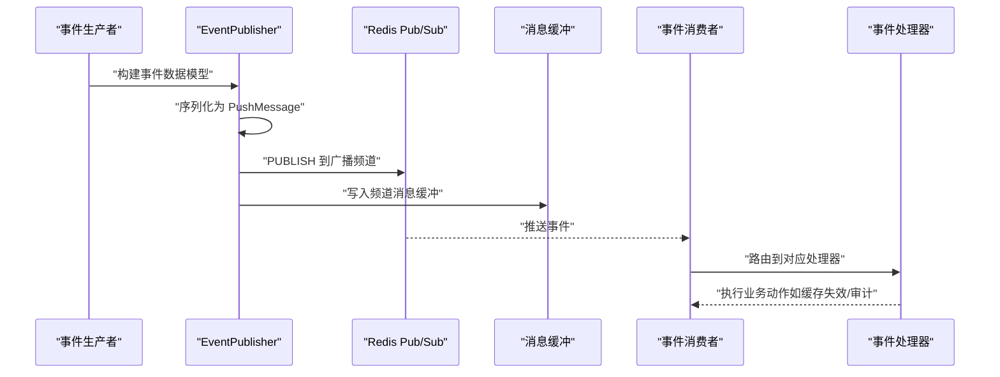
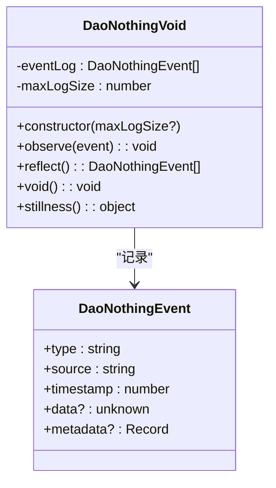
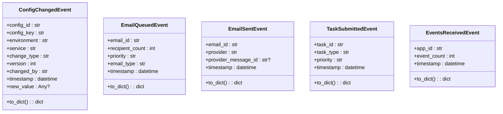
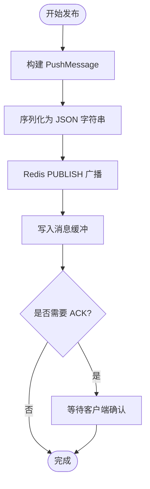
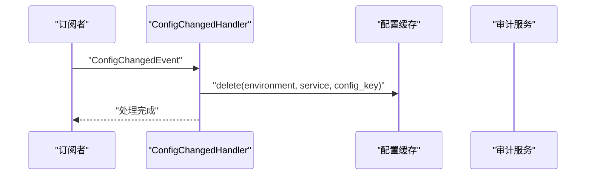
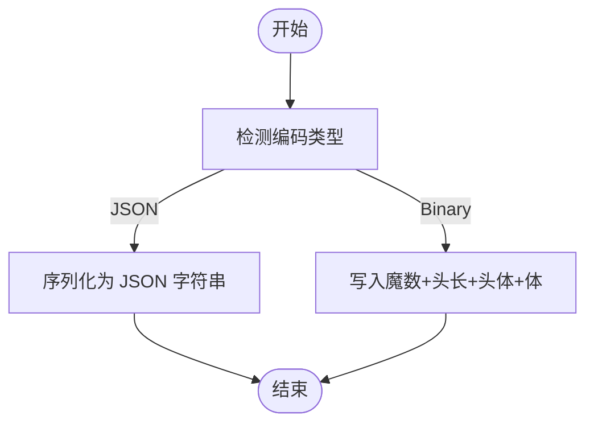
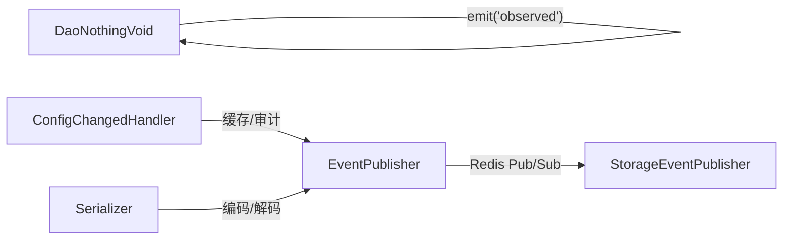

# 事件模型

<cite>
**本文引用的文件**
- [event-void.ts](file://apps/DaoMind/packages/daoNothing/src/event-void.ts)
- [event-void.js](file://apps/DaoMind/packages/daoNothing/src/event-void.js)
- [test-event-void.js](file://apps/DaoMind/test-event-void.js)
- [types.py（配置中心）](file://tools/flexloop/src/taolib/testing/config_center/events/types.py)
- [handlers.py（配置中心）](file://tools/flexloop/src/taolib/testing/config_center/events/handlers.py)
- [publisher.py（配置中心）](file://tools/flexloop/src/taolib/testing/config_center/events/publisher.py)
- [types.py（分析模块）](file://tools/flexloop/src/taolib/testing/analytics/events/types.py)
- [types.py（邮件服务）](file://tools/flexloop/src/taolib/testing/email_service/events/types.py)
- [types.py（任务队列）](file://tools/flexloop/src/taolib/testing/task_queue/events/types.py)
- [publisher.py（文件存储）](file://tools/flexloop/src/taolib/testing/file_storage/events/publisher.py)
- [serializer.ts（消息编解码）](file://apps/DaoMind/packages/daoQi/src/codec/serializer.ts)
- [test_events.py（邮件事件测试）](file://tools/flexloop/tests/testing/test_email_service/test_events.py)
</cite>

## 目录
1. [简介](#简介)
2. [项目结构](#项目结构)
3. [核心组件](#核心组件)
4. [架构总览](#架构总览)
5. [详细组件分析](#详细组件分析)
6. [依赖分析](#依赖分析)
7. [性能考虑](#性能考虑)
8. [故障排查指南](#故障排查指南)
9. [结论](#结论)
10. [附录](#附录)

## 简介
本文件系统性梳理并文档化仓库中的事件模型模块，覆盖以下主题：
- 事件数据模型设计：事件类型定义、字段结构与关系映射
- 事件枚举与分类：事件分类、状态管理与优先级设置
- 事件类型系统：基础事件、派生事件与复合事件的定义方式
- 事件序列化与反序列化：JSON 与二进制编码、压缩策略
- 实践示例：定义新事件类型、实现事件处理器、配置事件过滤
- 生命周期、数据校验与性能优化最佳实践

## 项目结构
事件模型在两个主要区域落地：
- JavaScript/TypeScript 侧：以“道之无（DaoNothingVoid）”为代表的纯观察者事件记录器，提供事件静默记录与状态查询能力
- Python 侧：以配置中心、邮件服务、任务队列、分析模块等子系统为核心，采用 dataclass 定义事件数据模型，并通过发布器将事件广播至 Redis Pub/Sub

图表来源
- [event-void.ts:1-69](file://apps/DaoMind/packages/daoNothing/src/event-void.ts#L1-L69)
- [event-void.js:1-42](file://apps/DaoMind/packages/daoNothing/src/event-void.js#L1-L42)
- [test-event-void.js:1-24](file://apps/DaoMind/test-event-void.js#L1-L24)
- [serializer.ts:1-74](file://apps/DaoMind/packages/daoQi/src/codec/serializer.ts#L1-L74)
- [types.py（配置中心）:1-52](file://tools/flexloop/src/taolib/testing/config_center/events/types.py#L1-L52)
- [handlers.py（配置中心）:1-38](file://tools/flexloop/src/taolib/testing/config_center/events/handlers.py#L1-L38)
- [publisher.py（配置中心）:1-194](file://tools/flexloop/src/taolib/testing/config_center/events/publisher.py#L1-L194)
- [types.py（邮件服务）:1-157](file://tools/flexloop/src/taolib/testing/email_service/events/types.py#L1-L157)
- [types.py（任务队列）:1-107](file://tools/flexloop/src/taolib/testing/task_queue/events/types.py#L1-L107)
- [types.py（分析模块）:1-45](file://tools/flexloop/src/taolib/testing/analytics/events/types.py#L1-L45)
- [publisher.py（文件存储）:1-56](file://tools/flexloop/src/taolib/testing/file_storage/events/publisher.py#L1-L56)

章节来源
- [event-void.ts:1-69](file://apps/DaoMind/packages/daoNothing/src/event-void.ts#L1-L69)
- [types.py（配置中心）:1-52](file://tools/flexloop/src/taolib/testing/config_center/events/types.py#L1-L52)
- [publisher.py（配置中心）:1-194](file://tools/flexloop/src/taolib/testing/config_center/events/publisher.py#L1-L194)

## 核心组件
- 事件记录器（DaoNothingVoid）
  - 提供 observe/reflect/void/stillness 等能力，记录事件并暴露监听器统计
  - 适合在系统中作为“无为”的观察者，不干预业务流程
- 事件数据模型（Python dataclass）
  - 使用 dataclass 定义不可变事件数据结构，统一 to_dict 序列化接口
  - 事件字段涵盖类型、来源、时间戳、数据载荷与元数据
- 事件发布器（EventPublisher）
  - 将事件封装为 PushMessage，基于 Redis Pub/Sub 广播
  - 支持优先级、ACK、批量发布与消息缓冲，保障至少一次投递
- 事件处理器（Handlers）
  - 针对具体事件类型执行业务动作（如缓存失效、审计）
- 消息编解码（Serializer）
  - 支持 JSON 与二进制编码，自动识别头部魔数进行解析
  - 二进制编码包含头部长度与体内容量，便于高效传输

章节来源
- [event-void.ts:1-69](file://apps/DaoMind/packages/daoNothing/src/event-void.ts#L1-L69)
- [types.py（配置中心）:1-52](file://tools/flexloop/src/taolib/testing/config_center/events/types.py#L1-L52)
- [publisher.py（配置中心）:1-194](file://tools/flexloop/src/taolib/testing/config_center/events/publisher.py#L1-L194)
- [handlers.py（配置中心）:1-38](file://tools/flexloop/src/taolib/testing/config_center/events/handlers.py#L1-L38)
- [serializer.ts:1-74](file://apps/DaoMind/packages/daoQi/src/codec/serializer.ts#L1-L74)

## 架构总览
事件模型采用“生产-分发-消费”的流水线式架构：
- 生产端：各子系统生成事件数据模型（dataclass）
- 分发端：发布器将事件序列化后通过 Redis 广播，并写入消息缓冲
- 消费端：订阅者接收事件，按需执行处理器逻辑；同时可使用事件记录器进行静默观测

图表来源
- [publisher.py（配置中心）:46-103](file://tools/flexloop/src/taolib/testing/config_center/events/publisher.py#L46-L103)
- [publisher.py（配置中心）:176-193](file://tools/flexloop/src/taolib/testing/config_center/events/publisher.py#L176-L193)

## 详细组件分析

### 组件一：事件记录器（DaoNothingVoid）
- 设计理念：纯粹观察者，映照系统活动而不干预
- 关键能力
  - 观照（observe）：接收事件，追加时间戳，限制日志容量，转发 observed 事件
  - 映照（reflect）：返回冻结的事件快照
  - 归虚（void）：清空记录并移除监听器
  - 守静（stillness）：返回总观测数、监听器计数与状态
- 适用场景：调试、审计、可观测性采集

图表来源
- [event-void.ts:3-63](file://apps/DaoMind/packages/daoNothing/src/event-void.ts#L3-L63)

章节来源
- [event-void.ts:1-69](file://apps/DaoMind/packages/daoNothing/src/event-void.ts#L1-L69)
- [event-void.js:1-42](file://apps/DaoMind/packages/daoNothing/src/event-void.js#L1-L42)
- [test-event-void.js:1-24](file://apps/DaoMind/test-event-void.js#L1-L24)

### 组件二：事件数据模型（Python dataclass）
- 配置中心事件：ConfigChangedEvent，包含变更标识、环境、服务、变更类型、版本、变更人、时间戳与新值
- 邮件生命周期事件：EmailQueued/Sent/Delivered/Opened/Clicked/Bounced/Failed 等
- 任务队列事件：TaskSubmitted/Started/Completed/Failed/Retried 等
- 分析模块事件：EventsReceived/AnalyticsQuery 等
- 共同特征
  - 不可变（frozen=True），避免误改
  - 统一 to_dict 序列化接口，便于发布与持久化
  - 字段覆盖事件类型、来源、时间戳与业务数据

图表来源
- [types.py（配置中心）:11-51](file://tools/flexloop/src/taolib/testing/config_center/events/types.py#L11-L51)
- [types.py（邮件服务）:11-157](file://tools/flexloop/src/taolib/testing/email_service/events/types.py#L11-L157)
- [types.py（任务队列）:11-107](file://tools/flexloop/src/taolib/testing/task_queue/events/types.py#L11-L107)
- [types.py（分析模块）:11-45](file://tools/flexloop/src/taolib/testing/analytics/events/types.py#L11-L45)

章节来源
- [types.py（配置中心）:1-52](file://tools/flexloop/src/taolib/testing/config_center/events/types.py#L1-L52)
- [types.py（邮件服务）:1-157](file://tools/flexloop/src/taolib/testing/email_service/events/types.py#L1-L157)
- [types.py（任务队列）:1-107](file://tools/flexloop/src/taolib/testing/task_queue/events/types.py#L1-L107)
- [types.py（分析模块）:1-45](file://tools/flexloop/src/taolib/testing/analytics/events/types.py#L1-L45)

### 组件三：事件发布器（EventPublisher）
- 职责
  - 构建带唯一 ID 的 PushMessage
  - 发布到 Redis Pub/Sub 供跨实例广播
  - 写入 MessageBuffer 保证离线用户可达
  - 支持批量发布与优先级
- 关键流程
  - publish_config_changed：针对配置变更事件，构建 HIGH 优先级消息并要求 ACK
  - publish/publish_batch：通用发布与批量发布，使用 Redis pipeline 优化
  - publish_to_user/publish_system_alert：便捷发布到用户或系统频道

图表来源
- [publisher.py（配置中心）:46-103](file://tools/flexloop/src/taolib/testing/config_center/events/publisher.py#L46-L103)
- [publisher.py（配置中心）:105-132](file://tools/flexloop/src/taolib/testing/config_center/events/publisher.py#L105-L132)
- [publisher.py（配置中心）:176-193](file://tools/flexloop/src/taolib/testing/config_center/events/publisher.py#L176-L193)

章节来源
- [publisher.py（配置中心）:1-194](file://tools/flexloop/src/taolib/testing/config_center/events/publisher.py#L1-L194)

### 组件四：事件处理器（ConfigChangedHandler）
- 输入：ConfigChangedEvent
- 动作：删除对应环境/服务/键的缓存项
- 扩展点：可在此加入审计日志、指标上报等

图表来源
- [handlers.py（配置中心）:28-37](file://tools/flexloop/src/taolib/testing/config_center/events/handlers.py#L28-L37)

章节来源
- [handlers.py（配置中心）:1-38](file://tools/flexloop/src/taolib/testing/config_center/events/handlers.py#L1-L38)

### 组件五：消息编解码（Serializer）
- 编码策略
  - JSON：直接序列化消息头与消息体
  - 二进制：头部包含魔数与长度，体部分别存放消息头与消息体
- 解码策略
  - 通过首字节魔数判断编码格式
  - 自动还原二进制体为 ArrayBuffer 或 JSON 对象
- 适用场景：高性能传输、二进制大对象承载

图表来源
- [serializer.ts:11-74](file://apps/DaoMind/packages/daoQi/src/codec/serializer.ts#L11-L74)

章节来源
- [serializer.ts:1-74](file://apps/DaoMind/packages/daoQi/src/codec/serializer.ts#L1-L74)

### 组件六：文件存储事件发布器（StorageEventPublisher）
- 通过 Redis PubSub 发布文件存储相关事件（上传、删除、完成、桶创建）
- 适合作为独立子系统事件出口

章节来源
- [publisher.py（文件存储）:1-56](file://tools/flexloop/src/taolib/testing/file_storage/events/publisher.py#L1-L56)

## 依赖分析
- 事件记录器依赖 Node EventEmitter，提供事件转发与监听器统计
- 发布器依赖 Redis 异步客户端与消息缓冲协议，确保可靠投递
- 处理器依赖缓存协议与审计服务，形成清晰的领域职责边界
- 编解码器与事件模型解耦，既可用于消息传输，也可用于事件持久化

图表来源
- [event-void.ts:31-31](file://apps/DaoMind/packages/daoNothing/src/event-void.ts#L31-L31)
- [publisher.py（配置中心）:176-193](file://tools/flexloop/src/taolib/testing/config_center/events/publisher.py#L176-L193)
- [handlers.py（配置中心）:25-26](file://tools/flexloop/src/taolib/testing/config_center/events/handlers.py#L25-L26)
- [serializer.ts:11-25](file://apps/DaoMind/packages/daoQi/src/codec/serializer.ts#L11-L25)

章节来源
- [event-void.ts:1-69](file://apps/DaoMind/packages/daoNothing/src/event-void.ts#L1-L69)
- [publisher.py（配置中心）:1-194](file://tools/flexloop/src/taolib/testing/config_center/events/publisher.py#L1-L194)
- [handlers.py（配置中心）:1-38](file://tools/flexloop/src/taolib/testing/config_center/events/handlers.py#L1-L38)
- [serializer.ts:1-74](file://apps/DaoMind/packages/daoQi/src/codec/serializer.ts#L1-L74)

## 性能考虑
- 事件记录器
  - 限制最大日志容量，超过阈值时仅保留尾半段，避免内存膨胀
  - 设置无限监听器上限，确保观测不丢失
- 发布器
  - 批量发布使用 Redis pipeline，显著降低网络往返
  - 优先级与 ACK 机制配合，平衡吞吐与可靠性
- 编解码
  - 二进制编码减少序列化开销，适合大体量消息
  - JSON 编码便于调试与兼容性

## 故障排查指南
- Redis 发布失败
  - 现象：日志出现异常，消息未到达订阅者
  - 排查：检查 Redis 连接、频道命名与权限；确认发布器异常捕获与缓冲写入
- 事件未被处理
  - 现象：配置变更后缓存未失效
  - 排查：确认处理器注册与路由正确；核对事件类型与字段一致性
- 监听器计数异常
  - 现象：stillness 返回的监听器计数与预期不符
  - 排查：使用测试脚本对比 stillness.listenerCount 与实例 listenerCount 行为差异

章节来源
- [publisher.py（配置中心）:181-191](file://tools/flexloop/src/taolib/testing/config_center/events/publisher.py#L181-L191)
- [handlers.py（配置中心）:28-37](file://tools/flexloop/src/taolib/testing/config_center/events/handlers.py#L28-L37)
- [test-event-void.js:13-21](file://apps/DaoMind/test-event-void.js#L13-L21)

## 结论
该事件模型以“无为”的观察者与严谨的数据类事件模型为基础，结合可靠的发布/订阅与编解码机制，形成了高内聚、低耦合的事件体系。通过明确的生命周期、可扩展的处理器与完善的可观测性，能够支撑多子系统的协同与演进。

## 附录

### 事件类型系统与枚举实践
- 基础事件：由 dataclass 定义的最小不可变数据单元，统一 to_dict 序列化
- 派生事件：围绕同一业务域扩展的事件族（如邮件生命周期事件）
- 复合事件：通过组合多个事件或引入元事件（如 EventsReceivedEvent）表达复杂流转

章节来源
- [types.py（邮件服务）:11-157](file://tools/flexloop/src/taolib/testing/email_service/events/types.py#L11-L157)
- [types.py（分析模块）:11-45](file://tools/flexloop/src/taolib/testing/analytics/events/types.py#L11-L45)

### 事件序列化与反序列化最佳实践
- JSON 场景
  - 适用于轻量、易调试、跨语言兼容的事件
  - 注意字段命名一致性与时间戳格式标准化
- 二进制场景
  - 适用于大体量或高频事件，需严格遵循头部长度与体内容量约定
  - 二进制体中如含二进制数据，应采用 Base64 包装并在解码时还原

章节来源
- [serializer.ts:27-73](file://apps/DaoMind/packages/daoQi/src/codec/serializer.ts#L27-L73)

### 定义新事件类型的步骤示例（路径指引）
- 定义事件数据模型
  - 在对应子系统目录下新增事件类型定义文件，参考：[types.py（邮件服务）:11-157](file://tools/flexloop/src/taolib/testing/email_service/events/types.py#L11-L157)
- 实现序列化
  - 确保 to_dict 输出包含事件类型标识与必要字段，参考：[types.py（邮件服务）:21-30](file://tools/flexloop/src/taolib/testing/email_service/events/types.py#L21-L30)
- 发布事件
  - 使用发布器构建消息并发布，参考：[publisher.py（配置中心）:46-67](file://tools/flexloop/src/taolib/testing/config_center/events/publisher.py#L46-L67)
- 处理事件
  - 注册处理器并实现业务逻辑，参考：[handlers.py（配置中心）:28-37](file://tools/flexloop/src/taolib/testing/config_center/events/handlers.py#L28-L37)
- 配置事件过滤
  - 在订阅端根据事件类型与字段进行过滤，结合 stillness 监控监听器数量，参考：[event-void.ts:46-63](file://apps/DaoMind/packages/daoNothing/src/event-void.ts#L46-L63)

### 事件生命周期与数据验证
- 生命周期
  - 产生：业务动作触发事件构造
  - 发布：发布器序列化并广播
  - 订阅：订阅者接收并路由到处理器
  - 处理：执行业务动作（如缓存失效、审计）
  - 观察：使用 DaoNothingVoid 进行静默记录与状态监控
- 数据验证
  - 使用测试用例验证事件字段与序列化结果，参考：[test_events.py（邮件事件测试）:14-94](file://tools/flexloop/tests/testing/test_email_service/test_events.py#L14-L94)

章节来源
- [test_events.py（邮件事件测试）:14-94](file://tools/flexloop/tests/testing/test_email_service/test_events.py#L14-L94)
- [event-void.ts:24-31](file://apps/DaoMind/packages/daoNothing/src/event-void.ts#L24-L31)