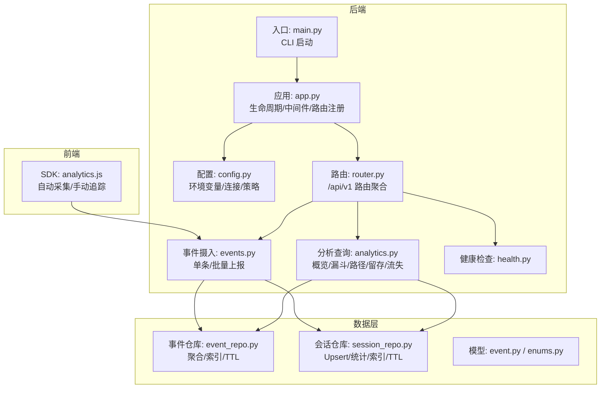
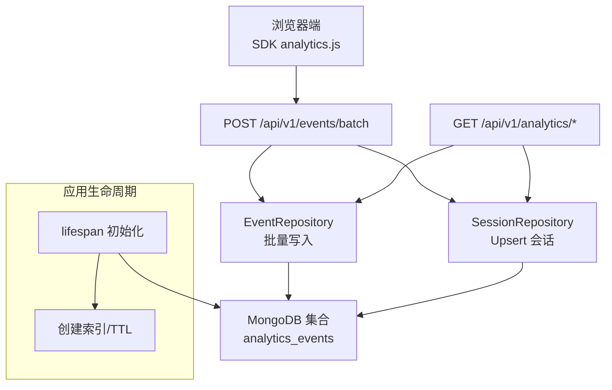
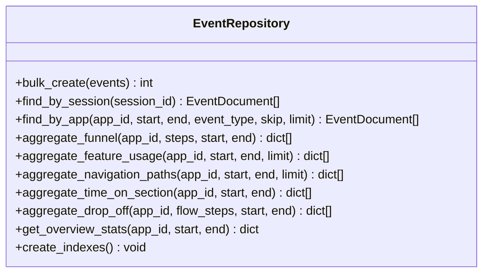
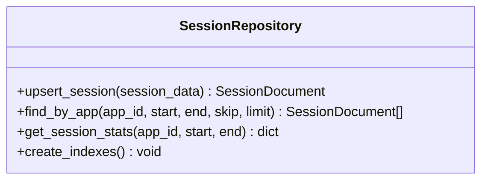
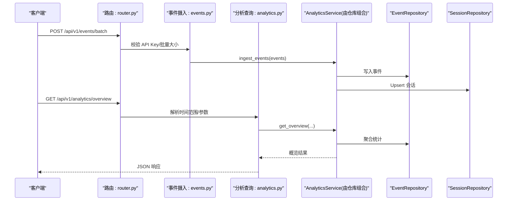
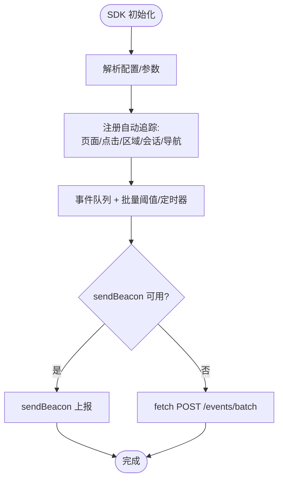
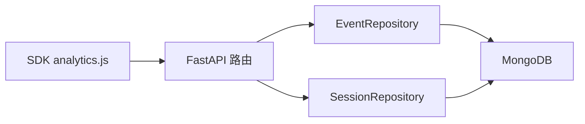

# 分析服务

<cite>
**本文引用的文件**
- [app.py](file://tools/flexloop/src/taolib/testing/analytics/server/app.py)
- [main.py](file://tools/flexloop/src/taolib/testing/analytics/server/main.py)
- [config.py](file://tools/flexloop/src/taolib/testing/analytics/server/config.py)
- [router.py](file://tools/flexloop/src/taolib/testing/analytics/server/api/router.py)
- [events.py](file://tools/flexloop/src/taolib/testing/analytics/server/api/events.py)
- [analytics.py](file://tools/flexloop/src/taolib/testing/analytics/server/api/analytics.py)
- [health.py](file://tools/flexloop/src/taolib/testing/analytics/server/api/health.py)
- [event_repo.py](file://tools/flexloop/src/taolib/testing/analytics/repository/event_repo.py)
- [session_repo.py](file://tools/flexloop/src/taolib/testing/analytics/repository/session_repo.py)
- [event.py](file://tools/flexloop/src/taolib/testing/analytics/models/event.py)
- [enums.py](file://tools/flexloop/src/taolib/testing/analytics/models/enums.py)
- [analytics.js](file://tools/flexloop/src/taolib/testing/analytics/sdk/analytics.js)
</cite>

## 目录
1. [简介](#简介)
2. [项目结构](#项目结构)
3. [核心组件](#核心组件)
4. [架构总览](#架构总览)
5. [详细组件分析](#详细组件分析)
6. [依赖分析](#依赖分析)
7. [性能考量](#性能考量)
8. [故障排查指南](#故障排查指南)
9. [结论](#结论)
10. [附录](#附录)

## 简介
本文件系统化梳理分析服务模块，覆盖事件聚合、统计计算与趋势分析的实现；详解事件仓库与会话仓库的设计、查询优化与索引策略；阐述分析算法（实时采集、批量摄入、聚合分析）与缓存策略；并提供使用分析 API、实现自定义统计函数与配置数据导出的实践指引。同时给出性能监控、数据一致性与扩展性设计的实用建议。

## 项目结构
分析服务采用 FastAPI + Motor（异步 MongoDB）的后端架构，前端提供轻量 SDK 用于浏览器端自动采集与手动埋点，后端提供事件摄入与分析查询 API，并内置一个简易可视化仪表盘。

图表来源
- [app.py:1-95](file://tools/flexloop/src/taolib/testing/analytics/server/app.py#L1-L95)
- [main.py:14-41](file://tools/flexloop/src/taolib/testing/analytics/server/main.py#L14-L41)
- [config.py:10-48](file://tools/flexloop/src/taolib/testing/analytics/server/config.py#L10-L48)
- [router.py:7-12](file://tools/flexloop/src/taolib/testing/analytics/server/api/router.py#L7-L12)
- [events.py:38-61](file://tools/flexloop/src/taolib/testing/analytics/server/api/events.py#L38-L61)
- [analytics.py:95-104](file://tools/flexloop/src/taolib/testing/analytics/server/api/analytics.py#L95-L104)
- [health.py:8-20](file://tools/flexloop/src/taolib/testing/analytics/server/api/health.py#L8-L20)
- [event_repo.py:16-467](file://tools/flexloop/src/taolib/testing/analytics/repository/event_repo.py#L16-L467)
- [session_repo.py:15-196](file://tools/flexloop/src/taolib/testing/analytics/repository/session_repo.py#L15-L196)
- [event.py:17-104](file://tools/flexloop/src/taolib/testing/analytics/models/event.py#L17-L104)
- [enums.py:9-31](file://tools/flexloop/src/taolib/testing/analytics/models/enums.py#L9-L31)
- [analytics.js:24-451](file://tools/flexloop/src/taolib/testing/analytics/sdk/analytics.js#L24-L451)

章节来源
- [app.py:19-95](file://tools/flexloop/src/taolib/testing/analytics/server/app.py#L19-L95)
- [main.py:14-41](file://tools/flexloop/src/taolib/testing/analytics/server/main.py#L14-L41)
- [config.py:10-48](file://tools/flexloop/src/taolib/testing/analytics/server/config.py#L10-L48)
- [router.py:7-12](file://tools/flexloop/src/taolib/testing/analytics/server/api/router.py#L7-L12)

## 核心组件
- 应用工厂与生命周期：负责 MongoDB 连接、数据库与集合句柄注入、索引创建与 TTL 设置、CORS 中间件与静态资源路由。
- 配置中心：集中管理 MongoDB 连接、监听地址、CORS、API Key、TTL、批量大小等运行参数。
- 路由聚合：统一挂载事件摄入、分析查询与健康检查子路由。
- 事件与会话仓库：提供事件与会话的 CRUD、批量写入、聚合分析与索引维护。
- 模型与枚举：定义事件与会话的数据结构及事件类型、设备类型等枚举。
- SDK：浏览器端自动采集页面浏览、点击、功能使用、区域停留、会话生命周期与导航轨迹，并批量上报。

章节来源
- [app.py:19-95](file://tools/flexloop/src/taolib/testing/analytics/server/app.py#L19-L95)
- [config.py:10-48](file://tools/flexloop/src/taolib/testing/analytics/server/config.py#L10-L48)
- [router.py:7-12](file://tools/flexloop/src/taolib/testing/analytics/server/api/router.py#L7-L12)
- [event_repo.py:16-467](file://tools/flexloop/src/taolib/testing/analytics/repository/event_repo.py#L16-L467)
- [session_repo.py:15-196](file://tools/flexloop/src/taolib/testing/analytics/repository/session_repo.py#L15-L196)
- [event.py:17-104](file://tools/flexloop/src/taolib/testing/analytics/models/event.py#L17-L104)
- [enums.py:9-31](file://tools/flexloop/src/taolib/testing/analytics/models/enums.py#L9-L31)
- [analytics.js:24-451](file://tools/flexloop/src/taolib/testing/analytics/sdk/analytics.js#L24-L451)

## 架构总览
分析服务采用“前端 SDK + 后端 API + MongoDB”三层架构。SDK 在浏览器侧生成事件并批量上报；后端接收事件并写入 MongoDB；分析 API 通过聚合管道进行统计与趋势分析；应用生命周期中完成索引与 TTL 初始化。

图表来源
- [app.py:19-56](file://tools/flexloop/src/taolib/testing/analytics/server/app.py#L19-L56)
- [events.py:38-61](file://tools/flexloop/src/taolib/testing/analytics/server/api/events.py#L38-L61)
- [analytics.py:95-104](file://tools/flexloop/src/taolib/testing/analytics/server/api/analytics.py#L95-L104)
- [event_repo.py:23-35](file://tools/flexloop/src/taolib/testing/analytics/repository/event_repo.py#L23-L35)
- [session_repo.py:22-79](file://tools/flexloop/src/taolib/testing/analytics/repository/session_repo.py#L22-L79)

## 详细组件分析

### 事件仓库（EventRepository）
职责与能力
- 批量写入：支持一次性写入多个事件文档。
- 查询能力：按会话、按应用+时间范围+事件类型等条件检索。
- 聚合分析：提供漏斗、功能使用排名、导航路径、区域停留时间、流失点分析、概览统计等聚合方法。
- 索引与 TTL：提供索引创建与 TTL 设置，保障查询性能与数据生命周期管理。

关键实现要点
- 聚合管道：广泛使用 $match/$group/$project/$sort/$limit 等阶段，结合 $addToSet/$size/$avg/$cond 等表达式实现去重、计数与比率计算。
- 时间范围：统一使用 ISO8601 字符串解析为带时区的时间对象，确保跨时区一致性。
- 会话重建：按 (session_id, timestamp) 排序，支持从事件流重建会话顺序。

图表来源
- [event_repo.py:16-467](file://tools/flexloop/src/taolib/testing/analytics/repository/event_repo.py#L16-L467)

章节来源
- [event_repo.py:23-35](file://tools/flexloop/src/taolib/testing/analytics/repository/event_repo.py#L23-L35)
- [event_repo.py:37-91](file://tools/flexloop/src/taolib/testing/analytics/repository/event_repo.py#L37-L91)
- [event_repo.py:93-134](file://tools/flexloop/src/taolib/testing/analytics/repository/event_repo.py#L93-L134)
- [event_repo.py:136-185](file://tools/flexloop/src/taolib/testing/analytics/repository/event_repo.py#L136-L185)
- [event_repo.py:187-254](file://tools/flexloop/src/taolib/testing/analytics/repository/event_repo.py#L187-L254)
- [event_repo.py:256-298](file://tools/flexloop/src/taolib/testing/analytics/repository/event_repo.py#L256-L298)
- [event_repo.py:300-359](file://tools/flexloop/src/taolib/testing/analytics/repository/event_repo.py#L300-L359)
- [event_repo.py:361-441](file://tools/flexloop/src/taolib/testing/analytics/repository/event_repo.py#L361-L441)
- [event_repo.py:443-467](file://tools/flexloop/src/taolib/testing/analytics/repository/event_repo.py#L443-L467)

### 会话仓库（SessionRepository）
职责与能力
- Upsert 会话：以 session_id 为主键，合并新增/更新字段，支持 setOnInsert、inc、addToSet 等原子操作。
- 会话统计：计算平均时长、平均页面数、跳出率等核心指标。
- 查询能力：按应用+时间范围查询会话列表。
- 索引与 TTL：提供索引创建与 TTL 设置，保障查询性能与生命周期管理。

图表来源
- [session_repo.py:15-196](file://tools/flexloop/src/taolib/testing/analytics/repository/session_repo.py#L15-L196)

章节来源
- [session_repo.py:22-79](file://tools/flexloop/src/taolib/testing/analytics/repository/session_repo.py#L22-L79)
- [session_repo.py:81-117](file://tools/flexloop/src/taolib/testing/analytics/repository/session_repo.py#L81-L117)
- [session_repo.py:119-177](file://tools/flexloop/src/taolib/testing/analytics/repository/session_repo.py#L119-L177)
- [session_repo.py:179-194](file://tools/flexloop/src/taolib/testing/analytics/repository/session_repo.py#L179-L194)

### 分析 API（路由与服务调用）
- 路由组织：统一前缀 /api/v1，分别挂载事件摄入、分析查询与健康检查。
- 事件摄入：支持单条与批量上报，批量大小受配置限制；可选 API Key 认证。
- 分析查询：提供概览、转化漏斗、功能使用排名、导航路径、区域停留、流失分析等接口。
- 时间解析：统一解析 ISO8601 时间字符串，支持默认最近 7 天范围。

图表来源
- [router.py:7-12](file://tools/flexloop/src/taolib/testing/analytics/server/api/router.py#L7-L12)
- [events.py:38-61](file://tools/flexloop/src/taolib/testing/analytics/server/api/events.py#L38-L61)
- [analytics.py:95-104](file://tools/flexloop/src/taolib/testing/analytics/server/api/analytics.py#L95-L104)
- [event_repo.py:23-35](file://tools/flexloop/src/taolib/testing/analytics/repository/event_repo.py#L23-L35)
- [session_repo.py:22-79](file://tools/flexloop/src/taolib/testing/analytics/repository/session_repo.py#L22-L79)

章节来源
- [router.py:7-12](file://tools/flexloop/src/taolib/testing/analytics/server/api/router.py#L7-L12)
- [events.py:11-25](file://tools/flexloop/src/taolib/testing/analytics/server/api/events.py#L11-L25)
- [events.py:38-61](file://tools/flexloop/src/taolib/testing/analytics/server/api/events.py#L38-L61)
- [analytics.py:28-41](file://tools/flexloop/src/taolib/testing/analytics/server/api/analytics.py#L28-L41)
- [analytics.py:95-104](file://tools/flexloop/src/taolib/testing/analytics/server/api/analytics.py#L95-L104)

### SDK（浏览器端采集与上报）
- 会话管理：本地存储 session_id 与最后活动时间，超时自动刷新；支持用户标识持久化。
- 自动追踪：页面浏览、点击（含 data-track-*）、区域停留（IntersectionObserver）、会话生命周期（visibilitychange/beforeunload）、导航轨迹（history API）。
- 上报策略：队列积攒到阈值或定时器触发，优先使用 sendBeacon，失败回退 fetch；支持 API Key 注入。
- 可扩展性：提供 track()/trackFeature()/identify()/flush() 等公共 API。

图表来源
- [analytics.js:376-402](file://tools/flexloop/src/taolib/testing/analytics/sdk/analytics.js#L376-L402)
- [analytics.js:148-174](file://tools/flexloop/src/taolib/testing/analytics/sdk/analytics.js#L148-L174)
- [analytics.js:178-202](file://tools/flexloop/src/taolib/testing/analytics/sdk/analytics.js#L178-L202)
- [analytics.js:206-248](file://tools/flexloop/src/taolib/testing/analytics/sdk/analytics.js#L206-L248)
- [analytics.js:252-300](file://tools/flexloop/src/taolib/testing/analytics/sdk/analytics.js#L252-L300)
- [analytics.js:304-335](file://tools/flexloop/src/taolib/testing/analytics/sdk/analytics.js#L304-L335)
- [analytics.js:339-367](file://tools/flexloop/src/taolib/testing/analytics/sdk/analytics.js#L339-L367)

章节来源
- [analytics.js:24-451](file://tools/flexloop/src/taolib/testing/analytics/sdk/analytics.js#L24-L451)

### 模型与枚举
- 事件模型：定义事件基础字段、创建输入、批量输入、响应模型与文档模型，并提供 to_response 转换。
- 会话模型：聚合会话维度字段，如开始/结束时间、页面数、事件数、入口/出口页、设备类型等。
- 枚举类型：事件类型（页面浏览、点击、功能使用、会话生命周期、导航、区域停留、自定义）与设备类型（桌面/移动/平板/未知）。

章节来源
- [event.py:17-104](file://tools/flexloop/src/taolib/testing/analytics/models/event.py#L17-L104)
- [enums.py:9-31](file://tools/flexloop/src/taolib/testing/analytics/models/enums.py#L9-L31)

## 依赖分析
- 组件耦合
  - API 层仅依赖仓库层，不直接操作数据库，降低耦合度。
  - 仓库层依赖 Motor 异步集合与通用基类，便于扩展与测试。
  - SDK 与后端通过 HTTP 协议解耦，便于跨域与部署分离。
- 外部依赖
  - FastAPI：提供路由、中间件与 ASGI 服务。
  - Motor：提供异步 MongoDB 访问。
  - Pydantic/Pydantic Settings：提供数据校验与配置管理。
- 循环依赖
  - 未发现循环导入；路由在顶层聚合，避免相互引用。

图表来源
- [router.py:7-12](file://tools/flexloop/src/taolib/testing/analytics/server/api/router.py#L7-L12)
- [events.py:38-61](file://tools/flexloop/src/taolib/testing/analytics/server/api/events.py#L38-L61)
- [analytics.py:95-104](file://tools/flexloop/src/taolib/testing/analytics/server/api/analytics.py#L95-L104)
- [event_repo.py:16-467](file://tools/flexloop/src/taolib/testing/analytics/repository/event_repo.py#L16-L467)
- [session_repo.py:15-196](file://tools/flexloop/src/taolib/testing/analytics/repository/session_repo.py#L15-L196)

章节来源
- [router.py:7-12](file://tools/flexloop/src/taolib/testing/analytics/server/api/router.py#L7-L12)
- [events.py:38-61](file://tools/flexloop/src/taolib/testing/analytics/server/api/events.py#L38-L61)
- [analytics.py:95-104](file://tools/flexloop/src/taolib/testing/analytics/server/api/analytics.py#L95-L104)
- [event_repo.py:16-467](file://tools/flexloop/src/taolib/testing/analytics/repository/event_repo.py#L16-L467)
- [session_repo.py:15-196](file://tools/flexloop/src/taolib/testing/analytics/repository/session_repo.py#L15-L196)

## 性能考量
- 查询性能
  - 事件集合：按 (app_id, timestamp)、(app_id, event_type)、(session_id, timestamp) 建立复合索引，满足高频查询场景。
  - 会话集合：按 (app_id, started_at)、(app_id, user_id) 建立索引，支持会话统计与用户关联查询。
- 存储与生命周期
  - 事件与会话集合均设置 TTL 索引，按天数自动清理历史数据，控制存储增长。
- 批量摄入
  - SDK 默认批量阈值与定时器减少网络开销；后端对批量大小进行上限控制，防止突发流量冲击。
- 聚合复杂度
  - 聚合管道使用 $group/$addToSet/$size/$avg 等，注意大数据量时的内存与 CPU 开销；可通过 limit 控制输出规模。
- 缓存策略
  - 当前未实现应用层缓存；可在业务层引入 Redis 缓存热点聚合结果，降低重复聚合压力。

章节来源
- [app.py:28-49](file://tools/flexloop/src/taolib/testing/analytics/server/app.py#L28-L49)
- [event_repo.py:443-467](file://tools/flexloop/src/taolib/testing/analytics/repository/event_repo.py#L443-L467)
- [session_repo.py:179-194](file://tools/flexloop/src/taolib/testing/analytics/repository/session_repo.py#L179-L194)
- [config.py:44](file://tools/flexloop/src/taolib/testing/analytics/server/config.py#L44)
- [analytics.js:33-34](file://tools/flexloop/src/taolib/testing/analytics/sdk/analytics.js#L33-L34)

## 故障排查指南
- 健康检查
  - 通过 /api/v1/health 检查数据库连通性，快速定位连接问题。
- 认证失败
  - 若配置了 API Key，未携带或错误的 X-API-Key 将导致 401。
- 批量大小超限
  - 批量上报事件数量超过配置上限将返回 400。
- 时间范围异常
  - 未提供时间范围时默认最近 7 天；请确认传入 ISO8601 字符串且带时区信息。
- 数据不一致
  - 事件与会话写入为独立集合，若出现会话缺失，检查会话生命周期事件是否正常上报。

章节来源
- [health.py:8-20](file://tools/flexloop/src/taolib/testing/analytics/server/api/health.py#L8-L20)
- [events.py:11-25](file://tools/flexloop/src/taolib/testing/analytics/server/api/events.py#L11-L25)
- [events.py:52-56](file://tools/flexloop/src/taolib/testing/analytics/server/api/events.py#L52-L56)
- [analytics.py:28-41](file://tools/flexloop/src/taolib/testing/analytics/server/api/analytics.py#L28-L41)

## 结论
该分析服务模块以清晰的分层架构实现了从事件采集、入库、聚合到可视化的完整闭环。通过合理的索引与 TTL 设计、严格的批量与认证策略，兼顾了性能与稳定性。建议后续引入应用层缓存与更细粒度的权限控制，进一步提升高并发下的吞吐与安全性。

## 附录

### 使用分析 API 的实践指引
- 事件上报
  - 单条上报：POST /api/v1/events（需 API Key 时在请求头添加 X-API-Key）
  - 批量上报：POST /api/v1/events/batch（事件数量不超过配置上限）
- 分析查询
  - 概览统计：GET /api/v1/analytics/overview?app_id=...&start=...&end=...
  - 转化漏斗：GET /api/v1/analytics/funnel?app_id=...&steps=step1,step2,...&start=...&end=...
  - 功能使用排名：GET /api/v1/analytics/features?app_id=...&start=...&end=...&limit=...
  - 导航路径：GET /api/v1/analytics/paths?app_id=...&start=...&end=...&limit=...
  - 区域停留：GET /api/v1/analytics/retention?app_id=...&start=...&end=...
  - 流失分析：GET /api/v1/analytics/drop-off?app_id=...&steps=...&start=...&end=...

章节来源
- [events.py:38-61](file://tools/flexloop/src/taolib/testing/analytics/server/api/events.py#L38-L61)
- [analytics.py:95-104](file://tools/flexloop/src/taolib/testing/analytics/server/api/analytics.py#L95-L104)
- [analytics.py:156-167](file://tools/flexloop/src/taolib/testing/analytics/server/api/analytics.py#L156-L167)
- [analytics.py:199-209](file://tools/flexloop/src/taolib/testing/analytics/server/api/analytics.py#L199-L209)
- [analytics.py:243-253](file://tools/flexloop/src/taolib/testing/analytics/server/api/analytics.py#L243-L253)
- [analytics.py:283-292](file://tools/flexloop/src/taolib/testing/analytics/server/api/analytics.py#L283-L292)
- [analytics.py:329-340](file://tools/flexloop/src/taolib/testing/analytics/server/api/analytics.py#L329-L340)

### 实现自定义统计函数的建议
- 新增聚合方法：在 EventRepository 中添加新的聚合方法，遵循现有管道模式（match/group/project/sort/limit），并在 AnalyticsService 中暴露。
- 自定义事件类型：在枚举中新增 EventType，并在 SDK 中扩展自动追踪逻辑或提供 track() 手动上报。
- 输出格式标准化：保持返回字段命名与现有接口一致，便于前端仪表盘复用。

章节来源
- [event_repo.py:93-134](file://tools/flexloop/src/taolib/testing/analytics/repository/event_repo.py#L93-L134)
- [event_repo.py:136-185](file://tools/flexloop/src/taolib/testing/analytics/repository/event_repo.py#L136-L185)
- [enums.py:9-31](file://tools/flexloop/src/taolib/testing/analytics/models/enums.py#L9-L31)
- [analytics.js:409-425](file://tools/flexloop/src/taolib/testing/analytics/sdk/analytics.js#L409-L425)

### 配置数据导出
- 当前未提供导出接口；可在 API 层新增导出路由，将聚合结果转为 CSV/JSON 并下载。
- 建议增加分页与过滤参数，控制导出规模与时间范围。

章节来源
- [router.py:7-12](file://tools/flexloop/src/taolib/testing/analytics/server/api/router.py#L7-L12)
- [analytics.py:95-104](file://tools/flexloop/src/taolib/testing/analytics/server/api/analytics.py#L95-L104)