# 数据分析与监控

<cite>
**本文引用的文件**
- [apps/DaoMind/packages/daoMonitor/src/index.ts](file://apps/DaoMind/packages/daoMonitor/src/index.ts)
- [apps/DaoMind/packages/daoMonitor/src/types.ts](file://apps/DaoMind/packages/daoMonitor/src/types.ts)
- [apps/DaoMind/packages/daoMonitor/src/gauge.ts](file://apps/DaoMind/packages/daoMonitor/src/gauge.ts)
- [apps/DaoMind/packages/daoMonitor/src/heatmap.ts](file://apps/DaoMind/packages/daoMonitor/src/heatmap.ts)
- [apps/DaoMind/packages/daoMonitor/src/vector-field.ts](file://apps/DaoMind/packages/daoMonitor/src/vector-field.ts)
- [apps/DaoMind/packages/daoMonitor/src/alerts.ts](file://apps/DaoMind/packages/daoMonitor/src/alerts.ts)
- [apps/DaoMind/packages/daoMonitor/src/diagnosis.ts](file://apps/DaoMind/packages/daoMonitor/src/diagnosis.ts)
- [apps/DaoMind/packages/daoMonitor/src/snapshot.ts](file://apps/DaoMind/packages/daoMonitor/src/snapshot.ts)
- [apps/DaoMind/tests/test-monitor-system.test.ts](file://apps/DaoMind/tests/test-monitor-system.test.ts)
- [apps/DaoMind/.trae/specs/deepen-dao-collective-philosophy/spec.md](file://apps/DaoMind/.trae/specs/deepen-dao-collective-philosophy/spec.md)
- [apps/DaoMind/packages/daoNothing/src/event-void.ts](file://apps/DaoMind/packages/daoNothing/src/event-void.ts)
- [apps/DaoMind/packages/daoNothing/src/event-void.d.ts](file://apps/DaoMind/packages/daoNothing/src/event-void.d.ts)
- [tools/flexloop/tests/testing/test_analytics/test_service.py](file://tools/flexloop/tests/testing/test_analytics/test_service.py)
- [tools/DeepResearch/tests/performance/stability_test.py](file://tools/DeepResearch/tests/performance/stability_test.py)
- [tools/flexloop/src/taolib/testing/rate_limiter/store.py](file://tools/flexloop/src/taolib/testing/rate_limiter/store.py)
</cite>

## 目录
1. [简介](#简介)
2. [项目结构](#项目结构)
3. [核心组件](#核心组件)
4. [架构总览](#架构总览)
5. [详细组件分析](#详细组件分析)
6. [依赖关系分析](#依赖关系分析)
7. [性能考量](#性能考量)
8. [故障排查指南](#故障排查指南)
9. [结论](#结论)
10. [附录](#附录)

## 简介
本技术文档面向“数据分析与监控系统”，围绕事件模型设计、分析服务实现、监控服务器架构、事件仓库设计以及监控告警配置等方面，提供系统化说明与实践指导。文档同时给出数据隐私、性能优化与扩展性建议，并通过具体代码片段路径帮助读者快速定位实现细节。

## 项目结构
本仓库包含多个应用与工具包，其中与数据分析和监控直接相关的核心位于以下位置：
- 监控系统（前端/后端通用）：apps/DaoMind/packages/daoMonitor
- 监控系统测试：apps/DaoMind/tests/test-monitor-system.test.ts
- 事件观察与记录（事件虚空）：apps/DaoMind/packages/daoNothing
- 分析服务测试（Python）：tools/flexloop/tests/testing/test_analytics/test_service.py
- 性能稳定性测试：tools/DeepResearch/tests/performance/stability_test.py
- 速率限制与实时统计（辅助监控）：tools/flexloop/src/taolib/testing/rate_limiter/store.py

下图为概念性项目结构示意（非代码映射）：

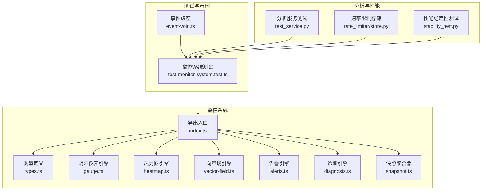

## 核心组件
- 事件模型与数据结构
  - 气通道类型与监控指标：参见 [类型定义:1-72](file://apps/DaoMind/packages/daoMonitor/src/types.ts#L1-L72)
  - 事件虚空（纯观察者模式）：参见 [事件虚空类:1-45](file://apps/DaoMind/packages/daoNothing/src/event-void.ts#L1-L45) 与 [类型声明:1-30](file://apps/DaoMind/packages/daoNothing/src/event-void.d.ts#L1-L30)
- 监控引擎
  - 阴阳仪表引擎：参见 [阴阳仪表引擎:1-104](file://apps/DaoMind/packages/daoMonitor/src/gauge.ts#L1-L104)
  - 热力图引擎：参见 [热力图引擎:1-100](file://apps/DaoMind/packages/daoMonitor/src/heatmap.ts#L1-L100)
  - 向量场引擎：参见 [向量场引擎:1-80](file://apps/DaoMind/packages/daoMonitor/src/vector-field.ts#L1-L80)
  - 告警引擎：参见 [告警引擎:1-122](file://apps/DaoMind/packages/daoMonitor/src/alerts.ts#L1-L122)
  - 诊断引擎：参见 [诊断引擎:1-75](file://apps/DaoMind/packages/daoMonitor/src/diagnosis.ts#L1-L75)
  - 快照聚合器：参见 [快照聚合器:1-75](file://apps/DaoMind/packages/daoMonitor/src/snapshot.ts#L1-L75)
- 分析服务（Python）
  - 分析服务测试：参见 [分析服务测试:1-155](file://tools/flexloop/tests/testing/test_analytics/test_service.py#L1-L155)

章节来源
- [apps/DaoMind/packages/daoMonitor/src/types.ts:1-72](file://apps/DaoMind/packages/daoMonitor/src/types.ts#L1-L72)
- [apps/DaoMind/packages/daoMonitor/src/gauge.ts:1-104](file://apps/DaoMind/packages/daoMonitor/src/gauge.ts#L1-L104)
- [apps/DaoMind/packages/daoMonitor/src/heatmap.ts:1-100](file://apps/DaoMind/packages/daoMonitor/src/heatmap.ts#L1-L100)
- [apps/DaoMind/packages/daoMonitor/src/vector-field.ts:1-80](file://apps/DaoMind/packages/daoMonitor/src/vector-field.ts#L1-L80)
- [apps/DaoMind/packages/daoMonitor/src/alerts.ts:1-122](file://apps/DaoMind/packages/daoMonitor/src/alerts.ts#L1-L122)
- [apps/DaoMind/packages/daoMonitor/src/diagnosis.ts:1-75](file://apps/DaoMind/packages/daoMonitor/src/diagnosis.ts#L1-L75)
- [apps/DaoMind/packages/daoMonitor/src/snapshot.ts:1-75](file://apps/DaoMind/packages/daoMonitor/src/snapshot.ts#L1-L75)
- [apps/DaoMind/packages/daoNothing/src/event-void.ts:1-45](file://apps/DaoMind/packages/daoNothing/src/event-void.ts#L1-L45)
- [apps/DaoMind/packages/daoNothing/src/event-void.d.ts:1-30](file://apps/DaoMind/packages/daoNothing/src/event-void.d.ts#L1-L30)
- [tools/flexloop/tests/testing/test_analytics/test_service.py:1-155](file://tools/flexloop/tests/testing/test_analytics/test_service.py#L1-L155)

## 架构总览
监控系统采用“多引擎协同”的架构，将系统状态抽象为热力图、向量场、阴阳平衡、告警与诊断五类可观测信号，并通过快照聚合器统一采集与评分，形成系统健康度指标。事件模型以“气通道”为单位承载流量与质量指标，支持按通道类型与节点对进行聚合与告警。

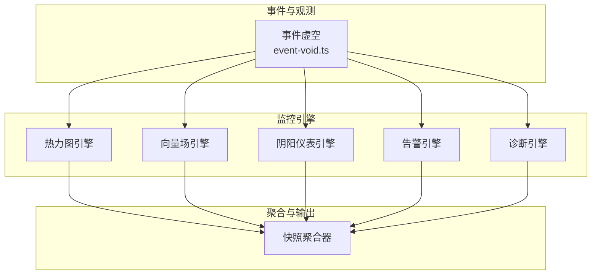

图表来源
- [apps/DaoMind/packages/daoMonitor/src/heatmap.ts:1-100](file://apps/DaoMind/packages/daoMonitor/src/heatmap.ts#L1-L100)
- [apps/DaoMind/packages/daoMonitor/src/vector-field.ts:1-80](file://apps/DaoMind/packages/daoMonitor/src/vector-field.ts#L1-L80)
- [apps/DaoMind/packages/daoMonitor/src/gauge.ts:1-104](file://apps/DaoMind/packages/daoMonitor/src/gauge.ts#L1-L104)
- [apps/DaoMind/packages/daoMonitor/src/alerts.ts:1-122](file://apps/DaoMind/packages/daoMonitor/src/alerts.ts#L1-L122)
- [apps/DaoMind/packages/daoMonitor/src/diagnosis.ts:1-75](file://apps/DaoMind/packages/daoMonitor/src/diagnosis.ts#L1-L75)
- [apps/DaoMind/packages/daoMonitor/src/snapshot.ts:1-75](file://apps/DaoMind/packages/daoMonitor/src/snapshot.ts#L1-L75)
- [apps/DaoMind/packages/daoNothing/src/event-void.ts:1-45](file://apps/DaoMind/packages/daoNothing/src/event-void.ts#L1-L45)

## 详细组件分析

### 事件模型与数据结构
- 气通道类型（QiChannelType）：tian、di、ren、chong 四大主干通道，用于区分不同维度的流量来源与去向。
- 热力图数据点（HeatmapPoint）：记录通道类型、源节点、目标节点、消息速率、平均延迟、错误率与时间戳。
- 向量场数据（FlowVector）：描述节点间流动的方向（下游/上游/横向/平衡）与压力。
- 阴阳平衡仪表（YinYangGauge）：衡量成对节点的数值比与理想比例偏差，输出平衡状态。
- 告警（MeridianAlert）：基于规则触发，包含严重级别、影响节点、原因与描述。
- 诊断（QiDiagnosis）：基于流入/流出速率与趋势，判定节点状态并给出建议。
- 监控快照（MonitorSnapshot）：某一时刻的系统全貌，包含上述各类指标与系统健康度评分。

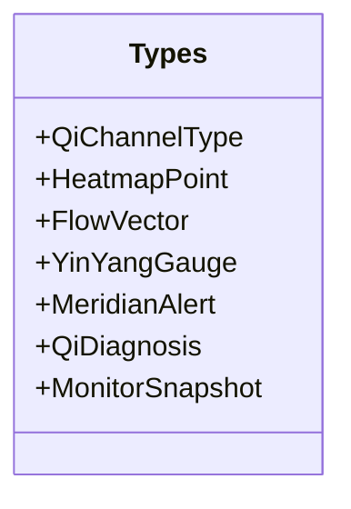

图表来源
- [apps/DaoMind/packages/daoMonitor/src/types.ts:1-72](file://apps/DaoMind/packages/daoMonitor/src/types.ts#L1-L72)

章节来源
- [apps/DaoMind/packages/daoMonitor/src/types.ts:1-72](file://apps/DaoMind/packages/daoMonitor/src/types.ts#L1-L72)

### 阴阳仪表引擎（DaoYinYangGaugeEngine）
- 功能要点
  - 维护成对节点的历史数值序列，计算当前比值与理想比例的偏差。
  - 根据偏差阈值判定平衡状态（balanced/yin_excess/yang_excess/critical）。
  - 提供获取全部/不平衡/临界配对的能力。
- 关键流程

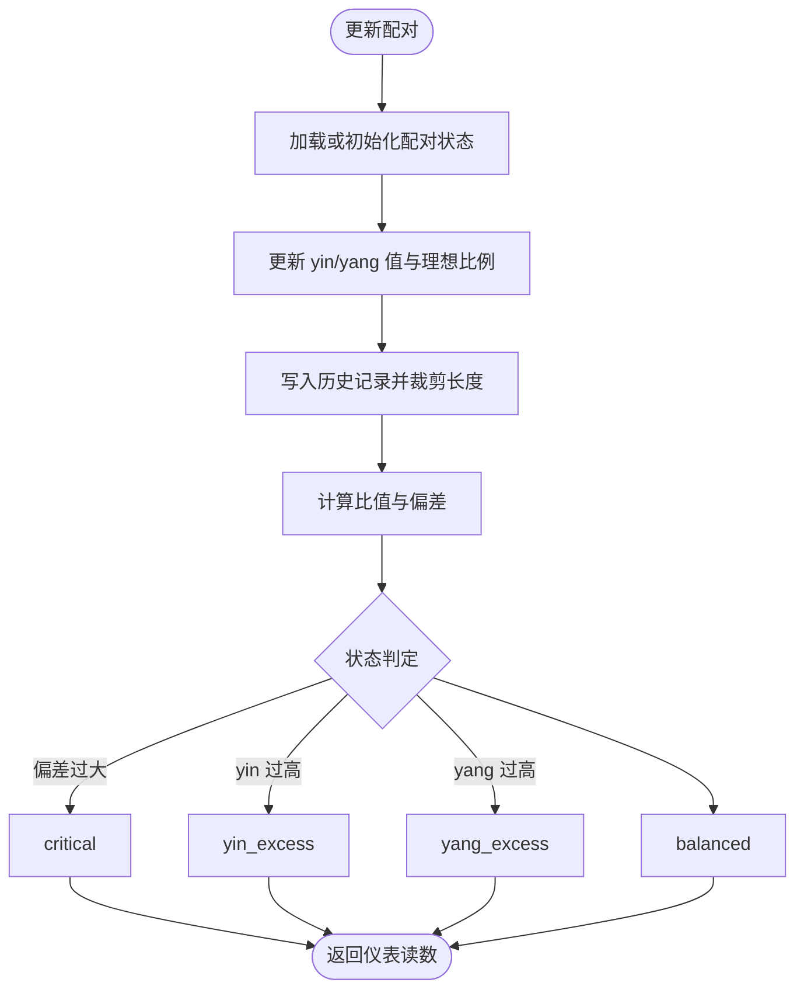

图表来源
- [apps/DaoMind/packages/daoMonitor/src/gauge.ts:17-62](file://apps/DaoMind/packages/daoMonitor/src/gauge.ts#L17-L62)

章节来源
- [apps/DaoMind/packages/daoMonitor/src/gauge.ts:1-104](file://apps/DaoMind/packages/daoMonitor/src/gauge.ts#L1-L104)

### 热力图引擎（DaoHeatmapEngine）
- 功能要点
  - 循环缓冲区记录通道指标，支持窗口过滤与排序。
  - 提供通道汇总统计（总速率、平均延迟、错误率、活跃流数）。
  - 提供速率等级划分（冷/暖/热/极热）。
- 关键流程

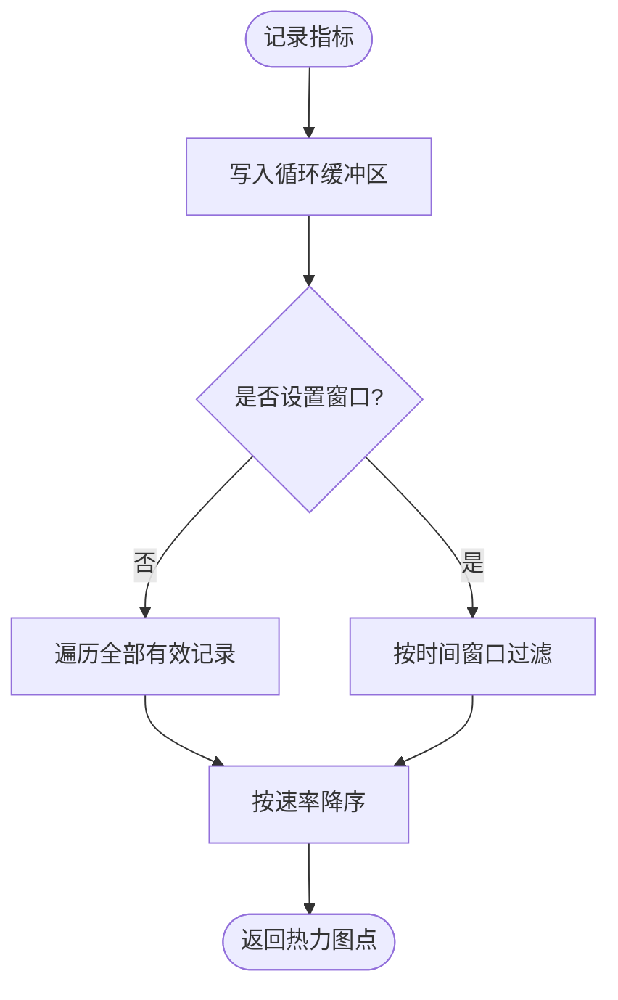

图表来源
- [apps/DaoMind/packages/daoMonitor/src/heatmap.ts:24-63](file://apps/DaoMind/packages/daoMonitor/src/heatmap.ts#L24-L63)

章节来源
- [apps/DaoMind/packages/daoMonitor/src/heatmap.ts:1-100](file://apps/DaoMind/packages/daoMonitor/src/heatmap.ts#L1-L100)

### 向量场引擎（DaoVectorField）
- 功能要点
  - 维护边集合与邻接关系，记录流向、幅度与压力。
  - 支持查询节点的入边/出边，计算系统热点（按总吞吐排序）。
- 关键流程

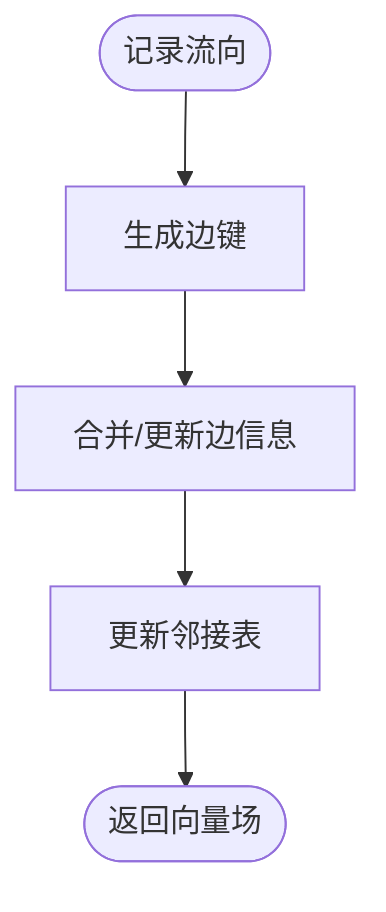

图表来源
- [apps/DaoMind/packages/daoMonitor/src/vector-field.ts:20-36](file://apps/DaoMind/packages/daoMonitor/src/vector-field.ts#L20-L36)

章节来源
- [apps/DaoMind/packages/daoMonitor/src/vector-field.ts:1-80](file://apps/DaoMind/packages/daoMonitor/src/vector-field.ts#L1-L80)

### 告警引擎（DaoAlertEngine）
- 功能要点
  - 内置默认规则集（拥塞、断连、延迟尖峰、错误率激增）。
  - 支持动态设置规则，按条件匹配触发告警并生成描述。
  - 提供活动告警查询、确认与解决操作。
- 关键流程

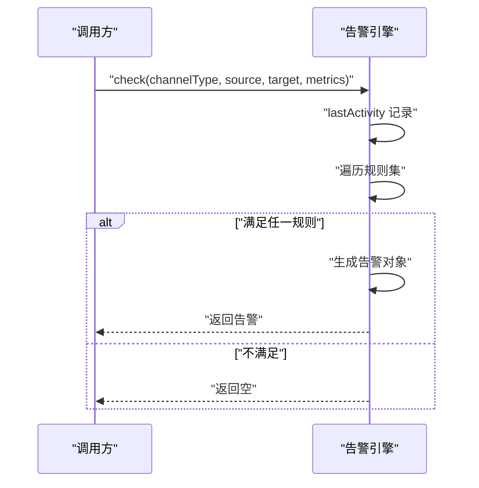

图表来源
- [apps/DaoMind/packages/daoMonitor/src/alerts.ts:66-98](file://apps/DaoMind/packages/daoMonitor/src/alerts.ts#L66-L98)

章节来源
- [apps/DaoMind/packages/daoMonitor/src/alerts.ts:1-122](file://apps/DaoMind/packages/daoMonitor/src/alerts.ts#L1-L122)

### 诊断引擎（DaoDiagnosisEngine）
- 功能要点
  - 基于流入/流出速率计算活动指数与趋势，判定节点状态（气虚/气盛/平衡）。
  - 支持批量诊断与按状态筛选。
- 关键流程

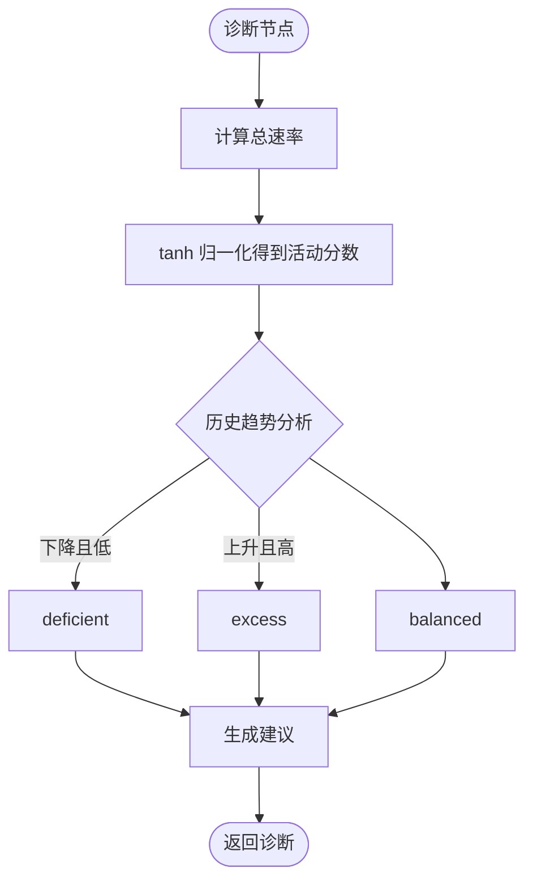

图表来源
- [apps/DaoMind/packages/daoMonitor/src/diagnosis.ts:10-55](file://apps/DaoMind/packages/daoMonitor/src/diagnosis.ts#L10-L55)

章节来源
- [apps/DaoMind/packages/daoMonitor/src/diagnosis.ts:1-75](file://apps/DaoMind/packages/daoMonitor/src/diagnosis.ts#L1-L75)

### 快照聚合器（DaoSnapshotAggregator）
- 功能要点
  - 聚合热力图、向量场、仪表、告警与诊断结果，计算系统健康度。
  - 维护历史快照队列，支持获取最后快照与历史列表。
- 关键流程

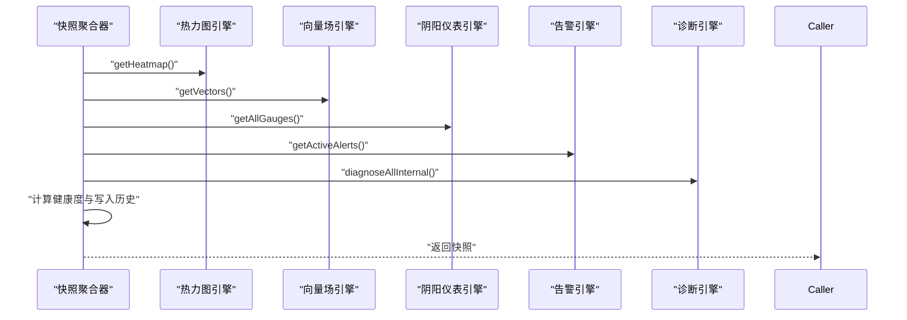

图表来源
- [apps/DaoMind/packages/daoMonitor/src/snapshot.ts:22-59](file://apps/DaoMind/packages/daoMonitor/src/snapshot.ts#L22-L59)

章节来源
- [apps/DaoMind/packages/daoMonitor/src/snapshot.ts:1-75](file://apps/DaoMind/packages/daoMonitor/src/snapshot.ts#L1-L75)

### 事件虚空（DaoNothing）
- 功能要点
  - 纯观察者模式：接收事件、静默记录、转发“observed”事件，不产生副作用。
  - 支持反射（返回镜像）、归虚（清空）、守静（状态查询）。
- 关键流程

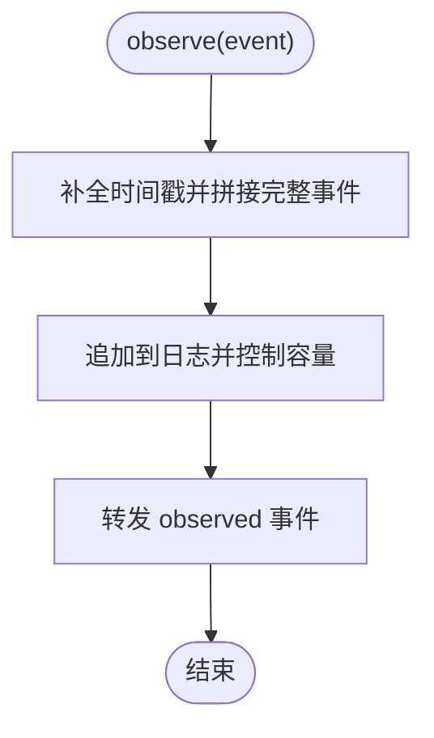

图表来源
- [apps/DaoMind/packages/daoNothing/src/event-void.ts:24-32](file://apps/DaoMind/packages/daoNothing/src/event-void.ts#L24-L32)

章节来源
- [apps/DaoMind/packages/daoNothing/src/event-void.ts:1-45](file://apps/DaoMind/packages/daoNothing/src/event-void.ts#L1-L45)
- [apps/DaoMind/packages/daoNothing/src/event-void.d.ts:1-30](file://apps/DaoMind/packages/daoNothing/src/event-void.d.ts#L1-L30)

### 分析服务（Python）
- 功能要点
  - 事件批量入库、会话维护与统计聚合（概览、漏斗、功能使用等）。
  - 通过测试验证事件摄取、空事件处理、概览统计与漏斗分析。
- 关键流程

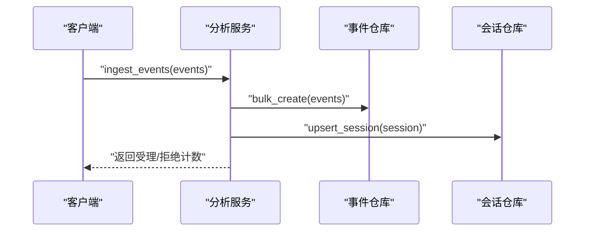

图表来源
- [tools/flexloop/tests/testing/test_analytics/test_service.py:108-123](file://tools/flexloop/tests/testing/test_analytics/test_service.py#L108-L123)

章节来源
- [tools/flexloop/tests/testing/test_analytics/test_service.py:1-155](file://tools/flexloop/tests/testing/test_analytics/test_service.py#L1-L155)

## 依赖关系分析
- 导出入口（index.ts）统一导出各引擎与类型，便于上层组合使用。
- 快照聚合器依赖各引擎输出，形成闭环。
- 事件虚空作为底层事件收集器，可被监控引擎间接消费。

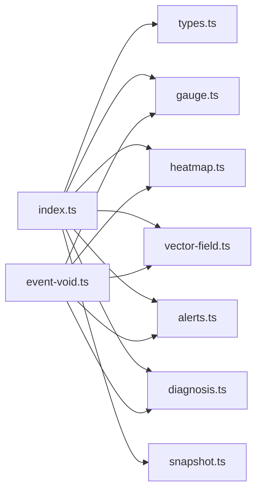

图表来源
- [apps/DaoMind/packages/daoMonitor/src/index.ts:1-17](file://apps/DaoMind/packages/daoMonitor/src/index.ts#L1-L17)
- [apps/DaoMind/packages/daoMonitor/src/snapshot.ts:14-20](file://apps/DaoMind/packages/daoMonitor/src/snapshot.ts#L14-L20)
- [apps/DaoMind/packages/daoNothing/src/event-void.ts:1-45](file://apps/DaoMind/packages/daoNothing/src/event-void.ts#L1-L45)

章节来源
- [apps/DaoMind/packages/daoMonitor/src/index.ts:1-17](file://apps/DaoMind/packages/daoMonitor/src/index.ts#L1-L17)
- [apps/DaoMind/packages/daoMonitor/src/snapshot.ts:14-20](file://apps/DaoMind/packages/daoMonitor/src/snapshot.ts#L14-L20)
- [apps/DaoMind/packages/daoNothing/src/event-void.ts:1-45](file://apps/DaoMind/packages/daoNothing/src/event-void.ts#L1-L45)

## 性能考量
- 缓冲与容量控制
  - 热力图引擎采用固定容量循环缓冲，避免内存无限增长；参见 [热力图引擎构造与记录:20-42](file://apps/DaoMind/packages/daoMonitor/src/heatmap.ts#L20-L42)。
  - 阴阳仪表引擎限制历史长度，维持稳定的时间窗口；参见 [历史裁剪](file://apps/DaoMind/packages/daoMonitor/src/gauge.ts#L39)。
- 实时统计与窗口
  - 速率限制存储提供最近 N 秒内的请求统计与 Top 路径分析；参见 [实时统计:318-333](file://tools/flexloop/src/taolib/testing/rate_limiter/store.py#L318-L333)。
- 性能稳定性测试
  - 性能测试覆盖响应时间、CPU/内存指标与泄漏检测；参见 [稳定性测试统计:169-201](file://tools/DeepResearch/tests/performance/stability_test.py#L169-L201)。
- 建议
  - 对高频事件采用批处理与滑动窗口聚合，降低写放大。
  - 使用异步/并发策略处理事件入库与会话更新，避免阻塞主流程。
  - 结合速率限制与告警联动，防止突发流量冲击系统。

章节来源
- [apps/DaoMind/packages/daoMonitor/src/heatmap.ts:20-42](file://apps/DaoMind/packages/daoMonitor/src/heatmap.ts#L20-L42)
- [apps/DaoMind/packages/daoMonitor/src/gauge.ts:39](file://apps/DaoMind/packages/daoMonitor/src/gauge.ts#L39)
- [tools/flexloop/src/taolib/testing/rate_limiter/store.py:318-333](file://tools/flexloop/src/taolib/testing/rate_limiter/store.py#L318-L333)
- [tools/DeepResearch/tests/performance/stability_test.py:169-201](file://tools/DeepResearch/tests/performance/stability_test.py#L169-L201)

## 故障排查指南
- 告警未触发
  - 检查规则条件与指标阈值是否合理；参见 [默认规则:14-57](file://apps/DaoMind/packages/daoMonitor/src/alerts.ts#L14-L57)。
  - 确认最近活动时间是否被正确更新；参见 [活动时间记录:73-74](file://apps/DaoMind/packages/daoMonitor/src/alerts.ts#L73-L74)。
- 健康度异常
  - 核查活跃告警、不平衡配对与诊断结果；参见 [健康度计算:31-42](file://apps/DaoMind/packages/daoMonitor/src/snapshot.ts#L31-L42)。
- 事件丢失或内存增长
  - 检查热力图缓冲容量与事件虚空日志上限；参见 [缓冲与容量:20-22](file://apps/DaoMind/packages/daoMonitor/src/heatmap.ts#L20-L22)、[事件虚空容量控制:28-30](file://apps/DaoMind/packages/daoNothing/src/event-void.ts#L28-L30)。
- 性能退化
  - 使用稳定性测试脚本评估 CPU/内存与泄漏风险；参见 [稳定性统计:169-201](file://tools/DeepResearch/tests/performance/stability_test.py#L169-L201)。

章节来源
- [apps/DaoMind/packages/daoMonitor/src/alerts.ts:14-57](file://apps/DaoMind/packages/daoMonitor/src/alerts.ts#L14-L57)
- [apps/DaoMind/packages/daoMonitor/src/alerts.ts:73-74](file://apps/DaoMind/packages/daoMonitor/src/alerts.ts#L73-L74)
- [apps/DaoMind/packages/daoMonitor/src/snapshot.ts:31-42](file://apps/DaoMind/packages/daoMonitor/src/snapshot.ts#L31-L42)
- [apps/DaoMind/packages/daoMonitor/src/heatmap.ts:20-22](file://apps/DaoMind/packages/daoMonitor/src/heatmap.ts#L20-L22)
- [apps/DaoMind/packages/daoNothing/src/event-void.ts:28-30](file://apps/DaoMind/packages/daoNothing/src/event-void.ts#L28-L30)
- [tools/DeepResearch/tests/performance/stability_test.py:169-201](file://tools/DeepResearch/tests/performance/stability_test.py#L169-L201)

## 结论
本系统以“气通道”为抽象，将流量与质量指标统一建模，通过多引擎协同实现对系统状态的全面观测与诊断。事件虚空提供纯观察者模式，确保采集过程不引入额外副作用。快照聚合器将多维信号整合为系统健康度，便于统一告警与决策。结合速率限制与稳定性测试，可在高并发场景下保持系统稳健运行。

## 附录

### 代码示例路径（不含具体代码内容）
- 自定义事件定义（事件虚空）
  - [事件虚空类:1-45](file://apps/DaoMind/packages/daoNothing/src/event-void.ts#L1-L45)
  - [事件虚空类型声明:1-30](file://apps/DaoMind/packages/daoNothing/src/event-void.d.ts#L1-L30)
- 实现数据分析服务（Python）
  - [分析服务测试（事件摄取与统计）:108-155](file://tools/flexloop/tests/testing/test_analytics/test_service.py#L108-L155)
- 配置监控告警
  - [告警引擎与默认规则:14-57](file://apps/DaoMind/packages/daoMonitor/src/alerts.ts#L14-L57)
  - [告警检查与状态管理:66-121](file://apps/DaoMind/packages/daoMonitor/src/alerts.ts#L66-L121)
- 监控系统使用示例（TypeScript）
  - [监控系统测试（仪表盘/热力图/向量场/告警/诊断/快照）:15-224](file://apps/DaoMind/tests/test-monitor-system.test.ts#L15-L224)
  - [快照聚合器捕获与历史获取:22-68](file://apps/DaoMind/packages/daoMonitor/src/snapshot.ts#L22-L68)

### 数据隐私与合规建议
- 最小化采集：仅记录必要字段（如通道类型、节点、速率、延迟、错误率）。
- 匿名化与脱敏：对节点标识与元数据进行匿名化处理，避免泄露敏感信息。
- 存储与传输加密：事件与快照在存储与传输中启用加密，定期轮换密钥。
- 访问控制：对监控接口与数据出口实施严格的鉴权与审计。

### 扩展性建议
- 引擎插件化：通过统一接口扩展新的观测维度（如拓扑、容量、成本）。
- 多租户隔离：为不同应用/租户划分独立通道与命名空间，避免交叉污染。
- 分布式采集：事件虚空可部署在各节点侧，统一上报至中心聚合器。
- 可观测性增强：结合日志、追踪与指标，构建统一的可观测性平台。