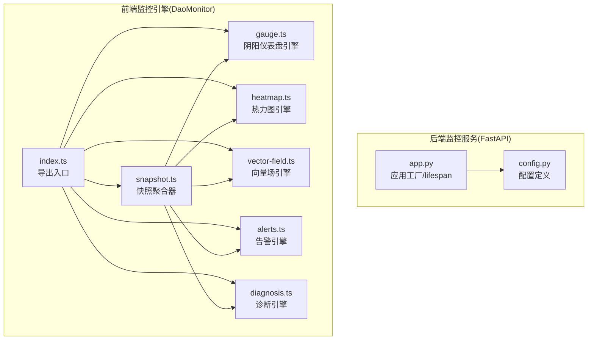
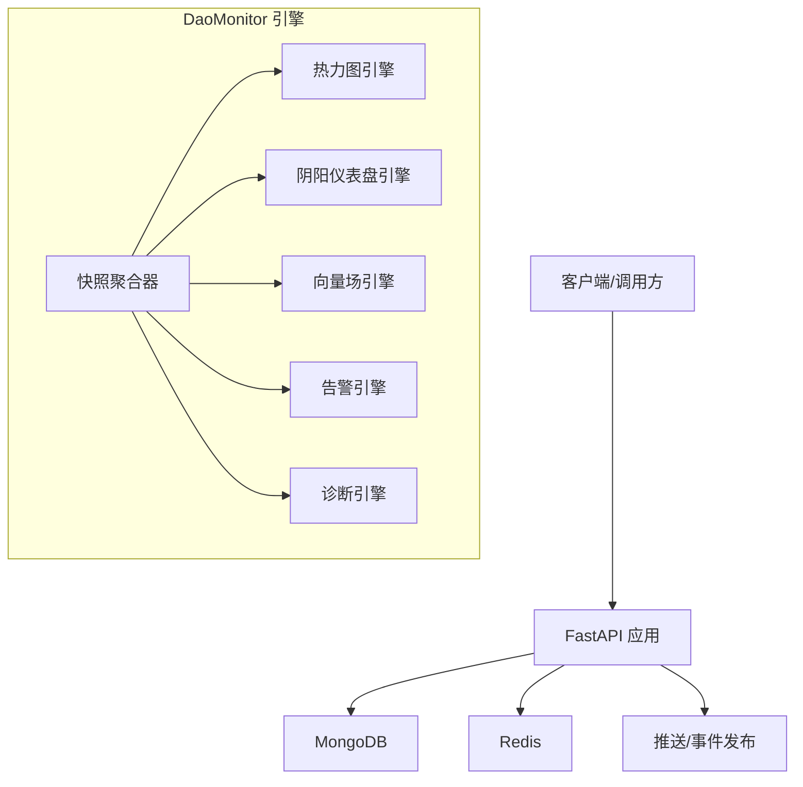
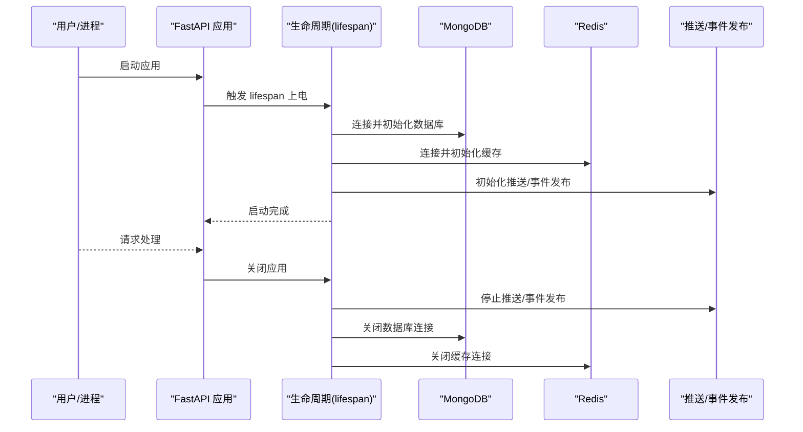
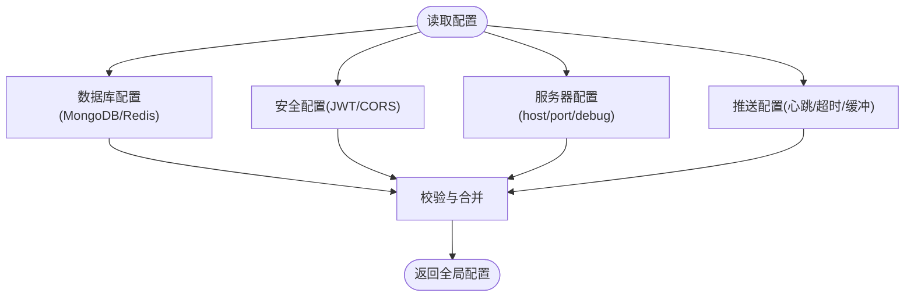
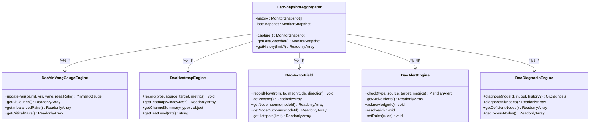
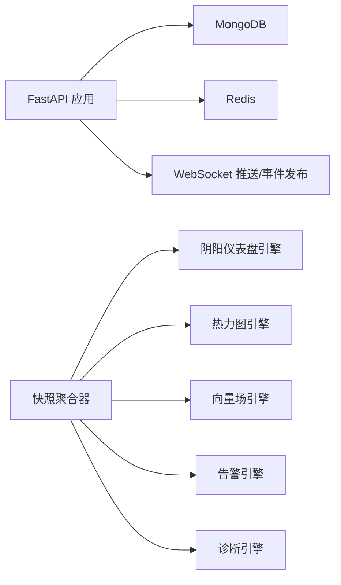

# 监控服务器

<cite>
**本文引用的文件**
- [apps/DaoMind/packages/daoMonitor/src/index.ts](file://apps/DaoMind/packages/daoMonitor/src/index.ts)
- [apps/DaoMind/packages/daoMonitor/src/snapshot.ts](file://apps/DaoMind/packages/daoMonitor/src/snapshot.ts)
- [apps/DaoMind/packages/daoMonitor/src/gauge.ts](file://apps/DaoMind/packages/daoMonitor/src/gauge.ts)
- [apps/DaoMind/packages/daoMonitor/src/heatmap.ts](file://apps/DaoMind/packages/daoMonitor/src/heatmap.ts)
- [apps/DaoMind/packages/daoMonitor/src/vector-field.ts](file://apps/DaoMind/packages/daoMonitor/src/vector-field.ts)
- [apps/DaoMind/packages/daoMonitor/src/alerts.ts](file://apps/DaoMind/packages/daoMonitor/src/alerts.ts)
- [apps/DaoMind/packages/daoMonitor/src/diagnosis.ts](file://apps/DaoMind/packages/daoMonitor/src/diagnosis.ts)
- [apps/DaoMind/README.md](file://apps/DaoMind/README.md)
- [apps/DaoMind/tests/test-monitor-system.test.ts](file://apps/DaoMind/tests/test-monitor-system.test.ts)
- [apps/DaoMind/packages/daoMonitor/package.json](file://apps/DaoMind/packages/daoMonitor/package.json)
- [tools/flexloop/src/taolib/testing/config_center/server/app.py](file://tools/flexloop/src/taolib/testing/config_center/server/app.py)
- [tools/flexloop/src/taolib/testing/config_center/server/config.py](file://tools/flexloop/src/taolib/testing/config_center/server/config.py)
- [tools/flexloop/doc/scripts/monitor_build_size.py](file://tools/flexloop/doc/scripts/monitor_build_size.py)
</cite>

## 目录
1. [简介](#简介)
2. [项目结构](#项目结构)
3. [核心组件](#核心组件)
4. [架构总览](#架构总览)
5. [详细组件分析](#详细组件分析)
6. [依赖关系分析](#依赖关系分析)
7. [性能考量](#性能考量)
8. [故障排查指南](#故障排查指南)
9. [结论](#结论)
10. [附录](#附录)

## 简介
本文件面向“监控服务器”模块，围绕基于 FastAPI 的后端服务与前端监控引擎（DaoMonitor）两大维度展开。前者提供配置中心服务的 FastAPI 应用、路由与中间件配置、数据库与缓存连接、推送与事件发布等能力；后者提供一套以中医经络哲学为灵感的系统监控与可视化引擎，包含热力图、向量场、阴阳仪表盘、告警与诊断等组件，并通过快照聚合器统一输出系统健康状态。

## 项目结构
监控服务器相关代码主要分布在以下位置：
- 后端监控服务（FastAPI）：tools/flexloop/src/taolib/testing/config_center/server
- 前端监控引擎（DaoMonitor）：apps/DaoMind/packages/daoMonitor
- 相关测试与文档：apps/DaoMind/tests、apps/DaoMind/README.md
- 构建与体积监控脚本：tools/flexloop/doc/scripts/monitor_build_size.py

图表来源
- [tools/flexloop/src/taolib/testing/config_center/server/app.py:128-149](file://tools/flexloop/src/taolib/testing/config_center/server/app.py#L128-L149)
- [tools/flexloop/src/taolib/testing/config_center/server/config.py:12-65](file://tools/flexloop/src/taolib/testing/config_center/server/config.py#L12-L65)
- [apps/DaoMind/packages/daoMonitor/src/index.ts:1-17](file://apps/DaoMind/packages/daoMonitor/src/index.ts#L1-L17)
- [apps/DaoMind/packages/daoMonitor/src/snapshot.ts:10-75](file://apps/DaoMind/packages/daoMonitor/src/snapshot.ts#L10-L75)

章节来源
- [tools/flexloop/src/taolib/testing/config_center/server/app.py:128-149](file://tools/flexloop/src/taolib/testing/config_center/server/app.py#L128-L149)
- [tools/flexloop/src/taolib/testing/config_center/server/config.py:12-65](file://tools/flexloop/src/taolib/testing/config_center/server/config.py#L12-L65)
- [apps/DaoMind/packages/daoMonitor/src/index.ts:1-17](file://apps/DaoMind/packages/daoMonitor/src/index.ts#L1-L17)

## 核心组件
- FastAPI 应用工厂与生命周期管理：负责启动时初始化数据库、缓存、推送与事件发布组件，关闭时释放资源。
- 配置管理：集中定义数据库、缓存、JWT、CORS、推送等参数，支持环境变量注入。
- DaoMonitor 引擎：提供热力图、向量场、阴阳仪表盘、告警、诊断与快照聚合等能力，统一输出系统健康状态。

章节来源
- [tools/flexloop/src/taolib/testing/config_center/server/app.py:27-105](file://tools/flexloop/src/taolib/testing/config_center/server/app.py#L27-L105)
- [tools/flexloop/src/taolib/testing/config_center/server/config.py:12-65](file://tools/flexloop/src/taolib/testing/config_center/server/config.py#L12-L65)
- [apps/DaoMind/packages/daoMonitor/src/snapshot.ts:10-75](file://apps/DaoMind/packages/daoMonitor/src/snapshot.ts#L10-L75)

## 架构总览
后端监控服务采用 FastAPI，结合 MongoDB 与 Redis 实现配置、审计与推送能力；前端监控引擎通过一组独立的 TypeScript 组件采集与计算系统状态，最终由快照聚合器输出统一的健康快照。

图表来源
- [tools/flexloop/src/taolib/testing/config_center/server/app.py:33-104](file://tools/flexloop/src/taolib/testing/config_center/server/app.py#L33-L104)
- [apps/DaoMind/packages/daoMonitor/src/snapshot.ts:14-20](file://apps/DaoMind/packages/daoMonitor/src/snapshot.ts#L14-L20)

## 详细组件分析

### FastAPI 应用与生命周期
- 应用工厂：创建 FastAPI 实例，注册 CORS 中间件，挂载路由。
- 生命周期：启动时建立数据库与缓存连接，创建索引，初始化推送与事件发布组件；关闭时释放资源。
- 路由组织：通过 include_router 引入 API 路由（具体路由定义位于 router 模块）。

图表来源
- [tools/flexloop/src/taolib/testing/config_center/server/app.py:27-105](file://tools/flexloop/src/taolib/testing/config_center/server/app.py#L27-L105)

章节来源
- [tools/flexloop/src/taolib/testing/config_center/server/app.py:128-149](file://tools/flexloop/src/taolib/testing/config_center/server/app.py#L128-L149)
- [tools/flexloop/src/taolib/testing/config_center/server/app.py:27-105](file://tools/flexloop/src/taolib/testing/config_center/server/app.py#L27-L105)

### 配置管理
- 数据库与缓存：MongoDB 连接字符串与数据库名、Redis 连接字符串。
- 安全：JWT 密钥、算法、Token 过期时间；生产环境要求密钥长度≥32字符。
- 服务器：监听地址、端口、调试模式。
- CORS：允许的源列表。
- 推送服务：心跳间隔、超时、ACK 超时、最大重试次数、离线消息缓冲上限与TTL、实例ID。

图表来源
- [tools/flexloop/src/taolib/testing/config_center/server/config.py:12-65](file://tools/flexloop/src/taolib/testing/config_center/server/config.py#L12-L65)

章节来源
- [tools/flexloop/src/taolib/testing/config_center/server/config.py:12-65](file://tools/flexloop/src/taolib/testing/config_center/server/config.py#L12-L65)

### DaoMonitor 引擎概览
- 导出入口：统一导出类型与各引擎类。
- 快照聚合器：整合热力图、向量场、仪表盘、告警与诊断，计算系统健康分并维护历史快照。
- 阴阳仪表盘引擎：按对更新阴阳值，计算偏差与状态，判断是否失衡或临界。
- 热力图引擎：记录通道流量指标，支持窗口查询与通道汇总。
- 向量场引擎：记录节点间流量方向与压力，统计热点节点。
- 告警引擎：内置默认规则，支持动态设置规则，检测并生成告警。
- 诊断引擎：基于活动度与趋势判断节点状态（充/虚/平衡），给出建议。

图表来源
- [apps/DaoMind/packages/daoMonitor/src/snapshot.ts:10-75](file://apps/DaoMind/packages/daoMonitor/src/snapshot.ts#L10-L75)
- [apps/DaoMind/packages/daoMonitor/src/gauge.ts:14-103](file://apps/DaoMind/packages/daoMonitor/src/gauge.ts#L14-L103)
- [apps/DaoMind/packages/daoMonitor/src/heatmap.ts:15-99](file://apps/DaoMind/packages/daoMonitor/src/heatmap.ts#L15-L99)
- [apps/DaoMind/packages/daoMonitor/src/vector-field.ts:11-79](file://apps/DaoMind/packages/daoMonitor/src/vector-field.ts#L11-L79)
- [apps/DaoMind/packages/daoMonitor/src/alerts.ts:61-121](file://apps/DaoMind/packages/daoMonitor/src/alerts.ts#L61-L121)
- [apps/DaoMind/packages/daoMonitor/src/diagnosis.ts:7-74](file://apps/DaoMind/packages/daoMonitor/src/diagnosis.ts#L7-L74)

章节来源
- [apps/DaoMind/packages/daoMonitor/src/index.ts:1-17](file://apps/DaoMind/packages/daoMonitor/src/index.ts#L1-L17)
- [apps/DaoMind/packages/daoMonitor/src/snapshot.ts:10-75](file://apps/DaoMind/packages/daoMonitor/src/snapshot.ts#L10-L75)
- [apps/DaoMind/packages/daoMonitor/src/gauge.ts:14-103](file://apps/DaoMind/packages/daoMonitor/src/gauge.ts#L14-L103)
- [apps/DaoMind/packages/daoMonitor/src/heatmap.ts:15-99](file://apps/DaoMind/packages/daoMonitor/src/heatmap.ts#L15-L99)
- [apps/DaoMind/packages/daoMonitor/src/vector-field.ts:11-79](file://apps/DaoMind/packages/daoMonitor/src/vector-field.ts#L11-L79)
- [apps/DaoMind/packages/daoMonitor/src/alerts.ts:61-121](file://apps/DaoMind/packages/daoMonitor/src/alerts.ts#L61-L121)
- [apps/DaoMind/packages/daoMonitor/src/diagnosis.ts:7-74](file://apps/DaoMind/packages/daoMonitor/src/diagnosis.ts#L7-L74)

### 分析 API 的实现要点（后端）
- 数据查询接口：通过 include_router 引入的 api_router 提供业务接口（具体路由定义在 router 模块中）。
- 参数验证：依赖 FastAPI 的 Pydantic 模型与依赖注入机制进行请求体与路径参数校验。
- 响应格式：遵循 RESTful 设计，返回 JSON 结构，错误通过异常处理器统一处理。
- 中间件集成：已集成 CORS 中间件，便于跨域访问。

章节来源
- [tools/flexloop/src/taolib/testing/config_center/server/app.py:146-147](file://tools/flexloop/src/taolib/testing/config_center/server/app.py#L146-L147)
- [tools/flexloop/src/taolib/testing/config_center/server/app.py:137-144](file://tools/flexloop/src/taolib/testing/config_center/server/app.py#L137-L144)

### 健康检查与监控端点（后端）
- 服务状态：可通过应用生命周期日志与数据库/缓存连接状态判断服务可用性。
- 指标暴露：当前仓库未见 Prometheus 或 OpenMetrics 暴露端点实现，建议在现有路由中新增 /metrics。
- 告警集成：可将告警引擎输出接入外部告警平台（如 Webhook），在告警产生时触发通知。

章节来源
- [tools/flexloop/src/taolib/testing/config_center/server/app.py:27-105](file://tools/flexloop/src/taolib/testing/config_center/server/app.py#L27-L105)
- [apps/DaoMind/packages/daoMonitor/src/alerts.ts:61-121](file://apps/DaoMind/packages/daoMonitor/src/alerts.ts#L61-L121)

### 部署配置、安全设置与运维最佳实践
- 部署配置：通过环境变量覆盖配置模块中的默认值，确保生产环境不使用默认密钥与开发端口。
- 安全设置：生产环境必须设置足够长度的 JWT 密钥；限制 CORS 源；启用 HTTPS 与访问控制。
- 运维监控：结合构建体积监控脚本定期评估前端包大小变化，避免引入不必要的依赖导致体积膨胀。

章节来源
- [tools/flexloop/src/taolib/testing/config_center/server/config.py:53-58](file://tools/flexloop/src/taolib/testing/config_center/server/config.py#L53-L58)
- [tools/flexloop/doc/scripts/monitor_build_size.py:1-200](file://tools/flexloop/doc/scripts/monitor_build_size.py#L1-L200)

## 依赖关系分析
- 后端服务依赖：FastAPI、MongoDB（motor）、Redis（异步客户端）、WebSocket 推送与事件发布。
- 前端监控引擎内部依赖：各引擎之间通过快照聚合器耦合，彼此相对独立，便于扩展与替换。

图表来源
- [tools/flexloop/src/taolib/testing/config_center/server/app.py:33-104](file://tools/flexloop/src/taolib/testing/config_center/server/app.py#L33-L104)
- [apps/DaoMind/packages/daoMonitor/src/snapshot.ts:14-20](file://apps/DaoMind/packages/daoMonitor/src/snapshot.ts#L14-L20)

章节来源
- [tools/flexloop/src/taolib/testing/config_center/server/app.py:33-104](file://tools/flexloop/src/taolib/testing/config_center/server/app.py#L33-L104)
- [apps/DaoMind/packages/daoMonitor/src/snapshot.ts:14-20](file://apps/DaoMind/packages/daoMonitor/src/snapshot.ts#L14-L20)

## 性能考量
- 缓冲与容量：热力图引擎采用环形缓冲区，容量可配置；快照历史长度有限，避免内存无限增长。
- 计算复杂度：告警与诊断逻辑为 O(n) 遍历，节点规模扩大时需关注时间复杂度；建议在高并发场景下引入限流与降采样策略。
- 存储与索引：启动时创建必要的数据库索引，提升查询效率；合理设置 Redis TTL 与缓冲上限，避免缓存雪崩。

章节来源
- [apps/DaoMind/packages/daoMonitor/src/heatmap.ts:20-42](file://apps/DaoMind/packages/daoMonitor/src/heatmap.ts#L20-L42)
- [apps/DaoMind/packages/daoMonitor/src/snapshot.ts:8-12](file://apps/DaoMind/packages/daoMonitor/src/snapshot.ts#L8-L12)
- [tools/flexloop/src/taolib/testing/config_center/server/app.py:42-50](file://tools/flexloop/src/taolib/testing/config_center/server/app.py#L42-L50)

## 故障排查指南
- 启动失败：检查数据库与缓存连接字符串是否正确，确认端口未被占用。
- 配置错误：生产环境必须满足 JWT 密钥长度要求；CORS 源需精确配置。
- 告警不生效：核对告警规则是否被覆盖，检查告警是否被确认或解决。
- 快照为空：确认各引擎是否正确记录数据，检查时间窗口与过滤条件。

章节来源
- [tools/flexloop/src/taolib/testing/config_center/server/config.py:53-58](file://tools/flexloop/src/taolib/testing/config_center/server/config.py#L53-L58)
- [apps/DaoMind/packages/daoMonitor/src/alerts.ts:118-121](file://apps/DaoMind/packages/daoMonitor/src/alerts.ts#L118-L121)
- [apps/DaoMind/packages/daoMonitor/src/snapshot.ts:22-58](file://apps/DaoMind/packages/daoMonitor/src/snapshot.ts#L22-L58)

## 结论
监控服务器模块由后端 FastAPI 服务与前端 DaoMonitor 引擎共同组成。后端提供稳定的数据存储与推送基础设施，前端引擎以中医经络理念抽象系统状态，二者协同实现从数据采集到健康可视化的完整闭环。建议后续补充指标暴露与告警集成，完善生产级可观测性能力。

## 附录
- 如何启动监控服务：参考应用工厂与生命周期管理，确保数据库与缓存连接成功。
- 如何配置 API 端点：通过 include_router 引入路由模块，使用 FastAPI 的依赖注入与 Pydantic 校验请求参数。
- 自定义监控指标：可在告警引擎中添加新规则，或在快照聚合器中扩展健康评分逻辑。

章节来源
- [tools/flexloop/src/taolib/testing/config_center/server/app.py:128-149](file://tools/flexloop/src/taolib/testing/config_center/server/app.py#L128-L149)
- [apps/DaoMind/packages/daoMonitor/src/alerts.ts:118-121](file://apps/DaoMind/packages/daoMonitor/src/alerts.ts#L118-L121)
- [apps/DaoMind/packages/daoMonitor/src/snapshot.ts:31-52](file://apps/DaoMind/packages/daoMonitor/src/snapshot.ts#L31-L52)