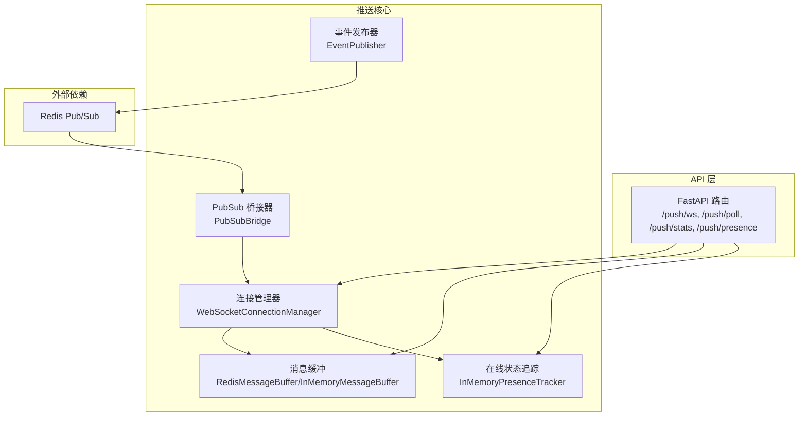
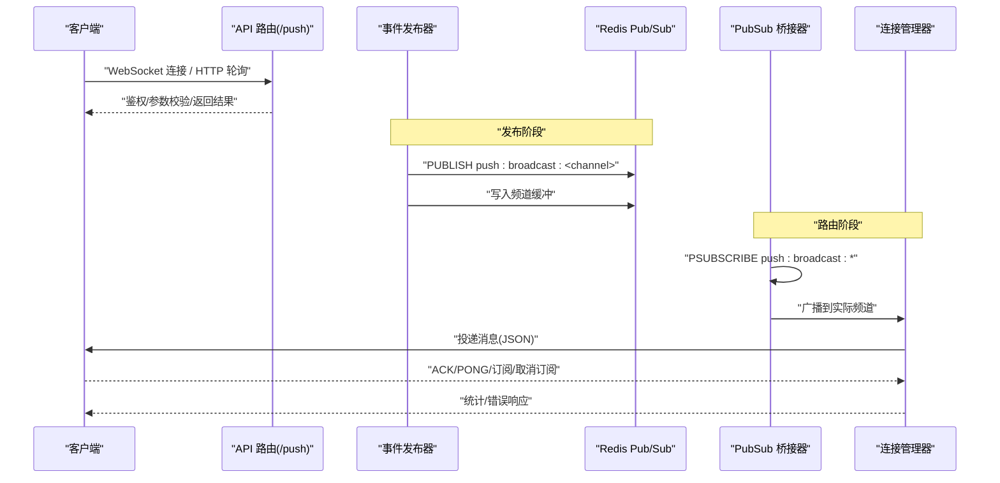
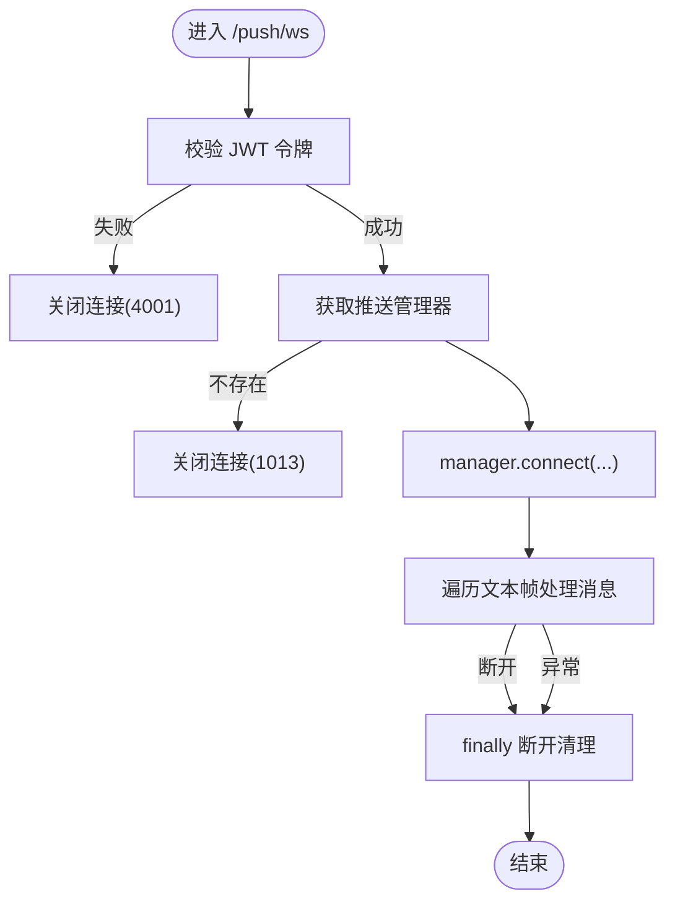
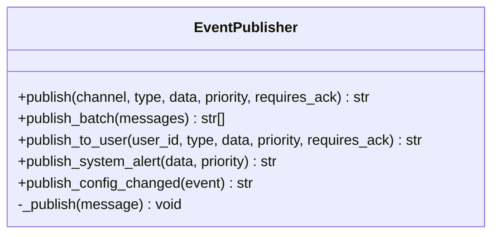
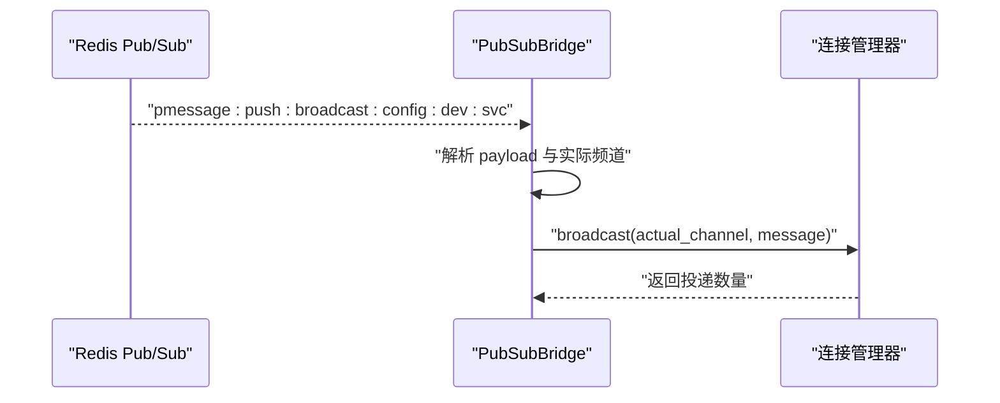
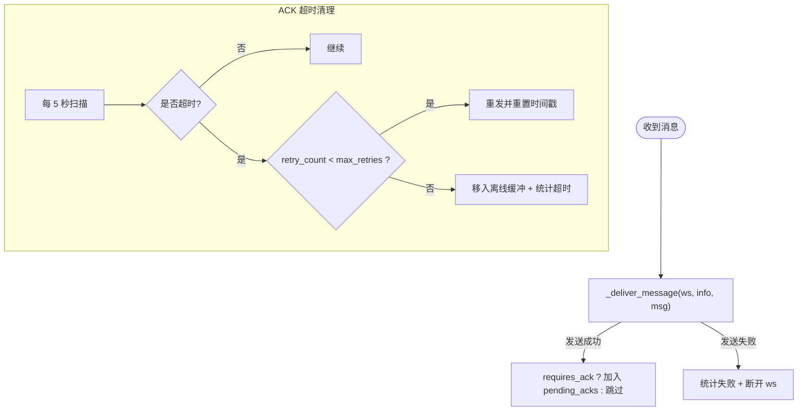
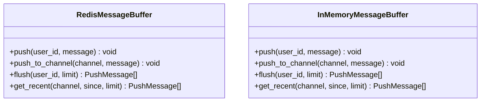
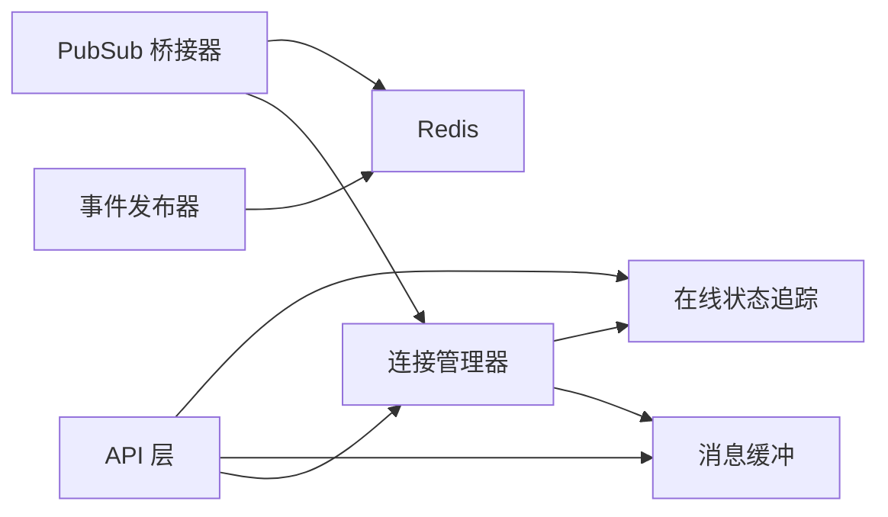
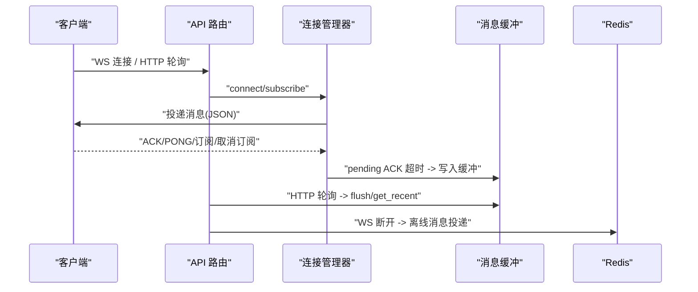

# 推送服务

<cite>
**本文引用的文件**
- [push.py](file://tools/flexloop/src/taolib/testing/config_center/server/api/push.py)
- [manager.py](file://tools/flexloop/src/taolib/testing/config_center/server/websocket/manager.py)
- [message_buffer.py](file://tools/flexloop/src/taolib/testing/config_center/server/websocket/message_buffer.py)
- [publisher.py](file://tools/flexloop/src/taolib/testing/config_center/events/publisher.py)
- [pubsub_bridge.py](file://tools/flexloop/src/taolib/testing/config_center/server/websocket/pubsub_bridge.py)
- [test_push_service.py](file://tools/flexloop/tests/testing/test_config_center/test_push_service.py)
</cite>

## 目录
1. [简介](#简介)
2. [项目结构](#项目结构)
3. [核心组件](#核心组件)
4. [架构总览](#架构总览)
5. [详细组件分析](#详细组件分析)
6. [依赖关系分析](#依赖关系分析)
7. [性能考量](#性能考量)
8. [故障排查指南](#故障排查指南)
9. [结论](#结论)
10. [附录](#附录)

## 简介
本文件面向“推送服务”模块，系统性阐述其设计与实现，涵盖事件发布、订阅管理、消息路由、HTTP 轮询降级、ACK/重传、心跳检测、离线缓冲、在线状态追踪、监控统计等能力。文档同时给出 API 设计、数据模型、处理流程图与最佳实践建议，并提供可直接定位到源码位置的参考路径，便于开发者快速上手与扩展。

## 项目结构
推送服务位于工具链模块内，采用“事件发布 + PubSub 桥接 + WebSocket 管理器”的分层架构，配合 HTTP 轮询降级与在线状态追踪，形成高可用、可扩展的实时推送体系。

图表来源
- [push.py:1-190](file://tools/flexloop/src/taolib/testing/config_center/server/api/push.py#L1-L190)
- [publisher.py:1-194](file://tools/flexloop/src/taolib/testing/config_center/events/publisher.py#L1-L194)
- [pubsub_bridge.py:1-222](file://tools/flexloop/src/taolib/testing/config_center/server/websocket/pubsub_bridge.py#L1-L222)
- [manager.py:1-467](file://tools/flexloop/src/taolib/testing/config_center/server/websocket/manager.py#L1-L467)
- [message_buffer.py:1-144](file://tools/flexloop/src/taolib/testing/config_center/server/websocket/message_buffer.py#L1-L144)

章节来源
- [push.py:1-190](file://tools/flexloop/src/taolib/testing/config_center/server/api/push.py#L1-L190)

## 核心组件
- API 层：提供 WebSocket、HTTP 轮询、监控与在线状态查询端点，负责鉴权与参数校验。
- 事件发布器：构建消息、发布到 Redis 并写入缓冲，保证至少一次投递。
- PubSub 桥接器：订阅 Redis 模式频道，将消息路由到本地连接管理器。
- 连接管理器：维护连接、订阅、广播、ACK 跟踪、心跳检测、离线缓冲与统计。
- 消息缓冲：基于 Redis LIST 的用户/频道缓冲，支持轮询与离线投递。
- 在线状态追踪：跨实例同步用户在线状态，支持刷新与查询。

章节来源
- [push.py:1-190](file://tools/flexloop/src/taolib/testing/config_center/server/api/push.py#L1-L190)
- [publisher.py:1-194](file://tools/flexloop/src/taolib/testing/config_center/events/publisher.py#L1-L194)
- [pubsub_bridge.py:1-222](file://tools/flexloop/src/taolib/testing/config_center/server/websocket/pubsub_bridge.py#L1-L222)
- [manager.py:1-467](file://tools/flexloop/src/taolib/testing/config_center/server/websocket/manager.py#L1-L467)
- [message_buffer.py:1-144](file://tools/flexloop/src/taolib/testing/config_center/server/websocket/message_buffer.py#L1-L144)

## 架构总览
推送服务采用“发布-订阅-路由-投递”的流水线设计：
- 业务侧通过事件发布器将消息发布到 Redis Pub/Sub。
- PubSub 桥接器监听模式频道，解析消息并调用连接管理器进行广播。
- 连接管理器根据订阅关系投递消息给已连接的客户端。
- 客户端通过 ACK/心跳维持连接；若未收到 ACK 或心跳超时，触发重传或清理。
- 离线用户的消息写入缓冲，上线后立即投递。

图表来源
- [push.py:53-140](file://tools/flexloop/src/taolib/testing/config_center/server/api/push.py#L53-L140)
- [publisher.py:176-193](file://tools/flexloop/src/taolib/testing/config_center/events/publisher.py#L176-L193)
- [pubsub_bridge.py:109-148](file://tools/flexloop/src/taolib/testing/config_center/server/websocket/pubsub_bridge.py#L109-L148)
- [manager.py:235-318](file://tools/flexloop/src/taolib/testing/config_center/server/websocket/manager.py#L235-L318)

## 详细组件分析

### API 层（HTTP/WebSocket）
- WebSocket 端点：鉴权、自动订阅、主消息循环、断开清理。
- HTTP 轮询端点：增量拉取、时间戳过滤、分页限制。
- 监控端点：连接统计、在线状态查询、全量在线用户。
- 错误处理：服务未就绪、认证失败、参数非法、连接断开等。

图表来源
- [push.py:53-97](file://tools/flexloop/src/taolib/testing/config_center/server/api/push.py#L53-L97)
- [manager.py:114-172](file://tools/flexloop/src/taolib/testing/config_center/server/websocket/manager.py#L114-L172)

章节来源
- [push.py:53-140](file://tools/flexloop/src/taolib/testing/config_center/server/api/push.py#L53-L140)

### 事件发布器（EventPublisher）
- 构建 PushMessage（含唯一 ID、优先级、ACK 标记、发送方实例 ID）。
- 发布到 Redis Pub/Sub，频道前缀统一为 push:broadcast:。
- 写入频道缓冲以支持 HTTP 轮询与离线投递。
- 提供便捷方法：配置变更、用户直达、系统告警、批量发布。

图表来源
- [publisher.py:20-194](file://tools/flexloop/src/taolib/testing/config_center/events/publisher.py#L20-L194)

章节来源
- [publisher.py:46-103](file://tools/flexloop/src/taolib/testing/config_center/events/publisher.py#L46-L103)
- [publisher.py:105-132](file://tools/flexloop/src/taolib/testing/config_center/events/publisher.py#L105-L132)
- [publisher.py:138-170](file://tools/flexloop/src/taolib/testing/config_center/events/publisher.py#L138-L170)
- [publisher.py:176-193](file://tools/flexloop/src/taolib/testing/config_center/events/publisher.py#L176-L193)

### PubSub 桥接器（PubSubBridge）
- PSUBSCRIBE 模式订阅 push:broadcast:*，解析消息并还原实际频道。
- 将消息转发给连接管理器进行本地广播。
- 健康检查与指数退避重连，保障跨实例一致性。

图表来源
- [pubsub_bridge.py:109-148](file://tools/flexloop/src/taolib/testing/config_center/server/websocket/pubsub_bridge.py#L109-L148)
- [pubsub_bridge.py:168-219](file://tools/flexloop/src/taolib/testing/config_center/server/websocket/pubsub_bridge.py#L168-L219)

章节来源
- [pubsub_bridge.py:63-99](file://tools/flexloop/src/taolib/testing/config_center/server/websocket/pubsub_bridge.py#L63-L99)
- [pubsub_bridge.py:109-148](file://tools/flexloop/src/taolib/testing/config_center/server/websocket/pubsub_bridge.py#L109-L148)
- [pubsub_bridge.py:168-219](file://tools/flexloop/src/taolib/testing/config_center/server/websocket/pubsub_bridge.py#L168-L219)

### 连接管理器（WebSocketConnectionManager）
- 连接生命周期：accept、connect（自动订阅、离线消息投递）、disconnect（清理、缓冲 pending ACK）。
- 频道订阅：subscribe/unsubscribe/broadcast，支持多设备与用户维度。
- 消息投递：_deliver_message（发送 + ACK 追踪），失败计数。
- 客户端消息处理：ACK、PONG、订阅/取消订阅、未知类型错误。
- ACK 超时清理：周期扫描 pending_acks，重传或转入缓冲，超过最大重试则记录超时。
- 心跳检测：HeartbeatMonitor 定期 ping/清理僵尸连接。
- 统计与监控：连接数、消息数、ACK 统计、在线用户、运行时长。

图表来源
- [manager.py:298-318](file://tools/flexloop/src/taolib/testing/config_center/server/websocket/manager.py#L298-L318)
- [manager.py:373-418](file://tools/flexloop/src/taolib/testing/config_center/server/websocket/manager.py#L373-L418)

章节来源
- [manager.py:114-206](file://tools/flexloop/src/taolib/testing/config_center/server/websocket/manager.py#L114-L206)
- [manager.py:235-287](file://tools/flexloop/src/taolib/testing/config_center/server/websocket/manager.py#L235-L287)
- [manager.py:324-367](file://tools/flexloop/src/taolib/testing/config_center/server/websocket/manager.py#L324-L367)
- [manager.py:373-418](file://tools/flexloop/src/taolib/testing/config_center/server/websocket/manager.py#L373-L418)

### 消息缓冲（RedisMessageBuffer / InMemoryMessageBuffer）
- 用户缓冲：LPUSH + LTRIM + EXPIRE，支持 flush 取出并原子性裁剪。
- 频道缓冲：用于 HTTP 轮询的增量拉取，LRANGE + 时间过滤。
- 测试场景使用 InMemoryMessageBuffer 作为内存替代。

图表来源
- [message_buffer.py:17-103](file://tools/flexloop/src/taolib/testing/config_center/server/websocket/message_buffer.py#L17-L103)
- [message_buffer.py:105-142](file://tools/flexloop/src/taolib/testing/config_center/server/websocket/message_buffer.py#L105-L142)

章节来源
- [message_buffer.py:41-81](file://tools/flexloop/src/taolib/testing/config_center/server/websocket/message_buffer.py#L41-L81)
- [message_buffer.py:82-102](file://tools/flexloop/src/taolib/testing/config_center/server/websocket/message_buffer.py#L82-L102)

### 在线状态追踪（InMemoryPresenceTracker）
- 用户在线状态：set_online/set_offline，支持多实例连接计数与最后在线时间。
- 查询接口：get_status/get_all_online/refresh。

章节来源
- [test_push_service.py:169-228](file://tools/flexloop/tests/testing/test_config_center/test_push_service.py#L169-L228)

## 依赖关系分析
- API 层依赖应用状态中的推送管理器、消息缓冲与在线状态追踪器。
- 事件发布器依赖 Redis 客户端与消息缓冲协议。
- PubSub 桥接器依赖 Redis 客户端与连接管理器协议。
- 连接管理器依赖心跳监控、消息缓冲协议与在线状态追踪协议。

图表来源
- [push.py:24-45](file://tools/flexloop/src/taolib/testing/config_center/server/api/push.py#L24-L45)
- [publisher.py:32-40](file://tools/flexloop/src/taolib/testing/config_center/events/publisher.py#L32-L40)
- [pubsub_bridge.py:29-48](file://tools/flexloop/src/taolib/testing/config_center/server/websocket/pubsub_bridge.py#L29-L48)
- [manager.py:41-77](file://tools/flexloop/src/taolib/testing/config_center/server/websocket/manager.py#L41-L77)

## 性能考量
- 并发与锁：连接管理器使用异步锁保护关键状态更新，避免竞态。
- 批量发布：事件发布器使用 Redis pipeline 减少 RTT。
- 轮询降级：HTTP /push/poll 支持增量拉取与分页，降低长连接压力。
- 缓冲策略：用户/频道缓冲设置上限与 TTL，避免无限增长。
- 心跳与清理：定时清理僵尸连接与超时 ACK，保持系统健康。
- 分布式一致性：PubSub 桥接器健康检查与指数退避重连，提升鲁棒性。

## 故障排查指南
- WebSocket 未就绪：API 层在 app.state 中找不到推送管理器时返回 503。
- 认证失败：JWT 校验异常或无效令牌导致连接被关闭。
- 参数非法：HTTP 轮询时间戳格式错误返回 400。
- Redis 发布失败：事件发布器捕获异常并记录日志，不影响业务继续。
- ACK 超时：连接管理器记录超时次数，必要时将消息转入离线缓冲。
- 健康检查失败：PubSub 桥接器标记不健康并指数退避重连。

章节来源
- [push.py:24-45](file://tools/flexloop/src/taolib/testing/config_center/server/api/push.py#L24-L45)
- [push.py:118-124](file://tools/flexloop/src/taolib/testing/config_center/server/api/push.py#L118-L124)
- [publisher.py:181-184](file://tools/flexloop/src/taolib/testing/config_center/events/publisher.py#L181-L184)
- [manager.py:392-417](file://tools/flexloop/src/taolib/testing/config_center/server/websocket/manager.py#L392-L417)
- [pubsub_bridge.py:172-186](file://tools/flexloop/src/taolib/testing/config_center/server/websocket/pubsub_bridge.py#L172-L186)

## 结论
推送服务通过清晰的分层与协议抽象，实现了高可用、可扩展的实时消息投递能力。结合 ACK/重传、心跳检测、离线缓冲与监控统计，能够在复杂分布式环境中稳定运行。建议在生产环境启用 Redis 缓冲与桥接器健康检查，并根据流量规模调整缓冲上限与清理策略。

## 附录

### 推送 API 设计与响应格式
- WebSocket 端点
  - 路径：/push/ws
  - 方法：GET（升级为 WebSocket）
  - 查询参数：token（必需，JWT）、environments（可选，逗号分隔）、services（可选，逗号分隔）
  - 行为：鉴权后建立连接，自动订阅匹配频道，主循环处理客户端消息
- HTTP 轮询端点
  - 路径：/push/poll
  - 方法：GET
  - 查询参数：channels（必需，逗号分隔）、since（可选，ISO 时间戳）、limit（1-200，默认50）
  - 响应：messages（按时间升序）、server_timestamp、has_more
- 监控端点
  - 路径：/push/stats（需权限）
  - 响应：连接统计快照（连接数、消息数、在线用户、运行时长等）
  - 路径：/push/presence/{user_id}
  - 响应：用户在线状态（状态、连接数、活跃频道）
  - 路径：/push/presence（需权限）
  - 响应：所有在线用户列表

章节来源
- [push.py:53-140](file://tools/flexloop/src/taolib/testing/config_center/server/api/push.py#L53-L140)

### 配置验证与错误处理
- 配置验证：HTTP 轮询端点对 since 参数进行 ISO 时间戳格式校验，非法格式返回 400。
- 认证与鉴权：WebSocket 端点使用 JWT 校验，失败关闭连接；监控端点要求 push.read 权限。
- 异常处理：Redis 发布失败记录日志但不抛出；连接断开与心跳超时触发清理；未知客户端消息类型返回错误响应。

章节来源
- [push.py:118-124](file://tools/flexloop/src/taolib/testing/config_center/server/api/push.py#L118-L124)
- [push.py:66-74](file://tools/flexloop/src/taolib/testing/config_center/server/api/push.py#L66-L74)
- [manager.py:362-367](file://tools/flexloop/src/taolib/testing/config_center/server/websocket/manager.py#L362-L367)
- [publisher.py:181-184](file://tools/flexloop/src/taolib/testing/config_center/events/publisher.py#L181-L184)

### 推送事件处理流程（序列图）

图表来源
- [push.py:53-140](file://tools/flexloop/src/taolib/testing/config_center/server/api/push.py#L53-L140)
- [manager.py:298-318](file://tools/flexloop/src/taolib/testing/config_center/server/websocket/manager.py#L298-L318)
- [message_buffer.py:61-102](file://tools/flexloop/src/taolib/testing/config_center/server/websocket/message_buffer.py#L61-L102)

### 代码示例（路径指引）
- 配置推送参数（WebSocket 自动订阅）
  - 参考：[push.py:81-85](file://tools/flexloop/src/taolib/testing/config_center/server/api/push.py#L81-L85)
- 实现自定义验证器（HTTP 轮询时间戳）
  - 参考：[push.py:118-124](file://tools/flexloop/src/taolib/testing/config_center/server/api/push.py#L118-L124)
- 处理推送异常（Redis 发布失败）
  - 参考：[publisher.py:181-184](file://tools/flexloop/src/taolib/testing/config_center/events/publisher.py#L181-L184)
- ACK 超时与重试
  - 参考：[manager.py:392-417](file://tools/flexloop/src/taolib/testing/config_center/server/websocket/manager.py#L392-L417)
- 在线状态查询
  - 参考：[push.py:158-176](file://tools/flexloop/src/taolib/testing/config_center/server/api/push.py#L158-L176)