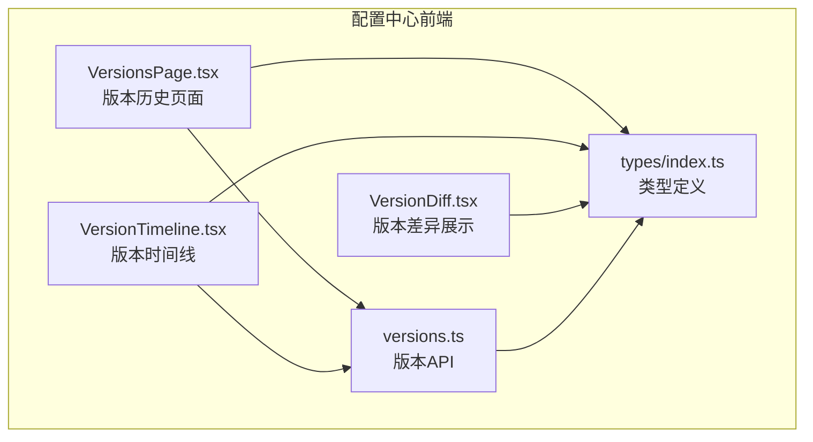
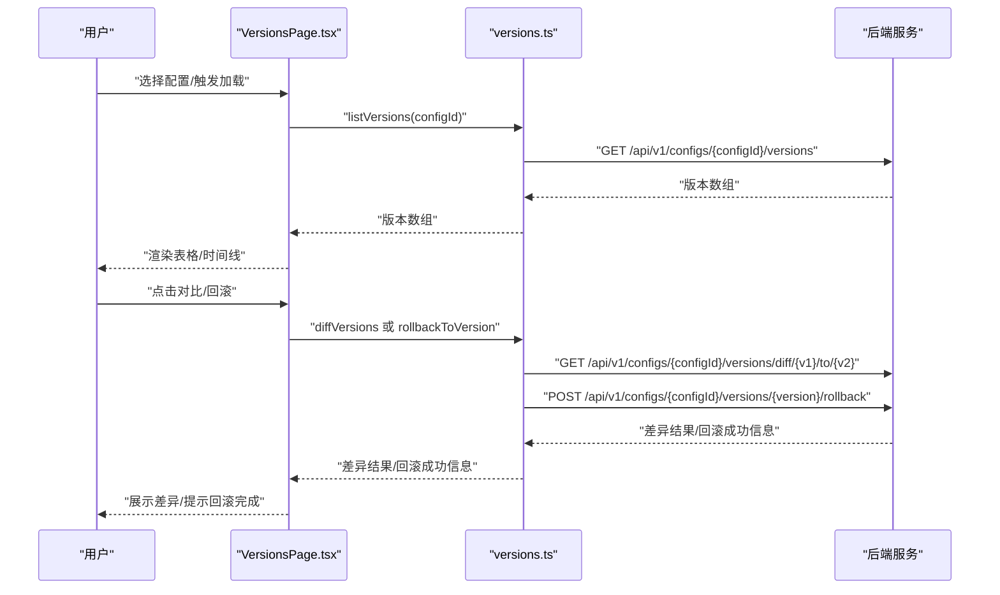
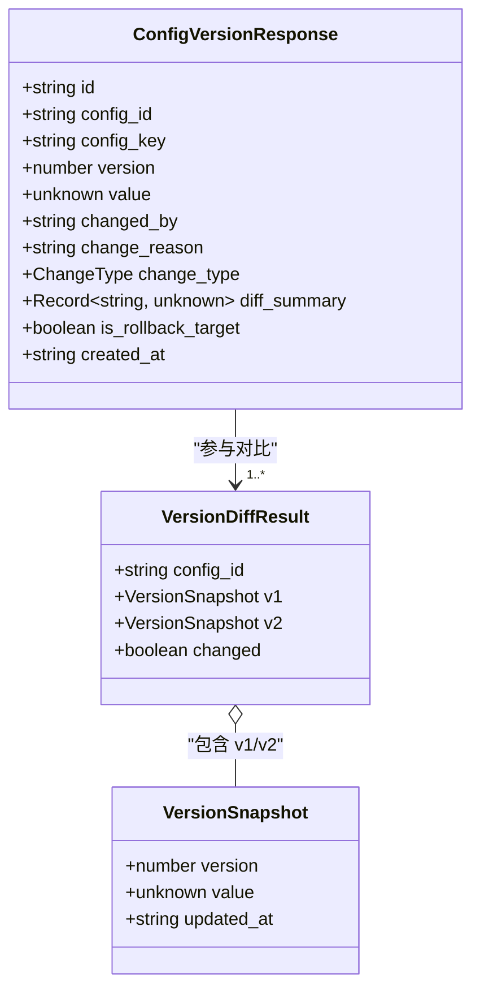
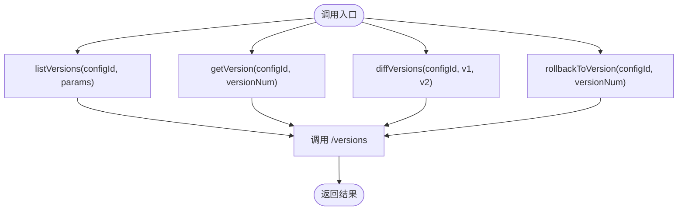
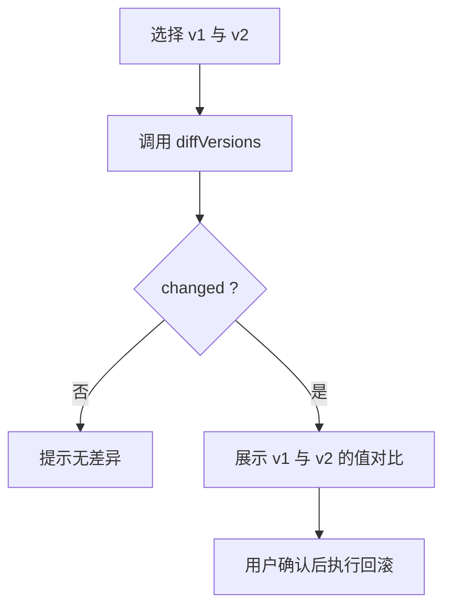
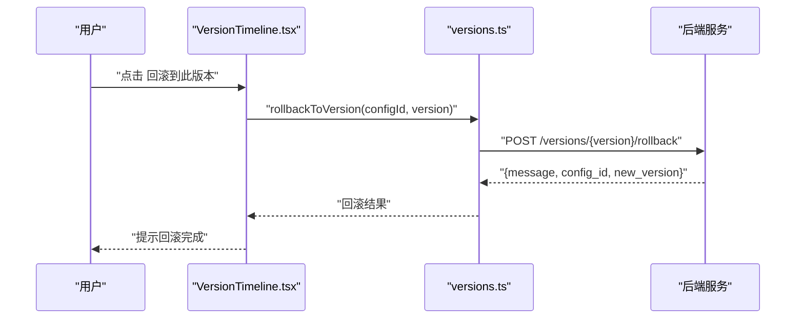
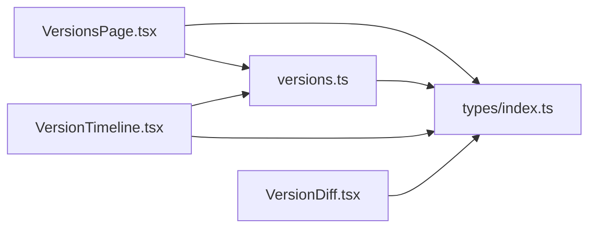

# 版本控制

<cite>
**本文引用的文件**
- [apps/config-center/src/api/versions.ts](file://apps/config-center/src/api/versions.ts)
- [apps/config-center/src/components/version/VersionDiff.tsx](file://apps/config-center/src/components/version/VersionDiff.tsx)
- [apps/config-center/src/components/version/VersionTimeline.tsx](file://apps/config-center/src/components/version/VersionTimeline.tsx)
- [apps/config-center/src/pages/VersionsPage.tsx](file://apps/config-center/src/pages/VersionsPage.tsx)
- [apps/config-center/src/types/index.ts](file://apps/config-center/src/types/index.ts)
</cite>

## 目录
1. [简介](#简介)
2. [项目结构](#项目结构)
3. [核心组件](#核心组件)
4. [架构总览](#架构总览)
5. [详细组件分析](#详细组件分析)
6. [依赖分析](#依赖分析)
7. [性能考虑](#性能考虑)
8. [故障排除指南](#故障排除指南)
9. [结论](#结论)
10. [附录](#附录)

## 简介
本文件聚焦于配置中心应用中的“版本控制”能力，系统性梳理前端侧的版本模型设计、版本服务接口、版本仓库（数据访问）模式、版本比较与差异计算、以及版本回滚等关键流程。文档以实际源码为依据，提供可操作的使用指南与最佳实践，帮助开发者快速理解并正确使用版本控制功能。

## 项目结构
版本控制相关代码主要位于配置中心前端应用中，采用按功能域划分的组织方式：
- API 层：封装版本相关的网络请求，如列出版本、获取指定版本、版本差异计算、回滚到指定版本。
- 组件层：提供版本差异展示与版本时间线交互，支持对比与回滚操作。
- 页面层：版本历史页面，聚合配置选择、搜索过滤与表格展示。
- 类型定义：统一的版本模型、变更类型枚举与审计动作等类型声明。

图表来源
- [apps/config-center/src/pages/VersionsPage.tsx:1-136](file://apps/config-center/src/pages/VersionsPage.tsx#L1-L136)
- [apps/config-center/src/components/version/VersionTimeline.tsx:1-67](file://apps/config-center/src/components/version/VersionTimeline.tsx#L1-L67)
- [apps/config-center/src/components/version/VersionDiff.tsx:1-40](file://apps/config-center/src/components/version/VersionDiff.tsx#L1-L40)
- [apps/config-center/src/api/versions.ts:1-29](file://apps/config-center/src/api/versions.ts#L1-L29)
- [apps/config-center/src/types/index.ts:52-73](file://apps/config-center/src/types/index.ts#L52-L73)

章节来源
- [apps/config-center/src/pages/VersionsPage.tsx:1-136](file://apps/config-center/src/pages/VersionsPage.tsx#L1-L136)
- [apps/config-center/src/components/version/VersionTimeline.tsx:1-67](file://apps/config-center/src/components/version/VersionTimeline.tsx#L1-L67)
- [apps/config-center/src/components/version/VersionDiff.tsx:1-40](file://apps/config-center/src/components/version/VersionDiff.tsx#L1-L40)
- [apps/config-center/src/api/versions.ts:1-29](file://apps/config-center/src/api/versions.ts#L1-L29)
- [apps/config-center/src/types/index.ts:1-163](file://apps/config-center/src/types/index.ts#L1-L163)

## 核心组件
- 版本模型与类型
  - 版本响应模型包含版本号、变更者、变更原因、变更类型、差异摘要、是否可作为回滚目标、创建时间等字段，用于完整描述一次配置变更。
  - 差异结果模型包含两个版本的值与更新时间，并标注是否存在差异。
  - 变更类型枚举涵盖新增、更新、删除、回滚等场景，便于前端渲染与审计追踪。
- 版本服务接口
  - 列出配置的所有版本，支持分页参数。
  - 获取指定版本详情。
  - 计算两个版本之间的差异。
  - 将配置回滚到指定版本。
- 版本UI组件
  - 时间线组件：展示版本序列、变更类型标签、操作者与时间、提供“与上一版本对比”和“回滚到此版本”的交互入口。
  - 差异组件：左右对比展示两个版本的值，支持格式化显示与滚动查看。
- 页面与交互
  - 版本历史页面：提供配置选择器、搜索框、表格展示；加载状态与错误提示完善；支持按配置键、变更者、变更原因进行过滤。

章节来源
- [apps/config-center/src/types/index.ts:52-73](file://apps/config-center/src/types/index.ts#L52-L73)
- [apps/config-center/src/api/versions.ts:1-29](file://apps/config-center/src/api/versions.ts#L1-L29)
- [apps/config-center/src/components/version/VersionTimeline.tsx:1-67](file://apps/config-center/src/components/version/VersionTimeline.tsx#L1-L67)
- [apps/config-center/src/components/version/VersionDiff.tsx:1-40](file://apps/config-center/src/components/version/VersionDiff.tsx#L1-L40)
- [apps/config-center/src/pages/VersionsPage.tsx:1-136](file://apps/config-center/src/pages/VersionsPage.tsx#L1-L136)

## 架构总览
前端版本控制的典型调用链路如下：页面发起请求，通过API层调用后端接口，返回版本数据或差异结果，再由UI组件渲染展示与交互。

图表来源
- [apps/config-center/src/pages/VersionsPage.tsx:31-49](file://apps/config-center/src/pages/VersionsPage.tsx#L31-L49)
- [apps/config-center/src/api/versions.ts:4-28](file://apps/config-center/src/api/versions.ts#L4-L28)

## 详细组件分析

### 版本模型与数据结构
- 版本响应模型
  - 字段要点：版本号、所属配置标识、配置键、变更者、变更原因、变更类型、差异摘要、是否可回滚目标、创建时间。
  - 关联关系：版本属于某个配置；版本变更类型用于分类统计与审计；差异摘要可用于快速预览变更范围。
- 差异结果模型
  - 字段要点：配置标识、两个版本的值与更新时间、是否存在差异标记。
  - 使用场景：在对比界面中直观呈现两版本差异，辅助决策是否执行回滚。

图表来源
- [apps/config-center/src/types/index.ts:54-73](file://apps/config-center/src/types/index.ts#L54-L73)

章节来源
- [apps/config-center/src/types/index.ts:52-73](file://apps/config-center/src/types/index.ts#L52-L73)

### 版本服务实现（API）
- 列出版本
  - 入参：配置标识、可选分页参数。
  - 返回：版本数组，包含版本号、变更类型、变更者、时间等。
- 获取版本
  - 入参：配置标识、版本号。
  - 返回：单个版本详情。
- 版本差异
  - 入参：配置标识、版本号 v1、版本号 v2。
  - 返回：差异结果，包含两版本值与差异标记。
- 回滚到版本
  - 入参：配置标识、目标版本号。
  - 返回：回滚成功提示与新版本号等信息。

图表来源
- [apps/config-center/src/api/versions.ts:4-28](file://apps/config-center/src/api/versions.ts#L4-L28)

章节来源
- [apps/config-center/src/api/versions.ts:1-29](file://apps/config-center/src/api/versions.ts#L1-L29)

### 版本仓库设计（数据访问模式）
- 数据访问模式
  - 前端通过统一的API模块封装HTTP请求，页面与组件仅负责调用与渲染，职责清晰。
  - 支持分页参数传递，便于大规模版本数据的高效加载。
- 事务与一致性
  - 回滚操作由后端原子性保证；前端仅负责触发与反馈。
- 索引与查询优化
  - 建议后端对配置标识、版本号、变更时间建立索引，以提升查询与排序性能。
  - 搜索过滤在前端完成（按配置键、变更者、变更原因），建议后端也提供服务端过滤参数以减轻前端压力。

章节来源
- [apps/config-center/src/api/versions.ts:4-28](file://apps/config-center/src/api/versions.ts#L4-L28)
- [apps/config-center/src/pages/VersionsPage.tsx:51-58](file://apps/config-center/src/pages/VersionsPage.tsx#L51-L58)

### 版本比较与差异计算
- 变更检测
  - 差异结果模型包含“是否存在差异”标记，便于快速判断两版本是否不同。
- 冲突识别
  - 当前前端未实现冲突合并逻辑；若存在并发写入，应由后端在回滚或发布时进行冲突判定与合并策略执行。
- 合并策略
  - 建议后端提供“三路合并”或“最后写入获胜”等策略配置，前端仅负责触发与确认。

图表来源
- [apps/config-center/src/api/versions.ts:15-21](file://apps/config-center/src/api/versions.ts#L15-L21)
- [apps/config-center/src/components/version/VersionDiff.tsx:8-38](file://apps/config-center/src/components/version/VersionDiff.tsx#L8-L38)

章节来源
- [apps/config-center/src/components/version/VersionDiff.tsx:1-40](file://apps/config-center/src/components/version/VersionDiff.tsx#L1-L40)
- [apps/config-center/src/api/versions.ts:15-21](file://apps/config-center/src/api/versions.ts#L15-L21)

### 版本回滚流程
- 触发回滚
  - 在版本时间线中选择目标版本，点击“回滚到此版本”按钮。
- 调用后端
  - 调用回滚接口，传入配置标识与目标版本号。
- 结果反馈
  - 成功后返回新版本号与提示信息，页面刷新版本列表以反映最新状态。

图表来源
- [apps/config-center/src/components/version/VersionTimeline.tsx:54-58](file://apps/config-center/src/components/version/VersionTimeline.tsx#L54-L58)
- [apps/config-center/src/api/versions.ts:23-28](file://apps/config-center/src/api/versions.ts#L23-L28)

章节来源
- [apps/config-center/src/components/version/VersionTimeline.tsx:1-67](file://apps/config-center/src/components/version/VersionTimeline.tsx#L1-L67)
- [apps/config-center/src/api/versions.ts:23-28](file://apps/config-center/src/api/versions.ts#L23-L28)

### 版本清理、归档与备份恢复（实践建议）
- 清理策略
  - 建议保留最近 N 个版本，超过阈值的历史版本自动归档或删除；归档前可导出差异报告。
- 归档策略
  - 对长期不活跃的配置版本进行冷存储，降低在线数据库压力；归档版本需保留版本号、变更者、变更原因与差异摘要。
- 备份与恢复
  - 定期备份版本表与审计日志；回滚即为一种恢复手段；建议提供批量导出与导入接口以便灾难恢复。

（本节为通用实践建议，不直接分析具体文件）

## 依赖分析
- 组件耦合
  - 页面组件依赖API模块与类型定义；时间线与差异组件依赖类型定义与工具函数。
- 外部依赖
  - UI库组件（Badge、Button、Table等）用于基础交互与展示。
  - 工具库用于日期格式化与消息提示。

图表来源
- [apps/config-center/src/pages/VersionsPage.tsx:1-136](file://apps/config-center/src/pages/VersionsPage.tsx#L1-L136)
- [apps/config-center/src/api/versions.ts:1-29](file://apps/config-center/src/api/versions.ts#L1-L29)
- [apps/config-center/src/components/version/VersionTimeline.tsx:1-67](file://apps/config-center/src/components/version/VersionTimeline.tsx#L1-L67)
- [apps/config-center/src/components/version/VersionDiff.tsx:1-40](file://apps/config-center/src/components/version/VersionDiff.tsx#L1-L40)
- [apps/config-center/src/types/index.ts:52-73](file://apps/config-center/src/types/index.ts#L52-L73)

章节来源
- [apps/config-center/src/pages/VersionsPage.tsx:1-136](file://apps/config-center/src/pages/VersionsPage.tsx#L1-L136)
- [apps/config-center/src/api/versions.ts:1-29](file://apps/config-center/src/api/versions.ts#L1-L29)
- [apps/config-center/src/components/version/VersionTimeline.tsx:1-67](file://apps/config-center/src/components/version/VersionTimeline.tsx#L1-L67)
- [apps/config-center/src/components/version/VersionDiff.tsx:1-40](file://apps/config-center/src/components/version/VersionDiff.tsx#L1-L40)
- [apps/config-center/src/types/index.ts:52-73](file://apps/config-center/src/types/index.ts#L52-L73)

## 性能考虑
- 分页与懒加载
  - 使用分页参数避免一次性加载过多版本数据。
- 前端过滤与服务端过滤
  - 前端提供搜索输入，建议后端也支持服务端过滤参数以减少传输量。
- 渲染优化
  - 差异展示使用预格式化文本块，避免大对象频繁重渲染；表格列渲染使用稳定键提取函数。
- 错误与空状态
  - 加载状态与错误提示完善用户体验；空状态友好提示。

（本节为通用指导，不直接分析具体文件）

## 故障排除指南
- 加载失败
  - 页面捕获异常并提示错误信息；检查网络请求与后端接口可用性。
- 无版本记录
  - 确认已选择有效配置；检查后端是否已生成版本。
- 对比无差异
  - 确认选择的版本号正确；检查差异接口返回标记。
- 回滚失败
  - 检查目标版本号是否可回滚；确认后端权限与一致性校验。

章节来源
- [apps/config-center/src/pages/VersionsPage.tsx:24-26](file://apps/config-center/src/pages/VersionsPage.tsx#L24-L26)
- [apps/config-center/src/pages/VersionsPage.tsx:40-42](file://apps/config-center/src/pages/VersionsPage.tsx#L40-L42)
- [apps/config-center/src/components/version/VersionTimeline.tsx:14-15](file://apps/config-center/src/components/version/VersionTimeline.tsx#L14-L15)
- [apps/config-center/src/components/version/VersionDiff.tsx:14-16](file://apps/config-center/src/components/version/VersionDiff.tsx#L14-L16)

## 结论
配置中心前端的版本控制以清晰的类型模型、简洁的API接口与直观的UI组件为核心，覆盖了版本创建、查询、对比与回滚的主要场景。建议在后端层面完善版本索引、差异合并策略与审计日志，以支撑更大规模的生产环境需求。

## 附录

### 实用示例（基于源码路径）
- 创建配置版本
  - 通过配置更新或发布流程触发版本生成；版本号通常由后端自增。
  - 参考路径：[apps/config-center/src/api/versions.ts:4-9](file://apps/config-center/src/api/versions.ts#L4-L9)
- 查询版本历史
  - 在版本历史页面选择配置后，调用列出版本接口获取版本数组。
  - 参考路径：[apps/config-center/src/pages/VersionsPage.tsx:31-49](file://apps/config-center/src/pages/VersionsPage.tsx#L31-L49)
- 实现版本回滚
  - 在版本时间线中选择目标版本，调用回滚接口并等待后端返回新版本号。
  - 参考路径：[apps/config-center/src/components/version/VersionTimeline.tsx:54-58](file://apps/config-center/src/components/version/VersionTimeline.tsx#L54-L58)、[apps/config-center/src/api/versions.ts:23-28](file://apps/config-center/src/api/versions.ts#L23-L28)

章节来源
- [apps/config-center/src/api/versions.ts:4-28](file://apps/config-center/src/api/versions.ts#L4-L28)
- [apps/config-center/src/components/version/VersionTimeline.tsx:54-58](file://apps/config-center/src/components/version/VersionTimeline.tsx#L54-L58)
- [apps/config-center/src/pages/VersionsPage.tsx:31-49](file://apps/config-center/src/pages/VersionsPage.tsx#L31-L49)