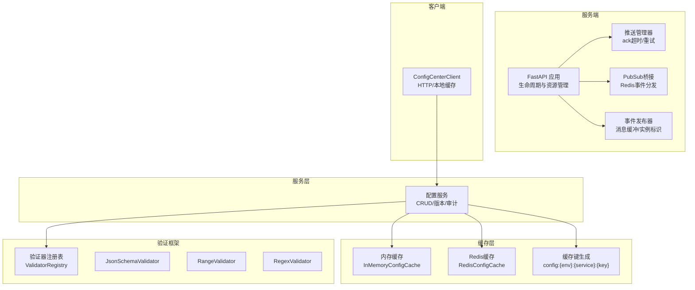
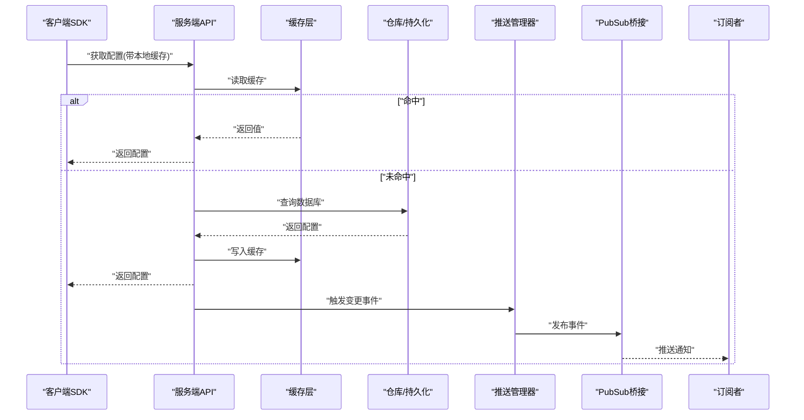
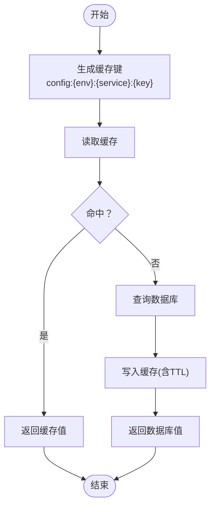
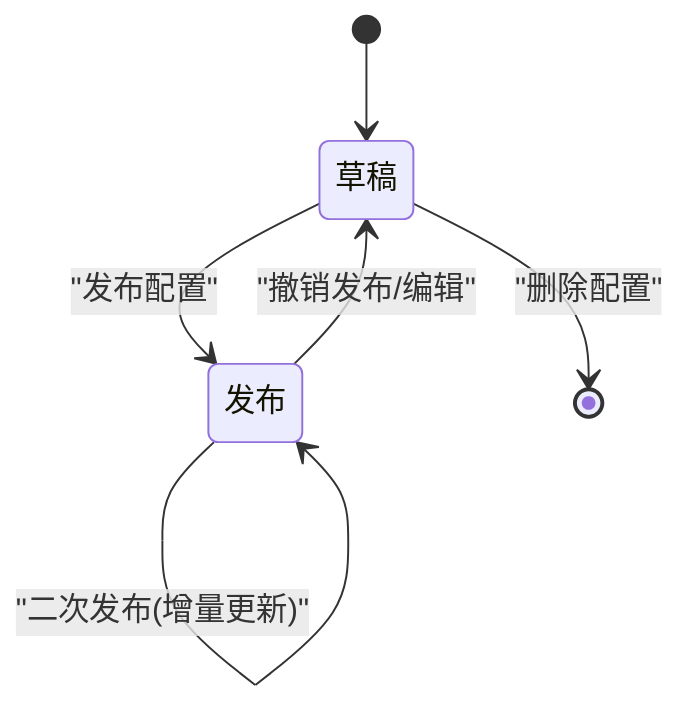
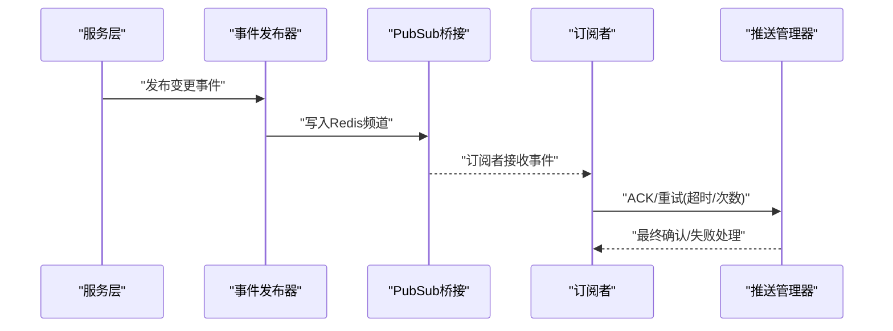
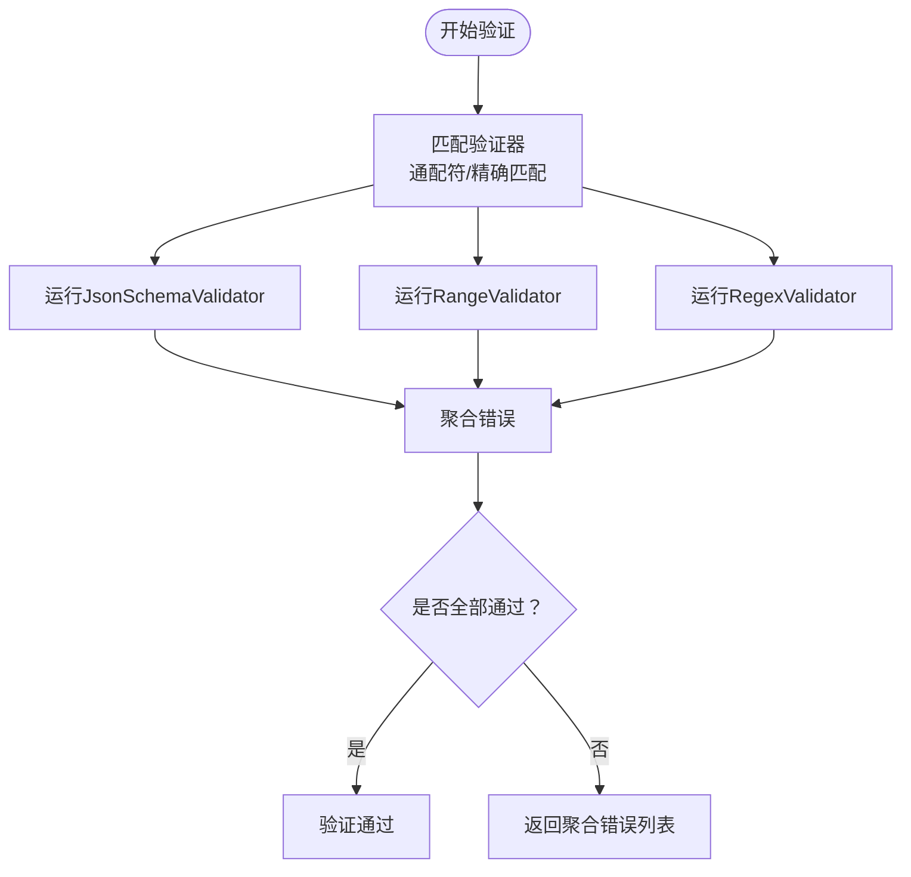
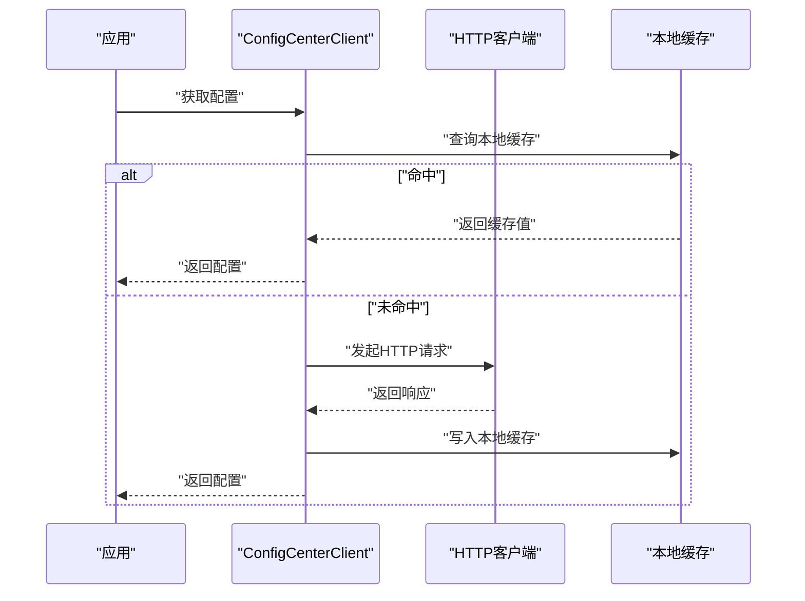
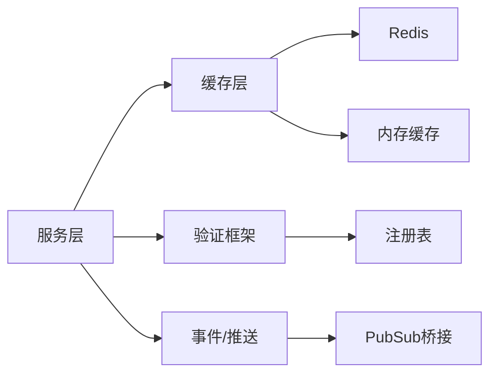

# 配置中心同步

<cite>
**本文引用的文件**
- [app.py](file://tools/flexloop/src/taolib/testing/config_center/server/app.py)
- [test_cache.py](file://tools/flexloop/tests/testing/test_config_center/test_cache.py)
- [test_validation.py](file://tools/flexloop/tests/testing/test_config_center/test_validation.py)
- [test_services.py](file://tools/flexloop/tests/testing/test_config_center/test_services.py)
- [test_client.py](file://tools/flexloop/tests/testing/test_config_center/test_client.py)
- [TEST_SUMMARY.md](file://tools/flexloop/tests/testing/test_config_center/TEST_SUMMARY.md)
- [verify_tests.py](file://tools/flexloop/tests/testing/test_config_center/verify_tests.py)
</cite>

## 目录
1. [简介](#简介)
2. [项目结构](#项目结构)
3. [核心组件](#核心组件)
4. [架构总览](#架构总览)
5. [详细组件分析](#详细组件分析)
6. [依赖分析](#依赖分析)
7. [性能考虑](#性能考虑)
8. [故障排查指南](#故障排查指南)
9. [结论](#结论)
10. [附录](#附录)

## 简介
本技术文档围绕配置中心同步系统展开，重点覆盖以下方面：
- 配置缓存机制：包含内存与Redis缓存集成、缓存键生成、过期与失效策略、环境隔离等
- 配置版本管理：版本创建、变更追踪与回滚机制
- 配置推送服务：实时同步、增量更新与冲突解决
- 配置验证系统：Schema校验、范围检查、依赖验证与多验证器聚合
- 性能优化、监控告警与故障恢复实践

文档以仓库中的测试用例与最小可用实现为依据，通过图示与路径引用帮助读者快速理解系统设计与落地方式。

## 项目结构
配置中心同步系统位于工具链工程中，核心由“服务端应用”、“缓存层”、“验证框架”、“服务层”、“客户端SDK”以及“测试套件”组成。下图给出与本文相关的关键模块关系：

图表来源
- [app.py:74-95](file://tools/flexloop/src/taolib/testing/config_center/server/app.py#L74-L95)

章节来源
- [TEST_SUMMARY.md:1-99](file://tools/flexloop/tests/testing/test_config_center/TEST_SUMMARY.md#L1-L99)

## 核心组件
- 缓存层：提供内存与Redis两种实现，支持键生成、过期与按模式删除；具备环境隔离能力
- 验证框架：支持注册表、多种验证器（Schema/正则/范围）与错误聚合
- 服务层：封装配置CRUD、版本创建与审计、状态转换与缓存失效
- 推送与事件：基于Redis的实时推送、确认超时与重试、事件发布与实例隔离
- 客户端SDK：HTTP访问与本地缓存，支持同步/异步获取与错误处理

章节来源
- [test_cache.py:1-200](file://tools/flexloop/tests/testing/test_config_center/test_cache.py#L1-L200)
- [test_validation.py:1-200](file://tools/flexloop/tests/testing/test_config_center/test_validation.py#L1-L200)
- [test_services.py:1-200](file://tools/flexloop/tests/testing/test_config_center/test_services.py#L1-L200)
- [test_client.py:1-200](file://tools/flexloop/tests/testing/test_config_center/test_client.py#L1-L200)
- [app.py:74-95](file://tools/flexloop/src/taolib/testing/config_center/server/app.py#L74-L95)

## 架构总览
下图展示从客户端到服务端、再到缓存与事件系统的整体流程，突出实时推送、缓存读写与验证环节：

图表来源
- [test_client.py:75-107](file://tools/flexloop/tests/testing/test_config_center/test_client.py#L75-L107)
- [test_services.py:65-73](file://tools/flexloop/tests/testing/test_config_center/test_services.py#L65-L73)
- [app.py:74-95](file://tools/flexloop/src/taolib/testing/config_center/server/app.py#L74-L95)

## 详细组件分析

### 缓存机制与Redis集成
- 键生成规范：采用统一前缀与层级分隔，确保跨环境与服务隔离
- 内存缓存：支持基本CRUD、过期与按模式删除，适合单实例或开发场景
- Redis缓存：在测试中以Mock形式验证键生成、CRUD与过期行为，生产可替换为真实连接池
- 环境隔离：通过环境维度区分不同命名空间，避免跨环境污染
- 失效策略：服务层在更新/删除配置后触发缓存失效，保障一致性

图表来源
- [test_cache.py:1-200](file://tools/flexloop/tests/testing/test_config_center/test_cache.py#L1-L200)

章节来源
- [test_cache.py:1-200](file://tools/flexloop/tests/testing/test_config_center/test_cache.py#L1-L200)
- [verify_tests.py:101-115](file://tools/flexloop/tests/testing/test_config_center/verify_tests.py#L101-L115)

### 配置版本管理
- 版本创建：每次变更生成新版本，保留历史快照
- 变更追踪：通过审计日志记录操作人、时间、字段变化
- 回滚机制：支持选择历史版本进行覆盖写入，实现一键回滚
- 状态转换：支持草稿/发布等状态流转，配合推送与缓存策略

图表来源
- [test_services.py:65-73](file://tools/flexloop/tests/testing/test_config_center/test_services.py#L65-L73)

章节来源
- [test_services.py:65-73](file://tools/flexloop/tests/testing/test_config_center/test_services.py#L65-L73)

### 配置推送服务（实时同步、增量更新、冲突解决）
- 实时同步：基于Redis Pub/Sub，事件发布器负责消息缓冲与实例标识
- 增量更新：推送管理器控制ACK超时与最大重试次数，减少重复推送
- 冲突解决：通过事件序号与实例标识，结合幂等处理与去重策略，避免重复应用

图表来源
- [app.py:74-95](file://tools/flexloop/src/taolib/testing/config_center/server/app.py#L74-L95)

章节来源
- [app.py:74-95](file://tools/flexloop/src/taolib/testing/config_center/server/app.py#L74-L95)

### 配置验证系统（Schema校验、范围检查、依赖验证）
- 验证器注册表：集中管理验证器，支持按模式匹配与通配符
- Schema校验：基于JsonSchemaValidator对配置结构进行严格校验
- 范围检查：使用RangeValidator对数值范围进行约束
- 正则校验：使用RegexValidator对字符串格式进行约束
- 错误聚合：多验证器失败时收集全部错误信息，便于一次性反馈

图表来源
- [test_validation.py:48-56](file://tools/flexloop/tests/testing/test_config_center/test_validation.py#L48-L56)

章节来源
- [test_validation.py:48-56](file://tools/flexloop/tests/testing/test_config_center/test_validation.py#L48-L56)

### 客户端SDK（HTTP访问、本地缓存、错误处理）
- 本地缓存：SDK内部维护本地缓存，提升响应速度与离线容错
- 同步/异步获取：支持同步与异步接口，满足不同调用场景
- 错误处理：对HTTP错误码与空结果进行统一处理
- 认证头设置：支持在请求头中注入认证信息

图表来源
- [test_client.py:75-107](file://tools/flexloop/tests/testing/test_config_center/test_client.py#L75-L107)

章节来源
- [test_client.py:75-107](file://tools/flexloop/tests/testing/test_config_center/test_client.py#L75-L107)

## 依赖分析
- 组件耦合：服务层依赖缓存层与验证框架；推送与事件模块独立于业务逻辑但与服务层协作
- 外部依赖：Redis用于事件与缓存；MongoDB用于持久化（仓库层）
- 循环依赖：当前结构未见循环导入；验证器注册表与服务层松耦合
- 接口契约：缓存层抽象（内存/Redis）对上层透明；验证器注册表对上层暴露统一注册与匹配接口

图表来源
- [test_cache.py:1-200](file://tools/flexloop/tests/testing/test_config_center/test_cache.py#L1-L200)
- [test_validation.py:48-56](file://tools/flexloop/tests/testing/test_config_center/test_validation.py#L48-L56)
- [app.py:74-95](file://tools/flexloop/src/taolib/testing/config_center/server/app.py#L74-L95)

章节来源
- [test_cache.py:1-200](file://tools/flexloop/tests/testing/test_config_center/test_cache.py#L1-L200)
- [test_validation.py:48-56](file://tools/flexloop/tests/testing/test_config_center/test_validation.py#L48-L56)
- [app.py:74-95](file://tools/flexloop/src/taolib/testing/config_center/server/app.py#L74-L95)

## 性能考虑
- 缓存命中率：优先使用内存缓存，热点配置设置合理TTL；对冷数据启用按需加载
- Redis优化：使用连接池与管道批量写入；键命名规范避免大Key；定期清理过期键
- 推送吞吐：合理设置ACK超时与最大重试次数，避免风暴；对高频变更做去重与合并
- 验证开销：Schema校验可缓存编译后的Schema；正则与范围校验尽量前置
- 客户端本地缓存：设置合理的刷新间隔与强制刷新策略，平衡新鲜度与延迟

## 故障排查指南
- 缓存问题
  - 现象：读取旧值或不一致
  - 排查：确认键生成是否正确、TTL是否过短、失效策略是否触发
  - 参考路径：[test_cache.py:1-200](file://tools/flexloop/tests/testing/test_config_center/test_cache.py#L1-L200)
- 推送异常
  - 现象：订阅者未收到事件或重复推送
  - 排查：检查ACK超时与重试配置、Redis频道是否正确、实例标识是否唯一
  - 参考路径：[app.py:74-95](file://tools/flexloop/src/taolib/testing/config_center/server/app.py#L74-L95)
- 验证失败
  - 现象：配置提交被拒绝且错误信息分散
  - 排查：查看聚合错误列表，逐项修正Schema/范围/正则
  - 参考路径：[test_validation.py:48-56](file://tools/flexloop/tests/testing/test_config_center/test_validation.py#L48-L56)
- 客户端错误
  - 现象：HTTP错误或空结果
  - 排查：检查认证头、网络连通性、服务端状态与本地缓存状态
  - 参考路径：[test_client.py:75-107](file://tools/flexloop/tests/testing/test_config_center/test_client.py#L75-L107)

章节来源
- [test_cache.py:1-200](file://tools/flexloop/tests/testing/test_config_center/test_cache.py#L1-L200)
- [app.py:74-95](file://tools/flexloop/src/taolib/testing/config_center/server/app.py#L74-L95)
- [test_validation.py:48-56](file://tools/flexloop/tests/testing/test_config_center/test_validation.py#L48-L56)
- [test_client.py:75-107](file://tools/flexloop/tests/testing/test_config_center/test_client.py#L75-L107)

## 结论
配置中心同步系统通过“缓存+验证+推送”的协同实现了高可用、低延迟与强一致性的配置管理闭环。测试套件覆盖了缓存、验证、服务与客户端的关键行为，为生产落地提供了可靠参考。建议在生产环境中进一步完善监控与告警体系，并持续优化缓存与推送策略以适配业务规模。

## 附录
- 快速验证清单
  - 缓存键生成：[verify_tests.py:101-103](file://tools/flexloop/tests/testing/test_config_center/verify_tests.py#L101-L103)
  - 内存缓存CRUD：[verify_tests.py:105-115](file://tools/flexloop/tests/testing/test_config_center/verify_tests.py#L105-L115)
  - 服务层缓存读写：[test_services.py:67-69](file://tools/flexloop/tests/testing/test_config_center/test_services.py#L67-L69)
  - 客户端本地缓存：[test_client.py:79-83](file://tools/flexloop/tests/testing/test_config_center/test_client.py#L79-L83)