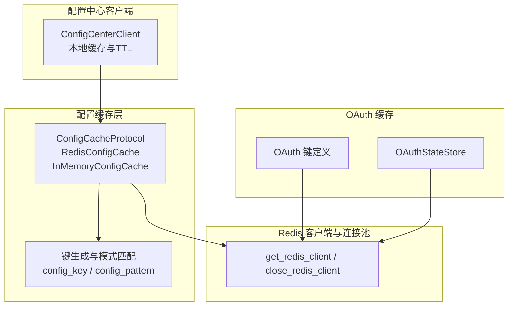
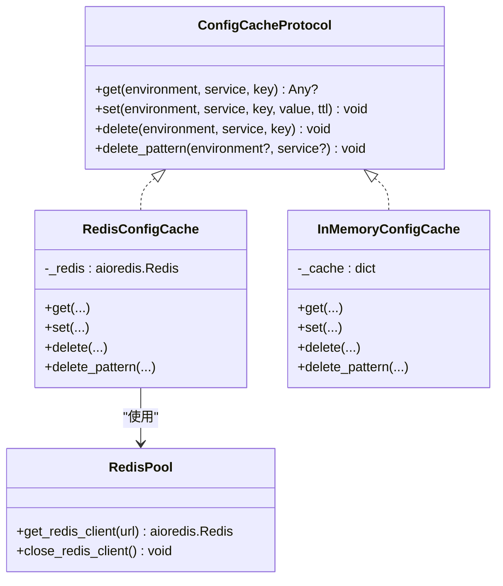
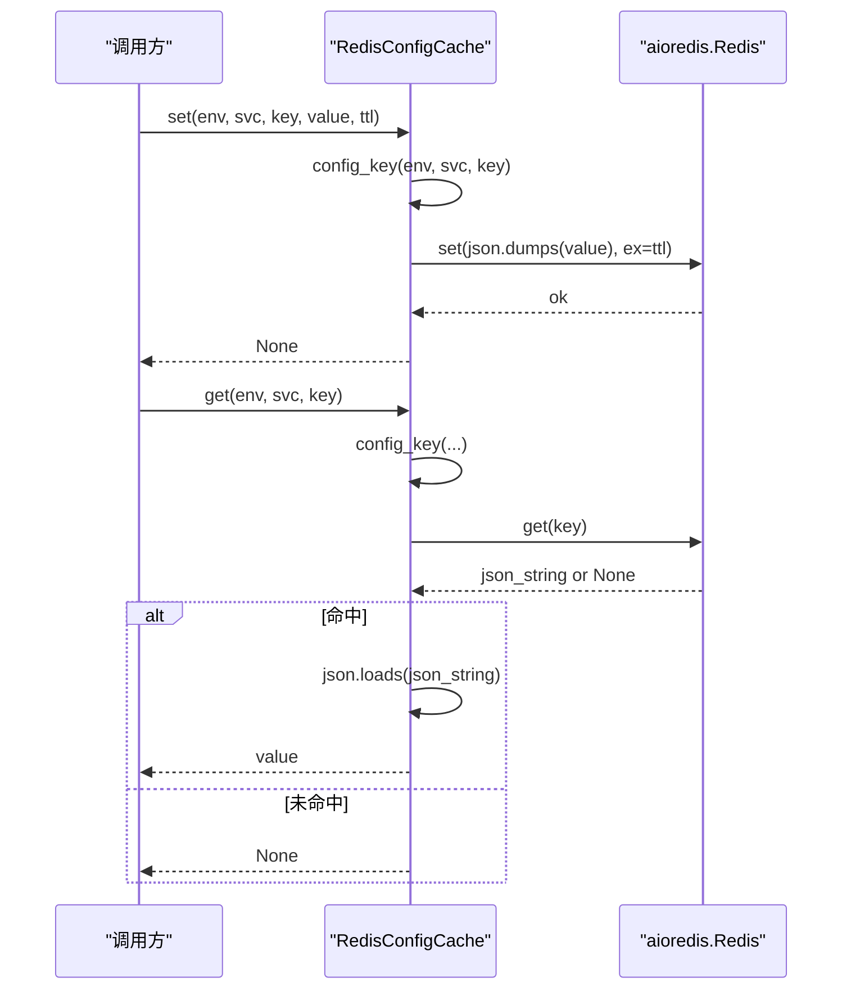
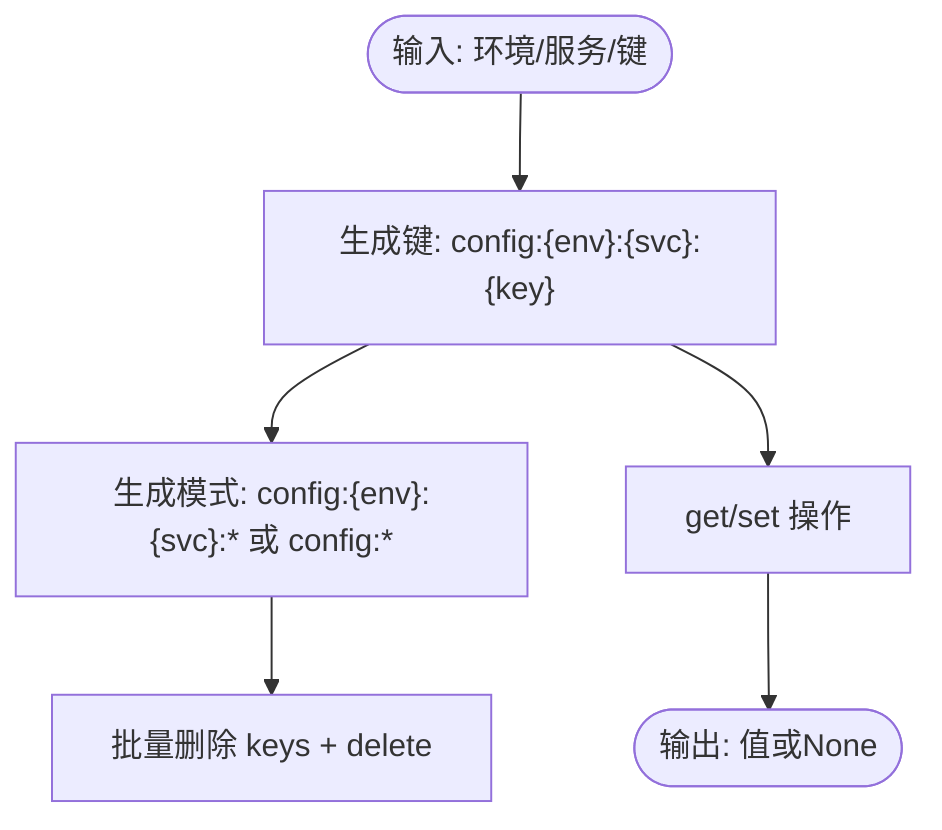
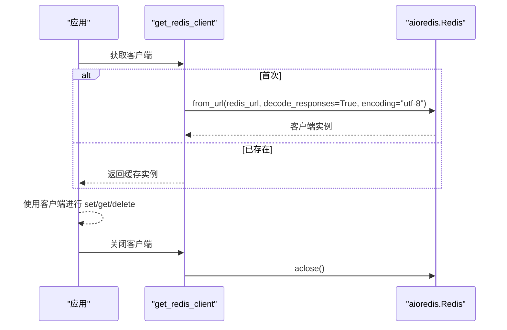
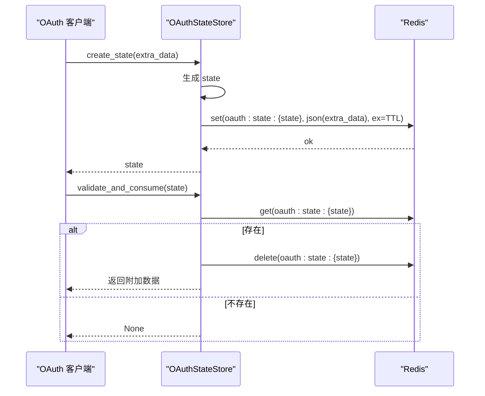
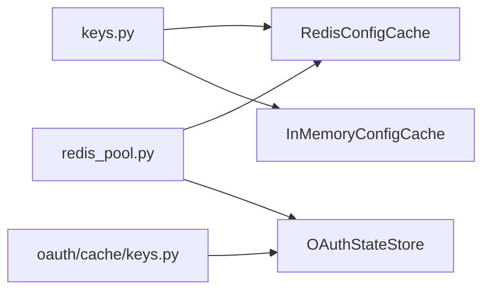

# 配置缓存

<cite>
**本文引用的文件**
- [config_cache.py](file://tools/flexloop/src/taolib/testing/config_center/cache/config_cache.py)
- [keys.py](file://tools/flexloop/src/taolib/testing/config_center/cache/keys.py)
- [redis_pool.py](file://tools/flexloop/src/taolib/testing/_base/redis_pool.py)
- [test_cache.py](file://tools/flexloop/tests/testing/test_config_center/test_cache.py)
- [cache_keys.py](file://tools/flexloop/src/taolib/testing/_base/cache_keys.py)
- [keys.py（OAuth）](file://tools/flexloop/src/taolib/testing/oauth/cache/keys.py)
- [state_store.py](file://tools/flexloop/src/taolib/testing/oauth/cache/state_store.py)
- [client.py（配置中心客户端）](file://tools/flexloop/src/taolib/testing/config_center/client.py)
</cite>

## 目录
1. [简介](#简介)
2. [项目结构](#项目结构)
3. [核心组件](#核心组件)
4. [架构总览](#架构总览)
5. [组件详解](#组件详解)
6. [依赖关系分析](#依赖关系分析)
7. [性能考量](#性能考量)
8. [故障排查指南](#故障排查指南)
9. [结论](#结论)
10. [附录](#附录)

## 简介
本文件面向“配置缓存”模块，系统性阐述其设计原理、缓存层次结构、失效与更新策略、Redis 客户端实现与连接池管理、键空间设计与命名规范、一致性保障（读写策略、并发控制、数据同步）、以及运维最佳实践（预热、降级、容量规划）。同时提供基于仓库现有实现的代码路径指引，帮助读者快速定位到具体实现细节。

## 项目结构
配置缓存相关代码主要位于以下位置：
- 缓存接口与实现：tools/flexloop/src/taolib/testing/config_center/cache
- Redis 客户端与连接池：tools/flexloop/src/taolib/testing/_base/redis_pool.py
- 键空间与命名规范：tools/flexloop/src/taolib/testing/config_center/cache/keys.py、tools/flexloop/src/taolib/testing/_base/cache_keys.py
- OAuth 缓存键与状态存储：tools/flexloop/src/taolib/testing/oauth/cache/*
- 配置中心客户端与本地缓存：tools/flexloop/src/taolib/testing/config_center/client.py
- 单元测试与行为验证：tools/flexloop/tests/testing/test_config_center/test_cache.py

**图表来源**
- [config_cache.py:18-172](file://tools/flexloop/src/taolib/testing/config_center/cache/config_cache.py#L18-L172)
- [keys.py:7-79](file://tools/flexloop/src/taolib/testing/config_center/cache/keys.py#L7-L79)
- [redis_pool.py:11-36](file://tools/flexloop/src/taolib/testing/_base/redis_pool.py#L11-L36)
- [client.py（配置中心客户端）](file://tools/flexloop/src/taolib/testing/config_center/client.py)

**章节来源**
- [config_cache.py:1-172](file://tools/flexloop/src/taolib/testing/config_center/cache/config_cache.py#L1-L172)
- [keys.py:1-79](file://tools/flexloop/src/taolib/testing/config_center/cache/keys.py#L1-L79)
- [redis_pool.py:1-38](file://tools/flexloop/src/taolib/testing/_base/redis_pool.py#L1-L38)
- [client.py（配置中心客户端）](file://tools/flexloop/src/taolib/testing/config_center/client.py)

## 核心组件
- 缓存协议与实现
  - ConfigCacheProtocol：定义 get/set/delete/delete_pattern 四大操作。
  - RedisConfigCache：基于 aioredis 的异步实现，负责序列化/反序列化、TTL 设置与批量删除。
  - InMemoryConfigCache：用于测试的内存实现，具备 TTL 与通配删除能力。
- 键空间与命名规范
  - config_key / config_meta_key / config_list_key / user_roles_key：统一的键生成函数。
  - config_pattern：根据环境/服务生成通配模式，支持批量删除。
  - cache_keys.py：模块级前缀常量，避免跨模块键冲突。
- Redis 客户端与连接池
  - get_redis_client：单例获取异步 Redis 客户端；close_redis_client：优雅关闭。
- OAuth 缓存
  - OAuthStateStore：基于 Redis 的一次性 state 管理，原子读取并删除，防止重放。
- 配置中心客户端
  - ConfigCenterClient：封装远程配置获取与本地缓存（TTL 控制），并与缓存层协同工作。

**章节来源**
- [config_cache.py:18-172](file://tools/flexloop/src/taolib/testing/config_center/cache/config_cache.py#L18-L172)
- [keys.py:7-79](file://tools/flexloop/src/taolib/testing/config_center/cache/keys.py#L7-L79)
- [cache_keys.py:1-70](file://tools/flexloop/src/taolib/testing/_base/cache_keys.py#L1-L70)
- [redis_pool.py:11-36](file://tools/flexloop/src/taolib/testing/_base/redis_pool.py#L11-L36)
- [keys.py（OAuth）:7-43](file://tools/flexloop/src/taolib/testing/oauth/cache/keys.py#L7-L43)
- [state_store.py:13-69](file://tools/flexloop/src/taolib/testing/oauth/cache/state_store.py#L13-L69)
- [client.py（配置中心客户端）](file://tools/flexloop/src/taolib/testing/config_center/client.py)

## 架构总览
配置缓存采用“协议抽象 + 多实现”的分层设计：
- 上层通过 ConfigCacheProtocol 调用缓存接口；
- RedisConfigCache 提供生产可用的持久化缓存；
- InMemoryConfigCache 作为测试替身；
- 键空间与命名规范由 keys.py 与 cache_keys.py 统一约束；
- Redis 客户端通过 redis_pool.py 提供连接复用与生命周期管理；
- OAuth 缓存与配置缓存共享同一 Redis 实例，但使用独立前缀，互不干扰。

**图表来源**
- [config_cache.py:18-172](file://tools/flexloop/src/taolib/testing/config_center/cache/config_cache.py#L18-L172)
- [redis_pool.py:11-36](file://tools/flexloop/src/taolib/testing/_base/redis_pool.py#L11-L36)

## 组件详解

### 缓存协议与实现
- 协议职责
  - get：按环境、服务、键读取配置值，不存在返回 None。
  - set：写入配置值，并设置 TTL（秒）。
  - delete：删除指定键。
  - delete_pattern：按环境或服务维度进行批量删除。
- RedisConfigCache
  - 序列化：写入时 JSON 编码，读取时尝试 JSON 解码，失败记录告警并返回 None。
  - TTL：通过 ex 参数设置过期时间。
  - 批量删除：先 keys 匹配，再 delete 删除。
- InMemoryConfigCache
  - 内存字典保存 (value, expire_at) 元组。
  - 过期检查在 get 时触发，删除时清理。
  - 批量删除使用通配匹配 fnmatch。

**图表来源**
- [config_cache.py:86-123](file://tools/flexloop/src/taolib/testing/config_center/cache/config_cache.py#L86-L123)

**章节来源**
- [config_cache.py:18-172](file://tools/flexloop/src/taolib/testing/config_center/cache/config_cache.py#L18-L172)

### 键空间设计与命名规范
- 命名规范
  - 配置值缓存：config:{environment}:{service}:{key}
  - 配置元数据缓存：config:meta:{environment}:{service}:{key}
  - 服务配置列表缓存：config:list:{environment}:{service}
  - 用户角色缓存：user:roles:{user_id}
  - OAuth 相关键：oauth:state:{state}、oauth:session:{session_id}、oauth:user_sessions:{user_id}
- 通配模式
  - 支持按环境、服务或全局匹配，便于批量失效。
- 模块前缀
  - cache_keys.py 定义了各模块的顶级前缀，避免键冲突。

**图表来源**
- [keys.py:7-79](file://tools/flexloop/src/taolib/testing/config_center/cache/keys.py#L7-L79)
- [cache_keys.py:19-28](file://tools/flexloop/src/taolib/testing/_base/cache_keys.py#L19-L28)

**章节来源**
- [keys.py:7-79](file://tools/flexloop/src/taolib/testing/config_center/cache/keys.py#L7-L79)
- [cache_keys.py:1-70](file://tools/flexloop/src/taolib/testing/_base/cache_keys.py#L1-L70)
- [keys.py（OAuth）:7-43](file://tools/flexloop/src/taolib/testing/oauth/cache/keys.py#L7-L43)

### Redis 客户端与连接池
- 单例客户端
  - get_redis_client：首次创建时建立连接，后续复用。
  - close_redis_client：应用退出时关闭连接，释放资源。
- 连接参数
  - decode_responses=True，encoding="utf-8"，确保字符串透明处理。

**图表来源**
- [redis_pool.py:11-36](file://tools/flexloop/src/taolib/testing/_base/redis_pool.py#L11-L36)

**章节来源**
- [redis_pool.py:1-38](file://tools/flexloop/src/taolib/testing/_base/redis_pool.py#L1-L38)

### 一致性与并发控制
- 读写策略
  - 读：优先命中缓存；未命中时回源（例如配置中心 API），再写入缓存。
  - 写：更新配置后，按需删除相关键或使用 delete_pattern 清理受影响范围。
- 并发控制
  - RedisConfigCache 的 get/set/delete/delete_pattern 均为异步操作，底层由 aioredis 提供并发安全。
  - InMemoryConfigCache 使用字典 + 时间戳，未加锁，适合单进程场景；多进程/多线程需谨慎。
- 数据同步
  - 通过 TTL 与批量删除实现最终一致；对强一致需求，可在写入后主动删除相关键，缩短不一致窗口。

**章节来源**
- [config_cache.py:86-172](file://tools/flexloop/src/taolib/testing/config_center/cache/config_cache.py#L86-L172)

### 配置中心客户端与本地缓存
- 本地缓存
  - ConfigCenterClient 内部维护本地缓存与 TTL，提升热点配置访问性能。
  - 未命中时发起远程请求，成功后写入本地缓存。
- 与 Redis 缓存协作
  - 可选择将本地缓存替换为 RedisConfigCache，以实现跨进程/跨实例共享。

**章节来源**
- [client.py（配置中心客户端）](file://tools/flexloop/src/taolib/testing/config_center/client.py)

### OAuth 缓存与状态管理
- OAuthStateStore
  - 创建：生成随机 state，写入 Redis，带 TTL。
  - 验证与消费：原子读取并删除，防止重放；返回附加数据（如 return_url）。
- 键空间
  - oauth:state:{state}、oauth:session:{session_id}、oauth:user_sessions:{user_id}

**图表来源**
- [state_store.py:33-66](file://tools/flexloop/src/taolib/testing/oauth/cache/state_store.py#L33-L66)
- [keys.py（OAuth）:7-43](file://tools/flexloop/src/taolib/testing/oauth/cache/keys.py#L7-L43)

**章节来源**
- [state_store.py:1-69](file://tools/flexloop/src/taolib/testing/oauth/cache/state_store.py#L1-L69)
- [keys.py（OAuth）:1-43](file://tools/flexloop/src/taolib/testing/oauth/cache/keys.py#L1-L43)

## 依赖关系分析
- 组件耦合
  - RedisConfigCache 依赖 keys.py 生成键与模式，依赖 redis_pool.py 获取客户端。
  - InMemoryConfigCache 仅依赖 keys.py。
  - OAuthStateStore 依赖 oauth 键定义与 redis_pool。
- 外部依赖
  - aioredis：异步 Redis 客户端。
  - json：序列化/反序列化。
- 潜在循环依赖
  - 当前模块间无直接循环导入；若引入更复杂的共享模块，建议通过工具模块（如 cache_keys.py）集中管理前缀。

**图表来源**
- [config_cache.py:13-13](file://tools/flexloop/src/taolib/testing/config_center/cache/config_cache.py#L13-L13)
- [keys.py:7-79](file://tools/flexloop/src/taolib/testing/config_center/cache/keys.py#L7-L79)
- [redis_pool.py:6-6](file://tools/flexloop/src/taolib/testing/_base/redis_pool.py#L6-L6)
- [keys.py（OAuth）:7-43](file://tools/flexloop/src/taolib/testing/oauth/cache/keys.py#L7-L43)
- [state_store.py:10-10](file://tools/flexloop/src/taolib/testing/oauth/cache/state_store.py#L10-L10)

**章节来源**
- [config_cache.py:1-172](file://tools/flexloop/src/taolib/testing/config_center/cache/config_cache.py#L1-L172)
- [keys.py:1-79](file://tools/flexloop/src/taolib/testing/config_center/cache/keys.py#L1-L79)
- [redis_pool.py:1-38](file://tools/flexloop/src/taolib/testing/_base/redis_pool.py#L1-L38)
- [keys.py（OAuth）:1-43](file://tools/flexloop/src/taolib/testing/oauth/cache/keys.py#L1-L43)
- [state_store.py:1-69](file://tools/flexloop/src/taolib/testing/oauth/cache/state_store.py#L1-L69)

## 性能考量
- 命中率与延迟
  - 热点配置应设置合理 TTL，避免频繁回源；可通过批量删除减少不一致窗口。
- 序列化开销
  - JSON 编解码在高频场景下可能成为瓶颈，建议对简单值（如纯字符串/整数）考虑二进制编码或跳过序列化。
- 批量删除成本
  - keys 命令在键数量巨大时可能阻塞，建议按环境/服务维度拆分删除，或使用更细粒度的键设计。
- 连接池与并发
  - 使用单例客户端避免连接抖动；在高并发场景下评估 Redis 实例容量与网络延迟。
- 本地缓存与远端缓存
  - 对于短周期内重复访问的配置，优先使用本地缓存；对跨实例共享场景，使用 Redis 缓存。

[本节为通用性能建议，无需特定文件引用]

## 故障排查指南
- 常见问题
  - 缓存未命中：确认键是否正确生成（keys.py），TTL 是否过短。
  - JSON 解码失败：检查写入值是否为可 JSON 序列化对象。
  - 批量删除无效：确认模式是否匹配（config_pattern），Redis keys 命令是否返回预期键集合。
  - 连接异常：确认 get_redis_client 初始化是否成功，close_redis_client 是否被提前调用。
- 单元测试参考
  - 键生成与模式匹配：test_config_key、test_config_pattern_*。
  - 缓存 CRUD 与过期：test_set_and_get、test_cache_expiration、test_complex_value_serialization。
  - 批量删除：test_delete_pattern_by_environment、test_delete_pattern_by_service、test_delete_pattern_global。
  - Redis 实现行为：TestRedisConfigCache 中的 set/get/delete/delete_pattern 行为验证。

**章节来源**
- [test_cache.py:21-272](file://tools/flexloop/tests/testing/test_config_center/test_cache.py#L21-L272)
- [config_cache.py:86-123](file://tools/flexloop/src/taolib/testing/config_center/cache/config_cache.py#L86-L123)

## 结论
配置缓存模块通过协议抽象与多实现分离关注点，结合统一的键空间设计与连接池管理，实现了高性能、可扩展且易于测试的缓存方案。生产环境推荐使用 RedisConfigCache，配合合理的 TTL 与批量删除策略，确保一致性与性能平衡。对于 OAuth 等场景，独立的键前缀与原子操作进一步提升了安全性与可靠性。

[本节为总结性内容，无需特定文件引用]

## 附录

### 代码示例路径（不含具体代码内容）
- 配置缓存接口与实现
  - [ConfigCacheProtocol 与 RedisConfigCache:18-123](file://tools/flexloop/src/taolib/testing/config_center/cache/config_cache.py#L18-L123)
  - [InMemoryConfigCache:125-172](file://tools/flexloop/src/taolib/testing/config_center/cache/config_cache.py#L125-L172)
- 键空间与命名规范
  - [键生成与模式匹配:7-79](file://tools/flexloop/src/taolib/testing/config_center/cache/keys.py#L7-L79)
  - [模块前缀常量:19-64](file://tools/flexloop/src/taolib/testing/_base/cache_keys.py#L19-L64)
- Redis 客户端与连接池
  - [获取与关闭客户端:11-36](file://tools/flexloop/src/taolib/testing/_base/redis_pool.py#L11-L36)
- OAuth 缓存
  - [OAuthStateStore:13-69](file://tools/flexloop/src/taolib/testing/oauth/cache/state_store.py#L13-L69)
  - [OAuth 键定义:7-43](file://tools/flexloop/src/taolib/testing/oauth/cache/keys.py#L7-L43)
- 配置中心客户端
  - [本地缓存与 TTL](file://tools/flexloop/src/taolib/testing/config_center/client.py)

### 最佳实践清单
- 缓存层次结构
  - 本地缓存（短 TTL）+ Redis 缓存（长 TTL）+ 远端配置中心（只读回源）。
- 失效策略
  - 写入后按环境/服务维度批量删除；对热点键设置较短 TTL 降低陈旧风险。
- 更新机制
  - 读路径：本地缓存 → Redis 缓存 → 远端配置中心；写路径：远端写入 → 通知删除相关键。
- 键空间设计
  - 使用统一前缀与冒号分隔；避免跨模块键冲突；为不同业务域预留独立前缀。
- 一致性保证
  - 读写分离 + TTL + 批量删除；对强一致需求，采用写后删除策略。
- 并发控制
  - RedisConfigCache 为异步并发安全；InMemoryConfigCache 仅适用于单进程。
- 监控与可观测性
  - 统计命中率、过期率、批量删除耗时；观察 Redis keys 命令的执行时间。
- 预热与降级
  - 启动阶段预热热点配置；Redis 不可用时启用本地缓存或只读降级。
- 容量规划
  - 评估键数量、TTL 分布与内存占用；为 Redis 实例预留足够内存与 CPU；监控慢查询与阻塞命令。

[本节为通用最佳实践，无需特定文件引用]