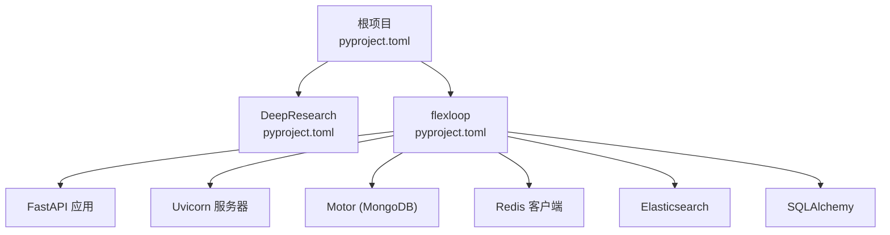
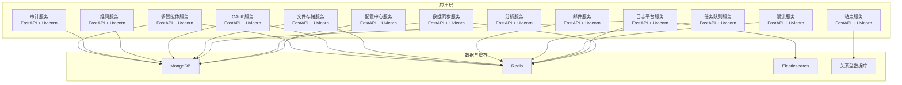
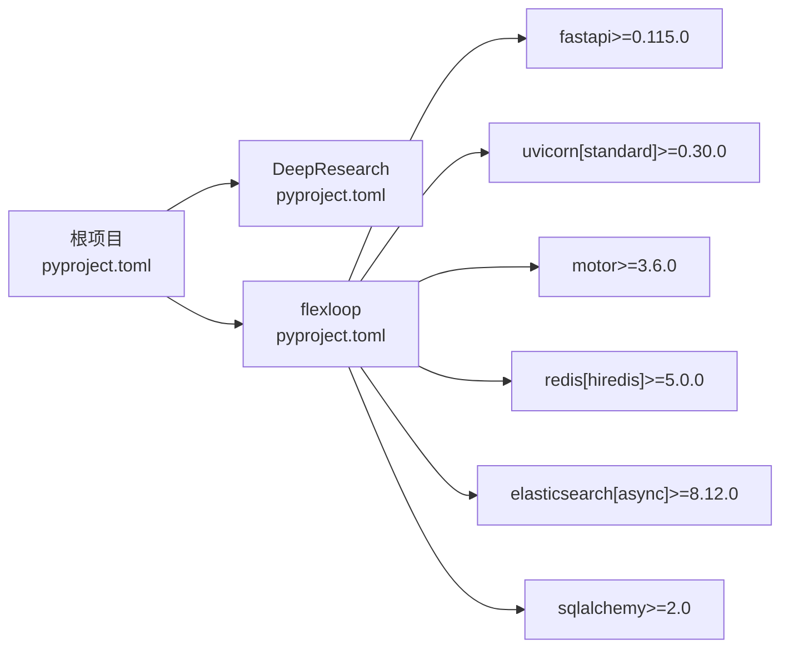

# Python后端基础设施

<cite>
**本文引用的文件**
- [pyproject.toml（根）](file://pyproject.toml)
- [pyproject.toml（DeepResearch）](file://tools/DeepResearch/pyproject.toml)
- [pyproject.toml（flexloop）](file://tools/flexloop/pyproject.toml)
- [__init__.py（daoapps）](file://src/daoapps/__init__.py)
</cite>

## 目录
1. [引言](#引言)
2. [项目结构](#项目结构)
3. [核心组件](#核心组件)
4. [架构总览](#架构总览)
5. [详细组件分析](#详细组件分析)
6. [依赖分析](#依赖分析)
7. [性能考虑](#性能考虑)
8. [故障排查指南](#故障排查指南)
9. [结论](#结论)
10. [附录](#附录)

## 引言
本技术文档聚焦于Python后端基础设施，围绕FastAPI框架在本仓库中的使用与配置展开，涵盖异步处理模式、依赖注入与中间件系统；数据库连接池管理、Redis缓存集成与MongoDB文档存储设计；日志系统配置、错误处理机制与性能监控集成；以及Python包管理、虚拟环境配置与依赖版本控制的最佳实践。同时，结合仓库中现有的工具链与测试体系，给出Docker容器化部署、CI/CD流水线配置与自动化测试策略的实施建议，并阐述代码质量保证、静态分析与安全扫描的落地方法。

## 项目结构
本仓库采用多模块工程组织方式，包含前端应用与多个Python工具库。与后端基础设施直接相关的核心模块为：
- 根级项目：提供统一的包管理、脚本与质量工具配置
- DeepResearch：深度研究工具，包含HTTP客户端、LLM集成等能力
- flexloop：后端基础设施库，提供认证、配置中心、数据同步、日志平台、限流、站点、任务队列、邮件服务、分析、文件存储、OAuth、二维码、审计、多智能体等子系统，均以FastAPI+Uvicorn为主栈

图表来源
- [pyproject.toml（根）:1-161](file://pyproject.toml#L1-L161)
- [pyproject.toml（DeepResearch）:1-93](file://tools/DeepResearch/pyproject.toml#L1-L93)
- [pyproject.toml（flexloop）:1-318](file://tools/flexloop/pyproject.toml#L1-L318)

章节来源
- [pyproject.toml（根）:1-161](file://pyproject.toml#L1-L161)
- [pyproject.toml（DeepResearch）:1-93](file://tools/DeepResearch/pyproject.toml#L1-L93)
- [pyproject.toml（flexloop）:1-318](file://tools/flexloop/pyproject.toml#L1-L318)

## 核心组件
- 包管理与构建：基于PDM，支持动态版本、可选依赖分组与构建打包
- 质量工具：Ruff（格式化与lint）、MyPy（类型检查）、PyTest（测试）
- 测试与覆盖率：pytest + coverage，支持异步测试模式
- FastAPI生态：Uvicorn作为ASGI服务器，配合各功能子系统的FastAPI应用
- 数据与缓存：MongoDB（Motor）、Redis（hiredis），部分场景集成Elasticsearch
- 日志与监控：通过日志平台子系统与第三方库实现

章节来源
- [pyproject.toml（根）:49-80](file://pyproject.toml#L49-L80)
- [pyproject.toml（flexloop）:55-318](file://tools/flexloop/pyproject.toml#L55-L318)

## 架构总览
下图展示了后端基础设施的整体架构，重点体现FastAPI应用、Uvicorn服务器、数据库与缓存层之间的关系，以及日志平台与外部系统交互：

图表来源
- [pyproject.toml（flexloop）:71-235](file://tools/flexloop/pyproject.toml#L71-L235)

## 详细组件分析

### FastAPI与异步处理模式
- 应用形态：各子系统均以FastAPI应用形式提供REST接口，结合Uvicorn作为高性能ASGI服务器
- 异步特性：依赖Uvicorn与FastAPI的异步能力，适合高并发I/O密集型场景
- 配置要点：通过可选依赖分组按需启用FastAPI与Uvicorn，避免不必要的依赖

章节来源
- [pyproject.toml（flexloop）:71-142](file://tools/flexloop/pyproject.toml#L71-L142)

### 依赖注入与中间件系统
- 依赖注入：利用FastAPI的Depends模式进行参数注入，便于复用与测试
- 中间件：通过FastAPI中间件实现跨域、日志、认证等横切关注点
- 建议实践：
  - 将通用依赖封装为可复用的依赖函数
  - 使用中间件统一处理异常、记录请求/响应信息
  - 对敏感路径启用认证与授权中间件

章节来源
- [pyproject.toml（flexloop）:116-142](file://tools/flexloop/pyproject.toml#L116-L142)

### 数据库连接池管理
- MongoDB（Motor）：用于文档型数据存储，支持异步操作；通过连接池管理提升并发性能
- 关系型数据库（SQLAlchemy）：用于站点服务等需要ACID事务的场景
- 连接池配置建议：
  - 合理设置最大连接数、空闲连接数与超时时间
  - 在应用启动时初始化连接池，在关闭时释放资源
  - 对长事务与批量写入进行隔离与限流

章节来源
- [pyproject.toml（flexloop）:71-134](file://tools/flexloop/pyproject.toml#L71-L134)

### Redis缓存集成
- 缓存用途：会话存储、限流令牌桶、任务队列键值、事件通知等
- 客户端：使用hiredis以获得更好的性能
- 最佳实践：
  - 为不同业务场景设置独立的Key前缀与TTL
  - 使用Pipeline减少网络往返
  - 结合Sentinel或Cluster提高可用性

章节来源
- [pyproject.toml（flexloop）:116-142](file://tools/flexloop/pyproject.toml#L116-L142)

### MongoDB文档存储设计
- 设计原则：以领域模型为中心，合理拆分集合与索引；对热点字段建立复合索引
- 异步访问：使用Motor进行异步读写，避免阻塞事件循环
- 版本迁移：通过变更流或版本字段实现数据演进

章节来源
- [pyproject.toml（flexloop）:71-134](file://tools/flexloop/pyproject.toml#L71-L134)

### 日志系统配置
- 组件：日志平台服务集成FastAPI/Uvicorn、Elasticsearch与MongoDB
- 功能：结构化日志采集、聚合与检索，支持实时告警
- 建议：统一日志格式、采样策略与保留周期；对敏感字段脱敏

章节来源
- [pyproject.toml（flexloop）:97-114](file://tools/flexloop/pyproject.toml#L97-L114)

### 错误处理机制
- 全局异常处理器：在FastAPI中注册全局异常处理器，统一返回格式
- 业务异常：定义业务异常类并映射到标准HTTP状态码
- 健康检查：提供/health端点，定期探测数据库、缓存与外部依赖

章节来源
- [pyproject.toml（flexloop）:116-142](file://tools/flexloop/pyproject.toml#L116-L142)

### 性能监控集成
- 指标采集：结合日志平台与APM工具（如OpenTelemetry）采集QPS、延迟、错误率
- 基准测试：使用pytest性能测试模块评估关键路径
- 资源监控：容器内CPU/内存/磁盘IO监控，结合Kubernetes HPA自动扩缩容

章节来源
- [pyproject.toml（flexloop）:97-114](file://tools/flexloop/pyproject.toml#L97-L114)

### Python包管理、虚拟环境与依赖版本控制
- 包管理器：PDM，支持动态版本与可选依赖分组
- 虚拟环境：推荐使用pyenv + venv或conda，确保Python版本一致性
- 依赖版本控制：
  - 使用PEP 440语义版本，约束范围与兼容性
  - 通过pip-tools或Poetry pin定版本，避免漂移
  - 在CI中执行锁定文件校验

章节来源
- [pyproject.toml（根）:49-80](file://pyproject.toml#L49-L80)
- [pyproject.toml（flexloop）:237-243](file://tools/flexloop/pyproject.toml#L237-L243)

### Docker容器化部署
- 多阶段构建：基础镜像选择alpine或debian slim，精简体积
- 运行时用户：以非root用户运行Uvicorn进程，提升安全性
- 环境变量：通过.env文件与Kubernetes ConfigMap/Secret管理
- 健康检查：在Dockerfile中配置HEALTHCHECK，结合/health端点

章节来源
- [pyproject.toml（flexloop）:71-142](file://tools/flexloop/pyproject.toml#L71-L142)

### CI/CD流水线配置与自动化测试
- 流水线阶段：代码检出 → 依赖安装 → Lint/格式化 → 类型检查 → 单元/集成测试 → 覆盖率报告 → 打包/构建 → 部署
- 工具链：Ruff、MyPy、PyTest、Coverage
- 并发测试：使用pytest-asyncio与标记化测试，覆盖异步路径
- 触发策略：PR触发Lint与单元测试，主分支触发全量测试与发布

章节来源
- [pyproject.toml（根）:71-80](file://pyproject.toml#L71-L80)
- [pyproject.toml（flexloop）:297-303](file://tools/flexloop/pyproject.toml#L297-L303)

### 代码质量保证、静态分析与安全扫描
- 静态分析：Ruff负责风格与潜在问题，MyPy进行类型检查
- 安全扫描：依赖pip-audit或pip-tools进行漏洞检测
- 提交前检查：通过pre-commit钩子集成Ruff、MyPy与格式化
- 文档生成：可选依赖doc分组用于Sphinx文档构建

章节来源
- [pyproject.toml（根）:81-129](file://pyproject.toml#L81-L129)
- [pyproject.toml（flexloop）:245-296](file://tools/flexloop/pyproject.toml#L245-L296)

## 依赖分析
下图展示根项目与子模块的依赖关系，突出可选依赖分组与FastAPI/Uvicorn的组合使用：

图表来源
- [pyproject.toml（根）:49-56](file://pyproject.toml#L49-L56)
- [pyproject.toml（flexloop）:71-142](file://tools/flexloop/pyproject.toml#L71-L142)

章节来源
- [pyproject.toml（根）:49-56](file://pyproject.toml#L49-L56)
- [pyproject.toml（flexloop）:71-142](file://tools/flexloop/pyproject.toml#L71-L142)

## 性能考虑
- I/O密集优化：使用异步客户端（httpx、Motor、aioredis）与事件循环
- 连接池：合理配置数据库与Redis连接池大小，避免过度连接
- 缓存策略：热点数据优先命中Redis，冷数据落盘MongoDB
- 监控与告警：结合日志平台与指标系统，及时发现性能瓶颈

## 故障排查指南
- 常见问题定位：
  - 数据库连接失败：检查连接字符串、网络连通性与凭据
  - Redis不可用：确认实例状态、密码与网络ACL
  - FastAPI路由异常：查看全局异常处理器输出与日志平台
- 排障流程：
  - 采集日志与指标 → 定位异常堆栈 → 分析依赖链路 → 修复配置或代码 → 回归测试

章节来源
- [pyproject.toml（flexloop）:97-114](file://tools/flexloop/pyproject.toml#L97-L114)

## 结论
本仓库的Python后端基础设施以PDM为包管理核心，结合Ruff、MyPy与PyTest形成完整的质量保障体系；以FastAPI+Uvicorn为主栈，配合MongoDB、Redis与Elasticsearch，构建了可扩展的微服务架构。通过规范化的容器化与CI/CD流程，能够稳定交付高质量的后端服务。

## 附录
- 快速开始建议：
  - 使用PDM安装依赖与运行脚本
  - 在本地启动Uvicorn服务，访问/health端点验证
  - 运行pytest进行功能与性能测试
- 参考文件：
  - [__init__.py（daoapps）](file://src/daoapps/__init__.py)