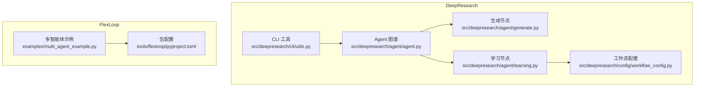
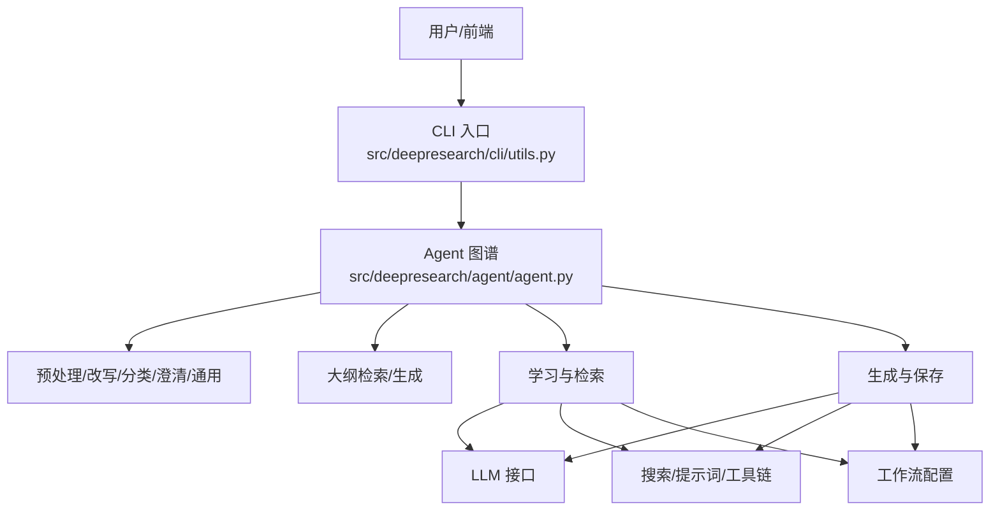
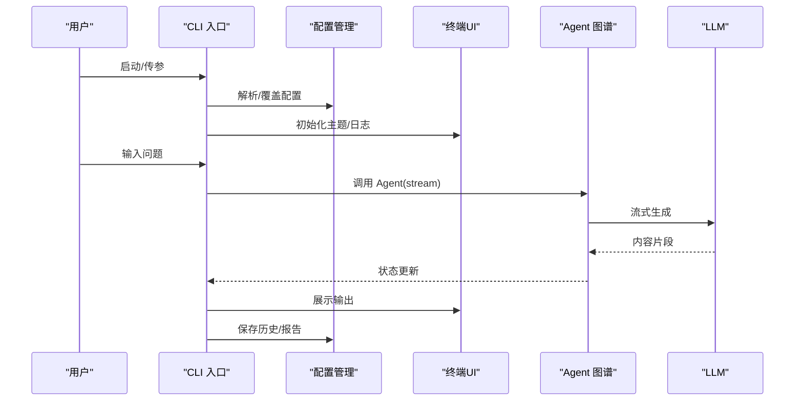
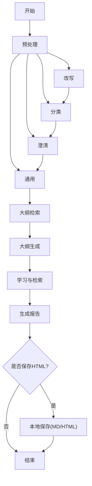
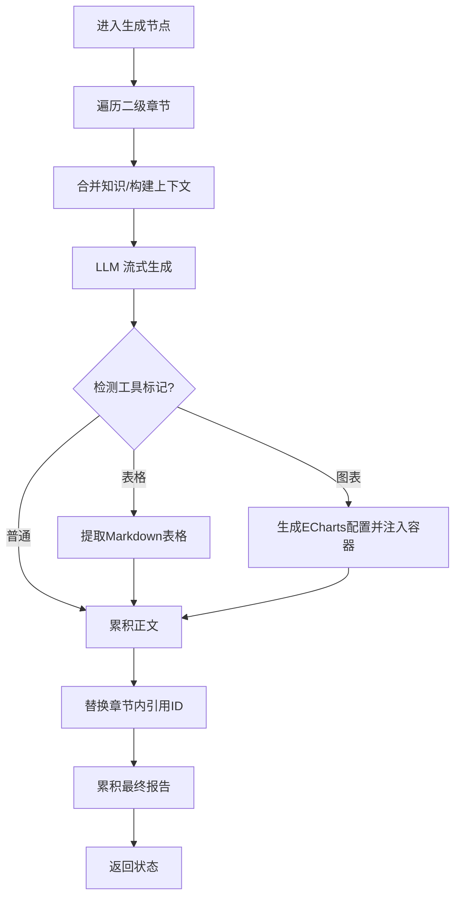
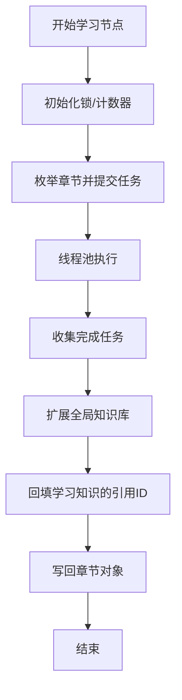
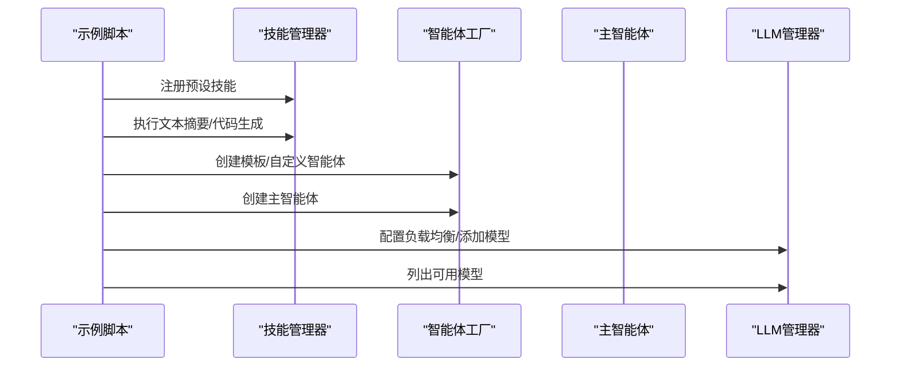
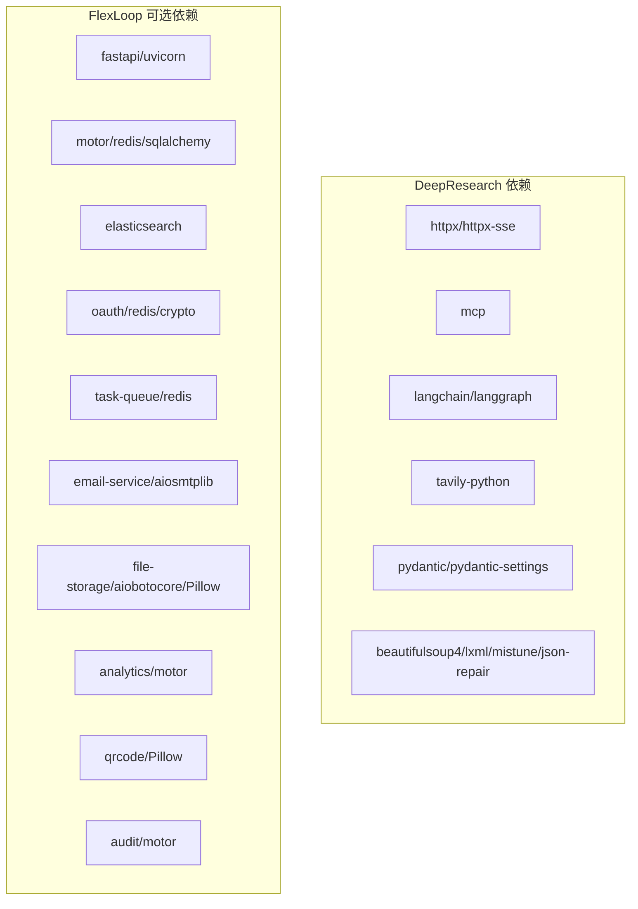

# 后端工具

<cite>
**本文引用的文件**
- [README.md](file://tools/DeepResearch/README.md)
- [pyproject.toml](file://tools/DeepResearch/pyproject.toml)
- [src/deepresearch/__init__.py](file://tools/DeepResearch/src/deepresearch/__init__.py)
- [src/deepresearch/cli/utils.py](file://tools/DeepResearch/src/deepresearch/cli/utils.py)
- [src/deepresearch/agent/agent.py](file://tools/DeepResearch/src/deepresearch/agent/agent.py)
- [src/deepresearch/agent/generate.py](file://tools/DeepResearch/src/deepresearch/agent/generate.py)
- [src/deepresearch/agent/learning.py](file://tools/DeepResearch/src/deepresearch/agent/learning.py)
- [src/deepresearch/config/workflow_config.py](file://tools/DeepResearch/src/deepresearch/config/workflow_config.py)
- [README.md](file://tools/flexloop/README.md)
- [pyproject.toml](file://tools/flexloop/pyproject.toml)
- [examples/multi_agent_example.py](file://tools/flexloop/examples/multi_agent_example.py)
</cite>

## 目录
1. [简介](#简介)
2. [项目结构](#项目结构)
3. [核心组件](#核心组件)
4. [架构总览](#架构总览)
5. [详细组件分析](#详细组件分析)
6. [依赖分析](#依赖分析)
7. [性能考虑](#性能考虑)
8. [故障排除指南](#故障排除指南)
9. [结论](#结论)
10. [附录](#附录)

## 简介
本文件面向 DAO Collective 项目的后端工具，聚焦两大能力域：
- DeepResearch 深度研究工具：基于多智能体协作与检索增强的 AI 研究工作流，支持交互式与单次查询模式，具备报告生成、可视化图表嵌入与本地保存能力。
- FlexLoop 多智能体系统：提供智能体生命周期管理、技能体系、负载均衡与 LLM 管理等能力，示例展示了技能注册、智能体创建、主智能体编排与 LLM 实例化。

文档将从架构设计、组件职责、数据与控制流、性能优化、监控与故障排除等方面进行系统化说明，并给出与前端应用的集成思路与 API 设计规范。

## 项目结构
本仓库包含多个应用与工具包，其中与后端工具密切相关的有：
- tools/DeepResearch：深度研究框架，包含 CLI、Agent 图谱、LLM 工具、提示词与配置模块。
- tools/flexloop：多智能体系统与配套服务模块，包含任务队列、认证、配置中心、数据分析、文件存储、OAuth、速率限制、站点服务等子模块与 FastAPI 示例。

**图示来源**
- [src/deepresearch/cli/utils.py:1-575](file://tools/DeepResearch/src/deepresearch/cli/utils.py#L1-L575)
- [src/deepresearch/agent/agent.py:1-45](file://tools/DeepResearch/src/deepresearch/agent/agent.py#L1-L45)
- [src/deepresearch/agent/generate.py:1-343](file://tools/DeepResearch/src/deepresearch/agent/generate.py#L1-L343)
- [src/deepresearch/agent/learning.py:1-129](file://tools/DeepResearch/src/deepresearch/agent/learning.py#L1-L129)
- [src/deepresearch/config/workflow_config.py:1-28](file://tools/DeepResearch/src/deepresearch/config/workflow_config.py#L1-L28)
- [examples/multi_agent_example.py:1-196](file://tools/flexloop/examples/multi_agent_example.py#L1-L196)
- [pyproject.toml:1-318](file://tools/flexloop/pyproject.toml#L1-L318)

**章节来源**
- [README.md:1-69](file://tools/DeepResearch/README.md#L1-L69)
- [pyproject.toml:1-93](file://tools/DeepResearch/pyproject.toml#L1-L93)
- [README.md:1-100](file://tools/flexloop/README.md#L1-L100)
- [pyproject.toml:1-318](file://tools/flexloop/pyproject.toml#L1-L318)

## 核心组件
- DeepResearch CLI：提供交互式对话与单次查询模式，负责参数解析、信号处理、日志配置、历史记录管理与 Agent 调用。
- Agent 图谱：以 LangGraph StateGraph 构建的状态机，串联预处理、改写、分类、澄清、通用处理、大纲检索与生成、保存等节点。
- 生成节点：基于 LLM 流式生成报告正文，支持表格与 ECharts 图表内联渲染，最终落盘 Markdown 与 HTML。
- 学习节点：并行执行多章节深度检索，聚合知识库与引用映射，保障跨章节引用一致性。
- 工作流配置：从 workflow.toml 加载与脱敏工作流配置，供检索与生成阶段使用。
- FlexLoop 多智能体示例：演示技能注册、智能体创建、主智能体编排与 LLM 管理器的负载均衡策略。

**章节来源**
- [src/deepresearch/cli/utils.py:106-193](file://tools/DeepResearch/src/deepresearch/cli/utils.py#L106-L193)
- [src/deepresearch/agent/agent.py:19-45](file://tools/DeepResearch/src/deepresearch/agent/agent.py#L19-L45)
- [src/deepresearch/agent/generate.py:26-160](file://tools/DeepResearch/src/deepresearch/agent/generate.py#L26-L160)
- [src/deepresearch/agent/learning.py:15-93](file://tools/DeepResearch/src/deepresearch/agent/learning.py#L15-L93)
- [src/deepresearch/config/workflow_config.py:7-27](file://tools/DeepResearch/src/deepresearch/config/workflow_config.py#L7-L27)
- [examples/multi_agent_example.py:36-172](file://tools/flexloop/examples/multi_agent_example.py#L36-L172)

## 架构总览
DeepResearch 的研究工作流采用“任务规划 → 工具调用 → 评估与迭代”的智能流程，结合多 LLM 协作与检索增强，最终输出可视化报告。FlexLoop 则提供多智能体编排与服务化能力，便于在后端统一接入 FastAPI 与各类中间件。

**图示来源**
- [src/deepresearch/cli/utils.py:106-193](file://tools/DeepResearch/src/deepresearch/cli/utils.py#L106-L193)
- [src/deepresearch/agent/agent.py:19-45](file://tools/DeepResearch/src/deepresearch/agent/agent.py#L19-L45)
- [src/deepresearch/agent/generate.py:26-160](file://tools/DeepResearch/src/deepresearch/agent/generate.py#L26-L160)
- [src/deepresearch/agent/learning.py:15-93](file://tools/DeepResearch/src/deepresearch/agent/learning.py#L15-L93)
- [src/deepresearch/config/workflow_config.py:7-27](file://tools/DeepResearch/src/deepresearch/config/workflow_config.py#L7-L27)

## 详细组件分析

### DeepResearch CLI 与交互式工作流
- 参数解析与覆盖：支持深度、HTML 输出开关、输出路径、日志级别、主题、配置目录等；可通过环境变量与命令行叠加。
- 信号处理：捕获 SIGINT/SIGTERM，优雅中断 Agent 执行。
- 交互式对话：支持 help/clear/history/search 等命令；异常与中断均进行容错处理。
- 单次查询：直接返回 LLM 输出，适合 API 场景。
- 历史记录：持久化用户-助手对话，支持最近条目与关键词检索。

**图示来源**
- [src/deepresearch/cli/utils.py:195-303](file://tools/DeepResearch/src/deepresearch/cli/utils.py#L195-L303)
- [src/deepresearch/cli/utils.py:357-383](file://tools/DeepResearch/src/deepresearch/cli/utils.py#L357-L383)
- [src/deepresearch/cli/utils.py:485-575](file://tools/DeepResearch/src/deepresearch/cli/utils.py#L485-L575)

**章节来源**
- [src/deepresearch/cli/utils.py:485-575](file://tools/DeepResearch/src/deepresearch/cli/utils.py#L485-L575)
- [src/deepresearch/cli/utils.py:195-303](file://tools/DeepResearch/src/deepresearch/cli/utils.py#L195-L303)
- [src/deepresearch/cli/utils.py:357-383](file://tools/DeepResearch/src/deepresearch/cli/utils.py#L357-L383)

### Agent 图谱与节点编排
- 节点构成：预处理、改写、分类、澄清、通用、大纲检索、大纲生成、学习、生成、保存。
- 条件边：生成完成后根据是否需要保存 HTML 决定进入本地保存或结束。
- 并发控制：学习节点对多章节检索采用线程池并发，限制最大并发度避免 LLM API 压力过大。

**图示来源**
- [src/deepresearch/agent/agent.py:19-45](file://tools/DeepResearch/src/deepresearch/agent/agent.py#L19-L45)

**章节来源**
- [src/deepresearch/agent/agent.py:19-45](file://tools/DeepResearch/src/deepresearch/agent/agent.py#L19-L45)

### 生成节点与内容处理
- 流式生成：逐段接收 LLM 输出，实时渲染至终端并累积报告正文。
- 工具内嵌：识别表格与图表标记，动态生成 ECharts 图表并注入 HTML 容器。
- 引用替换：章节内引用 ID 与全局知识库建立映射，统一替换为真实引用编号。
- 保存策略：按时间戳命名，同时输出 Markdown 与 HTML；HTML 由工具链转换生成。

**图示来源**
- [src/deepresearch/agent/generate.py:26-160](file://tools/DeepResearch/src/deepresearch/agent/generate.py#L26-L160)
- [src/deepresearch/agent/generate.py:169-295](file://tools/DeepResearch/src/deepresearch/agent/generate.py#L169-L295)

**章节来源**
- [src/deepresearch/agent/generate.py:26-160](file://tools/DeepResearch/src/deepresearch/agent/generate.py#L26-L160)
- [src/deepresearch/agent/generate.py:169-295](file://tools/DeepResearch/src/deepresearch/agent/generate.py#L169-L295)

### 学习节点与并行检索
- 并发策略：按章节数量与阈值限制最大并发线程数，避免 LLM API 限流与资源争用。
- 知识聚合：为每个搜索结果分配全局唯一 ID，建立“URL→ID”的映射，回填学习知识的真实引用。
- 结果合并：将各章节检索结果与学习洞察回填至对应章节对象，保证引用一致性。

**图示来源**
- [src/deepresearch/agent/learning.py:15-93](file://tools/DeepResearch/src/deepresearch/agent/learning.py#L15-L93)

**章节来源**
- [src/deepresearch/agent/learning.py:15-93](file://tools/DeepResearch/src/deepresearch/agent/learning.py#L15-L93)

### 工作流配置与脱敏
- 配置加载：从 workflow.toml 加载工作流参数，如检索 topN 等。
- 脱敏输出：在日志或审计场景中输出脱敏后的配置字典，保护敏感信息。

**章节来源**
- [src/deepresearch/config/workflow_config.py:7-27](file://tools/DeepResearch/src/deepresearch/config/workflow_config.py#L7-L27)

### FlexLoop 多智能体系统与示例
- 技能体系：示例展示技能注册、列出可用技能与执行摘要与代码生成技能。
- 智能体创建：通过工厂创建模板智能体与自定义智能体，支持能力描述与标签。
- 主智能体编排：创建系统主智能体，管理子智能体生命周期。
- LLM 管理：配置负载均衡策略（轮询），添加 Ollama 等提供商模型实例，查询可用模型。

**图示来源**
- [examples/multi_agent_example.py:36-172](file://tools/flexloop/examples/multi_agent_example.py#L36-L172)

**章节来源**
- [examples/multi_agent_example.py:36-172](file://tools/flexloop/examples/multi_agent_example.py#L36-L172)

## 依赖分析
- DeepResearch 依赖：HTTP 客户端、MCP、LangChain/LangGraph、Tavily、Pydantic/Settings、解析与渲染库等，强调轻量化与可插拔。
- FlexLoop 依赖：通过可选分组提供认证、FastAPI、Uvicorn、Mongo/Redis、Elasticsearch、SQLAlchemy、OAuth、任务队列、邮件服务、文件存储、分析、二维码、审计等服务化能力。

**图示来源**
- [pyproject.toml:12-26](file://tools/DeepResearch/pyproject.toml#L12-L26)
- [pyproject.toml:55-235](file://tools/flexloop/pyproject.toml#L55-L235)

**章节来源**
- [pyproject.toml:12-26](file://tools/DeepResearch/pyproject.toml#L12-L26)
- [pyproject.toml:55-235](file://tools/flexloop/pyproject.toml#L55-L235)

## 性能考虑
- 并发与限流
  - 学习节点对多章节检索采用线程池并发，最大并发度受章节数量与阈值限制，避免 LLM API 压力过大。
  - 建议在生产环境结合 LLM 供应商配额与后端速率限制中间件，防止突发流量导致限流。
- 流式输出与内存占用
  - 生成节点采用流式处理，逐步累积与渲染，降低一次性内存峰值；建议前端实现增量渲染与滚动加载。
- I/O 与落盘
  - 报告保存包含 Markdown 与 HTML 两份输出，建议在高并发场景启用异步文件写入或队列化落盘。
- 缓存与索引
  - 引用映射与知识库建立 URL→ID 映射，减少重复检索；可引入 Redis 缓存热点知识与检索结果。
- 配置与脱敏
  - 工作流配置与日志输出应避免泄露敏感字段，建议在配置中心集中管理并提供脱敏接口。

[本节为通用性能指导，无需具体文件来源]

## 故障排除指南
- CLI 与信号
  - 若出现中断或退出码异常，检查信号处理器与日志级别；确认 Ctrl+C/Ctrl+D 行为与日志记录。
- Agent 执行失败
  - 捕获 AgentExecutionError 并回滚最后一条用户消息；检查 LLM 连通性、提示词模板与工具链可用性。
- 历史记录与搜索
  - 历史文件权限与路径需可读写；搜索关键词为空时提示用户输入。
- 生成节点异常
  - 工具标记解析失败时回退为普通正文；图表生成失败时记录错误并跳过。
- 多线程与竞态
  - 学习节点使用锁保护全局计数器与知识库扩展；如遇死锁，检查线程池大小与任务粒度。
- 配置加载
  - workflow.toml 缺失或格式错误会导致配置加载失败；建议提供默认值与校验逻辑。

**章节来源**
- [src/deepresearch/cli/utils.py:106-193](file://tools/DeepResearch/src/deepresearch/cli/utils.py#L106-L193)
- [src/deepresearch/cli/utils.py:195-303](file://tools/DeepResearch/src/deepresearch/cli/utils.py#L195-L303)
- [src/deepresearch/agent/generate.py:26-160](file://tools/DeepResearch/src/deepresearch/agent/generate.py#L26-L160)
- [src/deepresearch/agent/learning.py:15-93](file://tools/DeepResearch/src/deepresearch/agent/learning.py#L15-L93)

## 结论
DeepResearch 通过多 LLM 协作与检索增强，实现了从任务规划到报告生成的完整闭环；FlexLoop 则提供了多智能体编排与服务化能力，便于在后端统一接入 FastAPI 与各类中间件。两者结合可支撑复杂 AI 研究与多智能体应用场景，建议在生产环境中配合速率限制、缓存与可观测性方案，持续优化性能与稳定性。

[本节为总结性内容，无需具体文件来源]

## 附录

### 使用示例与配置选项（DeepResearch）
- 快速启动与运行：参考项目 README 的安装与运行步骤。
- 命令行参数与环境变量：支持深度、HTML 输出、输出路径、日志级别、主题、配置目录等。
- 单次查询与交互式模式：分别适用于 API 直连与终端交互。
- 历史记录：支持最近条目与关键词搜索。

**章节来源**
- [README.md:39-56](file://tools/DeepResearch/README.md#L39-L56)
- [src/deepresearch/cli/utils.py:386-482](file://tools/DeepResearch/src/deepresearch/cli/utils.py#L386-L482)
- [src/deepresearch/cli/utils.py:195-303](file://tools/DeepResearch/src/deepresearch/cli/utils.py#L195-L303)

### Python 后端最佳实践（FastAPI 与异步）
- 框架选择：FlexLoop 的可选依赖明确包含 fastapi 与 uvicorn，适合构建高性能异步服务。
- 异步处理：结合 asyncio 与 FastAPI 异步路由，处理长耗时任务（如检索、生成）时采用后台任务或队列。
- 数据库集成：motor（Mongo）、SQLAlchemy（PostgreSQL/MySQL）与 Redis 可满足不同数据层需求。
- 中间件与安全：认证（auth/fastapi/redis）、OAuth、速率限制、审计与配置中心等模块可按需组合。
- 监控与日志：结合 Elasticsearch 与 Redis，实现日志采集、指标上报与告警。

**章节来源**
- [pyproject.toml:59-235](file://tools/flexloop/pyproject.toml#L59-L235)

### 与前端应用的集成与 API 设计规范
- API 设计：遵循 REST 或 GraphQL 规范，统一响应结构（含状态码、消息与数据体）。
- 认证与授权：采用 API Key、JWT 或 OAuth2 流程，结合 RBAC 控制访问。
- 异步任务：前端轮询或 WebSocket 推送任务进度，后端返回任务 ID 与阶段性结果。
- 文件与媒体：使用文件存储服务上传/下载，支持缩略图与格式转换。
- 速率限制：在网关或服务端中间件实施限流，避免滥用。

[本节为概念性内容，无需具体文件来源]