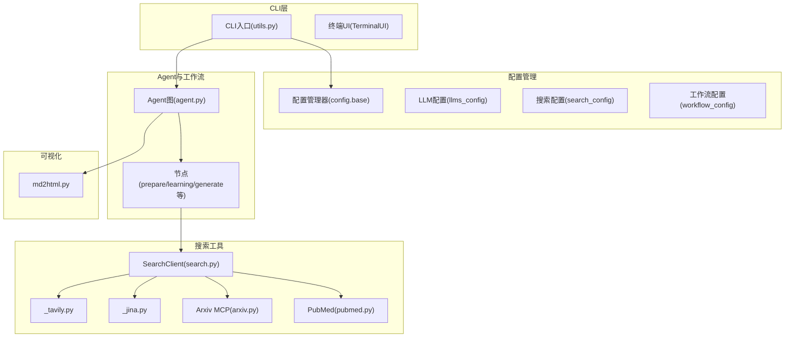
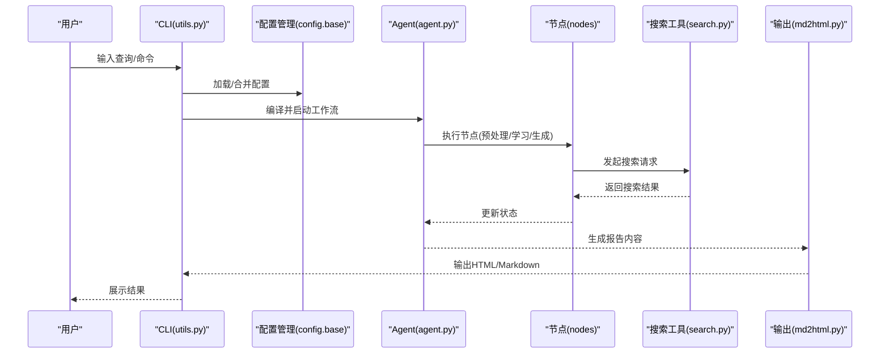
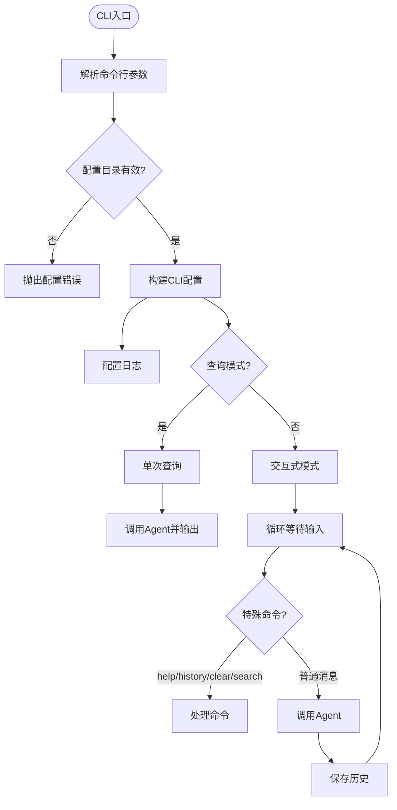
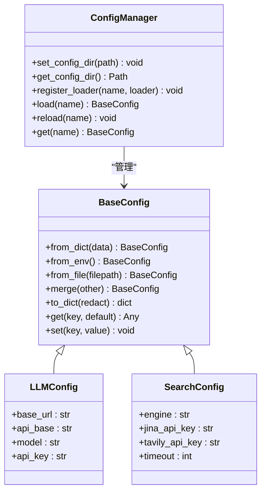
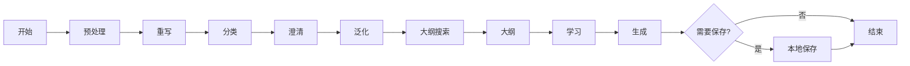
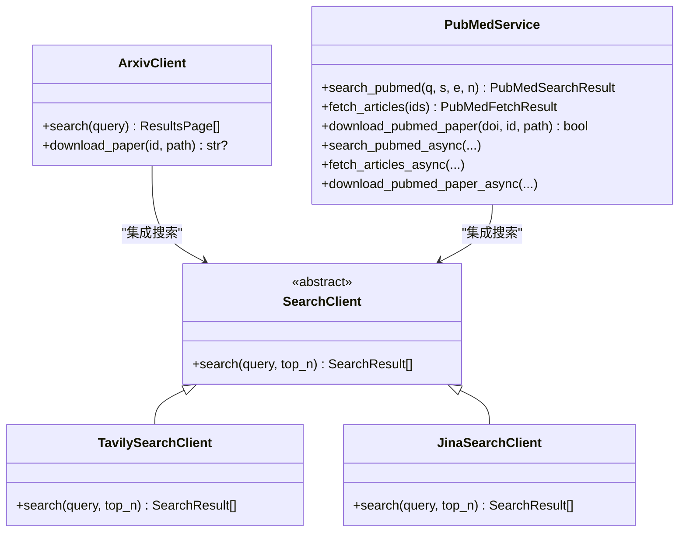
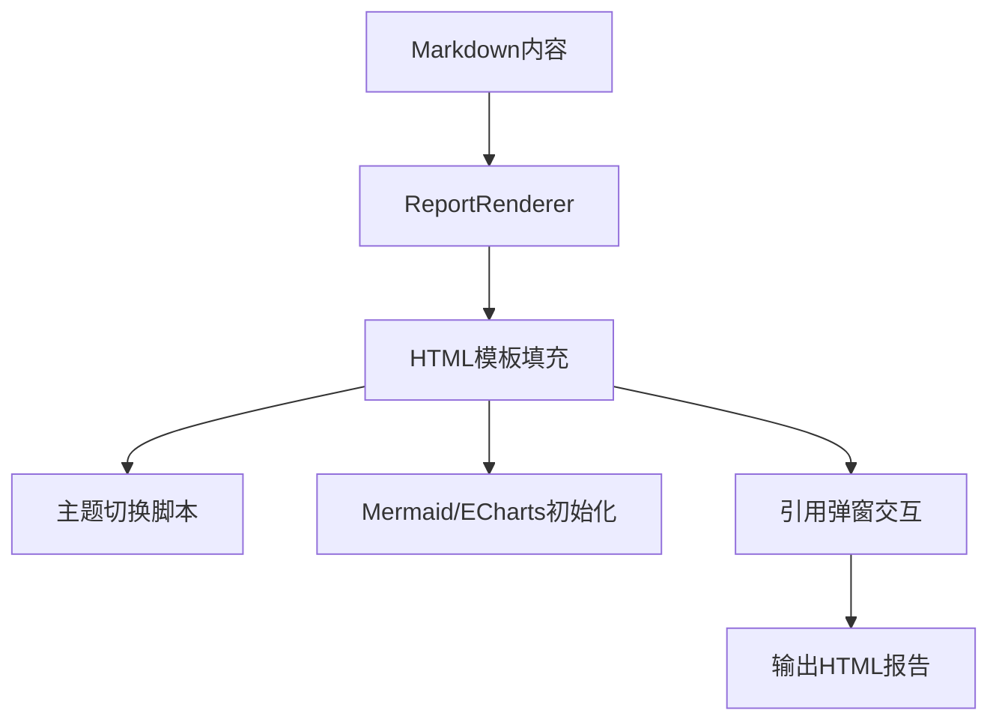
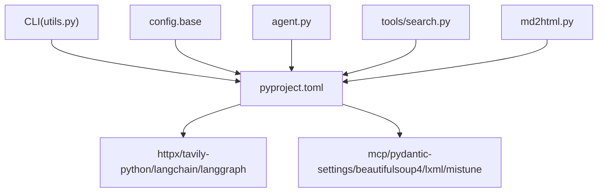

# DeepResearch深度研究工具

<cite>
**本文档引用的文件**
- [pyproject.toml](file://tools/DeepResearch/pyproject.toml)
- [__init__.py](file://tools/DeepResearch/src/deepresearch/__init__.py)
- [__main__.py](file://tools/DeepResearch/src/deepresearch/cli/__main__.py)
- [utils.py](file://tools/DeepResearch/src/deepresearch/cli/utils.py)
- [agent.py](file://tools/DeepResearch/src/deepresearch/agent/agent.py)
- [base.py](file://tools/DeepResearch/src/deepresearch/config/base.py)
- [llms_config.py](file://tools/DeepResearch/src/deepresearch/config/llms_config.py)
- [search_config.py](file://tools/DeepResearch/src/deepresearch/config/search_config.py)
- [workflow_config.py](file://tools/DeepResearch/src/deepresearch/config/workflow_config.py)
- [llms.toml](file://tools/DeepResearch/config/llms.toml)
- [search.toml](file://tools/DeepResearch/config/search.toml)
- [workflow.toml](file://tools/DeepResearch/config/workflow.toml)
- [_tavily.py](file://tools/DeepResearch/src/deepresearch/tools/_tavily.py)
- [_jina.py](file://tools/DeepResearch/src/deepresearch/tools/_jina.py)
- [search.py](file://tools/DeepResearch/src/deepresearch/tools/search.py)
- [arxiv.py](file://tools/DeepResearch/src/deepresearch/mcp_client/arxiv.py)
- [pubmed.py](file://tools/DeepResearch/src/deepresearch/mcp_client/pubmed.py)
- [md2html.py](file://tools/DeepResearch/src/deepresearch/tools/md2html.py)
</cite>

## 目录
1. [简介](#简介)
2. [项目结构](#项目结构)
3. [核心组件](#核心组件)
4. [架构总览](#架构总览)
5. [详细组件分析](#详细组件分析)
6. [依赖关系分析](#依赖关系分析)
7. [性能考虑](#性能考虑)
8. [故障排除指南](#故障排除指南)
9. [结论](#结论)
10. [附录](#附录)

## 简介
DeepResearch是一个基于多LLM协作的深度研究框架，通过LangGraph工作流编排多个智能体节点，结合多种搜索工具（Tavily、Jina、Arxiv MCP、PubMed）进行学术与技术主题的深度检索与分析，并最终输出可视化报告（HTML/Markdown）。该工具提供CLI入口，支持交互式对话与单次查询模式，具备完善的配置管理、错误处理与日志系统。

## 项目结构
项目采用分层与功能域结合的组织方式：
- 根配置：llms.toml、search.toml、workflow.toml
- 配置管理：config子包（基础配置、LLM配置、搜索配置、工作流配置）
- CLI：命令行入口与交互逻辑
- Agent与工作流：基于LangGraph的状态图编排
- 搜索工具：Tavily、Jina、Arxiv MCP、PubMed
- 可视化：Markdown到HTML渲染与图表输出
- 工具库：通用搜索客户端、HTML模板等

**图表来源**
- [utils.py:485-575](file://tools/DeepResearch/src/deepresearch/cli/utils.py#L485-L575)
- [agent.py:19-45](file://tools/DeepResearch/src/deepresearch/agent/agent.py#L19-L45)
- [search.py:12-37](file://tools/DeepResearch/src/deepresearch/tools/search.py#L12-L37)
- [_tavily.py:15-61](file://tools/DeepResearch/src/deepresearch/tools/_tavily.py#L15-L61)
- [_jina.py:15-79](file://tools/DeepResearch/src/deepresearch/tools/_jina.py#L15-L79)
- [arxiv.py:208-456](file://tools/DeepResearch/src/deepresearch/mcp_client/arxiv.py#L208-L456)
- [pubmed.py:65-480](file://tools/DeepResearch/src/deepresearch/mcp_client/pubmed.py#L65-L480)
- [md2html.py:34-710](file://tools/DeepResearch/src/deepresearch/tools/md2html.py#L34-L710)

**章节来源**
- [pyproject.toml:1-93](file://tools/DeepResearch/pyproject.toml#L1-L93)
- [__init__.py:1-30](file://tools/DeepResearch/src/deepresearch/__init__.py#L1-L30)

## 核心组件
- CLI与交互：提供命令行入口、参数解析、交互式对话、单次查询、信号处理与历史管理。
- 配置管理：统一的配置加载、合并、验证与缓存，支持文件、环境变量与代码覆盖。
- Agent工作流：基于LangGraph的状态图，包含预处理、重写、分类、澄清、泛化、大纲搜索、大纲生成、学习、生成与本地保存等节点。
- 搜索工具：封装Tavily与Jina Web搜索，以及Arxiv MCP与PubMed服务，支持异步下载与解析。
- 可视化输出：Markdown到HTML渲染，内嵌Mermaid与ECharts支持，提供主题切换与引用弹窗交互。

**章节来源**
- [utils.py:106-193](file://tools/DeepResearch/src/deepresearch/cli/utils.py#L106-L193)
- [base.py:373-456](file://tools/DeepResearch/src/deepresearch/config/base.py#L373-L456)
- [agent.py:19-45](file://tools/DeepResearch/src/deepresearch/agent/agent.py#L19-L45)
- [search.py:12-37](file://tools/DeepResearch/src/deepresearch/tools/search.py#L12-L37)
- [md2html.py:19-710](file://tools/DeepResearch/src/deepresearch/tools/md2html.py#L19-L710)

## 架构总览
整体架构围绕“配置驱动 + 多LLM协作 + 多源搜索 + 可视化输出”的设计原则构建。CLI负责接收用户输入与配置，Agent根据状态图逐步执行各节点，搜索工具提供外部知识源，最终由可视化模块生成报告。

**图表来源**
- [utils.py:106-193](file://tools/DeepResearch/src/deepresearch/cli/utils.py#L106-L193)
- [agent.py:19-45](file://tools/DeepResearch/src/deepresearch/agent/agent.py#L19-L45)
- [search.py:25-36](file://tools/DeepResearch/src/deepresearch/tools/search.py#L25-L36)
- [md2html.py:34-710](file://tools/DeepResearch/src/deepresearch/tools/md2html.py#L34-L710)

## 详细组件分析

### CLI与命令行接口
- 参数解析：支持查询模式、深度控制、HTML输出开关、输出路径、日志级别、日志文件、主题、配置目录、版本显示。
- 交互模式：提供帮助、清屏、历史记录查询与搜索、中断处理。
- 单次查询：直接返回AI生成的报告文本。
- 配置覆盖：命令行参数可覆盖默认配置与环境变量。

**图表来源**
- [utils.py:386-483](file://tools/DeepResearch/src/deepresearch/cli/utils.py#L386-L483)
- [utils.py:485-575](file://tools/DeepResearch/src/deepresearch/cli/utils.py#L485-L575)

**章节来源**
- [utils.py:386-575](file://tools/DeepResearch/src/deepresearch/cli/utils.py#L386-L575)

### 配置管理系统
- 配置来源优先级：代码 > 环境变量 > 配置文件 > 默认值。
- 支持范围/枚举/类型验证器，自动从环境变量映射。
- TOML缓存与敏感字段脱敏，支持动态重载。
- LLM配置、搜索配置、工作流配置分别独立加载与校验。

**图表来源**
- [base.py:190-372](file://tools/DeepResearch/src/deepresearch/config/base.py#L190-L372)
- [base.py:373-456](file://tools/DeepResearch/src/deepresearch/config/base.py#L373-L456)
- [llms_config.py:12-44](file://tools/DeepResearch/src/deepresearch/config/llms_config.py#L12-L44)
- [search_config.py:12-53](file://tools/DeepResearch/src/deepresearch/config/search_config.py#L12-L53)

**章节来源**
- [base.py:373-590](file://tools/DeepResearch/src/deepresearch/config/base.py#L373-L590)
- [llms_config.py:46-115](file://tools/DeepResearch/src/deepresearch/config/llms_config.py#L46-L115)
- [search_config.py:56-82](file://tools/DeepResearch/src/deepresearch/config/search_config.py#L56-L82)
- [workflow_config.py:7-28](file://tools/DeepResearch/src/deepresearch/config/workflow_config.py#L7-L28)

### Agent工作流与节点编排
- 图结构：START连接至预处理节点，后续节点按流程推进；生成节点根据条件决定保存或结束。
- 节点职责：预处理、重写、分类、澄清、泛化、大纲搜索、大纲生成、学习、生成、本地保存。
- 配置注入：最大深度、HTML保存开关、输出路径通过configurable传递给Agent。

**图表来源**
- [agent.py:19-45](file://tools/DeepResearch/src/deepresearch/agent/agent.py#L19-L45)

**章节来源**
- [agent.py:19-45](file://tools/DeepResearch/src/deepresearch/agent/agent.py#L19-L45)

### 搜索工具集成
- SearchClient工厂：根据配置选择Tavily或Jina客户端。
- Tavily：支持原始内容抓取，限制返回数量范围。
- Jina：通过HTTP API获取JSON结果，支持超时与头部配置。
- Arxiv MCP：提供查询参数、分页、退避重试、下载PDF能力。
- PubMed：支持同步/异步搜索、抓取文章、Sci-Hub下载PDF。

**图表来源**
- [search.py:12-37](file://tools/DeepResearch/src/deepresearch/tools/search.py#L12-L37)
- [_tavily.py:15-61](file://tools/DeepResearch/src/deepresearch/tools/_tavily.py#L15-L61)
- [_jina.py:15-79](file://tools/DeepResearch/src/deepresearch/tools/_jina.py#L15-L79)
- [arxiv.py:208-456](file://tools/DeepResearch/src/deepresearch/mcp_client/arxiv.py#L208-L456)
- [pubmed.py:65-480](file://tools/DeepResearch/src/deepresearch/mcp_client/pubmed.py#L65-L480)

**章节来源**
- [search.py:12-46](file://tools/DeepResearch/src/deepresearch/tools/search.py#L12-L46)
- [_tavily.py:15-72](file://tools/DeepResearch/src/deepresearch/tools/_tavily.py#L15-L72)
- [_jina.py:15-92](file://tools/DeepResearch/src/deepresearch/tools/_jina.py#L15-L92)
- [arxiv.py:208-456](file://tools/DeepResearch/src/deepresearch/mcp_client/arxiv.py#L208-L456)
- [pubmed.py:65-480](file://tools/DeepResearch/src/deepresearch/mcp_client/pubmed.py#L65-L480)

### 可视化输出系统
- Markdown到HTML：内置模板，支持Mermaid图与ECharts图表渲染。
- 引用与弹窗：支持引用标记与点击弹窗预览。
- 主题切换：现代/黑暗两种主题，动态更新图表配色。
- 内容卡片与响应式布局：提供良好的阅读体验。

**图表来源**
- [md2html.py:19-710](file://tools/DeepResearch/src/deepresearch/tools/md2html.py#L19-L710)

**章节来源**
- [md2html.py:34-1267](file://tools/DeepResearch/src/deepresearch/tools/md2html.py#L34-L1267)

## 依赖关系分析
- 语言与框架：Python 3.14+，LangChain/LangGraph、Pydantic、httpx、tavily-python、mcp等。
- CLI入口：通过脚本注册deepresearch指向utils.main。
- 配置加载：统一通过config.base的ConfigManager与load_toml_config。
- 搜索工具：Tavily/Jina作为Web搜索，Arxiv/PubMed作为学术数据库。

**图表来源**
- [pyproject.toml:12-26](file://tools/DeepResearch/pyproject.toml#L12-L26)
- [utils.py:20-34](file://tools/DeepResearch/src/deepresearch/cli/utils.py#L20-L34)
- [base.py:373-456](file://tools/DeepResearch/src/deepresearch/config/base.py#L373-L456)

**章节来源**
- [pyproject.toml:1-93](file://tools/DeepResearch/pyproject.toml#L1-L93)

## 性能考虑
- 并发与异步：PubMed提供异步搜索/抓取/下载接口，建议在大规模数据检索时启用异步以提升吞吐。
- 分页与退避：Arxiv MCP实现指数退避与随机抖动，避免触发限速。
- 缓存与重载：配置加载使用LRU缓存，必要时调用重载接口刷新配置。
- 超时控制：Jina搜索支持超时配置，避免长时间阻塞。
- 输出优化：HTML模板内联脚本与样式，减少外部依赖；图表按需初始化。

[本节为通用指导，无需特定文件引用]

## 故障排除指南
- 配置错误：检查llms.toml、search.toml、workflow.toml格式与字段完整性；可通过环境变量覆盖。
- 搜索异常：确认API密钥有效、网络可达；查看Tavily/Jina错误日志；必要时调整timeout。
- Agent执行错误：查看Agent执行过程中的异常堆栈；确认消息类型与输出结构。
- CLI中断：支持SIGINT/SIGTERM优雅退出；历史记录可辅助复盘。
- 日志定位：通过--log-level/--log-file参数调整日志级别与输出位置。

**章节来源**
- [base.py:459-471](file://tools/DeepResearch/src/deepresearch/config/base.py#L459-L471)
- [_tavily.py:57-60](file://tools/DeepResearch/src/deepresearch/tools/_tavily.py#L57-L60)
- [_jina.py:71-79](file://tools/DeepResearch/src/deepresearch/tools/_jina.py#L71-L79)
- [utils.py:181-185](file://tools/DeepResearch/src/deepresearch/cli/utils.py#L181-L185)

## 结论
DeepResearch通过模块化的配置管理、多LLM协作的Agent工作流、多源搜索工具与丰富的可视化输出，形成了一套完整的深度研究解决方案。其CLI设计简洁易用，适合学术与工程领域的快速知识探索与报告生成。建议在生产环境中结合异步搜索、合理的超时与重试策略，以及完善的日志与监控体系，持续优化性能与稳定性。

[本节为总结性内容，无需特定文件引用]

## 附录

### CLI使用示例
- 启动交互式模式：deepresearch
- 单次查询：deepresearch -q "人工智能的发展趋势"
- 设置深度：deepresearch --depth 5
- 关闭HTML保存：deepresearch --no-html
- 指定输出路径：deepresearch -o ./reports
- 指定配置目录：deepresearch --config-dir /path/to/config
- 查看帮助：deepresearch -h

**章节来源**
- [utils.py:392-408](file://tools/DeepResearch/src/deepresearch/cli/utils.py#L392-L408)

### 配置文件说明
- llms.toml：定义basic/clarify/planner/query_generation/evaluate/report等LLM角色的base_url、api_base、model、api_key。
- search.toml：定义engine（jina/tavily）、jina_api_key、tavily_api_key、timeout。
- workflow.toml：定义topN等工作流参数。

**章节来源**
- [llms.toml:1-29](file://tools/DeepResearch/config/llms.toml#L1-L29)
- [search.toml:1-6](file://tools/DeepResearch/config/search.toml#L1-L6)
- [workflow.toml:1-3](file://tools/DeepResearch/config/workflow.toml#L1-L3)