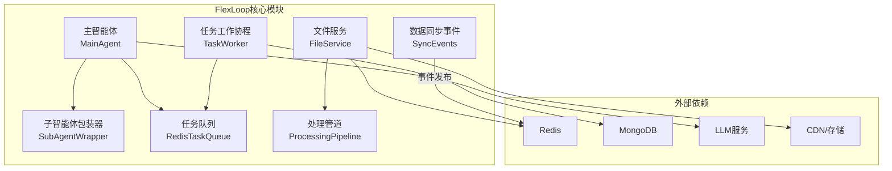
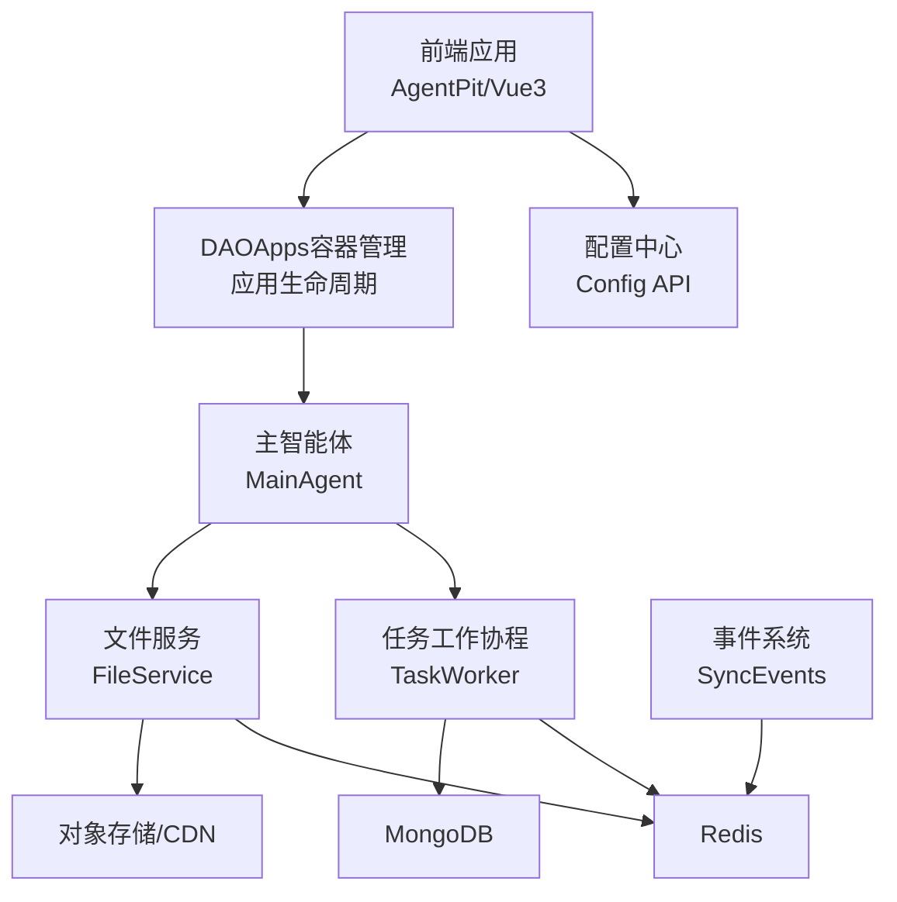
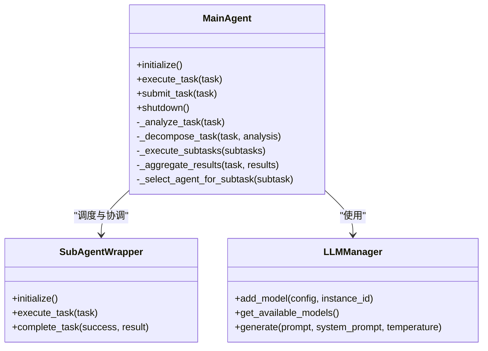
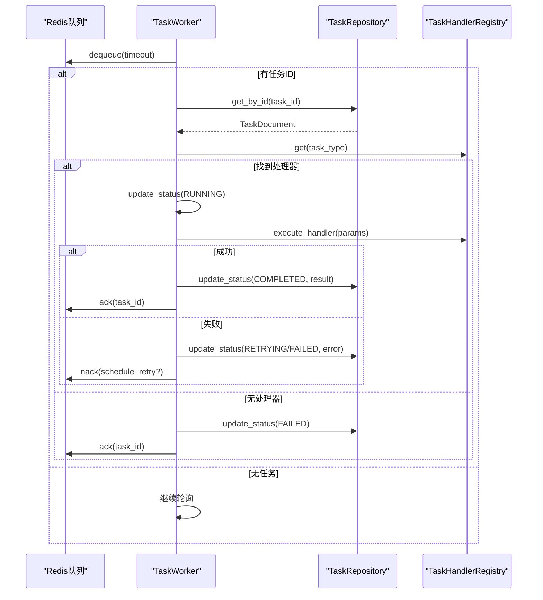
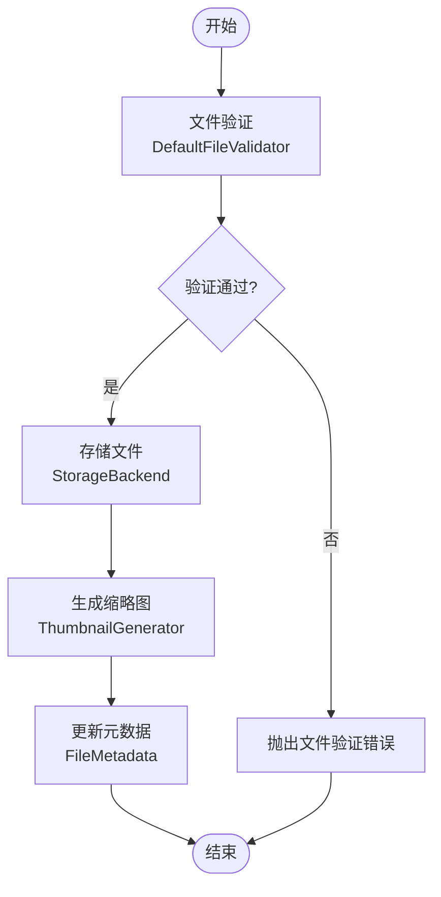
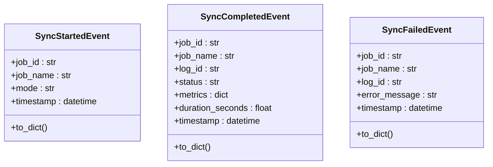
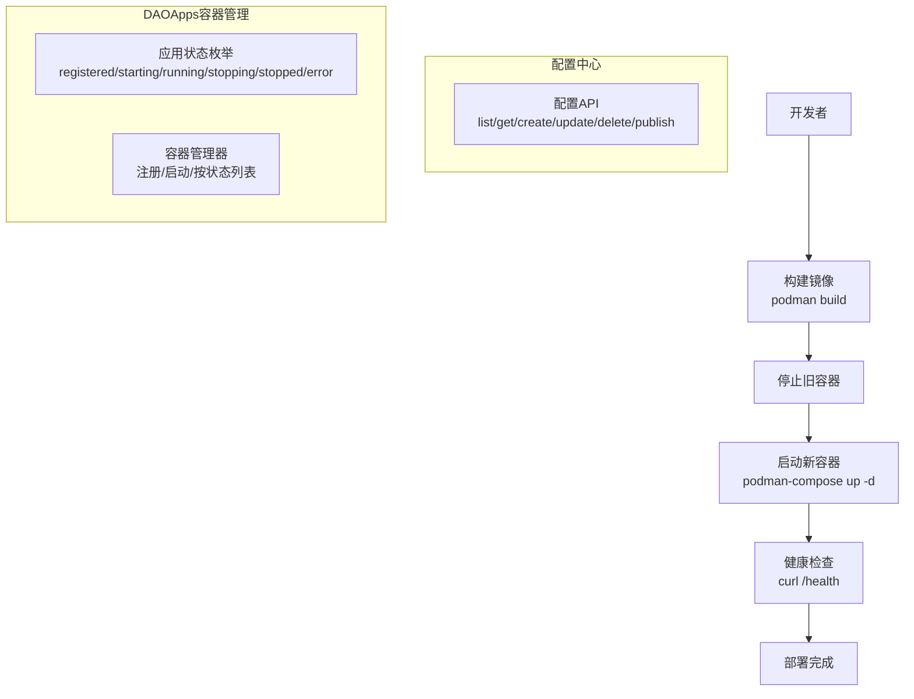
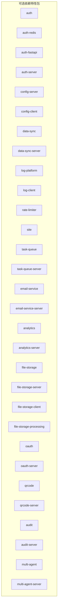

# FlexLoop工作流引擎

<cite>
**本文档引用的文件**
- [README.md](file://tools/flexloop/README.md)
- [pyproject.toml](file://tools/flexloop/pyproject.toml)
- [multi_agent_example.py](file://tools/flexloop/examples/multi_agent_example.py)
- [main_agent.py](file://tools/flexloop/src/taolib/testing/multi_agent/agents/main_agent.py)
- [worker.py](file://tools/flexloop/src/taolib/testing/task_queue/worker/worker.py)
- [types.py](file://tools/flexloop/src/taolib/testing/data_sync/events/types.py)
- [file_service.py](file://tools/flexloop/src/taolib/testing/file_storage/services/file_service.py)
- [pipeline.py](file://tools/flexloop/src/taolib/testing/file_storage/processing/pipeline.py)
- [deploy.sh](file://apps/AgentPit/deploy.sh)
- [podman-compose.yml](file://apps/AgentPit/podman-compose.yml)
- [configs.ts](file://apps/config-center/src/api/configs.ts)
- [types.ts](file://apps/DaoMind/packages/daoApps/src/types.ts)
- [container.test.ts](file://apps/DaoMind/packages/daoApps/src/__tests__/container.test.ts)
- [lifecycle.test.ts](file://apps/DaoMind/packages/daoApps/src/__tests__/lifecycle.test.ts)
- [ren-qi.ts](file://apps/DaoMind/packages/daoQi/src/channels/ren-qi.ts)
</cite>

## 目录
1. [简介](#简介)
2. [项目结构](#项目结构)
3. [核心组件](#核心组件)
4. [架构总览](#架构总览)
5. [详细组件分析](#详细组件分析)
6. [依赖关系分析](#依赖关系分析)
7. [性能考量](#性能考量)
8. [故障排查指南](#故障排查指南)
9. [结论](#结论)
10. [附录](#附录)

## 简介
FlexLoop工作流引擎是一个基于Python的分布式任务编排与多智能体系统框架，专注于容器化部署、微服务编排、任务队列、数据同步与事件处理，并提供文件分析与处理能力。该引擎通过模块化的依赖配置与清晰的组件边界，支持在Kubernetes等容器编排平台上进行弹性扩展与高可用部署。

## 项目结构
FlexLoop位于工具目录下的独立子项目，采用模块化设计，核心功能分布在以下子模块：
- 多智能体系统：包含主智能体、子智能体包装器、技能管理与LLM管理器
- 任务队列：基于Redis/MongoDB的任务工作协程与处理器注册表
- 数据同步与事件：事件类型定义与发布
- 文件存储与处理：文件服务、处理管道、验证器与缩略图生成
- 部署与集成：AgentPit前端应用的容器化部署脚本与配置中心API

**图表来源**
- [main_agent.py:104-472](file://tools/flexloop/src/taolib/testing/multi_agent/agents/main_agent.py#L104-L472)
- [worker.py:21-275](file://tools/flexloop/src/taolib/testing/task_queue/worker/worker.py#L21-L275)
- [file_service.py:30-42](file://tools/flexloop/src/taolib/testing/file_storage/services/file_service.py#L30-L42)
- [pipeline.py:29-52](file://tools/flexloop/src/taolib/testing/file_storage/processing/pipeline.py#L29-L52)

**章节来源**
- [README.md:1-100](file://tools/flexloop/README.md#L1-L100)
- [pyproject.toml:1-318](file://tools/flexloop/pyproject.toml#L1-L318)

## 核心组件
- 多智能体系统：主智能体负责任务分析、分解、子任务调度与结果聚合；子智能体包装器执行具体任务；支持模板化智能体创建与LLM负载均衡。
- 任务队列：基于Redis的异步任务队列，配合MongoDB持久化任务状态，支持处理器注册、重试与ACK/NACK机制。
- 数据同步与事件：定义同步开始、完成、失败等事件的数据结构，便于跨服务事件驱动。
- 文件存储与处理：统一的文件服务封装上传、验证、处理与缩略图生成，支持多种媒体类型检测与校验。
- 部署与集成：AgentPit前端应用提供容器化部署脚本与Compose配置；配置中心提供配置管理API；DAOApps容器管理应用提供应用生命周期管理。

**章节来源**
- [main_agent.py:104-472](file://tools/flexloop/src/taolib/testing/multi_agent/agents/main_agent.py#L104-L472)
- [worker.py:21-275](file://tools/flexloop/src/taolib/testing/task_queue/worker/worker.py#L21-L275)
- [types.py:11-73](file://tools/flexloop/src/taolib/testing/data_sync/events/types.py#L11-L73)
- [file_service.py:30-42](file://tools/flexloop/src/taolib/testing/file_storage/services/file_service.py#L30-L42)
- [deploy.sh:1-184](file://apps/AgentPit/deploy.sh#L1-L184)
- [configs.ts:1-32](file://apps/config-center/src/api/configs.ts#L1-L32)

## 架构总览
FlexLoop采用“智能体编排 + 任务队列 + 文件处理 + 事件驱动”的整体架构。前端通过配置中心与DAOApps容器管理进行交互，后端通过任务队列与文件服务实现异步处理与持久化，数据同步事件通过Redis发布，形成可观测、可扩展的微服务体系。

**图表来源**
- [deploy.sh:101-116](file://apps/AgentPit/deploy.sh#L101-L116)
- [configs.ts:1-32](file://apps/config-center/src/api/configs.ts#L1-L32)
- [types.ts:1-24](file://apps/DaoMind/packages/daoApps/src/types.ts#L1-L24)
- [main_agent.py:104-136](file://tools/flexloop/src/taolib/testing/multi_agent/agents/main_agent.py#L104-L136)
- [worker.py:21-74](file://tools/flexloop/src/taolib/testing/task_queue/worker/worker.py#L21-L74)
- [file_service.py:30-42](file://tools/flexloop/src/taolib/testing/file_storage/services/file_service.py#L30-L42)
- [types.py:11-73](file://tools/flexloop/src/taolib/testing/data_sync/events/types.py#L11-L73)

## 详细组件分析

### 多智能体系统编排
主智能体负责任务分析、分解、子任务调度与结果聚合；子智能体包装器执行具体任务并上报状态；支持模板化智能体创建与LLM负载均衡。智能体状态机涵盖注册、启动、运行、停止与错误状态。

**图表来源**
- [main_agent.py:104-472](file://tools/flexloop/src/taolib/testing/multi_agent/agents/main_agent.py#L104-L472)

**章节来源**
- [main_agent.py:104-472](file://tools/flexloop/src/taolib/testing/multi_agent/agents/main_agent.py#L104-L472)
- [multi_agent_example.py:14-33](file://tools/flexloop/examples/multi_agent_example.py#L14-L33)

### 任务队列与工作协程
任务工作协程从Redis队列拉取任务，查询MongoDB任务文档，根据任务类型查找处理器并执行，支持异步/同步处理器、重试与ACK/NACK机制。

**图表来源**
- [worker.py:79-275](file://tools/flexloop/src/taolib/testing/task_queue/worker/worker.py#L79-L275)

**章节来源**
- [worker.py:21-275](file://tools/flexloop/src/taolib/testing/task_queue/worker/worker.py#L21-L275)

### 文件分析与处理管道
文件服务编排验证、存储与缩略图生成流程，处理管道支持多种媒体类型检测与校验，生成校验和与缩略图。

**图表来源**
- [file_service.py:30-42](file://tools/flexloop/src/taolib/testing/file_storage/services/file_service.py#L30-L42)
- [pipeline.py:29-52](file://tools/flexloop/src/taolib/testing/file_storage/processing/pipeline.py#L29-L52)

**章节来源**
- [file_service.py:30-42](file://tools/flexloop/src/taolib/testing/file_storage/services/file_service.py#L30-L42)
- [pipeline.py:29-52](file://tools/flexloop/src/taolib/testing/file_storage/processing/pipeline.py#L29-L52)

### 数据同步事件系统
定义同步开始、完成、失败等事件的数据结构，便于跨服务事件驱动与可观测性。

**图表来源**
- [types.py:11-73](file://tools/flexloop/src/taolib/testing/data_sync/events/types.py#L11-L73)

**章节来源**
- [types.py:11-73](file://tools/flexloop/src/taolib/testing/data_sync/events/types.py#L11-L73)

### 容器化部署与Kubernetes集成
AgentPit前端应用提供完整的容器化部署脚本与Compose配置，支持镜像构建、容器启动、健康检查与状态展示。配置中心提供配置管理API，DAOApps容器管理提供应用生命周期管理。

**图表来源**
- [deploy.sh:66-116](file://apps/AgentPit/deploy.sh#L66-L116)
- [podman-compose.yml](file://apps/AgentPit/podman-compose.yml)
- [configs.ts:1-32](file://apps/config-center/src/api/configs.ts#L1-L32)
- [types.ts:1-24](file://apps/DaoMind/packages/daoApps/src/types.ts#L1-L24)
- [container.test.ts:203-233](file://apps/DaoMind/packages/daoApps/src/__tests__/container.test.ts#L203-L233)
- [lifecycle.test.ts:93-108](file://apps/DaoMind/packages/daoApps/src/__tests__/lifecycle.test.ts#L93-L108)

**章节来源**
- [deploy.sh:1-184](file://apps/AgentPit/deploy.sh#L1-L184)
- [configs.ts:1-32](file://apps/config-center/src/api/configs.ts#L1-L32)
- [types.ts:1-24](file://apps/DaoMind/packages/daoApps/src/types.ts#L1-L24)
- [container.test.ts:203-233](file://apps/DaoMind/packages/daoApps/src/__tests__/container.test.ts#L203-L233)
- [lifecycle.test.ts:93-108](file://apps/DaoMind/packages/daoApps/src/__tests__/lifecycle.test.ts#L93-L108)

## 依赖关系分析
FlexLoop通过pyproject.toml定义丰富的可选依赖，覆盖认证、配置中心、数据同步、日志平台、限流、站点、任务队列、邮件服务、分析、文件存储、OAuth、二维码、审计、多智能体等模块。这些依赖以特性包形式组织，便于按需安装与扩展。

**图表来源**
- [pyproject.toml:20-235](file://tools/flexloop/pyproject.toml#L20-L235)

**章节来源**
- [pyproject.toml:20-235](file://tools/flexloop/pyproject.toml#L20-L235)

## 性能考量
- 任务队列并发：通过异步工作协程与Redis队列实现高吞吐任务处理，建议根据CPU与IO瓶颈调整工作协程数量与队列长度。
- 文件处理：验证与缩略图生成建议异步化，避免阻塞主线程；对大文件建议分块处理与流式传输。
- 数据同步：事件发布采用Redis，建议启用持久化与合理TTL，避免事件积压。
- 多智能体：子智能体选择策略可引入负载均衡与能力匹配，减少上下文切换开销。
- 部署优化：容器镜像层优化与资源限制设置，结合HPA/KPA实现弹性伸缩。

## 故障排查指南
- 任务队列异常：检查Redis连接与队列可见性，确认ACK/NACK逻辑与重试策略；查看工作协程日志定位处理器缺失或执行异常。
- 文件处理失败：验证文件头部与MIME类型检测，检查存储后端权限与CDN配置；核对校验和与缩略图生成器。
- 多智能体执行失败：检查LLM可用性与负载均衡配置；确认子智能体状态与任务分配策略。
- 部署问题：使用AgentPit部署脚本进行镜像构建与容器启动，关注健康检查端点与容器日志。

**章节来源**
- [worker.py:132-153](file://tools/flexloop/src/taolib/testing/task_queue/worker/worker.py#L132-L153)
- [file_service.py:30-42](file://tools/flexloop/src/taolib/testing/file_storage/services/file_service.py#L30-L42)
- [deploy.sh:118-141](file://apps/AgentPit/deploy.sh#L118-L141)

## 结论
FlexLoop工作流引擎通过模块化设计与清晰的组件边界，提供了从多智能体编排到任务队列、文件处理与事件驱动的完整解决方案。结合容器化部署与特性化依赖管理，能够满足复杂业务场景下的可扩展性与可靠性需求。建议在生产环境中结合监控与告警体系，持续优化任务并发与文件处理性能，并完善故障恢复与扩展策略。

## 附录
- 使用示例：参考多智能体示例脚本，了解技能注册、智能体创建与LLM管理器使用。
- 集成最佳实践：通过配置中心API动态管理配置，利用DAOApps容器管理实现应用生命周期自动化，借助事件系统实现跨服务解耦。

**章节来源**
- [multi_agent_example.py:1-196](file://tools/flexloop/examples/multi_agent_example.py#L1-L196)
- [configs.ts:1-32](file://apps/config-center/src/api/configs.ts#L1-L32)
- [types.ts:1-24](file://apps/DaoMind/packages/daoApps/src/types.ts#L1-L24)