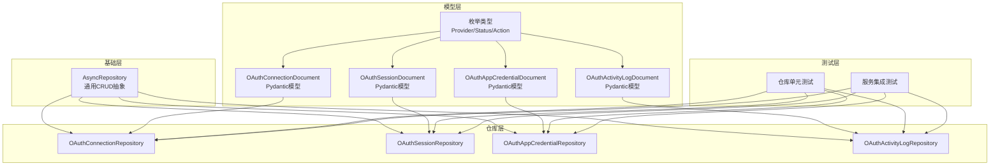
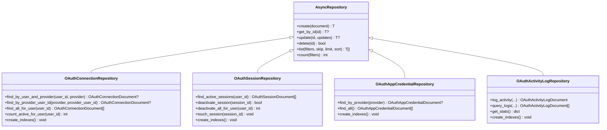
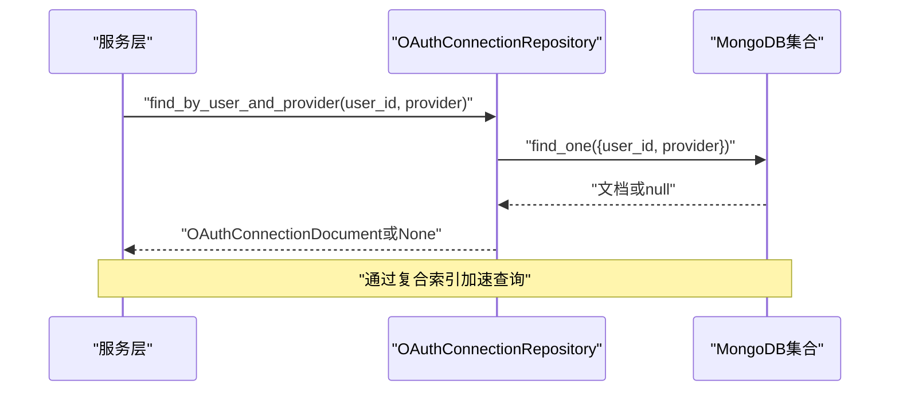
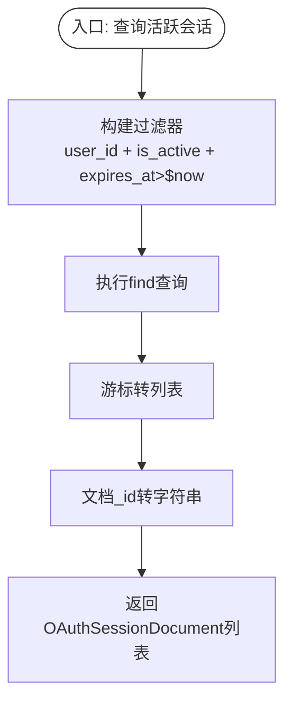
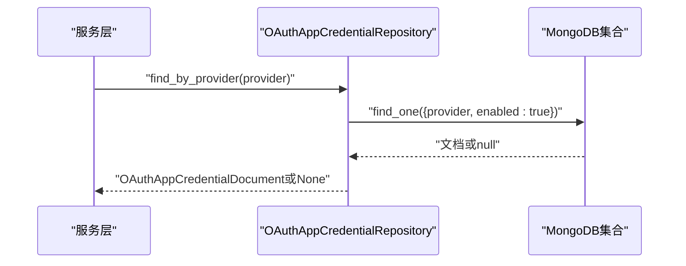
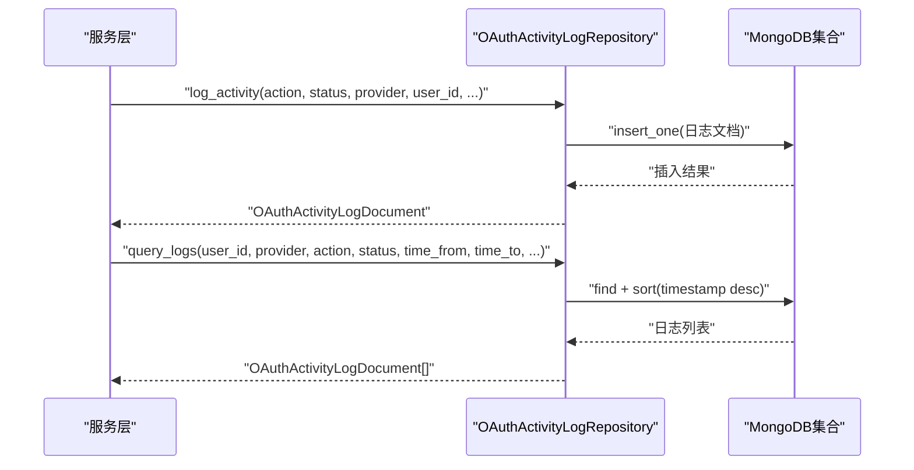
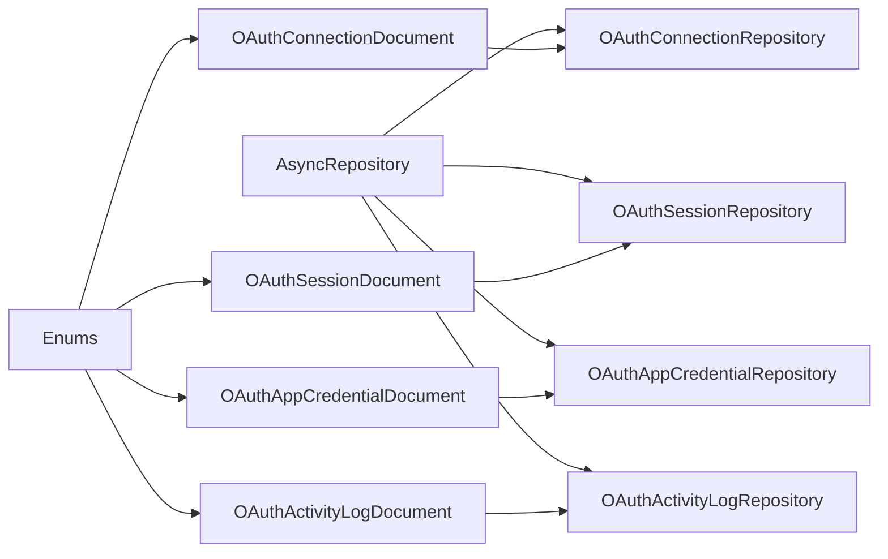

# OAuth仓库模式

<cite>
**本文引用的文件**
- [connection_repo.py](file://tools/flexloop/src/taolib/testing/oauth/repository/connection_repo.py)
- [session_repo.py](file://tools/flexloop/src/taolib/testing/oauth/repository/session_repo.py)
- [credential_repo.py](file://tools/flexloop/src/taolib/testing/oauth/repository/credential_repo.py)
- [activity_repo.py](file://tools/flexloop/src/taolib/testing/oauth/repository/activity_repo.py)
- [repository.py](file://tools/flexloop/src/taolib/testing/_base/repository.py)
- [connection.py](file://tools/flexloop/src/taolib/testing/oauth/models/connection.py)
- [session.py](file://tools/flexloop/src/taolib/testing/oauth/models/session.py)
- [credential.py](file://tools/flexloop/src/taolib/testing/oauth/models/credential.py)
- [enums.py](file://tools/flexloop/src/taolib/testing/oauth/models/enums.py)
- [activity.py](file://tools/flexloop/src/taolib/testing/oauth/models/activity.py)
- [test_repos.py](file://tools/flexloop/tests/testing/test_oauth/test_repository/test_repos.py)
- [test_services.py](file://tools/flexloop/tests/testing/test_oauth/test_services/test_services.py)
</cite>

## 目录
1. [简介](#简介)
2. [项目结构](#项目结构)
3. [核心组件](#核心组件)
4. [架构总览](#架构总览)
5. [详细组件分析](#详细组件分析)
6. [依赖关系分析](#依赖关系分析)
7. [性能考量](#性能考量)
8. [故障排查指南](#故障排查指南)
9. [结论](#结论)
10. [附录](#附录)

## 简介
本文件系统性阐述OAuth仓库模式的数据访问层设计与实现，覆盖四类核心仓库：连接仓库、会话仓库、凭证仓库与活动仓库。文档从数据模型、索引与查询优化、事务与一致性保障、到与服务层的交互模式进行深入解析，并结合测试用例路径定位关键实现细节，帮助读者快速理解并正确使用该数据访问层。

## 项目结构
该仓库模式采用“模型-仓库-测试”分层组织方式，核心位于工具库模块taolib/testing/oauth下，基础仓库抽象由_taolib/testing/_base/repository.py提供，各领域模型在oauth/models目录中定义，测试用例位于tools/flexloop/tests/testing/test_oauth。

图表来源
- [repository.py:15-131](file://tools/flexloop/src/taolib/testing/_base/repository.py#L15-L131)
- [connection_repo.py:12-105](file://tools/flexloop/src/taolib/testing/oauth/repository/connection_repo.py#L12-L105)
- [session_repo.py:13-92](file://tools/flexloop/src/taolib/testing/oauth/repository/session_repo.py#L13-L92)
- [credential_repo.py:12-62](file://tools/flexloop/src/taolib/testing/oauth/repository/credential_repo.py#L12-L62)
- [activity_repo.py:15-145](file://tools/flexloop/src/taolib/testing/oauth/repository/activity_repo.py#L15-L145)
- [connection.py:77-122](file://tools/flexloop/src/taolib/testing/oauth/models/connection.py#L77-L122)
- [session.py:30-67](file://tools/flexloop/src/taolib/testing/oauth/models/session.py#L30-L67)
- [credential.py:66-105](file://tools/flexloop/src/taolib/testing/oauth/models/credential.py#L66-L105)
- [activity.py:31-65](file://tools/flexloop/src/taolib/testing/oauth/models/activity.py#L31-L65)
- [enums.py:9-45](file://tools/flexloop/src/taolib/testing/oauth/models/enums.py#L9-L45)
- [test_repos.py:1-266](file://tools/flexloop/tests/testing/test_oauth/test_repository/test_repos.py#L1-L266)
- [test_services.py:244-285](file://tools/flexloop/tests/testing/test_oauth/test_services/test_services.py#L244-L285)

章节来源
- [repository.py:15-131](file://tools/flexloop/src/taolib/testing/_base/repository.py#L15-L131)
- [connection_repo.py:12-105](file://tools/flexloop/src/taolib/testing/oauth/repository/connection_repo.py#L12-L105)
- [session_repo.py:13-92](file://tools/flexloop/src/taolib/testing/oauth/repository/session_repo.py#L13-L92)
- [credential_repo.py:12-62](file://tools/flexloop/src/taolib/testing/oauth/repository/credential_repo.py#L12-L62)
- [activity_repo.py:15-145](file://tools/flexloop/src/taolib/testing/oauth/repository/activity_repo.py#L15-L145)

## 核心组件
- 连接仓库：负责用户与第三方提供商的绑定关系管理，支持按用户+提供商、提供商+用户ID检索，以及活跃连接统计与索引优化。
- 会话仓库：负责JWT会话的生命周期管理，包括活跃会话查询、会话停用、批量停用、最后活跃时间刷新及过期索引。
- 凭证仓库：负责应用级OAuth凭据（client_id/client_secret）的存储与检索，支持按提供商查询启用状态凭据。
- 活动仓库：负责认证相关活动日志的记录、查询与统计，支持多维过滤与时间窗口查询，具备自动过期清理能力。

章节来源
- [connection_repo.py:23-105](file://tools/flexloop/src/taolib/testing/oauth/repository/connection_repo.py#L23-L105)
- [session_repo.py:24-92](file://tools/flexloop/src/taolib/testing/oauth/repository/session_repo.py#L24-L92)
- [credential_repo.py:23-62](file://tools/flexloop/src/taolib/testing/oauth/repository/credential_repo.py#L23-L62)
- [activity_repo.py:26-145](file://tools/flexloop/src/taolib/testing/oauth/repository/activity_repo.py#L26-L145)

## 架构总览
仓库层基于统一的异步抽象基类AsyncRepository，提供通用CRUD与查询能力；各领域仓库继承该基类并扩展业务查询方法；模型层以Pydantic模型定义文档结构与序列化；测试用例覆盖典型场景与边界条件。

图表来源
- [repository.py:15-131](file://tools/flexloop/src/taolib/testing/_base/repository.py#L15-L131)
- [connection_repo.py:12-105](file://tools/flexloop/src/taolib/testing/oauth/repository/connection_repo.py#L12-L105)
- [session_repo.py:13-92](file://tools/flexloop/src/taolib/testing/oauth/repository/session_repo.py#L13-L92)
- [credential_repo.py:12-62](file://tools/flexloop/src/taolib/testing/oauth/repository/credential_repo.py#L12-L62)
- [activity_repo.py:15-145](file://tools/flexloop/src/taolib/testing/oauth/repository/activity_repo.py#L15-L145)

## 详细组件分析

### 连接仓库（OAuthConnectionRepository）
- 职责与功能
  - 按用户与提供商查询唯一连接，避免重复绑定。
  - 按提供商侧用户ID查询连接，用于第三方回调或迁移场景。
  - 查询某用户的全部连接，支持聚合统计活跃连接数。
  - 提供索引创建方法，确保查询性能与唯一性约束。
- 数据模型映射
  - 使用OAuthConnectionDocument作为MongoDB文档模型，包含加密的访问/刷新令牌、过期时间、状态、作用域等字段。
- 关键查询与索引
  - 复合唯一索引：(user_id, provider)与(provider, provider_user_id)，保证全局唯一性。
  - 单列索引：user_id与status，支撑活跃连接统计与按用户检索。
- 错误处理与边界
  - 查询不到时返回None，调用方需进行空值检查。
  - 返回的文档ID统一转为字符串，便于JSON序列化。

图表来源
- [connection_repo.py:23-42](file://tools/flexloop/src/taolib/testing/oauth/repository/connection_repo.py#L23-L42)
- [connection.py:77-122](file://tools/flexloop/src/taolib/testing/oauth/models/connection.py#L77-L122)

章节来源
- [connection_repo.py:23-105](file://tools/flexloop/src/taolib/testing/oauth/repository/connection_repo.py#L23-L105)
- [connection.py:24-122](file://tools/flexloop/src/taolib/testing/oauth/models/connection.py#L24-L122)
- [enums.py:9-23](file://tools/flexloop/src/taolib/testing/oauth/models/enums.py#L9-L23)
- [test_repos.py:11-148](file://tools/flexloop/tests/testing/test_oauth/test_repository/test_repos.py#L11-L148)

### 会话仓库（OAuthSessionRepository）
- 职责与功能
  - 查询某用户的活跃会话（未过期且is_active为真）。
  - 单个或批量停用会话，支持强制登出场景。
  - 刷新会话最后活跃时间，用于保活与审计。
  - 提供索引创建方法，包含过期索引与复合索引。
- 数据模型映射
  - 使用OAuthSessionDocument，包含JWT访问/刷新令牌、IP/User-Agent、过期时间、最后活跃时间等。
- 关键查询与索引
  - user_id索引：支撑按用户检索。
  - expires_at TTL索引：自动清理过期会话，减少手动维护成本。
  - 复合索引(is_active, user_id)：加速活跃会话筛选。
- 事务与一致性
  - 单条更新使用update_one，批量停用使用update_many，返回修改计数以确认效果。

图表来源
- [session_repo.py:24-42](file://tools/flexloop/src/taolib/testing/oauth/repository/session_repo.py#L24-L42)
- [session.py:30-67](file://tools/flexloop/src/taolib/testing/oauth/models/session.py#L30-L67)

章节来源
- [session_repo.py:24-92](file://tools/flexloop/src/taolib/testing/oauth/repository/session_repo.py#L24-L92)
- [session.py:14-67](file://tools/flexloop/src/taolib/testing/oauth/models/session.py#L14-L67)
- [test_repos.py:150-222](file://tools/flexloop/tests/testing/test_oauth/test_repository/test_repos.py#L150-L222)

### 凭证仓库（OAuthAppCredentialRepository）
- 职责与功能
  - 按提供商查询启用的凭据，用于认证流程初始化。
  - 查询所有凭据（含禁用），用于管理后台展示。
  - 提供索引创建方法，保证按提供商唯一检索与启用状态筛选。
- 数据模型映射
  - 使用OAuthAppCredentialDocument，包含加密的client_secret、允许的作用域、回调地址等。
- 关键查询与索引
  - provider唯一索引：确保同一提供商仅有一条启用凭据。
  - enabled单列索引：支撑启用状态快速筛选。

图表来源
- [credential_repo.py:23-41](file://tools/flexloop/src/taolib/testing/oauth/repository/credential_repo.py#L23-L41)
- [credential.py:66-105](file://tools/flexloop/src/taolib/testing/oauth/models/credential.py#L66-L105)

章节来源
- [credential_repo.py:23-62](file://tools/flexloop/src/taolib/testing/oauth/repository/credential_repo.py#L23-L62)
- [credential.py:14-105](file://tools/flexloop/src/taolib/testing/oauth/models/credential.py#L14-L105)
- [test_repos.py:120-148](file://tools/flexloop/tests/testing/test_oauth/test_repository/test_repos.py#L120-L148)
- [test_services.py:260-285](file://tools/flexloop/tests/testing/test_oauth/test_services/test_services.py#L260-L285)

### 活动仓库（OAuthActivityLogRepository）
- 职责与功能
  - 记录认证相关活动（登录、绑定、解绑、令牌刷新、凭证变更等）。
  - 支持按用户、提供商、动作、状态、时间窗口等多维过滤查询。
  - 提供统计接口，计算总数、成功率等指标。
  - 提供自动过期索引，定期清理历史日志。
- 数据模型映射
  - 使用OAuthActivityLogDocument，包含动作类型、状态、提供商、用户ID、连接ID、IP/User-Agent、元数据与时间戳。
- 关键查询与索引
  - 复合索引：(user_id, timestamp)、(provider, timestamp)、(action, timestamp)，支撑高频查询。
  - timestamp TTL索引：设置90天过期，自动清理历史日志。

图表来源
- [activity_repo.py:26-114](file://tools/flexloop/src/taolib/testing/oauth/repository/activity_repo.py#L26-L114)
- [activity.py:31-65](file://tools/flexloop/src/taolib/testing/oauth/models/activity.py#L31-L65)

章节来源
- [activity_repo.py:26-145](file://tools/flexloop/src/taolib/testing/oauth/repository/activity_repo.py#L26-L145)
- [activity.py:14-65](file://tools/flexloop/src/taolib/testing/oauth/models/activity.py#L14-L65)
- [enums.py:25-43](file://tools/flexloop/src/taolib/testing/oauth/models/enums.py#L25-L43)
- [test_repos.py:224-264](file://tools/flexloop/tests/testing/test_oauth/test_repository/test_repos.py#L224-L264)

## 依赖关系分析
- 继承关系
  - 四个领域仓库均继承自AsyncRepository，复用通用CRUD与查询逻辑。
- 模型依赖
  - 各仓库与其对应文档模型强绑定，确保数据结构一致与序列化稳定。
- 枚举依赖
  - Provider、ConnectionStatus、ActivityAction、ActivityStatus等枚举统一定义，避免字符串魔法值。
- 测试依赖
  - 测试用例直接构造Mock集合传入仓库，验证查询、索引与统计逻辑。

图表来源
- [repository.py:15-131](file://tools/flexloop/src/taolib/testing/_base/repository.py#L15-L131)
- [connection_repo.py:12-105](file://tools/flexloop/src/taolib/testing/oauth/repository/connection_repo.py#L12-L105)
- [session_repo.py:13-92](file://tools/flexloop/src/taolib/testing/oauth/repository/session_repo.py#L13-L92)
- [credential_repo.py:12-62](file://tools/flexloop/src/taolib/testing/oauth/repository/credential_repo.py#L12-L62)
- [activity_repo.py:15-145](file://tools/flexloop/src/taolib/testing/oauth/repository/activity_repo.py#L15-L145)
- [connection.py:77-122](file://tools/flexloop/src/taolib/testing/oauth/models/connection.py#L77-L122)
- [session.py:30-67](file://tools/flexloop/src/taolib/testing/oauth/models/session.py#L30-L67)
- [credential.py:66-105](file://tools/flexloop/src/taolib/testing/oauth/models/credential.py#L66-L105)
- [activity.py:31-65](file://tools/flexloop/src/taolib/testing/oauth/models/activity.py#L31-L65)
- [enums.py:9-45](file://tools/flexloop/src/taolib/testing/oauth/models/enums.py#L9-L45)

章节来源
- [repository.py:15-131](file://tools/flexloop/src/taolib/testing/_base/repository.py#L15-L131)
- [connection_repo.py:12-105](file://tools/flexloop/src/taolib/testing/oauth/repository/connection_repo.py#L12-L105)
- [session_repo.py:13-92](file://tools/flexloop/src/taolib/testing/oauth/repository/session_repo.py#L13-L92)
- [credential_repo.py:12-62](file://tools/flexloop/src/taolib/testing/oauth/repository/credential_repo.py#L12-L62)
- [activity_repo.py:15-145](file://tools/flexloop/src/taolib/testing/oauth/repository/activity_repo.py#L15-L145)

## 性能考量
- 索引设计
  - 连接仓库：(user_id, provider)与(provider, provider_user_id)唯一索引，user_id与status单列索引。
  - 会话仓库：user_id与expires_at TTL索引，(is_active, user_id)复合索引。
  - 凭证仓库：provider唯一索引，enabled单列索引。
  - 活动仓库：(user_id, timestamp)、(provider, timestamp)、(action, timestamp)复合索引，timestamp TTL索引。
- 查询优化
  - 使用精确过滤条件与排序，避免全表扫描。
  - 对高频查询（活跃会话、按用户日志）优先使用复合索引。
  - 控制分页大小与跳过量，避免深度分页导致的性能问题。
- 事务与一致性
  - 单条更新使用原子操作，批量更新返回修改计数以确认影响范围。
  - 会话过期通过TTL索引自动清理，降低运维成本。

[本节为通用性能建议，无需特定文件引用]

## 故障排查指南
- 连接查询为空
  - 检查输入参数是否匹配索引键，确认provider与provider_user_id拼写一致。
  - 参考测试用例中的断言路径定位问题。
- 会话无法激活/停用
  - 确认会话是否已过期（expires_at小于当前时间），过期会话不会被视作活跃。
  - 检查deactivate_session返回的modified_count是否大于0。
- 凭证未生效
  - 确认find_by_provider查询的是enabled=true的记录。
  - 检查provider唯一索引是否被违反（同一提供商不应存在多条启用凭据）。
- 日志缺失或过多
  - 检查timestamp TTL索引是否正确创建，确认过期时间配置。
  - 使用query_logs的time_from/time_to限定时间窗口进行定位。

章节来源
- [test_repos.py:11-264](file://tools/flexloop/tests/testing/test_oauth/test_repository/test_repos.py#L11-L264)
- [test_services.py:244-285](file://tools/flexloop/tests/testing/test_oauth/test_services/test_services.py#L244-L285)

## 结论
该OAuth仓库模式通过统一的异步抽象与清晰的领域模型，实现了连接、会话、凭证与活动日志的完整数据访问能力。配合精心设计的索引与自动过期策略，既满足了高并发下的查询性能，又降低了运维复杂度。测试用例覆盖了关键路径与边界条件，为后续演进提供了可靠的质量保障。

[本节为总结性内容，无需特定文件引用]

## 附录

### 数据模型与数据库表结构说明
- 连接集合（OAuthConnectionDocument）
  - 字段要点：provider、provider_user_id、user_id、access_token_encrypted、refresh_token_encrypted、token_expires_at、scopes、status、last_used_at、created_at、updated_at。
  - 索引：(user_id, provider)唯一、(provider, provider_user_id)唯一、user_id、status。
- 会话集合（OAuthSessionDocument）
  - 字段要点：id、user_id、provider、connection_id、jwt_access_token、jwt_refresh_token、ip_address、user_agent、is_active、created_at、expires_at、last_activity_at。
  - 索引：user_id、expires_at TTL、(is_active, user_id)复合。
- 凭证集合（OAuthAppCredentialDocument）
  - 字段要点：provider、client_id、client_secret_encrypted、display_name、enabled、allowed_scopes、redirect_uri、created_by、created_at、updated_at。
  - 索引：provider唯一、enabled。
- 活动日志集合（OAuthActivityLogDocument）
  - 字段要点：action、status、provider、user_id、connection_id、ip_address、user_agent、metadata、timestamp。
  - 索引：(user_id, timestamp)、(provider, timestamp)、(action, timestamp)、timestamp TTL。

章节来源
- [connection.py:77-122](file://tools/flexloop/src/taolib/testing/oauth/models/connection.py#L77-L122)
- [session.py:30-67](file://tools/flexloop/src/taolib/testing/oauth/models/session.py#L30-L67)
- [credential.py:66-105](file://tools/flexloop/src/taolib/testing/oauth/models/credential.py#L66-L105)
- [activity.py:31-65](file://tools/flexloop/src/taolib/testing/oauth/models/activity.py#L31-L65)
- [connection_repo.py:93-102](file://tools/flexloop/src/taolib/testing/oauth/repository/connection_repo.py#L93-L102)
- [session_repo.py:85-89](file://tools/flexloop/src/taolib/testing/oauth/repository/session_repo.py#L85-L89)
- [credential_repo.py:56-59](file://tools/flexloop/src/taolib/testing/oauth/repository/credential_repo.py#L56-L59)
- [activity_repo.py:135-142](file://tools/flexloop/src/taolib/testing/oauth/repository/activity_repo.py#L135-L142)

### 与服务层的交互模式与一致性保障
- 交互模式
  - 服务层通过仓库提供的业务方法完成数据访问，避免直接操作底层集合。
  - 活动日志记录贯穿关键操作（登录、绑定、解绑、令牌刷新、凭证变更），形成完整的审计轨迹。
- 一致性保障
  - 单条更新原子性：update_one返回修改计数，确保幂等与可观测性。
  - 批量更新：deactivate_all_for_user返回受影响数量，便于上层校验。
  - 自动过期：会话与活动日志通过TTL索引自动清理，减少脏数据积累。

章节来源
- [repository.py:58-88](file://tools/flexloop/src/taolib/testing/_base/repository.py#L58-L88)
- [activity_repo.py:26-145](file://tools/flexloop/src/taolib/testing/oauth/repository/activity_repo.py#L26-L145)
- [test_services.py:260-285](file://tools/flexloop/tests/testing/test_oauth/test_services/test_services.py#L260-L285)