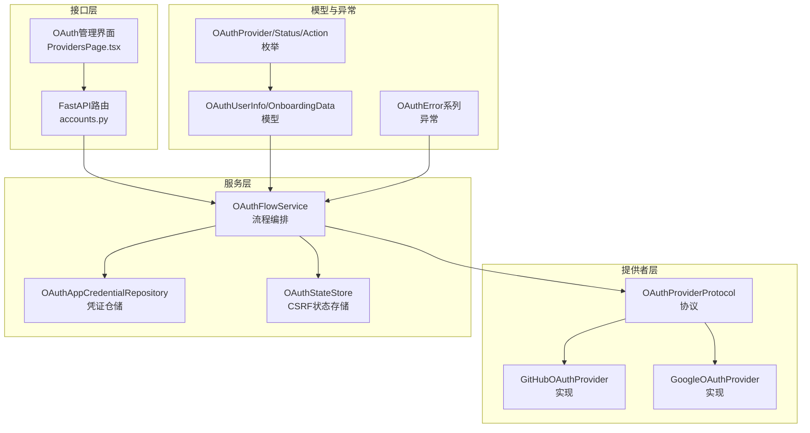
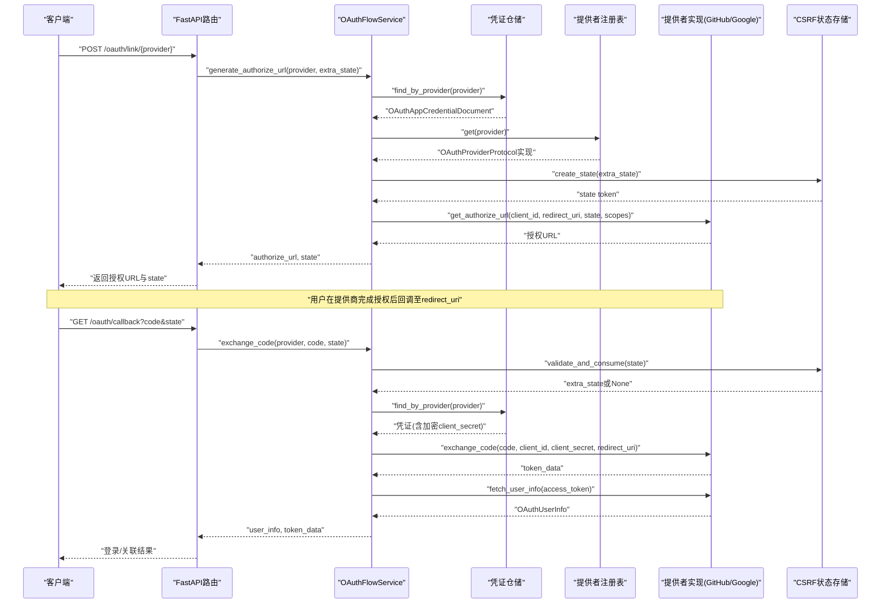
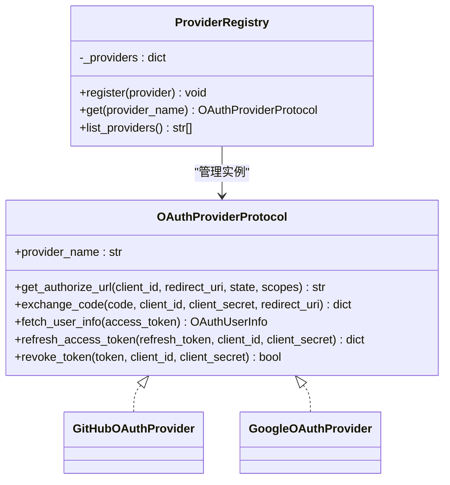
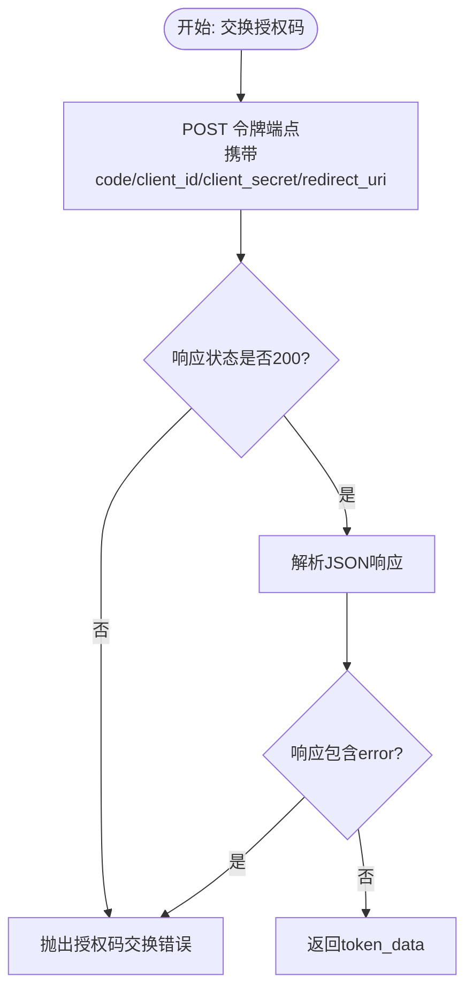
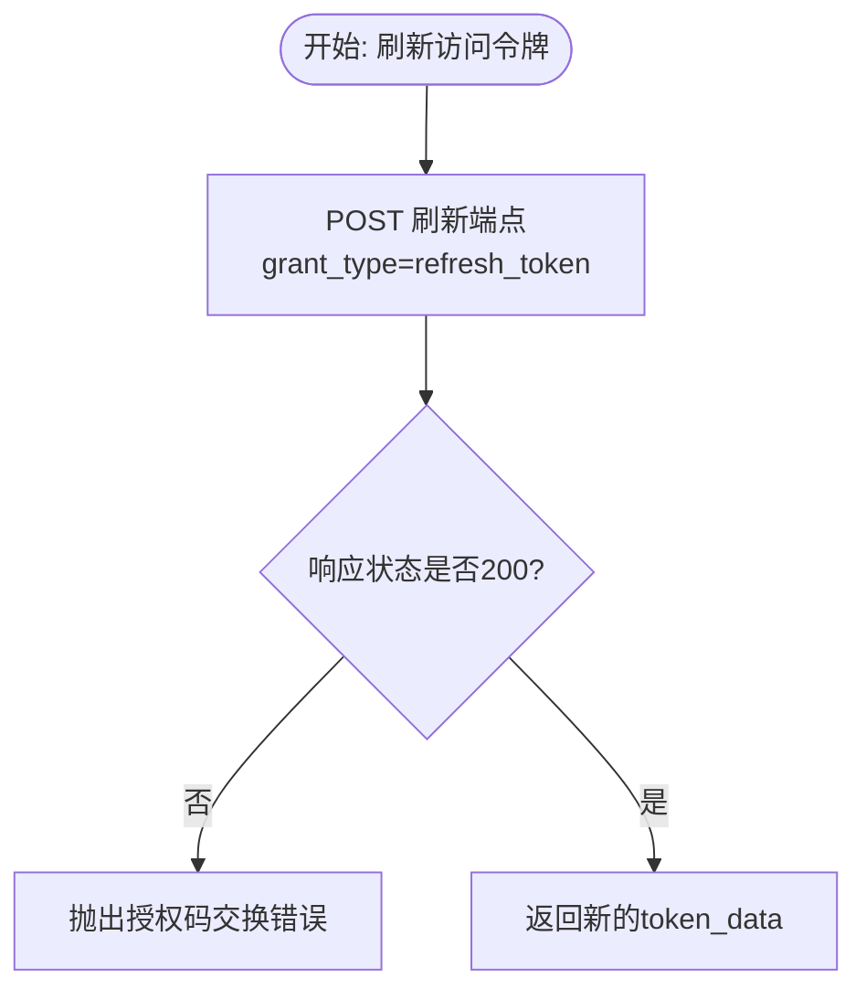
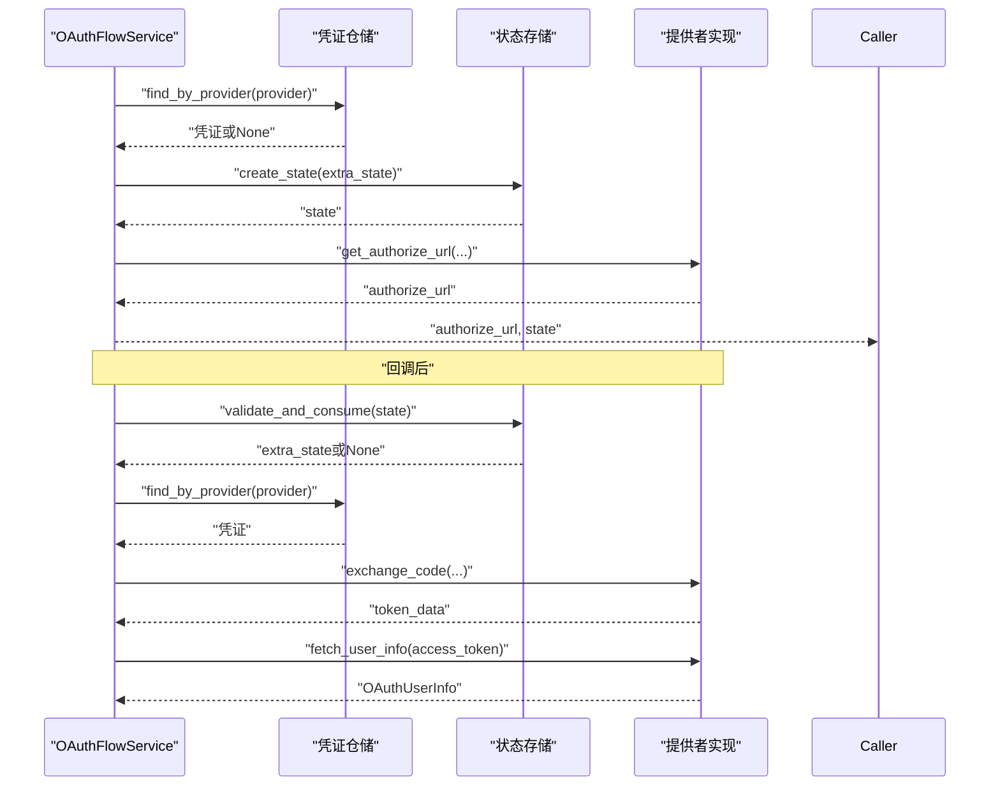
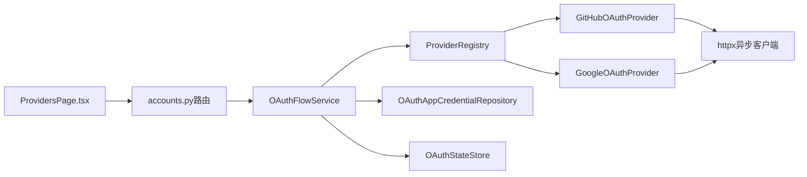

# OAuth提供者集成

<cite>
**本文档引用的文件**
- [base.py](file://tools/flexloop/src/taolib/testing/oauth/providers/base.py)
- [github.py](file://tools/flexloop/src/taolib/testing/oauth/providers/github.py)
- [google.py](file://tools/flexloop/src/taolib/testing/oauth/providers/google.py)
- [__init__.py](file://tools/flexloop/src/taolib/testing/oauth/providers/__init__.py)
- [profile.py](file://tools/flexloop/src/taolib/testing/oauth/models/profile.py)
- [enums.py](file://tools/flexloop/src/taolib/testing/oauth/models/enums.py)
- [errors.py](file://tools/flexloop/src/taolib/testing/oauth/errors.py)
- [flow_service.py](file://tools/flexloop/src/taolib/testing/oauth/services/flow_service.py)
- [credential_repo.py](file://tools/flexloop/src/taolib/testing/oauth/repository/credential_repo.py)
- [state_store.py](file://tools/flexloop/src/taolib/testing/oauth/cache/state_store.py)
- [ProvidersPage.tsx](file://apps/oauth-admin/src/pages/ProvidersPage.tsx)
- [accounts.py](file://tools/flexloop/src/taolib/testing/oauth/server/api/accounts.py)
</cite>

## 目录
1. [简介](#简介)
2. [项目结构](#项目结构)
3. [核心组件](#核心组件)
4. [架构总览](#架构总览)
5. [详细组件分析](#详细组件分析)
6. [依赖关系分析](#依赖关系分析)
7. [性能考量](#性能考量)
8. [故障排除指南](#故障排除指南)
9. [结论](#结论)
10. [附录](#附录)

## 简介
本文件面向OAuth提供者集成模块，系统化阐述第三方认证提供商的抽象基类设计、具体实现模式与扩展方法，详解GitHub与Google等主流提供者的集成配置要点（客户端ID、密钥、回调URL、作用域），并深入解析提供者适配器的实现原理（用户信息获取、令牌交换、错误处理）。同时提供完整的配置示例与集成步骤，涵盖安全注意事项（重定向URI验证、CSRF防护、令牌存储安全）以及与主认证流程的集成方式与最佳实践。

## 项目结构
OAuth提供者集成模块位于工具库目录下，采用“协议+适配器+服务编排+基础设施”的分层组织方式：
- providers：提供者协议与具体实现（GitHub、Google）
- models：标准化数据模型与枚举
- errors：统一异常体系
- services：流程编排服务（生成授权URL、交换授权码、获取用户信息）
- repository：应用凭证仓储（MongoDB）
- cache：状态存储（Redis）
- server/api：FastAPI路由（发起授权、完成关联等）
- apps/oauth-admin：前端凭证管理页面

图表来源
- [base.py:11-107](file://tools/flexloop/src/taolib/testing/oauth/providers/base.py#L11-L107)
- [github.py:27-205](file://tools/flexloop/src/taolib/testing/oauth/providers/github.py#L27-L205)
- [google.py:23-186](file://tools/flexloop/src/taolib/testing/oauth/providers/google.py#L23-L186)
- [profile.py:13-41](file://tools/flexloop/src/taolib/testing/oauth/models/profile.py#L13-L41)
- [enums.py:9-45](file://tools/flexloop/src/taolib/testing/oauth/models/enums.py#L9-L45)
- [errors.py:7-113](file://tools/flexloop/src/taolib/testing/oauth/errors.py#L7-L113)
- [flow_service.py:16-123](file://tools/flexloop/src/taolib/testing/oauth/services/flow_service.py#L16-L123)
- [credential_repo.py:12-62](file://tools/flexloop/src/taolib/testing/oauth/repository/credential_repo.py#L12-L62)
- [state_store.py:13-69](file://tools/flexloop/src/taolib/testing/oauth/cache/state_store.py#L13-L69)
- [accounts.py:41-82](file://tools/flexloop/src/taolib/testing/oauth/server/api/accounts.py#L41-L82)
- [ProvidersPage.tsx:1-293](file://apps/oauth-admin/src/pages/ProvidersPage.tsx#L1-L293)

章节来源
- [base.py:1-107](file://tools/flexloop/src/taolib/testing/oauth/providers/base.py#L1-L107)
- [__init__.py:1-56](file://tools/flexloop/src/taolib/testing/oauth/providers/__init__.py#L1-L56)

## 核心组件
- 抽象协议：定义统一的授权URL生成、授权码交换、用户信息获取、令牌刷新与撤销等接口，确保各提供者实现的一致性与可替换性。
- 具体提供者：GitHub与Google的适配器，封装各自授权端点、参数约定与响应解析。
- 流程服务：编排授权码流程，负责凭证检索、CSRF状态校验、令牌交换与用户信息拉取。
- 数据模型：标准化用户信息结构，便于跨提供者统一处理。
- 异常体系：覆盖授权码交换失败、用户信息获取失败、CSRF状态无效、凭证缺失等场景。
- 基础设施：凭证仓储（MongoDB）、状态存储（Redis）。

章节来源
- [base.py:11-107](file://tools/flexloop/src/taolib/testing/oauth/providers/base.py#L11-L107)
- [github.py:27-205](file://tools/flexloop/src/taolib/testing/oauth/providers/github.py#L27-L205)
- [google.py:23-186](file://tools/flexloop/src/taolib/testing/oauth/providers/google.py#L23-L186)
- [flow_service.py:16-123](file://tools/flexloop/src/taolib/testing/oauth/services/flow_service.py#L16-L123)
- [profile.py:13-41](file://tools/flexloop/src/taolib/testing/oauth/models/profile.py#L13-L41)
- [errors.py:7-113](file://tools/flexloop/src/taolib/testing/oauth/errors.py#L7-L113)
- [credential_repo.py:12-62](file://tools/flexloop/src/taolib/testing/oauth/repository/credential_repo.py#L12-L62)
- [state_store.py:13-69](file://tools/flexloop/src/taolib/testing/oauth/cache/state_store.py#L13-L69)

## 架构总览
OAuth集成采用“协议驱动 + 服务编排 + 基础设施支撑”的架构：
- 协议层：通过协议约束提供者实现，保证扩展性与一致性。
- 适配层：针对不同提供商的端点与参数差异进行封装。
- 编排层：流程服务统一调度凭证、状态与提供者实现。
- 基础设施层：凭证仓储与状态存储保障数据持久化与安全。

图表来源
- [flow_service.py:40-121](file://tools/flexloop/src/taolib/testing/oauth/services/flow_service.py#L40-L121)
- [credential_repo.py:23-40](file://tools/flexloop/src/taolib/testing/oauth/repository/credential_repo.py#L23-L40)
- [state_store.py:33-66](file://tools/flexloop/src/taolib/testing/oauth/cache/state_store.py#L33-L66)
- [accounts.py:41-82](file://tools/flexloop/src/taolib/testing/oauth/server/api/accounts.py#L41-L82)
- [github.py:59-100](file://tools/flexloop/src/taolib/testing/oauth/providers/github.py#L59-L100)
- [google.py:58-94](file://tools/flexloop/src/taolib/testing/oauth/providers/google.py#L58-L94)

## 详细组件分析

### 抽象协议与注册表
- 协议定义了提供者必须实现的方法：生成授权URL、交换授权码、获取用户信息、刷新与撤销令牌。
- 注册表负责维护提供者实例映射，并支持动态注册与查找。

图表来源
- [base.py:11-107](file://tools/flexloop/src/taolib/testing/oauth/providers/base.py#L11-L107)
- [__init__.py:15-55](file://tools/flexloop/src/taolib/testing/oauth/providers/__init__.py#L15-L55)

章节来源
- [base.py:11-107](file://tools/flexloop/src/taolib/testing/oauth/providers/base.py#L11-L107)
- [__init__.py:15-55](file://tools/flexloop/src/taolib/testing/oauth/providers/__init__.py#L15-L55)

### GitHub提供者适配器
- 授权端点与令牌端点：封装GitHub标准OAuth端点。
- 授权URL生成：支持自定义scopes，默认包含邮箱与用户信息读取。
- 授权码交换：向GitHub令牌端点提交code、client_id、client_secret与redirect_uri，处理非200与错误字段。
- 用户信息获取：优先使用用户API；若无邮箱则调用邮箱API获取主邮箱。
- 刷新令牌：标准OAuth应用不支持刷新，抛出不支持异常。
- 令牌撤销：使用GitHub应用令牌撤销端点。

图表来源
- [github.py:59-100](file://tools/flexloop/src/taolib/testing/oauth/providers/github.py#L59-L100)

章节来源
- [github.py:27-205](file://tools/flexloop/src/taolib/testing/oauth/providers/github.py#L27-L205)

### Google提供者适配器
- 授权端点与令牌端点：封装Google OAuth2 + OpenID Connect端点。
- 授权URL生成：包含response_type、scope、state、access_type与prompt等参数。
- 授权码交换：指定grant_type为authorization_code。
- 用户信息获取：调用用户信息端点，标准化返回字段。
- 刷新令牌：指定grant_type为refresh_token，处理刷新失败。
- 令牌撤销：调用Google撤销端点。

图表来源
- [google.py:127-160](file://tools/flexloop/src/taolib/testing/oauth/providers/google.py#L127-L160)

章节来源
- [google.py:23-186](file://tools/flexloop/src/taolib/testing/oauth/providers/google.py#L23-L186)

### 流程服务与编排
- 生成授权URL：根据提供者名称查找启用的凭证，创建CSRF state，调用提供者实现生成授权URL。
- 交换授权码：校验并消费state，解密client_secret，调用提供者交换授权码，再获取用户信息。
- 错误处理：对凭证缺失、state无效等场景抛出相应异常。

图表来源
- [flow_service.py:40-121](file://tools/flexloop/src/taolib/testing/oauth/services/flow_service.py#L40-L121)
- [credential_repo.py:23-40](file://tools/flexloop/src/taolib/testing/oauth/repository/credential_repo.py#L23-L40)
- [state_store.py:33-66](file://tools/flexloop/src/taolib/testing/oauth/cache/state_store.py#L33-L66)

章节来源
- [flow_service.py:16-123](file://tools/flexloop/src/taolib/testing/oauth/services/flow_service.py#L16-L123)

### 数据模型与枚举
- OAuthUserInfo：标准化用户信息，包含提供商、提供商用户ID、邮箱、显示名、头像URL与原始数据。
- 枚举：OAuthProvider、连接状态、活动动作与状态等，用于统一标识与流程控制。

章节来源
- [profile.py:13-41](file://tools/flexloop/src/taolib/testing/oauth/models/profile.py#L13-L41)
- [enums.py:9-45](file://tools/flexloop/src/taolib/testing/oauth/models/enums.py#L9-L45)

### 异常体系
- OAuthError及其子类覆盖授权码交换失败、用户信息获取失败、CSRF状态无效、凭证缺失、刷新不支持、会话错误、引导流程错误等场景。

章节来源
- [errors.py:7-113](file://tools/flexloop/src/taolib/testing/oauth/errors.py#L7-L113)

### 前端凭证管理
- 提供者管理页面支持添加、启用/禁用、删除OAuth应用凭证，输入Client ID、Client Secret、回调URI、允许的Scopes等。
- 支持选择提供商（Google/GitHub），并以卡片形式展示凭证状态与更新时间。

章节来源
- [ProvidersPage.tsx:1-293](file://apps/oauth-admin/src/pages/ProvidersPage.tsx#L1-L293)

## 依赖关系分析
- ProviderRegistry依赖OAuthProviderProtocol，运行时通过注册表获取具体提供者实现。
- OAuthFlowService依赖凭证仓储、状态存储与提供者注册表，形成编排中心。
- GitHub与Google提供者实现依赖HTTP客户端进行外部API调用。
- 前端UI通过API与后端交互，后端路由依赖流程服务完成授权码交换与用户信息获取。

图表来源
- [__init__.py:15-55](file://tools/flexloop/src/taolib/testing/oauth/providers/__init__.py#L15-L55)
- [flow_service.py:28-38](file://tools/flexloop/src/taolib/testing/oauth/services/flow_service.py#L28-L38)
- [credential_repo.py:12-21](file://tools/flexloop/src/taolib/testing/oauth/repository/credential_repo.py#L12-L21)
- [state_store.py:13-32](file://tools/flexloop/src/taolib/testing/oauth/cache/state_store.py#L13-L32)
- [ProvidersPage.tsx:1-293](file://apps/oauth-admin/src/pages/ProvidersPage.tsx#L1-L293)
- [accounts.py:41-82](file://tools/flexloop/src/taolib/testing/oauth/server/api/accounts.py#L41-L82)

章节来源
- [__init__.py:15-55](file://tools/flexloop/src/taolib/testing/oauth/providers/__init__.py#L15-L55)
- [flow_service.py:28-38](file://tools/flexloop/src/taolib/testing/oauth/services/flow_service.py#L28-L38)

## 性能考量
- 异步HTTP请求：提供者实现使用异步客户端，降低I/O阻塞。
- 超时控制：为外部HTTP调用设置合理超时，避免长时间等待。
- 状态存储：Redis原子性读取并删除state，避免重复使用与重放攻击。
- 凭证索引：凭证仓储在provider与enabled字段建立索引，提升查询效率。

章节来源
- [github.py:24-24](file://tools/flexloop/src/taolib/testing/oauth/providers/github.py#L24-L24)
- [google.py:20-20](file://tools/flexloop/src/taolib/testing/oauth/providers/google.py#L20-L20)
- [state_store.py:23-31](file://tools/flexloop/src/taolib/testing/oauth/cache/state_store.py#L23-L31)
- [credential_repo.py:56-59](file://tools/flexloop/src/taolib/testing/oauth/repository/credential_repo.py#L56-L59)

## 故障排除指南
- 授权码交换失败：检查回调URL、客户端ID/密钥、授权码有效性与提供商端点可达性。
- 用户信息获取失败：确认access_token有效、提供商用户信息端点可用。
- CSRF状态无效：确认state未过期且仅使用一次，检查Redis连接与TTL设置。
- 凭证缺失：确认数据库中存在启用的对应提供商凭证。
- GitHub刷新不支持：标准OAuth应用不支持刷新，需重新授权或使用离线访问类型（如适用）。

章节来源
- [errors.py:22-61](file://tools/flexloop/src/taolib/testing/oauth/errors.py#L22-L61)
- [flow_service.py:97-100](file://tools/flexloop/src/taolib/testing/oauth/services/flow_service.py#L97-L100)
- [state_store.py:48-66](file://tools/flexloop/src/taolib/testing/oauth/cache/state_store.py#L48-L66)
- [credential_repo.py:23-40](file://tools/flexloop/src/taolib/testing/oauth/repository/credential_repo.py#L23-L40)

## 结论
该OAuth提供者集成模块通过协议抽象与适配器模式实现了对GitHub与Google等主流提供商的统一接入，配合流程服务与基础设施组件，提供了完整的授权码流程编排能力。其设计具备良好的扩展性，便于新增其他提供商；同时在安全性方面通过CSRF状态管理、令牌加密与严格的错误处理保障了系统的稳健性。

## 附录

### 配置示例与集成步骤
- 在前端管理界面添加凭证：
  - 选择提供商（Google/GitHub）
  - 填写显示名称、Client ID、Client Secret、回调URI、允许的Scopes
  - 启用凭证后生效
- 后端路由集成：
  - 发起授权：调用路由生成授权URL与state
  - 完成授权：回调后调用流程服务交换授权码并获取用户信息
- 安全建议：
  - 回调URI必须与提供商后台配置一致
  - 使用强随机state并设置合理TTL
  - Client Secret采用加密存储并在使用时解密
  - 严格校验授权码交换与用户信息获取的响应状态

章节来源
- [ProvidersPage.tsx:163-293](file://apps/oauth-admin/src/pages/ProvidersPage.tsx#L163-L293)
- [accounts.py:41-82](file://tools/flexloop/src/taolib/testing/oauth/server/api/accounts.py#L41-L82)
- [flow_service.py:40-121](file://tools/flexloop/src/taolib/testing/oauth/services/flow_service.py#L40-L121)