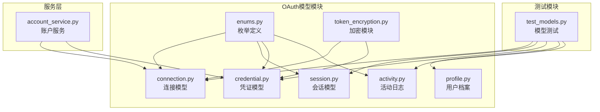
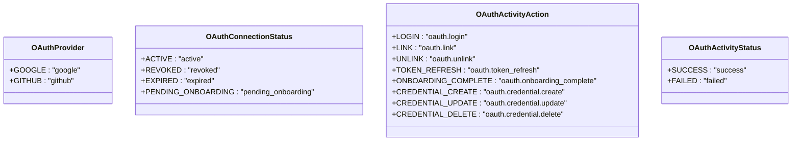
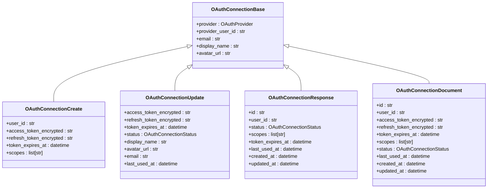
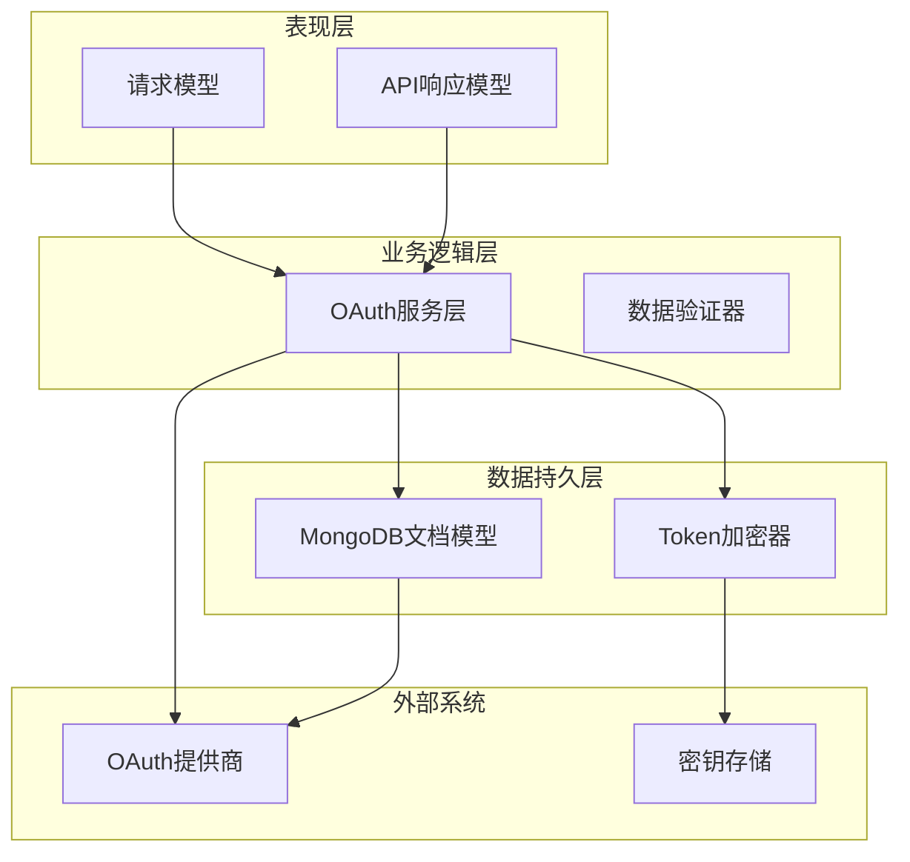
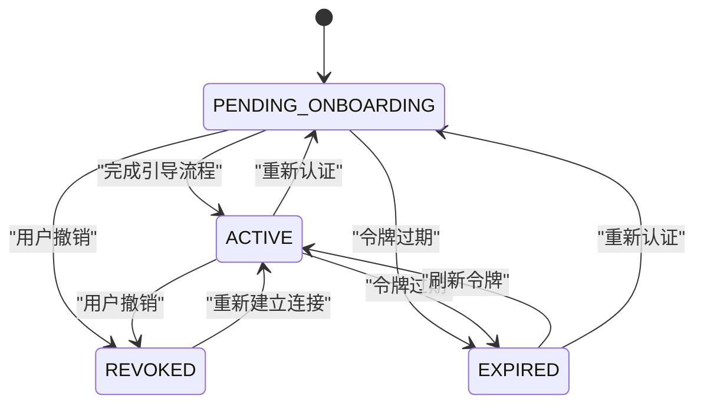
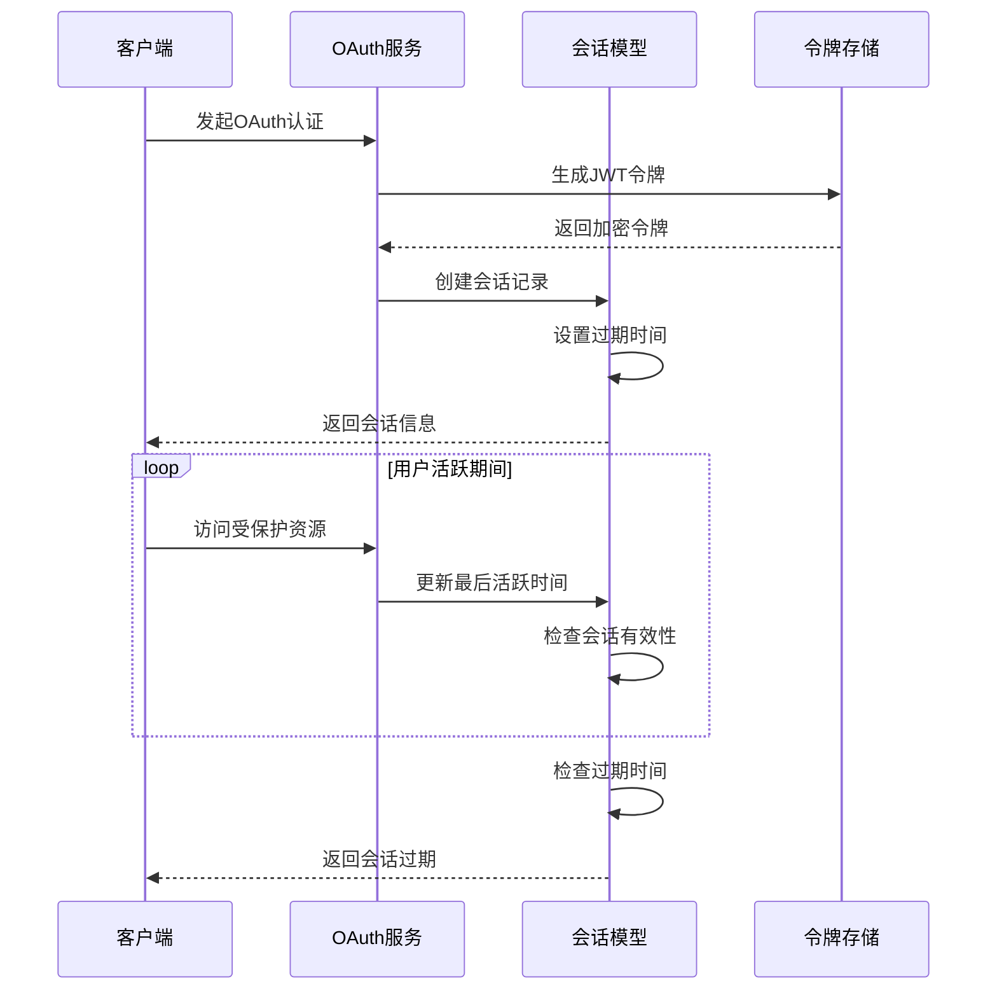
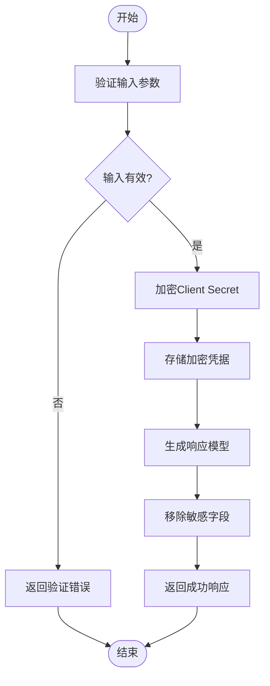
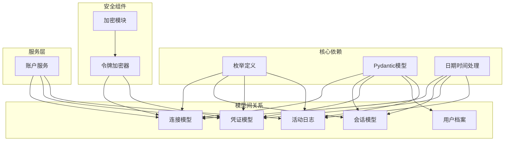
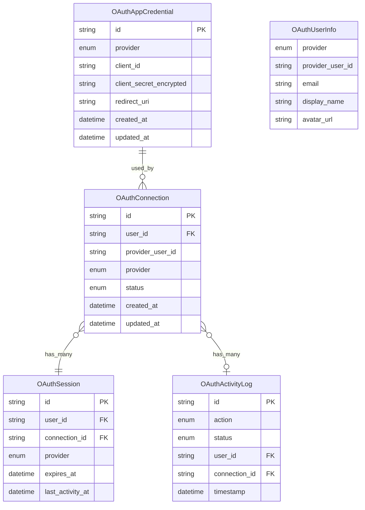
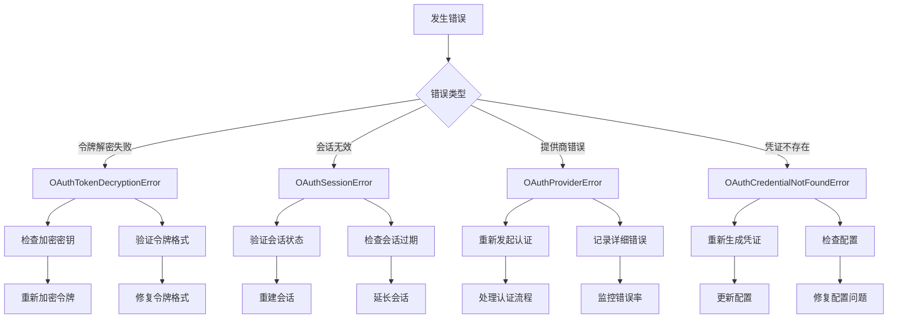

# OAuth数据模型

<cite>
**本文档引用的文件**
- [connection.py](file://tools/flexloop/src/taolib/testing/oauth/models/connection.py)
- [session.py](file://tools/flexloop/src/taolib/testing/oauth/models/session.py)
- [credential.py](file://tools/flexloop/src/taolib/testing/oauth/models/credential.py)
- [profile.py](file://tools/flexloop/src/taolib/testing/oauth/models/profile.py)
- [enums.py](file://tools/flexloop/src/taolib/testing/oauth/models/enums.py)
- [activity.py](file://tools/flexloop/src/taolib/testing/oauth/models/activity.py)
- [token_encryption.py](file://tools/flexloop/src/taolib/testing/oauth/crypto/token_encryption.py)
- [test_models.py](file://tools/flexloop/tests/testing/test_oauth/test_models.py)
- [errors.py](file://tools/flexloop/src/taolib/testing/oauth/errors.py)
- [account_service.py](file://tools/flexloop/src/taolib/testing/oauth/services/account_service.py)
</cite>

## 目录
1. [简介](#简介)
2. [项目结构](#项目结构)
3. [核心组件](#核心组件)
4. [架构概览](#架构概览)
5. [详细组件分析](#详细组件分析)
6. [依赖关系分析](#依赖关系分析)
7. [性能考虑](#性能考虑)
8. [故障排除指南](#故障排除指南)
9. [结论](#结论)

## 简介

本文档提供了DAO Apps项目中OAuth数据模型的全面实体关系文档。该系统实现了完整的OAuth认证流程，包括用户连接管理、会话控制、凭证存储和用户档案管理。

OAuth数据模型采用Pydantic模型设计，确保了数据验证、序列化和API响应格式的一致性。系统支持多种OAuth提供商（Google、GitHub），并提供了完善的安全机制，包括对敏感令牌的加密存储和密钥轮换功能。

## 项目结构

OAuth数据模型位于`tools/flexloop/src/taolib/testing/oauth/models/`目录下，采用模块化设计：

**图表来源**
- [connection.py:1-122](file://tools/flexloop/src/taolib/testing/oauth/models/connection.py#L1-L122)
- [session.py:1-67](file://tools/flexloop/src/taolib/testing/oauth/models/session.py#L1-L67)
- [credential.py:1-105](file://tools/flexloop/src/taolib/testing/oauth/models/credential.py#L1-L105)
- [profile.py:1-41](file://tools/flexloop/src/taolib/testing/oauth/models/profile.py#L1-L41)
- [enums.py:1-45](file://tools/flexloop/src/taolib/testing/oauth/models/enums.py#L1-L45)
- [activity.py:1-65](file://tools/flexloop/src/taolib/testing/oauth/models/activity.py#L1-L65)
- [token_encryption.py:1-86](file://tools/flexloop/src/taolib/testing/oauth/crypto/token_encryption.py#L1-L86)

**章节来源**
- [connection.py:1-122](file://tools/flexloop/src/taolib/testing/oauth/models/connection.py#L1-L122)
- [session.py:1-67](file://tools/flexloop/src/taolib/testing/oauth/models/session.py#L1-L67)
- [credential.py:1-105](file://tools/flexloop/src/taolib/testing/oauth/models/credential.py#L1-L105)
- [profile.py:1-41](file://tools/flexloop/src/taolib/testing/oauth/models/profile.py#L1-L41)
- [enums.py:1-45](file://tools/flexloop/src/taolib/testing/oauth/models/enums.py#L1-L45)
- [activity.py:1-65](file://tools/flexloop/src/taolib/testing/oauth/models/activity.py#L1-L65)
- [token_encryption.py:1-86](file://tools/flexloop/src/taolib/testing/oauth/crypto/token_encryption.py#L1-L86)

## 核心组件

OAuth数据模型包含以下核心组件：

### 枚举类型定义

系统定义了四个主要的枚举类型，确保类型安全和值域约束：

**图表来源**
- [enums.py:9-45](file://tools/flexloop/src/taolib/testing/oauth/models/enums.py#L9-L45)

### 数据模型层次结构

每个核心模型都遵循相同的层次结构模式：

**图表来源**
- [connection.py:14-122](file://tools/flexloop/src/taolib/testing/oauth/models/connection.py#L14-L122)

**章节来源**
- [enums.py:1-45](file://tools/flexloop/src/taolib/testing/oauth/models/enums.py#L1-L45)
- [connection.py:1-122](file://tools/flexloop/src/taolib/testing/oauth/models/connection.py#L1-L122)

## 架构概览

OAuth数据模型采用分层架构设计，确保了清晰的关注点分离和良好的扩展性：

**图表来源**
- [connection.py:77-122](file://tools/flexloop/src/taolib/testing/oauth/models/connection.py#L77-L122)
- [session.py:30-67](file://tools/flexloop/src/taolib/testing/oauth/models/session.py#L30-L67)
- [credential.py:66-105](file://tools/flexloop/src/taolib/testing/oauth/models/credential.py#L66-L105)
- [token_encryption.py:20-86](file://tools/flexloop/src/taolib/testing/oauth/crypto/token_encryption.py#L20-L86)

## 详细组件分析

### 连接模型（OAuthConnection）

连接模型管理用户与第三方OAuth提供商的关联关系：

#### 字段定义和约束

| 字段名 | 类型 | 必填 | 描述 | 默认值 |
|--------|------|------|------|--------|
| provider | OAuthProvider | 是 | OAuth提供商类型 | - |
| provider_user_id | str | 是 | 提供商侧用户ID | - |
| email | str | 否 | 用户邮箱地址 | None |
| display_name | str | 否 | 显示名称 | "" |
| avatar_url | str | 否 | 头像URL | "" |
| user_id | str | 是 | 本地用户ID | - |
| access_token_encrypted | str | 是 | 加密的访问令牌 | - |
| refresh_token_encrypted | str | 否 | 加密的刷新令牌 | None |
| token_expires_at | datetime | 否 | 令牌过期时间 | None |
| scopes | list[str] | 否 | 授权范围列表 | [] |
| status | OAuthConnectionStatus | 否 | 连接状态 | ACTIVE |
| last_used_at | datetime | 否 | 最后使用时间 | None |
| created_at | datetime | 否 | 创建时间 | 当前UTC时间 |
| updated_at | datetime | 否 | 更新时间 | 当前UTC时间 |

#### 连接状态管理

**图表来源**
- [enums.py:16-23](file://tools/flexloop/src/taolib/testing/oauth/models/enums.py#L16-L23)

#### 数据验证规则

连接模型实现了严格的数据验证规则：
- 所有必填字段必须提供有效值
- 令牌字段使用加密存储，防止明文泄露
- 状态字段限制在预定义的枚举值范围内
- 时间戳字段自动管理创建和更新时间

**章节来源**
- [connection.py:14-122](file://tools/flexloop/src/taolib/testing/oauth/models/connection.py#L14-L122)
- [enums.py:16-23](file://tools/flexloop/src/taolib/testing/oauth/models/enums.py#L16-L23)

### 会话模型（OAuthSession）

会话模型管理用户的认证会话状态和生命周期：

#### 字段定义和约束

| 字段名 | 类型 | 必填 | 描述 | 默认值 |
|--------|------|------|------|--------|
| id | str | 是 | 会话ID（UUID） | - |
| user_id | str | 是 | 用户ID | - |
| provider | OAuthProvider | 是 | OAuth提供商 | - |
| connection_id | str | 是 | 关联的OAuth连接ID | - |
| jwt_access_token | str | 是 | JWT访问令牌 | - |
| jwt_refresh_token | str | 是 | JWT刷新令牌 | - |
| ip_address | str | 否 | 客户端IP地址 | "" |
| user_agent | str | 否 | 客户端User-Agent | "" |
| is_active | bool | 否 | 会话是否活跃 | True |
| created_at | datetime | 否 | 创建时间 | 当前UTC时间 |
| expires_at | datetime | 是 | 过期时间 | - |
| last_activity_at | datetime | 否 | 最后活跃时间 | 当前UTC时间 |

#### 会话生命周期管理

**图表来源**
- [session.py:14-67](file://tools/flexloop/src/taolib/testing/oauth/models/session.py#L14-L67)

**章节来源**
- [session.py:1-67](file://tools/flexloop/src/taolib/testing/oauth/models/session.py#L1-L67)

### 凭证模型（OAuthAppCredential）

凭证模型管理OAuth应用的客户端凭据：

#### 字段定义和约束

| 字段名 | 类型 | 必填 | 描述 | 默认值 |
|--------|------|------|------|--------|
| provider | OAuthProvider | 是 | OAuth提供商 | - |
| client_id | str | 是 | Client ID | - |
| client_secret_encrypted | str | 是 | 加密的Client Secret | - |
| display_name | str | 否 | 人类可读标签 | "" |
| enabled | bool | 否 | 是否启用 | True |
| allowed_scopes | list[str] | 否 | 允许的授权范围 | [] |
| redirect_uri | str | 是 | 回调URI | - |
| created_by | str | 否 | 创建者用户ID | "" |
| created_at | datetime | 否 | 创建时间 | 当前UTC时间 |
| updated_at | datetime | 否 | 更新时间 | 当前UTC时间 |

#### 安全令牌结构

凭证模型采用了多层安全保护机制：

**图表来源**
- [credential.py:14-105](file://tools/flexloop/src/taolib/testing/oauth/models/credential.py#L14-L105)

**章节来源**
- [credential.py:1-105](file://tools/flexloop/src/taolib/testing/oauth/models/credential.py#L1-L105)

### 用户档案模型（OAuthUserInfo & OnboardingData）

用户档案模型提供了标准化的用户信息映射：

#### OAuthUserInfo模型

| 字段名 | 类型 | 必填 | 描述 | 默认值 |
|--------|------|------|------|--------|
| provider | OAuthProvider | 是 | OAuth提供商 | - |
| provider_user_id | str | 是 | 提供商侧用户ID | - |
| email | str | 否 | 邮箱地址 | None |
| display_name | str | 否 | 显示名称 | "" |
| avatar_url | str | 否 | 头像URL | "" |
| raw_data | dict[str, Any] | 否 | 提供商原始响应数据 | {} |

#### OnboardingData模型

| 字段名 | 类型 | 必填 | 描述 | 长度限制 |
|--------|------|------|------|----------|
| username | str | 是 | 用户名 | 3-50字符 |
| display_name | str | 否 | 显示名称 | 最大255字符 |

**章节来源**
- [profile.py:1-41](file://tools/flexloop/src/taolib/testing/oauth/models/profile.py#L1-L41)

### 活动日志模型（OAuthActivityLog）

活动日志模型记录OAuth系统的所有关键操作：

| 字段名 | 类型 | 必填 | 描述 | 默认值 |
|--------|------|------|------|--------|
| id | str | 是 | 日志ID | - |
| action | OAuthActivityAction | 是 | 操作类型 | - |
| status | OAuthActivityStatus | 是 | 操作状态 | - |
| provider | OAuthProvider | 否 | OAuth提供商 | None |
| user_id | str | 否 | 用户ID | None |
| connection_id | str | 否 | 连接ID | None |
| ip_address | str | 否 | 客户端IP地址 | "" |
| user_agent | str | 否 | 客户端User-Agent | "" |
| metadata | dict[str, Any] | 否 | 额外上下文 | {} |
| timestamp | datetime | 否 | 时间戳 | 当前UTC时间 |

**章节来源**
- [activity.py:1-65](file://tools/flexloop/src/taolib/testing/oauth/models/activity.py#L1-L65)

## 依赖关系分析

OAuth数据模型之间的依赖关系体现了清晰的分层架构：

**图表来源**
- [connection.py:11-122](file://tools/flexloop/src/taolib/testing/oauth/models/connection.py#L11-L122)
- [session.py:11-67](file://tools/flexloop/src/taolib/testing/oauth/models/session.py#L11-L67)
- [credential.py:11-105](file://tools/flexloop/src/taolib/testing/oauth/models/credential.py#L11-L105)
- [activity.py:11-65](file://tools/flexloop/src/taolib/testing/oauth/models/activity.py#L11-L65)
- [token_encryption.py:20-86](file://tools/flexloop/src/taolib/testing/oauth/crypto/token_encryption.py#L20-L86)

### 外键约束和关系映射

虽然使用的是MongoDB文档数据库，但通过应用层实现逻辑外键约束：

**图表来源**
- [connection.py:80-122](file://tools/flexloop/src/taolib/testing/oauth/models/connection.py#L80-L122)
- [session.py:33-67](file://tools/flexloop/src/taolib/testing/oauth/models/session.py#L33-L67)
- [credential.py:69-105](file://tools/flexloop/src/taolib/testing/oauth/models/credential.py#L69-L105)
- [activity.py:34-65](file://tools/flexloop/src/taolib/testing/oauth/models/activity.py#L34-L65)

**章节来源**
- [connection.py:77-122](file://tools/flexloop/src/taolib/testing/oauth/models/connection.py#L77-L122)
- [session.py:30-67](file://tools/flexloop/src/taolib/testing/oauth/models/session.py#L30-L67)
- [credential.py:66-105](file://tools/flexloop/src/taolib/testing/oauth/models/credential.py#L66-L105)
- [activity.py:31-65](file://tools/flexloop/src/taolib/testing/oauth/models/activity.py#L31-L65)

## 性能考虑

### 数据模型优化策略

1. **字段选择性序列化**：响应模型自动移除敏感字段，减少网络传输开销
2. **延迟加载**：非关键字段在需要时才进行数据库查询
3. **缓存策略**：频繁访问的用户信息可以缓存到Redis中
4. **索引优化**：为常用查询字段建立适当的数据库索引

### 加密性能优化

- 使用对称加密算法（Fernet）确保加密解密性能
- 支持密钥轮换，避免长期使用单一密钥
- 批量加密操作时复用加密器实例

## 故障排除指南

### 常见错误类型和解决方案

**图表来源**
- [errors.py:7-113](file://tools/flexloop/src/taolib/testing/oauth/errors.py#L7-L113)

### 错误处理最佳实践

1. **分层错误处理**：不同层级捕获和处理特定类型的错误
2. **错误日志记录**：详细的错误上下文和堆栈跟踪
3. **用户友好提示**：向用户显示友好的错误信息
4. **自动恢复机制**：支持重试和自动恢复的操作

**章节来源**
- [errors.py:1-113](file://tools/flexloop/src/taolib/testing/oauth/errors.py#L1-L113)

## 结论

OAuth数据模型提供了完整、安全且可扩展的身份认证解决方案。通过精心设计的模型层次结构、严格的验证规则和完善的错误处理机制，系统能够可靠地管理用户身份认证的各个方面。

关键特性包括：
- **安全性**：敏感令牌的加密存储和密钥轮换
- **可扩展性**：模块化的架构设计支持新提供商的添加
- **可靠性**：完善的错误处理和监控机制
- **易用性**：清晰的API接口和响应格式

该模型为DAO Apps项目提供了坚实的基础，支持未来的功能扩展和性能优化需求。