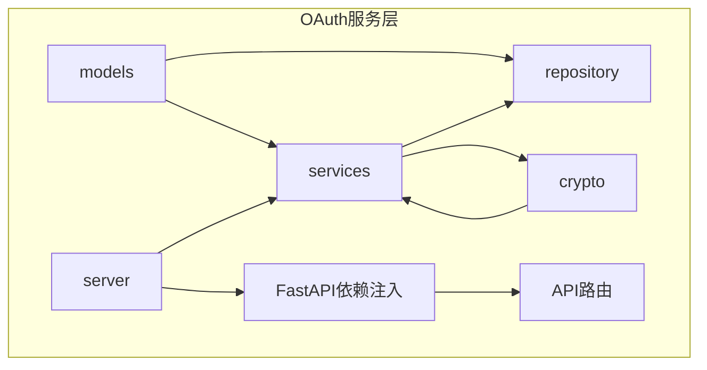
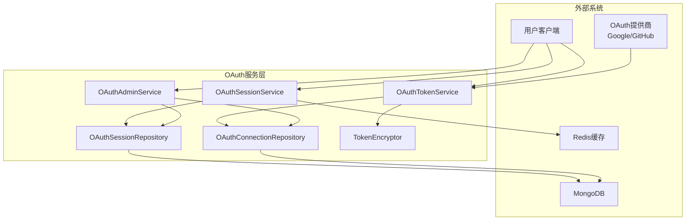
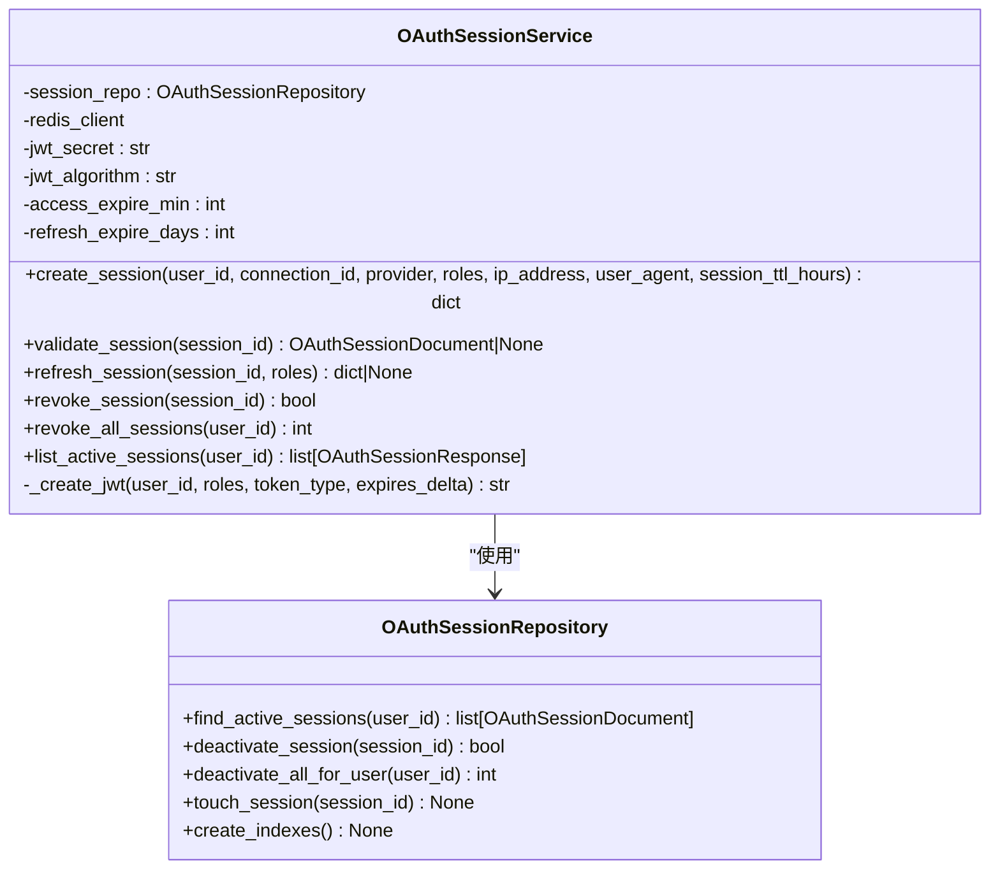
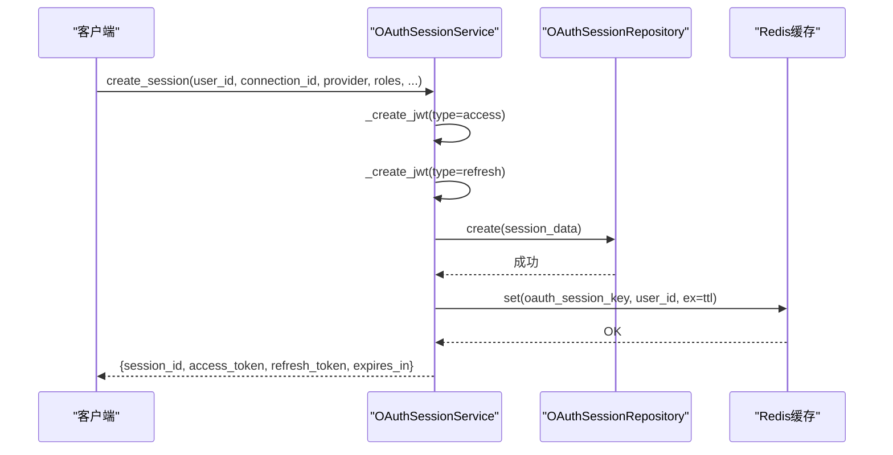
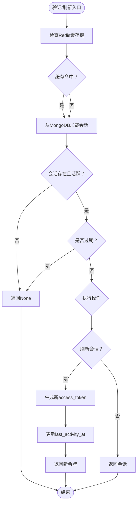
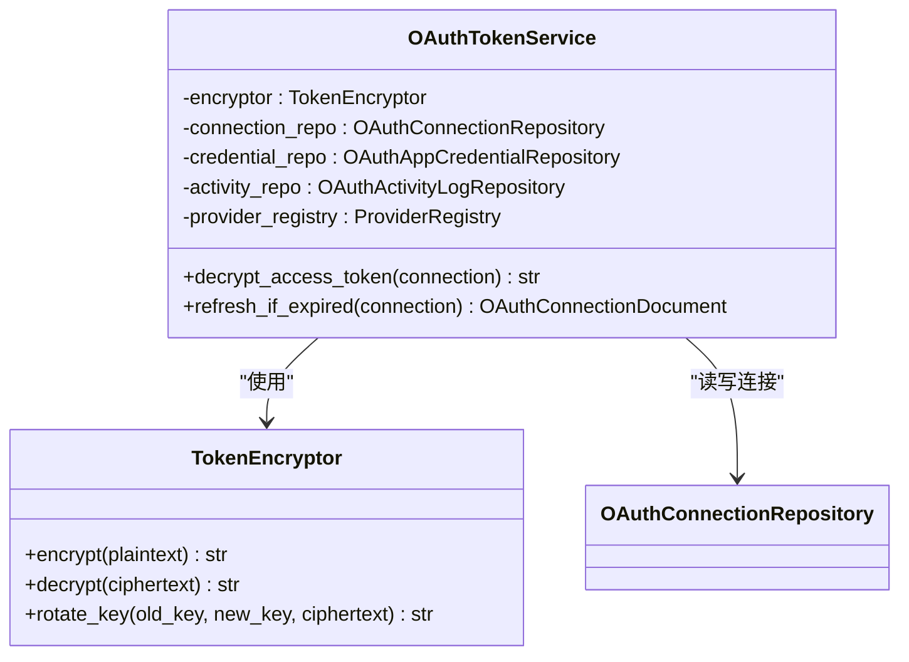
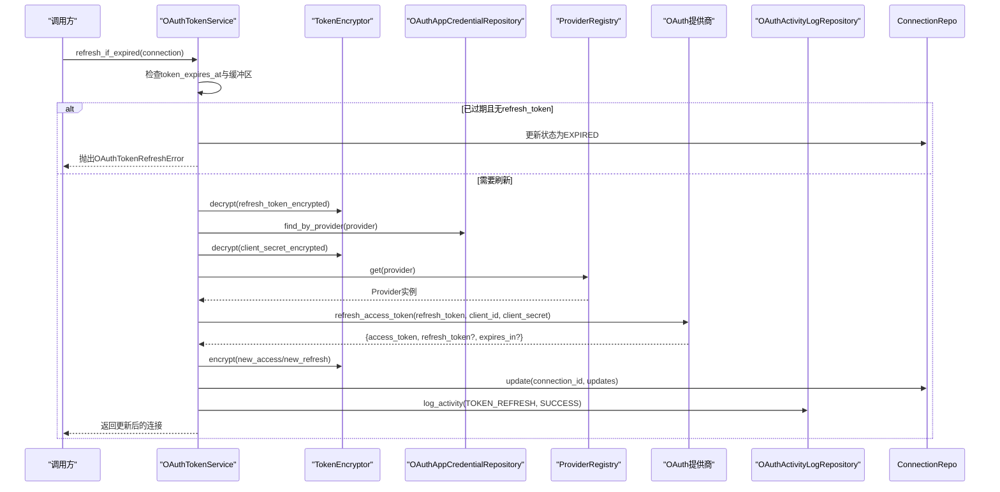
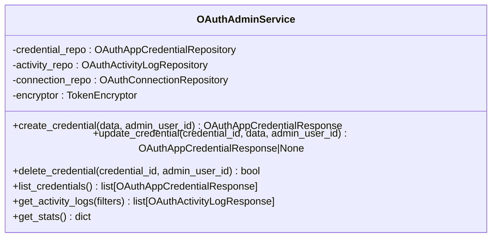
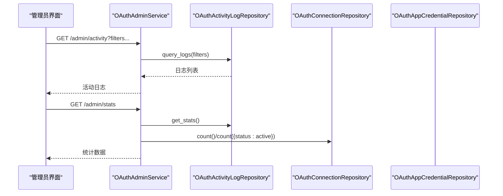
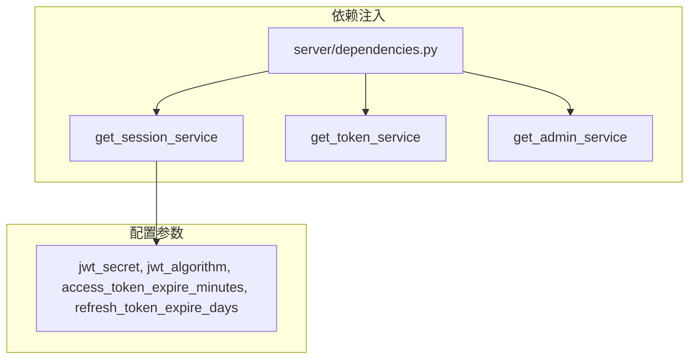

# OAuth服务层

<cite>
**本文档引用的文件**
- [oauth/__init__.py](file://tools/flexloop/src/taolib/testing/oauth/__init__.py)
- [oauth/models/enums.py](file://tools/flexloop/src/taolib/testing/oauth/models/enums.py)
- [oauth/models/profile.py](file://tools/flexloop/src/taolib/testing/oauth/models/profile.py)
- [oauth/services/session_service.py](file://tools/flexloop/src/taolib/testing/oauth/services/session_service.py)
- [oauth/services/token_service.py](file://tools/flexloop/src/taolib/testing/oauth/services/token_service.py)
- [oauth/services/admin_service.py](file://tools/flexloop/src/taolib/testing/oauth/services/admin_service.py)
- [oauth/crypto/token_encryption.py](file://tools/flexloop/src/taolib/testing/oauth/crypto/token_encryption.py)
- [oauth/repository/session_repo.py](file://tools/flexloop/src/taolib/testing/oauth/repository/session_repo.py)
- [oauth/repository/connection_repo.py](file://tools/flexloop/src/taolib/testing/oauth/repository/connection_repo.py)
- [oauth/server/dependencies.py](file://tools/flexloop/src/taolib/testing/oauth/server/dependencies.py)
- [oauth/server/api/admin.py](file://tools/flexloop/src/taolib/testing/oauth/server/api/admin.py)
- [test_oauth/test_repository/test_repos.py](file://tools/flexloop/tests/testing/test_oauth/test_repository/test_repos.py)
- [test_auth/test_tokens.py](file://tools/flexloop/tests/testing/test_auth/test_tokens.py)
</cite>

## 目录
1. [简介](#简介)
2. [项目结构](#项目结构)
3. [核心组件](#核心组件)
4. [架构概览](#架构概览)
5. [详细组件分析](#详细组件分析)
6. [依赖关系分析](#依赖关系分析)
7. [性能考虑](#性能考虑)
8. [故障排除指南](#故障排除指南)
9. [结论](#结论)
10. [附录](#附录)

## 简介
本文件为DAO应用项目中的OAuth服务层技术文档，涵盖账户服务、会话服务、令牌服务与管理员服务的完整实现。系统支持Google、GitHub等OAuth2提供商，提供完整的授权码流程、账户关联、Token管理与管理面板。核心特性包括：
- 账户服务：用户注册、登录与信息管理，支持用户档案同步与权限分配
- 会话服务：会话创建、维护与销毁，包含会话状态管理与超时处理
- 令牌服务：JWT生成、验证与刷新，支持令牌加密与有效期管理
- 管理员服务：用户管理、活动监控与安全审计
- 服务协作：清晰的依赖注入与数据流转
- 异常处理：完善的错误分类与恢复策略
- 扩展性：可插拔的提供商注册表与配置中心集成

## 项目结构
OAuth服务层位于tools/flexloop/src/taolib/testing/oauth目录下，采用分层架构：
- models：数据模型与枚举定义
- services：业务服务层（会话、令牌、管理）
- repository：MongoDB数据访问层
- crypto：对称加密模块
- server：FastAPI依赖注入与API路由
- tests：单元测试与集成测试

**图表来源**
- [oauth/__init__.py:1-73](file://tools/flexloop/src/taolib/testing/oauth/__init__.py#L1-L73)
- [oauth/server/dependencies.py:160-201](file://tools/flexloop/src/taolib/testing/oauth/server/dependencies.py#L160-L201)

**章节来源**
- [oauth/__init__.py:1-73](file://tools/flexloop/src/taolib/testing/oauth/__init__.py#L1-L73)

## 核心组件
- OAuthProvider：支持的OAuth提供商枚举（google、github）
- OAuthConnectionStatus：连接状态枚举（active、revoked、expired、pending_onboarding）
- OAuthActivityAction：活动操作类型枚举（登录、关联、取消关联、令牌刷新、引导完成、凭证创建/更新/删除）
- OAuthActivityStatus：活动状态枚举（success、failed）
- OAuthUserInfo：标准化的用户信息模型
- OnboardingData：首次登录引导数据模型
- TokenEncryptor：基于Fernet的对称加密器

**章节来源**
- [oauth/models/enums.py:9-45](file://tools/flexloop/src/taolib/testing/oauth/models/enums.py#L9-L45)
- [oauth/models/profile.py:13-41](file://tools/flexloop/src/taolib/testing/oauth/models/profile.py#L13-L41)
- [oauth/crypto/token_encryption.py:20-86](file://tools/flexloop/src/taolib/testing/oauth/crypto/token_encryption.py#L20-L86)

## 架构概览
OAuth服务层采用依赖注入与仓储模式，结合Redis缓存与MongoDB持久化，实现高性能的会话与令牌管理。

**图表来源**
- [oauth/services/session_service.py:15-44](file://tools/flexloop/src/taolib/testing/oauth/services/session_service.py#L15-L44)
- [oauth/services/token_service.py:25-51](file://tools/flexloop/src/taolib/testing/oauth/services/token_service.py#L25-L51)
- [oauth/services/admin_service.py:22-44](file://tools/flexloop/src/taolib/testing/oauth/services/admin_service.py#L22-L44)
- [oauth/repository/session_repo.py:13-22](file://tools/flexloop/src/taolib/testing/oauth/repository/session_repo.py#L13-L22)
- [oauth/repository/connection_repo.py:12-21](file://tools/flexloop/src/taolib/testing/oauth/repository/connection_repo.py#L12-L21)
- [oauth/crypto/token_encryption.py:20-36](file://tools/flexloop/src/taolib/testing/oauth/crypto/token_encryption.py#L20-L36)

## 详细组件分析

### 会话服务（OAuthSessionService）
负责跨服务OAuth会话的创建、验证、刷新与撤销，集成JWT生成与Redis缓存。

**图表来源**
- [oauth/services/session_service.py:15-238](file://tools/flexloop/src/taolib/testing/oauth/services/session_service.py#L15-L238)
- [oauth/repository/session_repo.py:13-92](file://tools/flexloop/src/taolib/testing/oauth/repository/session_repo.py#L13-L92)

会话创建流程（序列图）

**图表来源**
- [oauth/services/session_service.py:72-138](file://tools/flexloop/src/taolib/testing/oauth/services/session_service.py#L72-L138)
- [oauth/repository/session_repo.py:24-42](file://tools/flexloop/src/taolib/testing/oauth/repository/session_repo.py#L24-L42)

会话验证与刷新流程（流程图）

**图表来源**
- [oauth/services/session_service.py:140-207](file://tools/flexloop/src/taolib/testing/oauth/services/session_service.py#L140-L207)

**章节来源**
- [oauth/services/session_service.py:15-238](file://tools/flexloop/src/taolib/testing/oauth/services/session_service.py#L15-L238)
- [oauth/repository/session_repo.py:13-92](file://tools/flexloop/src/taolib/testing/oauth/repository/session_repo.py#L13-L92)
- [test_oauth/test_repository/test_repos.py:184-220](file://tools/flexloop/tests/testing/test_oauth/test_repository/test_repos.py#L184-L220)

### 令牌服务（OAuthTokenService）
管理OAuth令牌的加密存储与自动刷新，支持提供商特定的刷新流程。

**图表来源**
- [oauth/services/token_service.py:25-157](file://tools/flexloop/src/taolib/testing/oauth/services/token_service.py#L25-L157)
- [oauth/crypto/token_encryption.py:20-86](file://tools/flexloop/src/taolib/testing/oauth/crypto/token_encryption.py#L20-L86)

令牌刷新流程（序列图）

**图表来源**
- [oauth/services/token_service.py:63-155](file://tools/flexloop/src/taolib/testing/oauth/services/token_service.py#L63-L155)

**章节来源**
- [oauth/services/token_service.py:25-157](file://tools/flexloop/src/taolib/testing/oauth/services/token_service.py#L25-L157)
- [oauth/crypto/token_encryption.py:20-86](file://tools/flexloop/src/taolib/testing/oauth/crypto/token_encryption.py#L20-L86)

### 管理员服务（OAuthAdminService）
提供凭证管理、活动日志查询与连接统计功能，支持安全审计。

**图表来源**
- [oauth/services/admin_service.py:22-220](file://tools/flexloop/src/taolib/testing/oauth/services/admin_service.py#L22-L220)

管理员API接口（序列图）

**图表来源**
- [oauth/server/api/admin.py:123-176](file://tools/flexloop/src/taolib/testing/oauth/server/api/admin.py#L123-L176)
- [oauth/services/admin_service.py:164-217](file://tools/flexloop/src/taolib/testing/oauth/services/admin_service.py#L164-L217)

**章节来源**
- [oauth/services/admin_service.py:22-220](file://tools/flexloop/src/taolib/testing/oauth/services/admin_service.py#L22-L220)
- [oauth/server/api/admin.py:123-176](file://tools/flexloop/src/taolib/testing/oauth/server/api/admin.py#L123-L176)

### 数据模型与仓储
- OAuthUserInfo：标准化用户信息，包含提供商、提供商用户ID、邮箱、显示名、头像URL与原始数据
- OnboardingData：首次登录引导数据，包含用户名与可选显示名
- OAuthConnectionRepository：按用户与提供商查找连接，统计活跃连接数
- OAuthSessionRepository：管理会话生命周期，支持活跃会话查询与索引优化

**章节来源**
- [oauth/models/profile.py:13-41](file://tools/flexloop/src/taolib/testing/oauth/models/profile.py#L13-L41)
- [oauth/repository/connection_repo.py:12-105](file://tools/flexloop/src/taolib/testing/oauth/repository/connection_repo.py#L12-L105)
- [oauth/repository/session_repo.py:13-92](file://tools/flexloop/src/taolib/testing/oauth/repository/session_repo.py#L13-L92)

## 依赖关系分析
服务层通过FastAPI依赖注入提供统一的构造方式，确保配置与外部依赖的一致性。

**图表来源**
- [oauth/server/dependencies.py:160-201](file://tools/flexloop/src/taolib/testing/oauth/server/dependencies.py#L160-L201)

**章节来源**
- [oauth/server/dependencies.py:160-201](file://tools/flexloop/src/taolib/testing/oauth/server/dependencies.py#L160-L201)

## 性能考虑
- 缓存策略：会话验证优先使用Redis缓存，减少数据库压力；会话创建后设置TTL，避免内存泄漏
- 索引优化：会话仓储在user_id、expires_at(expireAfterSeconds)、(is_active,user_id)上建立索引；连接仓储在(user_id,provider)、(provider,provider_user_id)上建立唯一索引
- 刷新策略：令牌在过期前5分钟自动刷新，降低请求失败率
- 并发控制：Redis原子操作保证会话撤销与缓存清理一致性

**章节来源**
- [oauth/repository/session_repo.py:85-89](file://tools/flexloop/src/taolib/testing/oauth/repository/session_repo.py#L85-L89)
- [oauth/repository/connection_repo.py:93-103](file://tools/flexloop/src/taolib/testing/oauth/repository/connection_repo.py#L93-L103)
- [oauth/services/token_service.py:22](file://tools/flexloop/src/taolib/testing/oauth/services/token_service.py#L22)

## 故障排除指南
常见异常与处理策略：
- OAuthTokenDecryptionError：令牌解密失败，检查加密密钥与密文完整性
- OAuthTokenRefreshError：令牌刷新失败，检查提供商支持情况与凭据有效性
- OAuthSessionError：会话验证失败，检查Redis连通性与会话状态
- OAuthProviderNotRegisteredError：提供商未注册，检查ProviderRegistry配置
- OAuthAlreadyLinkedError/OAuthCannotUnlinkError：账户关联状态冲突，检查用户已有连接

测试验证要点：
- 会话激活/停用：验证find_active_sessions与deactivate_session行为
- 令牌兼容性：验证旧版令牌的向后兼容解析

**章节来源**
- [oauth/crypto/token_encryption.py:57-63](file://tools/flexloop/src/taolib/testing/oauth/crypto/token_encryption.py#L57-L63)
- [test_oauth/test_repository/test_repos.py:184-220](file://tools/flexloop/tests/testing/test_oauth/test_repository/test_repos.py#L184-L220)
- [test_auth/test_tokens.py:204-224](file://tools/flexloop/tests/testing/test_auth/test_tokens.py#L204-L224)

## 结论
OAuth服务层通过清晰的分层设计与依赖注入，提供了完整的第三方登录与会话管理能力。其核心优势包括：
- 完整的OAuth2流程支持与可扩展的提供商注册表
- 高性能的会话与令牌管理，结合Redis缓存与MongoDB索引优化
- 完善的安全机制，包括对称加密存储与审计日志
- 友好的管理界面与API，便于运维与监控

## 附录

### 服务间协作模式
- 依赖注入：通过FastAPI依赖工厂统一构造服务实例，确保配置一致性
- 数据流转：会话服务负责JWT生成与缓存，令牌服务负责加密存储与刷新，管理员服务负责凭证与审计
- 错误传播：服务层抛出明确的OAuth异常，便于上层统一处理

**章节来源**
- [oauth/server/dependencies.py:160-201](file://tools/flexloop/src/taolib/testing/oauth/server/dependencies.py#L160-L201)

### 自定义配置选项
- JWT配置：jwt_secret、jwt_algorithm、access_token_expire_minutes、refresh_token_expire_days
- 会话配置：session_ttl_hours（会话有效期）
- 令牌刷新：REFRESH_BUFFER_MINUTES（刷新缓冲时间）

**章节来源**
- [oauth/services/session_service.py:29-44](file://tools/flexloop/src/taolib/testing/oauth/services/session_service.py#L29-L44)
- [oauth/services/token_service.py:22](file://tools/flexloop/src/taolib/testing/oauth/services/token_service.py#L22)