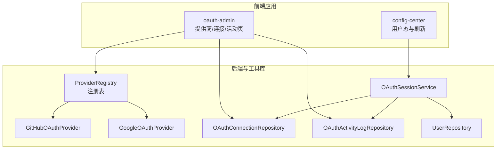
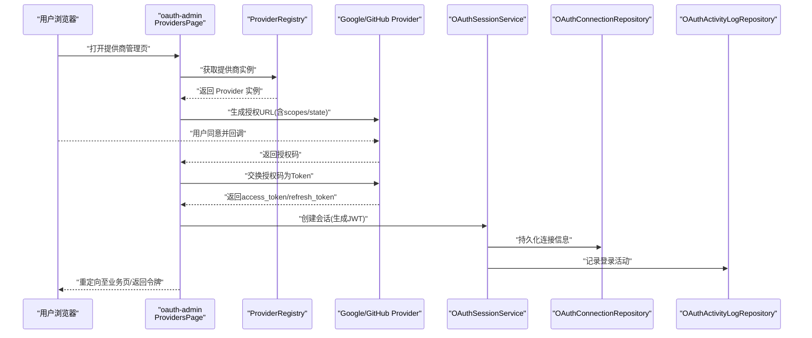
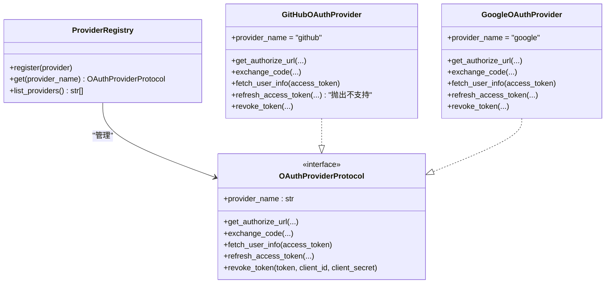
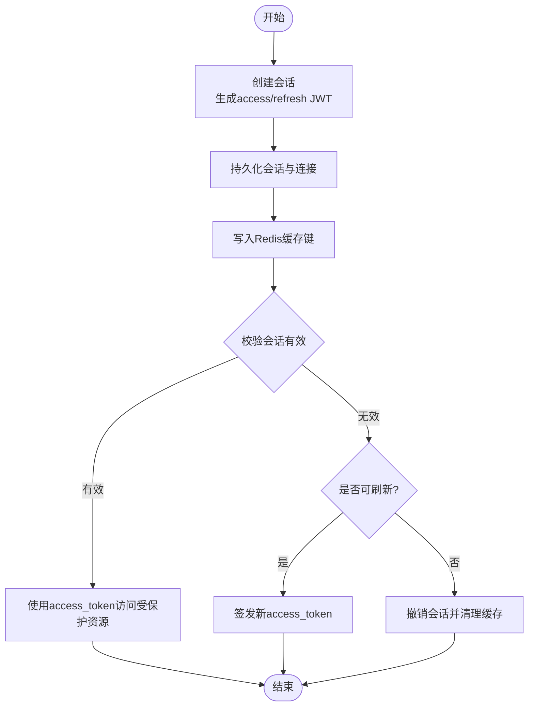
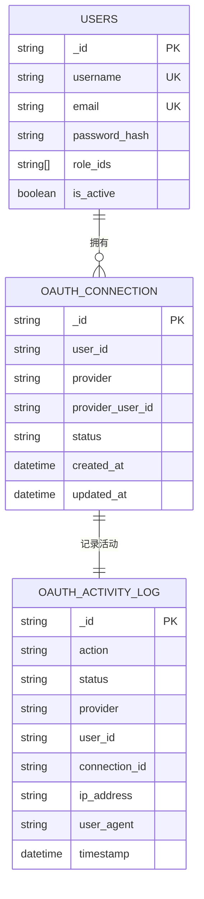
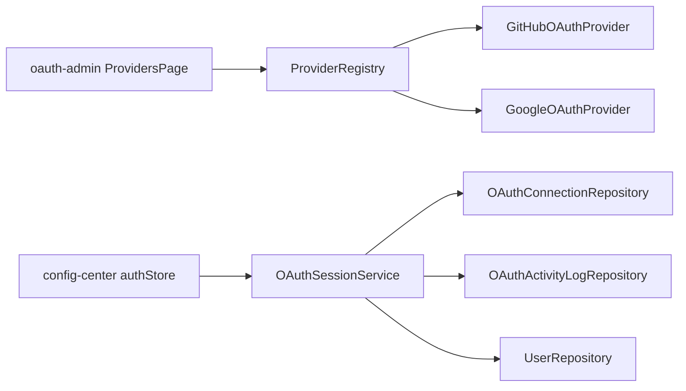

# OAuth认证系统

<cite>
**本文引用的文件**
- [apps/oauth-admin/src/pages/ProvidersPage.tsx](file://apps/oauth-admin/src/pages/ProvidersPage.tsx)
- [apps/oauth-admin/src/pages/ConnectionsPage.tsx](file://apps/oauth-admin/src/pages/ConnectionsPage.tsx)
- [apps/oauth-admin/src/pages/ActivityPage.tsx](file://apps/oauth-admin/src/pages/ActivityPage.tsx)
- [tools/flexloop/src/taolib/testing/oauth/providers/github.py](file://tools/flexloop/src/taolib/testing/oauth/providers/github.py)
- [tools/flexloop/src/taolib/testing/oauth/providers/google.py](file://tools/flexloop/src/taolib/testing/oauth/providers/google.py)
- [tools/flexloop/src/taolib/testing/oauth/providers/__init__.py](file://tools/flexloop/src/taolib/testing/oauth/providers/__init__.py)
- [tools/flexloop/src/taolib/testing/oauth/services/session_service.py](file://tools/flexloop/src/taolib/testing/oauth/services/session_service.py)
- [tools/flexloop/src/taolib/testing/oauth/repository/connection_repo.py](file://tools/flexloop/src/taolib/testing/oauth/repository/connection_repo.py)
- [tools/flexloop/src/taolib/testing/oauth/repository/activity_repo.py](file://tools/flexloop/src/taolib/testing/oauth/repository/activity_repo.py)
- [tools/flexloop/src/taolib/testing/config_center/repository/user_repo.py](file://tools/flexloop/src/taolib/testing/config_center/repository/user_repo.py)
- [apps/config-center/src/store/authStore.ts](file://apps/config-center/src/store/authStore.ts)
</cite>

## 目录
1. [简介](#简介)
2. [项目结构](#项目结构)
3. [核心组件](#核心组件)
4. [架构总览](#架构总览)
5. [详细组件分析](#详细组件分析)
6. [依赖关系分析](#依赖关系分析)
7. [性能考虑](#性能考虑)
8. [故障排查指南](#故障排查指南)
9. [结论](#结论)
10. [附录](#附录)

## 简介
本文件面向OAuth认证系统的技术文档，覆盖架构设计、认证流程、令牌管理、权限控制、第三方提供商集成（GitHub、Google）、服务层实现（会话管理、令牌刷新、用户信息同步）、仓库模式在认证数据管理中的应用（连接信息、用户档案、活动记录），以及安全最佳实践与用户体验优化策略。文档同时提供可直接参考的配置示例与集成建议。

## 项目结构
该代码库采用多应用与工具库分离的组织方式：
- 前端管理应用：oauth-admin 提供提供商、连接与活动日志的可视化管理界面
- 工具库与核心逻辑：flexloop 中的 taolib.testing.oauth 提供OAuth提供商协议、会话服务、仓库层等核心能力
- 配置中心前端：config-center 展示了基于JWT的会话与刷新机制在前端的状态管理

图表来源
- [apps/oauth-admin/src/pages/ProvidersPage.tsx:1-293](file://apps/oauth-admin/src/pages/ProvidersPage.tsx#L1-L293)
- [apps/oauth-admin/src/pages/ConnectionsPage.tsx:1-32](file://apps/oauth-admin/src/pages/ConnectionsPage.tsx#L1-L32)
- [apps/oauth-admin/src/pages/ActivityPage.tsx:1-160](file://apps/oauth-admin/src/pages/ActivityPage.tsx#L1-L160)
- [tools/flexloop/src/taolib/testing/oauth/providers/__init__.py:15-56](file://tools/flexloop/src/taolib/testing/oauth/providers/__init__.py#L15-L56)
- [tools/flexloop/src/taolib/testing/oauth/providers/github.py:27-205](file://tools/flexloop/src/taolib/testing/oauth/providers/github.py#L27-L205)
- [tools/flexloop/src/taolib/testing/oauth/providers/google.py:23-186](file://tools/flexloop/src/taolib/testing/oauth/providers/google.py#L23-L186)
- [tools/flexloop/src/taolib/testing/oauth/services/session_service.py:15-238](file://tools/flexloop/src/taolib/testing/oauth/services/session_service.py#L15-L238)
- [tools/flexloop/src/taolib/testing/oauth/repository/connection_repo.py:12-105](file://tools/flexloop/src/taolib/testing/oauth/repository/connection_repo.py#L12-L105)
- [tools/flexloop/src/taolib/testing/oauth/repository/activity_repo.py:15-145](file://tools/flexloop/src/taolib/testing/oauth/repository/activity_repo.py#L15-L145)
- [tools/flexloop/src/taolib/testing/config_center/repository/user_repo.py:12-138](file://tools/flexloop/src/taolib/testing/config_center/repository/user_repo.py#L12-L138)

章节来源
- [apps/oauth-admin/src/pages/ProvidersPage.tsx:1-293](file://apps/oauth-admin/src/pages/ProvidersPage.tsx#L1-L293)
- [apps/oauth-admin/src/pages/ConnectionsPage.tsx:1-32](file://apps/oauth-admin/src/pages/ConnectionsPage.tsx#L1-L32)
- [apps/oauth-admin/src/pages/ActivityPage.tsx:1-160](file://apps/oauth-admin/src/pages/ActivityPage.tsx#L1-L160)
- [tools/flexloop/src/taolib/testing/oauth/providers/__init__.py:15-56](file://tools/flexloop/src/taolib/testing/oauth/providers/__init__.py#L15-L56)

## 核心组件
- 提供商注册与适配
  - ProviderRegistry：集中注册与查找OAuth提供商，内置Google与GitHub
  - GitHubOAuthProvider / GoogleOAuthProvider：分别实现各自授权URL生成、授权码交换、用户信息获取、令牌刷新与撤销
- 会话服务
  - OAuthSessionService：负责JWT生成、会话创建与校验、令牌刷新、会话撤销与列举
- 仓库层
  - OAuthConnectionRepository：用户-提供商连接的增删查改与索引
  - OAuthActivityLogRepository：活动日志的写入、查询与统计
  - UserRepository：用户文档与角色查询（与会话服务配合）
- 前端管理
  - ProvidersPage：提供商凭证的增删改查与启用/禁用
  - ConnectionsPage：连接管理入口
  - ActivityPage：活动日志筛选与展示
  - authStore：前端JWT刷新与登出逻辑

章节来源
- [tools/flexloop/src/taolib/testing/oauth/providers/__init__.py:15-56](file://tools/flexloop/src/taolib/testing/oauth/providers/__init__.py#L15-L56)
- [tools/flexloop/src/taolib/testing/oauth/providers/github.py:27-205](file://tools/flexloop/src/taolib/testing/oauth/providers/github.py#L27-L205)
- [tools/flexloop/src/taolib/testing/oauth/providers/google.py:23-186](file://tools/flexloop/src/taolib/testing/oauth/providers/google.py#L23-L186)
- [tools/flexloop/src/taolib/testing/oauth/services/session_service.py:15-238](file://tools/flexloop/src/taolib/testing/oauth/services/session_service.py#L15-L238)
- [tools/flexloop/src/taolib/testing/oauth/repository/connection_repo.py:12-105](file://tools/flexloop/src/taolib/testing/oauth/repository/connection_repo.py#L12-L105)
- [tools/flexloop/src/taolib/testing/oauth/repository/activity_repo.py:15-145](file://tools/flexloop/src/taolib/testing/oauth/repository/activity_repo.py#L15-L145)
- [tools/flexloop/src/taolib/testing/config_center/repository/user_repo.py:12-138](file://tools/flexloop/src/taolib/testing/config_center/repository/user_repo.py#L12-L138)
- [apps/oauth-admin/src/pages/ProvidersPage.tsx:1-293](file://apps/oauth-admin/src/pages/ProvidersPage.tsx#L1-L293)
- [apps/oauth-admin/src/pages/ConnectionsPage.tsx:1-32](file://apps/oauth-admin/src/pages/ConnectionsPage.tsx#L1-L32)
- [apps/oauth-admin/src/pages/ActivityPage.tsx:1-160](file://apps/oauth-admin/src/pages/ActivityPage.tsx#L1-L160)
- [apps/config-center/src/store/authStore.ts:37-79](file://apps/config-center/src/store/authStore.ts#L37-L79)

## 架构总览
下图展示了从浏览器发起OAuth到会话建立与令牌管理的整体流程，以及各组件间的交互关系。

图表来源
- [apps/oauth-admin/src/pages/ProvidersPage.tsx:1-293](file://apps/oauth-admin/src/pages/ProvidersPage.tsx#L1-L293)
- [tools/flexloop/src/taolib/testing/oauth/providers/__init__.py:15-56](file://tools/flexloop/src/taolib/testing/oauth/providers/__init__.py#L15-L56)
- [tools/flexloop/src/taolib/testing/oauth/providers/github.py:27-205](file://tools/flexloop/src/taolib/testing/oauth/providers/github.py#L27-L205)
- [tools/flexloop/src/taolib/testing/oauth/providers/google.py:23-186](file://tools/flexloop/src/taolib/testing/oauth/providers/google.py#L23-L186)
- [tools/flexloop/src/taolib/testing/oauth/services/session_service.py:72-138](file://tools/flexloop/src/taolib/testing/oauth/services/session_service.py#L72-L138)
- [tools/flexloop/src/taolib/testing/oauth/repository/connection_repo.py:12-105](file://tools/flexloop/src/taolib/testing/oauth/repository/connection_repo.py#L12-L105)
- [tools/flexloop/src/taolib/testing/oauth/repository/activity_repo.py:26-63](file://tools/flexloop/src/taolib/testing/oauth/repository/activity_repo.py#L26-L63)

## 详细组件分析

### 提供商注册与适配
- ProviderRegistry：内置注册Google与GitHub，并支持动态注册自定义提供商
- GitHubOAuthProvider：支持授权URL拼装、授权码交换、用户信息拉取、令牌撤销；标准OAuth应用不支持刷新
- GoogleOAuthProvider：支持OpenID Connect，提供授权URL、令牌交换、用户信息、刷新与撤销

图表来源
- [tools/flexloop/src/taolib/testing/oauth/providers/__init__.py:15-56](file://tools/flexloop/src/taolib/testing/oauth/providers/__init__.py#L15-L56)
- [tools/flexloop/src/taolib/testing/oauth/providers/github.py:27-205](file://tools/flexloop/src/taolib/testing/oauth/providers/github.py#L27-L205)
- [tools/flexloop/src/taolib/testing/oauth/providers/google.py:23-186](file://tools/flexloop/src/taolib/testing/oauth/providers/google.py#L23-L186)

章节来源
- [tools/flexloop/src/taolib/testing/oauth/providers/__init__.py:15-56](file://tools/flexloop/src/taolib/testing/oauth/providers/__init__.py#L15-L56)
- [tools/flexloop/src/taolib/testing/oauth/providers/github.py:27-205](file://tools/flexloop/src/taolib/testing/oauth/providers/github.py#L27-L205)
- [tools/flexloop/src/taolib/testing/oauth/providers/google.py:23-186](file://tools/flexloop/src/taolib/testing/oauth/providers/google.py#L23-L186)

### 会话服务与令牌管理
- OAuthSessionService：负责JWT生成（access/refresh）、会话创建、校验、刷新、撤销与列举；结合Redis缓存与MongoDB持久化
- 前端authStore：提供刷新与登出逻辑，与后端JWT保持一致

图表来源
- [tools/flexloop/src/taolib/testing/oauth/services/session_service.py:72-238](file://tools/flexloop/src/taolib/testing/oauth/services/session_service.py#L72-L238)
- [apps/config-center/src/store/authStore.ts:57-73](file://apps/config-center/src/store/authStore.ts#L57-L73)

章节来源
- [tools/flexloop/src/taolib/testing/oauth/services/session_service.py:15-238](file://tools/flexloop/src/taolib/testing/oauth/services/session_service.py#L15-L238)
- [apps/config-center/src/store/authStore.ts:37-79](file://apps/config-center/src/store/authStore.ts#L37-L79)

### 仓库模式与数据模型
- OAuthConnectionRepository：按用户+提供商唯一索引、按提供商+用户ID唯一索引，支持查询与计数
- OAuthActivityLogRepository：支持按用户、提供商、动作、状态与时间范围查询，带统计接口与TTL索引
- UserRepository：用户文档与角色查询，与会话服务配合进行角色注入

图表来源
- [tools/flexloop/src/taolib/testing/oauth/repository/connection_repo.py:12-105](file://tools/flexloop/src/taolib/testing/oauth/repository/connection_repo.py#L12-L105)
- [tools/flexloop/src/taolib/testing/oauth/repository/activity_repo.py:15-145](file://tools/flexloop/src/taolib/testing/oauth/repository/activity_repo.py#L15-L145)
- [tools/flexloop/src/taolib/testing/config_center/repository/user_repo.py:12-138](file://tools/flexloop/src/taolib/testing/config_center/repository/user_repo.py#L12-L138)

章节来源
- [tools/flexloop/src/taolib/testing/oauth/repository/connection_repo.py:12-105](file://tools/flexloop/src/taolib/testing/oauth/repository/connection_repo.py#L12-L105)
- [tools/flexloop/src/taolib/testing/oauth/repository/activity_repo.py:15-145](file://tools/flexloop/src/taolib/testing/oauth/repository/activity_repo.py#L15-L145)
- [tools/flexloop/src/taolib/testing/config_center/repository/user_repo.py:12-138](file://tools/flexloop/src/taolib/testing/config_center/repository/user_repo.py#L12-L138)

### 前端管理与用户体验
- ProvidersPage：支持添加/启用/禁用/删除提供商凭证，输入scopes与回调URI，便于快速配置
- ConnectionsPage：连接管理入口提示
- ActivityPage：支持按提供商、动作、状态筛选日志，便于审计与问题定位
- authStore：提供刷新与登出，避免频繁重新登录

章节来源
- [apps/oauth-admin/src/pages/ProvidersPage.tsx:1-293](file://apps/oauth-admin/src/pages/ProvidersPage.tsx#L1-L293)
- [apps/oauth-admin/src/pages/ConnectionsPage.tsx:1-32](file://apps/oauth-admin/src/pages/ConnectionsPage.tsx#L1-L32)
- [apps/oauth-admin/src/pages/ActivityPage.tsx:1-160](file://apps/oauth-admin/src/pages/ActivityPage.tsx#L1-L160)
- [apps/config-center/src/store/authStore.ts:37-79](file://apps/config-center/src/store/authStore.ts#L37-L79)

## 依赖关系分析
- ProviderRegistry 依赖 GitHubOAuthProvider 与 GoogleOAuthProvider
- OAuthSessionService 依赖 OAuthConnectionRepository、OAuthActivityLogRepository、UserRepository
- 前端 oauth-admin 通过 ProviderRegistry 与 Provider 实现对接
- 前端 config-center 通过 authStore 与后端JWT交互

图表来源
- [tools/flexloop/src/taolib/testing/oauth/providers/__init__.py:15-56](file://tools/flexloop/src/taolib/testing/oauth/providers/__init__.py#L15-L56)
- [tools/flexloop/src/taolib/testing/oauth/services/session_service.py:15-44](file://tools/flexloop/src/taolib/testing/oauth/services/session_service.py#L15-L44)
- [apps/oauth-admin/src/pages/ProvidersPage.tsx:1-293](file://apps/oauth-admin/src/pages/ProvidersPage.tsx#L1-L293)
- [apps/config-center/src/store/authStore.ts:37-79](file://apps/config-center/src/store/authStore.ts#L37-L79)

章节来源
- [tools/flexloop/src/taolib/testing/oauth/providers/__init__.py:15-56](file://tools/flexloop/src/taolib/testing/oauth/providers/__init__.py#L15-L56)
- [tools/flexloop/src/taolib/testing/oauth/services/session_service.py:15-44](file://tools/flexloop/src/taolib/testing/oauth/services/session_service.py#L15-L44)
- [apps/oauth-admin/src/pages/ProvidersPage.tsx:1-293](file://apps/oauth-admin/src/pages/ProvidersPage.tsx#L1-L293)
- [apps/config-center/src/store/authStore.ts:37-79](file://apps/config-center/src/store/authStore.ts#L37-L79)

## 性能考虑
- 会话校验优先走Redis缓存，降低数据库压力
- 活动日志集合设置TTL索引，自动清理历史数据
- 连接与活动日志建立复合索引，提升查询效率
- 前端authStore在刷新失败时主动登出，避免无效请求

[本节为通用性能建议，无需特定文件引用]

## 故障排查指南
- 授权码交换失败
  - 检查回调URI与提供商配置是否一致
  - 核对Client ID/Secret是否正确
- 用户信息获取失败
  - 确认access_token有效且具备对应scopes
  - GitHub可能需要额外调用邮箱接口以获取主邮箱
- 令牌刷新失败
  - GitHub标准OAuth应用不支持刷新，需重新授权
  - Google刷新失败时检查refresh_token是否过期
- 会话不可用
  - 校验Redis缓存键是否存在与过期
  - 检查会话是否被撤销或过期
- 活动日志缺失
  - 确认日志写入成功与查询参数正确
  - 检查TTL索引是否导致数据提前清理

章节来源
- [tools/flexloop/src/taolib/testing/oauth/providers/github.py:59-100](file://tools/flexloop/src/taolib/testing/oauth/providers/github.py#L59-L100)
- [tools/flexloop/src/taolib/testing/oauth/providers/google.py:58-94](file://tools/flexloop/src/taolib/testing/oauth/providers/google.py#L58-L94)
- [tools/flexloop/src/taolib/testing/oauth/services/session_service.py:140-207](file://tools/flexloop/src/taolib/testing/oauth/services/session_service.py#L140-L207)
- [tools/flexloop/src/taolib/testing/oauth/repository/activity_repo.py:116-142](file://tools/flexloop/src/taolib/testing/oauth/repository/activity_repo.py#L116-L142)

## 结论
该OAuth认证系统通过统一的提供商注册表、标准化的会话服务与仓库层，实现了对GitHub与Google等第三方提供商的高效集成。前端管理界面提供了便捷的凭证配置与审计能力，配合JWT令牌与Redis缓存提升了性能与安全性。建议在生产环境中进一步完善令牌加密、会话超时策略与审计日志的合规性。

[本节为总结性内容，无需特定文件引用]

## 附录

### 认证配置示例（步骤说明）
- 添加提供商凭证
  - 在“提供商管理”页面选择提供商（Google/GitHub），填写显示名称、Client ID、Client Secret、回调URI与Scopes
  - 提交后可在列表中启用/禁用
- 设置回调URL与Scopes
  - Google：建议包含 openid、email、profile，并确保回调URI与后台一致
  - GitHub：建议包含 user:email、read:user，并注意隐私邮箱策略
- 用户映射与角色
  - 会话创建时注入用户角色，后续权限控制由业务系统基于角色执行

章节来源
- [apps/oauth-admin/src/pages/ProvidersPage.tsx:163-293](file://apps/oauth-admin/src/pages/ProvidersPage.tsx#L163-L293)

### 安全最佳实践
- 令牌加密与传输
  - 使用强JWT密钥与安全算法，HTTPS传输，避免明文存储
- 会话超时与刷新
  - 合理设置access_token过期时间与refresh_token有效期，前端在刷新失败时主动登出
- 权限最小化
  - 仅授予必要Scopes，避免过度授权
- 审计与监控
  - 活动日志记录关键动作（登录、关联、撤销等），定期审查

章节来源
- [apps/config-center/src/store/authStore.ts:57-73](file://apps/config-center/src/store/authStore.ts#L57-L73)
- [tools/flexloop/src/taolib/testing/oauth/repository/activity_repo.py:26-63](file://tools/flexloop/src/taolib/testing/oauth/repository/activity_repo.py#L26-L63)