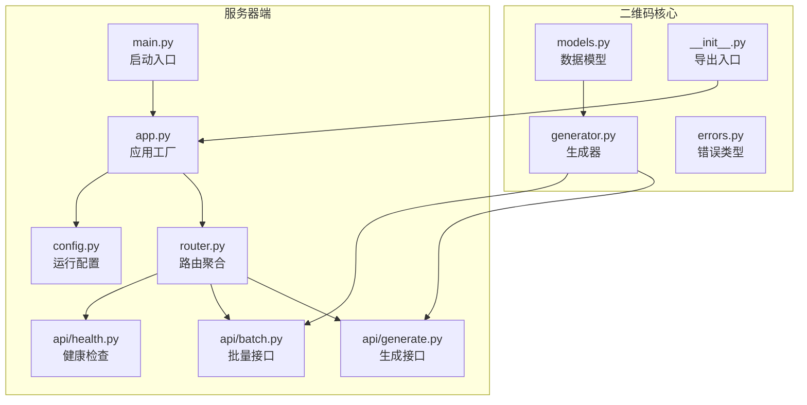
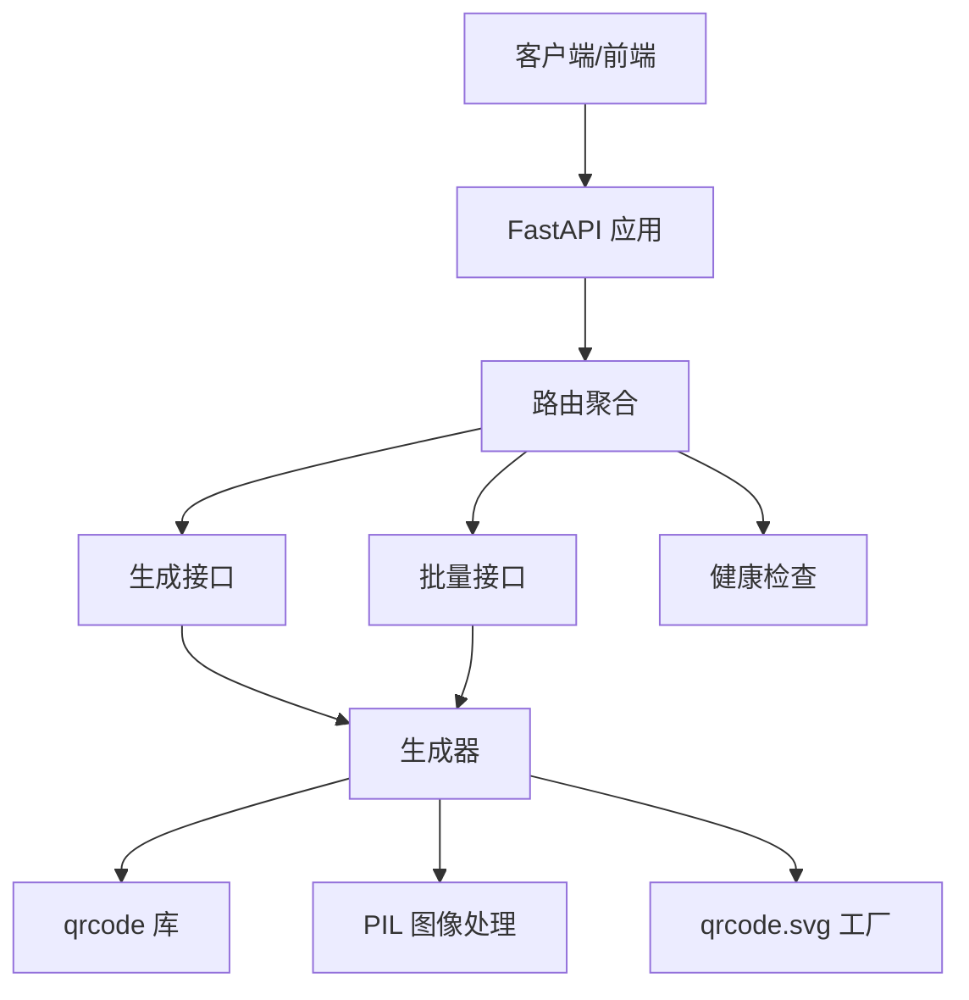
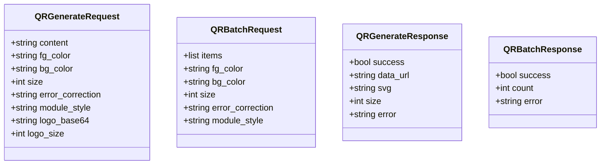
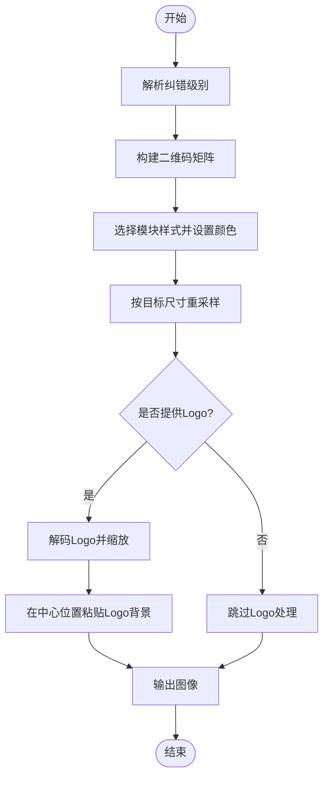
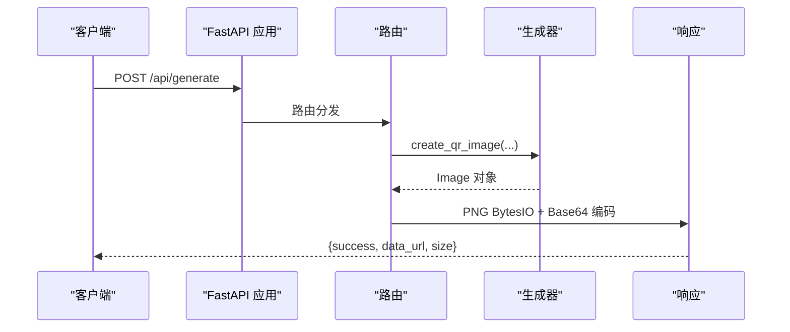
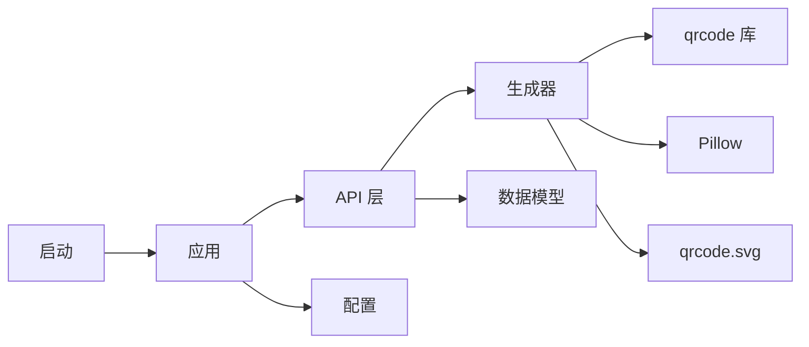

# 二维码系统

<cite>
**本文引用的文件**
- [models.py](file://tools/flexloop/src/taolib/testing/qrcode/models.py)
- [generator.py](file://tools/flexloop/src/taolib/testing/qrcode/generator.py)
- [__init__.py](file://tools/flexloop/src/taolib/testing/qrcode/__init__.py)
- [errors.py](file://tools/flexloop/src/taolib/testing/qrcode/errors.py)
- [generate.py](file://tools/flexloop/src/taolib/testing/qrcode/server/api/generate.py)
- [batch.py](file://tools/flexloop/src/taolib/testing/qrcode/server/api/batch.py)
- [health.py](file://tools/flexloop/src/taolib/testing/qrcode/server/api/health.py)
- [router.py](file://tools/flexloop/src/taolib/testing/qrcode/server/api/router.py)
- [app.py](file://tools/flexloop/src/taolib/testing/qrcode/server/app.py)
- [config.py](file://tools/flexloop/src/taolib/testing/qrcode/server/config.py)
- [main.py](file://tools/flexloop/src/taolib/testing/qrcode/server/main.py)
</cite>

## 目录
1. [简介](#简介)
2. [项目结构](#项目结构)
3. [核心组件](#核心组件)
4. [架构总览](#架构总览)
5. [详细组件分析](#详细组件分析)
6. [依赖关系分析](#依赖关系分析)
7. [性能考虑](#性能考虑)
8. [故障排查指南](#故障排查指南)
9. [结论](#结论)
10. [附录](#附录)

## 简介
本文件为二维码系统的技术文档，覆盖从底层生成器到服务器端API的完整实现。系统支持多种样式定制（模块形状、前景/背景色、尺寸）、纠错级别配置、Logo嵌入以及SVG导出；提供单张生成、PNG下载、SVG导出与批量生成ZIP下载能力。文档将深入解释编码算法、样式与尺寸管理、生成器实现、模型设计、服务器端API、缓存策略与性能优化，并给出可操作的生成配置示例与集成建议。

## 项目结构
二维码系统位于工具库模块中，采用分层组织：核心生成器与数据模型在 qrcode 包内，FastAPI 服务器端在 server 子包中，按功能拆分为健康检查、生成、批量处理等路由。

图表来源
- [models.py:1-38](file://tools/flexloop/src/taolib/testing/qrcode/models.py#L1-L38)
- [generator.py:1-120](file://tools/flexloop/src/taolib/testing/qrcode/generator.py#L1-L120)
- [errors.py:1-21](file://tools/flexloop/src/taolib/testing/qrcode/errors.py#L1-L21)
- [__init__.py:1-5](file://tools/flexloop/src/taolib/testing/qrcode/__init__.py#L1-L5)
- [app.py:1-27](file://tools/flexloop/src/taolib/testing/qrcode/server/app.py#L1-L27)
- [config.py:1-12](file://tools/flexloop/src/taolib/testing/qrcode/server/config.py#L1-L12)
- [main.py:1-17](file://tools/flexloop/src/taolib/testing/qrcode/server/main.py#L1-L17)
- [router.py:1-11](file://tools/flexloop/src/taolib/testing/qrcode/server/api/router.py#L1-L11)
- [generate.py:1-106](file://tools/flexloop/src/taolib/testing/qrcode/server/api/generate.py#L1-L106)
- [batch.py:1-54](file://tools/flexloop/src/taolib/testing/qrcode/server/api/batch.py#L1-L54)
- [health.py:1-11](file://tools/flexloop/src/taolib/testing/qrcode/server/api/health.py#L1-L11)

章节来源
- [models.py:1-38](file://tools/flexloop/src/taolib/testing/qrcode/models.py#L1-L38)
- [generator.py:1-120](file://tools/flexloop/src/taolib/testing/qrcode/generator.py#L1-L120)
- [app.py:1-27](file://tools/flexloop/src/taolib/testing/qrcode/server/app.py#L1-L27)

## 核心组件
- 数据模型：定义生成请求、批量请求与响应的数据结构，包含内容、颜色、尺寸、纠错级别、模块样式、Logo等字段及约束。
- 生成器：封装二维码编码、样式绘制、尺寸缩放、Logo叠加与SVG生成逻辑。
- 服务器端API：提供生成、SVG导出、下载与批量下载接口，统一CORS与路由组织。
- 错误体系：定义二维码相关异常类型，便于上层捕获与处理。

章节来源
- [models.py:5-37](file://tools/flexloop/src/taolib/testing/qrcode/models.py#L5-L37)
- [generator.py:25-118](file://tools/flexloop/src/taolib/testing/qrcode/generator.py#L25-L118)
- [generate.py:13-104](file://tools/flexloop/src/taolib/testing/qrcode/server/api/generate.py#L13-L104)
- [batch.py:13-51](file://tools/flexloop/src/taolib/testing/qrcode/server/api/batch.py#L13-L51)
- [errors.py:1-21](file://tools/flexloop/src/taolib/testing/qrcode/errors.py#L1-L21)

## 架构总览
系统采用“核心生成器 + FastAPI服务”的分层架构。核心生成器负责图像/矢量生成，API层负责HTTP协议与响应封装，路由层统一暴露REST接口。

图表来源
- [app.py:7-24](file://tools/flexloop/src/taolib/testing/qrcode/server/app.py#L7-L24)
- [router.py:1-11](file://tools/flexloop/src/taolib/testing/qrcode/server/api/router.py#L1-L11)
- [generate.py:13-104](file://tools/flexloop/src/taolib/testing/qrcode/server/api/generate.py#L13-L104)
- [batch.py:13-51](file://tools/flexloop/src/taolib/testing/qrcode/server/api/batch.py#L13-L51)
- [generator.py:25-118](file://tools/flexloop/src/taolib/testing/qrcode/generator.py#L25-L118)

## 详细组件分析

### 数据模型设计
- QRGenerateRequest：单次生成请求，字段包括内容、前景色、背景色、尺寸、纠错级别、模块样式、Logo（Base64）、Logo尺寸百分比。
- QRBatchRequest：批量生成请求，items为条目数组，每项含content与label，其余样式参数继承自请求对象。
- QRGenerateResponse：生成结果，包含success标志、data_url或svg字符串、返回尺寸、错误信息。
- QRBatchResponse：批量结果，包含success标志、生成数量、错误信息。

图表来源
- [models.py:5-37](file://tools/flexloop/src/taolib/testing/qrcode/models.py#L5-L37)

章节来源
- [models.py:5-37](file://tools/flexloop/src/taolib/testing/qrcode/models.py#L5-L37)

### 生成器实现
- 编码与纠错：根据输入内容与纠错级别构建二维码矩阵，支持L/M/Q/H四个等级映射。
- 样式与尺寸：通过模块绘制器选择方形/圆角/圆形模块，设置前景/背景色，最终按目标像素尺寸进行高质量重采样。
- Logo叠加：可选地将Base64解码后的Logo图像按指定百分比缩放，并在背景色块上居中粘贴至二维码中心区域。
- SVG导出：使用qrcode的SVG工厂生成可缩放矢量图形，便于无损放大与样式定制。

图表来源
- [generator.py:25-82](file://tools/flexloop/src/taolib/testing/qrcode/generator.py#L25-L82)
- [generator.py:85-118](file://tools/flexloop/src/taolib/testing/qrcode/generator.py#L85-L118)

章节来源
- [generator.py:25-118](file://tools/flexloop/src/taolib/testing/qrcode/generator.py#L25-L118)

### 服务器端API
- 生成接口（/api/generate）：接收QRGenerateRequest，返回QRGenerateResponse，支持PNG数据URL与SVG两种输出。
- SVG接口（/api/generate/svg）：仅返回SVG字符串。
- 下载接口（/api/generate/download）：以流形式返回PNG文件，支持自定义文件名。
- 批量接口（/api/batch）：接收QRBatchRequest，打包为ZIP并流式返回，ZIP内每个二维码为独立PNG文件。
- 健康检查（/api/health）：返回服务状态。

图表来源
- [generate.py:13-48](file://tools/flexloop/src/taolib/testing/qrcode/server/api/generate.py#L13-L48)
- [generator.py:25-82](file://tools/flexloop/src/taolib/testing/qrcode/generator.py#L25-L82)

章节来源
- [generate.py:13-104](file://tools/flexloop/src/taolib/testing/qrcode/server/api/generate.py#L13-L104)
- [batch.py:13-51](file://tools/flexloop/src/taolib/testing/qrcode/server/api/batch.py#L13-L51)
- [health.py:6-8](file://tools/flexloop/src/taolib/testing/qrcode/server/api/health.py#L6-L8)

### 错误处理与质量控制
- 输入校验：对空内容、无效Logo Base64进行显式校验与HTTP 4xx错误返回。
- 异常捕获：生成过程异常统一捕获并返回错误信息，保证接口稳定性。
- 质量控制：固定box_size与border，确保二维码密度与可读性；重采样使用高质量插值；PNG质量参数可控。

章节来源
- [generate.py:15-23](file://tools/flexloop/src/taolib/testing/qrcode/server/api/generate.py#L15-L23)
- [generate.py:47-48](file://tools/flexloop/src/taolib/testing/qrcode/server/api/generate.py#L47-L48)
- [batch.py:14-16](file://tools/flexloop/src/taolib/testing/qrcode/server/api/batch.py#L14-L16)
- [batch.py:50-51](file://tools/flexloop/src/taolib/testing/qrcode/server/api/batch.py#L50-L51)

## 依赖关系分析
- 组件耦合：API层仅依赖生成器与数据模型，保持低耦合；生成器依赖qrcode与PIL/SVG库。
- 外部依赖：qrcode（二维码编码）、qrcode.image.svg（SVG生成）、Pillow（图像处理）、FastAPI（Web框架）、uvicorn（ASGI服务器）。
- 可能的循环依赖：当前结构清晰，无循环导入迹象。

图表来源
- [generate.py:7-8](file://tools/flexloop/src/taolib/testing/qrcode/server/api/generate.py#L7-L8)
- [batch.py:7-8](file://tools/flexloop/src/taolib/testing/qrcode/server/api/batch.py#L7-L8)
- [app.py:4-24](file://tools/flexloop/src/taolib/testing/qrcode/server/app.py#L4-L24)
- [main.py:3-10](file://tools/flexloop/src/taolib/testing/qrcode/server/main.py#L3-L10)

章节来源
- [app.py:1-27](file://tools/flexloop/src/taolib/testing/qrcode/server/app.py#L1-L27)
- [main.py:1-17](file://tools/flexloop/src/taolib/testing/qrcode/server/main.py#L1-L17)

## 性能考虑
- 生成性能
  - 使用高质量重采样（Lanczos）保证缩放质量。
  - 固定box_size与border，避免动态计算带来的额外开销。
  - PNG保存时设置质量参数，平衡体积与质量。
- I/O与传输
  - 优先返回data URL用于前端即时渲染；需要持久化或下载时使用流式响应。
  - 批量场景使用ZIP流式输出，避免一次性占用过多内存。
- 缓存策略
  - 当前实现未内置缓存层。建议在网关或应用层引入内存+磁盘缓存，结合内容指纹作为键，设定TTL与LRU淘汰策略，以降低重复生成压力。
  - 对于高频小尺寸、低变化内容，可考虑Redis缓存生成结果，配合ETag/Last-Modified实现条件请求。
- 并发与限流
  - 在网关层启用并发限制与速率限制，防止突发流量导致CPU与内存峰值。
  - 对Logo解码与图像合成步骤进行异步化改造，提升吞吐。

[本节为通用性能建议，不直接分析具体文件]

## 故障排查指南
- 常见问题
  - 内容为空：接口会返回400错误，检查请求体content字段。
  - Logo Base64无效：解码失败会返回400错误，确认Base64格式正确且非空。
  - 生成异常：捕获到的异常会被包装为错误响应，检查日志定位具体原因。
- 排查步骤
  - 先调用健康检查接口确认服务可用。
  - 使用最小化请求复现问题，逐步增加复杂度（如添加Logo、调整尺寸）。
  - 关注生成器内部的颜色转换、尺寸缩放与Logo粘贴步骤。
- 错误类型
  - QRCodeError及其子类可用于上层统一捕获与分类处理。

章节来源
- [health.py:6-8](file://tools/flexloop/src/taolib/testing/qrcode/server/api/health.py#L6-L8)
- [generate.py:15-23](file://tools/flexloop/src/taolib/testing/qrcode/server/api/generate.py#L15-L23)
- [generate.py:47-48](file://tools/flexloop/src/taolib/testing/qrcode/server/api/generate.py#L47-L48)
- [errors.py:1-21](file://tools/flexloop/src/taolib/testing/qrcode/errors.py#L1-L21)

## 结论
该二维码系统以清晰的分层架构实现了从数据建模到HTTP服务的完整链路。核心生成器具备良好的扩展性与质量控制，服务器端API提供了多样化的输出格式与批量能力。建议在生产环境中补充缓存与限流策略，并持续监控生成耗时与资源占用，以保障高并发下的稳定性与用户体验。

[本节为总结性内容，不直接分析具体文件]

## 附录

### 生成配置示例（路径指引）
- 单次生成（PNG数据URL）
  - 请求体字段参考：[QRGenerateRequest 字段定义:5-14](file://tools/flexloop/src/taolib/testing/qrcode/models.py#L5-L14)
  - 实际调用流程参考：[生成接口实现:13-48](file://tools/flexloop/src/taolib/testing/qrcode/server/api/generate.py#L13-L48)
- 单次生成（SVG）
  - 请求体字段参考：[QRGenerateRequest 字段定义:5-14](file://tools/flexloop/src/taolib/testing/qrcode/models.py#L5-L14)
  - 实际调用流程参考：[SVG接口实现:51-66](file://tools/flexloop/src/taolib/testing/qrcode/server/api/generate.py#L51-L66)
- 下载PNG
  - 实际调用流程参考：[下载接口实现:69-104](file://tools/flexloop/src/taolib/testing/qrcode/server/api/generate.py#L69-L104)
- 批量生成
  - 请求体字段参考：[QRBatchRequest 字段定义:16-23](file://tools/flexloop/src/taolib/testing/qrcode/models.py#L16-L23)
  - 实际调用流程参考：[批量接口实现:13-51](file://tools/flexloop/src/taolib/testing/qrcode/server/api/batch.py#L13-L51)

### API定义概览
- 生成（PNG）
  - 方法：POST
  - 路径：/api/generate
  - 请求体：QRGenerateRequest
  - 响应体：QRGenerateResponse
- 生成（SVG）
  - 方法：POST
  - 路径：/api/generate/svg
  - 请求体：QRGenerateRequest
  - 响应体：QRGenerateResponse
- 下载（PNG）
  - 方法：POST
  - 路径：/api/generate/download
  - 请求体：QRGenerateRequest
  - 响应：image/png 流
- 批量（ZIP）
  - 方法：POST
  - 路径：/api/batch
  - 请求体：QRBatchRequest
  - 响应：application/zip 流
- 健康检查
  - 方法：GET
  - 路径：/api/health
  - 响应：状态对象

章节来源
- [generate.py:13-104](file://tools/flexloop/src/taolib/testing/qrcode/server/api/generate.py#L13-L104)
- [batch.py:13-51](file://tools/flexloop/src/taolib/testing/qrcode/server/api/batch.py#L13-L51)
- [health.py:6-8](file://tools/flexloop/src/taolib/testing/qrcode/server/api/health.py#L6-L8)