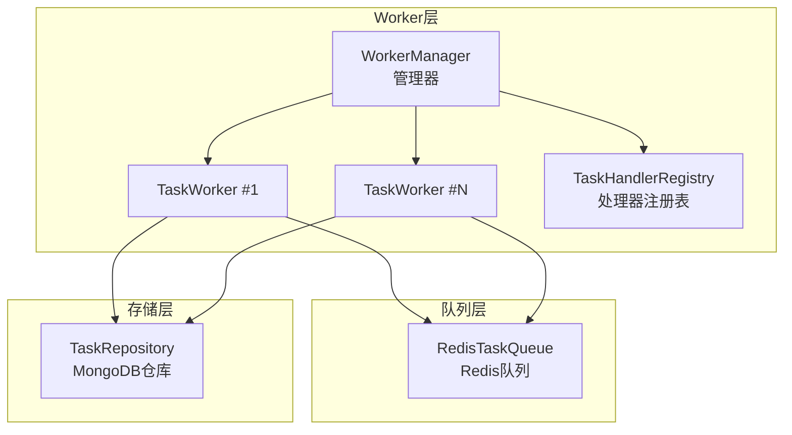
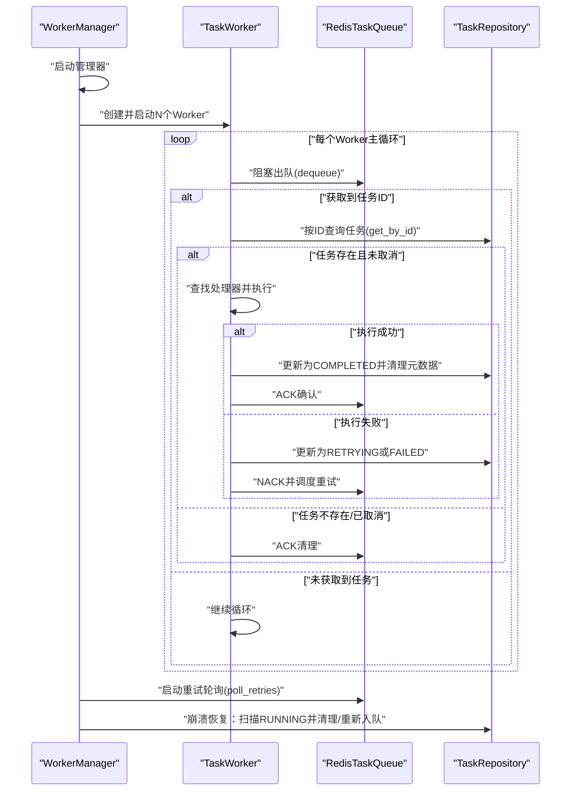
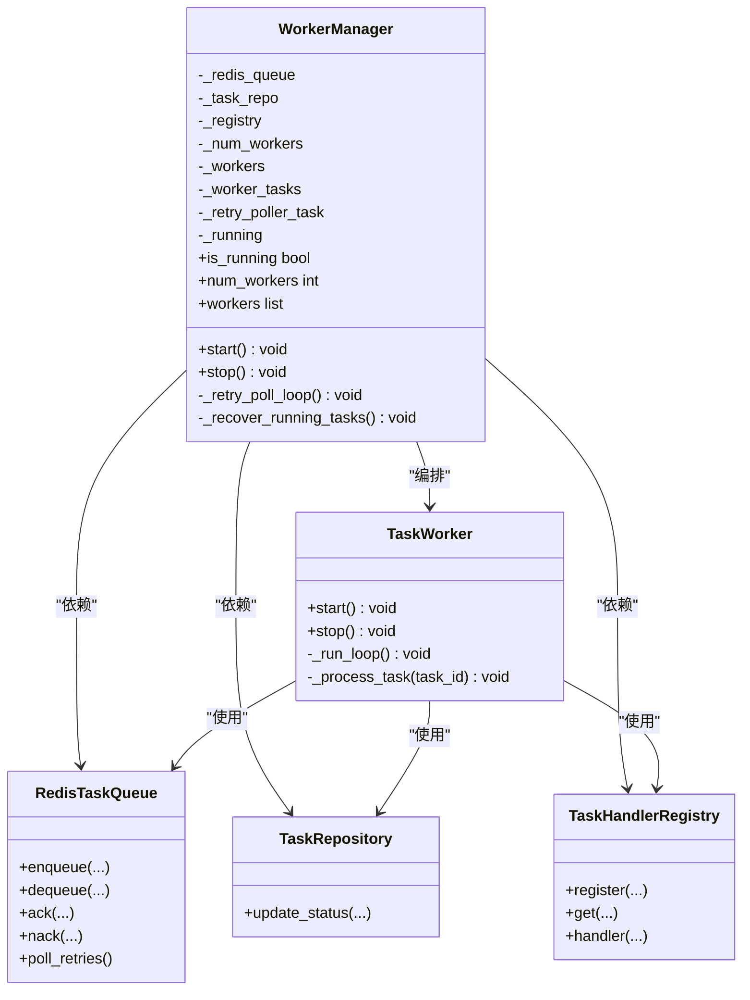
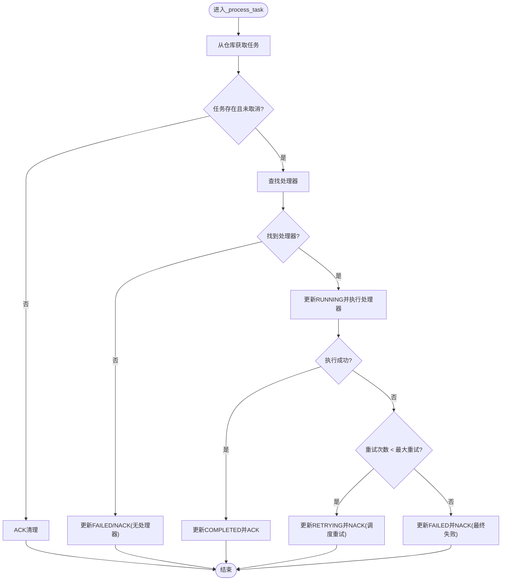
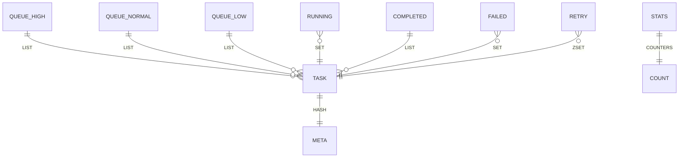
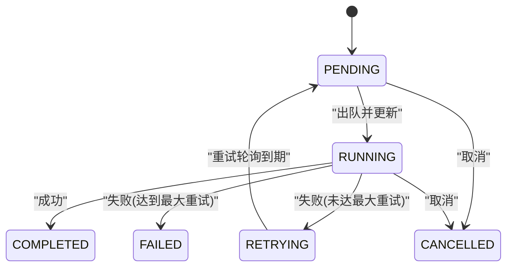
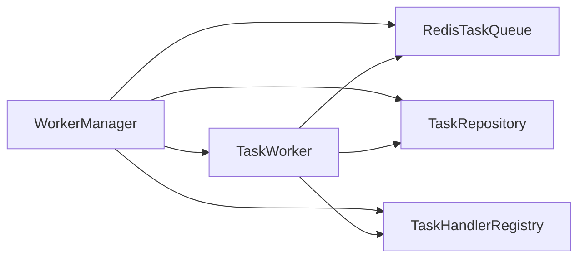

# Worker管理

<cite>
**本文引用的文件**
- [manager.py](file://tools/flexloop/src/taolib/testing/task_queue/worker/manager.py)
- [worker.py](file://tools/flexloop/src/taolib/testing/task_queue/worker/worker.py)
- [registry.py](file://tools/flexloop/src/taolib/testing/task_queue/worker/registry.py)
- [redis_queue.py](file://tools/flexloop/src/taolib/testing/task_queue/queue/redis_queue.py)
- [task_repo.py](file://tools/flexloop/src/taolib/testing/task_queue/repository/task_repo.py)
- [enums.py](file://tools/flexloop/src/taolib/testing/task_queue/models/enums.py)
- [task.py](file://tools/flexloop/src/taolib/testing/task_queue/models/task.py)
- [__init__.py](file://tools/flexloop/src/taolib/testing/task_queue/__init__.py)
- [test_manager.py](file://tools/flexloop/tests/testing/test_task_queue/test_manager.py)
- [test_worker.py](file://tools/flexloop/tests/testing/test_task_queue/test_worker.py)
- [health.py](file://tools/flexloop/src/taolib/testing/email_service/server/api/health.py)
</cite>

## 目录
1. [简介](#简介)
2. [项目结构](#项目结构)
3. [核心组件](#核心组件)
4. [架构总览](#架构总览)
5. [详细组件分析](#详细组件分析)
6. [依赖分析](#依赖分析)
7. [性能考虑](#性能考虑)
8. [故障排查指南](#故障排查指南)
9. [结论](#结论)
10. [附录](#附录)

## 简介
本技术文档围绕Worker管理系统展开，聚焦于后台任务队列的Worker进程池管理与任务执行闭环。系统以Redis作为任务队列与重试调度载体，以MongoDB持久化任务状态，通过WorkerManager统一编排多个TaskWorker协程，实现任务的拉取、执行、成功/失败处理、重试调度与崩溃恢复。文档同时覆盖任务分配与负载均衡策略、动态注册与健康检查、配置管理（并发数、超时、重试）、扩展性设计、监控指标与故障恢复机制。

## 项目结构
本系统位于工具链目录下，核心模块组织如下：
- worker：Worker管理器与工作协程、处理器注册表
- queue：基于Redis的任务队列与统计
- repository：MongoDB任务仓库
- models：任务与状态/优先级枚举
- tests：针对WorkerManager与TaskWorker的单元测试
- server/api：健康检查接口（用于系统健康状态观测）



图表来源
- [manager.py:25-136](file://tools/flexloop/src/taolib/testing/task_queue/worker/manager.py#L25-L136)
- [worker.py:21-101](file://tools/flexloop/src/taolib/testing/task_queue/worker/worker.py#L21-L101)
- [registry.py:11-90](file://tools/flexloop/src/taolib/testing/task_queue/worker/registry.py#L11-L90)
- [redis_queue.py:14-57](file://tools/flexloop/src/taolib/testing/task_queue/queue/redis_queue.py#L14-L57)
- [task_repo.py:15-25](file://tools/flexloop/src/taolib/testing/task_queue/repository/task_repo.py#L15-L25)

章节来源
- [__init__.py:1-33](file://tools/flexloop/src/taolib/testing/task_queue/__init__.py#L1-L33)

## 核心组件
- WorkerManager：负责启动/停止多个TaskWorker、启动重试轮询、执行崩溃恢复；对外暴露运行状态、工作者数量与工作者列表。
- TaskWorker：单个工作协程，从Redis队列阻塞拉取任务、查找处理器、执行并处理成功/失败与重试；支持优雅停止与当前任务跟踪。
- TaskHandlerRegistry：装饰器式任务处理器注册与查找，支持同步/异步处理器识别。
- RedisTaskQueue：基于Redis的队列实现，支持高/普通/低三级优先级、运行中集合、重试ZSet调度、统计计数器与任务元数据缓存。
- TaskRepository：MongoDB任务仓库，提供状态更新、查询与索引管理。
- 枚举与模型：TaskStatus/TaskPriority与TaskDocument/TaskResponse等Pydantic模型。

章节来源
- [manager.py:25-136](file://tools/flexloop/src/taolib/testing/task_queue/worker/manager.py#L25-L136)
- [worker.py:21-101](file://tools/flexloop/src/taolib/testing/task_queue/worker/worker.py#L21-L101)
- [registry.py:11-90](file://tools/flexloop/src/taolib/testing/task_queue/worker/registry.py#L11-L90)
- [redis_queue.py:14-57](file://tools/flexloop/src/taolib/testing/task_queue/queue/redis_queue.py#L14-L57)
- [task_repo.py:15-25](file://tools/flexloop/src/taolib/testing/task_queue/repository/task_repo.py#L15-L25)
- [enums.py:9-26](file://tools/flexloop/src/taolib/testing/task_queue/models/enums.py#L9-L26)
- [task.py:15-83](file://tools/flexloop/src/taolib/testing/task_queue/models/task.py#L15-L83)

## 架构总览
系统采用“管理器-工作协程-队列-存储”的分层架构。管理器统一编排Worker协程，Worker从Redis队列拉取任务，依据注册表查找对应处理器执行，执行结果通过仓库更新状态并回写队列/集合。重试通过Redis ZSet进行时间驱动调度，崩溃恢复扫描运行中任务并清理或重新入队。



图表来源
- [manager.py:73-136](file://tools/flexloop/src/taolib/testing/task_queue/worker/manager.py#L73-L136)
- [worker.py:65-101](file://tools/flexloop/src/taolib/testing/task_queue/worker/worker.py#L65-L101)
- [redis_queue.py:81-157](file://tools/flexloop/src/taolib/testing/task_queue/queue/redis_queue.py#L81-L157)
- [task_repo.py:92-109](file://tools/flexloop/src/taolib/testing/task_queue/repository/task_repo.py#L92-L109)

## 详细组件分析

### WorkerManager 分析
- 启停控制：启动时执行崩溃恢复、批量创建Worker协程并启动重试轮询；停止时通知Worker优雅退出并清理状态。
- 重试轮询：固定周期轮询Redis重试ZSet，到期任务重新入队并更新仓库状态为PENDING。
- 崩溃恢复：扫描Redis运行中集合，结合仓库状态判断孤儿/已完成/过期任务，清理或重新入队。
- 并发数：通过构造函数参数控制Worker数量，默认值在测试中体现为3。



图表来源
- [manager.py:25-136](file://tools/flexloop/src/taolib/testing/task_queue/worker/manager.py#L25-L136)
- [worker.py:21-101](file://tools/flexloop/src/taolib/testing/task_queue/worker/worker.py#L21-L101)
- [registry.py:11-90](file://tools/flexloop/src/taolib/testing/task_queue/worker/registry.py#L11-L90)
- [redis_queue.py:14-57](file://tools/flexloop/src/taolib/testing/task_queue/queue/redis_queue.py#L14-L57)
- [task_repo.py:15-25](file://tools/flexloop/src/taolib/testing/task_queue/repository/task_repo.py#L15-L25)

章节来源
- [manager.py:73-136](file://tools/flexloop/src/taolib/testing/task_queue/worker/manager.py#L73-L136)
- [test_manager.py:98-252](file://tools/flexloop/tests/testing/test_task_queue/test_manager.py#L98-L252)

### TaskWorker 分析
- 主循环：使用阻塞出队，空闲时继续循环；异常时短暂休眠避免忙等。
- 任务处理：先查仓库状态，再查处理器，执行成功/失败分支；失败时按最大重试次数与递增延迟策略调度重试。
- 成功路径：更新仓库为COMPLETED，清理任务元数据，ACK确认。
- 失败路径：更新仓库为RETRYING或FAILED，NACK并写入重试ZSet或失败集合。
- 优雅停止：设置运行标志后在循环末尾退出，确保当前任务完成。



图表来源
- [worker.py:102-274](file://tools/flexloop/src/taolib/testing/task_queue/worker/worker.py#L102-L274)

章节来源
- [worker.py:65-101](file://tools/flexloop/src/taolib/testing/task_queue/worker/worker.py#L65-L101)
- [worker.py:102-274](file://tools/flexloop/src/taolib/testing/task_queue/worker/worker.py#L102-L274)
- [test_worker.py:82-272](file://tools/flexloop/tests/testing/test_task_queue/test_worker.py#L82-L272)

### 任务处理器注册与发现
- 注册表：提供装饰器与显式注册两种方式，内部维护task_type到处理器的映射。
- 处理器识别：支持同步/异步处理器，分别在事件循环或线程池中执行。
- 默认注册表：模块级默认注册表，便于快速装饰器注册。

```mermaid
classDiagram
class TaskHandlerRegistry {
-_handlers
+register(task_type, handler)
+get(task_type)
+has(task_type) bool
+list_types() list
+handler(task_type) callable
+is_async_handler(handler) bool
}
class DecoratorUsage {
<<usage>>
"@registry.handler('type')"
}
TaskHandlerRegistry <.. DecoratorUsage : "装饰器注册"
```

图表来源
- [registry.py:11-136](file://tools/flexloop/src/taolib/testing/task_queue/worker/registry.py#L11-L136)

章节来源
- [registry.py:11-136](file://tools/flexloop/src/taolib/testing/task_queue/worker/registry.py#L11-L136)

### Redis 任务队列与统计
- 键空间：高/普通/低优先级队列、运行中集合、完成/失败集合、重试ZSet、任务元数据Hash、全局统计Hash。
- 出队：BRPOP按优先级顺序阻塞拉取，命中后加入运行中集合。
- 确认/失败：ACK清理运行中并写入完成列表与统计；NACK写入失败集合或重试ZSet。
- 重试轮询：按当前时间戳从ZSet取到期任务，重新入队并更新仓库状态。
- 统计：提供提交/完成/失败/重试/队列长度/运行中/重试中等指标。



图表来源
- [redis_queue.py:19-29](file://tools/flexloop/src/taolib/testing/task_queue/queue/redis_queue.py#L19-L29)
- [redis_queue.py:158-194](file://tools/flexloop/src/taolib/testing/task_queue/queue/redis_queue.py#L158-L194)
- [redis_queue.py:226-271](file://tools/flexloop/src/taolib/testing/task_queue/queue/redis_queue.py#L226-L271)

章节来源
- [redis_queue.py:58-157](file://tools/flexloop/src/taolib/testing/task_queue/queue/redis_queue.py#L58-L157)
- [redis_queue.py:158-194](file://tools/flexloop/src/taolib/testing/task_queue/queue/redis_queue.py#L158-L194)
- [redis_queue.py:226-271](file://tools/flexloop/src/taolib/testing/task_queue/queue/redis_queue.py#L226-L271)

### 任务模型与状态机
- 模型层次：Base/Create/Update/Response/Document四层，满足提交、响应与持久化需求。
- 状态机：PENDING/RUNNING/COMPLETED/FAILED/RETRYING/CANCELLED，配合优先级与重试策略。
- 重试策略：最大重试次数与递增延迟数组，按索引取下次重试时间。



图表来源
- [enums.py:9-17](file://tools/flexloop/src/taolib/testing/task_queue/models/enums.py#L9-L17)
- [task.py:68-83](file://tools/flexloop/src/taolib/testing/task_queue/models/task.py#L68-L83)

章节来源
- [task.py:15-83](file://tools/flexloop/src/taolib/testing/task_queue/models/task.py#L15-L83)
- [enums.py:9-26](file://tools/flexloop/src/taolib/testing/task_queue/models/enums.py#L9-L26)

## 依赖分析
- 组件耦合：WorkerManager对TaskWorker、RedisTaskQueue、TaskRepository、TaskHandlerRegistry均有直接依赖；TaskWorker对上述组件也有直接依赖。
- 外部依赖：Redis（异步客户端）、MongoDB（Motor异步驱动）。
- 循环依赖：未见循环导入；模块职责清晰，接口边界明确。



图表来源
- [manager.py:34-56](file://tools/flexloop/src/taolib/testing/task_queue/worker/manager.py#L34-L56)
- [worker.py:28-47](file://tools/flexloop/src/taolib/testing/task_queue/worker/worker.py#L28-L47)

章节来源
- [manager.py:34-56](file://tools/flexloop/src/taolib/testing/task_queue/worker/manager.py#L34-L56)
- [worker.py:28-47](file://tools/flexloop/src/taolib/testing/task_queue/worker/worker.py#L28-L47)

## 性能考虑
- 队列优先级：高/普通/低三级队列，BRPOP按优先级顺序出队，保证高优任务优先处理。
- 阻塞出队：降低空转CPU占用，提升吞吐。
- 事务管道：入队/确认/失败等关键操作使用pipeline，减少RTT与原子性保障。
- 重试调度：基于ZSet的时间驱动，避免轮询热点；重试轮询周期可控。
- 线程池与事件循环：异步处理器直接await，同步处理器通过线程池执行，避免阻塞事件循环。
- 统计与限流：完成列表截断、统计计数器，便于观察系统压力与瓶颈。

## 故障排查指南
- 健康检查：健康端点检查数据库、Redis连通性，并聚合提供商与队列状态，辅助定位基础设施问题。
- 日志与异常：WorkerManager/TaskWorker均记录关键事件与异常堆栈，便于定位失败原因。
- 崩溃恢复：启动时扫描运行中任务，清理孤儿或重新入队过期任务，避免僵尸任务。
- 重试轮询：定期检查重试ZSet，确保失败任务按时重试；异常时继续运行不中断。
- 测试覆盖：单元测试覆盖启动/停止、重试轮询、崩溃恢复、成功/失败处理、边缘情况等，便于回归验证。

章节来源
- [health.py:8-54](file://tools/flexloop/src/taolib/testing/email_service/server/api/health.py#L8-L54)
- [test_manager.py:412-622](file://tools/flexloop/tests/testing/test_task_queue/test_manager.py#L412-L622)
- [test_worker.py:236-494](file://tools/flexloop/tests/testing/test_task_queue/test_worker.py#L236-L494)

## 结论
该Worker管理系统以Redis+MongoDB为核心，构建了高可用、可观测、可扩展的任务执行平台。通过WorkerManager统一编排、TaskWorker并行处理、注册表动态发现、Redis优先级队列与ZSet重试调度，实现了稳定可靠的后台任务处理闭环。系统具备完善的崩溃恢复与重试机制，支持灵活的并发配置与监控指标，适合在多业务场景下扩展部署。

## 附录

### 任务分配与负载均衡策略
- 负载均衡：通过Worker数量与Redis阻塞出队实现自然的负载分摊；高/普通/低优先级队列确保高优任务优先。
- 资源调度：Worker数量由管理器配置；处理器注册表支持按任务类型路由，便于按能力划分Worker实例。

章节来源
- [manager.py:34-56](file://tools/flexloop/src/taolib/testing/task_queue/worker/manager.py#L34-L56)
- [redis_queue.py:58-103](file://tools/flexloop/src/taolib/testing/task_queue/queue/redis_queue.py#L58-L103)

### Worker注册机制与健康检查
- 动态注册：通过装饰器或显式注册将任务类型与处理器绑定，运行时动态生效。
- 健康检查：健康端点聚合数据库、Redis、提供商与队列状态，便于运维监控。

章节来源
- [registry.py:69-89](file://tools/flexloop/src/taolib/testing/task_queue/worker/registry.py#L69-L89)
- [health.py:8-54](file://tools/flexloop/src/taolib/testing/email_service/server/api/health.py#L8-L54)

### Worker配置管理
- 并发数：WorkerManager构造参数控制Worker数量，默认值参考测试。
- 超时处理：Worker阻塞出队支持超时参数；重试轮询周期固定。
- 重启策略：管理器支持优雅停止与重启；崩溃恢复自动清理/重试。

章节来源
- [manager.py:34-56](file://tools/flexloop/src/taolib/testing/task_queue/worker/manager.py#L34-L56)
- [worker.py:79-101](file://tools/flexloop/src/taolib/testing/task_queue/worker/worker.py#L79-L101)
- [test_manager.py:101-170](file://tools/flexloop/tests/testing/test_task_queue/test_manager.py#L101-L170)

### Worker扩展性设计
- 添加新Worker实例：通过增加WorkerManager的num_workers即可横向扩展。
- 处理能力扩展：新增任务类型只需注册对应处理器，无需修改核心流程。

章节来源
- [manager.py:86-95](file://tools/flexloop/src/taolib/testing/task_queue/worker/manager.py#L86-L95)
- [registry.py:69-89](file://tools/flexloop/src/taolib/testing/task_queue/worker/registry.py#L69-L89)

### Worker监控指标
- 队列统计：提交/完成/失败/重试、各优先级队列长度、运行中/重试中数量。
- 任务元数据：任务ID、类型、优先级、重试次数与下次重试时间等。

章节来源
- [redis_queue.py:226-271](file://tools/flexloop/src/taolib/testing/task_queue/queue/redis_queue.py#L226-L271)
- [task_repo.py:92-109](file://tools/flexloop/src/taolib/testing/task_queue/repository/task_repo.py#L92-L109)

### 故障恢复机制
- 任务重新分配：崩溃恢复扫描运行中任务，清理孤儿或重新入队过期任务。
- 状态恢复：仓库状态与Redis集合保持一致，ACK/NACK确保最终一致性。

章节来源
- [manager.py:169-222](file://tools/flexloop/src/taolib/testing/task_queue/worker/manager.py#L169-L222)
- [redis_queue.py:105-157](file://tools/flexloop/src/taolib/testing/task_queue/queue/redis_queue.py#L105-L157)