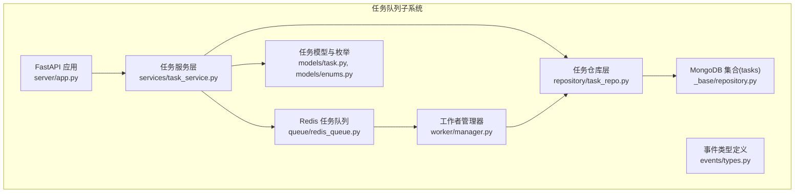
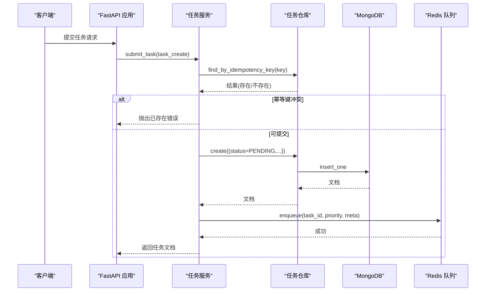
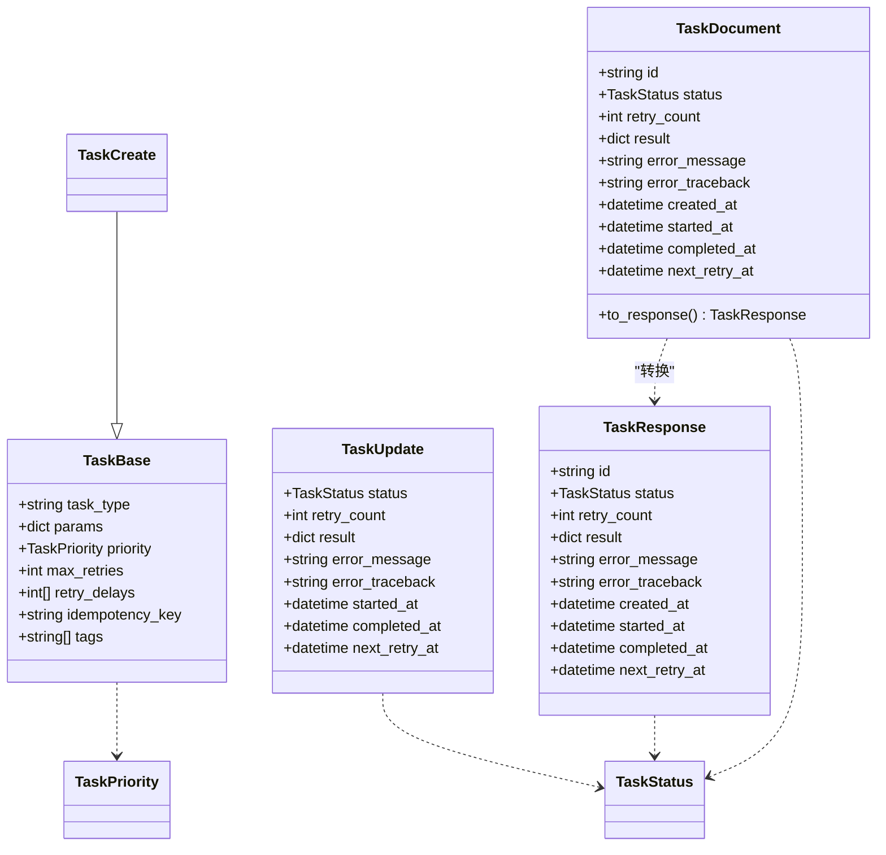
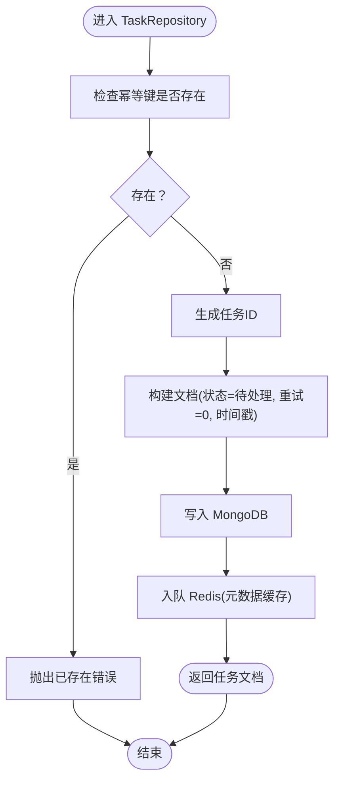
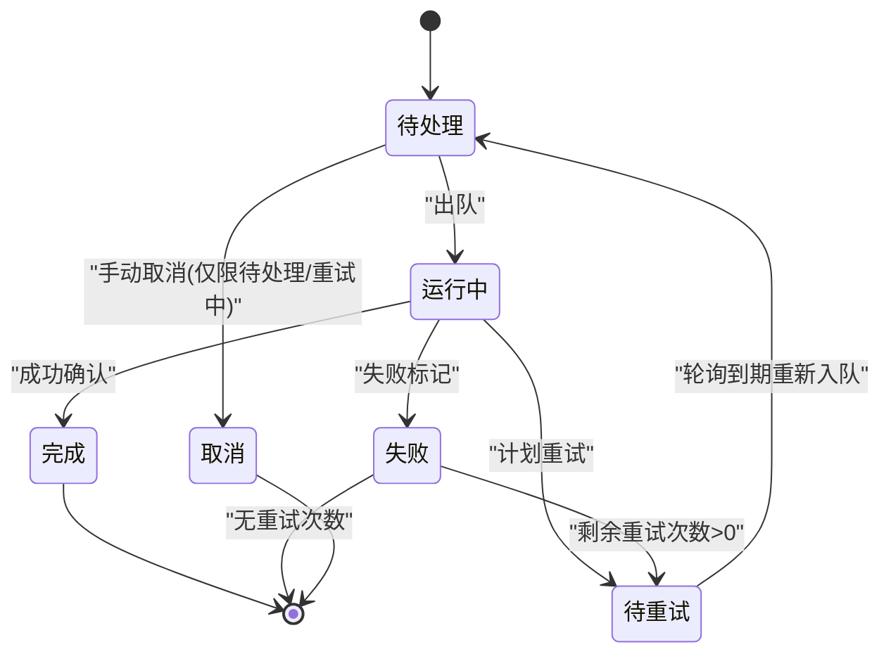
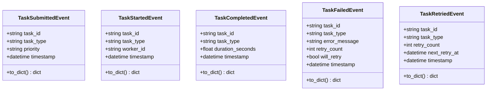
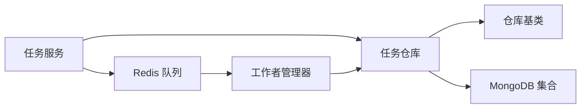

# 仓库层设计

<cite>
**本文引用的文件**
- [repository.py](file://tools/flexloop/src/taolib/testing/_base/repository.py)
- [task_repo.py](file://tools/flexloop/src/taolib/testing/task_queue/repository/task_repo.py)
- [task.py](file://tools/flexloop/src/taolib/testing/task_queue/models/task.py)
- [enums.py](file://tools/flexloop/src/taolib/testing/task_queue/models/enums.py)
- [types.py](file://tools/flexloop/src/taolib/testing/task_queue/events/types.py)
- [task_service.py](file://tools/flexloop/src/taolib/testing/task_queue/services/task_service.py)
- [redis_queue.py](file://tools/flexloop/src/taolib/testing/task_queue/queue/redis_queue.py)
- [app.py](file://tools/flexloop/src/taolib/testing/task_queue/server/app.py)
- [manager.py](file://tools/flexloop/src/taolib/testing/task_queue/worker/manager.py)
- [test_repository.py](file://tools/flexloop/tests/testing/test_task_queue/test_repository.py)
- [test_service.py](file://tools/flexloop/tests/testing/test_task_queue/test_service.py)
</cite>

## 目录
1. [简介](#简介)
2. [项目结构](#项目结构)
3. [核心组件](#核心组件)
4. [架构总览](#架构总览)
5. [详细组件分析](#详细组件分析)
6. [依赖分析](#依赖分析)
7. [性能考虑](#性能考虑)
8. [故障排查指南](#故障排查指南)
9. [结论](#结论)
10. [附录](#附录)

## 简介
本文件面向任务队列仓库层的设计与实现，聚焦于仓库模式在任务管理中的应用，涵盖任务状态跟踪、历史记录管理与统计分析；阐述任务数据模型设计、仓库接口实现（CRUD、查询优化、事务管理）、任务状态管理机制（状态转换、持久化策略、一致性保证）、事件驱动架构（任务事件的发布、订阅与处理），并通过具体代码路径示例展示如何使用仓库层进行任务操作与状态查询。

## 项目结构
仓库层位于任务队列子系统中，采用“泛型仓库基类 + 任务专用仓库”的分层设计，结合 Redis 队列与 MongoDB 持久化，形成“内存队列 + 持久存储”的双层架构。服务层协调仓库与队列，工作器管理器负责消费者与重试轮询，仪表盘提供可视化监控。

**图表来源**
- [app.py:19-67](file://tools/flexloop/src/taolib/testing/task_queue/server/app.py#L19-L67)
- [task_service.py:29-41](file://tools/flexloop/src/taolib/testing/task_queue/services/task_service.py#L29-L41)
- [task_repo.py:18-24](file://tools/flexloop/src/taolib/testing/task_queue/repository/task_repo.py#L18-L24)
- [redis_queue.py:31-43](file://tools/flexloop/src/taolib/testing/task_queue/queue/redis_queue.py#L31-L43)
- [repository.py:18-28](file://tools/flexloop/src/taolib/testing/_base/repository.py#L18-L28)
- [task.py:68-83](file://tools/flexloop/src/taolib/testing/task_queue/models/task.py#L68-L83)
- [enums.py:9-26](file://tools/flexloop/src/taolib/testing/task_queue/models/enums.py#L9-L26)
- [manager.py:34-56](file://tools/flexloop/src/taolib/testing/task_queue/worker/manager.py#L34-L56)

**章节来源**
- [app.py:19-67](file://tools/flexloop/src/taolib/testing/task_queue/server/app.py#L19-L67)

## 核心组件
- 泛型仓库基类：提供统一的异步 CRUD、列表查询、计数与索引创建能力，屏蔽底层 MongoDB 细节。
- 任务仓库：在基类之上扩展任务特有查询（按状态、类型、幂等键、多条件过滤）与状态更新。
- 任务模型：定义任务的 Pydantic 四层模型（Base/Create/Response/Document），确保输入输出与存储一致。
- 任务服务：封装业务规则（幂等键、状态转换、重试与取消、统计聚合）。
- Redis 队列：提供优先级队列、重试调度、运行中任务跟踪与统计。
- 工作者管理器：编排工作者协程、重试轮询与崩溃恢复。
- 事件类型：定义任务生命周期事件的数据结构。

**章节来源**
- [repository.py:15-131](file://tools/flexloop/src/taolib/testing/_base/repository.py#L15-L131)
- [task_repo.py:15-169](file://tools/flexloop/src/taolib/testing/task_queue/repository/task_repo.py#L15-L169)
- [task.py:15-107](file://tools/flexloop/src/taolib/testing/task_queue/models/task.py#L15-L107)
- [enums.py:9-26](file://tools/flexloop/src/taolib/testing/task_queue/models/enums.py#L9-L26)
- [task_service.py:23-259](file://tools/flexloop/src/taolib/testing/task_queue/services/task_service.py#L23-L259)
- [redis_queue.py:14-317](file://tools/flexloop/src/taolib/testing/task_queue/queue/redis_queue.py#L14-L317)
- [manager.py:25-225](file://tools/flexloop/src/taolib/testing/task_queue/worker/manager.py#L25-L225)
- [types.py:11-107](file://tools/flexloop/src/taolib/testing/task_queue/events/types.py#L11-L107)

## 架构总览
仓库层通过“基类 + 专用实现”的方式，将 MongoDB 的 CRUD 与查询抽象为统一接口，同时提供任务领域特定的查询与状态更新方法。服务层在提交任务时，先写入 MongoDB，再入队 Redis；在工作器处理完成后，通过 Redis 更新状态并回写 MongoDB。统计信息由服务层合并 Redis 实时统计与 MongoDB 计数结果。

**图表来源**
- [task_service.py:43-94](file://tools/flexloop/src/taolib/testing/task_queue/services/task_service.py#L43-L94)
- [task_repo.py:111-123](file://tools/flexloop/src/taolib/testing/task_queue/repository/task_repo.py#L111-L123)
- [repository.py:30-41](file://tools/flexloop/src/taolib/testing/_base/repository.py#L30-L41)
- [redis_queue.py:58-80](file://tools/flexloop/src/taolib/testing/task_queue/queue/redis_queue.py#L58-L80)

**章节来源**
- [task_service.py:43-94](file://tools/flexloop/src/taolib/testing/task_queue/services/task_service.py#L43-L94)
- [task_repo.py:111-123](file://tools/flexloop/src/taolib/testing/task_queue/repository/task_repo.py#L111-L123)
- [repository.py:30-41](file://tools/flexloop/src/taolib/testing/_base/repository.py#L30-L41)
- [redis_queue.py:58-80](file://tools/flexloop/src/taolib/testing/task_queue/queue/redis_queue.py#L58-L80)

## 详细组件分析

### 数据模型设计
- 任务四层模型：
  - Base：任务基础字段（类型、参数、优先级、重试策略、幂等键、标签）。
  - Create：创建输入模型。
  - Response：API 响应模型，包含完整任务信息。
  - Document：MongoDB 文档模型，包含状态与时间戳字段，并提供 to_response 转换。
- 枚举：
  - 任务状态：pending、running、completed、failed、retrying、cancelled。
  - 任务优先级：high、normal、low。

**图表来源**
- [task.py:15-107](file://tools/flexloop/src/taolib/testing/task_queue/models/task.py#L15-L107)
- [enums.py:9-26](file://tools/flexloop/src/taolib/testing/task_queue/models/enums.py#L9-L26)

**章节来源**
- [task.py:15-107](file://tools/flexloop/src/taolib/testing/task_queue/models/task.py#L15-L107)
- [enums.py:9-26](file://tools/flexloop/src/taolib/testing/task_queue/models/enums.py#L9-L26)

### 仓库接口实现
- 基类能力：
  - create：插入文档并返回模型实例。
  - get_by_id：按 ID 查询并转换。
  - update：原子更新并返回最新模型。
  - delete：删除并返回布尔结果。
  - list：支持过滤、跳过、限制与排序。
  - count：统计数量。
- 任务仓库扩展：
  - find_by_status/find_by_type：按状态/类型查询。
  - find_failed_tasks/find_running_tasks：常用状态筛选。
  - update_status：便捷的状态更新（可带额外字段）。
  - find_by_idempotency_key：幂等键查询。
  - find_by_filters：多条件组合查询。
  - create_indexes：创建索引以优化查询与 TTL 清理。

**图表来源**
- [task_service.py:43-94](file://tools/flexloop/src/taolib/testing/task_queue/services/task_service.py#L43-L94)
- [task_repo.py:111-123](file://tools/flexloop/src/taolib/testing/task_queue/repository/task_repo.py#L111-L123)
- [repository.py:30-41](file://tools/flexloop/src/taolib/testing/_base/repository.py#L30-L41)

**章节来源**
- [repository.py:30-129](file://tools/flexloop/src/taolib/testing/_base/repository.py#L30-L129)
- [task_repo.py:26-169](file://tools/flexloop/src/taolib/testing/task_queue/repository/task_repo.py#L26-L169)

### 任务状态管理机制
- 状态转换：
  - 提交：初始状态为 pending。
  - 出队：从队列取出后加入运行中集合。
  - 完成/失败：成功确认或失败标记，分别更新 Redis 与 MongoDB。
  - 重试：到期后从重试集合轮询重新入队，状态更新为 pending。
  - 取消：仅允许 pending 或 retrying 状态取消。
- 持久化策略：
  - MongoDB：保存任务完整生命周期数据，支持 TTL 自动清理。
  - Redis：缓存任务元数据、队列深度与累计统计，保障高并发读写。
- 一致性保证：
  - 服务层在提交时先写 MongoDB 再入队 Redis，避免丢失。
  - 工作者管理器在崩溃恢复阶段扫描运行中任务并做去重与重新入队。
  - 重试轮询在 Redis 成功后同步更新 MongoDB 状态。

**图表来源**
- [task_service.py:113-190](file://tools/flexloop/src/taolib/testing/task_queue/services/task_service.py#L113-L190)
- [redis_queue.py:105-157](file://tools/flexloop/src/taolib/testing/task_queue/queue/redis_queue.py#L105-L157)
- [manager.py:138-168](file://tools/flexloop/src/taolib/testing/task_queue/worker/manager.py#L138-L168)

**章节来源**
- [task_service.py:113-190](file://tools/flexloop/src/taolib/testing/task_queue/services/task_service.py#L113-L190)
- [redis_queue.py:105-157](file://tools/flexloop/src/taolib/testing/task_queue/queue/redis_queue.py#L105-L157)
- [manager.py:138-168](file://tools/flexloop/src/taolib/testing/task_queue/worker/manager.py#L138-L168)

### 事件驱动架构
- 事件类型：提交、开始、完成、失败、重试、取消等。
- 发布与订阅：仓库层不直接发布事件，事件通常由工作者或服务层在状态变更时产生；事件可用于审计、告警或外部集成。
- 处理机制：事件可被独立的事件处理器消费，实现解耦与可观测性。

**图表来源**
- [types.py:11-107](file://tools/flexloop/src/taolib/testing/task_queue/events/types.py#L11-L107)

**章节来源**
- [types.py:11-107](file://tools/flexloop/src/taolib/testing/task_queue/events/types.py#L11-L107)

### 仓库层使用示例（代码路径）
- 提交任务
  - 服务层入口：[submit_task:43-94](file://tools/flexloop/src/taolib/testing/task_queue/services/task_service.py#L43-L94)
  - 仓库创建：[create:30-41](file://tools/flexloop/src/taolib/testing/_base/repository.py#L30-L41)
  - 仓库幂等键查询：[find_by_idempotency_key:111-123](file://tools/flexloop/src/taolib/testing/task_queue/repository/task_repo.py#L111-L123)
  - Redis 入队：[enqueue:58-80](file://tools/flexloop/src/taolib/testing/task_queue/queue/redis_queue.py#L58-L80)
- 查询任务
  - 按 ID 查询：[get_by_id:43-56](file://tools/flexloop/src/taolib/testing/_base/repository.py#L43-L56)
  - 按状态查询：[find_by_status:26-47](file://tools/flexloop/src/taolib/testing/task_queue/repository/task_repo.py#L26-L47)
  - 多条件过滤：[find_by_filters:125-157](file://tools/flexloop/src/taolib/testing/task_queue/repository/task_repo.py#L125-L157)
- 状态更新
  - 更新状态：[update_status:92-109](file://tools/flexloop/src/taolib/testing/task_queue/repository/task_repo.py#L92-L109)
  - 重试与取消：[retry_task:113-159](file://tools/flexloop/src/taolib/testing/task_queue/services/task_service.py#L113-L159)、[cancel_task:161-190](file://tools/flexloop/src/taolib/testing/task_queue/services/task_service.py#L161-L190)
- 统计与监控
  - 统计聚合：[get_stats:220-256](file://tools/flexloop/src/taolib/testing/task_queue/services/task_service.py#L220-L256)
  - Redis 统计：[get_stats:226-271](file://tools/flexloop/src/taolib/testing/task_queue/queue/redis_queue.py#L226-L271)
  - 仪表盘页面：[dashboard:92-96](file://tools/flexloop/src/taolib/testing/task_queue/server/app.py#L92-L96)

**章节来源**
- [task_service.py:43-256](file://tools/flexloop/src/taolib/testing/task_queue/services/task_service.py#L43-L256)
- [task_repo.py:26-169](file://tools/flexloop/src/taolib/testing/task_queue/repository/task_repo.py#L26-L169)
- [repository.py:30-129](file://tools/flexloop/src/taolib/testing/_base/repository.py#L30-L129)
- [redis_queue.py:58-271](file://tools/flexloop/src/taolib/testing/task_queue/queue/redis_queue.py#L58-L271)
- [app.py:92-96](file://tools/flexloop/src/taolib/testing/task_queue/server/app.py#L92-L96)

## 依赖分析
- 组件耦合：
  - 服务层依赖仓库与队列，仓库依赖基类与模型，队列与管理器相互协作。
- 外部依赖：
  - MongoDB（Motor 异步驱动）：用于持久化任务数据与索引。
  - Redis（异步客户端）：用于队列、运行中任务集合、统计与任务元数据缓存。
- 潜在循环依赖：
  - 未发现直接循环导入；服务层与仓库层通过接口解耦。
- 接口契约：
  - 仓库基类定义了统一的 CRUD 与查询接口，任务仓库在此基础上扩展领域方法。

**图表来源**
- [task_service.py:29-41](file://tools/flexloop/src/taolib/testing/task_queue/services/task_service.py#L29-L41)
- [task_repo.py:18-24](file://tools/flexloop/src/taolib/testing/task_queue/repository/task_repo.py#L18-L24)
- [repository.py:18-28](file://tools/flexloop/src/taolib/testing/_base/repository.py#L18-L28)
- [redis_queue.py:31-43](file://tools/flexloop/src/taolib/testing/task_queue/queue/redis_queue.py#L31-L43)
- [manager.py:34-56](file://tools/flexloop/src/taolib/testing/task_queue/worker/manager.py#L34-L56)

**章节来源**
- [task_service.py:29-41](file://tools/flexloop/src/taolib/testing/task_queue/services/task_service.py#L29-L41)
- [task_repo.py:18-24](file://tools/flexloop/src/taolib/testing/task_queue/repository/task_repo.py#L18-L24)
- [repository.py:18-28](file://tools/flexloop/src/taolib/testing/_base/repository.py#L18-L28)
- [redis_queue.py:31-43](file://tools/flexloop/src/taolib/testing/task_queue/queue/redis_queue.py#L31-L43)
- [manager.py:34-56](file://tools/flexloop/src/taolib/testing/task_queue/worker/manager.py#L34-L56)

## 性能考虑
- 查询优化：
  - 任务仓库创建复合索引（状态+优先级）与类型索引，提升按状态与类型过滤效率。
  - TTL 索引自动清理历史任务，降低集合膨胀。
- 写入路径：
  - 服务层在提交时先写 MongoDB 再入队 Redis，避免丢失；使用管道减少往返。
- 读取路径：
  - Redis 提供队列长度、运行中集合与统计聚合，降低 MongoDB 压力。
- 并发与一致性：
  - 使用 Redis 集合与有序集合作为并发安全的共享状态容器。
  - 工作者管理器的崩溃恢复与重试轮询保障长时间运行任务的一致性。

**章节来源**
- [task_repo.py:159-167](file://tools/flexloop/src/taolib/testing/task_queue/repository/task_repo.py#L159-L167)
- [redis_queue.py:58-80](file://tools/flexloop/src/taolib/testing/task_queue/queue/redis_queue.py#L58-L80)
- [manager.py:138-222](file://tools/flexloop/src/taolib/testing/task_queue/worker/manager.py#L138-L222)

## 故障排查指南
- 提交失败（幂等键冲突）
  - 现象：抛出“已存在”错误。
  - 排查：确认 idempotency_key 是否重复；检查仓库幂等键查询方法。
  - 参考：[submit_task:55-64](file://tools/flexloop/src/taolib/testing/task_queue/services/task_service.py#L55-L64)、[find_by_idempotency_key:111-123](file://tools/flexloop/src/taolib/testing/task_queue/repository/task_repo.py#L111-L123)
- 查询不到任务
  - 现象：按 ID 查询返回空。
  - 排查：确认任务 ID 正确、集合中是否存在；检查模型字段别名映射。
  - 参考：[get_by_id:43-56](file://tools/flexloop/src/taolib/testing/_base/repository.py#L43-L56)
- 无法重试或取消
  - 现象：非失败状态不可重试；非待处理/重试中不可取消。
  - 排查：检查当前状态；确认服务层状态判断逻辑。
  - 参考：[retry_task:130-134](file://tools/flexloop/src/taolib/testing/task_queue/services/task_service.py#L130-L134)、[cancel_task:178-182](file://tools/flexloop/src/taolib/testing/task_queue/services/task_service.py#L178-L182)
- 统计不一致
  - 现象：Redis 与 MongoDB 统计值不一致。
  - 排查：核对服务层统计聚合逻辑；检查 Redis 统计键与管道执行。
  - 参考：[get_stats:220-256](file://tools/flexloop/src/taolib/testing/task_queue/services/task_service.py#L220-L256)、[get_stats:226-271](file://tools/flexloop/src/taolib/testing/task_queue/queue/redis_queue.py#L226-L271)

**章节来源**
- [task_service.py:113-190](file://tools/flexloop/src/taolib/testing/task_queue/services/task_service.py#L113-L190)
- [task_repo.py:111-123](file://tools/flexloop/src/taolib/testing/task_queue/repository/task_repo.py#L111-L123)
- [repository.py:43-56](file://tools/flexloop/src/taolib/testing/_base/repository.py#L43-L56)
- [redis_queue.py:226-271](file://tools/flexloop/src/taolib/testing/task_queue/queue/redis_queue.py#L226-L271)

## 结论
仓库层通过“泛型基类 + 领域扩展”的设计，实现了任务管理的高内聚与低耦合；结合 Redis 队列与 MongoDB 持久化，既满足高性能的队列处理，又保障任务状态的可靠持久化。服务层在幂等性、状态转换与统计聚合方面提供了清晰的业务边界；工作者管理器与崩溃恢复机制进一步增强了系统的鲁棒性。事件驱动架构为后续扩展审计与外部集成提供了良好基础。

## 附录
- 快速参考（仓库层常用方法）
  - 创建：[create:30-41](file://tools/flexloop/src/taolib/testing/_base/repository.py#L30-L41)
  - 查询单条：[get_by_id:43-56](file://tools/flexloop/src/taolib/testing/_base/repository.py#L43-L56)
  - 更新：[update:58-76](file://tools/flexloop/src/taolib/testing/_base/repository.py#L58-L76)
  - 删除：[delete:78-88](file://tools/flexloop/src/taolib/testing/_base/repository.py#L78-L88)
  - 列表查询：[list:90-117](file://tools/flexloop/src/taolib/testing/_base/repository.py#L90-L117)
  - 数量统计：[count:119-128](file://tools/flexloop/src/taolib/testing/_base/repository.py#L119-L128)
  - 任务查询扩展：[find_by_status:26-47](file://tools/flexloop/src/taolib/testing/task_queue/repository/task_repo.py#L26-L47)、[find_by_type:49-70](file://tools/flexloop/src/taolib/testing/task_queue/repository/task_repo.py#L49-L70)、[find_by_filters:125-157](file://tools/flexloop/src/taolib/testing/task_queue/repository/task_repo.py#L125-L157)
  - 状态更新：[update_status:92-109](file://tools/flexloop/src/taolib/testing/task_queue/repository/task_repo.py#L92-L109)
  - 索引创建：[create_indexes:159-167](file://tools/flexloop/src/taolib/testing/task_queue/repository/task_repo.py#L159-L167)

**章节来源**
- [repository.py:30-129](file://tools/flexloop/src/taolib/testing/_base/repository.py#L30-L129)
- [task_repo.py:26-169](file://tools/flexloop/src/taolib/testing/task_queue/repository/task_repo.py#L26-L169)