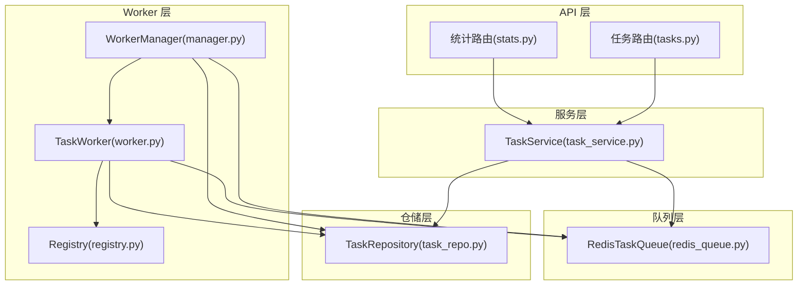
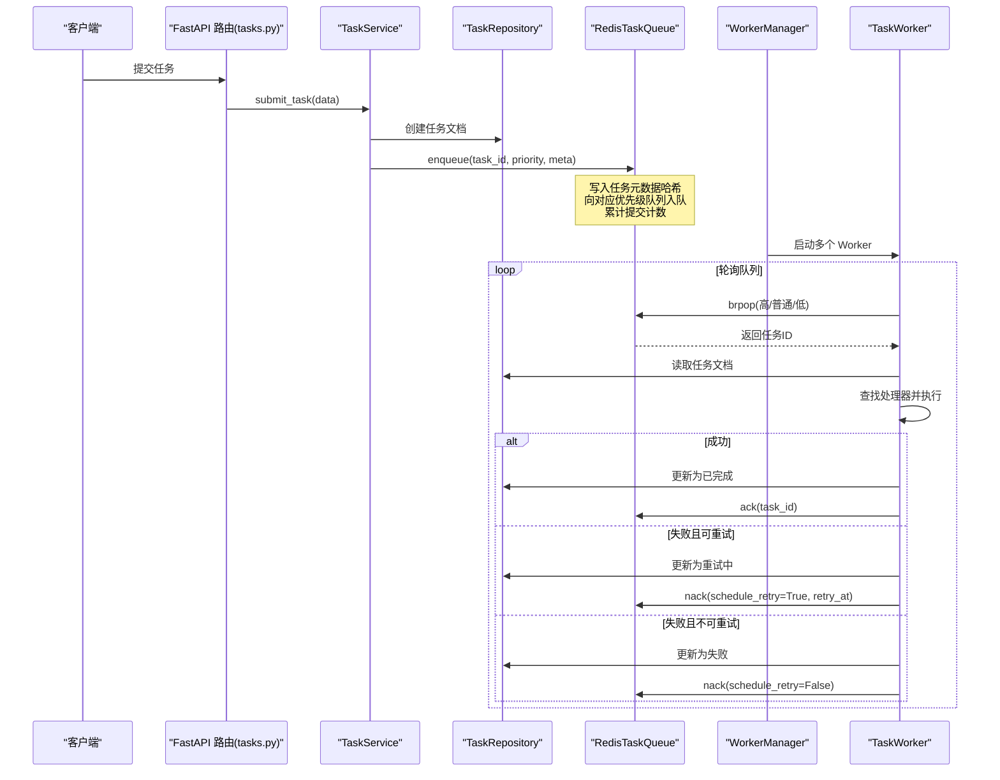
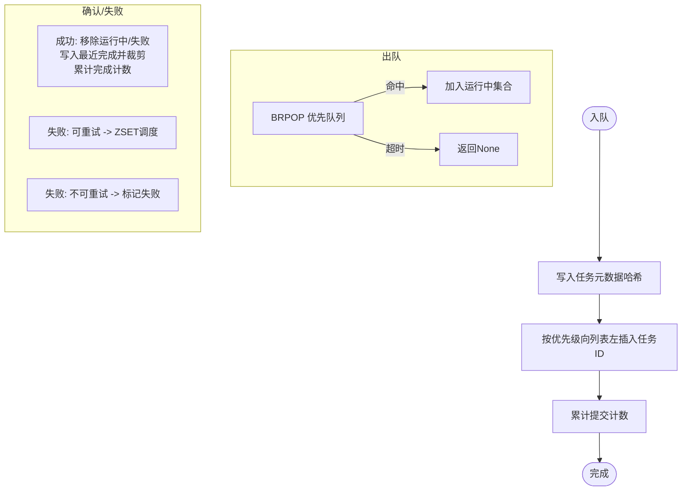
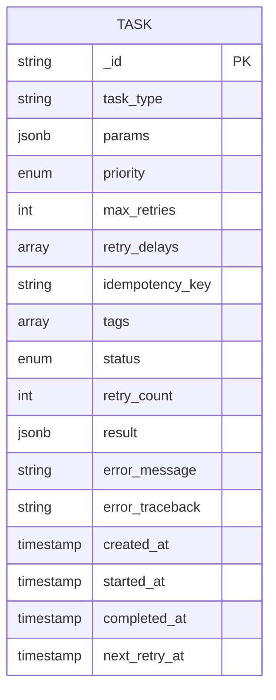
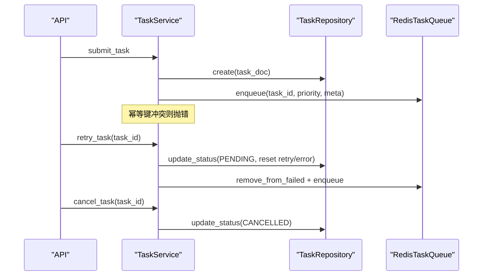
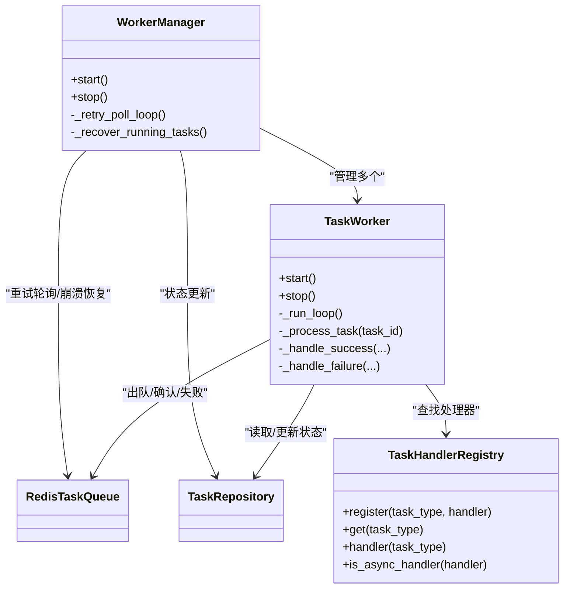
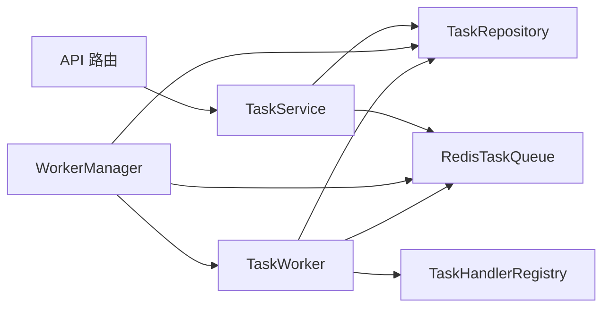

# 任务队列系统

<cite>
**本文引用的文件**
- [redis_queue.py](file://tools/flexloop/src/taolib/testing/task_queue/queue/redis_queue.py)
- [task.py](file://tools/flexloop/src/taolib/testing/task_queue/models/task.py)
- [enums.py](file://tools/flexloop/src/taolib/testing/task_queue/models/enums.py)
- [task_repo.py](file://tools/flexloop/src/taolib/testing/task_queue/repository/task_repo.py)
- [worker.py](file://tools/flexloop/src/taolib/testing/task_queue/worker/worker.py)
- [manager.py](file://tools/flexloop/src/taolib/testing/task_queue/worker/manager.py)
- [registry.py](file://tools/flexloop/src/taolib/testing/task_queue/worker/registry.py)
- [task_service.py](file://tools/flexloop/src/taolib/testing/task_queue/services/task_service.py)
- [tasks.py](file://tools/flexloop/src/taolib/testing/task_queue/server/api/tasks.py)
- [stats.py](file://tools/flexloop/src/taolib/testing/task_queue/server/api/stats.py)
- [test_queue.py](file://tools/flexloop/tests/testing/test_task_queue/test_queue.py)
- [test_worker.py](file://tools/flexloop/tests/testing/test_task_queue/test_worker.py)
</cite>

## 目录
1. [简介](#简介)
2. [项目结构](#项目结构)
3. [核心组件](#核心组件)
4. [架构总览](#架构总览)
5. [详细组件分析](#详细组件分析)
6. [依赖关系分析](#依赖关系分析)
7. [性能考虑](#性能考虑)
8. [故障排查指南](#故障排查指南)
9. [结论](#结论)
10. [附录](#附录)

## 简介
本任务队列系统采用“服务端任务提交 + Redis 队列 + Worker 执行 + MongoDB 持久化”的分层设计，支持高/普通/低三级优先级、自动重试（带指数退避）、幂等提交、崩溃恢复、实时统计与 API 查询。系统通过 FastAPI 提供任务提交、查询、重试、取消等接口，并通过 WorkerManager 管理多 Worker 协程与重试轮询。

## 项目结构
- 队列层：基于 Redis 的优先级队列与重试调度，负责任务入队、出队、确认/失败标记、重试轮询与统计。
- 服务层：TaskService 封装业务逻辑，负责幂等校验、任务创建、重试与取消、统计聚合。
- 仓储层：TaskRepository 基于 Motor 访问 MongoDB，提供任务的 CRUD、过滤与索引。
- Worker 层：TaskWorker 从 Redis 队列拉取任务，调用注册表中的处理器执行，处理成功/失败与重试；WorkerManager 管理多个 Worker、重试轮询与崩溃恢复。
- API 层：FastAPI 路由提供任务提交、查询、重试、取消与统计接口。
- 测试：覆盖队列操作、Worker 生命周期与处理逻辑、重试与崩溃恢复等场景。

图表来源
- [tasks.py:1-205](file://tools/flexloop/src/taolib/testing/task_queue/server/api/tasks.py#L1-L205)
- [stats.py:1-65](file://tools/flexloop/src/taolib/testing/task_queue/server/api/stats.py#L1-L65)
- [task_service.py:1-259](file://tools/flexloop/src/taolib/testing/task_queue/services/task_service.py#L1-L259)
- [redis_queue.py:1-317](file://tools/flexloop/src/taolib/testing/task_queue/queue/redis_queue.py#L1-L317)
- [manager.py:1-225](file://tools/flexloop/src/taolib/testing/task_queue/worker/manager.py#L1-L225)
- [worker.py:1-275](file://tools/flexloop/src/taolib/testing/task_queue/worker/worker.py#L1-L275)
- [registry.py:1-136](file://tools/flexloop/src/taolib/testing/task_queue/worker/registry.py#L1-L136)
- [task_repo.py:1-169](file://tools/flexloop/src/taolib/testing/task_queue/repository/task_repo.py#L1-L169)

章节来源
- [tasks.py:1-205](file://tools/flexloop/src/taolib/testing/task_queue/server/api/tasks.py#L1-L205)
- [stats.py:1-65](file://tools/flexloop/src/taolib/testing/task_queue/server/api/stats.py#L1-L65)
- [task_service.py:1-259](file://tools/flexloop/src/taolib/testing/task_queue/services/task_service.py#L1-L259)
- [redis_queue.py:1-317](file://tools/flexloop/src/taolib/testing/task_queue/queue/redis_queue.py#L1-L317)
- [manager.py:1-225](file://tools/flexloop/src/taolib/testing/task_queue/worker/manager.py#L1-L225)
- [worker.py:1-275](file://tools/flexloop/src/taolib/testing/task_queue/worker/worker.py#L1-L275)
- [registry.py:1-136](file://tools/flexloop/src/taolib/testing/task_queue/worker/registry.py#L1-L136)
- [task_repo.py:1-169](file://tools/flexloop/src/taolib/testing/task_queue/repository/task_repo.py#L1-L169)

## 核心组件
- RedisTaskQueue：基于 Redis 的优先级队列与重试调度，提供入队、阻塞出队、确认/失败标记、重试轮询、任务元数据缓存与统计查询。
- TaskService：封装提交、重试、取消、查询与统计聚合，负责幂等校验与 Redis/MongoDB 的一致性。
- TaskRepository：MongoDB 仓储，提供按状态/类型/优先级查询、索引与 TTL。
- TaskWorker：单个执行协程，负责从队列取任务、调用处理器、状态更新与重试调度。
- WorkerManager：多 Worker 管理器，负责启动/停止、重试轮询与崩溃恢复。
- TaskHandlerRegistry：任务处理器注册表，支持同步/异步处理器注册与查找。
- API 路由：FastAPI 提供任务提交、查询、重试、取消与统计接口。

章节来源
- [redis_queue.py:14-317](file://tools/flexloop/src/taolib/testing/task_queue/queue/redis_queue.py#L14-L317)
- [task_service.py:23-259](file://tools/flexloop/src/taolib/testing/task_queue/services/task_service.py#L23-L259)
- [task_repo.py:15-169](file://tools/flexloop/src/taolib/testing/task_queue/repository/task_repo.py#L15-L169)
- [worker.py:21-275](file://tools/flexloop/src/taolib/testing/task_queue/worker/worker.py#L21-L275)
- [manager.py:25-225](file://tools/flexloop/src/taolib/testing/task_queue/worker/manager.py#L25-L225)
- [registry.py:11-136](file://tools/flexloop/src/taolib/testing/task_queue/worker/registry.py#L11-L136)
- [tasks.py:1-205](file://tools/flexloop/src/taolib/testing/task_queue/server/api/tasks.py#L1-L205)
- [stats.py:1-65](file://tools/flexloop/src/taolib/testing/task_queue/server/api/stats.py#L1-L65)

## 架构总览
系统采用“API -> 服务层 -> 队列层/仓储层 -> Worker 层”的分层架构。API 接收任务提交与查询请求，服务层进行幂等与业务校验，队列层负责任务调度与统计，仓储层持久化任务状态，Worker 层实际执行任务并处理重试与失败。

图表来源
- [tasks.py:117-140](file://tools/flexloop/src/taolib/testing/task_queue/server/api/tasks.py#L117-L140)
- [task_service.py:43-94](file://tools/flexloop/src/taolib/testing/task_queue/services/task_service.py#L43-L94)
- [redis_queue.py:58-103](file://tools/flexloop/src/taolib/testing/task_queue/queue/redis_queue.py#L58-L103)
- [worker.py:102-273](file://tools/flexloop/src/taolib/testing/task_queue/worker/worker.py#L102-L273)
- [manager.py:73-102](file://tools/flexloop/src/taolib/testing/task_queue/worker/manager.py#L73-L102)

## 详细组件分析

### 队列实现机制（Redis 集成、消息序列化与持久化）
- 键空间设计：使用统一前缀，区分队列（高/普通/低）、运行中、完成、失败、重试、任务元数据哈希与全局统计。
- 入队：写入任务元数据哈希，向对应优先级列表左插入任务 ID，原子增加提交计数。
- 出队：BRPOP 顺序检查高/普通/低队列，命中后将任务 ID 加入运行中集合。
- 确认/失败：成功时从运行中移除、写入最近完成列表并裁剪至固定长度、累计完成计数；失败时可选择重试（ZSET 调度）或直接标记失败。
- 重试轮询：定时扫描到期的重试任务，重新入队并更新状态。
- 统计：一次性 pipeline 查询各队列长度、运行/失败/完成/重试计数与累计计数。
- 元数据缓存：任务元数据以哈希形式缓存，便于快速读取任务类型与优先级。

图表来源
- [redis_queue.py:58-194](file://tools/flexloop/src/taolib/testing/task_queue/queue/redis_queue.py#L58-L194)
- [redis_queue.py:226-289](file://tools/flexloop/src/taolib/testing/task_queue/queue/redis_queue.py#L226-L289)

章节来源
- [redis_queue.py:14-317](file://tools/flexloop/src/taolib/testing/task_queue/queue/redis_queue.py#L14-L317)

### 仓库模式（任务状态跟踪、历史记录与统计）
- 状态跟踪：MongoDB 文档模型包含状态、重试次数、结果、错误信息、时间戳等字段，支持按状态/类型/优先级查询。
- 历史记录：完成列表保留最近固定数量的任务 ID，配合 Redis 的完成计数与累计统计。
- 统计分析：服务层聚合 Redis 实时统计与 MongoDB 持久统计，提供全局与队列深度统计。
- 索引与 TTL：为任务类型、状态+优先级、幂等键建立索引，并设置创建时间 TTL 自动清理。

图表来源
- [task.py:68-105](file://tools/flexloop/src/taolib/testing/task_queue/models/task.py#L68-L105)
- [task_repo.py:159-166](file://tools/flexloop/src/taolib/testing/task_queue/repository/task_repo.py#L159-L166)

章节来源
- [task.py:1-107](file://tools/flexloop/src/taolib/testing/task_queue/models/task.py#L1-L107)
- [task_repo.py:15-169](file://tools/flexloop/src/taolib/testing/task_queue/repository/task_repo.py#L15-L169)

### 服务层设计（任务调度、执行监控与结果处理）
- 任务提交：幂等键检查、生成任务 ID、写入 MongoDB、入队 Redis。
- 重试与取消：仅允许特定状态的任务进行重试/取消，重置状态并更新 Redis/MongoDB。
- 统计聚合：合并 Redis 实时统计与 MongoDB 计数，提供统一视图。
- 结果处理：成功时清理失败记录、写入完成列表并裁剪，失败时按策略调度重试或标记失败。

图表来源
- [task_service.py:43-190](file://tools/flexloop/src/taolib/testing/task_queue/services/task_service.py#L43-L190)
- [tasks.py:117-177](file://tools/flexloop/src/taolib/testing/task_queue/server/api/tasks.py#L117-L177)

章节来源
- [task_service.py:23-259](file://tools/flexloop/src/taolib/testing/task_queue/services/task_service.py#L23-L259)
- [tasks.py:1-205](file://tools/flexloop/src/taolib/testing/task_queue/server/api/tasks.py#L1-L205)

### Worker 管理机制（工作进程池、任务分配与故障恢复）
- 工作进程池：WorkerManager 启动指定数量的 TaskWorker 协程，每个协程独立从队列取任务并执行。
- 任务分配：TaskWorker 使用 Redis BRPOP 按优先级顺序出队，避免饥饿。
- 故障恢复：启动时扫描运行中集合，识别超时任务并重新入队；重试轮询周期性将到期任务重新入队。
- 处理器注册：TaskHandlerRegistry 支持同步/异步处理器注册与查找，自动在线程池中执行同步处理器。

图表来源
- [manager.py:25-225](file://tools/flexloop/src/taolib/testing/task_queue/worker/manager.py#L25-L225)
- [worker.py:21-275](file://tools/flexloop/src/taolib/testing/task_queue/worker/worker.py#L21-L275)
- [registry.py:11-136](file://tools/flexloop/src/taolib/testing/task_queue/worker/registry.py#L11-L136)
- [redis_queue.py:14-317](file://tools/flexloop/src/taolib/testing/task_queue/queue/redis_queue.py#L14-L317)
- [task_repo.py:15-169](file://tools/flexloop/src/taolib/testing/task_queue/repository/task_repo.py#L15-L169)

章节来源
- [manager.py:1-225](file://tools/flexloop/src/taolib/testing/task_queue/worker/manager.py#L1-L225)
- [worker.py:1-275](file://tools/flexloop/src/taolib/testing/task_queue/worker/worker.py#L1-L275)
- [registry.py:1-136](file://tools/flexloop/src/taolib/testing/task_queue/worker/registry.py#L1-L136)

### 任务配置示例（任务类型、参数传递与回调处理）
- 任务类型与参数：通过任务模型定义任务类型与参数字典，支持自定义标签与幂等键。
- 回调处理：通过注册表装饰器注册异步/同步处理器，处理器接收参数字典并返回结果字典。
- 重试策略：可配置最大重试次数与每次重试延迟（指数递增）。

章节来源
- [task.py:15-30](file://tools/flexloop/src/taolib/testing/task_queue/models/task.py#L15-L30)
- [registry.py:69-89](file://tools/flexloop/src/taolib/testing/task_queue/worker/registry.py#L69-L89)
- [worker.py:154-177](file://tools/flexloop/src/taolib/testing/task_queue/worker/worker.py#L154-L177)

## 依赖关系分析
- 组件耦合：服务层同时依赖仓储与队列；Worker 层依赖队列与仓储及注册表；API 层依赖服务层。
- 外部依赖：Redis（异步客户端）、MongoDB（Motor 异步驱动）、FastAPI（路由与请求上下文）。
- 循环依赖：未发现循环导入；模块职责清晰，接口边界明确。

图表来源
- [tasks.py:34-44](file://tools/flexloop/src/taolib/testing/task_queue/server/api/tasks.py#L34-L44)
- [task_service.py:29-42](file://tools/flexloop/src/taolib/testing/task_queue/services/task_service.py#L29-L42)
- [manager.py:34-56](file://tools/flexloop/src/taolib/testing/task_queue/worker/manager.py#L34-L56)
- [worker.py:28-47](file://tools/flexloop/src/taolib/testing/task_queue/worker/worker.py#L28-L47)
- [registry.py:27-48](file://tools/flexloop/src/taolib/testing/task_queue/worker/registry.py#L27-L48)

章节来源
- [tasks.py:1-205](file://tools/flexloop/src/taolib/testing/task_queue/server/api/tasks.py#L1-L205)
- [task_service.py:1-259](file://tools/flexloop/src/taolib/testing/task_queue/services/task_service.py#L1-L259)
- [manager.py:1-225](file://tools/flexloop/src/taolib/testing/task_queue/worker/manager.py#L1-L225)
- [worker.py:1-275](file://tools/flexloop/src/taolib/testing/task_queue/worker/worker.py#L1-L275)
- [registry.py:1-136](file://tools/flexloop/src/taolib/testing/task_queue/worker/registry.py#L1-L136)

## 性能考虑
- 队列与统计：使用 pipeline 批量读取统计，减少 RTT；完成列表裁剪避免无限增长。
- 并发控制：Worker 数量可配置，通过 BRPOP 顺序消费避免低优先级饥饿；异步处理器直接 await，同步处理器通过线程池执行。
- 扩展性设计：Redis 键空间清晰，支持水平扩展；WorkerManager 可动态调整 Worker 数量。
- 重试策略：指数退避降低瞬时峰值压力；重试轮询间隔可调，平衡及时性与资源消耗。

## 故障排查指南
- 队列测试：验证入队/出队、优先级顺序、重试轮询与统计准确性。
- Worker 测试：覆盖成功/失败/重试、无处理器、孤儿任务、崩溃恢复等场景。
- 常见问题：
  - 任务长时间无进展：检查运行中集合与崩溃恢复逻辑。
  - 重试未生效：确认 Redis 重试 ZSET 与轮询间隔配置。
  - 幂等冲突：检查幂等键是否重复提交。
  - 处理器缺失：确认注册表中是否存在对应任务类型处理器。

章节来源
- [test_queue.py:94-398](file://tools/flexloop/tests/testing/test_task_queue/test_queue.py#L94-L398)
- [test_worker.py:82-494](file://tools/flexloop/tests/testing/test_task_queue/test_worker.py#L82-L494)

## 结论
该任务队列系统通过 Redis 实现高性能的优先级队列与重试调度，结合 MongoDB 的持久化能力与 WorkerManager 的多协程执行模型，提供了完整的任务生命周期管理。系统具备良好的扩展性与可观测性，适合在高并发与复杂重试需求场景下稳定运行。

## 附录
- API 路由概览
  - GET /tasks：分页查询任务，支持按状态/类型/优先级过滤。
  - GET /tasks/{task_id}：获取任务详情。
  - POST /tasks：提交新任务（支持幂等键与重试策略）。
  - POST /tasks/{task_id}/retry：手动重试失败任务。
  - POST /tasks/{task_id}/cancel：取消 PENDING/RETRYING 任务。
  - DELETE /tasks/{task_id}：删除终态任务。
  - GET /stats：获取全局统计。
  - GET /stats/queue-depths：获取队列深度。

章节来源
- [tasks.py:79-203](file://tools/flexloop/src/taolib/testing/task_queue/server/api/tasks.py#L79-L203)
- [stats.py:37-63](file://tools/flexloop/src/taolib/testing/task_queue/server/api/stats.py#L37-L63)