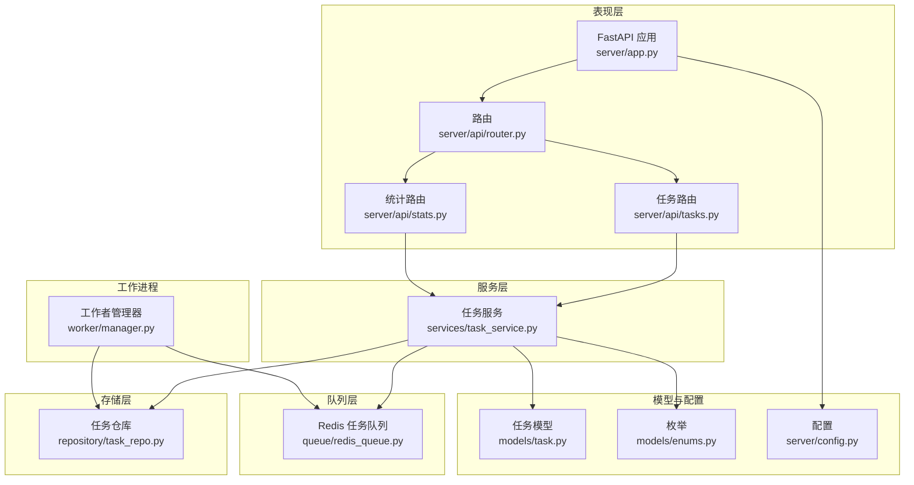
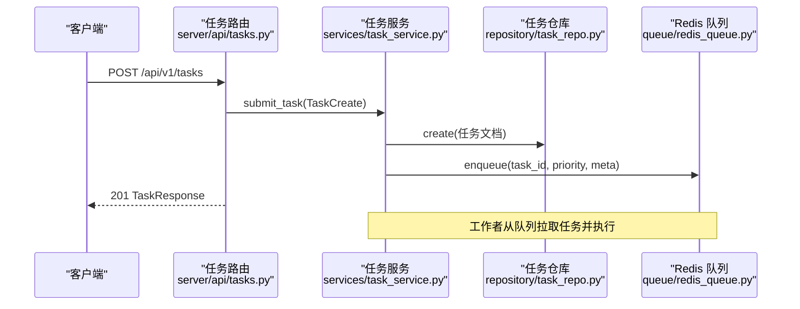
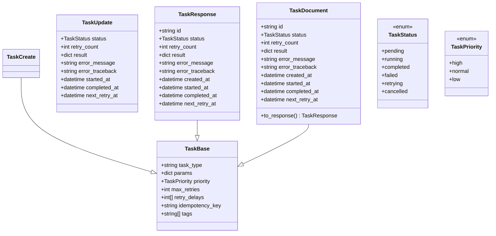
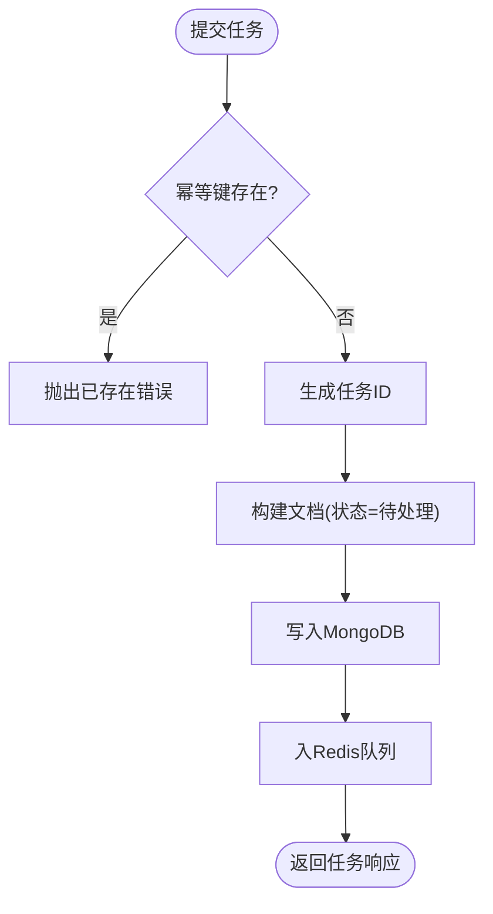
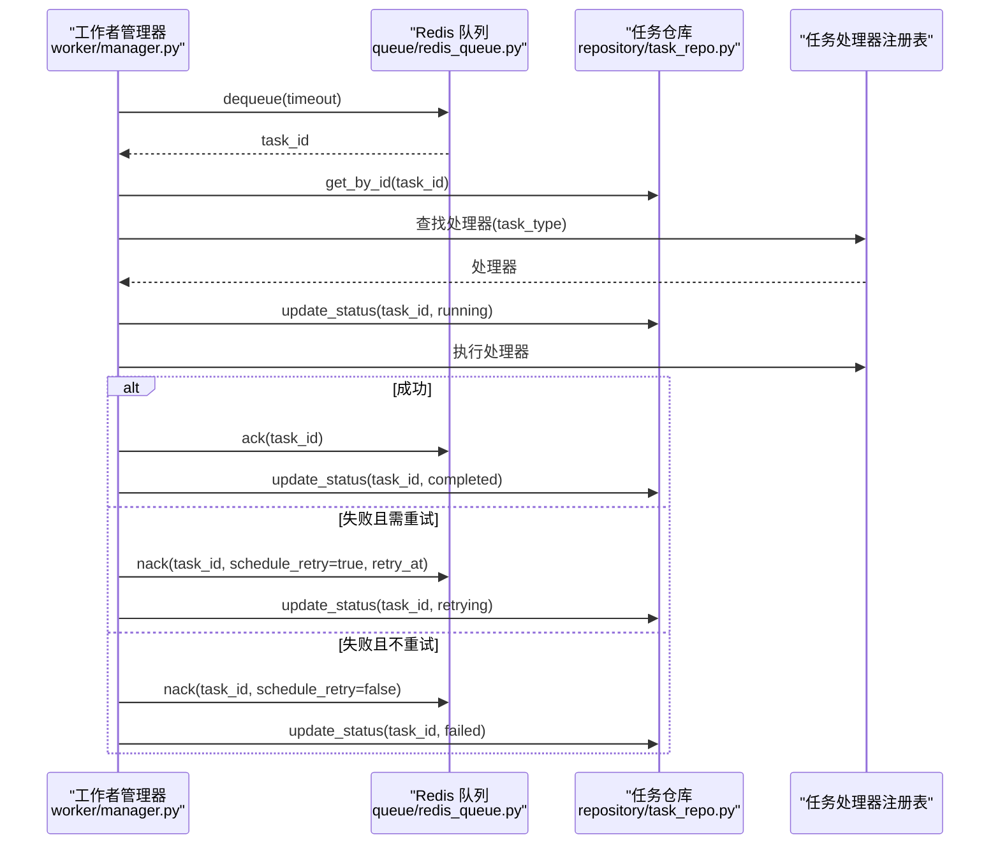
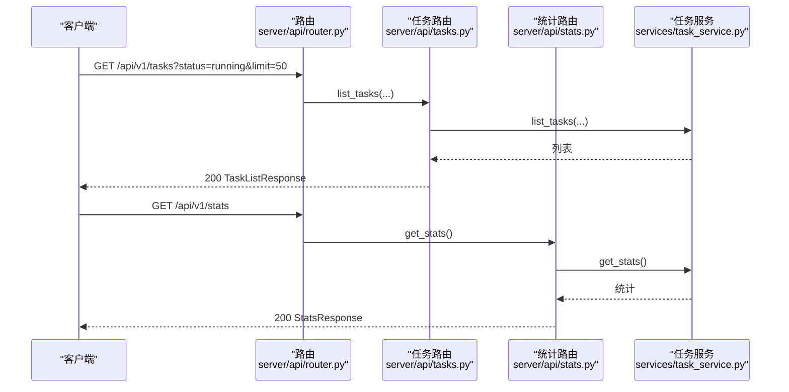
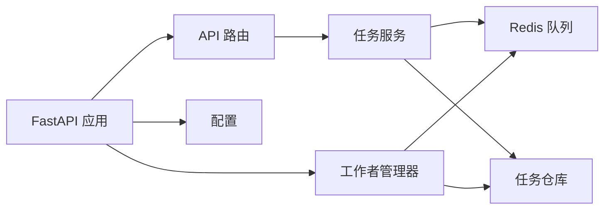

# 服务层设计

<cite>
**本文引用的文件**
- [app.py](file://tools/flexloop/src/taolib/testing/task_queue/server/app.py)
- [config.py](file://tools/flexloop/src/taolib/testing/task_queue/server/config.py)
- [router.py](file://tools/flexloop/src/taolib/testing/task_queue/server/api/router.py)
- [tasks.py](file://tools/flexloop/src/taolib/testing/task_queue/server/api/tasks.py)
- [stats.py](file://tools/flexloop/src/taolib/testing/task_queue/server/api/stats.py)
- [task_service.py](file://tools/flexloop/src/taolib/testing/task_queue/services/task_service.py)
- [task.py](file://tools/flexloop/src/taolib/testing/task_queue/models/task.py)
- [enums.py](file://tools/flexloop/src/taolib/testing/task_queue/models/enums.py)
- [task_repo.py](file://tools/flexloop/src/taolib/testing/task_queue/repository/task_repo.py)
- [redis_queue.py](file://tools/flexloop/src/taolib/testing/task_queue/queue/redis_queue.py)
- [manager.py](file://tools/flexloop/src/taolib/testing/task_queue/worker/manager.py)
</cite>

## 目录
1. [简介](#简介)
2. [项目结构](#项目结构)
3. [核心组件](#核心组件)
4. [架构总览](#架构总览)
5. [详细组件分析](#详细组件分析)
6. [依赖关系分析](#依赖关系分析)
7. [性能考量](#性能考量)
8. [故障排查指南](#故障排查指南)
9. [结论](#结论)
10. [附录](#附录)

## 简介
本文件面向任务队列服务层，系统化阐述其架构设计与实现细节，覆盖任务调度逻辑、执行监控与结果处理机制；详述任务服务实现（创建、状态更新、生命周期管理）；解释API接口设计（RESTful端点、请求校验与响应格式）；提供监控能力（统计、指标采集与异常处理）；给出配置项（并发、超时与重试策略）；并通过序列图与类图展示服务集成与交互方式。

## 项目结构
任务队列服务采用分层架构：
- 表现层：FastAPI 应用与路由，提供 REST 接口与监控仪表盘
- 服务层：TaskService 封装业务逻辑（提交、查询、重试、取消、统计）
- 队列层：RedisTaskQueue 基于 Redis 的优先级队列与重试调度
- 存储层：TaskRepository 基于 MongoDB 的持久化
- 工作进程：WorkerManager 管理多工作者协程、重试轮询与崩溃恢复
- 模型与枚举：Pydantic 模型与状态/优先级枚举

图表来源
- [app.py:1-98](file://tools/flexloop/src/taolib/testing/task_queue/server/app.py#L1-L98)
- [router.py](file://tools/flexloop/src/taolib/testing/task_queue/server/api/router.py)
- [tasks.py:1-205](file://tools/flexloop/src/taolib/testing/task_queue/server/api/tasks.py#L1-L205)
- [stats.py:1-65](file://tools/flexloop/src/taolib/testing/task_queue/server/api/stats.py#L1-L65)
- [task_service.py:1-259](file://tools/flexloop/src/taolib/testing/task_queue/services/task_service.py#L1-L259)
- [redis_queue.py:1-317](file://tools/flexloop/src/taolib/testing/task_queue/queue/redis_queue.py#L1-L317)
- [task_repo.py:1-169](file://tools/flexloop/src/taolib/testing/task_queue/repository/task_repo.py#L1-L169)
- [manager.py:1-225](file://tools/flexloop/src/taolib/testing/task_queue/worker/manager.py#L1-L225)
- [task.py:1-107](file://tools/flexloop/src/taolib/testing/task_queue/models/task.py#L1-L107)
- [enums.py:1-28](file://tools/flexloop/src/taolib/testing/task_queue/models/enums.py#L1-L28)
- [config.py:1-48](file://tools/flexloop/src/taolib/testing/task_queue/server/config.py#L1-L48)

章节来源
- [app.py:1-98](file://tools/flexloop/src/taolib/testing/task_queue/server/app.py#L1-L98)
- [config.py:1-48](file://tools/flexloop/src/taolib/testing/task_queue/server/config.py#L1-L48)

## 核心组件
- 任务模型与枚举：定义任务的输入/输出/文档形态与状态、优先级
- 任务服务：封装提交、查询、重试、取消、统计等业务逻辑
- Redis 队列：优先级队列、重试调度、运行中跟踪与统计
- 任务仓库：MongoDB 持久化与索引、过滤查询
- 工作者管理器：多工作者生命周期、重试轮询、崩溃恢复
- API 路由：RESTful 接口、请求校验、响应格式
- 配置：MongoDB/Redis 连接、工作者数量、CORS、主机端口等

章节来源
- [task.py:1-107](file://tools/flexloop/src/taolib/testing/task_queue/models/task.py#L1-L107)
- [enums.py:1-28](file://tools/flexloop/src/taolib/testing/task_queue/models/enums.py#L1-L28)
- [task_service.py:1-259](file://tools/flexloop/src/taolib/testing/task_queue/services/task_service.py#L1-L259)
- [redis_queue.py:1-317](file://tools/flexloop/src/taolib/testing/task_queue/queue/redis_queue.py#L1-L317)
- [task_repo.py:1-169](file://tools/flexloop/src/taolib/testing/task_queue/repository/task_repo.py#L1-L169)
- [manager.py:1-225](file://tools/flexloop/src/taolib/testing/task_queue/worker/manager.py#L1-L225)
- [tasks.py:1-205](file://tools/flexloop/src/taolib/testing/task_queue/server/api/tasks.py#L1-L205)
- [stats.py:1-65](file://tools/flexloop/src/taolib/testing/task_queue/server/api/stats.py#L1-L65)
- [config.py:1-48](file://tools/flexloop/src/taolib/testing/task_queue/server/config.py#L1-L48)

## 架构总览
服务层通过 FastAPI 提供 REST 接口，内部以 TaskService 为核心协调 Redis 队列与 MongoDB 仓库。工作者管理器驱动多个 TaskWorker 并发拉取任务、执行处理器并更新状态。Redis 作为高性能队列与实时统计中心，MongoDB 作为持久化与历史统计来源。

图表来源
- [tasks.py:117-140](file://tools/flexloop/src/taolib/testing/task_queue/server/api/tasks.py#L117-L140)
- [task_service.py:43-94](file://tools/flexloop/src/taolib/testing/task_queue/services/task_service.py#L43-L94)
- [task_repo.py:15-24](file://tools/flexloop/src/taolib/testing/task_queue/repository/task_repo.py#L15-L24)
- [redis_queue.py:58-80](file://tools/flexloop/src/taolib/testing/task_queue/queue/redis_queue.py#L58-L80)

## 详细组件分析

### 任务模型与状态机
- 输入模型：TaskCreate（任务类型、参数、优先级、重试策略、幂等键、标签）
- 输出模型：TaskResponse（包含状态、重试计数、结果、错误信息、时间戳）
- 文档模型：TaskDocument（持久化字段与默认值）
- 状态机：PENDING → RUNNING → COMPLETED/FAILED；FAILED 可 RETRYING；支持取消
- 优先级：HIGH/NORMAL/LOW

图表来源
- [task.py:15-107](file://tools/flexloop/src/taolib/testing/task_queue/models/task.py#L15-L107)
- [enums.py:9-27](file://tools/flexloop/src/taolib/testing/task_queue/models/enums.py#L9-L27)

章节来源
- [task.py:15-107](file://tools/flexloop/src/taolib/testing/task_queue/models/task.py#L15-L107)
- [enums.py:9-27](file://tools/flexloop/src/taolib/testing/task_queue/models/enums.py#L9-L27)

### 任务服务实现
- 提交任务：幂等键检查、生成任务ID、写入MongoDB、入Redis队列
- 查询任务：按ID获取任务文档
- 手动重试：仅对FAILED任务重置状态并重新入队
- 取消任务：仅对PENDING/RETRYING任务标记为CANCELLED
- 列表查询：按状态/类型/优先级过滤
- 统计：合并Redis实时统计与MongoDB计数

图表来源
- [task_service.py:43-94](file://tools/flexloop/src/taolib/testing/task_queue/services/task_service.py#L43-L94)
- [task_repo.py:15-24](file://tools/flexloop/src/taolib/testing/task_queue/repository/task_repo.py#L15-L24)
- [redis_queue.py:58-80](file://tools/flexloop/src/taolib/testing/task_queue/queue/redis_queue.py#L58-L80)

章节来源
- [task_service.py:43-191](file://tools/flexloop/src/taolib/testing/task_queue/services/task_service.py#L43-L191)
- [task_repo.py:26-157](file://tools/flexloop/src/taolib/testing/task_queue/repository/task_repo.py#L26-L157)
- [redis_queue.py:58-104](file://tools/flexloop/src/taolib/testing/task_queue/queue/redis_queue.py#L58-L104)

### Redis 任务队列
- 键空间：队列(high/normal/low)、运行中集合、完成/失败集合、重试ZSET、任务元数据HASH、全局计数HASH
- 入队/出队：BRPOP按优先级顺序阻塞弹出
- 成功/失败确认：ack/nack，支持调度重试或标记失败
- 重试轮询：定时扫描到期任务并重新入队
- 统计：一次性pipeline聚合队列长度、运行中、失败、完成、重试数与累计计数

图表来源
- [manager.py:138-168](file://tools/flexloop/src/taolib/testing/task_queue/worker/manager.py#L138-L168)
- [redis_queue.py:81-157](file://tools/flexloop/src/taolib/testing/task_queue/queue/redis_queue.py#L81-L157)
- [task_repo.py:92-109](file://tools/flexloop/src/taolib/testing/task_queue/repository/task_repo.py#L92-L109)

章节来源
- [redis_queue.py:14-317](file://tools/flexloop/src/taolib/testing/task_queue/queue/redis_queue.py#L14-L317)
- [manager.py:25-225](file://tools/flexloop/src/taolib/testing/task_queue/worker/manager.py#L25-L225)

### API 接口设计
- 任务路由
  - GET /api/v1/tasks：分页查询（支持状态/类型/优先级过滤）
  - GET /api/v1/tasks/{id}：获取任务详情
  - POST /api/v1/tasks：提交任务（幂等键、重试策略、标签）
  - POST /api/v1/tasks/{id}/retry：手动重试（仅FAILED）
  - POST /api/v1/tasks/{id}/cancel：取消任务（仅PENDING/RETRYING）
  - DELETE /api/v1/tasks/{id}：删除终态任务（COMPLETED/FAILED/CANCELLED）
- 统计路由
  - GET /api/v1/stats：全局统计（持久+实时）
  - GET /api/v1/stats/queue-depths：队列深度
- 请求校验与响应格式
  - 使用 Pydantic 模型进行输入校验
  - 响应统一为 TaskResponse 或自定义响应模型

图表来源
- [tasks.py:79-100](file://tools/flexloop/src/taolib/testing/task_queue/server/api/tasks.py#L79-L100)
- [tasks.py:103-115](file://tools/flexloop/src/taolib/testing/task_queue/server/api/tasks.py#L103-L115)
- [tasks.py:117-140](file://tools/flexloop/src/taolib/testing/task_queue/server/api/tasks.py#L117-L140)
- [tasks.py:142-178](file://tools/flexloop/src/taolib/testing/task_queue/server/api/tasks.py#L142-L178)
- [tasks.py:180-204](file://tools/flexloop/src/taolib/testing/task_queue/server/api/tasks.py#L180-L204)
- [stats.py:37-51](file://tools/flexloop/src/taolib/testing/task_queue/server/api/stats.py#L37-L51)
- [stats.py:53-62](file://tools/flexloop/src/taolib/testing/task_queue/server/api/stats.py#L53-L62)

章节来源
- [tasks.py:1-205](file://tools/flexloop/src/taolib/testing/task_queue/server/api/tasks.py#L1-L205)
- [stats.py:1-65](file://tools/flexloop/src/taolib/testing/task_queue/server/api/stats.py#L1-L65)

### 监控与仪表盘
- 内置 HTML 仪表盘：展示总览、队列深度、运行中与最近失败任务
- 前端通过 /api/v1/stats 与 /api/v1/tasks 拉取数据
- 支持手动重试失败任务

章节来源
- [app.py:92-394](file://tools/flexloop/src/taolib/testing/task_queue/server/app.py#L92-L394)

### 配置选项
- MongoDB：连接串、数据库名
- Redis：连接串、键前缀
- Worker：工作者数量（1–20）
- 服务器：主机、端口、调试、CORS 源

章节来源
- [config.py:10-48](file://tools/flexloop/src/taolib/testing/task_queue/server/config.py#L10-L48)

## 依赖关系分析
- 组件耦合
  - TaskService 依赖 TaskRepository 与 RedisTaskQueue，职责清晰
  - WorkerManager 依赖 RedisTaskQueue、TaskRepository、处理器注册表
  - API 路由通过工厂函数注入服务实例
- 外部依赖
  - FastAPI（Web 框架）、Redis（异步客户端）、MongoDB（Motor 异步驱动）
- 潜在环路
  - 无直接循环导入；通过模块导入与运行时装配避免环路

图表来源
- [app.py:19-67](file://tools/flexloop/src/taolib/testing/task_queue/server/app.py#L19-L67)
- [tasks.py:34-44](file://tools/flexloop/src/taolib/testing/task_queue/server/api/tasks.py#L34-L44)
- [stats.py:37-51](file://tools/flexloop/src/taolib/testing/task_queue/server/api/stats.py#L37-L51)

章节来源
- [app.py:19-67](file://tools/flexloop/src/taolib/testing/task_queue/server/app.py#L19-L67)
- [tasks.py:34-44](file://tools/flexloop/src/taolib/testing/task_queue/server/api/tasks.py#L34-L44)
- [stats.py:37-51](file://tools/flexloop/src/taolib/testing/task_queue/server/api/stats.py#L37-L51)

## 性能考量
- 队列与统计
  - Redis 列表/集合/ZSET 实现高效优先级队列与重试调度
  - pipeline 批量读取统计，降低 RTT
- 并发与吞吐
  - 多工作者并发拉取与执行，可通过配置调整工作者数量
  - 出队使用阻塞式 BRPOP，减少空转
- 持久化与索引
  - MongoDB 索引覆盖常用查询（状态、类型、优先级、幂等键、TTL）
- 超时与重试
  - 重试策略可配置；崩溃恢复检测长时间运行任务并回收

[本节为通用性能建议，无需特定文件引用]

## 故障排查指南
- 常见错误与处理
  - 任务不存在：TaskNotFoundError，API 返回 404
  - 幂等键冲突：TaskAlreadyExistsError，API 返回 409
  - 状态不允许：非法操作（如非FAILED重试、非PENDING/RETRYING取消）返回 400
- 日志与可观测性
  - 服务层关键路径打印日志（提交、重试、取消）
  - 仪表盘展示运行中与失败任务，支持手动重试
- 崩溃恢复
  - 启动时扫描运行中任务，超时任务重新入队并更新状态

章节来源
- [task_service.py:113-191](file://tools/flexloop/src/taolib/testing/task_queue/services/task_service.py#L113-L191)
- [tasks.py:146-177](file://tools/flexloop/src/taolib/testing/task_queue/server/api/tasks.py#L146-L177)
- [manager.py:169-222](file://tools/flexloop/src/taolib/testing/task_queue/worker/manager.py#L169-L222)

## 结论
该任务队列服务层以清晰的分层与职责划分实现了高可用、可观测的任务调度体系：Redis 高效队列与统计、MongoDB 持久化与历史分析、FastAPI 易用接口与内置仪表盘、多工作者并发与崩溃恢复。通过幂等键、重试策略与严格的终态约束，保障了任务可靠性与一致性。

## 附录

### API 端点一览
- GET /api/v1/tasks
  - 查询参数：skip、limit、status、task_type、priority
  - 响应：TaskListResponse(items, total)
- GET /api/v1/tasks/{id}
  - 响应：TaskResponse
- POST /api/v1/tasks
  - 请求体：SubmitTaskRequest（task_type、params、priority、max_retries、retry_delays、idempotency_key、tags）
  - 响应：TaskResponse（201）
- POST /api/v1/tasks/{id}/retry
  - 响应：TaskResponse
- POST /api/v1/tasks/{id}/cancel
  - 响应：TaskResponse
- DELETE /api/v1/tasks/{id}
  - 响应：204（仅终态任务）
- GET /api/v1/stats
  - 响应：StatsResponse（持久+实时统计）
- GET /api/v1/stats/queue-depths
  - 响应：QueueDepthsResponse

章节来源
- [tasks.py:79-204](file://tools/flexloop/src/taolib/testing/task_queue/server/api/tasks.py#L79-L204)
- [stats.py:37-62](file://tools/flexloop/src/taolib/testing/task_queue/server/api/stats.py#L37-L62)