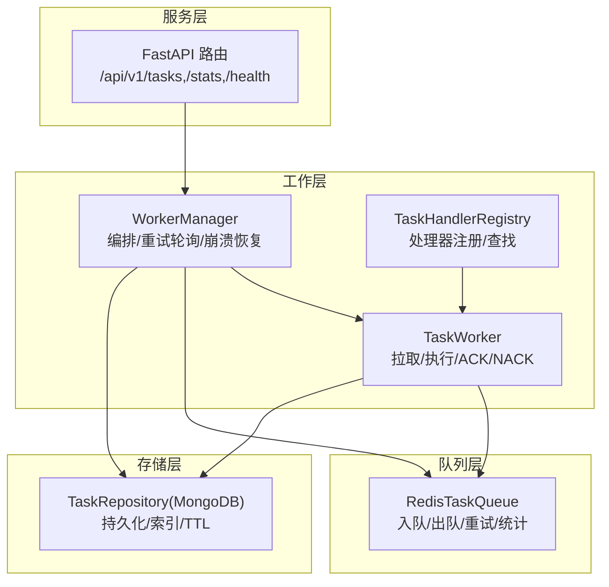
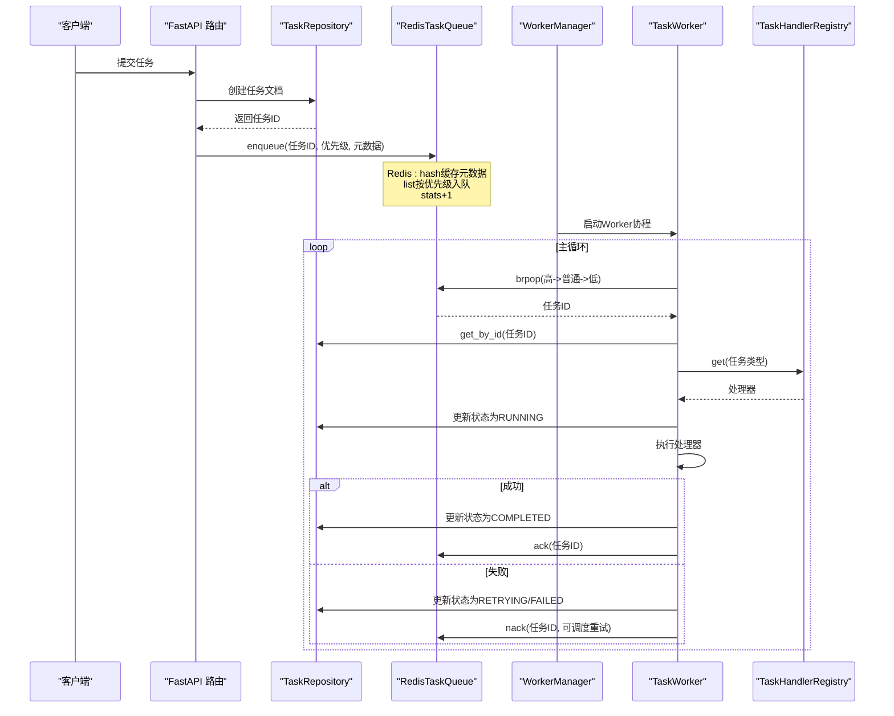
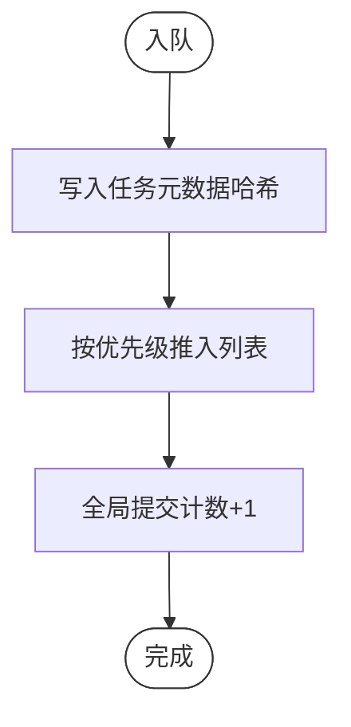
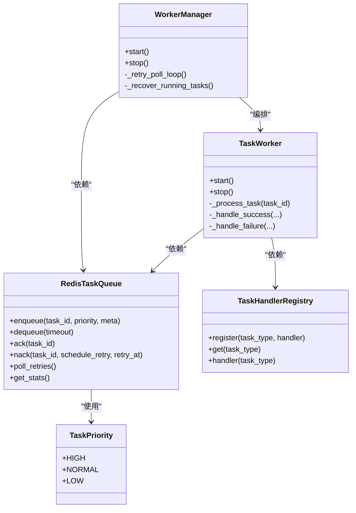
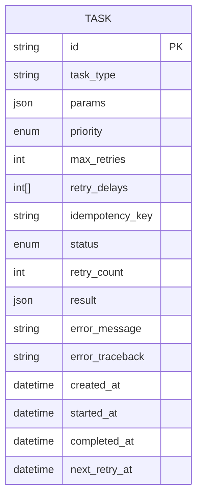
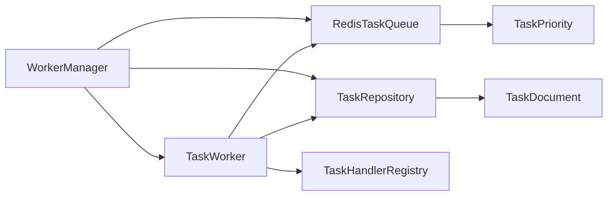

# 队列管理

<cite>
**本文引用的文件**
- [redis_queue.py](file://tools/flexloop/src/taolib/testing/task_queue/queue/redis_queue.py)
- [enums.py](file://tools/flexloop/src/taolib/testing/task_queue/models/enums.py)
- [task.py](file://tools/flexloop/src/taolib/testing/task_queue/models/task.py)
- [manager.py](file://tools/flexloop/src/taolib/testing/task_queue/worker/manager.py)
- [worker.py](file://tools/flexloop/src/taolib/testing/task_queue/worker/worker.py)
- [registry.py](file://tools/flexloop/src/taolib/testing/task_queue/worker/registry.py)
- [task_repo.py](file://tools/flexloop/src/taolib/testing/task_queue/repository/task_repo.py)
- [router.py](file://tools/flexloop/src/taolib/testing/task_queue/server/api/router.py)
- [errors.py](file://tools/flexloop/src/taolib/testing/task_queue/errors.py)
- [__init__.py](file://tools/flexloop/src/taolib/testing/task_queue/__init__.py)
</cite>

## 目录
1. [简介](#简介)
2. [项目结构](#项目结构)
3. [核心组件](#核心组件)
4. [架构总览](#架构总览)
5. [详细组件分析](#详细组件分析)
6. [依赖分析](#依赖分析)
7. [性能考虑](#性能考虑)
8. [故障排查指南](#故障排查指南)
9. [结论](#结论)
10. [附录](#附录)

## 简介
本技术文档面向“队列管理系统”，聚焦于基于 Redis 的任务队列实现，涵盖以下主题：
- Redis 队列实现机制：队列类型定义、消息序列化与反序列化、键空间组织
- 任务优先级管理：优先级队列、任务排序与调度策略
- 队列持久化机制：Redis 数据结构选择、MongoDB 持久化、内存优化与备份策略
- 配置示例：队列参数、超时与重试机制
- 监控指标：队列长度、处理速度、延迟统计
- 扩展性设计：水平扩展、负载均衡与故障转移

该系统以 Redis 作为主要任务分发与状态流转介质，结合 MongoDB 完成任务生命周期的持久化记录，并通过 WorkerManager 统一编排多个 Worker 协程进行并发处理。

## 项目结构
队列系统位于工具模块 tools/flexloop 下，核心目录与职责如下：
- queue：Redis 队列实现，包含入队、出队、重试调度、统计查询等
- worker：Worker 协程、WorkerManager 管理器、处理器注册表
- repository：MongoDB 任务仓库，提供 CRUD 与索引
- server/api：FastAPI 路由聚合，暴露任务、统计与健康检查接口
- models：任务与优先级等枚举模型
- errors：自定义异常体系
- __init__.py：模块导出与使用说明

图表来源
- [redis_queue.py:14-317](file://tools/flexloop/src/taolib/testing/task_queue/queue/redis_queue.py#L14-L317)
- [manager.py:25-225](file://tools/flexloop/src/taolib/testing/task_queue/worker/manager.py#L25-L225)
- [worker.py:21-275](file://tools/flexloop/src/taolib/testing/task_queue/worker/worker.py#L21-L275)
- [registry.py:11-136](file://tools/flexloop/src/taolib/testing/task_queue/worker/registry.py#L11-L136)
- [task_repo.py:15-169](file://tools/flexloop/src/taolib/testing/task_queue/repository/task_repo.py#L15-L169)
- [router.py:1-15](file://tools/flexloop/src/taolib/testing/task_queue/server/api/router.py#L1-L15)

章节来源
- [__init__.py:1-75](file://tools/flexloop/src/taolib/testing/task_queue/__init__.py#L1-L75)

## 核心组件
- RedisTaskQueue：基于 Redis 的任务队列，使用列表实现优先级队列，使用有序集合实现重试调度，使用哈希缓存任务元数据，使用计数器统计全局指标
- TaskWorker：单个工作协程，负责从 Redis 出队、在 MongoDB 中加载任务、查找处理器并执行，处理成功/失败与重试
- WorkerManager：管理多个 Worker 的生命周期，启动/停止、重试轮询、崩溃恢复（孤儿任务检测与重新入队）
- TaskHandlerRegistry：任务处理器注册表，支持同步与异步处理器
- TaskRepository：MongoDB 仓库，提供任务的查询、更新与索引管理，含 TTL 自动清理
- FastAPI 路由：聚合任务、统计与健康检查接口

章节来源
- [redis_queue.py:14-317](file://tools/flexloop/src/taolib/testing/task_queue/queue/redis_queue.py#L14-L317)
- [worker.py:21-275](file://tools/flexloop/src/taolib/testing/task_queue/worker/worker.py#L21-L275)
- [manager.py:25-225](file://tools/flexloop/src/taolib/testing/task_queue/worker/manager.py#L25-L225)
- [registry.py:11-136](file://tools/flexloop/src/taolib/testing/task_queue/worker/registry.py#L11-L136)
- [task_repo.py:15-169](file://tools/flexloop/src/taolib/testing/task_queue/repository/task_repo.py#L15-L169)
- [router.py:1-15](file://tools/flexloop/src/taolib/testing/task_queue/server/api/router.py#L1-L15)

## 架构总览
系统采用“Redis + MongoDB”的双介质架构：
- Redis：高性能、低延迟的任务分发与状态流转（队列、运行中、重试、统计）
- MongoDB：持久化任务记录，支持查询、索引与 TTL 清理
- WorkerManager：统一编排，保证并发与可靠性
- API 层：对外提供任务提交、状态查询与统计

图表来源
- [redis_queue.py:58-104](file://tools/flexloop/src/taolib/testing/task_queue/queue/redis_queue.py#L58-L104)
- [worker.py:102-273](file://tools/flexloop/src/taolib/testing/task_queue/worker/worker.py#L102-L273)
- [manager.py:138-220](file://tools/flexloop/src/taolib/testing/task_queue/worker/manager.py#L138-L220)
- [task_repo.py:92-109](file://tools/flexloop/src/taolib/testing/task_queue/repository/task_repo.py#L92-L109)
- [registry.py:39-48](file://tools/flexloop/src/taolib/testing/task_queue/worker/registry.py#L39-L48)

## 详细组件分析

### Redis 队列实现机制
- 队列类型与键空间
  - 列表：高/普通/低优先级队列
  - 集合：运行中任务集合、失败任务集合
  - 有序集合：重试调度（score=下次重试时间戳）
  - 列表：最近完成的任务（上限截断）
  - 哈希：任务元数据缓存
  - 哈希：全局统计计数器
- 入队流程
  - 写入任务元数据哈希
  - 将任务ID推入对应优先级列表
  - 全局提交计数+1
- 出队流程
  - 使用阻塞弹出按优先级顺序消费
  - 将任务ID加入运行中集合
- 确认与失败
  - 成功：移除运行中、加入完成列表、删除元数据、计数+1
  - 失败：可选择调度重试（写入有序集合）或标记失败集合
- 重试轮询
  - 定期扫描到期重试任务，按原优先级重新入队
- 元数据与统计
  - 提供任务元数据读写
  - 提供队列长度、运行中、失败、重试、完成等统计

图表来源
- [redis_queue.py:58-80](file://tools/flexloop/src/taolib/testing/task_queue/queue/redis_queue.py#L58-L80)

章节来源
- [redis_queue.py:14-317](file://tools/flexloop/src/taolib/testing/task_queue/queue/redis_queue.py#L14-L317)

### 任务优先级管理
- 优先级定义：高/普通/低
- 优先级队列实现：三个独立列表，按顺序阻塞弹出
- 排序与调度策略：
  - 出队时优先消费高优先级队列，其次普通，最后低
  - 重试任务按原优先级重新入队
- 处理器选择：根据任务类型在注册表中查找处理器，支持同步与异步

图表来源
- [enums.py:20-26](file://tools/flexloop/src/taolib/testing/task_queue/models/enums.py#L20-L26)
- [redis_queue.py:14-317](file://tools/flexloop/src/taolib/testing/task_queue/queue/redis_queue.py#L14-L317)
- [worker.py:21-275](file://tools/flexloop/src/taolib/testing/task_queue/worker/worker.py#L21-L275)
- [manager.py:25-225](file://tools/flexloop/src/taolib/testing/task_queue/worker/manager.py#L25-L225)
- [registry.py:11-136](file://tools/flexloop/src/taolib/testing/task_queue/worker/registry.py#L11-L136)

章节来源
- [enums.py:1-28](file://tools/flexloop/src/taolib/testing/task_queue/models/enums.py#L1-L28)
- [redis_queue.py:49-104](file://tools/flexloop/src/taolib/testing/task_queue/queue/redis_queue.py#L49-L104)
- [worker.py:129-141](file://tools/flexloop/src/taolib/testing/task_queue/worker/worker.py#L129-L141)

### 队列持久化机制
- Redis 数据结构选择
  - 列表：队列与完成列表
  - 集合：运行中与失败集合
  - 有序集合：重试调度
  - 哈希：任务元数据与统计
- MongoDB 持久化
  - 保存任务生命周期状态、参数、重试计数、错误信息等
  - 索引：按任务类型、(状态,优先级)复合索引、幂等键唯一索引、创建时间TTL
- 内存优化
  - 完成列表上限截断（保留最近 N 条）
  - 元数据缓存仅存放必要字段
- 数据备份策略
  - Redis：RDB/AOF 或外部快照
  - MongoDB：副本集/分片与定期备份

图表来源
- [task.py:68-104](file://tools/flexloop/src/taolib/testing/task_queue/models/task.py#L68-L104)
- [task_repo.py:15-169](file://tools/flexloop/src/taolib/testing/task_queue/repository/task_repo.py#L15-L169)

章节来源
- [redis_queue.py:19-29](file://tools/flexloop/src/taolib/testing/task_queue/queue/redis_queue.py#L19-L29)
- [task_repo.py:159-167](file://tools/flexloop/src/taolib/testing/task_queue/repository/task_repo.py#L159-L167)

### 队列配置示例
- 队列参数
  - 键前缀：便于多实例隔离
  - 优先级队列键顺序：高→普通→低
- 超时处理
  - 出队阻塞超时：避免无限等待
  - 崩溃恢复阈值：长时间运行任务判定为孤儿并重新入队
- 重试机制
  - 最大重试次数与递增延迟数组
  - 重试轮询间隔固定周期扫描到期任务
  - 失败时写入重试有序集合或失败集合

章节来源
- [redis_queue.py:58-104](file://tools/flexloop/src/taolib/testing/task_queue/queue/redis_queue.py#L58-L104)
- [manager.py:18-22](file://tools/flexloop/src/taolib/testing/task_queue/worker/manager.py#L18-L22)
- [task.py:24-27](file://tools/flexloop/src/taolib/testing/task_queue/models/task.py#L24-L27)

### 队列监控指标
- Redis 统计项
  - total_submitted、total_completed、total_failed、total_retried
  - 各优先级队列长度、运行中、失败、重试、最近完成条数
- 计算方式
  - 通过管道批量读取，减少往返开销
- API 暴露
  - 通过 stats 路由提供统计查询接口

章节来源
- [redis_queue.py:226-290](file://tools/flexloop/src/taolib/testing/task_queue/queue/redis_queue.py#L226-L290)
- [router.py:10-12](file://tools/flexloop/src/taolib/testing/task_queue/server/api/router.py#L10-L12)

### 队列扩展性设计
- 水平扩展
  - 多实例共享同一 Redis，通过键前缀区分
  - WorkerManager 可配置 Worker 数量
- 负载均衡
  - 多 Worker 并发拉取，Redis 列表天然支持公平分配
- 故障转移
  - WorkerManager 启动时进行崩溃恢复，检测孤儿任务并重新入队
  - 重试轮询保障任务不会丢失

章节来源
- [manager.py:73-103](file://tools/flexloop/src/taolib/testing/task_queue/worker/manager.py#L73-L103)
- [manager.py:169-220](file://tools/flexloop/src/taolib/testing/task_queue/worker/manager.py#L169-L220)

## 依赖分析
- 组件耦合
  - TaskWorker 依赖 RedisTaskQueue、TaskRepository、TaskHandlerRegistry
  - WorkerManager 依赖 RedisTaskQueue、TaskRepository、TaskHandlerRegistry，并编排 Worker
  - RedisTaskQueue 依赖 Redis 客户端与 TaskPriority 枚举
  - TaskRepository 依赖 Motor 集合与 TaskDocument
- 外部依赖
  - Redis：异步客户端
  - MongoDB：Motor 异步驱动
  - FastAPI：路由聚合

图表来源
- [manager.py:34-56](file://tools/flexloop/src/taolib/testing/task_queue/worker/manager.py#L34-L56)
- [worker.py:28-48](file://tools/flexloop/src/taolib/testing/task_queue/worker/worker.py#L28-L48)
- [redis_queue.py:31-43](file://tools/flexloop/src/taolib/testing/task_queue/queue/redis_queue.py#L31-L43)
- [task_repo.py:18-24](file://tools/flexloop/src/taolib/testing/task_queue/repository/task_repo.py#L18-L24)

章节来源
- [manager.py:1-225](file://tools/flexloop/src/taolib/testing/task_queue/worker/manager.py#L1-L225)
- [worker.py:1-275](file://tools/flexloop/src/taolib/testing/task_queue/worker/worker.py#L1-L275)
- [redis_queue.py:1-317](file://tools/flexloop/src/taolib/testing/task_queue/queue/redis_queue.py#L1-L317)
- [task_repo.py:1-169](file://tools/flexloop/src/taolib/testing/task_queue/repository/task_repo.py#L1-L169)

## 性能考虑
- Redis 优化
  - 使用管道批处理（入队、确认、失败）降低 RTT
  - 完成列表截断，控制内存占用
  - 有序集合重试按时间窗口扫描，避免全量遍历
- MongoDB 优化
  - 合理索引：任务类型、(状态,优先级)、幂等键
  - TTL 自动清理历史数据
- 并发与吞吐
  - 多 Worker 并发拉取，提升整体吞吐
  - 异步 I/O 与线程池适配同步处理器

## 故障排查指南
- 常见异常
  - 任务不存在、处理器未找到、连接失败、重试次数超限等
- 崩溃恢复
  - WorkerManager 在启动时扫描运行中集合，识别超时任务并重新入队
- 日志与追踪
  - Worker 与 Manager 记录关键事件日志，便于定位问题
- API 健康检查
  - 通过健康路由快速验证服务可用性

章节来源
- [errors.py:1-49](file://tools/flexloop/src/taolib/testing/task_queue/errors.py#L1-L49)
- [manager.py:169-220](file://tools/flexloop/src/taolib/testing/task_queue/worker/manager.py#L169-L220)
- [router.py:12-12](file://tools/flexloop/src/taolib/testing/task_queue/server/api/router.py#L12-L12)

## 结论
该队列系统以 Redis 为核心实现高性能任务分发，结合 MongoDB 完成持久化与查询，通过 WorkerManager 提供可靠的并发与容错能力。系统具备清晰的优先级调度、完善的重试与统计机制，并提供可扩展的 API 接口，适合在高并发场景下稳定运行。

## 附录
- 使用示例入口与模块导出参见模块初始化文件
- API 路由聚合包含任务、统计与健康检查

章节来源
- [__init__.py:10-33](file://tools/flexloop/src/taolib/testing/task_queue/__init__.py#L10-L33)
- [router.py:7-12](file://tools/flexloop/src/taolib/testing/task_queue/server/api/router.py#L7-L12)