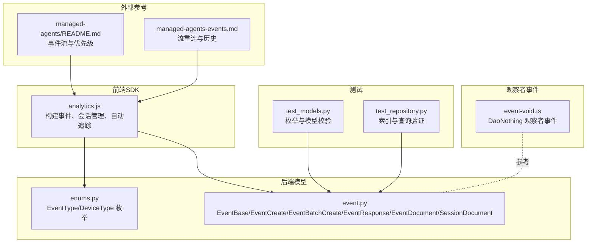
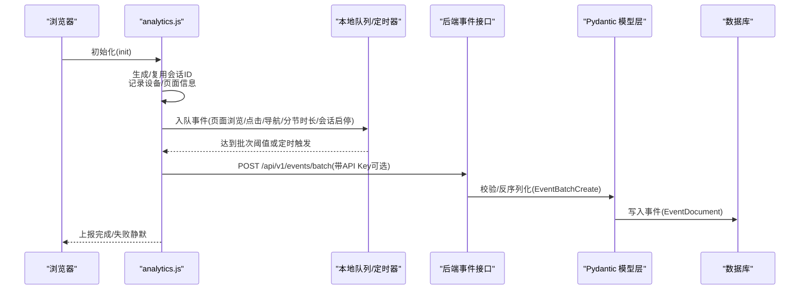
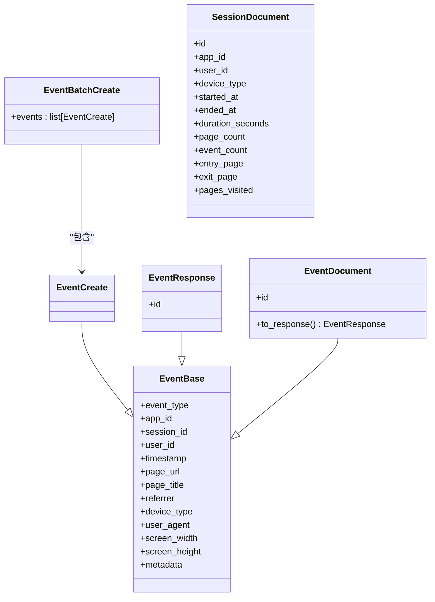
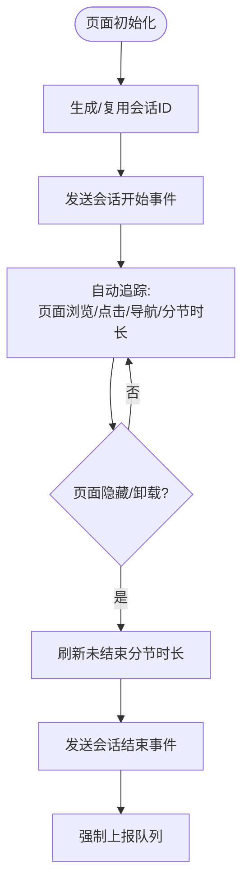
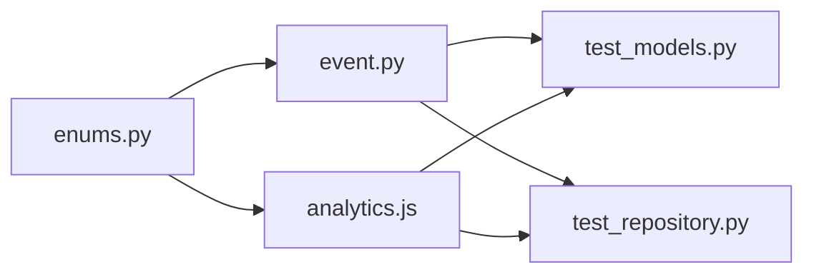

# 事件模型

<cite>
**本文引用的文件**
- [event.py](file://tools/flexloop/src/taolib/testing/analytics/models/event.py)
- [enums.py](file://tools/flexloop/src/taolib/testing/analytics/models/enums.py)
- [analytics.js](file://tools/flexloop/src/taolib/testing/analytics/sdk/analytics.js)
- [test_models.py](file://tools/flexloop/tests/testing/test_analytics/test_models.py)
- [test_repository.py](file://tools/flexloop/tests/testing/test_analytics/test_repository.py)
- [event-void.ts](file://apps/DaoMind/packages/daoNothing/src/event-void.ts)
- [event-void.d.ts](file://apps/DaoMind/packages/daoNothing/src/event-void.d.ts)
- [README.md](file://skills/daoSkilLs/skills/anthropics-skills/skills/claude-api/typescript/managed-agents/README.md)
- [managed-agents-events.md](file://skills/daoSkilLs/skills/anthropics-skills/skills/claude-api/shared/managed-agents-events.md)
</cite>

## 目录
1. [引言](#引言)
2. [项目结构](#项目结构)
3. [核心组件](#核心组件)
4. [架构总览](#架构总览)
5. [组件详解](#组件详解)
6. [依赖关系分析](#依赖关系分析)
7. [性能考量](#性能考量)
8. [故障排查指南](#故障排查指南)
9. [结论](#结论)
10. [附录](#附录)

## 引言
本文件系统性梳理并解释事件模型的设计与实现，覆盖事件数据结构、事件类型枚举、属性字段与时间戳管理、会话生命周期与上下文保持、事件枚举类型系统（内置与自定义）、事件验证规则与数据完整性约束、错误处理机制，以及事件模型与数据库表结构的映射关系。同时提供使用示例与最佳实践，帮助开发者在前端 SDK、后端模型与数据库之间建立一致的事件追踪与存储体系。

## 项目结构
事件模型相关代码主要分布在以下位置：
- 后端模型与枚举：tools/flexloop/src/taolib/testing/analytics/models/
- 前端轻量级分析 SDK：tools/flexloop/src/taolib/testing/analytics/sdk/analytics.js
- 单元测试：tools/flexloop/tests/testing/test_analytics/
- 管理式代理事件流示例（用于理解事件优先级与流式处理）：skills/daoSkilLs/skills/anthropics-skills/skills/claude-api/typescript/managed-agents/README.md
- 事件流重连与历史拉取模式：skills/daoSkilLs/skills/anthropics-skills/skills/claude-api/shared/managed-agents-events.md
- 观察者事件模型（DaoNothing）：apps/DaoMind/packages/daoNothing/src/event-void.ts

图表来源
- [analytics.js:1-451](file://tools/flexloop/src/taolib/testing/analytics/sdk/analytics.js#L1-L451)
- [enums.py:1-31](file://tools/flexloop/src/taolib/testing/analytics/models/enums.py#L1-L31)
- [event.py:1-105](file://tools/flexloop/src/taolib/testing/analytics/models/event.py#L1-L105)
- [test_models.py:1-149](file://tools/flexloop/tests/testing/test_analytics/test_models.py#L1-L149)
- [test_repository.py:146-185](file://tools/flexloop/tests/testing/test_analytics/test_repository.py#L146-L185)
- [README.md:1-360](file://skills/daoSkilLs/skills/anthropics-skills/skills/claude-api/typescript/managed-agents/README.md#L1-L360)
- [managed-agents-events.md:59-79](file://skills/daoSkilLs/skills/anthropics-skills/skills/claude-api/shared/managed-agents-events.md#L59-L79)
- [event-void.ts:1-69](file://apps/DaoMind/packages/daoNothing/src/event-void.ts#L1-L69)

章节来源
- [analytics.js:1-451](file://tools/flexloop/src/taolib/testing/analytics/sdk/analytics.js#L1-L451)
- [event.py:1-105](file://tools/flexloop/src/taolib/testing/analytics/models/event.py#L1-L105)
- [enums.py:1-31](file://tools/flexloop/src/taolib/testing/analytics/models/enums.py#L1-L31)
- [test_models.py:1-149](file://tools/flexloop/tests/testing/test_analytics/test_models.py#L1-L149)
- [test_repository.py:146-185](file://tools/flexloop/tests/testing/test_analytics/test_repository.py#L146-L185)
- [README.md:1-360](file://skills/daoSkilLs/skills/anthropics-skills/skills/claude-api/typescript/managed-agents/README.md#L1-L360)
- [managed-agents-events.md:59-79](file://skills/daoSkilLs/skills/anthropics-skills/skills/claude-api/shared/managed-agents-events.md#L59-L79)
- [event-void.ts:1-69](file://apps/DaoMind/packages/daoNothing/src/event-void.ts#L1-L69)

## 核心组件
- 事件类型枚举：EventType、DeviceType
- 事件数据模型：EventBase、EventCreate、EventBatchCreate、EventResponse、EventDocument
- 会话聚合模型：SessionDocument
- 前端分析 SDK：会话管理、自动追踪（页面浏览、点击、导航、分节停留时长、会话启停）、批量上报与可靠传输
- 观察者事件模型：DaoNothing 观察者事件（用于系统活动映照）

章节来源
- [enums.py:9-31](file://tools/flexloop/src/taolib/testing/analytics/models/enums.py#L9-L31)
- [event.py:17-105](file://tools/flexloop/src/taolib/testing/analytics/models/event.py#L17-L105)
- [analytics.js:84-335](file://tools/flexloop/src/taolib/testing/analytics/sdk/analytics.js#L84-L335)
- [event-void.ts:3-69](file://apps/DaoMind/packages/daoNothing/src/event-void.ts#L3-L69)

## 架构总览
事件从浏览器端 SDK 采集，自动或手动构建事件对象，携带会话上下文与设备信息，按批次异步上报至后端；后端使用 Pydantic 模型进行数据校验与转换，并持久化到数据库。同时提供会话聚合统计与查询能力。

图表来源
- [analytics.js:148-174](file://tools/flexloop/src/taolib/testing/analytics/sdk/analytics.js#L148-L174)
- [event.py:43-48](file://tools/flexloop/src/taolib/testing/analytics/models/event.py#L43-L48)

## 组件详解

### 事件数据结构设计
- 基础字段：事件类型、应用标识、会话ID、用户ID（可选）、时间戳、页面URL、页面标题、来源页、设备类型、UA、屏幕宽高、扩展元数据
- 时间戳管理：前端使用 ISO8601 字符串；后端默认工厂生成 UTC 时间
- 扩展元数据：任意键值对，用于承载业务特定属性

图表来源
- [event.py:17-105](file://tools/flexloop/src/taolib/testing/analytics/models/event.py#L17-L105)

章节来源
- [event.py:17-83](file://tools/flexloop/src/taolib/testing/analytics/models/event.py#L17-L83)
- [test_models.py:19-46](file://tools/flexloop/tests/testing/test_analytics/test_models.py#L19-L46)

### 事件类型枚举系统
- EventType：页面浏览、点击、功能使用、会话开始、会话结束、导航、分节停留时长、自定义
- DeviceType：桌面、移动、平板、未知
- 自定义事件：通过字符串类型事件名扩展（前端 track 接口支持传入任意类型名）
- 事件优先级与顺序：外部参考文档强调“先开流再发事件”以避免缓冲批导致的顺序丢失；结合前端 SDK 的自动追踪逻辑，确保事件在会话生命周期内的有序性

章节来源
- [enums.py:9-31](file://tools/flexloop/src/taolib/testing/analytics/models/enums.py#L9-L31)
- [test_models.py:19-34](file://tools/flexloop/tests/testing/test_analytics/test_models.py#L19-L34)
- [README.md:132-133](file://skills/daoSkilLs/skills/anthropics-skills/skills/claude-api/typescript/managed-agents/README.md#L132-L133)
- [managed-agents-events.md:59-79](file://skills/daoSkilLs/skills/anthropics-skills/skills/claude-api/shared/managed-agents-events.md#L59-L79)

### 会话模型与生命周期管理
- 会话标识：localStorage 存储会话ID与最近活跃时间，超时（默认 30 分钟）后重建
- 会话启停：页面加载时发送会话开始；页面隐藏/卸载时发送会话结束并刷新剩余分节时长
- 设备与上下文：UA、屏幕尺寸、页面URL/标题、来源页、设备类型等随事件附带
- 会话聚合：SessionDocument 提供会话维度统计（入口/出口页面、浏览页面数、事件数、时长等）

图表来源
- [analytics.js:86-107](file://tools/flexloop/src/taolib/testing/analytics/sdk/analytics.js#L86-L107)
- [analytics.js:304-335](file://tools/flexloop/src/taolib/testing/analytics/sdk/analytics.js#L304-L335)
- [event.py:86-102](file://tools/flexloop/src/taolib/testing/analytics/models/event.py#L86-L102)

章节来源
- [analytics.js:84-335](file://tools/flexloop/src/taolib/testing/analytics/sdk/analytics.js#L84-L335)
- [event.py:86-102](file://tools/flexloop/src/taolib/testing/analytics/models/event.py#L86-L102)

### 事件序列与流式处理（参考）
- 流式事件：先打开 SSE 流，再并发发送事件，避免早期事件被缓冲成单一批次导致实时响应丢失
- 断线重连：先拉取历史事件列表，再消费实时流，使用事件ID去重
- 终止条件：根据事件类型判断会话终止或空闲状态，决定循环退出

章节来源
- [managed-agents-events.md:59-79](file://skills/daoSkilLs/skills/anthropics-skills/skills/claude-api/shared/managed-agents-events.md#L59-L79)
- [README.md:138-175](file://skills/daoSkilLs/skills/anthropics-skills/skills/claude-api/typescript/managed-agents/README.md#L138-L175)

### 使用示例（基于现有实现）
- 创建事件实例（前端 SDK）
  - 初始化 SDK 并开启自动追踪
  - 手动追踪：调用 track 或 trackFeature
  - 关联用户：identify 设置用户ID
  - 主动上报：flush 强制上报
- 设置属性值
  - 页面浏览：自动填充 URL/标题/来源/UA/屏幕尺寸
  - 功能使用：附加 feature_name/feature_category 等
  - 自定义事件：传入任意事件类型名与 metadata
- 处理事件序列
  - 会话启停与分节时长自动维护
  - 批量上报与可靠传输（sendBeacon 优先，失败回退 fetch）

章节来源
- [analytics.js:376-445](file://tools/flexloop/src/taolib/testing/analytics/sdk/analytics.js#L376-L445)
- [analytics.js:206-248](file://tools/flexloop/src/taolib/testing/analytics/sdk/analytics.js#L206-L248)
- [analytics.js:252-300](file://tools/flexloop/src/taolib/testing/analytics/sdk/analytics.js#L252-L300)

### 验证规则、数据完整性与错误处理
- Pydantic 校验
  - 必填字段与长度限制：app_id、session_id、page_url 等
  - 枚举值约束：event_type、device_type
  - 批量上限：EventBatchCreate 最大 1000 条
- 前端错误处理
  - localStorage 不可用时降级
  - sendBeacon 不可用时回退 fetch
  - 上传失败静默，避免阻塞主线程
- 数据库与索引
  - 测试覆盖了按应用、时间范围、事件类型查询
  - 索引创建方法存在，建议在生产环境启用

章节来源
- [event.py:20-36](file://tools/flexloop/src/taolib/testing/analytics/models/event.py#L20-L36)
- [event.py:46-48](file://tools/flexloop/src/taolib/testing/analytics/models/event.py#L46-L48)
- [test_models.py:114-149](file://tools/flexloop/tests/testing/test_analytics/test_models.py#L114-L149)
- [test_repository.py:170-185](file://tools/flexloop/tests/testing/test_analytics/test_repository.py#L170-L185)
- [analytics.js:155-174](file://tools/flexloop/src/taolib/testing/analytics/sdk/analytics.js#L155-L174)

### 事件模型与数据库映射
- Pydantic 模型到文档
  - EventDocument 对应 MongoDB 文档，支持别名与字段填充
  - to_response 将文档转换为 API 响应模型
- 会话聚合
  - SessionDocument 聚合会话维度指标（入口/出口页面、事件数、时长等）
- 查询与索引
  - 测试展示了按 app_id、时间范围、事件类型检索
  - 建议在生产环境创建复合索引以优化查询性能

章节来源
- [event.py:59-83](file://tools/flexloop/src/taolib/testing/analytics/models/event.py#L59-L83)
- [event.py:86-102](file://tools/flexloop/src/taolib/testing/analytics/models/event.py#L86-L102)
- [test_repository.py:170-185](file://tools/flexloop/tests/testing/test_analytics/test_repository.py#L170-L185)

### 观察者事件模型（DaoNothing）
- 结构：type、source、timestamp、data、metadata
- 行为：observe 记录事件并发出 observed 事件；reflect 返回只读镜像；void 清空并移除监听；stillness 返回统计状态
- 适用场景：系统活动映照与调试，不参与主事件流

章节来源
- [event-void.ts:3-69](file://apps/DaoMind/packages/daoNothing/src/event-void.ts#L3-L69)
- [event-void.d.ts:2-27](file://apps/DaoMind/packages/daoNothing/src/event-void.d.ts#L2-L27)

## 依赖关系分析
- 前端 SDK 依赖枚举与模型（通过统一导出）
- 后端模型依赖枚举（EventType、DeviceType）
- 测试覆盖模型与仓库查询路径
- 外部参考文档指导事件流与优先级策略

图表来源
- [enums.py:6-31](file://tools/flexloop/src/taolib/testing/analytics/models/enums.py#L6-L31)
- [event.py:14-14](file://tools/flexloop/src/taolib/testing/analytics/models/event.py#L14-L14)
- [analytics.js:27-33](file://tools/flexloop/src/taolib/testing/analytics/sdk/analytics.js#L27-L33)
- [test_models.py:9-16](file://tools/flexloop/tests/testing/test_analytics/test_models.py#L9-L16)
- [test_repository.py:146-185](file://tools/flexloop/tests/testing/test_analytics/test_repository.py#L146-L185)

章节来源
- [enums.py:6-31](file://tools/flexloop/src/taolib/testing/analytics/models/enums.py#L6-L31)
- [event.py:14-14](file://tools/flexloop/src/taolib/testing/analytics/models/event.py#L14-L14)
- [analytics.js:27-33](file://tools/flexloop/src/taolib/testing/analytics/sdk/analytics.js#L27-L33)
- [test_models.py:9-16](file://tools/flexloop/tests/testing/test_analytics/test_models.py#L9-L16)
- [test_repository.py:146-185](file://tools/flexloop/tests/testing/test_analytics/test_repository.py#L146-L185)

## 性能考量
- 前端
  - 批量阈值与定时器：减少网络请求次数，平衡实时性
  - sendBeacon 优先：提升卸载时的数据送达概率
  - IntersectionObserver/MutationObserver：仅在可用时启用，避免降级影响
- 后端
  - 批量写入：EventBatchCreate 支持最大 1000 条，降低写放大
  - 索引策略：按 app_id、timestamp、event_type 建立复合索引，加速查询
- 事件流
  - 先开流再发事件，避免缓冲批导致的顺序与延迟问题

[本节为通用性能建议，不直接分析具体文件]

## 故障排查指南
- 前端
  - 无法写入 localStorage：会话ID生成与活跃时间更新降级，但事件仍可正常追踪
  - sendBeacon 不可用：回退 fetch，失败静默
  - 事件未上报：检查 SDK 是否初始化、是否达到批量阈值或定时器是否触发
- 后端
  - Pydantic 校验失败：检查必填字段、枚举值、长度限制
  - 查询无结果：确认索引是否存在、时间范围是否正确
- 事件流
  - 事件顺序错乱：遵循“先开流再发事件”的模式
  - 连接中断丢失事件：先拉取历史事件列表，再消费实时流并去重

章节来源
- [analytics.js:89-106](file://tools/flexloop/src/taolib/testing/analytics/sdk/analytics.js#L89-L106)
- [analytics.js:155-174](file://tools/flexloop/src/taolib/testing/analytics/sdk/analytics.js#L155-L174)
- [test_models.py:117-124](file://tools/flexloop/tests/testing/test_analytics/test_models.py#L117-L124)
- [test_repository.py:170-185](file://tools/flexloop/tests/testing/test_analytics/test_repository.py#L170-L185)
- [managed-agents-events.md:59-79](file://skills/daoSkilLs/skills/anthropics-skills/skills/claude-api/shared/managed-agents-events.md#L59-L79)

## 结论
该事件模型通过前后端一致的枚举与数据结构、可靠的前端 SDK 与严格的后端校验，实现了从采集、序列化、持久化到查询的完整闭环。配合会话生命周期管理与事件流优先级策略，能够稳定支撑用户行为分析与会话洞察。建议在生产环境完善索引与监控，持续优化批处理与上报策略。

[本节为总结性内容，不直接分析具体文件]

## 附录
- 事件类型与含义对照
  - 页面浏览：记录页面访问
  - 点击：记录交互元素与坐标
  - 功能使用：记录功能开关/按钮点击等
  - 会话开始/结束：会话生命周期标记
  - 导航：前后页面跳转
  - 分节停留时长：基于 IntersectionObserver 的停留时长统计
  - 自定义：任意业务事件类型
- 设备类型
  - desktop、mobile、tablet、unknown

章节来源
- [enums.py:9-31](file://tools/flexloop/src/taolib/testing/analytics/models/enums.py#L9-L31)
- [analytics.js:52-57](file://tools/flexloop/src/taolib/testing/analytics/sdk/analytics.js#L52-L57)