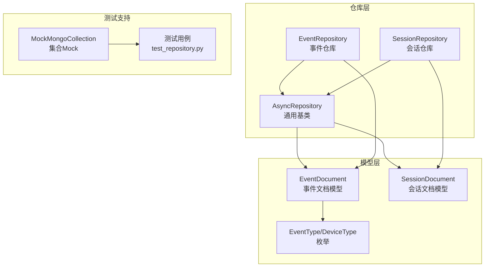
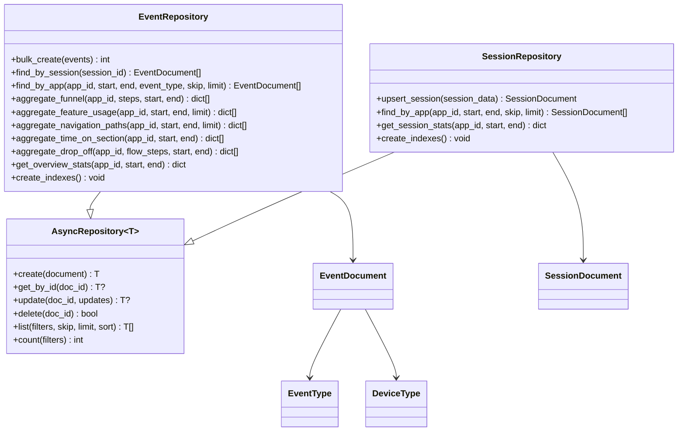
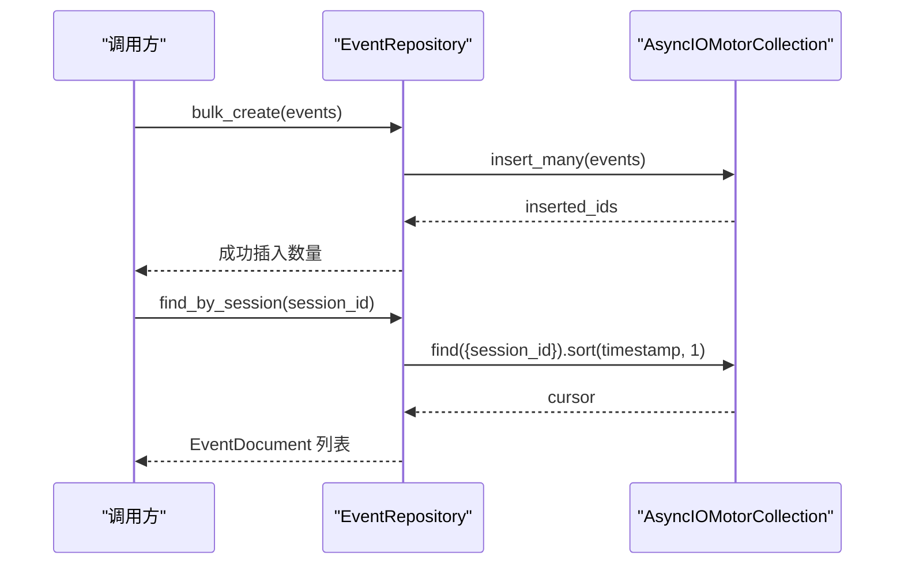
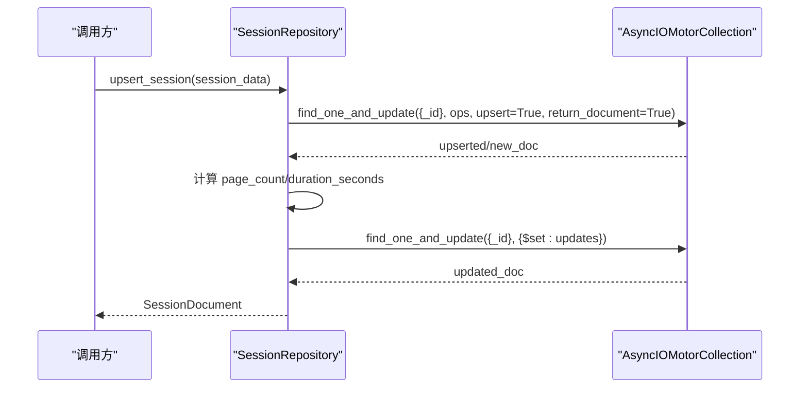
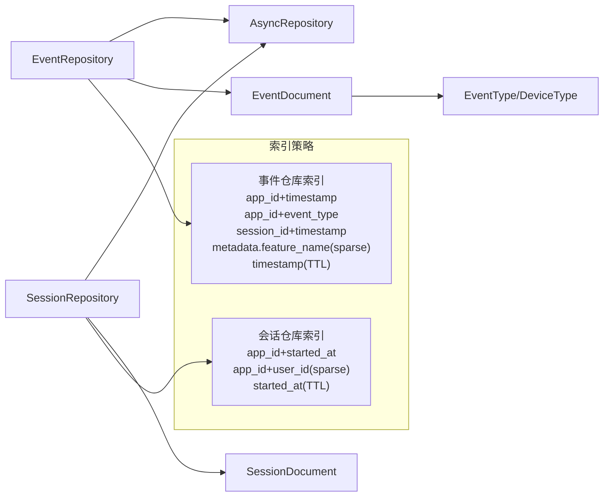

# 仓库层

<cite>
**本文引用的文件**
- [仓库基类 AsyncRepository](file://tools/flexloop/src/taolib/testing/_base/repository.py)
- [事件仓库 EventRepository](file://tools/flexloop/src/taolib/testing/analytics/repository/event_repo.py)
- [会话仓库 SessionRepository](file://tools/flexloop/src/taolib/testing/analytics/repository/session_repo.py)
- [事件数据模型 EventDocument](file://tools/flexloop/src/taolib/testing/analytics/models/event.py)
- [枚举类型 EventType/DeviceType](file://tools/flexloop/src/taolib/testing/analytics/models/enums.py)
- [分析模块仓库导出](file://tools/flexloop/src/taolib/testing/analytics/repository/__init__.py)
- [分析模块仓库单元测试](file://tools/flexloop/tests/testing/test_analytics/test_repository.py)
- [分析模块测试夹具 MockMongoCollection](file://tools/flexloop/tests/testing/test_analytics/conftest.py)
- [OAuth 连接仓库索引示例](file://tools/flexloop/src/taolib/testing/oauth/repository/connection_repo.py)
</cite>

## 目录
1. [简介](#简介)
2. [项目结构](#项目结构)
3. [核心组件](#核心组件)
4. [架构总览](#架构总览)
5. [详细组件分析](#详细组件分析)
6. [依赖关系分析](#依赖关系分析)
7. [性能考量](#性能考量)
8. [故障排查指南](#故障排查指南)
9. [结论](#结论)
10. [附录](#附录)

## 简介
本文件系统性梳理仓库层的设计与实现，覆盖事件仓库、会话仓库与通用仓库基类，阐述数据访问模式、CRUD 与查询方法、事务与批量优化策略、索引设计与查询优化、以及与数据库连接池的集成与错误处理机制。文档面向不同技术背景读者，既提供高层架构视图，也给出代码级细节与最佳实践。

## 项目结构
仓库层位于分析模块内，采用“泛型基类 + 具体实体仓库”的分层组织：
- 通用仓库基类：提供统一的 CRUD、分页、计数等通用能力
- 事件仓库：聚焦事件数据的批量写入、按会话/应用维度查询与多种聚合分析
- 会话仓库：聚焦会话生命周期管理、UPSERT 合并与统计分析
- 数据模型：事件与会话的 Pydantic 模型，确保数据一致性与序列化
- 测试夹具：提供 MongoDB 集合的 Mock 实现，便于离线验证查询与聚合逻辑

图表来源
- [仓库基类 AsyncRepository:15-131](file://tools/flexloop/src/taolib/testing/_base/repository.py#L15-L131)
- [事件仓库 EventRepository:16-469](file://tools/flexloop/src/taolib/testing/analytics/repository/event_repo.py#L16-L469)
- [会话仓库 SessionRepository:15-197](file://tools/flexloop/src/taolib/testing/analytics/repository/session_repo.py#L15-L197)
- [事件数据模型 EventDocument:59-105](file://tools/flexloop/src/taolib/testing/analytics/models/event.py#L59-L105)
- [分析模块仓库导出:1-14](file://tools/flexloop/src/taolib/testing/analytics/repository/__init__.py#L1-L14)
- [分析模块测试夹具 MockMongoCollection:33-184](file://tools/flexloop/tests/testing/test_analytics/conftest.py#L33-L184)

章节来源
- [分析模块仓库导出:1-14](file://tools/flexloop/src/taolib/testing/analytics/repository/__init__.py#L1-L14)

## 核心组件
- 通用仓库基类 AsyncRepository
  - 提供 create/get_by_id/update/delete/list/count 等通用 CRUD 与查询能力
  - 使用 Motor 异步驱动与 Pydantic 模型绑定，保证返回类型安全
- 事件仓库 EventRepository
  - 扩展批量写入、按会话/应用维度查询、多种聚合分析（漏斗、功能使用排行、导航路径、停留时间、流失分析、概览统计）
  - 内置索引创建方法，支撑高频查询与聚合
- 会话仓库 SessionRepository
  - 提供 UPSERT 合并（find_one_and_update + upsert），自动计算页面数与时长
  - 支持按应用与时间范围查询、会话统计分析
  - 内置索引创建方法，支撑用户与时间维度查询

章节来源
- [仓库基类 AsyncRepository:15-131](file://tools/flexloop/src/taolib/testing/_base/repository.py#L15-L131)
- [事件仓库 EventRepository:16-469](file://tools/flexloop/src/taolib/testing/analytics/repository/event_repo.py#L16-L469)
- [会话仓库 SessionRepository:15-197](file://tools/flexloop/src/taolib/testing/analytics/repository/session_repo.py#L15-L197)

## 架构总览
仓库层通过泛型基类统一抽象，具体仓库在各自领域内扩展查询与聚合能力；模型层以 Pydantic 确保数据结构与序列化一致性；测试夹具提供离线验证环境，确保查询与聚合逻辑正确性。

图表来源
- [仓库基类 AsyncRepository:15-131](file://tools/flexloop/src/taolib/testing/_base/repository.py#L15-L131)
- [事件仓库 EventRepository:16-469](file://tools/flexloop/src/taolib/testing/analytics/repository/event_repo.py#L16-L469)
- [会话仓库 SessionRepository:15-197](file://tools/flexloop/src/taolib/testing/analytics/repository/session_repo.py#L15-L197)
- [事件数据模型 EventDocument:59-105](file://tools/flexloop/src/taolib/testing/analytics/models/event.py#L59-L105)
- [枚举类型 EventType/DeviceType:9-31](file://tools/flexloop/src/taolib/testing/analytics/models/enums.py#L9-L31)

## 详细组件分析

### 通用仓库基类 AsyncRepository
- 设计要点
  - 泛型约束 T 绑定到 Pydantic 模型，确保返回值类型安全
  - 使用 Motor 异步集合，提供异步 CRUD 与查询能力
  - list 支持过滤、跳过、限制与排序，count 提供统计
- 关键方法
  - create：插入文档并返回模型实例
  - get_by_id：按主键查询
  - update：原子更新并返回新文档
  - delete：按主键删除
  - list：组合过滤、排序、分页
  - count：统计匹配文档数
- 错误处理
  - 查询不到时返回 None 或空列表，避免异常传播
  - 调用方需自行处理返回值存在性

章节来源
- [仓库基类 AsyncRepository:15-131](file://tools/flexloop/src/taolib/testing/_base/repository.py#L15-L131)

### 事件仓库 EventRepository
- 设计要点
  - 在通用基类之上扩展事件领域专用查询与聚合
  - 内置批量写入，提升高吞吐场景效率
  - 提供多种分析聚合，涵盖漏斗、功能使用、导航路径、停留时间、流失分析与概览统计
  - 内置索引创建，覆盖应用+时间、会话+时间、功能名等高频查询与聚合场景
- 关键方法
  - bulk_create：批量插入事件
  - find_by_session：按会话 ID 查询并按时间排序
  - find_by_app：按应用+时间范围+事件类型过滤
  - 聚合分析：漏斗、功能使用排行、导航路径、停留时间、流失分析、概览统计
  - create_indexes：创建必要索引
- 使用示例（基于测试用例）
  - 批量创建事件：参考 [批量创建测试:24-53](file://tools/flexloop/tests/testing/test_analytics/test_repository.py#L24-L53)
  - 按会话查询事件：参考 [按会话查询测试:56-94](file://tools/flexloop/tests/testing/test_analytics/test_repository.py#L56-L94)
  - 按应用与类型过滤查询：参考 [按应用与类型过滤测试:138-177](file://tools/flexloop/tests/testing/test_analytics/test_repository.py#L138-L177)
  - 创建索引：参考 [创建索引测试:180-186](file://tools/flexloop/tests/testing/test_analytics/test_repository.py#L180-L186)

图表来源
- [事件仓库 EventRepository:23-52](file://tools/flexloop/src/taolib/testing/analytics/repository/event_repo.py#L23-L52)
- [仓库基类 AsyncRepository:90-117](file://tools/flexloop/src/taolib/testing/_base/repository.py#L90-L117)

章节来源
- [事件仓库 EventRepository:16-469](file://tools/flexloop/src/taolib/testing/analytics/repository/event_repo.py#L16-L469)
- [分析模块仓库导出:6-12](file://tools/flexloop/src/taolib/testing/analytics/repository/__init__.py#L6-L12)
- [分析模块仓库单元测试:16-186](file://tools/flexloop/tests/testing/test_analytics/test_repository.py#L16-L186)

### 会话仓库 SessionRepository
- 设计要点
  - 使用 find_one_and_update + upsert 实现幂等合并，自动维护会话统计字段（页面数、时长）
  - 提供按应用与时间范围查询与会话统计分析
  - 内置索引创建，覆盖应用+时间、用户等常用查询维度
- 关键方法
  - upsert_session：合并更新或新建会话，返回更新后的模型
  - find_by_app：按应用+时间范围查询
  - get_session_stats：计算平均时长、平均页面数、跳出率等
  - create_indexes：创建必要索引
- 使用示例（基于测试用例）
  - upsert 创建与更新：参考 [upsert 会话测试:197-257](file://tools/flexloop/tests/testing/test_analytics/test_repository.py#L197-L257)
  - 按应用查询：参考 [按应用查询测试:81-117](file://tools/flexloop/tests/testing/test_analytics/test_repository.py#L81-L117)
  - 会话统计：参考 [会话统计测试:119-177](file://tools/flexloop/tests/testing/test_analytics/test_repository.py#L119-L177)

图表来源
- [会话仓库 SessionRepository:22-79](file://tools/flexloop/src/taolib/testing/analytics/repository/session_repo.py#L22-L79)
- [仓库基类 AsyncRepository:58-88](file://tools/flexloop/src/taolib/testing/_base/repository.py#L58-L88)

章节来源
- [会话仓库 SessionRepository:15-197](file://tools/flexloop/src/taolib/testing/analytics/repository/session_repo.py#L15-L197)
- [分析模块仓库单元测试:189-257](file://tools/flexloop/tests/testing/test_analytics/test_repository.py#L189-L257)

### 数据模型与枚举
- EventDocument：事件文档模型，包含事件类型、应用标识、会话 ID、用户 ID、时间戳、页面信息、设备类型、元数据等字段，并提供 to_response 转换
- SessionDocument：会话文档模型，包含应用标识、用户 ID、设备类型、起止时间、时长、页面数、事件数、入口/出口页面、浏览页面列表等
- EventType/DeviceType：事件类型与设备类型的枚举，统一语义

章节来源
- [事件数据模型 EventDocument:59-105](file://tools/flexloop/src/taolib/testing/analytics/models/event.py#L59-L105)
- [枚举类型 EventType/DeviceType:9-31](file://tools/flexloop/src/taolib/testing/analytics/models/enums.py#L9-L31)

## 依赖关系分析
- 组件耦合
  - EventRepository/SessionRepository 依赖 AsyncRepository 与各自的模型类
  - 事件仓库依赖枚举类型以约束事件类型与设备类型
- 外部依赖
  - Motor 异步 MongoDB 客户端
  - Pydantic 模型用于数据校验与序列化
- 索引与查询
  - 事件仓库与会话仓库均提供 create_indexes 方法，分别针对高频查询与聚合场景建立复合索引
  - OAuth 连接仓库也展示了索引设计思路（唯一索引与单字段索引）

图表来源
- [事件仓库 EventRepository:443-466](file://tools/flexloop/src/taolib/testing/analytics/repository/event_repo.py#L443-L466)
- [会话仓库 SessionRepository:179-194](file://tools/flexloop/src/taolib/testing/analytics/repository/session_repo.py#L179-L194)
- [OAuth 连接仓库索引示例:93-103](file://tools/flexloop/src/taolib/testing/oauth/repository/connection_repo.py#L93-L103)

章节来源
- [事件仓库 EventRepository:443-466](file://tools/flexloop/src/taolib/testing/analytics/repository/event_repo.py#L443-L466)
- [会话仓库 SessionRepository:179-194](file://tools/flexloop/src/taolib/testing/analytics/repository/session_repo.py#L179-L194)
- [OAuth 连接仓库索引示例:93-103](file://tools/flexloop/src/taolib/testing/oauth/repository/connection_repo.py#L93-L103)

## 性能考量
- 批量操作优化
  - 事件仓库提供 bulk_create，减少网络往返与事务开销，适合高吞吐事件写入
- 查询与分页
  - list 支持 skip/limit/sort，结合合适索引可显著降低扫描成本
- 聚合分析
  - 事件仓库内置多种聚合管道，建议配合相应索引（如 app_id+timestamp、metadata.feature_name）以提升聚合性能
- TTL 清理
  - 事件与会话仓库均设置时间字段的 TTL 索引，实现自动过期清理，降低存储压力
- 索引策略
  - 事件仓库：应用+时间、应用+事件类型、会话+时间、功能名稀疏索引、时间戳 TTL
  - 会话仓库：应用+开始时间、应用+用户（稀疏）、开始时间 TTL
  - OAuth 连接仓库：用户+提供商唯一索引、提供商+用户唯一索引、用户索引、状态索引

章节来源
- [事件仓库 EventRepository:23-35](file://tools/flexloop/src/taolib/testing/analytics/repository/event_repo.py#L23-L35)
- [事件仓库 EventRepository:443-466](file://tools/flexloop/src/taolib/testing/analytics/repository/event_repo.py#L443-L466)
- [会话仓库 SessionRepository:179-194](file://tools/flexloop/src/taolib/testing/analytics/repository/session_repo.py#L179-L194)
- [OAuth 连接仓库索引示例:93-103](file://tools/flexloop/src/taolib/testing/oauth/repository/connection_repo.py#L93-L103)

## 故障排查指南
- 常见问题
  - 查询结果为空：确认过滤条件是否正确、索引是否存在、时间范围是否合理
  - 聚合结果异常：检查聚合管道字段映射与嵌套查询条件
  - UPSERT 未生效：确认 _id 字段是否正确传入、upsert 参数是否启用
- 错误处理机制
  - 通用基类对查询不到返回 None/空列表，避免异常传播
  - 批量写入返回成功数量，便于上层校验
  - 测试夹具提供 MockMongoCollection，便于离线定位问题
- 建议
  - 在生产环境为高频查询字段建立复合索引
  - 对大结果集查询使用分页与排序，避免全表扫描
  - 对于长时间运行的聚合任务，考虑分批执行与缓存中间结果

章节来源
- [仓库基类 AsyncRepository:30-128](file://tools/flexloop/src/taolib/testing/_base/repository.py#L30-L128)
- [分析模块测试夹具 MockMongoCollection:33-184](file://tools/flexloop/tests/testing/test_analytics/conftest.py#L33-L184)

## 结论
仓库层通过通用基类与领域仓库的清晰分工，实现了统一的 CRUD 与查询能力，同时在事件与会话领域提供了丰富的聚合分析与批量优化策略。配合完善的索引设计与 TTL 清理，能够在高并发与大数据量场景下保持良好的性能与可维护性。建议在实际部署中结合业务查询特征持续优化索引与查询参数，并利用测试夹具进行回归验证。

## 附录
- 使用示例（基于测试用例）
  - 事件查询与聚合：参考 [事件仓库测试:16-186](file://tools/flexloop/tests/testing/test_analytics/test_repository.py#L16-L186)
  - 会话检索与统计：参考 [会话仓库测试:189-257](file://tools/flexloop/tests/testing/test_analytics/test_repository.py#L189-L257)
- 数据模型参考
  - 事件文档模型：参考 [EventDocument:59-83](file://tools/flexloop/src/taolib/testing/analytics/models/event.py#L59-L83)
  - 会话文档模型：参考 [SessionDocument:86-105](file://tools/flexloop/src/taolib/testing/analytics/models/event.py#L86-L105)
- 索引策略参考
  - 事件仓库索引：参考 [EventRepository.create_indexes:443-466](file://tools/flexloop/src/taolib/testing/analytics/repository/event_repo.py#L443-L466)
  - 会话仓库索引：参考 [SessionRepository.create_indexes:179-194](file://tools/flexloop/src/taolib/testing/analytics/repository/session_repo.py#L179-L194)
  - OAuth 连接仓库索引：参考 [connection_repo.create_indexes:93-103](file://tools/flexloop/src/taolib/testing/oauth/repository/connection_repo.py#L93-L103)