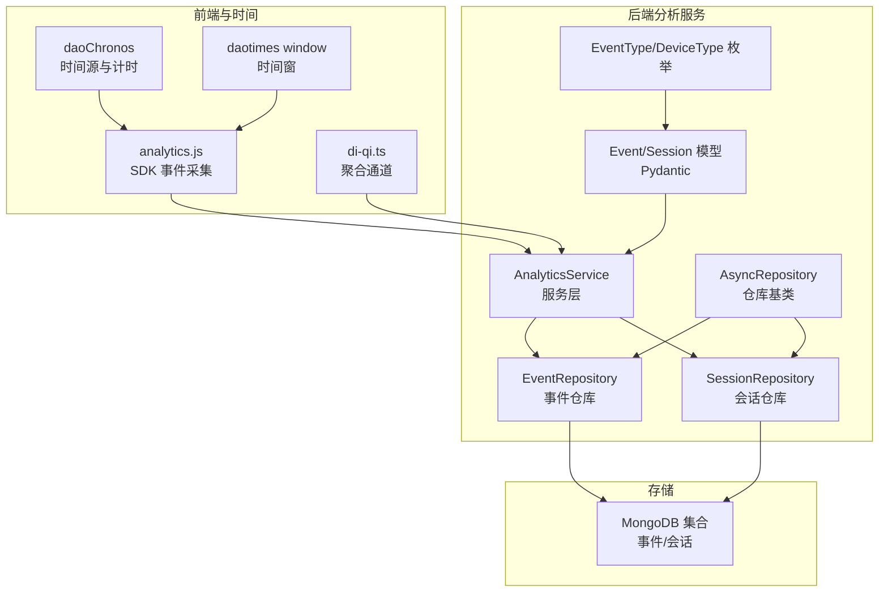
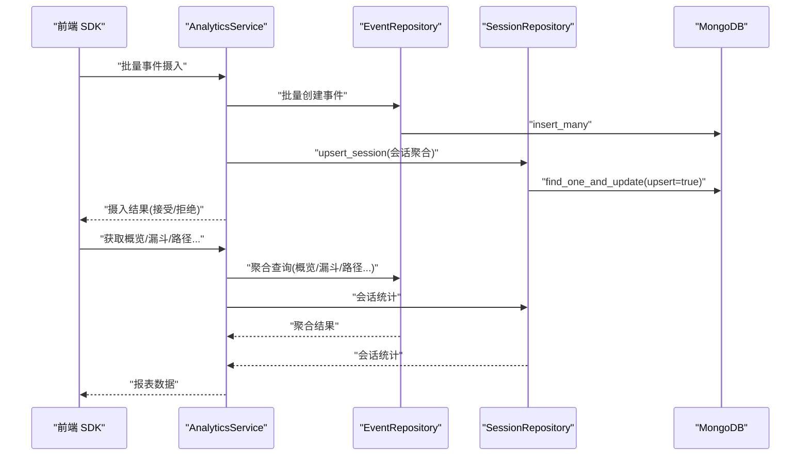
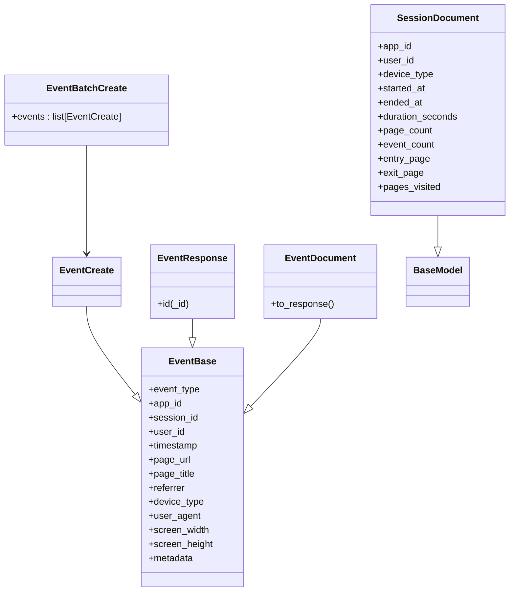
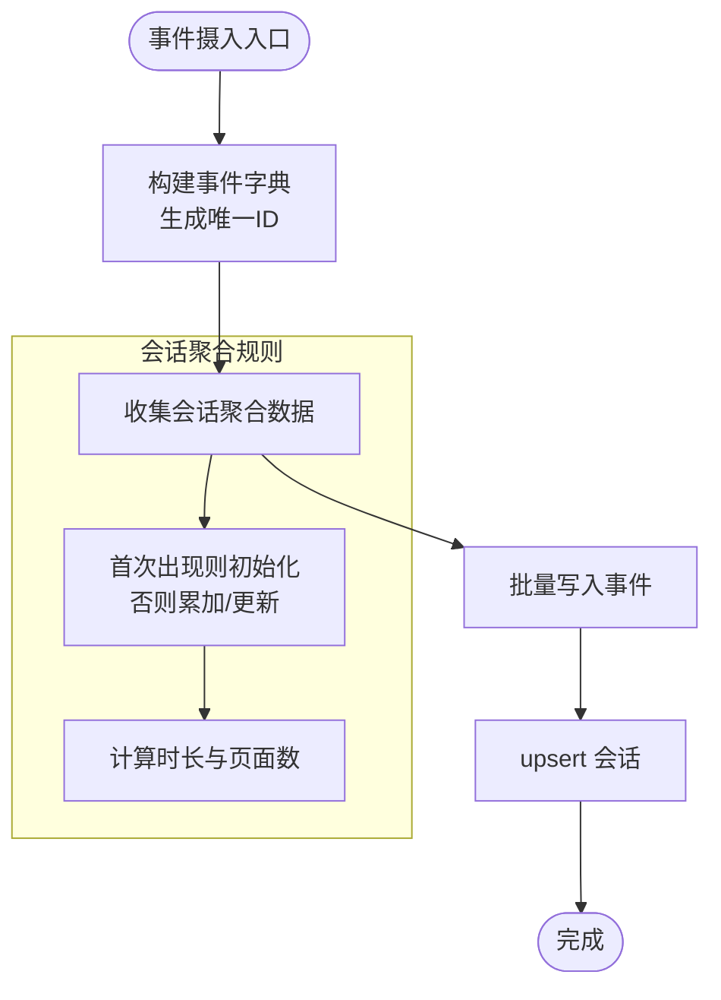
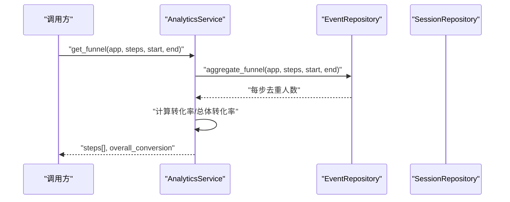
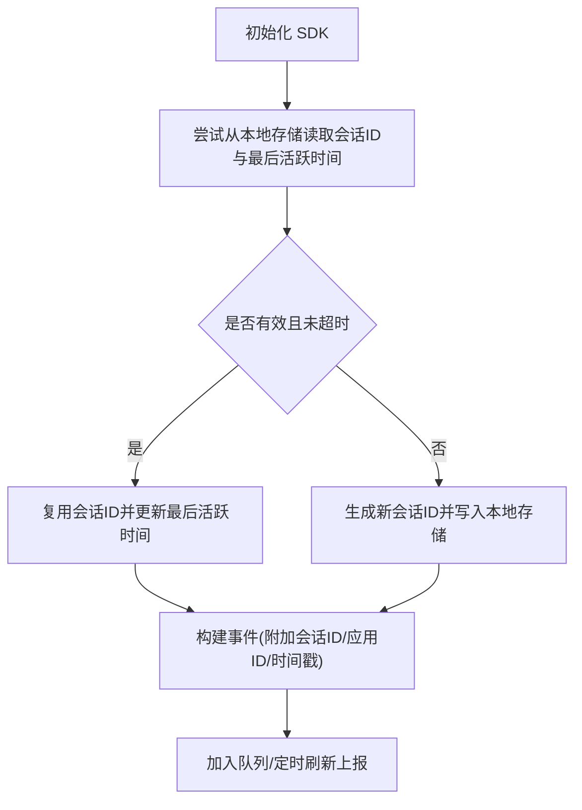
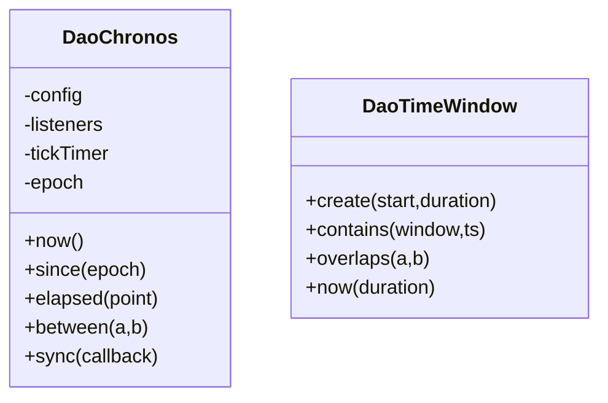
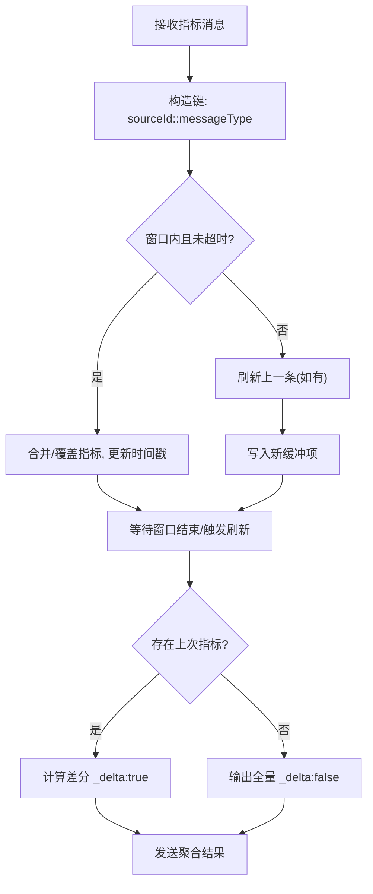
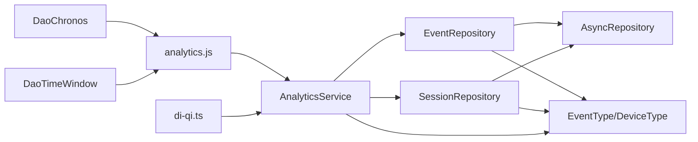

# 分析系统

<cite>
**本文引用的文件**
- [analytics_service.py](file://tools/flexloop/src/taolib/testing/analytics/services/analytics_service.py)
- [event_repo.py](file://tools/flexloop/src/taolib/testing/analytics/repository/event_repo.py)
- [session_repo.py](file://tools/flexloop/src/taolib/testing/analytics/repository/session_repo.py)
- [repository.py](file://tools/flexloop/src/taolib/testing/_base/repository.py)
- [event.py](file://tools/flexloop/src/taolib/testing/analytics/models/event.py)
- [enums.py](file://tools/flexloop/src/taolib/testing/analytics/models/enums.py)
- [test_service.py](file://tools/flexloop/tests/testing/test_analytics/test_service.py)
- [test_repository.py](file://tools/flexloop/tests/testing/test_analytics/test_repository.py)
- [analytics.js](file://apps/DaoMind/packages/daoQi/src/sdk/analytics.js)
- [chronos.ts](file://apps/DaoMind/packages/daoChronos/src/chronos.ts)
- [window.ts](file://apps/DaoMind/packages/daotimes/src/window.ts)
- [di-qi.ts](file://apps/DaoMind/packages/daoQi/src/channels/di-qi.ts)
</cite>

## 目录
1. [简介](#简介)
2. [项目结构](#项目结构)
3. [核心组件](#核心组件)
4. [架构总览](#架构总览)
5. [详细组件分析](#详细组件分析)
6. [依赖分析](#依赖分析)
7. [性能考虑](#性能考虑)
8. [故障排查指南](#故障排查指南)
9. [结论](#结论)
10. [附录](#附录)

## 简介
本文件面向“分析系统”的技术文档，聚焦于事件收集、数据聚合与报表生成的端到端实现。系统采用 Python 异步架构，以 MongoDB 作为主存储，通过仓库模式（Repository Pattern）封装数据访问，并以服务层（Service Layer）统一编排事件摄入、会话聚合与各类分析指标计算。前端侧提供轻量 SDK 用于事件采集与会话管理，时间与窗口工具提供时间源与时间窗抽象，便于实时与批处理分析的协同。

## 项目结构
分析系统相关代码主要分布在以下位置：
- 服务层与模型：tools/flexloop/src/taolib/testing/analytics
- 仓库基类与具体仓库：tools/flexloop/src/taolib/testing/_base 与 analytics/repository
- 测试：tools/flexloop/tests/testing/test_analytics
- 前端 SDK 与时间工具：apps/DaoMind/packages 下的相应包

图表来源
- [analytics_service.py:16-271](file://tools/flexloop/src/taolib/testing/analytics/services/analytics_service.py#L16-L271)
- [event_repo.py:16-469](file://tools/flexloop/src/taolib/testing/analytics/repository/event_repo.py#L16-L469)
- [session_repo.py:15-197](file://tools/flexloop/src/taolib/testing/analytics/repository/session_repo.py#L15-L197)
- [repository.py:15-131](file://tools/flexloop/src/taolib/testing/_base/repository.py#L15-L131)
- [event.py:17-105](file://tools/flexloop/src/taolib/testing/analytics/models/event.py#L17-L105)
- [enums.py:9-31](file://tools/flexloop/src/taolib/testing/analytics/models/enums.py#L9-L31)
- [analytics.js:81-127](file://apps/DaoMind/packages/daoQi/src/sdk/analytics.js#L81-L127)
- [chronos.ts:1-82](file://apps/DaoMind/packages/daoChronos/src/chronos.ts#L1-L82)
- [window.ts:1-20](file://apps/DaoMind/packages/daotimes/src/window.ts#L1-L20)
- [di-qi.ts:40-89](file://apps/DaoMind/packages/daoQi/src/channels/di-qi.ts#L40-L89)

章节来源
- [analytics_service.py:16-271](file://tools/flexloop/src/taolib/testing/analytics/services/analytics_service.py#L16-L271)
- [event_repo.py:16-469](file://tools/flexloop/src/taolib/testing/analytics/repository/event_repo.py#L16-L469)
- [session_repo.py:15-197](file://tools/flexloop/src/taolib/testing/analytics/repository/session_repo.py#L15-L197)
- [repository.py:15-131](file://tools/flexloop/src/taolib/testing/_base/repository.py#L15-L131)
- [event.py:17-105](file://tools/flexloop/src/taolib/testing/analytics/models/event.py#L17-L105)
- [enums.py:9-31](file://tools/flexloop/src/taolib/testing/analytics/models/enums.py#L9-L31)

## 核心组件
- 服务层（AnalyticsService）：负责事件摄入、会话聚合、概览统计、漏斗分析、功能使用排名、导航路径、停留时间、流失点等指标的计算与组合。
- 事件仓库（EventRepository）：提供事件的批量写入、按会话/应用+时间范围查询，以及多种聚合分析的聚合管道。
- 会话仓库（SessionRepository）：提供 upsert 会话、按应用+时间范围查询、会话统计（平均时长、平均页面数、跳出率）等。
- 仓库基类（AsyncRepository）：提供通用的异步 CRUD 与列表查询能力。
- 模型与枚举：定义事件与会话的 Pydantic 模型及事件类型、设备类型等枚举。
- 前端 SDK 与时间工具：提供事件采集、会话管理、时间源与时间窗抽象。

章节来源
- [analytics_service.py:16-271](file://tools/flexloop/src/taolib/testing/analytics/services/analytics_service.py#L16-L271)
- [event_repo.py:16-469](file://tools/flexloop/src/taolib/testing/analytics/repository/event_repo.py#L16-L469)
- [session_repo.py:15-197](file://tools/flexloop/src/taolib/testing/analytics/repository/session_repo.py#L15-L197)
- [repository.py:15-131](file://tools/flexloop/src/taolib/testing/_base/repository.py#L15-L131)
- [event.py:17-105](file://tools/flexloop/src/taolib/testing/analytics/models/event.py#L17-L105)
- [enums.py:9-31](file://tools/flexloop/src/taolib/testing/analytics/models/enums.py#L9-L31)

## 架构总览
系统采用“前端采集 → 服务层编排 → 仓库层持久化/聚合 → 报表层消费”的分层架构。前端 SDK 将事件与会话信息发送至服务层；服务层进行数据清洗与会话聚合，随后写入 MongoDB；仓库层提供查询与聚合管道；上层应用通过服务层接口获取概览、漏斗、路径、留存等报表数据。

图表来源
- [analytics_service.py:33-101](file://tools/flexloop/src/taolib/testing/analytics/services/analytics_service.py#L33-L101)
- [event_repo.py:23-35](file://tools/flexloop/src/taolib/testing/analytics/repository/event_repo.py#L23-L35)
- [session_repo.py:22-79](file://tools/flexloop/src/taolib/testing/analytics/repository/session_repo.py#L22-L79)

## 详细组件分析

### 事件模型设计
- 事件类型（EventType）：涵盖页面浏览、点击、功能使用、会话起止、导航、区域停留时间、自定义事件等。
- 设备类型（DeviceType）：桌面、移动、平板、未知。
- 事件模型层次：
  - EventBase：定义事件的基础字段（应用ID、会话ID、用户ID、时间戳、页面URL/Title、来源、设备、UA、分辨率、元数据等）。
  - EventCreate：事件创建输入模型。
  - EventBatchCreate：批量事件输入模型。
  - EventResponse：API响应模型（含别名映射）。
  - EventDocument：MongoDB 文档模型，提供 to_response 转换。
  - SessionDocument：会话聚合文档模型（含开始/结束时间、时长、页面数、事件数、入口/出口页面、访问页面集合等）。

图表来源
- [event.py:17-105](file://tools/flexloop/src/taolib/testing/analytics/models/event.py#L17-L105)
- [enums.py:9-31](file://tools/flexloop/src/taolib/testing/analytics/models/enums.py#L9-L31)

章节来源
- [event.py:17-105](file://tools/flexloop/src/taolib/testing/analytics/models/event.py#L17-L105)
- [enums.py:9-31](file://tools/flexloop/src/taolib/testing/analytics/models/enums.py#L9-L31)

### 仓库模式与数据持久化
- 仓库基类（AsyncRepository）：提供 create/get_by_id/update/delete/list/count 等通用能力，统一处理 _id 字符串化与模型映射。
- 事件仓库（EventRepository）：
  - 批量写入：insert_many。
  - 查询：按会话查询、按应用+时间范围查询。
  - 聚合：漏斗分析、功能使用排名、导航路径、区域停留时间、流失点、概览统计。
  - 索引：应用+时间、应用+事件类型、会话+时间、功能使用聚合稀疏索引、按时间 TTL 清理。
- 会话仓库（SessionRepository）：
  - upsert：基于 session_id 合并更新，自动计算页面数与时长。
  - 查询：按应用+时间范围查询。
  - 统计：平均会话时长、平均页面数、跳出率。
  - 索引：应用+开始时间、应用+用户ID稀疏索引、按开始时间 TTL 清理。

图表来源
- [analytics_service.py:33-101](file://tools/flexloop/src/taolib/testing/analytics/services/analytics_service.py#L33-L101)
- [session_repo.py:22-79](file://tools/flexloop/src/taolib/testing/analytics/repository/session_repo.py#L22-L79)

章节来源
- [repository.py:15-131](file://tools/flexloop/src/taolib/testing/_base/repository.py#L15-L131)
- [event_repo.py:16-469](file://tools/flexloop/src/taolib/testing/analytics/repository/event_repo.py#L16-L469)
- [session_repo.py:15-197](file://tools/flexloop/src/taolib/testing/analytics/repository/session_repo.py#L15-L197)

### 服务层实现与指标生成
- 事件摄入（ingest_events）：对事件进行清洗与去重，批量写入事件集合；同时聚合会话数据并 upsert。
- 概览统计（get_overview）：合并事件与会话统计。
- 转化漏斗（get_funnel）：基于步骤匹配，按会话去重统计每步人数并计算转化率。
- 功能使用排名（get_feature_ranking）：按功能名与分类分组统计使用次数与独立用户数。
- 导航路径（get_navigation_paths）：按会话排序，提取相邻页面对，统计流向。
- 停留时间（get_retention）：按区域ID统计平均停留时长与总查看次数。
- 流失点（get_drop_off）：计算每步进入/完成/流失率。
- 默认时间范围（default_time_range）：最近7天。

图表来源
- [analytics_service.py:123-165](file://tools/flexloop/src/taolib/testing/analytics/services/analytics_service.py#L123-L165)
- [event_repo.py:93-134](file://tools/flexloop/src/taolib/testing/analytics/repository/event_repo.py#L93-L134)

章节来源
- [analytics_service.py:103-271](file://tools/flexloop/src/taolib/testing/analytics/services/analytics_service.py#L103-L271)

### 前端采集与会话管理
- SDK 事件采集：构建基础事件（包含应用ID、会话ID、时间戳等），支持本地会话ID与最后活跃时间缓存，超时则重新生成。
- 会话超时：默认阈值内复用会话，超时则新建。
- 事件队列与刷新：内部维护队列与定时器，按需刷新。

图表来源
- [analytics.js:81-127](file://apps/DaoMind/packages/daoQi/src/sdk/analytics.js#L81-L127)

章节来源
- [analytics.js:81-127](file://apps/DaoMind/packages/daoQi/src/sdk/analytics.js#L81-L127)

### 时间与时间窗
- DaoChronos：提供统一时间点（value/source/epoch），支持单调时钟、系统时间与自定义源，周期性同步回调。
- 时间窗（DaoTimeWindow）：创建时间窗、判断时间戳包含、检测时间窗重叠、当前时间窗。

图表来源
- [chronos.ts:1-82](file://apps/DaoMind/packages/daoChronos/src/chronos.ts#L1-L82)
- [window.ts:1-20](file://apps/DaoMind/packages/daotimes/src/window.ts#L1-L20)

章节来源
- [chronos.ts:1-82](file://apps/DaoMind/packages/daoChronos/src/chronos.ts#L1-L82)
- [window.ts:1-20](file://apps/DaoMind/packages/daotimes/src/window.ts#L1-L20)

### 实时聚合通道（di-qi.ts）
- 聚合缓冲：按 sourceId::messageType 聚合，限定聚合窗口时间。
- 增量差分：若存在上次指标，则计算差分 delta 输出；否则输出全量指标。
- 刷新策略：到期或 flushAll 时批量刷新。

图表来源
- [di-qi.ts:40-89](file://apps/DaoMind/packages/daoQi/src/channels/di-qi.ts#L40-L89)

章节来源
- [di-qi.ts:40-89](file://apps/DaoMind/packages/daoQi/src/channels/di-qi.ts#L40-L89)

## 依赖分析
- 服务层依赖事件与会话仓库，二者均继承自 AsyncRepository，统一了数据访问契约。
- 事件仓库与会话仓库依赖 Motor 异步驱动访问 MongoDB，分别针对事件与会话集合。
- 模型层通过 Pydantic 提供强类型校验与序列化，枚举约束事件类型与设备类型。
- 前端 SDK 与时间工具为分析系统提供事件采集与时间抽象，支撑实时与批处理协同。

图表来源
- [analytics_service.py:16-32](file://tools/flexloop/src/taolib/testing/analytics/services/analytics_service.py#L16-L32)
- [event_repo.py:16-21](file://tools/flexloop/src/taolib/testing/analytics/repository/event_repo.py#L16-L21)
- [session_repo.py:15-20](file://tools/flexloop/src/taolib/testing/analytics/repository/session_repo.py#L15-L20)
- [repository.py:15-28](file://tools/flexloop/src/taolib/testing/_base/repository.py#L15-L28)
- [enums.py:9-31](file://tools/flexloop/src/taolib/testing/analytics/models/enums.py#L9-L31)
- [analytics.js:81-127](file://apps/DaoMind/packages/daoQi/src/sdk/analytics.js#L81-L127)
- [chronos.ts:1-82](file://apps/DaoMind/packages/daoChronos/src/chronos.ts#L1-L82)
- [window.ts:1-20](file://apps/DaoMind/packages/daotimes/src/window.ts#L1-L20)
- [di-qi.ts:40-89](file://apps/DaoMind/packages/daoQi/src/channels/di-qi.ts#L40-L89)

章节来源
- [analytics_service.py:16-32](file://tools/flexloop/src/taolib/testing/analytics/services/analytics_service.py#L16-L32)
- [event_repo.py:16-21](file://tools/flexloop/src/taolib/testing/analytics/repository/event_repo.py#L16-L21)
- [session_repo.py:15-20](file://tools/flexloop/src/taolib/testing/analytics/repository/session_repo.py#L15-L20)
- [repository.py:15-28](file://tools/flexloop/src/taolib/testing/_base/repository.py#L15-L28)
- [enums.py:9-31](file://tools/flexloop/src/taolib/testing/analytics/models/enums.py#L9-L31)

## 性能考虑
- 存储与索引
  - 事件集合：应用+时间降序、应用+事件类型、会话+时间、功能使用稀疏索引、按时间 TTL（默认90天）。
  - 会话集合：应用+开始时间降序、应用+用户ID稀疏索引、按开始时间 TTL（默认180天）。
- 聚合优化
  - 使用 $addToSet 去重（如会话ID），配合 $size 计算唯一数。
  - 在聚合管道中尽早过滤（match）与排序（sort），限制输出（limit）。
  - 对高频查询建立复合索引，避免全表扫描。
- 写入优化
  - 批量写入 insert_many，减少网络往返。
  - 会话 upsert 使用原子操作合并更新，避免多次往返。
- 前端采集
  - 本地会话缓存与定时刷新，降低上报频率与存储压力。
  - 聚合窗口内的增量差分，减少传输与下游计算开销。
- 数据生命周期
  - 通过 TTL 索引自动清理历史数据，控制存储成本。
- 实时与批处理结合
  - 前端 SDK 实时上报，服务层即时入库；后台可定期运行批处理任务进行深度聚合与报表生成，形成“近实时 + 定时批处理”的混合分析模式。

章节来源
- [event_repo.py:443-467](file://tools/flexloop/src/taolib/testing/analytics/repository/event_repo.py#L443-L467)
- [session_repo.py:179-194](file://tools/flexloop/src/taolib/testing/analytics/repository/session_repo.py#L179-L194)
- [analytics.js:81-127](file://apps/DaoMind/packages/daoQi/src/sdk/analytics.js#L81-L127)
- [di-qi.ts:40-89](file://apps/DaoMind/packages/daoQi/src/channels/di-qi.ts#L40-L89)

## 故障排查指南
- 事件摄入失败
  - 现象：摄入结果 rejected 数量增加。
  - 排查：检查事件模型字段合法性、时间戳格式、会话ID有效性；确认批量写入与会话 upsert 是否抛异常。
- 漏斗/路径/功能排名为空
  - 现象：聚合结果为空或为0。
  - 排查：确认事件类型是否正确（如 FEATURE_USE、PAGE_VIEW）、时间范围是否覆盖数据、索引是否存在。
- 会话统计异常
  - 现象：平均时长/页面数/跳出率为0或异常。
  - 排查：确认 upsert 是否成功、会话开始/结束时间是否正确、页面集合是否去重更新。
- 查询性能问题
  - 现象：聚合耗时较长。
  - 排查：确认复合索引是否命中、聚合管道是否过长、是否使用了不必要的排序/限制。

章节来源
- [test_service.py:107-129](file://tools/flexloop/tests/testing/test_analytics/test_service.py#L107-L129)
- [test_repository.py:16-53](file://tools/flexloop/tests/testing/test_analytics/test_repository.py#L16-L53)
- [event_repo.py:93-134](file://tools/flexloop/src/taolib/testing/analytics/repository/event_repo.py#L93-L134)
- [session_repo.py:119-177](file://tools/flexloop/src/taolib/testing/analytics/repository/session_repo.py#L119-L177)

## 结论
该分析系统以清晰的分层架构实现了从前端采集到后端聚合再到报表产出的全链路能力。通过仓库模式与通用基类，系统具备良好的可扩展性；通过合理的索引与聚合策略，兼顾了实时性与性能；通过 TTL 与增量差分等手段，有效控制了存储成本与传输开销。建议在生产环境中持续监控聚合性能与索引命中率，并根据业务增长动态调整批处理策略与存储保留周期。

## 附录
- 典型分析配置示例（概念性说明）
  - 事件规则：定义事件类型（如页面浏览、功能使用、点击）与关键属性（页面URL、功能名、设备类型）。
  - 聚合维度：按应用ID、会话ID、时间（日/周/月）、设备类型、来源页面等维度聚合。
  - 报表模板：概览（总事件数、唯一会话/用户、热门页面、事件类型分布）、漏斗（步骤转化率）、功能使用排名、导航路径（桑基图）、停留时间、流失点分析。
- 实时与批处理结合
  - 实时：前端 SDK 即时上报，服务层快速入库与会话聚合。
  - 批处理：定时任务对历史数据进行深度聚合与报表生成，沉淀汇总表，降低在线查询压力。