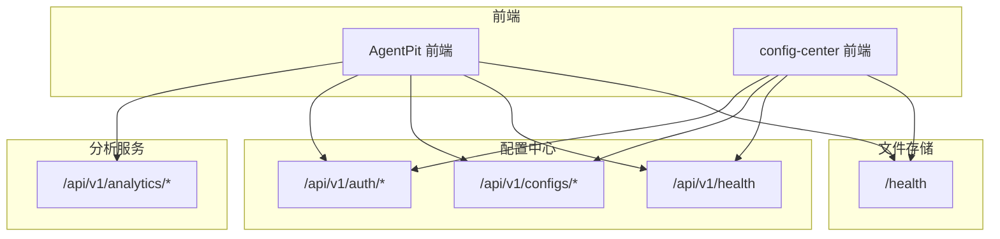
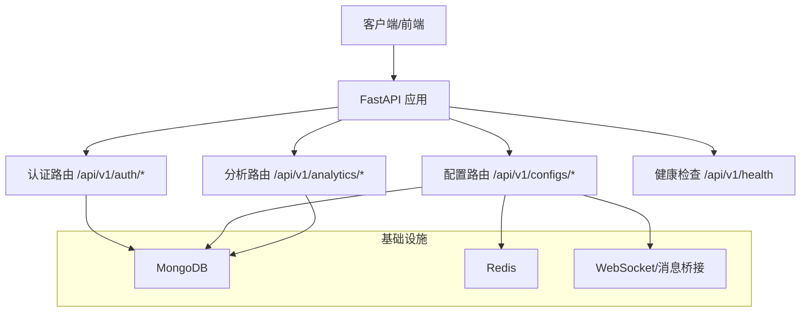
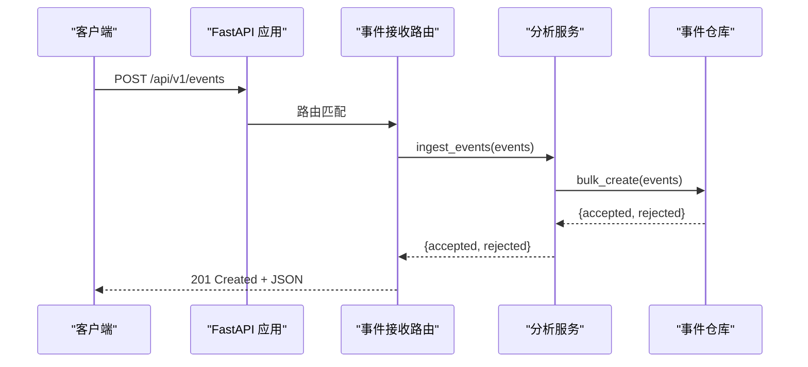
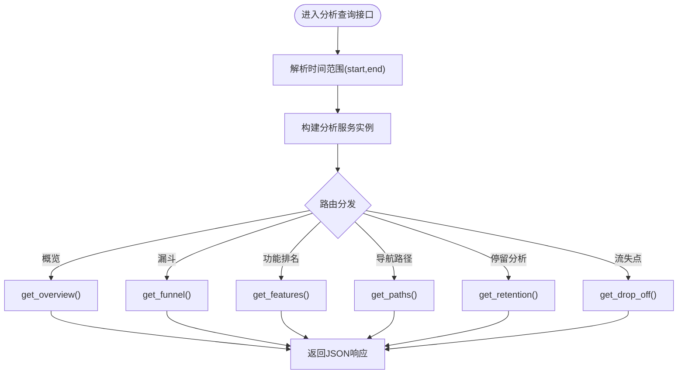
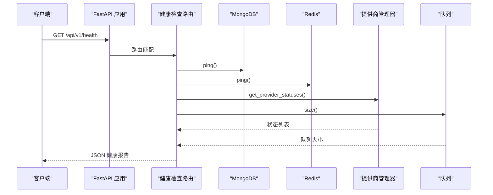
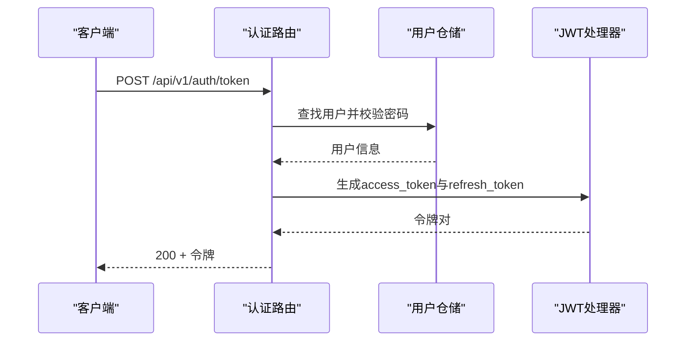
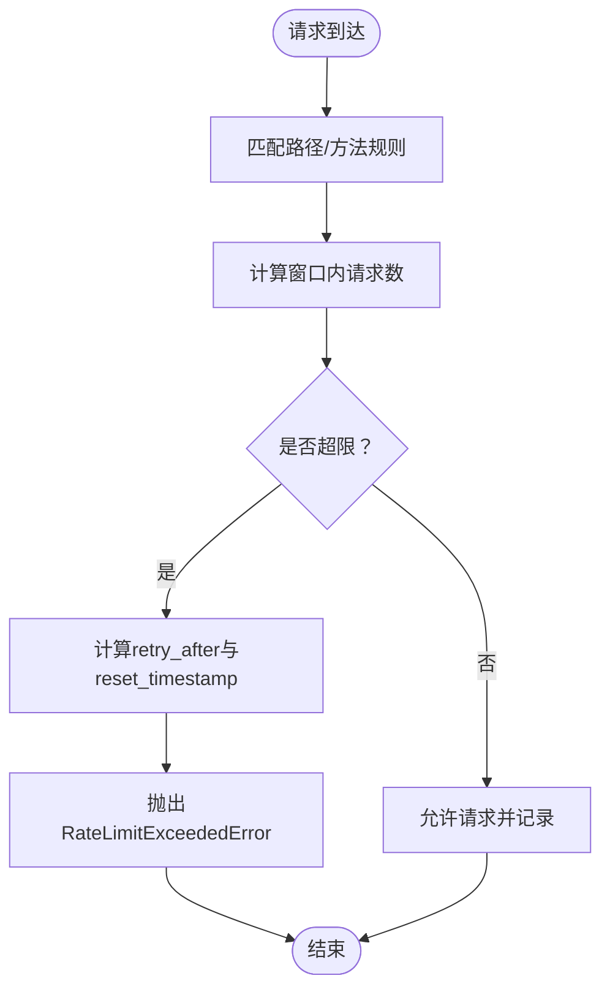
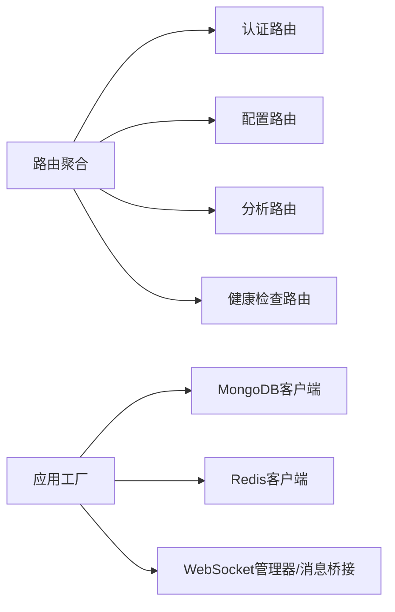

# 服务器端点

<cite>
**本文引用的文件**
- [tools/flexloop/src/taolib/testing/analytics/server/api/analytics.py](file://tools/flexloop/src/taolib/testing/analytics/server/api/analytics.py)
- [tools/flexloop/tests/testing/test_analytics/test_api.py](file://tools/flexloop/tests/testing/test_analytics/test_api.py)
- [tools/flexloop/src/taolib/testing/email_service/server/api/health.py](file://tools/flexloop/src/taolib/testing/email_service/server/api/health.py)
- [tools/flexloop/src/taolib/testing/file_storage/server/api/health.py](file://tools/flexloop/src/taolib/testing/file_storage/server/api/health.py)
- [tools/flexloop/src/taolib/testing/config_center/server/api/router.py](file://tools/flexloop/src/taolib/testing/config_center/server/api/router.py)
- [tools/flexloop/src/taolib/testing/config_center/server/app.py](file://tools/flexloop/src/taolib/testing/config_center/server/app.py)
- [tools/flexloop/src/taolib/testing/config_center/server/config.py](file://tools/flexloop/src/taolib/testing/config_center/server/config.py)
- [tools/flexloop/src/taolib/testing/config_center/server/api/auth.py](file://tools/flexloop/src/taolib/testing/config_center/server/api/auth.py)
- [tools/flexloop/src/taolib/testing/config_center/server/api/configs.py](file://tools/flexloop/src/taolib/testing/config_center/server/api/configs.py)
- [tools/flexloop/src/taolib/testing/rate_limiter/limiter.py](file://tools/flexloop/src/taolib/testing/rate_limiter/limiter.py)
- [tools/flexloop/src/taolib/testing/rate_limiter/errors.py](file://tools/flexloop/src/taolib/testing/rate_limiter/errors.py)
- [apps/AgentPit/docs/API_INTEGRATION_PLAN.md](file://apps/AgentPit/docs/API_INTEGRATION_PLAN.md)
- [apps/AgentPit/src/services/config.ts](file://apps/AgentPit/src/services/config.ts)
- [apps/config-center/src/api/configs.ts](file://apps/config-center/src/api/configs.ts)
- [apps/config-center/src/api/client.ts](file://apps/config-center/src/api/client.ts)
- [apps/DaoMind/packages/daoMonitor/src/snapshot.ts](file://apps/DaoMind/packages/daoMonitor/src/snapshot.ts)
- [apps/DaoMind/packages/daoMonitor/src/types.ts](file://apps/DaoMind/packages/daoMonitor/src/types.ts)
</cite>

## 目录
1. [简介](#简介)
2. [项目结构](#项目结构)
3. [核心组件](#核心组件)
4. [架构总览](#架构总览)
5. [详细组件分析](#详细组件分析)
6. [依赖分析](#依赖分析)
7. [性能考虑](#性能考虑)
8. [故障排查指南](#故障排查指南)
9. [结论](#结论)
10. [附录](#附录)

## 简介
本文件面向服务器端点的API文档，聚焦三类核心能力：
- 事件接收端点：用于接收客户端上报的事件数据，支持批量写入与异步处理。
- 分析查询接口：提供概览统计、转化漏斗、功能排名、导航路径、停留分析与流失点分析等多维分析能力。
- 健康检查服务：提供系统健康状态检查，包含数据库、缓存、外部提供商与队列状态。

同时，文档覆盖HTTP端点规范、请求参数与响应格式、安全机制（认证授权、请求验证、速率限制）、调用示例、错误处理策略与状态码定义，并给出服务器配置选项、性能调优参数与监控指标建议。

## 项目结构
该仓库包含多个子系统与服务，其中与API直接相关的关键模块如下：
- 分析服务（analytics）：提供事件接收与分析查询API。
- 配置中心（config-center）：提供认证、配置管理与健康检查API。
- 文件存储（file-storage）：提供基础健康检查端点。
- 速率限制（rate-limiter）：提供通用限流能力。
- 前端集成示例：AgentPit与config-center前端展示了API调用方式与错误处理。

**图表来源**
- [tools/flexloop/src/taolib/testing/analytics/server/api/analytics.py:1-343](file://tools/flexloop/src/taolib/testing/analytics/server/api/analytics.py#L1-L343)
- [tools/flexloop/src/taolib/testing/config_center/server/api/router.py:1-30](file://tools/flexloop/src/taolib/testing/config_center/server/api/router.py#L1-L30)
- [tools/flexloop/src/taolib/testing/email_service/server/api/health.py:1-57](file://tools/flexloop/src/taolib/testing/email_service/server/api/health.py#L1-L57)
- [tools/flexloop/src/taolib/testing/file_storage/server/api/health.py:1-13](file://tools/flexloop/src/taolib/testing/file_storage/server/api/health.py#L1-L13)

**章节来源**
- [tools/flexloop/src/taolib/testing/analytics/server/api/analytics.py:1-343](file://tools/flexloop/src/taolib/testing/analytics/server/api/analytics.py#L1-L343)
- [tools/flexloop/src/taolib/testing/config_center/server/api/router.py:1-30](file://tools/flexloop/src/taolib/testing/config_center/server/api/router.py#L1-L30)
- [tools/flexloop/src/taolib/testing/email_service/server/api/health.py:1-57](file://tools/flexloop/src/taolib/testing/email_service/server/api/health.py#L1-L57)
- [tools/flexloop/src/taolib/testing/file_storage/server/api/health.py:1-13](file://tools/flexloop/src/taolib/testing/file_storage/server/api/health.py#L1-L13)

## 核心组件
- 事件接收端点（分析服务）：POST /api/v1/events，接收事件数据并返回受理/拒绝计数。
- 分析查询接口（分析服务）：GET /api/v1/analytics/{overview,funnel,features,paths,retention,drop-off}，支持时间范围与参数校验。
- 健康检查服务（配置中心/文件存储）：GET /api/v1/health 与 GET /health，返回系统健康状态与组件可用性。
- 认证与配置管理（配置中心）：登录、刷新令牌、获取当前用户、配置列表、详情、创建、更新、删除、发布。
- 速率限制：滑动窗口限流，超限时抛出自定义异常并提供重试建议。

**章节来源**
- [tools/flexloop/tests/testing/test_analytics/test_api.py:180-279](file://tools/flexloop/tests/testing/test_analytics/test_api.py#L180-L279)
- [tools/flexloop/src/taolib/testing/analytics/server/api/analytics.py:54-343](file://tools/flexloop/src/taolib/testing/analytics/server/api/analytics.py#L54-L343)
- [tools/flexloop/src/taolib/testing/config_center/server/api/router.py:1-30](file://tools/flexloop/src/taolib/testing/config_center/server/api/router.py#L1-L30)
- [tools/flexloop/src/taolib/testing/rate_limiter/limiter.py:130-172](file://tools/flexloop/src/taolib/testing/rate_limiter/limiter.py#L130-L172)
- [tools/flexloop/src/taolib/testing/rate_limiter/errors.py:1-39](file://tools/flexloop/src/taolib/testing/rate_limiter/errors.py#L1-L39)

## 架构总览
系统采用FastAPI作为Web框架，统一前缀/api/v1，按功能模块划分路由。认证采用JWT，配置中心提供RBAC权限控制；分析服务通过事件仓库与会话仓库进行数据持久化与查询；健康检查端点聚合数据库、缓存与外部提供商状态；速率限制器提供滑动窗口限流。

**图表来源**
- [tools/flexloop/src/taolib/testing/config_center/server/app.py:1-39](file://tools/flexloop/src/taolib/testing/config_center/server/app.py#L1-L39)
- [tools/flexloop/src/taolib/testing/config_center/server/api/router.py:1-30](file://tools/flexloop/src/taolib/testing/config_center/server/api/router.py#L1-L30)
- [tools/flexloop/src/taolib/testing/email_service/server/api/health.py:1-57](file://tools/flexloop/src/taolib/testing/email_service/server/api/health.py#L1-L57)

## 详细组件分析

### 事件接收端点（POST /api/v1/events）
- 功能：接收事件数据，返回受理/拒绝计数。
- 请求方法：POST
- URL模式：/api/v1/events
- 请求头：Content-Type: application/json
- 请求参数：事件数组（字段包含事件类型、应用ID、会话ID、页面URL、时间戳等）
- 响应格式：JSON，包含accepted与rejected计数
- 示例调用：见测试用例中的POST请求与请求体结构
- 安全：需携带API Key（X-API-Key），由测试用例验证
- 错误处理：状态码201表示成功受理；若限流或验证失败，将返回相应错误码

**图表来源**
- [tools/flexloop/tests/testing/test_analytics/test_api.py:180-198](file://tools/flexloop/tests/testing/test_analytics/test_api.py#L180-L198)
- [tools/flexloop/src/taolib/testing/analytics/server/api/analytics.py:54-105](file://tools/flexloop/src/taolib/testing/analytics/server/api/analytics.py#L54-L105)

**章节来源**
- [tools/flexloop/tests/testing/test_analytics/test_api.py:180-198](file://tools/flexloop/tests/testing/test_analytics/test_api.py#L180-L198)
- [tools/flexloop/src/taolib/testing/analytics/server/api/analytics.py:54-105](file://tools/flexloop/src/taolib/testing/analytics/server/api/analytics.py#L54-L105)

### 分析查询接口（GET /api/v1/analytics/*）
- 统计概览：GET /api/v1/analytics/overview
  - 查询参数：app_id（必填）、start/end（可选，ISO 8601）
  - 响应：核心指标（如pv、uv、sessions、avg_session_duration、bounce_rate、new_users）
- 转化漏斗：GET /api/v1/analytics/funnel
  - 查询参数：app_id（必填）、steps（必填，逗号分隔）、start/end（可选）
  - 响应：每一步的用户数与转化率，以及总体转化率
- 功能排名：GET /api/v1/analytics/features
  - 查询参数：app_id（必填）、start/end（可选）、limit（默认20，最大100）
  - 响应：功能使用次数与独立用户数排序
- 导航路径：GET /api/v1/analytics/paths
  - 查询参数：app_id（必填）、start/end（可选）、limit（默认50，最大200）
  - 响应：用户路径序列、出现次数与平均时长
- 停留分析：GET /api/v1/analytics/retention
  - 查询参数：app_id（必填）、start/end（可选）
  - 响应：区域平均停留时长与访问次数
- 流失点分析：GET /api/v1/analytics/drop-off
  - 查询参数：app_id（必填）、steps（必填，逗号分隔）、start/end（可选）
  - 响应：各步骤的流失人数与流失率

**图表来源**
- [tools/flexloop/src/taolib/testing/analytics/server/api/analytics.py:28-343](file://tools/flexloop/src/taolib/testing/analytics/server/api/analytics.py#L28-L343)

**章节来源**
- [tools/flexloop/src/taolib/testing/analytics/server/api/analytics.py:54-343](file://tools/flexloop/src/taolib/testing/analytics/server/api/analytics.py#L54-L343)
- [tools/flexloop/tests/testing/test_analytics/test_api.py:200-279](file://tools/flexloop/tests/testing/test_analytics/test_api.py#L200-L279)

### 健康检查服务（GET /api/v1/health 与 GET /health）
- 配置中心健康检查：GET /api/v1/health
  - 响应：status（ok/degraded）、database（布尔）、redis（布尔）、providers（提供商健康列表）、queue（队列大小）
  - 总体状态：任一数据库或缓存不可用时降级为degraded
- 文件存储健康检查：GET /health
  - 响应：{"status": "ok"}

**图表来源**
- [tools/flexloop/src/taolib/testing/email_service/server/api/health.py:8-56](file://tools/flexloop/src/taolib/testing/email_service/server/api/health.py#L8-L56)
- [tools/flexloop/src/taolib/testing/file_storage/server/api/health.py:8-12](file://tools/flexloop/src/taolib/testing/file_storage/server/api/health.py#L8-L12)

**章节来源**
- [tools/flexloop/src/taolib/testing/email_service/server/api/health.py:1-57](file://tools/flexloop/src/taolib/testing/email_service/server/api/health.py#L1-L57)
- [tools/flexloop/src/taolib/testing/file_storage/server/api/health.py:1-13](file://tools/flexloop/src/taolib/testing/file_storage/server/api/health.py#L1-L13)

### 认证与配置管理（配置中心）
- 登录：POST /api/v1/auth/token
  - 请求：application/x-www-form-urlencoded（username、password）
  - 响应：access_token、refresh_token、token_type
  - 错误：401 未授权
- 刷新令牌：POST /api/v1/auth/refresh
  - 请求：refresh_token
  - 响应：新的access_token与refresh_token
  - 错误：401 无效的Refresh Token
- 获取当前用户：GET /api/v1/auth/me
  - 响应：用户信息（含角色）
  - 错误：401 未授权
- 配置管理：GET/POST/PUT/DELETE /api/v1/configs/*
  - 支持按环境与服务过滤、分页、版本控制、审计日志与实时推送
  - 需要JWT认证与相应权限（如config:read/write/publish/delete）

**图表来源**
- [tools/flexloop/src/taolib/testing/config_center/server/api/auth.py:92-122](file://tools/flexloop/src/taolib/testing/config_center/server/api/auth.py#L92-L122)

**章节来源**
- [tools/flexloop/src/taolib/testing/config_center/server/api/auth.py:45-267](file://tools/flexloop/src/taolib/testing/config_center/server/api/auth.py#L45-L267)
- [tools/flexloop/src/taolib/testing/config_center/server/api/configs.py:64-382](file://tools/flexloop/src/taolib/testing/config_center/server/api/configs.py#L64-L382)

### 速率限制（Rate Limiter）
- 机制：基于滑动窗口的限流，按标识符（如用户ID或IP）与路径/方法组合计数
- 触发条件：超过阈值时抛出RateLimitExceededError，包含limit、window_seconds、retry_after、identifier与reset_timestamp
- 响应：客户端应在retry_after秒后重试

**图表来源**
- [tools/flexloop/src/taolib/testing/rate_limiter/limiter.py:130-172](file://tools/flexloop/src/taolib/testing/rate_limiter/limiter.py#L130-L172)
- [tools/flexloop/src/taolib/testing/rate_limiter/errors.py:1-39](file://tools/flexloop/src/taolib/testing/rate_limiter/errors.py#L1-L39)

**章节来源**
- [tools/flexloop/src/taolib/testing/rate_limiter/limiter.py:130-172](file://tools/flexloop/src/taolib/testing/rate_limiter/limiter.py#L130-L172)
- [tools/flexloop/src/taolib/testing/rate_limiter/errors.py:1-39](file://tools/flexloop/src/taolib/testing/rate_limiter/errors.py#L1-L39)

## 依赖分析
- 路由聚合：统一前缀/api/v1，注册健康检查、认证、配置、版本、审计、用户、角色、推送等路由。
- 应用初始化：MongoDB与Redis连接、WebSocket管理器与消息桥接初始化。
- 配置中心设置：MongoDB、Redis、JWT密钥、主机端口、CORS等。

**图表来源**
- [tools/flexloop/src/taolib/testing/config_center/server/api/router.py:17-27](file://tools/flexloop/src/taolib/testing/config_center/server/api/router.py#L17-L27)
- [tools/flexloop/src/taolib/testing/config_center/server/app.py:27-39](file://tools/flexloop/src/taolib/testing/config_center/server/app.py#L27-L39)
- [tools/flexloop/src/taolib/testing/config_center/server/config.py:12-41](file://tools/flexloop/src/taolib/testing/config_center/server/config.py#L12-L41)

**章节来源**
- [tools/flexloop/src/taolib/testing/config_center/server/api/router.py:1-30](file://tools/flexloop/src/taolib/testing/config_center/server/api/router.py#L1-L30)
- [tools/flexloop/src/taolib/testing/config_center/server/app.py:1-39](file://tools/flexloop/src/taolib/testing/config_center/server/app.py#L1-L39)
- [tools/flexloop/src/taolib/testing/config_center/server/config.py:1-41](file://tools/flexloop/src/taolib/testing/config_center/server/config.py#L1-L41)

## 性能考虑
- 限流策略：使用滑动窗口限流，避免突发流量冲击；建议结合IP与用户维度分别限流。
- 缓存：配置中心使用Redis缓存热点配置，降低数据库压力。
- 异步处理：事件接收采用批量写入与后台处理，提升吞吐量。
- 监控指标：健康检查聚合数据库、缓存、提供商与队列状态，便于快速定位瓶颈。
- 前端调优：前端示例提供超时、重试与Mock开关，减少网络抖动影响。

**章节来源**
- [tools/flexloop/src/taolib/testing/rate_limiter/limiter.py:130-172](file://tools/flexloop/src/taolib/testing/rate_limiter/limiter.py#L130-L172)
- [tools/flexloop/src/taolib/testing/config_center/server/app.py:38-39](file://tools/flexloop/src/taolib/testing/config_center/server/app.py#L38-L39)
- [tools/flexloop/src/taolib/testing/email_service/server/api/health.py:19-48](file://tools/flexloop/src/taolib/testing/email_service/server/api/health.py#L19-L48)
- [apps/AgentPit/docs/API_INTEGRATION_PLAN.md:64-105](file://apps/AgentPit/docs/API_INTEGRATION_PLAN.md#L64-L105)

## 故障排查指南
- 认证失败（401）：检查Authorization头是否包含有效的Bearer Token；确认用户名密码正确或Refresh Token有效。
- 权限不足（403）：确认用户具备所需权限（如config:read/write/publish/delete）。
- 配置不存在（404）：确认config_id正确且存在。
- 速率限制（429）：遵循RateLimitExceededError中的retry_after秒后重试；优化客户端重试策略。
- 健康检查异常（degraded）：检查数据库与缓存连通性，关注提供商状态与队列积压情况。

**章节来源**
- [tools/flexloop/src/taolib/testing/config_center/server/api/auth.py:98-104](file://tools/flexloop/src/taolib/testing/config_center/server/api/auth.py#L98-L104)
- [tools/flexloop/src/taolib/testing/config_center/server/api/configs.py:177-180](file://tools/flexloop/src/taolib/testing/config_center/server/api/configs.py#L177-L180)
- [tools/flexloop/src/taolib/testing/rate_limiter/errors.py:1-39](file://tools/flexloop/src/taolib/testing/rate_limiter/errors.py#L1-L39)
- [tools/flexloop/src/taolib/testing/email_service/server/api/health.py:50-54](file://tools/flexloop/src/taolib/testing/email_service/server/api/health.py#L50-L54)

## 结论
本文档系统梳理了事件接收、分析查询与健康检查三大类API，明确了HTTP端点规范、安全机制、错误处理与性能调优要点。建议在生产环境中启用JWT认证与RBAC权限控制，结合Redis缓存与滑动窗口限流，配合健康检查与监控指标，确保系统的高可用与高性能。

## 附录

### HTTP端点一览表
- 事件接收
  - 方法：POST
  - 路径：/api/v1/events
  - 请求头：Content-Type: application/json
  - 请求体：事件数组
  - 响应：201 + JSON（accepted/rejected）
- 分析查询
  - 概览：GET /api/v1/analytics/overview（app_id必填，start/end可选）
  - 漏斗：GET /api/v1/analytics/funnel（app_id、steps必填）
  - 功能排名：GET /api/v1/analytics/features（app_id必填，limit可选）
  - 导航路径：GET /api/v1/analytics/paths（app_id必填，limit可选）
  - 停留分析：GET /api/v1/analytics/retention（app_id必填）
  - 流失点：GET /api/v1/analytics/drop-off（app_id、steps必填）
- 健康检查
  - 配置中心：GET /api/v1/health
  - 文件存储：GET /health
- 认证与配置
  - 登录：POST /api/v1/auth/token
  - 刷新：POST /api/v1/auth/refresh
  - 当前用户：GET /api/v1/auth/me
  - 配置列表：GET /api/v1/configs
  - 配置详情：GET /api/v1/configs/{config_id}
  - 创建配置：POST /api/v1/configs
  - 更新配置：PUT /api/v1/configs/{config_id}
  - 删除配置：DELETE /api/v1/configs/{config_id}
  - 发布配置：POST /api/v1/configs/{config_id}/publish

**章节来源**
- [tools/flexloop/tests/testing/test_analytics/test_api.py:180-279](file://tools/flexloop/tests/testing/test_analytics/test_api.py#L180-L279)
- [tools/flexloop/src/taolib/testing/analytics/server/api/analytics.py:54-343](file://tools/flexloop/src/taolib/testing/analytics/server/api/analytics.py#L54-L343)
- [tools/flexloop/src/taolib/testing/email_service/server/api/health.py:8-56](file://tools/flexloop/src/taolib/testing/email_service/server/api/health.py#L8-L56)
- [tools/flexloop/src/taolib/testing/file_storage/server/api/health.py:8-12](file://tools/flexloop/src/taolib/testing/file_storage/server/api/health.py#L8-L12)
- [tools/flexloop/src/taolib/testing/config_center/server/api/auth.py:92-122](file://tools/flexloop/src/taolib/testing/config_center/server/api/auth.py#L92-L122)
- [tools/flexloop/src/taolib/testing/config_center/server/api/configs.py:117-382](file://tools/flexloop/src/taolib/testing/config_center/server/api/configs.py#L117-L382)

### 安全机制
- 认证授权
  - JWT：Access Token（15分钟）与Refresh Token（7天），Authorization: Bearer <access_token>
  - RBAC：配置中心端点需JWT认证，部分操作需特定权限（如config:read/write/publish/delete）
- 请求验证
  - 分析查询接口对时间范围与参数进行解析与校验
  - 事件接收接口通过API Key（X-API-Key）进行请求验证
- 速率限制
  - 滑动窗口限流，超限抛出RateLimitExceededError，包含retry_after与reset_timestamp

**章节来源**
- [tools/flexloop/src/taolib/testing/config_center/server/api/auth.py:26-42](file://tools/flexloop/src/taolib/testing/config_center/server/api/auth.py#L26-L42)
- [tools/flexloop/src/taolib/testing/config_center/server/api/configs.py:29-46](file://tools/flexloop/src/taolib/testing/config_center/server/api/configs.py#L29-L46)
- [tools/flexloop/tests/testing/test_analytics/test_api.py:186-196](file://tools/flexloop/tests/testing/test_analytics/test_api.py#L186-L196)
- [tools/flexloop/src/taolib/testing/rate_limiter/limiter.py:130-172](file://tools/flexloop/src/taolib/testing/rate_limiter/limiter.py#L130-L172)

### 服务器配置选项
- MongoDB
  - 连接字符串：mongo_url
  - 数据库名称：mongo_db
- Redis
  - 连接字符串：redis_url
- JWT
  - 密钥：jwt_secret（生产环境必须设置，≥32字符）
  - 算法：jwt_algorithm
  - Access Token过期：access_token_expire_minutes
  - Refresh Token过期：refresh_token_expire_days
- 服务器
  - 监听地址：host
  - 监听端口：port
  - 调试模式：debug
- CORS
  - 允许源：cors_origins

**章节来源**
- [tools/flexloop/src/taolib/testing/config_center/server/config.py:12-41](file://tools/flexloop/src/taolib/testing/config_center/server/config.py#L12-L41)

### 监控指标与前端集成
- 监控快照（DaoMind）
  - 包含heatmaps、flowVectors、gauges、alerts、diagnoses与systemHealth
  - 支持获取最新快照与历史快照
- 前端调用示例
  - AgentPit与config-center前端展示了HTTP客户端封装、超时与重试策略、Mock开关与API基础配置

**章节来源**
- [apps/DaoMind/packages/daoMonitor/src/snapshot.ts:44-75](file://apps/DaoMind/packages/daoMonitor/src/snapshot.ts#L44-L75)
- [apps/DaoMind/packages/daoMonitor/src/types.ts:63-71](file://apps/DaoMind/packages/daoMonitor/src/types.ts#L63-L71)
- [apps/AgentPit/docs/API_INTEGRATION_PLAN.md:64-105](file://apps/AgentPit/docs/API_INTEGRATION_PLAN.md#L64-L105)
- [apps/AgentPit/src/services/config.ts:1-10](file://apps/AgentPit/src/services/config.ts#L1-L10)
- [apps/config-center/src/api/configs.ts:1-32](file://apps/config-center/src/api/configs.ts#L1-L32)
- [apps/config-center/src/api/client.ts:1-42](file://apps/config-center/src/api/client.ts#L1-L42)