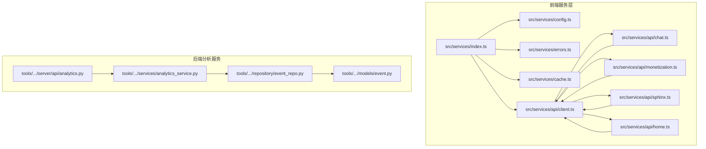
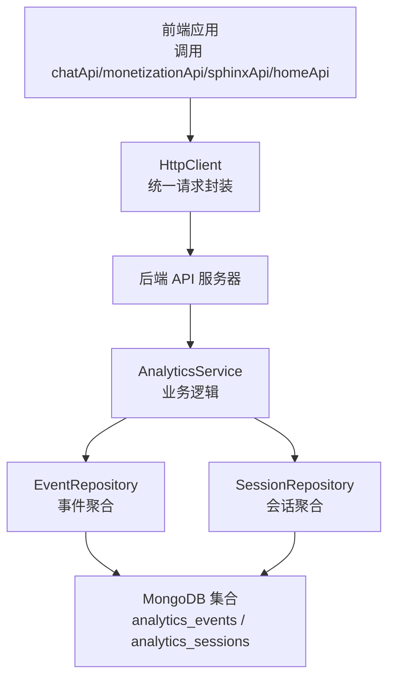
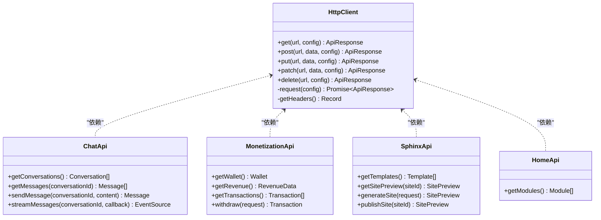
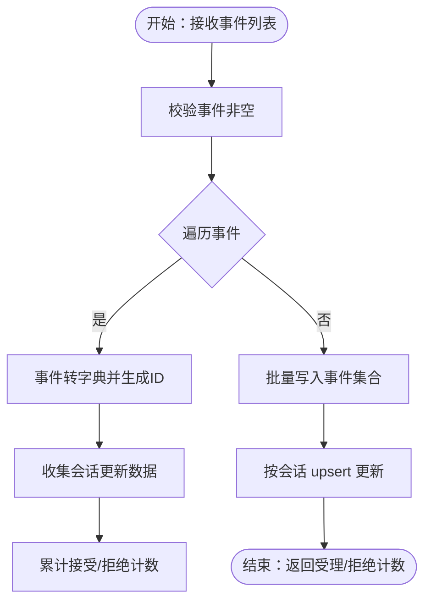
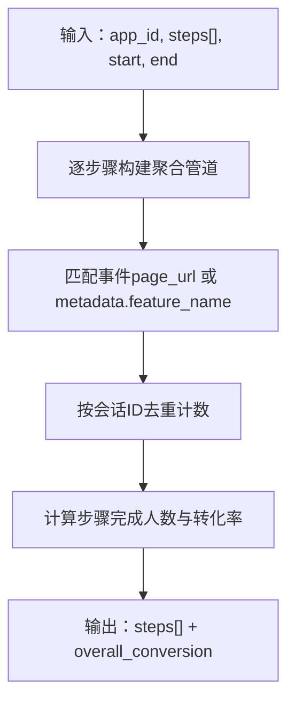
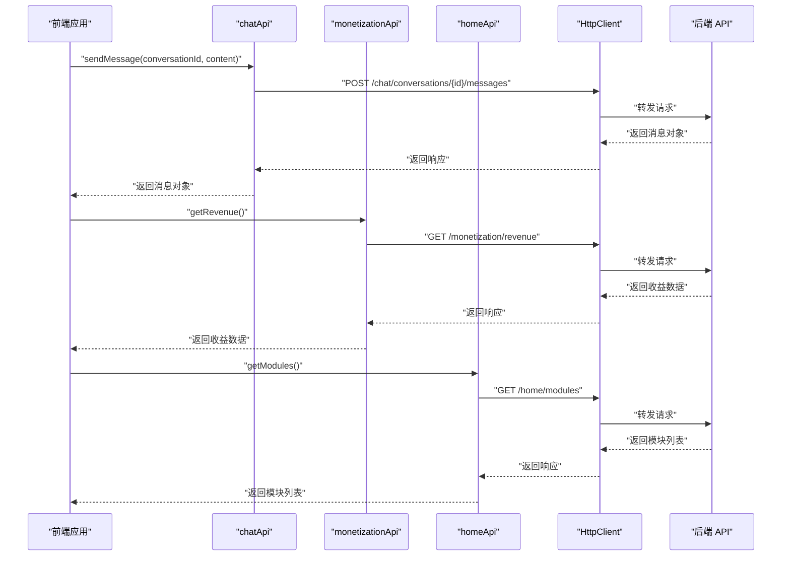
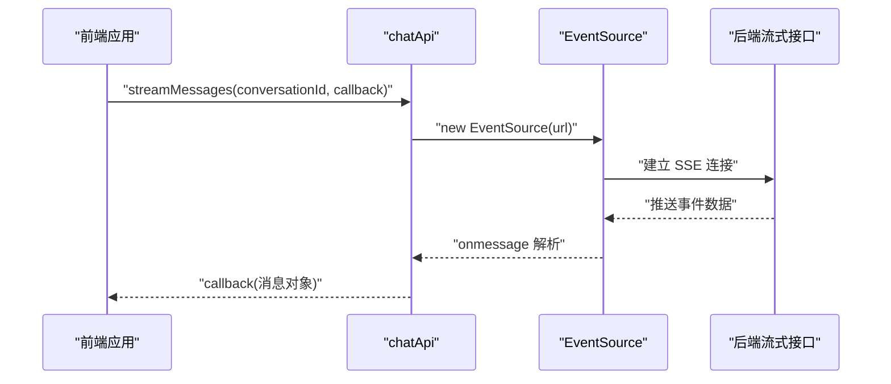
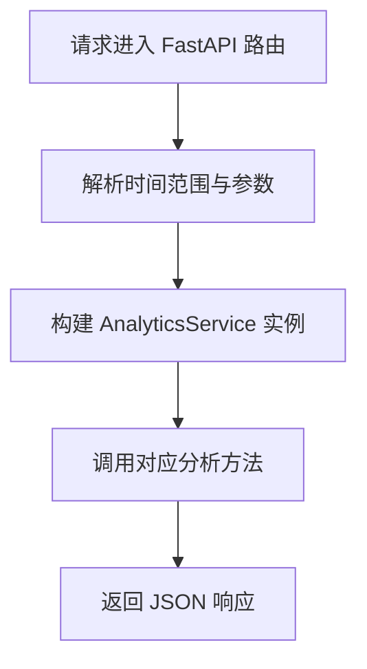
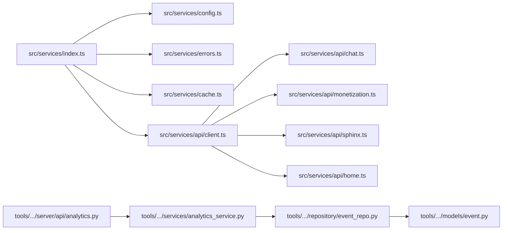

# 服务层

<cite>
**本文引用的文件**
- [src/services/index.ts](file://src/services/index.ts)
- [src/services/api/client.ts](file://src/services/api/client.ts)
- [src/services/config.ts](file://src/services/config.ts)
- [src/services/cache.ts](file://src/services/cache.ts)
- [src/services/api/chat.ts](file://src/services/api/chat.ts)
- [src/services/api/monetization.ts](file://src/services/api/monetization.ts)
- [src/services/api/sphinx.ts](file://src/services/api/sphinx.ts)
- [src/services/api/home.ts](file://src/services/api/home.ts)
- [src/services/errors.ts](file://src/services/errors.ts)
- [apps/AgentPit/src/services/index.ts](file://apps/AgentPit/src/services/index.ts)
- [tools/flexloop/src/taolib/testing/analytics/services/analytics_service.py](file://tools/flexloop/src/taolib/testing/analytics/services/analytics_service.py)
- [tools/flexloop/src/taolib/testing/analytics/models/event.py](file://tools/flexloop/src/taolib/testing/analytics/models/event.py)
- [tools/flexloop/src/taolib/testing/analytics/repository/event_repo.py](file://tools/flexloop/src/taolib/testing/analytics/repository/event_repo.py)
- [tools/flexloop/src/taolib/testing/analytics/server/api/analytics.py](file://tools/flexloop/src/taolib/testing/analytics/server/api/analytics.py)
</cite>

## 目录
1. [简介](#简介)
2. [项目结构](#项目结构)
3. [核心组件](#核心组件)
4. [架构总览](#架构总览)
5. [详细组件分析](#详细组件分析)
6. [依赖关系分析](#依赖关系分析)
7. [性能考量](#性能考量)
8. [故障排查指南](#故障排查指南)
9. [结论](#结论)
10. [附录](#附录)

## 简介
本文件面向“服务层”的技术文档，覆盖前端 JavaScript SDK 与后端 Python 分析服务两大体系：
- 前端服务层：统一的 HTTP 客户端、配置、缓存与各业务 API 封装（聊天、货币化、站点生成、首页模块），并提供事件流（SSE）能力。
- 后端分析服务：事件摄入、会话聚合、多种分析指标与报表的聚合计算，以及 FastAPI 查询接口。

文档将深入解释事件处理流程、数据聚合算法与指标计算逻辑，说明 SDK 的 API 接口、事件发送机制与异步处理模式，并给出服务调用示例、性能监控、错误重试与数据一致性保障策略，以及与外部系统的集成方式与 API 规范。

## 项目结构
前端服务层位于 src/services，包含通用配置、HTTP 客户端、缓存与错误类型，以及按业务划分的 API 模块；后端分析服务位于 tools/flexloop 下的 analytics 子模块，包含模型、仓库层、业务服务与 FastAPI 路由。

**图示来源**
- [src/services/index.ts:1-10](file://src/services/index.ts#L1-L10)
- [src/services/config.ts:1-11](file://src/services/config.ts#L1-L11)
- [src/services/errors.ts:1-45](file://src/services/errors.ts#L1-L45)
- [src/services/cache.ts:1-50](file://src/services/cache.ts#L1-L50)
- [src/services/api/client.ts:1-105](file://src/services/api/client.ts#L1-L105)
- [src/services/api/chat.ts:1-87](file://src/services/api/chat.ts#L1-L87)
- [src/services/api/monetization.ts:1-77](file://src/services/api/monetization.ts#L1-L77)
- [src/services/api/sphinx.ts:1-69](file://src/services/api/sphinx.ts#L1-L69)
- [src/services/api/home.ts:1-30](file://src/services/api/home.ts#L1-L30)
- [tools/flexloop/src/taolib/testing/analytics/server/api/analytics.py:1-343](file://tools/flexloop/src/taolib/testing/analytics/server/api/analytics.py#L1-L343)
- [tools/flexloop/src/taolib/testing/analytics/services/analytics_service.py:1-271](file://tools/flexloop/src/taolib/testing/analytics/services/analytics_service.py#L1-L271)
- [tools/flexloop/src/taolib/testing/analytics/repository/event_repo.py:1-469](file://tools/flexloop/src/taolib/testing/analytics/repository/event_repo.py#L1-L469)
- [tools/flexloop/src/taolib/testing/analytics/models/event.py:1-105](file://tools/flexloop/src/taolib/testing/analytics/models/event.py#L1-L105)

**章节来源**
- [src/services/index.ts:1-10](file://src/services/index.ts#L1-L10)
- [apps/AgentPit/src/services/index.ts:1-10](file://apps/AgentPit/src/services/index.ts#L1-L10)

## 核心组件
- HTTP 客户端与请求封装：统一的 HttpClient，支持 GET/POST/PUT/PATCH/DELETE 方法，内置超时控制、鉴权头注入与错误分类。
- 配置中心：集中管理 baseURL、超时、是否使用 Mock、重试策略等。
- 缓存管理：基于内存 Map 的 TTL 缓存，支持键匹配清理。
- 错误体系：ApiError 及其子类（NetworkError、ServerError、ValidationError、UnauthorizedError）。
- 业务 API 模块：chat、monetization、sphinx、home，均支持 Mock 切换与真实 API 调用。
- 事件流（SSE）：聊天模块提供流式消息订阅，便于实时交互。
- 分析服务：事件摄入、会话聚合、概览、漏斗、功能排名、导航路径、停留时间、流失点等分析能力。
- FastAPI 查询接口：提供概览、漏斗、功能、路径、留存、流失等分析接口，支持时间范围与参数校验。

**章节来源**
- [src/services/api/client.ts:19-102](file://src/services/api/client.ts#L19-L102)
- [src/services/config.ts:2-10](file://src/services/config.ts#L2-L10)
- [src/services/cache.ts:8-47](file://src/services/cache.ts#L8-L47)
- [src/services/errors.ts:2-44](file://src/services/errors.ts#L2-L44)
- [src/services/api/chat.ts:26-86](file://src/services/api/chat.ts#L26-L86)
- [src/services/api/monetization.ts:40-76](file://src/services/api/monetization.ts#L40-L76)
- [src/services/api/sphinx.ts:32-68](file://src/services/api/sphinx.ts#L32-L68)
- [src/services/api/home.ts:20-29](file://src/services/api/home.ts#L20-L29)
- [tools/flexloop/src/taolib/testing/analytics/services/analytics_service.py:16-271](file://tools/flexloop/src/taolib/testing/analytics/services/analytics_service.py#L16-L271)
- [tools/flexloop/src/taolib/testing/analytics/server/api/analytics.py:54-343](file://tools/flexloop/src/taolib/testing/analytics/server/api/analytics.py#L54-L343)

## 架构总览
前端服务层通过 HttpClient 统一访问后端 API；后端分析服务通过 AnalyticsService 调用 EventRepository 进行聚合分析，FastAPI 路由提供对外查询接口。

**图示来源**
- [src/services/api/client.ts:33-69](file://src/services/api/client.ts#L33-L69)
- [tools/flexloop/src/taolib/testing/analytics/server/api/analytics.py:43-51](file://tools/flexloop/src/taolib/testing/analytics/server/api/analytics.py#L43-L51)
- [tools/flexloop/src/taolib/testing/analytics/services/analytics_service.py:19-31](file://tools/flexloop/src/taolib/testing/analytics/services/analytics_service.py#L19-L31)
- [tools/flexloop/src/taolib/testing/analytics/repository/event_repo.py:19-21](file://tools/flexloop/src/taolib/testing/analytics/repository/event_repo.py#L19-L21)

## 详细组件分析

### 前端服务层：HTTP 客户端与业务 API
- HttpClient
  - 负责构建请求头（自动注入 Authorization Bearer）、超时控制（AbortController）、错误分类与统一响应结构。
  - 支持 GET/POST/PUT/PATCH/DELETE 方法，内部复用 request 并返回标准化 ApiResponse。
- 配置中心
  - baseURL、timeout、useMock、retry.maxRetries/retryDelay。
- 缓存管理
  - 提供 get/set/delete/clear/clearPattern，支持 TTL 过期与正则清理。
- 错误体系
  - ApiError、NetworkError、ServerError、ValidationError、UnauthorizedError，便于上层捕获与处理。
- 业务 API
  - chatApi：对话列表、消息历史、发送消息、SSE 流式消息。
  - monetizationApi：钱包余额、收益数据、交易历史、提现。
  - sphinxApi：模板列表、网站预览、生成网站、发布网站。
  - homeApi：首页模块列表。

**图示来源**
- [src/services/api/client.ts:19-102](file://src/services/api/client.ts#L19-L102)
- [src/services/api/chat.ts:26-86](file://src/services/api/chat.ts#L26-L86)
- [src/services/api/monetization.ts:40-76](file://src/services/api/monetization.ts#L40-L76)
- [src/services/api/sphinx.ts:32-68](file://src/services/api/sphinx.ts#L32-L68)
- [src/services/api/home.ts:20-29](file://src/services/api/home.ts#L20-L29)

**章节来源**
- [src/services/api/client.ts:19-102](file://src/services/api/client.ts#L19-L102)
- [src/services/config.ts:2-10](file://src/services/config.ts#L2-L10)
- [src/services/cache.ts:8-47](file://src/services/cache.ts#L8-L47)
- [src/services/errors.ts:2-44](file://src/services/errors.ts#L2-L44)
- [src/services/api/chat.ts:26-86](file://src/services/api/chat.ts#L26-L86)
- [src/services/api/monetization.ts:40-76](file://src/services/api/monetization.ts#L40-L76)
- [src/services/api/sphinx.ts:32-68](file://src/services/api/sphinx.ts#L32-L68)
- [src/services/api/home.ts:20-29](file://src/services/api/home.ts#L20-L29)

### 事件处理流程与数据聚合（后端）
- 事件摄入（AnalyticsService.ingest_events）
  - 输入事件列表，逐条转为字典并分配唯一 ID；收集会话更新信息（开始/结束时间、入口/出口页面、事件数、已访问页面等）。
  - 批量写入事件集合；对每个会话 upsert 更新。
- 概览统计（get_overview）
  - 聚合总事件数、去重会话数与用户数，热门页面 Top-N，事件类型分布。
- 转化漏斗（get_funnel）
  - 对每个步骤按会话去重统计人数，计算步骤间转化率与总体转化率。
- 功能使用排名（get_feature_ranking）
  - 聚合 FEATURE_USE 事件，按功能名与类别分组，统计使用次数与独立会话数。
- 导航路径（get_navigation_paths）
  - 基于 PAGE_VIEW 事件按会话排序，生成相邻页面对，统计流向频次。
- 停留时间（get_retention）
  - 聚合 TIME_ON_SECTION 事件，按区域统计平均停留时长与总查看次数。
- 流失点（get_drop_off）
  - 逐步统计每步进入/完成会话数与流失率。

**图示来源**
- [tools/flexloop/src/taolib/testing/analytics/services/analytics_service.py:33-101](file://tools/flexloop/src/taolib/testing/analytics/services/analytics_service.py#L33-L101)

**章节来源**
- [tools/flexloop/src/taolib/testing/analytics/services/analytics_service.py:33-271](file://tools/flexloop/src/taolib/testing/analytics/services/analytics_service.py#L33-L271)

### 指标计算逻辑与聚合算法
- 概览统计
  - 使用聚合管道统计总事件数、去重会话与用户数、热门页面与事件类型分布。
- 转化漏斗
  - 对每个步骤分别匹配事件，按会话 ID 去重计数，后续步骤基于前一步骤完成人数计算转化率。
- 功能排名
  - 仅针对 FEATURE_USE 事件，按功能名与类别分组，统计使用次数与独立会话数。
- 导航路径
  - 先按会话与时间排序，再生成相邻页面对，按源-目标分组统计流向频次。
- 停留时间
  - 对 TIME_ON_SECTION 事件按区域分组，计算平均停留毫秒数与总查看次数。
- 流失点
  - 逐步统计每步完成会话数，与前一步比较计算流失率。

**图示来源**
- [tools/flexloop/src/taolib/testing/analytics/services/analytics_service.py:123-165](file://tools/flexloop/src/taolib/testing/analytics/services/analytics_service.py#L123-L165)
- [tools/flexloop/src/taolib/testing/analytics/repository/event_repo.py:93-134](file://tools/flexloop/src/taolib/testing/analytics/repository/event_repo.py#L93-L134)

**章节来源**
- [tools/flexloop/src/taolib/testing/analytics/repository/event_repo.py:361-441](file://tools/flexloop/src/taolib/testing/analytics/repository/event_repo.py#L361-L441)
- [tools/flexloop/src/taolib/testing/analytics/repository/event_repo.py:136-185](file://tools/flexloop/src/taolib/testing/analytics/repository/event_repo.py#L136-L185)
- [tools/flexloop/src/taolib/testing/analytics/repository/event_repo.py:187-254](file://tools/flexloop/src/taolib/testing/analytics/repository/event_repo.py#L187-L254)
- [tools/flexloop/src/taolib/testing/analytics/repository/event_repo.py:256-298](file://tools/flexloop/src/taolib/testing/analytics/repository/event_repo.py#L256-L298)
- [tools/flexloop/src/taolib/testing/analytics/repository/event_repo.py:300-359](file://tools/flexloop/src/taolib/testing/analytics/repository/event_repo.py#L300-L359)

### API 调用序列（前端 SDK）
以下序列展示前端如何使用 SDK 发送事件、查询统计数据与配置分析参数。

**图示来源**
- [src/services/api/chat.ts:46-55](file://src/services/api/chat.ts#L46-L55)
- [src/services/api/monetization.ts:50-57](file://src/services/api/monetization.ts#L50-L57)
- [src/services/api/home.ts:22-28](file://src/services/api/home.ts#L22-L28)
- [src/services/api/client.ts:75-81](file://src/services/api/client.ts#L75-L81)

**章节来源**
- [src/services/api/chat.ts:26-86](file://src/services/api/chat.ts#L26-L86)
- [src/services/api/monetization.ts:40-76](file://src/services/api/monetization.ts#L40-L76)
- [src/services/api/home.ts:20-29](file://src/services/api/home.ts#L20-L29)
- [src/services/api/client.ts:19-102](file://src/services/api/client.ts#L19-L102)

### 事件流（SSE）与异步处理
- SSE 订阅
  - chatApi.streamMessages 基于 EventSource 订阅后端流式推送，解析消息并回调给上层。
  - 支持 Mock 模式下的定时模拟消息。
- 异步处理
  - 前端通过 Promise/回调处理异步响应；后端分析服务采用异步聚合与数据库操作。

**图示来源**
- [src/services/api/chat.ts:58-85](file://src/services/api/chat.ts#L58-L85)

**章节来源**
- [src/services/api/chat.ts:58-85](file://src/services/api/chat.ts#L58-L85)

### 后端分析 API 接口规范
- 概览统计：GET /analytics/overview，支持 app_id、start、end。
- 转化漏斗：GET /analytics/funnel，支持 app_id、steps（逗号分隔）、start、end。
- 功能排名：GET /analytics/features，支持 app_id、start、end、limit。
- 导航路径：GET /analytics/paths，支持 app_id、start、end、limit。
- 停留分析：GET /analytics/retention，支持 app_id、start、end。
- 流失分析：GET /analytics/drop-off，支持 app_id、steps（逗号分隔）、start、end。

**图示来源**
- [tools/flexloop/src/taolib/testing/analytics/server/api/analytics.py:28-51](file://tools/flexloop/src/taolib/testing/analytics/server/api/analytics.py#L28-L51)
- [tools/flexloop/src/taolib/testing/analytics/server/api/analytics.py:95-104](file://tools/flexloop/src/taolib/testing/analytics/server/api/analytics.py#L95-L104)
- [tools/flexloop/src/taolib/testing/analytics/server/api/analytics.py:156-167](file://tools/flexloop/src/taolib/testing/analytics/server/api/analytics.py#L156-L167)
- [tools/flexloop/src/taolib/testing/analytics/server/api/analytics.py:199-209](file://tools/flexloop/src/taolib/testing/analytics/server/api/analytics.py#L199-L209)
- [tools/flexloop/src/taolib/testing/analytics/server/api/analytics.py:243-253](file://tools/flexloop/src/taolib/testing/analytics/server/api/analytics.py#L243-L253)
- [tools/flexloop/src/taolib/testing/analytics/server/api/analytics.py:283-292](file://tools/flexloop/src/taolib/testing/analytics/server/api/analytics.py#L283-L292)
- [tools/flexloop/src/taolib/testing/analytics/server/api/analytics.py:329-340](file://tools/flexloop/src/taolib/testing/analytics/server/api/analytics.py#L329-L340)

**章节来源**
- [tools/flexloop/src/taolib/testing/analytics/server/api/analytics.py:54-343](file://tools/flexloop/src/taolib/testing/analytics/server/api/analytics.py#L54-L343)

## 依赖关系分析
- 前端
  - src/services/index.ts 统一导出配置、错误、缓存与各业务 API。
  - 各业务 API 依赖 HttpClient；HttpClient 依赖 API_CONFIG 与错误类型。
  - AgentPit 应用同样导出上述模块，形成跨应用复用。
- 后端
  - FastAPI 路由依赖 AnalyticsService；AnalyticsService 依赖 EventRepository 与 SessionRepository。
  - EventRepository 依赖 MongoDB 集合与事件模型。

**图示来源**
- [src/services/index.ts:1-10](file://src/services/index.ts#L1-L10)
- [apps/AgentPit/src/services/index.ts:1-10](file://apps/AgentPit/src/services/index.ts#L1-L10)
- [src/services/api/client.ts:2-3](file://src/services/api/client.ts#L2-L3)
- [tools/flexloop/src/taolib/testing/analytics/server/api/analytics.py:43-51](file://tools/flexloop/src/taolib/testing/analytics/server/api/analytics.py#L43-L51)
- [tools/flexloop/src/taolib/testing/analytics/services/analytics_service.py:19-31](file://tools/flexloop/src/taolib/testing/analytics/services/analytics_service.py#L19-L31)
- [tools/flexloop/src/taolib/testing/analytics/repository/event_repo.py:19-21](file://tools/flexloop/src/taolib/testing/analytics/repository/event_repo.py#L19-L21)
- [tools/flexloop/src/taolib/testing/analytics/models/event.py:17-84](file://tools/flexloop/src/taolib/testing/analytics/models/event.py#L17-L84)

**章节来源**
- [src/services/index.ts:1-10](file://src/services/index.ts#L1-L10)
- [apps/AgentPit/src/services/index.ts:1-10](file://apps/AgentPit/src/services/index.ts#L1-L10)
- [tools/flexloop/src/taolib/testing/analytics/server/api/analytics.py:43-51](file://tools/flexloop/src/taolib/testing/analytics/server/api/analytics.py#L43-L51)

## 性能考量
- 前端
  - 使用 AbortController 控制请求超时，避免长时间挂起。
  - 缓存层提供 TTL 缓存，减少重复请求；支持按正则清理，便于维护。
  - SSE 流式传输适合高频实时消息场景，降低轮询开销。
- 后端
  - 事件摄入采用批量写入，减少数据库往返。
  - 聚合查询使用 MongoDB 聚合管道，配合复合索引提升查询效率。
  - 默认 TTL 索引用于自动清理历史事件，控制存储规模。

**章节来源**
- [src/services/api/client.ts:37-46](file://src/services/api/client.ts#L37-L46)
- [src/services/cache.ts:23-29](file://src/services/cache.ts#L23-L29)
- [tools/flexloop/src/taolib/testing/analytics/repository/event_repo.py:443-466](file://tools/flexloop/src/taolib/testing/analytics/repository/event_repo.py#L443-L466)

## 故障排查指南
- 错误分类
  - NetworkError：网络异常或超时。
  - ServerError：HTTP 状态异常。
  - ValidationError：参数校验失败。
  - UnauthorizedError：鉴权失败。
- 前端定位
  - 检查 API_CONFIG.baseURL 与 VITE_USE_MOCK_API 是否正确。
  - 查看 HttpClient.request 中的错误分支与抛出类型。
- 后端定位
  - 检查 FastAPI 路由参数解析与时间范围边界。
  - 核对聚合管道与索引是否存在，必要时重建索引。

**章节来源**
- [src/services/errors.ts:2-44](file://src/services/errors.ts#L2-L44)
- [src/services/api/client.ts:56-68](file://src/services/api/client.ts#L56-L68)
- [tools/flexloop/src/taolib/testing/analytics/server/api/analytics.py:28-40](file://tools/flexloop/src/taolib/testing/analytics/server/api/analytics.py#L28-L40)

## 结论
本服务层在前端提供了统一的 HTTP 客户端、Mock 支持、缓存与错误处理，在后端提供了完整的事件摄入与多维度分析能力，并通过 FastAPI 提供标准查询接口。整体设计具备良好的可扩展性与可维护性，适用于实时交互与历史数据分析场景。

## 附录
- 服务调用示例（路径参考）
  - 发送消息：[src/services/api/chat.ts:46-55](file://src/services/api/chat.ts#L46-L55)
  - 获取收益数据：[src/services/api/monetization.ts:50-57](file://src/services/api/monetization.ts#L50-L57)
  - 获取首页模块：[src/services/api/home.ts:22-28](file://src/services/api/home.ts#L22-L28)
  - 订阅事件流：[src/services/api/chat.ts:58-85](file://src/services/api/chat.ts#L58-L85)
  - 概览统计接口：[tools/flexloop/src/taolib/testing/analytics/server/api/analytics.py:95-104](file://tools/flexloop/src/taolib/testing/analytics/server/api/analytics.py#L95-L104)
  - 转化漏斗接口：[tools/flexloop/src/taolib/testing/analytics/server/api/analytics.py:156-167](file://tools/flexloop/src/taolib/testing/analytics/server/api/analytics.py#L156-L167)
  - 功能排名接口：[tools/flexloop/src/taolib/testing/analytics/server/api/analytics.py:199-209](file://tools/flexloop/src/taolib/testing/analytics/server/api/analytics.py#L199-L209)
  - 导航路径接口：[tools/flexloop/src/taolib/testing/analytics/server/api/analytics.py:243-253](file://tools/flexloop/src/taolib/testing/analytics/server/api/analytics.py#L243-L253)
  - 停留分析接口：[tools/flexloop/src/taolib/testing/analytics/server/api/analytics.py:283-292](file://tools/flexloop/src/taolib/testing/analytics/server/api/analytics.py#L283-L292)
  - 流失分析接口：[tools/flexloop/src/taolib/testing/analytics/server/api/analytics.py:329-340](file://tools/flexloop/src/taolib/testing/analytics/server/api/analytics.py#L329-L340)